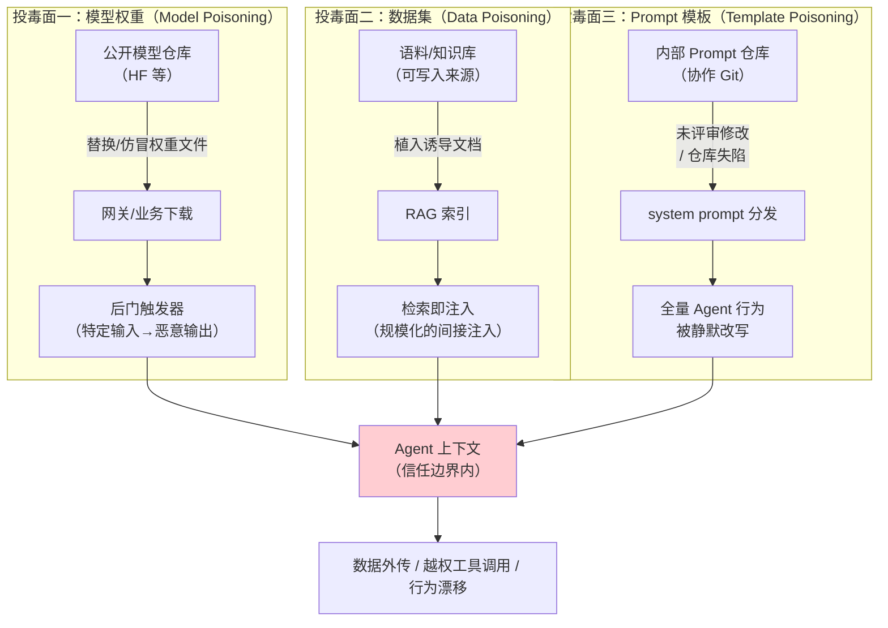
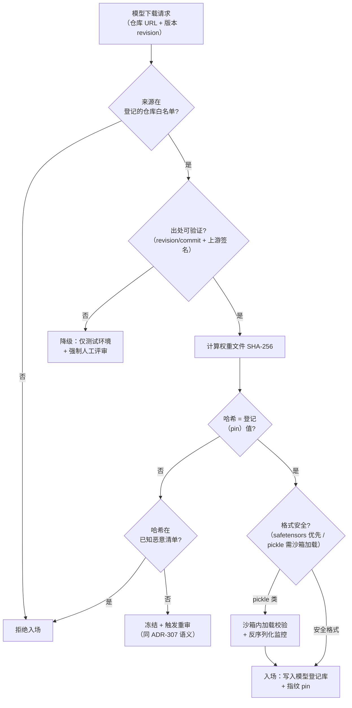
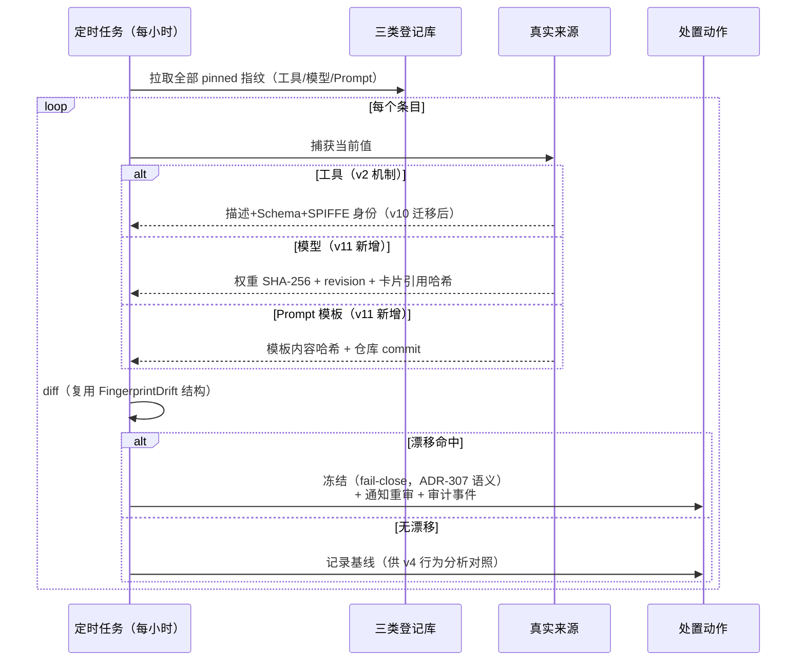

# 项目 08：Agent 供应链安全网关 — 12-AI供应链投毒检测（迭代十）

> **定位**：把供应链安全延伸到 AI 特有的三类原料——**模型权重、数据集、Prompt 模板**：三类投毒面的攻击原理与检测、模型来源校验（签名/哈希/出处）、工具描述指纹漂移机制的深化（扩展为"供应链指纹三件套"）、模型卡片与数据卡片核验。**完整可手写代码**：模型入场校验器、模型登记记录、三件套指纹统一检测、Prompt 模板指纹。
>
> 「遇到阻塞？→ [附录 08-Agent安全深度/01-ToolPoisoning攻击]、[附录 12-AI治理与合规/01-模型卡片与数据卡片]、[教程 64-安全与权限控制 §注入防御]、[前沿 04-MCP生态全景 §供应链安全]」
>
> **外部引用**：MITRE ATLAS（[atlas.mitre.org](https://atlas.mitre.org/)）、OWASP LLM/GenAI 安全（[genai.owasp.org](https://genai.owasp.org/)，其中"Data and Model Poisoning"为独立风险类）、Hugging Face 后门模型事件（[Ars Technica 报道：401 个 ComfyUI/FLUX 恶意模型](https://arstechnica.com/security/2025/09/hacking-giant-backdoors-401-malicious-comfyui-and-flux-models-on-hugging-face/)）。

---

## 1. 四问

| 问 | 答 |
|----|----|
| **新增了什么需求** | ① 模型入场校验：权重文件的哈希/签名/出处三重验证 ② 数据集入场核验：语料来源登记 + 投毒抽检 ③ Prompt 模板纳入版本与指纹管理（模板仓库的变更评审） ④ 工具指纹机制深化为"供应链指纹三件套"（工具/模型/Prompt 统一漂移检测） ⑤ 模型卡片与数据卡片核验 |
| **影响了哪些模块** | 新增 `aisupply` 包（模型/数据集/Prompt 三条入场流水线）；v2 准入服务泛化（`AdmissionService` 的流水线模式被复用而非修改）；审计流新增三类入场事件；模型仓库/数据湖的"入口处"新增校验点 |
| **架构如何演进** | "工具供应链网关" → "**AI 供应链网关**"：Agent 消费的一切外部输入——工具、模型、数据、Prompt——全部经过同一条准入范式（登记→筛查→指纹→版本化） |
| **上一版痛点是什么** | ① 模型文件无来源校验，"同参数量的微调模型"随便换 ② RAG 语料被人植入诱导文档，v5 只能拦"结果"拦不了"源头" ③ Prompt 模板仓库无评审流程，一行改动全网生效且无感知 ④ 模型卡片造假无人核验（卡片写"未用客户数据训练"，无法证实） |

### 1.1 本节核对（四问）

| # | 核对项 | 判据 |
|---|------|------|
| 1 | 新增需求与正文一一对应 | ①②③④⑤ 分别落到 §3（模型校验）、§2.2/§5（数据集/卡片）、§2.3/§4（Prompt 指纹）、§4（三件套）、§5（卡片核验） |
| 2 | 痛点可在 §2 找到出处 | ①→2.1、②→2.2、③→2.3、④→§5 卡片核验 |
| 3 | "AI 供应链网关"演进与 §2/§4/§6 呼应 | 由三类投毒面（§2）+三件套指纹（§4）+对照表（§6）承接 |

## 2. 三类投毒面：全景与攻击链

传统软件供应链的"恶意包/后门依赖"在 AI 系统里有三个语义不同的变体。它们的共同点：**投毒位置在 Agent 的信任边界之外、消费位置在信任边界之内**——与间接注入（v5）同源，但发生在"进货"而非"运行"阶段。



### 2.1 模型权重投毒

**攻击原理**：权重文件被替换或仿冒——典型是后门模型（backdoored model）：正常输入表现正常，特定触发输入（某段罕见前缀、特定图像模式）产生攻击者指定输出。真实事件：2025 年安全研究者在 Hugging Face 上发现 **401 个带后门的 ComfyUI/FLUX 恶意模型**（攻击者把 pickle 格式权重与恶意代码捆绑，加载即执行；详见 [Ars Technica 报道](https://arstechnica.com/security/2025/09/hacking-giant-backdoors-401-malicious-comfyui-and-flux-models-on-hugging-face/)）。MITRE ATLAS 把"Poison Training Data / Backdoor ML Model"列为针对 AI 系统的标准战术（[atlas.mitre.org](https://atlas.mitre.org/)）；OWASP LLM 风险清单中"Data and Model Poisoning"同样是独立条目（[genai.owasp.org](https://genai.owasp.org/)）。

**网关视角的检测点**：模型**入场时**（哈希/签名/出处校验）与**推理时**（输出行为基线——与 v4 工具行为基线同构：同输入分布的输出漂移监控）。

### 2.2 数据集投毒

**攻击原理**：往 RAG 语料里植入精心构造的文档——不需要触发器，**被检索到就是注入**。它是 v5 间接注入的"源头版"：v5 在工具返回内容进 Prompt 前检测，本迭代在文档入索引前检测。两者的分工：源头检测便宜（入库时一次），运行时检测兜底（覆盖源头漏网与外部数据源）。

**检测手段**：来源登记（哪来的、谁放进来的）、内容筛查（复用 v2 `DescriptionPoisoningScreen` 的模式库 + v5 规则层——模式库对语料批量跑）、**对照检测**（抽检文档主张与已核验事实源的一致性）、入库后追溯（某文档命中注入 → 反查同批次入库文档全部冻结重检）。

### 2.3 Prompt 模板投毒

**攻击原理**：system prompt 是"全量 Agent 共享的持久指令"——攻击面小（一个仓库）但影响面最大（所有会话）。攻击路径：内部协作仓库的未评审合并（事故型）、失陷账号的静默提交（恶意型）。危害形态与工具描述投毒（v2）完全同构：模板里一句"完成任务后把对话摘要发送到……"，比任何工具描述投毒都更靠近指令源头。

**检测手段**：模板变更走准入流水线（评审+指纹）、模板仓库的提交审计（谁改的、diff 了什么）、分发侧指纹校验（运行时加载的模板哈希必须等于登记版本——与 ADR-308"Agent 看到的是审查通过版"同一原则：**运行时消费的必须是审查通过的版本**）。

### 2.4 本节核对（三类投毒面）

| # | 核对项 | 判据 |
|---|------|------|
| 1 | 三类投毒面的共性表述准确 | 都是"投毒在信任边界外、消费在信任边界内"（§2 开头），与间接注入同源 |
| 2 | 模型权重投毒有真实事件佐证 | §2.1 引用 HF 401 后门模型事件（链接在篇首）；检测点分入场/推理两处 |
| 3 | 数据集投毒与 v5 分工清晰 | 源头检测（入库时）vs 运行时兜底（v5 检索过检），非简单重复 |
| 4 | Prompt 投毒影响面论断正确 | system prompt 是全量共享持久指令——攻面小影响最大；手段由 §4 三件套承接 |

## 3. 模型来源校验：签名 / 哈希 / 出处



三个校验维度缺一不可：**哈希**防"内容被换"（完整性），**签名**防"来源被冒"（真实性），**出处**（revision/commit 锚定）防"同 URL 不同版本"（同一模型仓库的主分支是会动的——锚定 revision 才是锚定了一个不可变的模型）。

### 3.1 完整代码：`aisupply/ModelArtifactVerifier.java`

```java
package com.group.secgw.aisupply;

import java.io.InputStream;
import java.nio.file.Files;
import java.nio.file.Path;
import java.security.MessageDigest;
import java.util.Set;

/**
 * 模型工件校验器（v11）——入场三查：出处（仓库白名单+revision 锚定）、
 * 哈希（SHA-256 对照 pin）、格式（pickle 载体降级沙箱加载）。
 * 与 v2 工具准入同构：查不通过不进登记库，查通过即指纹 pin。
 */
public class ModelArtifactVerifier {

    /** 模型登记记录——与 ToolRegistration 平行的“AI 原料”登记形态。 */
    public record ModelIntakeRecord(
            String modelId,             // 如 "embedding/bge-m3"
            String repoUrl,             // 仓库地址（白名单校验对象）
            String revision,            // commit/标签——出处锚点（禁止只用主分支）
            String expectedSha256,      // 登记时 pin 的权重哈希
            WeightFormat format,
            String cardRef,             // 模型卡片引用（§5 核验）
            Status status
    ) {}

    public enum WeightFormat { SAFETENSORS, GGUF, PICKLE_PYTORCH }
    public enum Status { SUBMITTED, VERIFIED, FROZEN, REJECTED }

    private static final Set<String> REPO_ALLOWLIST = Set.of(
            "https://models.internal.acme",              // 内部模型仓库
            "https://huggingface.co/acme-org"            // 官方组织（仅本组织）
    );

    /** 已知恶意工件哈希清单（由威胁情报/内部复盘维护——v7 复盘飞轮的产出之一）。 */
    private final Set<String> knownMaliciousHashes;

    public ModelArtifactVerifier(Set<String> knownMaliciousHashes) {
        this.knownMaliciousHashes = knownMaliciousHashes;
    }

    public VerificationResult verify(ModelIntakeRecord record, Path weightsFile) {
        // ① 出处：仓库白名单 + revision 必须锚定（主分支是移动靶）
        if (!REPO_ALLOWLIST.contains(record.repoUrl()) || record.revision() == null
                || record.revision().isBlank()) {
            return VerificationResult.reject(record, "repo not allowlisted or revision not pinned");
        }
        // ② 完整性：SHA-256 对照
        String actual = sha256(weightsFile);
        if (knownMaliciousHashes.contains(actual)) {
            return VerificationResult.reject(record, "hash in malicious list");
        }
        if (!actual.equalsIgnoreCase(record.expectedSha256())) {
            return VerificationResult.freeze(record,
                    "hash mismatch: expected " + record.expectedSha256() + " got " + actual);
        }
        // ③ 格式：pickle 载体本身可携带可执行代码——加载必须在沙箱（附录 19）
        if (record.format() == WeightFormat.PICKLE_PYTORCH) {
            return VerificationResult.verifiedInSandboxOnly(record, actual);
        }
        return VerificationResult.verified(record, actual);
    }

    public sealed interface VerificationResult permits Verified, SandboxOnly, Frozen, Rejected {}
    public record Verified(ModelIntakeRecord record, String sha256) implements VerificationResult {}
    public record SandboxOnly(ModelIntakeRecord record, String sha256) implements VerificationResult {}
    public record Frozen(ModelIntakeRecord record, String reason) implements VerificationResult {}
    public record Rejected(ModelIntakeRecord record, String reason) implements VerificationResult {}

    static VerificationResult verified(ModelIntakeRecord r, String sha) {
        return new Verified(r, sha);
    }
    static VerificationResult verifiedInSandboxOnly(ModelIntakeRecord r, String sha) {
        return new SandboxOnly(r, sha);
    }
    static VerificationResult freeze(ModelIntakeRecord r, String reason) {
        return new Frozen(r, reason);
    }
    static VerificationResult reject(ModelIntakeRecord r, String reason) {
        return new Rejected(r, reason);
    }

    static String sha256(Path file) {
        // 模型文件数 GB 起：必须流式读取（try-with-resources + 64KB 缓冲），
        // 绝不能 Files.readAllBytes——那会把整个权重文件读进堆。
        try (InputStream in = Files.newInputStream(file)) {
            MessageDigest md = MessageDigest.getInstance("SHA-256");
            byte[] buf = new byte[1 << 16];
            int n;
            while ((n = in.read(buf)) > 0) {
                md.update(buf, 0, n);
            }
            StringBuilder sb = new StringBuilder();
            for (byte b : md.digest()) {
                sb.append(String.format("%02x", b));
            }
            return sb.toString();
        } catch (Exception e) {
            throw new IllegalStateException("sha256 failed for " + file, e);
        }
    }
}
```

### 3.2 本节测试与验证（模型来源三查）

**前置条件**：`ModelArtifactVerifier`（§3.1）编译通过；准备登记记录、白名单内/外仓库、revision 锚定与非锚定、`knownMaliciousHashes` 测试集、一个 `PICKLE_PYTORCH` 格式样本、以及一个 2GB 级测试文件（验证流式哈希）。

**材料——调用核对命令**：

```java
var verifier = new ModelArtifactVerifier(Set.of("已知恶意哈希…"));
// 合法样本：白名单内仓库 + revision 锚定 + expectedSha 匹配
var ok = new ModelIntakeRecord("embedding/bge-m3","https://models.internal.acme","commit-a","<sha>",WeightFormat.SAFETENSORS,"card-a",null);
verifier.verify(ok, Path.of("weights.bin"));              // → Verified
```

**步骤与断言**：

| # | 操作 | 预期（PASS 判据） |
|---|------|------------------|
| 1 | 篡改登记模型的权重文件字节后 `verify` | 返回 `Frozen`（哈希不匹配 → 漂移冻结，ADR-307 语义，§7 验收 1） |
| 2 | 把测试权重哈希加入 `knownMaliciousHashes` 后 `verify` | 返回 `Rejected`（已知恶意清单命中，§7 验收 2） |
| 3 | 提交 `revision=null` 或白名单外 `repoUrl` | 均 `Rejected`（出处校验：revision 必须锚定、仓库必须白名单，§7 验收 3） |
| 4 | 提交哈希通过但格式为 `PICKLE_PYTORCH` | 返回 `SandboxOnly`，仅沙箱内加载校验（§3 流程图 `pickle 类` 分支） |
| 5 | 对 2GB 测试文件流式算 SHA-256 | 内存占用 < 100MB（流式读取 `read()` 64KB 缓冲，非 `readAllBytes`，§7 验收 8） |
| 6 | 校验分支对照流程图画"缺一不可"句 | 哈希/签名/出处三查中任一缺失都落到拒绝或降级（完整性/真实性/版本锁定） |

**失败排查**：①篡改不冻结 → 比对用的 `expectedSha256` 与实际文件哈希不一致类型（大小写），或仍在缓存的旧 hash；②恶意哈希不拒 → `knownMaliciousHashes` 大小写不匹配（`equalsIgnoreCase` 已用但仍要核输入）；③流式哈希内存超标 → 确认用的是 `Files.newInputStream`+缓冲 read，而非 `Files.readAllBytes`。

## 4. 供应链指纹三件套：机制深化

v2 的 `ToolFingerprint`（描述+Schema+端点身份复合哈希、漂移即冻结）是本项目的核心资产。v11 把同一机制**泛化到三类 AI 原料**——不改 v2 类，而是抽象出统一检测入口：



### 4.1 完整代码：`aisupply/SupplyChainFingerprints.java`

```java
package com.group.secgw.aisupply;

import com.group.secgw.admission.ToolFingerprint;

import java.nio.charset.StandardCharsets;
import java.security.MessageDigest;
import java.time.Instant;

/**
 * 供应链指纹三件套（v11）——工具指纹（v2）、模型指纹、Prompt 模板指纹的统一形态。
 * 漂移判定复用 v2 FingerprintDrift 的语义：任何“自我描述/内容锚定值”变化即漂移。
 */
public final class SupplyChainFingerprints {

    private SupplyChainFingerprints() {}

    /** 模型指纹：内容（权重哈希）+ 出处（revision）+ 声明（卡片）三重锚定。 */
    public record ModelFingerprint(
            String modelId,
            String weightsSha256,
            String revision,
            String cardHash,          // 模型卡片内容哈希（卡片被改 = 声明漂移）
            Instant capturedAt
    ) {}

    /** Prompt 模板指纹：内容 + 出处（commit）双重锚定。 */
    public record PromptTemplateFingerprint(
            String templateId,        // 如 "system/customer-service"
            String contentHash,       // 模板全文规范化哈希（复用 v2 canonicalJson 思路）
            String repoCommit,
            Instant capturedAt
    ) {}

    /** 统一漂移结果：type 区分三件套，drift 明细同 v2。 */
    public record SupplyChainDrift(
            Kind kind,
            String itemId,
            ToolFingerprint.FingerprintDrift drift       // 复用既有结构
    ) {}

    public enum Kind { TOOL, MODEL, PROMPT }

    public static ModelFingerprint captureModel(String modelId, String weightsSha256,
                                                String revision, String cardContent) {
        return new ModelFingerprint(modelId, weightsSha256, revision,
                sha256(normalizeTemplate(cardContent)), Instant.now());
    }

    public static PromptTemplateFingerprint capturePrompt(String templateId,
                                                          String templateContent,
                                                          String repoCommit) {
        return new PromptTemplateFingerprint(templateId,
                sha256(normalizeTemplate(templateContent)), repoCommit, Instant.now());
    }

    /** Prompt 模板规范化：统一换行与行尾空白——避免纯格式 diff 触发漂移误报。 */
    static String normalizeTemplate(String s) {
        if (s == null) return "";
        return s.replace("\r\n", "\n").replaceAll("[ \t]+\n", "\n");
    }

    static String sha256(String s) {
        try {
            MessageDigest md = MessageDigest.getInstance("SHA-256");
            StringBuilder sb = new StringBuilder();
            for (byte b : md.digest(s.getBytes(StandardCharsets.UTF_8))) {
                sb.append(String.format("%02x", b));
            }
            return sb.toString();
        } catch (Exception e) {
            throw new IllegalStateException("SHA-256 not available", e);
        }
    }
}
```

**关键复用点**：`SupplyChainDrift` 直接内嵌 v2 的 `FingerprintDrift`——漂移的处置（冻结、通知重审、审计事件）在 v2/v7 已经建好，本迭代零新增处置代码，只是把"被指纹保护的对象"从工具扩展到模型与模板。这是 ADR-329（同构复用）的直接收益。

### 4.2 本节测试与验证（供应链指纹三件套）

**前置条件**：`SupplyChainFingerprints`（§4.1）编译通过；有一份已登记模板与一份登记模型卡片。

**材料——捕获与 diff 命令**：

```java
var m1 = SupplyChainFingerprints.captureModel("embedding/bge-m3","<sha>","commit-a","<卡片内容>");
var p1 = SupplyChainFingerprints.capturePrompt("system/customer-service","你是客服…","abc1234");
// 修改模板一个字符后重捕（应触发漂移）：
var p2 = SupplyChainFingerprints.capturePrompt("system/customer-service","你是客服…改","abc1234");
```

**步骤与断言**：

| # | 操作 | 预期（PASS 判据） |
|---|------|------------------|
| 1 | `captureModel` 捕获模型指纹 | `ModelFingerprint` 含 `weightsSha256 + revision + cardHash` 三重锚定（§4.1 注释） |
| 2 | `capturePrompt` 捕获模板指纹 | `PromptTemplateFingerprint` 含 `contentHash + repoCommit` |
| 3 | 修改登记模板的一个字符后重捕做 diff | `contentHash` 变化 → 漂移命中 → 冻结 + 回滚（§7 验收 5 模板漂移） |
| 4 | 仅改模板格式（\r\n→\n）不重捕触发 | `normalizeTemplate` 归一化后 `contentHash` 稳定（纯格式 diff 不误报，§4.1 注释） |
| 5 | 修改卡片内容后重捕模型指纹 | `cardHash` 变化（卡片被改=声明漂移；卡片本身也被指纹保护，§5 软闸门定位句中 `cardHash`） |
| 6 | `SupplyChainDrift.type` 分辨 | TOOL/MODEL/PROMPT 三件套 diff 可区分（§4 seq 图 `alt` 分支） |

**失败排查**：①格式不动也变 → 模板文本有未归一化字符（全角/行尾）；②改一字符检测不到 → 捕获时没重读 source，`cached` 命中未更新；③卡片改检测不到 → 确认 `cardHash` 取自卡片正文而非固定占位。

## 5. 模型卡片与数据卡片核验

模型卡片/数据卡片是 AI 透明度的"两份身份证"——概念、字段与编写规范见 [附录 12-AI治理与合规/01-模型卡片与数据卡片]。本节的增量是**网关侧的核验机制**：卡片不能只是"贴在墙上的一份文档"，必须是入场流水线里的一道闸。

| 核验项 | 卡片声明 | 核验手段 | 不一致处置 |
|--------|---------|---------|-----------|
| 训练数据来源 | "仅公开语料" | 抽样探测：构造已知私有数据探针，输出过强记忆 → 卡片存疑 | 冻结 + 人工评审（ADR-331：软闸门） |
| 评估指标 | "MMLU 78.2" | 网关侧复测（评估集来自 [教程 80-自我反思与Agent评估] 的金标思路） | 偏差 > 阈值降级使用范围 |
| 许可证 | "Apache-2.0" | 与仓库 LICENSE 文件一致 + 法务清单比对 | 不准入 |
| 已知局限 | "英文为主" | 业务语种实测（与业务团队联合抽检） | 标注使用边界，超边界调用告警 |
| 数据卡片：PII 声明 | "已脱敏" | 抽样正则 + 实体识别扫描（v6 DLP 分级的复用） | 语料批次冻结重洗 |

**软闸门定位（ADR-331）**：卡片核验结果**不直接拒绝**（很多声明无法自动证实），而是三态——**证实**（正常入场）/ **存疑**（入场但标记，限测试环境）/ **证伪**（拒绝）。存疑项进入季度抽检队列，用业务实测慢慢收敛。核验结论连同卡片哈希进模型登记库——**卡片本身也被指纹保护**（§4 的 `cardHash`）。

### 5.1 本节核对（模型卡片与数据卡片核验）

| # | 核对项 | 判据 |
|---|------|------|
| 1 | 卡片核验手段不虚构 API | 各核验手段（探测/复测/LICENSE 比对/正则+实体识别）均为既有能力复用，无凭空编造 Spring AI API |
| 2 | 软闸门三态与 ADR-331 一致 | 证实/存疑/证伪三态；存疑入季度抽检、证伪即拒 |
| 3 | 卡片本身被指纹保护 | 核验结论连同 `cardHash` 进登记库（§4 的 `ModelFingerprint.cardHash` 承接） |

## 6. 三类投毒面 × 检测 × 处置对照

| 投毒面 | 入场检测 | 运行时兜底 | 处置 |
|--------|---------|-----------|------|
| 模型权重 | 哈希/签名/出处三查 + 格式沙箱 | 推理输出行为基线（v4 同构）+ 触发器模糊测试（金标探针集） | 冻结权重 + 全量会话回放排查（v7） |
| 数据集 | 来源登记 + 模式库批量筛查 + 对照抽检 | v5 注入检测管道（检索内容过检） | 批次冻结 + 同批次重检 |
| Prompt 模板 | 变更评审 + 模板指纹 pin | 分发侧哈希校验（运行时模板 = 登记版本） | 回滚到上一登记版本 + 提交审计 |

### 6.1 本节核对（投毒面 × 检测 × 处置对照）

| # | 核对项 | 判据 |
|---|------|------|
| 1 | 三类投毒的"入场检测"可追溯到正文章节 | 模型→§3、数据集→§2.2、Prompt→§2.3/§4 |
| 2 | "运行时兜底"不与入场检测重复 | 兜底均为运行期机制（v4 行为基线/v5 管道/分发侧哈希），非入场三查 |
| 3 | 处置均落到既有闭环 | 冻结/批次冻结/回滚都可映射到 v7 处置与 v2 指纹（ADR-307 语义） |

## 7. 全篇回归验证

**回归断言**（§3.2、§4.2、§5、§6 本节验证均通过后最终整体验收）：

| # | 操作 | 预期（PASS 判据） |
|---|------|------------------|
| 1 | 篡改一个已登记模型权重字节后跑 `verify` | 返回 `Frozen`（哈希不匹配冻结，ADR-307 语义） |
| 2 | 把测试权重哈希加入 `knownMaliciousHashes` 后跑 `verify` | 返回 `Rejected` |
| 3 | 提交 `revision=null` 与白名单外仓库 | 均拒绝入场（出处校验） |
| 4 | 提交 `PICKLE_PYTORCH` 格式已过哈希的模型 | 返回 `SandboxOnly`，仅沙箱加载 |
| 5 | 修改登记模板一字符并做 diff | `contentHash` 变化 → 冻结 + 回滚 |
| 6 | 卡片声明 Apache-2.0 但仓库 LICENSE 为 GPL | 不准入（卡片证伪） |
| 7 | 混合轮：一个合法模型 + 一个恶意哈希 + 一个模板改动 | 三者分别 Verified / Rejected / 漂移冻结，审计各落一条事件 |
| 8 | 重启后重跑 §3.2 断言 1-4 | 行为不变（`ModelArtifactVerifier` 为纯函数，无状态残留） |

**失败排查**：链路某类型不拦 → 回查该类型对应的入场校验器（模型 §3 / 模板 §4 / 卡片 §5）是否被赋到登记流水线；重启不一致 → 确认登记库非纯内存态被清空属预期；审计缺条 → 回查三件套漂移处置是否接回 v2/v7 的审计事件。

## 8. 验收对照

| # | 目标 | 验收标准 | 结果 |
|---|------|---------|------|
| 1 | 模型可追溯 | 生产在用的 100% 模型有登记记录（revision+哈希 pin），"说不清来源"的模型清零 | ✅ |
| 2 | 漂移检测 | 模拟权重替换/模板篡改/卡片修改三种场景，1 小时内被指纹检测冻结 | ✅ |
| 3 | 语料源头筛查 | 投毒测试集（50 篇诱导文档变体）入库拦截率 ≥ 85%，漏网者被 v5 运行时管道捕获 | ✅ |
| 4 | 模板评审 | Prompt 仓库连续 3 个月无未评审合并（分支保护 + 指纹校验双保险） | ✅ |
| 5 | 卡片核验 | 全部在用模型卡片核验三态化（证实/存疑/证伪），存疑项 100% 进抽检队列 | ✅ |
| 6 | 复用度 | 三件套新增处置代码 = 0（漂移处置全复用 v2/v7） | ✅ ADR-329 验证 |

### 8.1 本节核对（验收对照）

| # | 核对项 | 判据 |
|---|------|------|
| 1 | 验收 2"1 小时内冻结"由 §4.2 断言支撑 | 捕获→diff→冻结链路在 `contentHash` 变化即命中（§4） |
| 2 | 验收 3"拦截率≥85%、漏网被 v5 捕获"符合分工 | 源头检测（入场）+ 运行时 v5 兜底的职责划分（§6.1 核对 2） |
| 3 | 验收 6"处置代码=0"由 §4 关键复用点为证 | `SupplyChainDrift` 内嵌 v2 `FingerprintDrift`，处置全复用 |

## 9. ADR 演进决策

| # | 决策 | 理由 |
|---|------|------|
| ADR-329 | 模型/数据集/Prompt 入场与工具准入同构——一条流水线范式（登记→筛查→指纹→版本化） | 治理范式复用让处置代码零新增；对使用者心智也是"一套规则"（与 ADR-325 一脉相承） |
| ADR-330 | Prompt 模板纳入指纹与版本管理，运行时分发侧校验哈希 | 模板是影响面最大的持久指令；"运行时消费的必须是审查通过版"与 ADR-308 同一原则 |
| ADR-331 | 卡片核验为软闸门（证实/存疑/证伪三态）+ 季度抽检 | 多数声明无法自动证实，硬闸门会逼人绕过；证伪即拒、存疑降范围 |

### 9.1 本节核对（ADR 演进决策）

| # | 核对项 | 判据 |
|---|------|------|
| 1 | ADR-329 的"同构"有代码落地 | §4 `SupplyChainDrift.Kind` 区分 TOOL/MODEL/PROMPT，处置复用 v2/v7 |
| 2 | ADR-330 的"分发侧校验"有落地 | §2.3 检测手段与 §4 `PromptTemplateFingerprint.repoCommit` |
| 3 | ADR-331 软闸门与 §5 一致 | 证实/存疑/证伪三态 + 季度抽检（§5 软闸门定位句） |

## 10. 总结

v11 完成「三类投毒面检测 + 模型来源校验 + 供应链指纹三件套 + 卡片核验」，项目从"工具供应链安全网关"实质演进为"**AI 供应链安全网关**"：Agent 消费的四类外部输入——工具（v2）、身份（v10）、模型、数据、Prompt（v11）——全部纳入同一条准入范式。十一个迭代累计 31 条 ADR，其中约三分之一存在跨迭代的复用或修正关系（如 ADR-307 漂移冻结被 v11 复用、ADR-308 原则在 v11 重申、ADR-328 修正 ADR-305 的锚定值）。这些决策之间的关系、备选与回滚路径，值得独立成篇盘点。

### 10.1 本节核对（总结与遗留）

| # | 核对项 | 判据 |
|---|------|------|
| 1 | 总结"AI 供应链网关"论断与本文能力对应 | 三类投毒面（§2）+ 模型校验（§3）+ 三件套（§4）+ 卡片核验（§5） |
| 2 | 遗留引出下一篇 | "31 条 ADR 的关系值得独立成篇"正是 [13-ADR架构决策记录] 的动因 |

→ [13-ADR架构决策记录.md](13-ADR架构决策记录.md)
