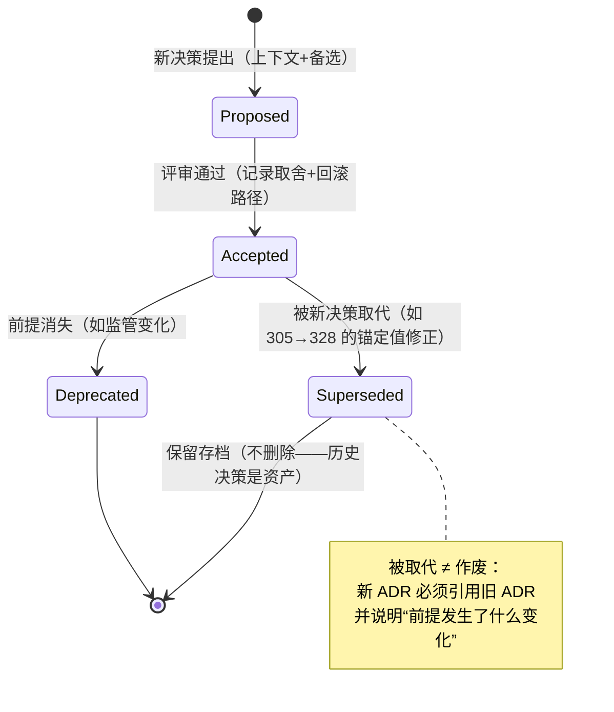
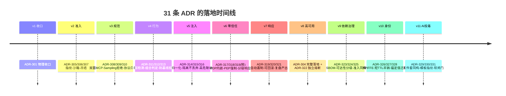
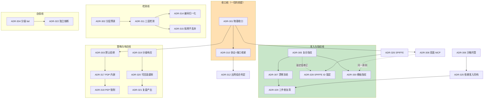

# 项目 08：Agent 供应链安全网关 — 13-ADR架构决策记录

> **定位**：把项目 08 从 00 到 12 的全部架构决策汇集成**决策资产**——每条记录决策上下文、备选方案、取舍理由与可回滚性。这是工业项目的"为什么档案"：后人（或几个月后的你）改架构时，能知道"当时为什么这么定"、哪些决策之间互相锁死、动哪一条要连带评估哪几条。读者画像：想理解项目 08 每个关键决策"为什么"的读者，以及要把它当 ADR 写作范式复用的架构师。前置阅读：[00-需求分析与架构设计](00-需求分析与架构设计.md)、[附录 08-架构决策方法论/00-ADR架构决策记录]。
>
> 「遇到阻塞？→ [附录 08-架构决策方法论/00-ADR架构决策记录 全篇]」

---

## 1. 四问

| 问 | 答 |
|----|----|
| **新增了什么需求** | ① 十一个迭代、31 条正式 ADR 散落各篇，需要一份**单点可查的总账** ② 决策之间的**依赖与修正关系**（谁复用谁、谁 supersede 谁）无处呈现 ③ 新成员接手时需要"决策上下文"而不是只看结论 ④ 为 [14-工业前沿与演进方向](14-工业前沿与演进方向.md) 的演进评估提供基线 |
| **影响了哪些模块** | 不改任何代码与既有决策——本文是**只读资产**；后续新决策按 §7 规范登记 |
| **架构如何演进** | 决策从"散落在迭代篇末尾的表格"升级为"有生命周期管理的决策资产"（Proposed → Accepted → Superseded/Deprecated） |
| **上一版痛点是什么** | ① ADR 编号在 01 篇出现过"305-初/307-初"预编号又被 v2 正式占用，语义有歧义 ② ADR-304 在 v8 才"完整落地"、ADR-305 的锚定值在 v10 被 ADR-328 修正——这类演进关系只有通读全文才能拼出来 ③ 无总账导致"改一处不知道牵动哪几条" |

## 2. ADR 的价值与生命周期

ADR（Architecture Decision Record）的最小价值主张：**架构决策的半衰期比代码长**。代码可以重构，但"为什么当初不用那个方案"若不落档，半年后一定会被重新提出、重新争论、重新踩坑。

**本项目编号说明**：正式编号 ADR-301 起连续分配；01 篇曾以"ADR-305-初/307-初"作预编号（审计全字段埋点、凭证不落地），后分别定型为 ADR-305（v2）与 ADR-307（v2）——两条"初"决策的实质内容已并入 §3 总账的对应条目备注。

## 3. ADR 总账（31 条）

| # | 决策（一句话） | 落地 | 状态 |
|---|--------------|------|------|
| ADR-301 | 强制收口：网络层 egress 白名单阻断私连（物理约束，非流程约定） | v1 | ✅ 采纳（v2 由 310 收紧） |
| ADR-302 | 检测分层：确定性规则优先、模型检测兜底（预录） | 00 预录 | ✅ 由 311 细化 |
| ADR-303 | deny-by-default 白名单策略 | v6 | ✅ 采纳 |
| ADR-304 | 分级 fail-open/close：检测层按评级、策略/审计层一律 fail-close | v8 完整落地 | ✅ 采纳 |
| ADR-305 | 工具指纹 = 描述+Schema+端点身份的复合哈希 | v2 | ✅ 锚定值被 328 修正 |
| ADR-306 | 社区工具一律沙箱托管，不信任自述 | v2 | ✅ 采纳 |
| ADR-307 | 指纹漂移即冻结（fail-close） | v2 | ✅ 被 v11 复用 |
| ADR-308 | 双面 MCP 网关，Agent 只见审查通过版描述 | v3 | ✅ 原则在 v11 重申 |
| ADR-309 | Sampling 高级能力默认拒绝 | v3 | ✅ 采纳 |
| ADR-310 | egress 白名单按协议+端口收紧（只封 IP 有缝） | v3 | ✅ 采纳 |
| ADR-311 | 检测三层：规则(每调用)/分类器(批)/LLM(告警复核) | v4 | ✅ 采纳 |
| ADR-312 | 数据外传组合判定：敏感内容 × 出网能力 | v4 | ✅ 采纳 |
| ADR-313 | 行为基线排除已判异常事件（防 boiling frog） | v4 | ✅ 采纳 |
| ADR-314 | 注入检测先归一化（实体/全角/零宽）再匹配 | v5 | ✅ 采纳 |
| ADR-315 | 注入内容隔离+标注而非丢弃 | v5 | ✅ 采纳 |
| ADR-316 | 注入状态联动高危动作审批 | v5 | ✅ 采纳 |
| ADR-317 | PDP 内嵌网关、毫秒级；策略版本化热更新 | v6 | ✅ 采纳 |
| ADR-318 | 参数约束网关 PEP 强制（SQL 语法级解析先行） | v6 | ✅ 采纳 |
| ADR-319 | 高危事件自动遏制、低危进人工队列 | v7 | ✅ 采纳 |
| ADR-320 | 遏制动作全网关范围、可审计、可回滚 | v7 | ✅ 采纳 |
| ADR-321 | 复盘必须有产出物（规则/策略变更）才关闭 | v7 | ✅ 采纳 |
| ADR-322 | 每个检测组件独立熔断器 | v8 | ✅ 采纳 |
| ADR-323 | SBOM 主格式 CycloneDX，合规交付转换 SPDX | v9 | ✅ 采纳 |
| ADR-324 | 漏洞响应按可达性×CVSS×在野利用分级 | v9 | ✅ 采纳 |
| ADR-325 | 依赖准入与工具准入同构 | v9 | ✅ 采纳 |
| ADR-326 | 服务身份用 SPIFFE/SVID，弃共享长证书 | v10 | ✅ 采纳 |
| ADR-327 | 吊销 = 短 TTL + 注册表删除（不建 CRL/OCSP） | v10 | ✅ 采纳 |
| ADR-328 | 指纹身份维度从证书指纹迁移到 SPIFFE ID | v10 | ✅ Supersede 305 的锚定值 |
| ADR-329 | 模型/数据/Prompt 入场与工具准入同构 | v11 | ✅ 采纳 |
| ADR-330 | Prompt 模板纳入指纹与版本管理 | v11 | ✅ 采纳 |
| ADR-331 | 卡片核验为软闸门（三态）+ 季度抽检 | v11 | ✅ 采纳 |

## 4. 决策时间线与关系

**读图要点**：实线是"依赖/细化"，虚线是"修正/同构复用"。改动上游决策（如 ADR-301）时，沿实线评估全部下游；虚线则提示"同名原则在多处落地，改原则要同步多处实现"。

## 5. 关键决策详解（上下文 / 备选 / 取舍 / 可回滚）

### 5.1 ADR-301 + 310：收口必须是物理的，且按协议收紧

- **上下文**：47 个工具 12 个来源不明，首要问题是"流量根本不由你管"。收口是网关存在的前提——没有收口的网关是"自愿收费站"。
- **备选**：① 流程约定（文档要求走网关）② 网络层 IP 白名单 ③ 网络层协议+端口白名单。
- **取舍**：① 对善意违规有效、对恶意绕过无效（威胁模型里恰有后者）；② 封不住"往 443 端口上的私接 HTTP 长连接"（v2 实际发生的裂缝）；③ 加上协议层识别后缝隙闭合。**安全边界必须建在攻击者无法绕过的层：网络 > 平台 > 代码约定 > 文档约定**。
- **可回滚**：egress 白名单是基础设施配置，回滚 = 放宽 ACL；但每放宽一条都应在审计流留痕（收口的"严格度"本身要可观测）。

### 5.2 ADR-304：旁路可活 vs 串联全检（安全组件的可用性哲学）

- **上下文**：v8 前，网关是唯一路径且所有检测串行在热路径——CIO 一问"网关挂了全集团瘫痪吗"暴露了根本悖论：安全组件成为最大单点。
- **备选**：① 全串联、fail-close（安全绝对优先）② 全旁路镜像、fail-open（可用性绝对优先）③ 按功能分维的分级策略。
- **取舍**：① 的故障模式是"全停"，且检测误杀会被业务压力拆掉（见 09 篇 §2.3 安全成本公理）；② 等于审计与策略形同虚设；③ 把"安全"拆成检测（概率性防御）/策略（授权边界）/审计（合规底线）三维，各维独立定可用性——检测层按工具评级 fail-open/close，策略与审计一律 fail-close。
- **可回滚**：降级策略是配置（`DegradePolicy`），从 fail-close 放宽到 fail-open 是一行配置 + 一个审计事件；反向收紧同理。**"安全不是一个整体"是本 ADR 的可迁移结论**。

### 5.3 ADR-305 + 328：指纹复合哈希，与它的锚定值修正（签名链设计）

- **上下文**：工具静默更新无感知（v1 痛点③）。需要一个"任何自我描述变化都能被看见"的锚定机制。
- **备选**：① 只锚定端点证书指纹 ② 只锚定描述文本 ③ 描述+Schema+端点身份复合哈希。
- **取舍**：① 看不见描述投毒（行为语义漂移不可见）；② 看不见"同一描述换了个服务"；③ 覆盖两类漂移。**修正史**：v10 引入证书自动轮换后，"端点身份 = 证书指纹"每小时误报冻结全网工具——ADR-328 把锚定值迁到 SPIFFE ID（工作负载身份，轮换不变）。**教训**：锚定值必须选"你要检测的那个变化"的稳定投影——想检测"换了工作负载"，就不能锚定会定期换的东西。
- **可回滚**：锚定语义不允许双轨并存（迁移期 `identityScheme=LEGACY` 标记，新登记禁用旧语义）；回滚 = 全量重 pin，成本一次性。

### 5.4 ADR-306：沙箱分级——不信任就隔离

- **上下文**：社区工具无签名能力，"信任它说的"没有意义。
- **备选**：① 拒绝一切社区工具 ② 代码审查后放行 ③ 托管代理模式（沙箱内运行，网关代理沙箱实例）。
- **取舍**：① 牺牲生态价值；② 审查成本高且漏检率不可控（投毒可以藏在运行时行为里）；③ 信任"行为"而非"承诺"——网络白名单出向、文件系统隔离，配合 v4 数据流向检测。分级待遇（A/B/C/R）让隔离强度匹配来源风险。
- **可回滚**：C 级工具升级为 B（如厂商补签）= 重走准入 + 重新评级，沙箱下线是常规运维操作。

### 5.5 ADR-308：双面 MCP 网关（对内 Server、对外 Client）

- **上下文**：协议不统一导致收口裂缝（v2 痛点）；且 MCP 工具的描述是动态数据——先过审再投毒是时间线攻击。
- **备选**：① 透明代理（透传 MCP，只做 L4 审计）② SDK 侧收口（给业务 Agent 发统一 SDK）③ 网关做成双面 MCP（对业务 Agent 是 Server，对真实工具是 Client）。
- **取舍**：① 看不见协议语义，策略与注入检测无处落脚；② "约定走 SDK"违背 ADR-301 的物理性原则；③ 网关成为协议的唯一权威：目录由登记库生成（审查版），真实描述漂移被指纹冻结——**任何进 LLM 上下文的文本都要问信任链**。
- **可回滚**：双面是网关的结构属性，回滚意味着放弃语义层检测（退回①）；实际不会发生，但"对某个工具降级为透传"可逐工具配置（配合 v8 降级矩阵）。

### 5.6 ADR-311（细化 302）：检测三层的成本架构

- **上下文**：每次调用全量检测的延迟成本会逼业务绕过网关——安全机制成本超阈值时会被"合法地"绕过。
- **备选**：① 全规则（零成本、低召回）② 全 LLM 判定（高召回、不可负担）③ 三层：规则每调用、分类器本地毫秒级、LLM 只复核可疑（实测 3-5% 流量）。
- **取舍**：③ 的本质是**频率×成本的匹配**。三层各自的升级条件（L1 命中→L2、L2 可疑→L3）在 05 篇有完整实现。
- **可回滚**：层间是"逐级上调"关系，关掉 L3 只损失召回不损失可用性（进入 ADR-304 检测维的 fail-open 语义）。

### 5.7 ADR-315：隔离而非丢弃（误杀的业务可见性）

- **上下文**：注入检测有误杀率；丢弃误杀内容 = 业务静默失败，用户困惑、排查无门。
- **备选**：① 直接丢弃（安全绝对干净）② 隔离+标注（Agent 可告知用户"部分内容被隔离"）。
- **取舍**：② 用少量复杂度换"安全机制的透明度"——黑盒式拦截最终会被业务压力拆掉（安全机制能在组织里活多久，取决于被误伤的人有没有申诉通道）。
- **可回滚**：隔离器是管道中的一个组件（`ContentSanitizer`），替换为直通即回滚；隔离内容保留原文（审计可回放）。

### 5.8 ADR-317：PDP 内嵌 vs 外置（零信任的边界在哪）

- **上下文**：三维策略评估每毫秒都在热路径上发生。
- **备选**：① 外置 PDP 服务（标准零信任架构的教科书形态）② 内嵌网关进程、策略版本化热更新。
- **取舍**：① 每次评估一次 RPC，延迟会逼业务绕过网关（与 5.6 同一个公理）；② 毫秒级评估，代价是策略一致性要靠"版本化+热更新"保证而非"集中式单点"保证。**教科书架构与热路径现实冲突时，选热路径——但要把教科书的目标（一致性）用别的手段补回来**。
- **可回滚**：PDP 实现隔离在 `ZeroTrustPdp` 接口后，外置化=换实现+加缓存，接口不变。

### 5.9 ADR-320 + 321：取证留存与复盘纪律（响应线的闭环）

- **上下文**：检测命中后的处置曾全靠人；处置动作本身可能伤业务（隔离错了怎么办）。
- **备选**：① 全自动处置 ② 全人工 ③ 高危自动+低危人工队列，且遏制动作全网关范围、可审计、**可回滚**；复盘必须产出规则/策略变更才算关闭。
- **取舍**：③ 的"复盘产出物"是安全能力进化的泵——没有产出物的复盘是追责会，不是学习会。取证留存的留存期与范围由合规驱动（呼应 [教程 25-历史记录持久化与合规 §合规留存]）。
- **可回滚**：每个遏制动作自带反操作（隔离↔解除、封禁↔解封），回滚动作同样进审计流。

### 5.10 ADR-326 + 327：SPIFFE 身份与"短 TTL 即吊销"

- **上下文**：共享长证书把身份退化为静态口令（过期即全停、共享即不可审计、泄露窗口一年）。
- **备选**：① 更长的证书+更严的发放流程 ② 自建 CA+自动轮换 ③ SPIFFE/SPIRE 生态 + 短 TTL。
- **取舍**：① 治标；② 重复造轮子且要自己解决节点证明；③ 身份生命周期自动化，吊销转化为时间问题（删注册表，TTL 内失效）。代价是引入 SPIRE 运维面与全部工作负载的接入改造。
- **可回滚**：SPIFFE 是身份**来源**的替换，网关消费的是"解析后的身份"（`SpiffeIdentity`）——回退到证书 CN 解析只动一个解析器（v1 的 `fromCertificateCn` 仍在）。

### 5.11 ADR-329：入场同构——一条流水线管四类原料

- **上下文**：v9 发现依赖准入与工具准入是同一条心智模型；v11 把模型/数据/Prompt 也纳入。
- **备选**：① 每类原料独立流程（专项专办）② 统一准入范式（登记→筛查→指纹→版本化）参数化复用。
- **取舍**：① 流程数量随原料类型线性增长，使用者要在多套规则间切换（钻空子的缝隙）；② 处置代码零新增（v11 的漂移处置全复用 v2/v7），心智一套。风险是"为统一而统一"会抹平原料差异——用**每类的筛查器不同**（描述模式库/评分卡/哈希三查/内容筛查）来保留差异。
- **可回滚**：范式是组织层面的，回滚=某类原料退出统一流水线（保留其登记数据，处置逻辑独立演化）。

## 6. 决策密度与模式观察

把 31 条决策平铺后能看到三个**跨决策模式**（这是单篇迭代里看不见的）：

1. **"物理优先"出现三次**：301（收口）、318（PEP 强制）、326（身份自动化）——凡"约束"必建在难以绕过的层。
2. **"同构复用"出现三次**：325（依赖≈工具）、329（模型/Prompt≈工具）、308 原则在 330 重申——好范式会被反复调用，这是架构"少规则、强规则"的来源。
3. **"修正链"只有一条但最贵**：305 → 328（锚定值修正）。修正型 ADR 的价值在于**把教训显性化**：锚定值要选稳定投影——这条教训直接写进了 v11 的卡片核验与模板指纹设计（都先问"这个值会不会自己变"）。

## 7. ADR 维护规范（本项目版）

写作纪律（与 [附录 08-架构决策方法论/00-ADR架构决策记录] 的通用模板对齐后裁剪）：

| 项 | 规则 |
|----|------|
| 编号 | `ADR-3NN` 连续分配，不复用、不改写已 Accepted 的编号 |
| 结构 | 上下文（问题与约束）/ 备选（≥2，含否决理由）/ 取舍（选定的代价）/ 可回滚（回滚=改什么、成本多大） |
| 状态 | 只能向后迁移：Proposed → Accepted → Superseded/Deprecated；Supersede 必须双向引用并写明"前提变化" |
| 落点 | 迭代篇末尾的 ADR 表是"出生登记"；本文是唯一总账，两者不一致以本文为准 |
| 时机 | 决策被**首次质疑**时就该有 ADR——被质疑说明上下文不为团队共有 |

## 8. 总结

31 条决策、五条主线（收口/检测/准入指纹/策略响应/自保）+ 两轮深化（供应链治理/服务身份），构成项目 08 的完整决策资产。最有复用价值的判断力浓缩在 09 篇的五个复盘点与本文 §6 的三个跨决策模式里——特别是**安全成本公理**（成本超阈值的安全机制会被合法绕过）与**锚定值选稳定投影**（305→328 的教训）。决策资产盘清后，下一个问题是：这套体系在 2026 年的工业实践里处于什么位置、行业正在往哪走——这正是收官篇要回答的。

→ [14-工业前沿与演进方向.md](14-工业前沿与演进方向.md)
