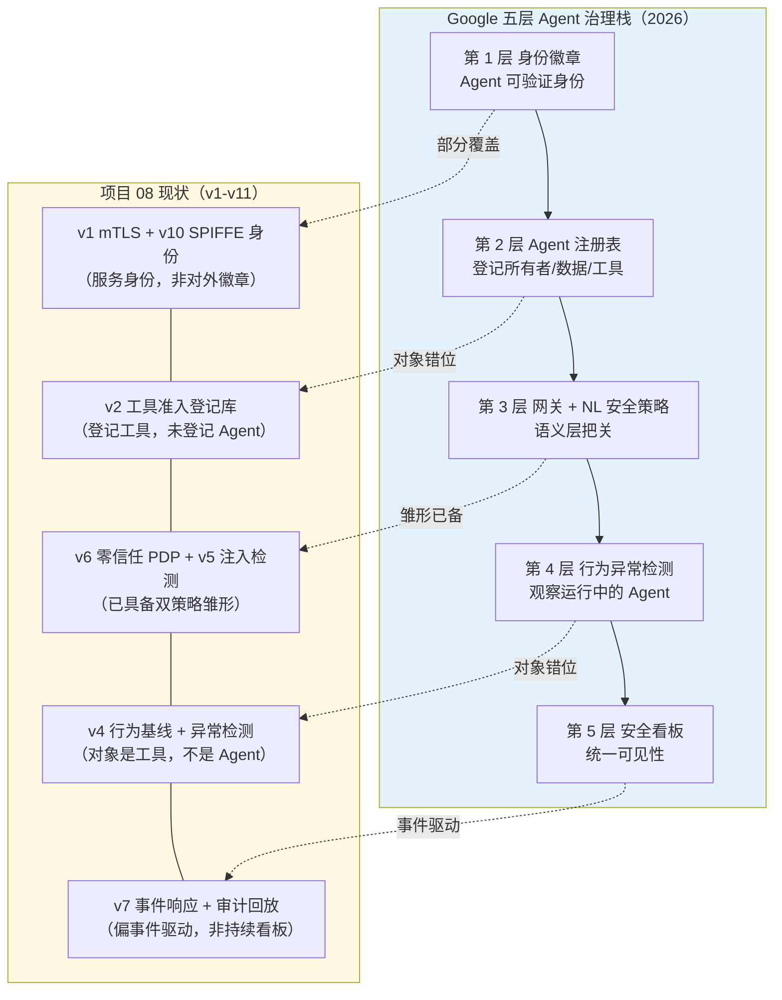
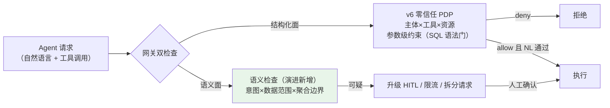
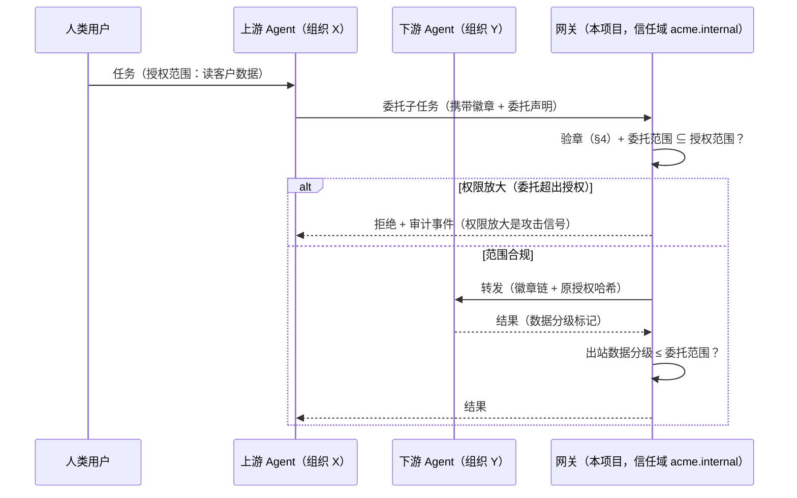
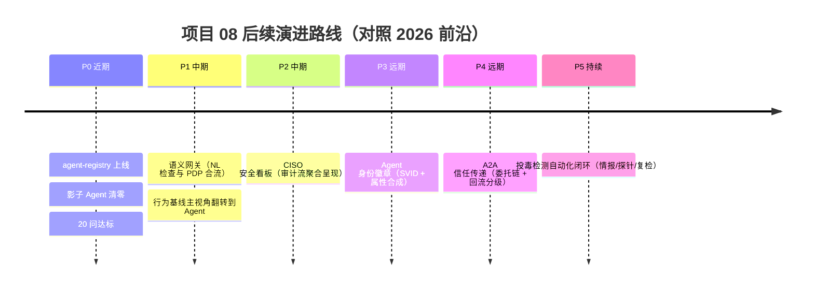

# 项目 08：Agent 供应链安全网关 — 14-工业前沿与演进方向

> **定位**：项目 08 的收官篇——站在 2026 年的工业实践前沿审视这套供应链安全体系：Google 五层 Agent 治理栈、语义安全双策略（IAM + 自然语言检查）、Agent 身份徽章、A2A 信任传递、投毒检测自动化等前沿方向，逐项对照项目 08 的 v1-v11 现状，给出差距评估与演进路线。读者画像：想让这套体系对齐行业方向、或要向管理层论证投入优先级的读者。前置阅读：[00-需求分析与架构设计](00-需求分析与架构设计.md)、[13-ADR架构决策记录](13-ADR架构决策记录.md)。
>
> 「遇到阻塞？→ [前沿 04-MCP生态全景 §供应链安全]、[教程 04-企业级架构主干/11-安全与权限控制]」
>
> **来源**：本文引用均为真实外部资料并标注链接（CLAUDE.md 规则 14）：[Google: Five guides to building and scaling production-ready AI agents](https://cloud.google.com/blog/topics/developers-practitioners/five-guides-to-building-and-scaling-production-ready-ai-agents)、[Google 20 问框架（itbrief 报道）](https://itbrief.com.au/story/google-sets-out-20-question-framework-for-ai-agents)、[Nebius: Introducing the Nebius Agents Blueprint](https://nebius.com/blog/posts/introducing-the-nebius-agents-blueprint)。

---

## 1. 四问

| 问 | 答 |
|----|----|
| **新增了什么需求** | ① 用 2026 年工业前沿（Google/Nebius 的生产级 Agent 治理实践）校准项目 08 的位置 ② 找出体系缺口（Agent 级治理、语义安全双策略、身份徽章、A2A 信任传递、投毒检测自动化）③ 给出可排期的演进路线与优先级 |
| **影响了哪些模块** | 本文不改代码——演进方向的落点标注到既有模块（准入登记库、PDP、注入管道、指纹三件套）与新增模块（agent-registry、语义网关） |
| **架构如何演进** | 工具级供应链安全 → **Agent 级治理**：治理对象从"Agent 消费什么"扩展到"Agent 本身是谁、能被谁信任" |
| **上一版痛点是什么** | ① 31 条 ADR 盘清了"我们做了什么"，但没有回答"行业在做什么、我们还差什么" ② 治理对象始终是工具/依赖/模型，Agent 本身未登记（"影子 Agent"无感知） ③ 跨组织 Agent 协作（A2A）兴起后，信任如何在 Agent 间传递没有答案 |

### 1.1 本节核对（四问）

| # | 核对项 | 判据 |
|---|------|------|
| 1 | 痛点①②③在正文有落点 | ①由 §2 调研、②由 §3 第 2 层（Agent 注册表）、③由 §6 A2A 承接 |
| 2 | "Agent 级治理"演进与 §3/§8 呼应 | 由五层治理栈（§3）与 20 问（§8）的"登记/身份/信任"论断承接 |
| 3 | 本文不改代码 | §1「影响了哪些模块」标注落点均为演进标注，无代码改动 |

## 2. 调研结论：2026 年的核心共识

三家来源对"生产级 Agent"的判断高度收敛，且都指向本项目的主张：

1. **Agent 是需要治理的运维性软件资产，不是聊天功能**（[Google 五指南](https://cloud.google.com/blog/topics/developers-practitioners/five-guides-to-building-and-scaling-production-ready-ai-agents)）：要集中登记每个 Agent 的所有者、目标数据、允许工具——防"影子 AI"是第一层治理。
2. **治理要分五层，身份是一切的地基**（同上）：身份徽章 → 注册表 → 网关（含自然语言安全策略）→ 行为异常检测 → 安全看板。
3. **安全策略要做"双策略"**（同上）：传统 IAM（谁能干什么）+ **自然语言层检查**（Agent 的语义请求是否越权）——因为 Agent 的攻击面有一半在语义层（正是 v5 注入检测的立论）。
4. **Agent 失败是系统失败**（[Nebius Blueprint](https://nebius.com/blog/posts/introducing-the-nebius-agents-blueprint)）：十步任务单步 95% 成功率只剩约 60%——供应链安全的价值在于**消除可预防的失败**（投毒、注入、越权），把可靠性预算留给不可预防的部分。
5. **评估与模拟先行**（同上）：部署前跑数百个模拟任务产出评估集——对安全体系而言，对应**红队演练制度化**（v7 复盘飞轮的"事前版"）。
6. **20 问框架是管理层自检工具**（[itbrief 报道](https://itbrief.com.au/story/google-sets-out-20-question-framework-for-ai-agents)）：从"每个 Agent 都有所有者吗"到"出事找谁"——供应链安全要能回答其中的治理类问题。

### 2.1 本节核对（调研共识）

| # | 核对项 | 判据 |
|---|------|------|
| 1 | 六条结论全部标注外部来源链接 | 每条括号内均挂 Google/Nebius/itbrief 链接（规则 14 落实） |
| 2 | 结论与既有章节互证 | ②五层与 §3、③双策略与 §5、④失败数学（95%^10≈60%）为引用原义 |
| 3 | 共识"全部指向本项目主张"有例证 | ③语义层攻击面 = v5 注入立论、⑤红队演练 = v7 复盘飞轮"事前版" |

## 3. Google 五层治理栈：逐层对照

| 层 | 前沿定义 | 项目 08 现状 | 差距与演进 |
|----|---------|-------------|-----------|
| 1 身份徽章 | Agent 携带可验证身份声明，任何组件都能验 | v10 SPIFFE SVID（服务间身份，mesh 内闭环） | 徽章是**跨系统可携带**的声明（含所有者/用途/数据范围）——演进：SVID + Agent 注册表属性合成对外徽章（§4） |
| 2 Agent 注册表 | 每个 Agent 登记：所有者、目标数据、允许工具、上线状态 | v2 只登记工具；Agent 侧只有 mTLS CN 级记录 | **最大缺口**：新增 agent-registry——"影子 Agent"（未登记私自上线）是 2026 年治理首选问题 |
| 3 网关 + NL 策略 | 传统 IAM 之外，对自然语言请求做语义检查 | v6 PDP（结构化权限）+ v5 注入检测（内容安全） | 双策略**已有雏形但未合流**：v6 管"参数级权限"、v5 管"内容安全"，缺"语义意图级"检查（§5） |
| 4 行为异常检测 | 观察 Agent（不只工具）的运行行为 | v4 行为基线的主体是工具×Agent 组合 | 演进：基线主视角翻转——以 Agent 为主体的调用面/数据面画像，捕捉"Agent 被劫持"而非"工具变质" |
| 5 安全看板 | 面向管理者的统一安全视图 | v7 事件驱动（出事才看） | 演进：CISO 看板聚合（准入存量/漂移事件/降级时长/遏制动作/豁免清单）——v1 起的审计流已备齐原料 |

**位置判断**：五层里第 1/3/4 层项目 08 有实质能力（部分对象错位），第 2 层是结构性缺口，第 5 层是呈现层缺口。对一个从"工具网关"起步的体系，这个位置合理——但 Agent 注册表必须补。

### 3.1 本节核对（五层治理栈对照）

| # | 核对项 | 判据 |
|---|------|------|
| 1 | 五层现状/差距表述与 §9 优先级一致 | 第 2 层"最大缺口"对应 §9 P0（Agent 注册表）；第 5 层呈现层对应 §9 P2 |
| 2 | "部分对象错位"论断有根据 | 第 4 层 v4 基线对象是工具非 Agent（正文表格"差距与演进"列） |
| 3 | flowchart 实/虚线与正文表格互证 | 五虚线覆盖度标注（部分/对象错位/雏形/事件驱动）与表格一致 |

## 4. Agent 身份徽章：从 mesh 身份到可携带声明

v10 解决的是"mesh 内部谁是谁"（SPIFFE ID 在信任域内闭环）。前沿的"身份徽章"更进一步：**跨系统、跨组织都能验证的 Agent 身份声明**——徽章里不只是 ID，还绑定所有者、用途声明、数据访问范围、审批记录。

**演进路径**（复用既有资产，不另起炉灶）：

1. agent-registry 登记表成为徽章的**属性来源**（所有者/用途/数据范围）
2. v10 的 SVID 作为徽章的**密码学载体**（签发链已就绪）
3. 徽章内容 = SPIFFE ID + 注册表属性快照 + 属性哈希——**属性即指纹**（ADR-305 同构：属性变化 = 徽章轮换 = 重审）

这样"验章"的任何一方（下游 Agent、外部工具、审计系统）不需要访问我们的注册表，验签 + 比对属性哈希即可——与 [13-ADR架构决策记录](13-ADR架构决策记录.md) §5.3 的"锚定值选稳定投影"一致：徽章锚定属性快照哈希，不锚定会随时变的展示层。

### 4.1 本节核对（Agent 身份徽章）

| # | 核对项 | 判据 |
|---|------|------|
| 1 | 演进复用既有资产 | 三等路径分别复用 agent-registry/v10 SVID/ADR-305 指纹思想，无另起炉灶 |
| 2 | "锚定稳定投影"倾向与 13 篇 §5.3 一致 | 徽章锚定属性快照哈希、不锚定展示层——与 ADR-305→328 教训一致 |
| 3 | 徽章可被外部独立验证 | "无需访问我们的注册表"论断由"验签+比属性哈希"支撑（§3 第 1 层定义） |

## 5. 语义安全双策略：IAM 与自然语言检查合流

Google 五指南的原文立场：**仅靠 IAM 不够**——Agent 的请求是自然语言，"读一下客户最近的投诉摘要"在 IAM 里是一次无害的 `document.read`，在语义层却可能是越权的数据聚合。双策略 = 权限系统管结构化动作 + 语义网关管自然语言意图。

项目 08 的现状是**双策略的两半各自存在但未合流**：

语义面的**边界要清醒**（[教程 08-架构师进阶/03-自我反思与Agent评估 §LLM-as-Judge 偏差] 的教训同样适用）：LLM 语义判定有误杀与漏杀，所以语义检查**只做"升级与限流"，不做"最终拒绝"**——最终拒绝权保留在确定性策略（v6）与人工（HITL）手里。这与 ADR-311 的分层成本架构完全同构：语义层是"每秒千次以下的可疑流量"专属的高成本防线。

### 5.1 本节核对（语义安全双策略）

| # | 核对项 | 判据 |
|---|------|------|
| 1 | 双策略的"两半各自存在"有落点 | 结构化面=v6 PDP、语义面=§5 演进新增，正文表格与 flowchart 一致 |
| 2 | 语义层"只升级不最终拒绝"有依据 | 误杀/漏杀辨证引用 [教程 08-架构师进阶/03-自我反思与Agent评估]，最终拒绝权在 v6/HITL |
| 3 | 与 ADR-311 分层成本同构 | 语义层 = "每秒千次以下可疑流量"专属高成本防线，与三层检测成本架构一致 |

## 6. A2A 信任传递：跨组织的下一跳

Agent-to-Agent 协作（A2A）兴起后，本项目的前五项能力都会遇到新问题：**上游 Agent 的授权能否传递给下游 Agent？** 委托链上的信任如何衰减？

三个设计要点（全部是既有决策的延伸）：

1. **委托不放大权限**：下游 Agent 的权限是上游的子集——deny-by-default（ADR-303）在委托链上的表达。
2. **徽章链不可伪造但可追溯**：每跳委托追加声明并哈希前跳——指纹思想（ADR-305）从"工具描述"到"委托链"的迁移。
3. **数据回流分级检查**：结果返回时做出站分级判定——v4 数据流向检测（ADR-312）在 A2A 方向的补全。

### 6.1 本节核对（A2A 信任传递）

| # | 核对项 | 判据 |
|---|------|------|
| 1 | 三设计要点都注明沿用了既有决策 | 委托不放大=ADR-303、徽章链=ADR-305、回流分级=ADR-312（正文每点尾注） |
| 2 | 权限放大被当作攻击信号 | 时序图 `alt 权限放大 → 拒绝 + 审计事件` 分支存在 |
| 3 | 信任不凭空新建 | §6 明确这是"既有决策的延伸"（deny-by-default/指纹/数据流向），非新机制 |

## 7. 投毒检测自动化：从事件响应到持续对抗

2026 年的投毒对抗节奏：模型仓库恶意工件按**百**计（[HF 401 后门模型事件](https://arstechnica.com/security/2025/09/hacking-giant-backdoors-401-malicious-comfyui-and-flux-models-on-hugging-face/)）、包仓库投毒按**周**计。人工评审跟不上，v11 的三件套必须接上**自动化闭环**：

| 自动化环节 | 现状（v11） | 演进 |
|-----------|------------|------|
| 情报输入 | `knownMaliciousHashes` 静态清单 | 订阅威胁情报源（OSV/厂商通告/内部蜜罐）自动更新清单 |
| 触发器检测 | 无（入场时无法判定后门） | 金标探针集**持续回归**：生产模型定期跑探针，输出分布漂移即告警（v4 基线思想迁移到模型输出） |
| 语料检测 | 入库批量筛查 + 溯源冻结 | 入库后**周期复检**（模式库更新后全量重跑——旧语料用新规则再看一遍） |
| 处置联动 | 冻结 + 人工重审 | 冻结自动触发 v7 事件流水线（分诊→遏制→取证）——v11 验收里"处置代码零新增"的红利在自动化时兑现 |

### 7.1 本节核对（投毒检测自动化）

| # | 核对项 | 判据 |
|---|------|------|
| 1 | 四自动化环节的"现状"均为 v11 已有能力 | 情报=静态清单、触发器=无、语料=批量筛查、处置=人工（与 12 篇验收一致） |
| 2 | "演进"方向都复用既有资产 | 情报源订阅、金标探针回归、周期复检、v7 流水线——无新造轮子 |
| 3 | 自动化密度论断（周/百）有外部链接 | [HF 401 事件]（篇首/§2.1 链接）支撑"百计/周计"节奏 |

## 8. Google 20 问：供应链安全相关自检

从 [20 问框架](https://itbrief.com.au/story/google-sets-out-20-question-framework-for-ai-agents)中抽取与本项目直接相关的问题，逐问作答（这也是给管理层的"一页纸"）：

| 问 | 项目 08 的答案 |
|----|--------------|
| 每个 Agent 都有登记和所有者吗 | **否**——工具已登记（v2），Agent 未登记（§3 第 2 层缺口，演进 P0） |
| Agent 能被唯一识别和认证吗 | 是——v10 SPIFFE 一负载一身份；对外徽章在演进 |
| Agent 用了哪些工具/数据/模型，你说得清吗 | 是——v2 工具登记、v11 模型/数据/Prompt 三件套、v9 SBOM |
| 新工具/依赖进入系统有审查吗 | 是——三条准入流水线同构（ADR-325/329） |
| 有检测 Agent 被滥用/劫持的机制吗 | 部分——v4 检测工具行为，Agent 主体的行为画像在演进（§3 第 4 层） |
| 出了安全事件，能追溯和复盘吗 | 是——v7 取证回放 + 复盘产出物纪律（ADR-320/321） |
| 安全机制自己挂了会怎样 | 有预案——v8 分级 fail 矩阵 + 独立熔断（ADR-304/322） |

**七问六答**——唯一答"否"的一问（Agent 注册表）正是 P0 演进项。

### 8.1 本节核对（Google 20 问自检）

| # | 核对项 | 判据 |
|---|------|------|
| 1 | 唯一答"否"项与 §3 缺口一致 | "每个 Agent 有登记和所有者吗=否" ↔ §3 第 2 层结构性缺口 |
| 2 | 答"是"项的佐证章节可回溯 | v2 工具登记/v11 三件套/v6 策略/v8 降级矩阵均在正文既有章节有据 |
| 3 | "7 问 6 答"数字与表格行数一致 | 表格共 7 行，1 行否 + 6 行是 |

## 9. 演进路线与优先级

| 优先级 | 演进 | 理由 | 复用的既有资产 |
|--------|------|------|---------------|
| P0 | Agent 注册表 | 20 问唯一答"否"项；影子 Agent 是治理盲区 | v2 登记库模式、v10 身份 |
| P1 | 语义网关合流 | 双策略雏形已备（v5+v6），缺合流编排 | v6 PDP、v5 管道、HITL（教程 03-React前端与AgenticUI/04-流式工具调用与事件协议） |
| P2 | 安全看板 | 审计流原料自 v1 起齐全，纯呈现层投入 | v1 审计、v7 事件、v8 降级指标 |
| P3 | 身份徽章 | 依赖 P0（属性来源）+ v10（密码载体） | SVID、ADR-305 指纹思想 |
| P4 | A2A 信任传递 | 跨组织协作成熟度决定，不抢跑 | 徽章（P3）、ADR-303/312 |
| P5 | 投毒检测自动化 | 对抗节奏（周级）要求闭环 | v11 三件套、v7 事件流水线 |

**投入判断**：P0-P2 是"把已有能力换个对象/换个呈现"，边际成本低；P3-P4 是新协议层，等业务真出现跨组织协作再上（避免为不存在的流量建网关——ADR-301 的成本对称原则：没有流量的收口是纯成本）。

### 9.1 本节核对（演进路线与优先级）

| # | 核对项 | 判据 |
|---|------|------|
| 1 | P0-P5 与五层缺口/20 问对齐 | P0=第 2 层缺口（20 问唯一否项）、P1-P2=第 3/5 层、P3=第 1 层徽章、P4=A2A、P5=自动化 |
| 2 | 每项"复用的既有资产"列均真实存在 | 列出的 v2 登记/v6 PDP/v8 降级/v11 三件套均在项目迭代篇 |
| 3 | 排期理由与成本公理一致 | P3-P4 等跨组织成熟度再上的决策，呼应收官篇"成本对称/不建无用网关"原则 |

### 9.2 演进方向落地验收标准

> 每条前沿方向一行：**预研判据**（什么信号出现才立项，避免为不存在的流量建网关）→ **落地验收**（做到什么程度算落地，逐条可检验）。全部为演进候选，预研判据未触发前不动代码。

| 方向 | 预研判据 | 落地验收（做到即 PASS） | 依赖教程锚点 |
|------|---------|------------------------|-------------|
| P0 Agent 注册表 | §8 二十问唯一答"否"项；出现"这个 Agent 是谁的、谁批准上线的"类审计要求 | `agent-registry` 上线：每个 Agent 登记所有者/目标数据/允许工具/上线状态；未登记 Agent 的调用被网关拒绝（Fail Closed）并产生"影子 Agent"告警；20 问该行由"否"翻"是" | [教程 04-企业级架构主干/11-安全与权限控制] |
| P1 语义网关合流 | PDP 放行但人工复核判越权的 case 持续出现，且语义可疑流量处于"每秒千次以下"量级（ADR-311 分层成本的触发区间） | v6 PDP 与 NL 检查合流为双策略编排：结构化面 deny → 拒绝；语义面可疑 → **仅**升级 HITL/限流/拆分（最终拒绝权仍在确定性策略与人工）；同一请求的两路检查决策在审计中可分离回放 | [教程 03-React前端与AgenticUI/04-流式工具调用与事件协议]（HITL 升级通道） |
| P2 CISO 安全看板 | 管理层/合规出现固定频度的安全态势汇报需求（呈现层缺口，非能力缺口） | 看板聚合五指标：准入存量/漂移事件/降级时长/遏制动作/豁免清单；全部来自 v1 起审计流与 v7/v8 事件字段，零新增埋点；口径与 09 篇取证回放一致 | 无外部教程锚点（纯呈现层，复用 v1/v7/v8 既有资产） |
| P3 Agent 身份徽章 | P0 注册表已上线（属性来源就绪）+ 出现跨系统验证 Agent 身份的真实需求 | 徽章 = SVID（v10 签发链）+ 注册表属性快照 + 属性哈希；外部验证方**无需访问注册表**，验签 + 比对属性哈希即通过；属性变化触发徽章轮换与重审（ADR-305 指纹同构） | [教程 04-企业级架构主干/11-安全与权限控制] |
| P4 A2A 信任传递 | 真实跨组织 Agent 委托流量出现（ADR-301 成本对称：没有流量的收口是纯成本） | 委托链每跳权限 ⊆ 上游授权；权限放大被拒并产生审计事件（攻击信号）；出站数据分级 ≤ 委托范围；徽章链逐跳哈希前跳、可追溯不可伪造 | [前沿 04-MCP生态全景 §供应链安全] |
| P5 投毒检测自动化 | 威胁情报周级更新、模型仓库恶意工件达到人工评审无法覆盖的量级（§7 节奏） | 情报源（OSV/厂商通告/内部蜜罐）自动更新 `knownMaliciousHashes`；金标探针对生产模型周期回归、输出分布漂移即告警；语料入库后周期复检；冻结自动触发 v7 分诊→遏制→取证流水线（处置代码零新增） | [教程 04-企业级架构主干/11-安全与权限控制] |

**验收用法**：每条方向的"落地验收"列即为立项时的量化验收标准——与 v1-v11 各迭代验收同规格；触发前该行仅是地图标注，不是欠债。

## 10. 总结（项目 08 收官）

十四篇走完，项目 08 的完整弧线是两轮演进：**第一轮（v1-v8）**收口 → 准入 → 规范 → 行为 → 防注入 → 最小权限 → 响应 → 自保，把"Agent 消费的工具"这一跳建成了带物理收口、分层检测、分级降级的完整防线；**第二轮（v9-v11）**SBOM → 身份 → AI 投毒，把治理对象扩展到网关自身的依赖树、服务间的身份、以及模型/数据/Prompt 三类 AI 原料——工具供应链网关长成了 AI 供应链网关。加上决策资产（13 篇）与前沿校准（本篇），这套体系的检验标准始终是 09 篇那句话的延伸：**能独立说清每个安全决策的"为什么"（31 条 ADR）、每个防线的"成本与失效模式"（分层与降级矩阵）、以及体系的"下一个缺口在哪"（本篇 P0-P5）**——这三问能答上来，就不是"配了一套安全产品"，而是"具备供应链安全的架构能力"。

### 10.1 本节核对（收官总结与检验标准）

| # | 核对项 | 判据 |
|---|------|------|
| 1 | 两轮演进表述与项目迭代对应 | 第一轮 v1-v8（§1-9 篇）、第二轮 v9-v11（§10-12 篇）叙述与各篇一致 |
| 2 | 检验标准三问在体系内有应答 | 31 条 ADR（13 篇）、分层/降级矩阵（v8/09 篇）、P0-P5（本篇 §9） |
| 3 | 收官给出"架构能力 vs 安全产品"论断有支撑 | 由"能答三问"背后的决策/成本/缺口全链路能力推出 |

项目 08 至此完结。
