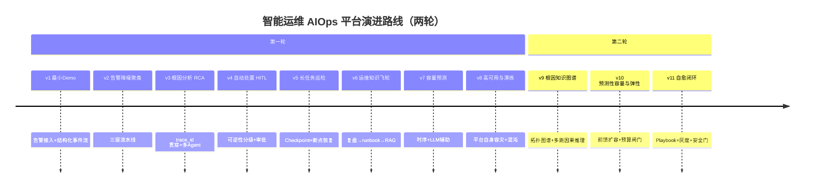
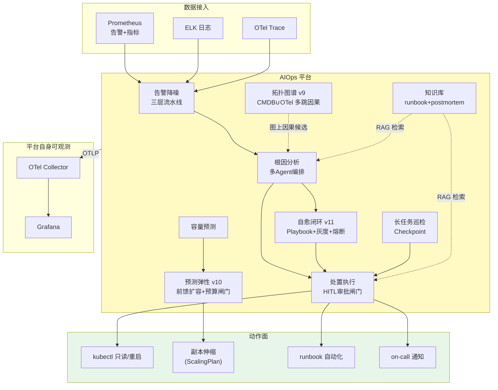

# 项目 09：智能运维 AIOps 平台 — 00-需求分析与架构设计

> **定位**：某中大型互联网公司 IT 运维团队的 AIOps 平台——从告警风暴中解放值班工程师，用 Agent 完成告警降噪、根因分析、自动处置（HITL）、长任务巡检与运维知识飞轮。项目 09 是**完整独立**的项目，不依赖也不引用其他项目。**本项目的核心使命：把教程 02-SpringAI核心机制/03-结构化输出（可观测）、30（容错）、40（长任务）、28（HITL）在"运维"这个 ROI 最高的企业 AI 场景落地。**
>
> 「遇到阻塞？→ [教程 04-企业级架构主干/02-全链路可观测性]、[教程 04-企业级架构主干/10-容错与弹性设计 §熔断/降级]、[教程 08-架构师进阶/06-长任务持久化与中断恢复]、[教程 04-企业级架构主干/08-Human-in-the-Loop与审批流]、[教程 08-架构师进阶/07-数据飞轮与持续改进]」
>
> **代码使用纪律（照抄前必读）**：本项目所有代码遵循「项目文档不生成 .java 文件、代码由用户手写」的规范。框架 API 全部按 [附录 05-SpringAI2-API基准] 的真实签名书写（`ChatClient`/`@Tool`/`CallAdvisor`/`ToolCallingManager` 等），**可照抄编译**；`AlertNormalizer`、`RcaOrchestrator`、`RemediationApprovalManager` 等为本项目专属业务类，本文给出**完整类**（含全部 import、无省略），你按文档手写即可。凡引入 pom.xml 未声明的新依赖，均标注「需在 pom.xml 中添加依赖」并给出完整 `<dependency>` 片段。

---

## ★ 阅读顺序总览（序号 = 你的实际阅读顺序）

> 本子文件夹 15 个文件，**文件名编号 00-14 即阅读顺序**。按"全貌 → 起步 → 第一轮八迭代 → 复盘 → 第二轮三迭代 → 决策资产 → 前沿"组织：

| 阶段 | 文件 | 读者定位 |
|------|------|---------|
| ① 全貌 | 00-需求分析与架构设计 | **先读**：业务场景、目标架构、演进路线、基线 pom 与包结构 |
| ② 起步 | 01-最小Demo搭建 | **动手**：告警接入跑通"结构化事件流"最小内核 |
| ③ 第一轮迭代 | 02~08（迭代一~七） | **严格顺序**：降噪 → RCA → HITL 处置 → 长任务巡检 → 知识飞轮 → 容量预测 → 高可用——每迭代先跑验收再进下一步 |
| ④ 复盘 | 09-核心代码讲解 | **回顾**：六个关键设计复盘 + 完整装配代码 + 最易写错五处 |
| ⑤ 第二轮深化 | 10~12（迭代八~十） | **顺序深化**：根因知识图谱（图上因果推理）→ 预测性容量与弹性（前馈扩容+预算闸门）→ 自愈闭环（Playbook+灰度+安全门）——第一轮收官后由"看得准但被动"驱动的第二演进轮 |
| ⑥ 决策资产 | 13-ADR架构决策记录 | **按需查阅**：33 条 ADR 总账、决策关系图、11 条关键决策四要素详解 |
| ⑦ 前沿 | 14-工业前沿与演进方向 | **收官**：Google/Nebius/PagerDuty 三来源校准、五主题映射、P0-P4 演进路线 |

> 第一轮（v1-v8）解决"值班工程师的一天"（接入 → 降噪 → 定位 → 处置 → 巡检 → 学习 → 预测 → 自保）；第二轮（v9-v11）把镜头转向自治深水区（因果图推理、峰前弹性、灰度自愈）。两轮合起来才是"智能运维"的完整弧线。

**本节核对（一句话级）**：表中 15 个文件名与实际目录 `00-…md` 至 `14-…md` 逐一对上，无缺号无跳号。

---

## 1. 业务场景

### 1.1 背景

某公司核心业务为电商平台，微服务规模 200+，分布在 3 个 K8s 集群。运维团队 12 人，现状：

| 痛点 | 数据 |
|------|------|
| **告警风暴** | 日均 50+ 告警，约 60% 是误报（阈值静态、依赖链噪声） |
| **故障定位靠人肉** | MTTR 平均 45 分钟，根因排查要翻 3 套系统（Prometheus/日志/链路） |
| **处置靠经验** | 高危操作（重启/切流）由 on-call 手动执行，风险与效率两难 |
| **知识无沉淀** | 每起故障的复盘结论散落在聊天记录，下次故障从头开始 |
| **巡检靠排班** | 定时巡检/压测依赖人工值班，长任务无断点恢复 |

### 1.2 项目目标

1. **告警降噪**：告警量降 80%+，值班工程师只看到"该看的"
2. **根因分析**：故障定位 MTTR 从 45 分钟降到 10 分钟内（Agent 输出带置信度的根因链）
3. **自动处置（渐进自主）**：低风险动作自动执行、中风险 HITL 审批、高风险升级
4. **长任务巡检**：Checkpoint 化巡检，断点恢复、预算控制
5. **运维知识飞轮**：故障复盘 → runbook 沉淀 → RAG 增强，越用越懂

### 1.3 非目标

- 不做监控采集本身（Prometheus/ELK/OTel 已存在，本项目消费它们）
- 不做全自主无人值守（2026 行业共识：Agent 自动处置必须渐进自主 + HITL，[调研 AIOps 2026 §HITL]）
- 不做容量采购预测的财务闭环（只做容量分析与预警）

### 1.4 本节核对（业务场景与目标理解）

| # | 核对项 | 判据 |
|---|--------|------|
| 1 | 五大痛点均量化 | 告警量 50+/60% 误报、MTTR 45min 等数据在 §1.1 表格中 |
| 2 | 目标与非目标一一对应 | 5 条目标各有痛点来源；3 条非目标明确"不做监控采集/全自主/财务闭环" |
| 3 | 目标可度量 | 降噪 80%+、MTTR ≤10min 等可对照 [08-高可用与演练 §4] 收官验收 |

## 2. 演进路线

> 核心纪律：**禁止一上来给最终版架构。** 每个迭代由真实痛点驱动，回答四问（新需求/影响模块/架构演进/上一版痛点）。



**顺序理由**（顺序本身就是架构决策）：

| 顺序 | 决策理由 | 反面 |
|------|---------|------|
| 先降噪再根因 | 不降噪，根因分析会被误报淹没 | 直接做 RCA——告警风暴下 RCA 无效 |
| 根因在处置前 | 处置的前提是"定位对了"；处置依赖风险分级框架 | 先做自动处置——错定位+自动执行=事故 |
| HITL 在巡检前 | 处置的审批流是巡检高危动作的基础 | 先做巡检——无审批闸门的巡检不敢自动执行 |
| 知识飞轮在早期迭代后 | 飞轮需要前几轮的真实故障数据 | 先做飞轮——没有数据喂不转 |
| 容量/高可用最后 | 稳定运行后才有容量压力；平台自身可靠性最后加固 | 先做容量——平台还在演进，预测对象天天变 |

**第二轮顺序理由**（v8 收官后由真实痛点驱动，[09-核心代码讲解] 复盘后展开）：图谱（v9）先于弹性（v10）——弹性要扩的"哪个服务"依赖图谱给出的可信依赖与流量结构；弹性先于自愈（v11）——自愈的"爆炸半径控制"复用弹性建立的灰度执行设施；三迭代后决策资产化（[13]）与前沿校准（[14]）收口。

### 2.1 本节核对（演进路线自测）

- [ ] 能复述两轮共 11 个迭代的顺序与每个一句话主题。
- [ ] 能对"先降噪再根因 / 根因在处置前"各说出一组正反面理由（§2 表）。
- [ ] timeline 图 v1-v11 与 §6 迭代-教程对照表条目数一致。

## 3. 目标架构（v11 终态预览）



**三平面分离**（[调研 AIOps 2026 §架构形态]）：数据面（遥测接入/降噪）、控制面（编排/策略/审批）、知识面（runbook/复盘/容量）。

### 3.1 本节核对（架构理解自测）

| # | 核对项 | 判据 |
|---|--------|------|
| 1 | 三平面归类 | 降噪=数据面、审批闸门=控制面、runbook 检索=知识面，能对图中每个节点归面 |
| 2 | v9-v11 增量边界 | TOPO/ELAS/HEAL 三节点与第一轮 RCA/EXEC/CAP 的连线关系可解释 |
| 3 | 动作面收敛 | 所有对外动作（kubectl/伸缩/runbook/通知）都只从 EXEC 发出，图上无旁路 |

## 4. 关键 ADR（预录）

| # | 决策 | 理由 |
|---|------|------|
| ADR-401 | 降噪三层流水线：确定性去重 → 语义聚类 → LLM 简报 | 确定性算法先行（便宜准），LLM 只做最后摘要（贵）；LLM 降级必须放行告警而非丢弃 |
| ADR-402 | RCA 用 trace_id 贯穿 + 多 Agent（Triage→Planner→Worker→Supervisor） | 与行业标准一致；确定性计算先行、LLM 只读结论（Zenjoy「程序计算、AI 总结」） |
| ADR-403 | 处置按"可逆性×爆炸半径"分级，HITL 在 ToolCallingManager 装饰器 | 「模型输出是请求不是授权」；审批是架构强制而非流程约定 |
| ADR-404 | 长任务用 Checkpoint 机制（教程 05-Observation可观测/07-指标治理：Token计量、SLO与基数熔断）持久化断点 | 进程一死 run 就死；巡检需断点续跑、预算控制；零外部依赖可手写；跨主机 durable execution（如 Temporal）记为生产演进方向 |
| ADR-405 | 知识飞轮用混合检索 + citation + 证据/假设分离 | 危机时刻的准确检索依赖结构化数据，纯向量不够 |

> 第二轮新增决策见各迭代篇（ADR-424~426 拓扑图谱、ADR-427~429 预测弹性、ADR-430~433 自愈闭环），全部 33 条的总账与关系见 [13-ADR架构决策记录](13-ADR架构决策记录.md)。

### 4.1 本节核对（预录 ADR 与总账一致）

- [ ] ADR-401~405 在 [13 §3] 总账中存在、编号一致、状态未被推翻（或推翻有 supersede 记录）。
- [ ] 每条预录 ADR 能在对应迭代篇（[02]/[03]/[04]/[05]/[06]）找到落地代码位置。

## 5. 技术栈与依赖

基线：Spring Boot 4.1 + Spring AI 2.0 + WebFlux + Java 21。数据接入用 Prometheus HTTP API / ELK / OTel；事件流用 Kafka（spring-kafka 4.x 无响应式模板，走 KafkaTemplate + boundedElastic 桥接，见 01 迭代）；长任务用 Checkpoint（教程 05-Observation可观测/07-指标治理：Token计量、SLO与基数熔断 机制，v5 起）。各迭代引入的新依赖按规范标注「需在 pom.xml 中添加依赖」。

### 5.1 基线 pom.xml（跨迭代共享，随迭代追加）

```xml
<?xml version="1.0" encoding="UTF-8"?>
<project xmlns="http://maven.apache.org/POM/4.0.0"
         xmlns:xsi="http://www.w3.org/2001/XMLSchema-instance"
         xsi:schemaLocation="http://maven.apache.org/POM/4.0.0 http://maven.apache.org/xsd/maven-4.0.0.xsd">
    <modelVersion>4.0.0</modelVersion>

    <groupId>com.aiops</groupId>
    <artifactId>aiops-platform</artifactId>
    <version>0.0.1-SNAPSHOT</version>
    <packaging>jar</packaging>

    <parent>
        <groupId>org.springframework.boot</groupId>
        <artifactId>spring-boot-starter-parent</artifactId>
        <version>4.1.0</version>
    </parent>

    <properties>
        <java.version>21</java.version>
        <spring-ai.version>2.0.0</spring-ai.version>
    </properties>

    <dependencyManagement>
        <dependencies>
            <dependency>
                <groupId>org.springframework.ai</groupId>
                <artifactId>spring-ai-bom</artifactId>
                <version>${spring-ai.version}</version>
                <type>pom</type>
                <scope>import</scope>
            </dependency>
        </dependencies>
    </dependencyManagement>

    <dependencies>
        <!-- WebFlux 响应式 Web 框架（非 MVC） -->
        <dependency>
            <groupId>org.springframework.boot</groupId>
            <artifactId>spring-boot-starter-webflux</artifactId>
        </dependency>
        <!-- OpenAI 模型（含 DeepSeek 兼容） -->
        <dependency>
            <groupId>org.springframework.ai</groupId>
            <artifactId>spring-ai-starter-model-openai</artifactId>
        </dependency>
        <!-- 事件流 Kafka（spring-kafka 4.x 移除响应式模板，用 KafkaTemplate + boundedElastic 桥接） -->
        <dependency>
            <groupId>org.springframework.boot</groupId>
            <artifactId>spring-boot-starter-kafka</artifactId>
        </dependency>
        <!-- JDBC + PostgreSQL（审计/知识库/检查点冷存储） -->
        <dependency>
            <groupId>org.springframework.boot</groupId>
            <artifactId>spring-boot-starter-jdbc</artifactId>
        </dependency>
        <dependency>
            <groupId>org.postgresql</groupId>
            <artifactId>postgresql</artifactId>
            <scope>runtime</scope>
        </dependency>
        <!-- Lombok（随 Boot 版本） -->
        <dependency>
            <groupId>org.projectlombok</groupId>
            <artifactId>lombok</artifactId>
            <optional>true</optional>
        </dependency>
        <!-- 测试 -->
        <dependency>
            <groupId>org.springframework.boot</groupId>
            <artifactId>spring-boot-starter-test</artifactId>
            <scope>test</scope>
        </dependency>
    </dependencies>

    <build>
        <plugins>
            <plugin>
                <groupId>org.springframework.boot</groupId>
                <artifactId>spring-boot-maven-plugin</artifactId>
            </plugin>
        </plugins>
    </build>
</project>
```

> **依赖说明**：Spring Kafka 4.x（随 Spring Boot 4.1）已移除 `ReactiveKafkaProducerTemplate`/`ReactiveKafkaConsumerTemplate`（3.x 的 `org.springframework.kafka.core.reactive` 包不复存在，本机 jar 实证）。本项目 v1 用阻塞 `KafkaTemplate` 在 boundedElastic 上桥接、消费走 `@KafkaListener`（专用消费线程，不占 EventLoop），见 [01-最小Demo搭建 §4.4-4.7](01-最小Demo搭建.md)。各迭代新增依赖（pgvector、Redis、Caffeine、Resilience4j、WireMock）在对应文档中标注完整 `<dependency>` 片段，不实际修改 pom.xml。

### 5.2 代码包结构（v11 终态）

| 包 | 职责 | 首现迭代 |
|----|------|---------|
| `com.aiops.platform.alert` | 统一告警模型/接入/降噪/简报 | v1 |
| `com.aiops.platform.ingest` | Kafka 事件流接线 | v1 |
| `com.aiops.platform.rca` | 多数据源工具/根因编排 | v3 |
| `com.aiops.platform.remediate` | 处置工具/风险分级/HITL 审批 | v4 |
| `com.aiops.platform.inspection` | 长任务 Checkpoint/预算控制 | v5 |
| `com.aiops.platform.knowledge` | postmortem/runbook 混合检索/服务画像 | v6 |
| `com.aiops.platform.capacity` | 时序预测/容量报告 | v7 |
| `com.aiops.platform.resilience` | 熔断/降级矩阵 | v8 |
| `com.aiops.platform.topology` | 拓扑图谱构建/告警投影/多跳因果推理/增量同步 | v9 |
| `com.aiops.platform.elasticity` | ScalingPlan 前馈弹性/水位线/预算门/回测 | v10 |
| `com.aiops.platform.selfheal` | Playbook 预案库/灰度自愈/安全门/效果评估 | v11 |

### 5.3 本节核对（基线依赖与包结构）

| # | 核对项 | 判据 |
|---|--------|------|
| 1 | 基线 pom 可解析 | `mvn -N validate` 或 IDEA 导入无 `dependency could not be resolved`；Boot 4.1.0 + Spring AI BOM 2.0.0 |
| 2 | 无 MVC 混入 | dependencies 只有 `spring-boot-starter-webflux`，无 `spring-boot-starter-web` |
| 3 | 包结构前瞻一致 | §5.2 的 11 个包名与各迭代篇实际 package 声明（如 [01] 的 `com.aiops.platform.alert/ingest`）逐一对上 |

## 6. 迭代与教程知识点对照

| 迭代 | 落地的教程知识 |
|------|---------------|
| 01 告警接入 | [教程 08-架构师进阶/08-响应式错误处理 §事件流]、[教程 01-WebFlux与响应式编程/00-WebFlux从零入门] |
| 02 降噪 | [教程 08-架构师进阶/04-Agent性能优化 §级联路由]、[教程 04-企业级架构主干/02-全链路可观测性 §标签设计] |
| 03 RCA | [教程 04-企业级架构主干/02-全链路可观测性 全篇]、[教程 08-架构师进阶/01-高级RAG与AgenticRAG §Agentic 检索] |
| 04 HITL | [教程 04-企业级架构主干/08-Human-in-the-Loop与审批流 全篇]、[教程 04-企业级架构主干/10-容错与弹性设计 §熔断]、[附录 05-SpringAI2-API基准/02 §1.3] |
| 05 长任务 | [教程 08-架构师进阶/06-长任务持久化与中断恢复 全篇]、[教程 04-企业级架构主干/10-容错与弹性设计 §重试] |
| 06 知识飞轮 | [教程 08-架构师进阶/07-数据飞轮与持续改进 全篇]、[教程 00-基础与核心/05-RAG检索增强生成] |
| 07 容量 | [教程 08-架构师进阶/10-多模型协作与供应策略 §模型编排]（Ollama/vLLM 参考） |
| 08 高可用 | [教程 04-企业级架构主干/10-容错与弹性设计 §熔断降级]、[教程 04-企业级架构主干/13-部署与运维 §演练] |
| 10 拓扑图谱 | [教程 08-架构师进阶/01-高级RAG与AgenticRAG §GraphRAG]、[附录 10-知识图谱工程 全部] |
| 11 预测弹性 | [教程 04-企业级架构主干/10-容错与弹性设计 §弹性设计]、[教程 08-架构师进阶/10-多模型协作与供应策略 §模型编排] |
| 12 自愈闭环 | [教程 04-企业级架构主干/08-Human-in-the-Loop与审批流 全篇]、[教程 04-企业级架构主干/10-容错与弹性设计 §熔断] |
| 13 ADR 资产 | [附录 07-架构决策方法论 全篇]、[教程 04-企业级架构主干/00-管控分离架构 §决策与治理] |
| 14 前沿 | [教程 08-架构师进阶/03-自我反思与Agent评估]、[教程 08-架构师进阶/09-Agent治理与合规框架]、[教程 08-架构师进阶/05-高级记忆架构 §记忆演化与衰减] |

### 6.1 本节核对（对照表完整性）

- [ ] 表覆盖全部 15 个文件（01-14 迭代 + 13/14 资产前沿），无缺行。
- [ ] 每行引用的教程篇目在 `docs/教程/` 中真实存在。

## 7. 下一步

→ [01-最小Demo搭建.md](01-最小Demo搭建.md) — 不是监控系统的复刻，而是把告警接入为**结构化事件流**的最小内核。

### 7.1 本节核对（一句话级）

- [ ] 下一步指向的 [01] 与 §2 演进路线的 v1 主题一致（告警接入+结构化事件流）。
