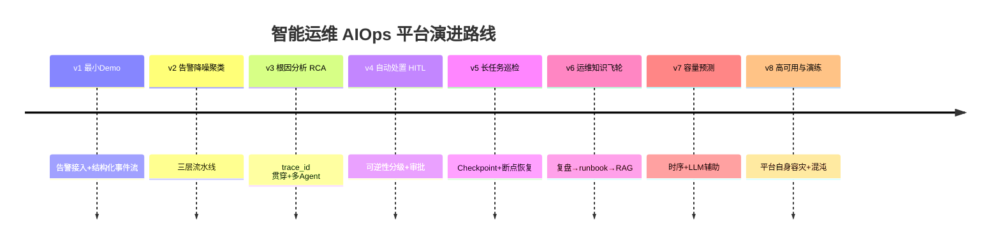
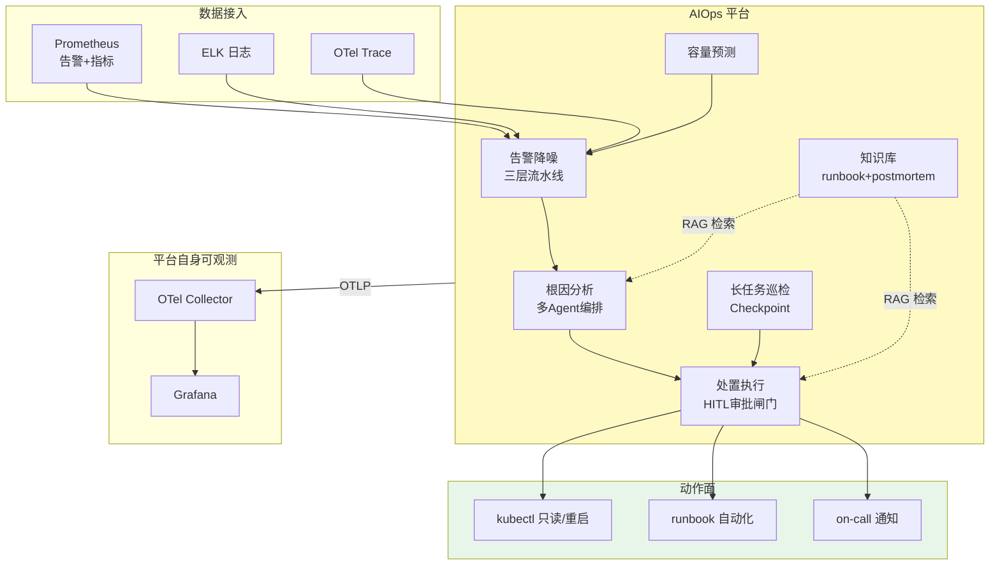

# 项目 09：智能运维 AIOps 平台 — 00-需求分析与架构设计

> **定位**：某中大型互联网公司 IT 运维团队的 AIOps 平台——从告警风暴中解放值班工程师，用 Agent 完成告警降噪、根因分析、自动处置（HITL）、长任务巡检与运维知识飞轮。项目 09 是**完整独立**的项目，不依赖也不引用其他项目。**本项目的核心使命：把教程 16（可观测）、24（容错）、35（长任务）、22（HITL）在"运维"这个 ROI 最高的企业 AI 场景落地。**
>
> 「遇到阻塞？→ [教程 22-全链路可观测性]、[教程 30-容错与弹性设计 §熔断/降级]、[教程 40-长任务持久化与中断恢复]、[教程 28-Human-in-the-Loop与审批流]、[教程 41-数据飞轮与持续改进]」
>
> **代码使用纪律（照抄前必读）**：本项目所有代码遵循「项目文档不生成 .java 文件、代码由用户手写」的规范。框架 API 全部按 [附录 05-SpringAI2-API基准] 的真实签名书写（`ChatClient`/`@Tool`/`CallAdvisor`/`ToolCallingManager` 等），**可照抄编译**；`AlertNormalizer`、`RcaOrchestrator`、`RemediationApprovalManager` 等为本项目专属业务类，本文给出**完整类**（含全部 import、无省略），你按文档手写即可。凡引入 pom.xml 未声明的新依赖，均标注「需在 pom.xml 中添加依赖」并给出完整 `<dependency>` 片段。

---

## 1. 业务场景

### 1.1 背景

某公司核心业务为电商平台，微服务规模 200+，分布在 3 个 K8s 集群。运维团队 12 人，现状：

| 痛点 | 数据 |
|------|------|
| **告警风暴** | 日均 50+ 告警，约 60% 是误报（阈值静态、依赖链噪声） |
| **故障定位靠人肉** | MTTR 平均 45 分钟，根因排查要翻 3 套系统（Prometheus/日志/链路） |
| **处置靠经验** | 高危操作（重启/切流）由 on-call 手动执行，风险与效率两难 |
| **知识无沉淀** | 每起故障的复盘结论散落在聊天记录，下次故障从头开始 |
| **巡检靠排班** | 定时巡检/压测依赖人工值班，长任务无断点恢复 |

### 1.2 项目目标

1. **告警降噪**：告警量降 80%+，值班工程师只看到"该看的"
2. **根因分析**：故障定位 MTTR 从 45 分钟降到 10 分钟内（Agent 输出带置信度的根因链）
3. **自动处置（渐进自主）**：低风险动作自动执行、中风险 HITL 审批、高风险升级
4. **长任务巡检**：Checkpoint 化巡检，断点恢复、预算控制
5. **运维知识飞轮**：故障复盘 → runbook 沉淀 → RAG 增强，越用越懂

### 1.3 非目标

- 不做监控采集本身（Prometheus/ELK/OTel 已存在，本项目消费它们）
- 不做全自主无人值守（2026 行业共识：Agent 自动处置必须渐进自主 + HITL，[调研 AIOps 2026 §HITL]）
- 不做容量采购预测的财务闭环（只做容量分析与预警）

## 2. 演进路线

> 核心纪律：**禁止一上来给最终版架构。** 每个迭代由真实痛点驱动，回答四问（新需求/影响模块/架构演进/上一版痛点）。



**顺序理由**（顺序本身就是架构决策）：

| 顺序 | 决策理由 | 反面 |
|------|---------|------|
| 先降噪再根因 | 不降噪，根因分析会被误报淹没 | 直接做 RCA——告警风暴下 RCA 无效 |
| 根因在处置前 | 处置的前提是"定位对了"；处置依赖风险分级框架 | 先做自动处置——错定位+自动执行=事故 |
| HITL 在巡检前 | 处置的审批流是巡检高危动作的基础 | 先做巡检——无审批闸门的巡检不敢自动执行 |
| 知识飞轮在早期迭代后 | 飞轮需要前几轮的真实故障数据 | 先做飞轮——没有数据喂不转 |
| 容量/高可用最后 | 稳定运行后才有容量压力；平台自身可靠性最后加固 | 先做容量——平台还在演进，预测对象天天变 |

## 3. 目标架构（v8 终态预览）



**三平面分离**（[调研 AIOps 2026 §架构形态]）：数据面（遥测接入/降噪）、控制面（编排/策略/审批）、知识面（runbook/复盘/容量）。

## 4. 关键 ADR（预录）

| # | 决策 | 理由 |
|---|------|------|
| ADR-401 | 降噪三层流水线：确定性去重 → 语义聚类 → LLM 简报 | 确定性算法先行（便宜准），LLM 只做最后摘要（贵）；LLM 降级必须放行告警而非丢弃 |
| ADR-402 | RCA 用 trace_id 贯穿 + 多 Agent（Triage→Planner→Worker→Supervisor） | 与行业标准一致；确定性计算先行、LLM 只读结论（Zenjoy「程序计算、AI 总结」） |
| ADR-403 | 处置按"可逆性×爆炸半径"分级，HITL 在 ToolCallingManager 装饰器 | 「模型输出是请求不是授权」；审批是架构强制而非流程约定 |
| ADR-404 | 长任务用 Checkpoint 机制（教程 35）持久化断点 | 进程一死 run 就死；巡检需断点续跑、预算控制；零外部依赖可手写；跨主机 durable execution（如 Temporal）记为生产演进方向 |
| ADR-405 | 知识飞轮用混合检索 + citation + 证据/假设分离 | 危机时刻的准确检索依赖结构化数据，纯向量不够 |

## 5. 技术栈与依赖

基线：Spring Boot 4.1 + Spring AI 2.0 + WebFlux + Java 21。数据接入用 Prometheus HTTP API / ELK / OTel；事件流用 Kafka（Reactive）；长任务用 Checkpoint（教程 35 机制，v5 起）。各迭代引入的新依赖按规范标注「需在 pom.xml 中添加依赖」。

### 5.1 基线 pom.xml（跨迭代共享，随迭代追加）

```xml
<?xml version="1.0" encoding="UTF-8"?>
<project xmlns="http://maven.apache.org/POM/4.0.0"
         xmlns:xsi="http://www.w3.org/2001/XMLSchema-instance"
         xsi:schemaLocation="http://maven.apache.org/POM/4.0.0 http://maven.apache.org/xsd/maven-4.0.0.xsd">
    <modelVersion>4.0.0</modelVersion>

    <groupId>com.aiops</groupId>
    <artifactId>aiops-platform</artifactId>
    <version>0.0.1-SNAPSHOT</version>
    <packaging>jar</packaging>

    <parent>
        <groupId>org.springframework.boot</groupId>
        <artifactId>spring-boot-starter-parent</artifactId>
        <version>4.1.0</version>
    </parent>

    <properties>
        <java.version>21</java.version>
        <spring-ai.version>2.0.0</spring-ai.version>
    </properties>

    <dependencyManagement>
        <dependencies>
            <dependency>
                <groupId>org.springframework.ai</groupId>
                <artifactId>spring-ai-bom</artifactId>
                <version>${spring-ai.version}</version>
                <type>pom</type>
                <scope>import</scope>
            </dependency>
        </dependencies>
    </dependencyManagement>

    <dependencies>
        <!-- WebFlux 响应式 Web 框架（非 MVC） -->
        <dependency>
            <groupId>org.springframework.boot</groupId>
            <artifactId>spring-boot-starter-webflux</artifactId>
        </dependency>
        <!-- OpenAI 模型（含 DeepSeek 兼容） -->
        <dependency>
            <groupId>org.springframework.ai</groupId>
            <artifactId>spring-ai-starter-model-openai</artifactId>
        </dependency>
        <!-- 事件流 Kafka（Reactive 模板在 spring-kafka 模块内） -->
        <dependency>
            <groupId>org.springframework.boot</groupId>
            <artifactId>spring-boot-starter-kafka</artifactId>
        </dependency>
        <!-- JDBC + PostgreSQL（审计/知识库/检查点冷存储） -->
        <dependency>
            <groupId>org.springframework.boot</groupId>
            <artifactId>spring-boot-starter-jdbc</artifactId>
        </dependency>
        <dependency>
            <groupId>org.postgresql</groupId>
            <artifactId>postgresql</artifactId>
            <scope>runtime</scope>
        </dependency>
        <!-- Lombok（随 Boot 版本） -->
        <dependency>
            <groupId>org.projectlombok</groupId>
            <artifactId>lombok</artifactId>
            <optional>true</optional>
        </dependency>
        <!-- 测试 -->
        <dependency>
            <groupId>org.springframework.boot</groupId>
            <artifactId>spring-boot-starter-test</artifactId>
            <scope>test</scope>
        </dependency>
    </dependencies>

    <build>
        <plugins>
            <plugin>
                <groupId>org.springframework.boot</groupId>
                <artifactId>spring-boot-maven-plugin</artifactId>
            </plugin>
        </plugins>
    </build>
</project>
```

> **依赖说明**：Reactive Kafka 模板 `ReactiveKafkaProducerTemplate`/`ReactiveKafkaConsumerTemplate` 位于 `spring-kafka` 模块（包 `org.springframework.kafka.core.reactive`），由 `spring-boot-starter-kafka` 传递引入；其底层驱动为 `io.projectreactor.kafka:reactor-kafka`（由 spring-kafka 传递引入，版本随 BOM 管理）。各迭代新增依赖（pgvector、Redis、Caffeine、Resilience4j、WireMock）在对应文档中标注完整 `<dependency>` 片段，不实际修改 pom.xml。

### 5.2 代码包结构（v8 终态）

| 包 | 职责 | 首现迭代 |
|----|------|---------|
| `com.aiops.platform.alert` | 统一告警模型/接入/降噪/简报 | v1 |
| `com.aiops.platform.ingest` | Kafka 事件流接线 | v1 |
| `com.aiops.platform.rca` | 多数据源工具/根因编排 | v3 |
| `com.aiops.platform.remediate` | 处置工具/风险分级/HITL 审批 | v4 |
| `com.aiops.platform.inspection` | 长任务 Checkpoint/预算控制 | v5 |
| `com.aiops.platform.knowledge` | postmortem/runbook 混合检索/服务画像 | v6 |
| `com.aiops.platform.capacity` | 时序预测/容量报告 | v7 |
| `com.aiops.platform.resilience` | 熔断/降级矩阵 | v8 |

## 6. 迭代与教程知识点对照

| 迭代 | 落地的教程知识 |
|------|---------------|
| 01 告警接入 | [教程 42-响应式错误处理 §事件流]、[附录 06-WebFlux与响应式编程] |
| 02 降噪 | [教程 38-Agent性能优化 §级联路由]、[教程 16 §标签设计] |
| 03 RCA | [教程 16 全篇]、[教程 35-高级RAG与AgenticRAG §Agentic 检索] |
| 04 HITL | [教程 22 全篇]、[教程 24 §熔断]、[附录 12 §ToolCallingManager] |
| 05 长任务 | [教程 35 全篇]、[教程 24 §重试] |
| 06 知识飞轮 | [教程 36 全篇]、[教程 05-RAG] |
| 07 容量 | [教程 39-多模型协作 §边缘部署]（Ollama/vLLM 参考） |
| 08 高可用 | [教程 24 §熔断降级]、[教程 28 §演练] |

## 7. 下一步

→ [01-最小Demo搭建.md](01-最小Demo搭建.md) — 不是监控系统的复刻，而是把告警接入为**结构化事件流**的最小内核。
