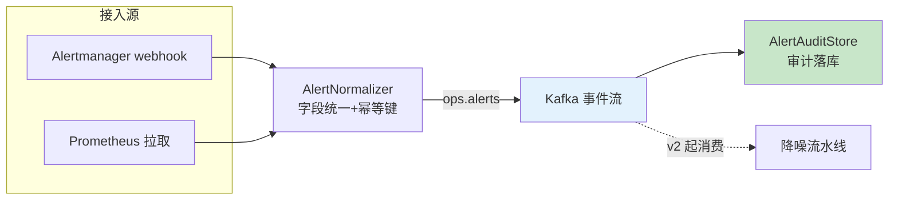

# 项目 09：智能运维 AIOps 平台 — 01-最小 Demo 搭建

> **定位**：把 Prometheus 告警接入为**结构化事件流**——统一告警模型、去重、审计落库。本篇刻意不做 LLM（先让"数据进得来、长得规范"），后续迭代的降噪/RCA 全部消费这个事件流。本文代码为**完整可手写**（含全部 import、无省略），照抄即可编译运行。
>
> 「遇到阻塞？→ [教程 37-响应式错误处理 §事件流]、[附录 01-WebFlux与响应式编程/00-Reactor核心 §Flux 冷热]、[教程 09-SSE流式通信]」

---

## 1. 为什么最小 Demo 是"告警接入"而不是直接做降噪

降噪、RCA、知识飞轮都依赖**同一份规范化的告警事件流**。如果先把告警接进来、定义好统一模型与存储，后续所有能力就有了共同的"原料"。反之直接做降噪，会发现每条告警的字段不一致（Prometheus 的 label、ELK 的 message、OTel 的 span attribute），LLM 无法稳定消费。

**v1 只做三件事**：① 拉取/接收 Prometheus 告警；② 规范化为统一 `AlertEvent`；③ 写入 Kafka（事件流）+ 审计落库。

## 2. 四问

| 问 | 答 |
|----|----|
| **新增了什么需求** | ① Prometheus 告警接入为统一 `AlertEvent` ② 幂等去重键（label 集哈希）③ 事件流进 Kafka + 审计落库 |
| **影响了哪些模块** | 全新模块（v1 起步）：`alert`（模型/规范化）、`ingest`（Kafka 接线）、审计存储 |
| **架构如何演进** | 从零到"结构化事件流最小内核"：webhook 双通道接入 → 规范化 → Kafka + 审计落库；后续降噪/RCA 全部消费同一事件流 |
| **上一版痛点是什么** | 无（v1 起步）。对齐的行业现状：告警字段不一致（Prometheus label / ELK message / OTel span attribute），LLM 无法稳定消费 |

## 3. 接入流



**v1 关键决策**：`fingerprint` 是 Prometheus Alertmanager 的去重基准（label 集哈希），保留它是为了 v2 降噪时**确定性去重先行**（LLM 建在其上而非替代它，[调研 AIOps 2026 §告警降噪]）。

## 4. 完整代码（照抄即可）

### 4.1 `AlertEvent.java`（统一告警模型）

```java
package com.aiops.platform.alert;

import java.time.Instant;
import java.util.Map;

/**
 * Java 21 record —— 统一告警模型（后续所有迭代消费它）。
 * alertId 是幂等去重键（canonical labels 哈希），与 Prometheus fingerprint 不同：
 * fingerprint 由 Alertmanager 计算，alertId 由本平台对 label 集规范化后计算。
 */
public record AlertEvent(
        String alertId,                    // 幂等去重键（label 集哈希）
        String fingerprint,                // Prometheus 的 label 指纹
        long startedAt,                    // 触发时间（epoch ms）
        long endsAt,                       // 恢复时间（未恢复为 0）
        String severity,                   // critical/warning/info
        String alertName,                  // 告警规则名
        Map<String, String> labels,        // Prometheus label（含 instance/job 等）
        Map<String, String> annotations,   // 告警描述（含 summary/description）
        String status,                     // firing/resolved
        Instant ingestedAt                 // 平台接入时间
) {}
```

### 4.2 `AlertmanagerPayload.java`（webhook 请求体）

```java
package com.aiops.platform.alert;

import java.time.Instant;
import java.util.List;
import java.util.Map;

/**
 * Alertmanager webhook 的 JSON 请求体（只声明本项目用到的字段）。
 * 真实告警体含 generatorURL/groupLabels/commonLabels 等，可按需追加。
 */
public record AlertmanagerPayload(List<Alert> alerts) {

    public record Alert(
            String status,                  // firing/resolved
            Map<String, String> labels,
            Map<String, String> annotations,
            Instant startsAt,
            Instant endsAt,
            String fingerprint
    ) {}
}
```

### 4.3 `AlertNormalizer.java`（字段统一 + 幂等键）

```java
package com.aiops.platform.alert;

import org.springframework.stereotype.Component;

import java.nio.charset.StandardCharsets;
import java.security.MessageDigest;
import java.security.NoSuchAlgorithmException;
import java.time.Instant;
import java.util.HexFormat;
import java.util.Map;
import java.util.stream.Collectors;

/**
 * 告警规范化器：把异构告警源字段统一到 AlertEvent。
 * normalize 是纯函数（无副作用），可在 Flux 链上安全调用。
 */
@Component
public class AlertNormalizer {

    public AlertEvent normalize(AlertmanagerPayload.Alert raw) {
        Map<String, String> labels = raw.labels() == null ? Map.of() : raw.labels();
        Map<String, String> annotations = raw.annotations() == null ? Map.of() : raw.annotations();
        return new AlertEvent(
                sha256(canonicalLabels(labels)),          // 幂等键
                raw.fingerprint(),
                raw.startsAt() == null ? 0L : raw.startsAt().toEpochMilli(),
                raw.endsAt() == null ? 0L : raw.endsAt().toEpochMilli(),
                normalizeSeverity(labels.getOrDefault("severity", "warning")),
                labels.getOrDefault("alertname", "unknown"),
                Map.copyOf(labels),
                Map.copyOf(annotations),
                raw.status() == null ? "firing" : raw.status(),
                Instant.now()
        );
    }

    private String normalizeSeverity(String raw) {
        return switch (raw.toLowerCase()) {
            case "critical", "p0", "severe" -> "critical";
            case "warning", "warn" -> "warning";
            default -> "info";
        };
    }

    /** 按 key 排序后拼接 label 对——同 label 集无论顺序都得到相同幂等键。 */
    private String canonicalLabels(Map<String, String> labels) {
        return labels.entrySet().stream()
                .sorted(Map.Entry.comparingByKey())
                .map(e -> e.getKey() + "=" + e.getValue())
                .collect(Collectors.joining(","));
    }

    private String sha256(String s) {
        try {
            MessageDigest digest = MessageDigest.getInstance("SHA-256");
            byte[] hash = digest.digest(s.getBytes(StandardCharsets.UTF_8));
            return HexFormat.of().formatHex(hash);
        } catch (NoSuchAlgorithmException e) {
            throw new IllegalStateException("SHA-256 不可用", e);
        }
    }
}
```

### 4.4 `AlertWebhookController.java`（响应式接入）

```java
package com.aiops.platform.alert;

import com.aiops.platform.ingest.KafkaConfig;
import org.slf4j.Logger;
import org.slf4j.LoggerFactory;
import org.springframework.http.ResponseEntity;
import org.springframework.kafka.core.reactive.ReactiveKafkaProducerTemplate;
import org.springframework.web.bind.annotation.PostMapping;
import org.springframework.web.bind.annotation.RequestBody;
import org.springframework.web.bind.annotation.RestController;
import reactor.core.publisher.Flux;
import reactor.core.publisher.Mono;

/**
 * 接收 Alertmanager webhook：规范化 → 进 Kafka 事件流。
 * Kafka 不可用时直落审计库（告警是生命线，v1 就建立"绝不丢"纪律，[ADR-407]）。
 */
@RestController
public class AlertWebhookController {

    private static final Logger log = LoggerFactory.getLogger(AlertWebhookController.class);
    private static final String TOPIC = "ops.alerts";

    private final AlertNormalizer normalizer;
    private final ReactiveKafkaProducerTemplate<String, AlertEvent> producer;
    private final AlertAuditStore auditStore;

    public AlertWebhookController(AlertNormalizer normalizer,
                                  ReactiveKafkaProducerTemplate<String, AlertEvent> producer,
                                  AlertAuditStore auditStore) {
        this.normalizer = normalizer;
        this.producer = producer;
        this.auditStore = auditStore;
    }

    @PostMapping("/webhooks/alertmanager")
    public Mono<ResponseEntity<Void>> receive(@RequestBody AlertmanagerPayload payload) {
        return Flux.fromIterable(payload.alerts())
                .map(normalizer::normalize)
                .flatMap(this::ingest)                     // 并行发送（WebFlux 非阻塞）
                .then(Mono.just(ResponseEntity.ok().build()));
    }

    private Mono<Void> ingest(AlertEvent e) {
        return producer.send(TOPIC, e.alertId(), e)
                .then()
                .onErrorResume(err -> {                    // Kafka 故障 → 直落审计（不丢告警）
                    log.warn("Kafka 不可用，告警直落审计库：{}", err.getMessage());
                    return auditStore.save(e);
                });
    }
}
```

> **注意**：`KafkaConfig` 提供 `ReactiveKafkaProducerTemplate` Bean，见 [4.6 KafkaConfig.java]。

### 4.5 `AlertAuditStore.java`（审计落库，JdbcClient）

```java
package com.aiops.platform.alert;

import com.fasterxml.jackson.databind.ObjectMapper;
import org.springframework.jdbc.core.simple.JdbcClient;
import org.springframework.stereotype.Repository;
import reactor.core.publisher.Mono;
import reactor.core.scheduler.Schedulers;

/**
 * 审计落库：每条告警事件留痕（谁在何时收到什么告警）——后续迭代的复盘原料。
 * JdbcClient 是阻塞 JDBC，WebFlux 中必须用 boundedElastic 桥接（教程 37 §阻塞桥接）。
 */
@Repository
public class AlertAuditStore {

    private final JdbcClient jdbc;
    private final ObjectMapper mapper;

    public AlertAuditStore(JdbcClient jdbc, ObjectMapper mapper) {
        this.jdbc = jdbc;
        this.mapper = mapper;
    }

    public Mono<Void> save(AlertEvent e) {
        return Mono.fromCallable(() -> {
                    String labelsJson = mapper.writeValueAsString(e.labels());
                    String annJson = mapper.writeValueAsString(e.annotations());
                    jdbc.sql("""
                            INSERT INTO alert_audit(alert_id, fingerprint, severity, alert_name,
                                                    status, labels_json, annotations, started_at, ingested_at)
                            VALUES(:alertId, :fingerprint, :severity, :alertName,
                                   :status, :labelsJson, :annotations, :startedAt, :ingestedAt)
                            ON CONFLICT (alert_id) DO NOTHING
                            """)
                            .param("alertId", e.alertId())
                            .param("fingerprint", e.fingerprint())
                            .param("severity", e.severity())
                            .param("alertName", e.alertName())
                            .param("status", e.status())
                            .param("labelsJson", labelsJson)
                            .param("annotations", annJson)
                            .param("startedAt", e.startedAt())
                            .param("ingestedAt", e.ingestedAt().toEpochMilli())
                            .update();
                    return null;
                })
                .subscribeOn(Schedulers.boundedElastic())
                .then();
    }
}
```

### 4.6 `KafkaConfig.java`（Reactive Kafka 接线）

```java
package com.aiops.platform.ingest;

import com.aiops.platform.alert.AlertEvent;
import org.apache.kafka.clients.consumer.ConsumerConfig;
import org.apache.kafka.clients.producer.ProducerConfig;
import org.apache.kafka.common.serialization.StringDeserializer;
import org.apache.kafka.common.serialization.StringSerializer;
import org.springframework.beans.factory.annotation.Value;
import org.springframework.context.annotation.Bean;
import org.springframework.context.annotation.Configuration;
import org.springframework.kafka.core.ConsumerFactory;
import org.springframework.kafka.core.DefaultKafkaConsumerFactory;
import org.springframework.kafka.core.DefaultKafkaProducerFactory;
import org.springframework.kafka.core.ProducerFactory;
import org.springframework.kafka.core.reactive.ReactiveKafkaConsumerTemplate;
import org.springframework.kafka.core.reactive.ReactiveKafkaProducerTemplate;
import org.springframework.kafka.support.serializer.JsonDeserializer;
import org.springframework.kafka.support.serializer.JsonSerializer;

import java.util.HashMap;
import java.util.Map;

/**
 * Kafka 事件流接线。Producer 与 Consumer 都用 JSON 序列化 AlertEvent。
 * 生产环境 bootstrap-servers 从环境变量注入，禁止硬编码。
 */
@Configuration
public class KafkaConfig {

    @Value("${spring.kafka.bootstrap-servers}")
    private String bootstrapServers;

    @Bean
    public ProducerFactory<String, AlertEvent> alertProducerFactory() {
        Map<String, Object> props = new HashMap<>();
        props.put(ProducerConfig.BOOTSTRAP_SERVERS_CONFIG, bootstrapServers);
        props.put(ProducerConfig.KEY_SERIALIZER_CLASS_CONFIG, StringSerializer.class);
        props.put(ProducerConfig.VALUE_SERIALIZER_CLASS_CONFIG, JsonSerializer.class);
        props.put(JsonSerializer.ADD_TYPE_INFO_HEADERS, false);   // 类型信息写 headers，与消费者约定
        return new DefaultKafkaProducerFactory<>(props);
    }

    @Bean
    public ReactiveKafkaProducerTemplate<String, AlertEvent> alertProducer() {
        return new ReactiveKafkaProducerTemplate<>(alertProducerFactory());
    }

    @Bean
    public ConsumerFactory<String, AlertEvent> alertConsumerFactory() {
        Map<String, Object> props = new HashMap<>();
        props.put(ConsumerConfig.BOOTSTRAP_SERVERS_CONFIG, bootstrapServers);
        props.put(ConsumerConfig.GROUP_ID_CONFIG, "aiops-alert-ingest");
        props.put(ConsumerConfig.AUTO_OFFSET_RESET_CONFIG, "latest");
        props.put(ConsumerConfig.KEY_DESERIALIZER_CLASS_CONFIG, StringDeserializer.class);
        props.put(ConsumerConfig.VALUE_DESERIALIZER_CLASS_CONFIG, JsonDeserializer.class);
        props.put(JsonDeserializer.VALUE_DEFAULT_TYPE, AlertEvent.class.getName());
        props.put(JsonDeserializer.TRUSTED_PACKAGES, "com.aiops.platform.alert");
        return new DefaultKafkaConsumerFactory<>(props);
    }

    @Bean
    public ReactiveKafkaConsumerTemplate<String, AlertEvent> alertConsumer() {
        return new ReactiveKafkaConsumerTemplate<>(alertConsumerFactory());
    }
}
```

### 4.7 `AlertStreamProcessor.java`（消费事件流 → 审计落库）

```java
package com.aiops.platform.ingest;

import com.aiops.platform.alert.AlertAuditStore;
import com.aiops.platform.alert.AlertEvent;
import org.slf4j.Logger;
import org.slf4j.LoggerFactory;
import org.springframework.boot.context.event.ApplicationReadyEvent;
import org.springframework.context.event.EventListener;
import org.springframework.kafka.core.reactive.ReactiveKafkaConsumerTemplate;
import org.springframework.stereotype.Component;
import reactor.core.publisher.Mono;

/**
 * 消费 ops.alerts 事件流并落审计库。订阅在应用就绪后启动，
 * 失败记录日志但不终止 JVM（链路自愈由 v8 降级矩阵覆盖）。
 */
@Component
public class AlertStreamProcessor {

    private static final Logger log = LoggerFactory.getLogger(AlertStreamProcessor.class);

    private final ReactiveKafkaConsumerTemplate<String, AlertEvent> consumer;
    private final AlertAuditStore auditStore;

    public AlertStreamProcessor(ReactiveKafkaConsumerTemplate<String, AlertEvent> consumer,
                                AlertAuditStore auditStore) {
        this.consumer = consumer;
        this.auditStore = auditStore;
    }

    @EventListener(ApplicationReadyEvent.class)
    public void consume() {
        consumer.receiveAutoAck()
                .flatMap(record -> auditStore.save(record.value())
                        .onErrorResume(err -> {
                            log.error("审计落库失败 key={}: {}", record.key(), err.getMessage());
                            return Mono.empty();            // 单条失败不阻断后续记录
                        }))
                .subscribe(
                        v -> {},
                        err -> log.error("事件流消费中断", err));
    }
}

### 4.8 `db/schema-v1.sql`（审计表 DDL）

```sql
CREATE TABLE IF NOT EXISTS alert_audit (
    alert_id      VARCHAR(64)  PRIMARY KEY,
    fingerprint   VARCHAR(64)  NOT NULL,
    severity      VARCHAR(16)  NOT NULL,
    alert_name    VARCHAR(128) NOT NULL,
    status        VARCHAR(16)  NOT NULL,
    labels_json   JSONB        NOT NULL,
    annotations   JSONB        NOT NULL,
    started_at    BIGINT       NOT NULL,
    ingested_at   BIGINT       NOT NULL
);

-- 审计查询/复盘索引
CREATE INDEX IF NOT EXISTS idx_alert_audit_time ON alert_audit (ingested_at);
```

### 4.9 `application.yml`（v1 基线）

```yaml
spring:
  ai:
    openai:
      base-url: ${OPENAI_BASE_URL:https://api.deepseek.com}
      api-key: ${OPENAI_API_KEY:sk-xxxx}        # 生产用环境变量，禁止硬编码
  kafka:
    bootstrap-servers: ${KAFKA_BOOTSTRAP:localhost:9092}
  datasource:
    url: jdbc:postgresql://localhost:5432/aiops
    username: ${DB_USER:postgres}
    password: ${DB_PASSWORD:postgres}
```

> **依赖**：基线 pom.xml（见 [00-需求分析与架构设计 §5.1](00-需求分析与架构设计.md)）已含 `spring-boot-starter-kafka`（Reactive 模板在 spring-kafka 模块内）、`spring-boot-starter-jdbc`、`postgresql`。v1 无需新增依赖。

## 5. 验收标准

| # | 验收项 | 标准 |
|---|--------|------|
| 1 | 接入完整 | Prometheus 告警 100% 转为统一 AlertEvent（字段不丢失） |
| 2 | 幂等键 | 同 label 集告警的 alertId 稳定（fingerprint 相同） |
| 3 | 审计留痕 | 每条告警事件入审计库（含 severity 归一化） |
| 4 | 吞吐 | 单实例承受 2000 msg/min 不丢（Kafka 缓冲） |
| 5 | 无阻塞 | 接入链路全程响应式（reactor.blocking.ops = 0） |

## 6. 本迭代的 ADR

| # | 决策 | 理由 |
|---|------|------|
| ADR-400（最小 Demo） | 告警统一模型先行，后续迭代全部消费它 | 不先定义 AlertEvent，降噪/RCA 会因字段不一致无法稳定消费 |
| ADR-407（v1 预埋） | 告警是生命线：Kafka 故障直落审计，绝不丢 | 丢告警是确定性事故；降噪粗糙只是质量下降（v8 常驻） |

## 7. v1 的痛点（驱动下一迭代）

接入一周后，值班工程师反馈两个真实痛点：

1. **告警还是洪水**——webhook 进来的 2000 条/min 里，同一个故障在依赖链上爆出 20 条相关告警（前端 5xx → 支付超时 → 订单查询慢 → DB 连接池满），人眼无法关联。**需要语义聚类把"相关告警"归到一个 incident**
2. **没有"该先看哪条"**——降噪不只是删掉误报，还要告诉值班"这 20 条里，最先爆的是 DB 连接池"（拓扑感知的根因前置）

这两个痛点指向 **v2 告警降噪聚类**。→ [02-迭代一-告警降噪聚类.md](02-迭代一-告警降噪聚类.md)
