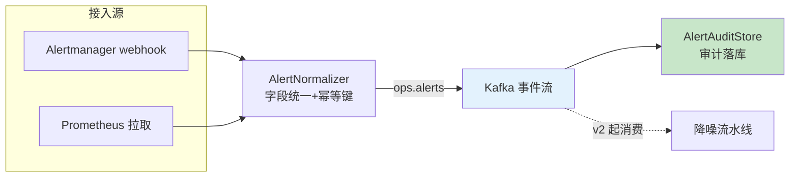

# 项目 09：智能运维 AIOps 平台 — 01-最小 Demo 搭建

> **定位**：把 Prometheus 告警接入为**结构化事件流**——统一告警模型、去重、审计落库。本篇刻意不做 LLM（先让"数据进得来、长得规范"），后续迭代的降噪/RCA 全部消费这个事件流。本文代码为**完整可手写**（含全部 import、无省略），照抄即可编译运行。
>
> 「遇到阻塞？→ [教程 08-架构师进阶/08-响应式错误处理 §事件流]、[教程 01-WebFlux与响应式编程/01-Reactor核心 §6]、[教程 02-SpringAI核心机制/06-SSE流式通信]」

---

## 1. 为什么最小 Demo 是"告警接入"而不是直接做降噪

降噪、RCA、知识飞轮都依赖**同一份规范化的告警事件流**。如果先把告警接进来、定义好统一模型与存储，后续所有能力就有了共同的"原料"。反之直接做降噪，会发现每条告警的字段不一致（Prometheus 的 label、ELK 的 message、OTel 的 span attribute），LLM 无法稳定消费。

**v1 只做三件事**：① 拉取/接收 Prometheus 告警；② 规范化为统一 `AlertEvent`；③ 写入 Kafka（事件流）+ 审计落库。

### 1.1 本节核对（范围理解，一句话级）

- [ ] 能一句话说清"最小 Demo 为什么是告警接入"：为后续降噪/RCA 提供共同的结构化原料。

## 2. 四问

| 问 | 答 |
|----|----|
| **新增了什么需求** | ① Prometheus 告警接入为统一 `AlertEvent` ② 幂等去重键（label 集哈希）③ 事件流进 Kafka + 审计落库 |
| **影响了哪些模块** | 全新模块（v1 起步）：`alert`（模型/规范化）、`ingest`（Kafka 接线）、审计存储 |
| **架构如何演进** | 从零到"结构化事件流最小内核"：webhook 双通道接入 → 规范化 → Kafka + 审计落库；后续降噪/RCA 全部消费同一事件流 |
| **上一版痛点是什么** | 无（v1 起步）。对齐的行业现状：告警字段不一致（Prometheus label / ELK message / OTel span attribute），LLM 无法稳定消费 |

### 2.1 本节核对（四问自测，轻量）

- [ ] 能说出 v1 三件事（接入/规范化/落流+审计）各自的交付物。
- [ ] 能解释"为什么不能直接做降噪"——字段不一致导致 LLM 无法稳定消费。
- [ ] §1 与 §2 的痛点描述一致（同一故障爆多条相关告警）。

## 3. 接入流



**v1 关键决策**：`fingerprint` 是 Prometheus Alertmanager 的去重基准（label 集哈希），保留它是为了 v2 降噪时**确定性去重先行**（LLM 建在其上而非替代它，[调研 AIOps 2026 §告警降噪]）。

### 3.1 本节核对（接入流理解）

| # | 核对项 | 判据 |
|---|--------|------|
| 1 | 双通道都汇入同一规范化器 | webhook 与拉取两源在图中均指向 `AlertNormalizer` |
| 2 | 降噪是 v2 起才消费事件流 | 图中降噪节点为虚线（`-.->`），不在 v1 链路内 |
| 3 | fingerprint 与 alertId 职责不混 | fingerprint=Alertmanager 计算；alertId=本平台规范化后计算 |

## 4. 完整代码（照抄即可）

### 4.1 `AlertEvent.java`（统一告警模型）

```java
package com.aiops.platform.alert;

import java.time.Instant;
import java.util.Map;

/**
 * Java 21 record —— 统一告警模型（后续所有迭代消费它）。
 * alertId 是幂等去重键（canonical labels 哈希），与 Prometheus fingerprint 不同：
 * fingerprint 由 Alertmanager 计算，alertId 由本平台对 label 集规范化后计算。
 */
public record AlertEvent(
        String alertId,                    // 幂等去重键（label 集哈希）
        String fingerprint,                // Prometheus 的 label 指纹
        long startedAt,                    // 触发时间（epoch ms）
        long endsAt,                       // 恢复时间（未恢复为 0）
        String severity,                   // critical/warning/info
        String alertName,                  // 告警规则名
        Map<String, String> labels,        // Prometheus label（含 instance/job 等）
        Map<String, String> annotations,   // 告警描述（含 summary/description）
        String status,                     // firing/resolved
        Instant ingestedAt                 // 平台接入时间
) {}
```

### 4.2 `AlertmanagerPayload.java`（webhook 请求体）

```java
package com.aiops.platform.alert;

import java.time.Instant;
import java.util.List;
import java.util.Map;

/**
 * Alertmanager webhook 的 JSON 请求体（只声明本项目用到的字段）。
 * 真实告警体含 generatorURL/groupLabels/commonLabels 等，可按需追加。
 */
public record AlertmanagerPayload(List<Alert> alerts) {

    public record Alert(
            String status,                  // firing/resolved
            Map<String, String> labels,
            Map<String, String> annotations,
            Instant startsAt,
            Instant endsAt,
            String fingerprint
    ) {}
}
```

### 4.3 `AlertNormalizer.java`（字段统一 + 幂等键）

```java
package com.aiops.platform.alert;

import org.springframework.stereotype.Component;

import java.nio.charset.StandardCharsets;
import java.security.MessageDigest;
import java.security.NoSuchAlgorithmException;
import java.time.Instant;
import java.util.HexFormat;
import java.util.Map;
import java.util.stream.Collectors;

/**
 * 告警规范化器：把异构告警源字段统一到 AlertEvent。
 * normalize 是纯函数（无副作用），可在 Flux 链上安全调用。
 */
@Component
public class AlertNormalizer {

    public AlertEvent normalize(AlertmanagerPayload.Alert raw) {
        Map<String, String> labels = raw.labels() == null ? Map.of() : raw.labels();
        Map<String, String> annotations = raw.annotations() == null ? Map.of() : raw.annotations();
        return new AlertEvent(
                sha256(canonicalLabels(labels)),          // 幂等键
                raw.fingerprint(),
                raw.startsAt() == null ? 0L : raw.startsAt().toEpochMilli(),
                raw.endsAt() == null ? 0L : raw.endsAt().toEpochMilli(),
                normalizeSeverity(labels.getOrDefault("severity", "warning")),
                labels.getOrDefault("alertname", "unknown"),
                Map.copyOf(labels),
                Map.copyOf(annotations),
                raw.status() == null ? "firing" : raw.status(),
                Instant.now()
        );
    }

    private String normalizeSeverity(String raw) {
        return switch (raw.toLowerCase()) {
            case "critical", "p0", "severe" -> "critical";
            case "warning", "warn" -> "warning";
            default -> "info";
        };
    }

    /** 按 key 排序后拼接 label 对——同 label 集无论顺序都得到相同幂等键。 */
    private String canonicalLabels(Map<String, String> labels) {
        return labels.entrySet().stream()
                .sorted(Map.Entry.comparingByKey())
                .map(e -> e.getKey() + "=" + e.getValue())
                .collect(Collectors.joining(","));
    }

    private String sha256(String s) {
        try {
            MessageDigest digest = MessageDigest.getInstance("SHA-256");
            byte[] hash = digest.digest(s.getBytes(StandardCharsets.UTF_8));
            return HexFormat.of().formatHex(hash);
        } catch (NoSuchAlgorithmException e) {
            throw new IllegalStateException("SHA-256 不可用", e);
        }
    }
}
```

### 4.4 `AlertWebhookController.java`（响应式接入）

```java
package com.aiops.platform.alert;

import com.aiops.platform.ingest.KafkaConfig;
import org.slf4j.Logger;
import org.slf4j.LoggerFactory;
import org.springframework.http.ResponseEntity;
import org.springframework.kafka.core.KafkaTemplate;
import org.springframework.web.bind.annotation.PostMapping;
import org.springframework.web.bind.annotation.RequestBody;
import org.springframework.web.bind.annotation.RestController;
import reactor.core.publisher.Flux;
import reactor.core.publisher.Mono;
import reactor.core.scheduler.Schedulers;

/**
 * 接收 Alertmanager webhook：规范化 → 进 Kafka 事件流。
 * Kafka 不可用时直落审计库（告警是生命线，v1 就建立"绝不丢"纪律，[ADR-407]）。
 */
@RestController
public class AlertWebhookController {

    private static final Logger log = LoggerFactory.getLogger(AlertWebhookController.class);
    private static final String TOPIC = "ops.alerts";

    private final AlertNormalizer normalizer;
    private final KafkaTemplate<String, AlertEvent> producer;
    private final AlertAuditStore auditStore;

    public AlertWebhookController(AlertNormalizer normalizer,
                                  KafkaTemplate<String, AlertEvent> producer,
                                  AlertAuditStore auditStore) {
        this.normalizer = normalizer;
        this.producer = producer;
        this.auditStore = auditStore;
    }

    @PostMapping("/webhooks/alertmanager")
    public Mono<ResponseEntity<Void>> receive(@RequestBody AlertmanagerPayload payload) {
        return Flux.fromIterable(payload.alerts())
                .map(normalizer::normalize)
                .flatMap(this::ingest)                     // 并行发送（WebFlux 非阻塞）
                .then(Mono.just(ResponseEntity.ok().build()));
    }

    private Mono<Void> ingest(AlertEvent e) {
        // KafkaTemplate.send 是阻塞式初始化调用（spring-kafka 4.x 无响应式模板）——
        // 用 fromCallable + subscribeOn(boundedElastic) 桥接，发送本身是异步（CompletableFuture）。
        return Mono.fromCallable(() -> producer.send(TOPIC, e.alertId(), e))
                .subscribeOn(Schedulers.boundedElastic())
                .flatMap(future -> Mono.fromCompletionStage(future))
                .then()
                .onErrorResume(err -> {                    // Kafka 故障 → 直落审计（不丢告警）
                    log.warn("Kafka 不可用，告警直落审计库：{}", err.getMessage());
                    return auditStore.save(e);
                });
    }
}
```

> **注意**：`KafkaConfig` 提供 `KafkaTemplate` Bean，见 [4.6 KafkaConfig.java]。

### 4.5 `AlertAuditStore.java`（审计落库，JdbcClient）

```java
package com.aiops.platform.alert;

import com.fasterxml.jackson.databind.ObjectMapper;
import org.springframework.jdbc.core.simple.JdbcClient;
import org.springframework.stereotype.Repository;
import reactor.core.publisher.Mono;
import reactor.core.scheduler.Schedulers;

/**
 * 审计落库：每条告警事件留痕（谁在何时收到什么告警）——后续迭代的复盘原料。
 * JdbcClient 是阻塞 JDBC，WebFlux 中必须用 boundedElastic 桥接（[教程 08-架构师进阶/08-响应式错误处理 §6]）。
 */
@Repository
public class AlertAuditStore {

    private final JdbcClient jdbc;
    private final ObjectMapper mapper;

    public AlertAuditStore(JdbcClient jdbc, ObjectMapper mapper) {
        this.jdbc = jdbc;
        this.mapper = mapper;
    }

    public Mono<Void> save(AlertEvent e) {
        return Mono.fromCallable(() -> {
                    String labelsJson = mapper.writeValueAsString(e.labels());
                    String annJson = mapper.writeValueAsString(e.annotations());
                    jdbc.sql("""
                            INSERT INTO alert_audit(alert_id, fingerprint, severity, alert_name,
                                                    status, labels_json, annotations, started_at, ingested_at)
                            VALUES(:alertId, :fingerprint, :severity, :alertName,
                                   :status, :labelsJson, :annotations, :startedAt, :ingestedAt)
                            ON CONFLICT (alert_id) DO NOTHING
                            """)
                            .param("alertId", e.alertId())
                            .param("fingerprint", e.fingerprint())
                            .param("severity", e.severity())
                            .param("alertName", e.alertName())
                            .param("status", e.status())
                            .param("labelsJson", labelsJson)
                            .param("annotations", annJson)
                            .param("startedAt", e.startedAt())
                            .param("ingestedAt", e.ingestedAt().toEpochMilli())
                            .update();
                    return null;
                })
                .subscribeOn(Schedulers.boundedElastic())
                .then();
    }
}
```

### 4.6 `KafkaConfig.java`（Kafka 事件流接线）

```java
package com.aiops.platform.ingest;

import com.aiops.platform.alert.AlertEvent;
import org.apache.kafka.clients.consumer.ConsumerConfig;
import org.apache.kafka.clients.producer.ProducerConfig;
import org.apache.kafka.common.serialization.StringDeserializer;
import org.apache.kafka.common.serialization.StringSerializer;
import org.springframework.beans.factory.annotation.Value;
import org.springframework.context.annotation.Bean;
import org.springframework.context.annotation.Configuration;
import org.springframework.kafka.core.ConsumerFactory;
import org.springframework.kafka.core.DefaultKafkaConsumerFactory;
import org.springframework.kafka.core.DefaultKafkaProducerFactory;
import org.springframework.kafka.core.KafkaTemplate;
import org.springframework.kafka.core.ProducerFactory;
import org.springframework.kafka.support.serializer.JsonDeserializer;
import org.springframework.kafka.support.serializer.JsonSerializer;

import java.util.HashMap;
import java.util.Map;

/**
 * Kafka 事件流接线。Producer 与 Consumer 都用 JSON 序列化 AlertEvent。
 * spring-kafka 4.x 已移除响应式模板（ReactiveKafkaProducerTemplate 不复存在）：
 * Producer 走阻塞 KafkaTemplate（调用方用 boundedElastic 桥接），
 * Consumer 走 @KafkaListener（专用消费线程，见 [4.7 AlertStreamProcessor.java]）。
 * 生产环境 bootstrap-servers 从环境变量注入，禁止硬编码。
 */
@Configuration
public class KafkaConfig {

    @Value("${spring.kafka.bootstrap-servers}")
    private String bootstrapServers;

    @Bean
    public ProducerFactory<String, AlertEvent> alertProducerFactory() {
        Map<String, Object> props = new HashMap<>();
        props.put(ProducerConfig.BOOTSTRAP_SERVERS_CONFIG, bootstrapServers);
        props.put(ProducerConfig.KEY_SERIALIZER_CLASS_CONFIG, StringSerializer.class);
        props.put(ProducerConfig.VALUE_SERIALIZER_CLASS_CONFIG, JsonSerializer.class);
        props.put(JsonSerializer.ADD_TYPE_INFO_HEADERS, false);   // 类型信息写 headers，与消费者约定
        return new DefaultKafkaProducerFactory<>(props);
    }

    @Bean
    public KafkaTemplate<String, AlertEvent> alertKafkaTemplate() {
        return new KafkaTemplate<>(alertProducerFactory());
    }

    @Bean
    public ConsumerFactory<String, AlertEvent> alertConsumerFactory() {
        Map<String, Object> props = new HashMap<>();
        props.put(ConsumerConfig.BOOTSTRAP_SERVERS_CONFIG, bootstrapServers);
        props.put(ConsumerConfig.GROUP_ID_CONFIG, "aiops-alert-ingest");
        props.put(ConsumerConfig.AUTO_OFFSET_RESET_CONFIG, "latest");
        props.put(ConsumerConfig.KEY_DESERIALIZER_CLASS_CONFIG, StringDeserializer.class);
        props.put(ConsumerConfig.VALUE_DESERIALIZER_CLASS_CONFIG, JsonDeserializer.class);
        props.put(JsonDeserializer.VALUE_DEFAULT_TYPE, AlertEvent.class.getName());
        props.put(JsonDeserializer.TRUSTED_PACKAGES, "com.aiops.platform.alert");
        return new DefaultKafkaConsumerFactory<>(props);
    }
}
```

### 4.7 `AlertStreamProcessor.java`（消费事件流 → 审计落库）

```java
package com.aiops.platform.ingest;

import com.aiops.platform.alert.AlertAuditStore;
import com.aiops.platform.alert.AlertEvent;
import org.slf4j.Logger;
import org.slf4j.LoggerFactory;
import org.springframework.kafka.annotation.KafkaListener;
import org.springframework.stereotype.Component;

/**
 * 消费 ops.alerts 事件流并落审计库。@KafkaListener 运行在 Kafka 专用消费线程
 * （非 Netty EventLoop），内部阻塞落库不违反 WebFlux 铁律；
 * 单条失败记录日志但不终止消费（链路自愈由 v8 降级矩阵覆盖）。
 */
@Component
public class AlertStreamProcessor {

    private static final Logger log = LoggerFactory.getLogger(AlertStreamProcessor.class);

    private final AlertAuditStore auditStore;

    public AlertStreamProcessor(AlertAuditStore auditStore) {
        this.auditStore = auditStore;
    }

    @KafkaListener(topics = "ops.alerts", groupId = "aiops-alert-ingest")
    public void consume(AlertEvent alert) {
        try {
            auditStore.save(alert).block();      // Kafka 消费线程阻塞可接受（非 EventLoop）
        } catch (Exception e) {
            log.error("审计落库失败 alertId={}: {}", alert.alertId(), e.getMessage());
        }
    }
}
```

### 4.8 `db/schema-v1.sql`（审计表 DDL）

```sql
CREATE TABLE IF NOT EXISTS alert_audit (
    alert_id      VARCHAR(64)  PRIMARY KEY,
    fingerprint   VARCHAR(64)  NOT NULL,
    severity      VARCHAR(16)  NOT NULL,
    alert_name    VARCHAR(128) NOT NULL,
    status        VARCHAR(16)  NOT NULL,
    labels_json   JSONB        NOT NULL,
    annotations   JSONB        NOT NULL,
    started_at    BIGINT       NOT NULL,
    ingested_at   BIGINT       NOT NULL
);

-- 审计查询/复盘索引
CREATE INDEX IF NOT EXISTS idx_alert_audit_time ON alert_audit (ingested_at);
```

### 4.9 `application.yaml` + `application-aiops.yaml`（两段式配置，v1 基线）

配置采用**两段式**：`application.yaml` 只留骨架（profile 激活 + `.env` 导入）；全部业务配置收纳进 `application-aiops.yaml`（显式声明 `server.port: 8081`）。后续迭代的配置增量一律**追加写入 `application-aiops.yaml`**（02-§3.9 pgvector、03-§3.9 Prometheus、05-§4.8 Redis、08-§3.6 降级矩阵）。

```yaml
# application.yaml（骨架，全项目统一，仅此两段）
spring:
  config:
    import: optional:file:.env[.properties]
  profiles:
    active: aiops
```

```yaml
# application-aiops.yaml（业务配置，v1 基线）
server:
  port: 8081

spring:
  ai:
    openai:
      base-url: ${OPENAI_BASE_URL:https://api.deepseek.com}
      api-key: ${OPENAI_API_KEY:sk-xxxx}        # 生产用环境变量，禁止硬编码
  kafka:
    bootstrap-servers: ${KAFKA_BOOTSTRAP:localhost:9092}
  datasource:
    url: jdbc:postgresql://localhost:5432/aiops
    username: ${DB_USER:postgres}
    password: ${DB_PASSWORD:postgres}
```

> **依赖**：基线 pom.xml（见 [00-需求分析与架构设计 §5.1](00-需求分析与架构设计.md)）已含 `spring-boot-starter-kafka`（spring-kafka 4.x 已移除响应式模板，本迭代走阻塞 `KafkaTemplate` + `@KafkaListener`）、`spring-boot-starter-jdbc`、`postgresql`。v1 无需新增依赖。

### 4.10 本节测试与验证（告警接入、幂等键与审计落库）

**前置条件**：PG（5432/aiops）与 Kafka（9092）可连；`db/schema-v1.sql` 已执行；应用按 §4.9 两段式配置以 aiops profile 启动成功（监听 8081）：

```bash
mvn spring-boot:run -Dspring-boot.run.profiles=aiops
```

**材料 A——webhook 模拟请求（两条同 label 集、顺序不同）**：

```bash
curl -s -X POST http://localhost:8081/webhooks/alertmanager \
  -H "Content-Type: application/json" -d '{
  "alerts": [
    {"status":"firing","labels":{"alertname":"HighMemory","severity":"critical","instance":"db-01","job":"mysql"},
     "annotations":{"summary":"内存 >90%"},"startsAt":"2026-08-22T08:00:00Z","fingerprint":"fp-001"},
    {"status":"firing","labels":{"job":"mysql","instance":"db-01","severity":"critical","alertname":"HighMemory"},
     "annotations":{"summary":"内存 >90%"},"startsAt":"2026-08-22T08:00:00Z","fingerprint":"fp-001"}
  ]}'
```

**材料 B——审计核对 SQL**：

```sql
SELECT alert_id, fingerprint, severity, alert_name, status FROM alert_audit WHERE fingerprint = 'fp-001';
SELECT labels_json FROM alert_audit WHERE fingerprint = 'fp-001' LIMIT 1;
```

**步骤与断言**：

| # | 操作 | 预期（PASS 判据） |
|---|------|------------------|
| 1 | curl 返回 | HTTP 200，无异常日志 |
| 2 | 材料 B 第一条 | 仅 **1 行**（两条同 label 集 → 同一 alertId，`ON CONFLICT DO NOTHING` 幂等） |
| 3 | severity 归一化 | `critical`（labels 里原值即 critical；若发 `P0` 也归一为 critical，见 §4.3 `normalizeSeverity`） |
| 4 | labels_json | JSONB 存储完整 label 集，`annotations` 非 null（空时为 `{}`） |
| 5 | 重放材料 A | 行数仍为 1（幂等键跨请求稳定） |
| 6 | 停 Kafka 后再发一条（severity=warning） | 应用日志出现"Kafka 不可用，告警直落审计库"，且审计库新增该行（ADR-407 兜底生效） |
| 7 | 线程模型抽检 | 日志无 `block()/blockFirst() are blocking` 警告（EventLoop 零阻塞） |

**失败排查**：①表不存在→schema-v1.sql 未执行；②材料 B 查出 2 行→label 集实际不一致（多/少空格或隐藏 key），比对 labels_json；③步骤 6 未落审计→`onErrorResume` 未触发，确认 Kafka send 抛错而非静默重试堆积；④启动即反序列化失败→`JsonDeserializer.VALUE_DEFAULT_TYPE` 与 `AlertEvent` 全限定名不一致；⑤405/404→路径非 `/webhooks/alertmanager` 或未用 POST。

## 5. 全篇回归验证

> 各节的验证材料与断言已上移至 §4.10（本节测试与验证）；本表为整篇迭代的回归验收，不重复材料。

| # | 验收项 | 标准 |
|---|--------|------|
| 1 | 接入完整 | Prometheus 告警 100% 转为统一 AlertEvent（字段不丢失） |
| 2 | 幂等键 | 同 label 集告警的 alertId 稳定（fingerprint 相同） |
| 3 | 审计留痕 | 每条告警事件入审计库（含 severity 归一化） |
| 4 | 吞吐 | 单实例承受 2000 msg/min 不丢（Kafka 缓冲） |
| 5 | 无阻塞 | 阻塞调用（Kafka/JDBC）全部走 boundedElastic / Kafka 消费线程，EventLoop 零阻塞 |

**验收对照**（对照上表逐项，标注落地章节）：

| 验收项 | 标准 | 状态 |
|--------|------|------|
| 接入完整 | 告警 100% 转为统一 AlertEvent（字段不丢失） | ✅ §4.10 断言 4（JSONB 存完整 label 集） |
| 幂等键 | 同 label 集告警 alertId 稳定 | ✅ §4.10 断言 2/5（同 label 集仅 1 行；重放仍 1 行） |
| 审计留痕 | 每条告警入审计库（含 severity 归一化） | ✅ §4.10 断言 3 + 断言 6（Kafka 故障直落审计，ADR-407） |
| 吞吐 | 单实例 2000 msg/min 不丢 | ✅ §4.10 材料 A 批量重放（Kafka 缓冲承载，回归统计项） |
| 无阻塞 | EventLoop 零阻塞 | ✅ §4.10 断言 7（无 block() 警告） |

## 6. 本迭代的 ADR

| # | 决策 | 理由 |
|---|------|------|
| ADR-400（最小 Demo） | 告警统一模型先行，后续迭代全部消费它 | 不先定义 AlertEvent，降噪/RCA 会因字段不一致无法稳定消费 |
| ADR-407（v1 预埋） | 告警是生命线：Kafka 故障直落审计，绝不丢 | 丢告警是确定性事故；降噪粗糙只是质量下降（v8 常驻） |

### 6.1 本节核对（ADR 一致性）

| # | 核对项 | 判据 |
|---|--------|------|
| 1 | ADR-407 在代码中有落点 | `AlertWebhookController.ingest` 的 `onErrorResume` 直落审计（§4.4） |
| 2 | ADR-400 的统一模型被后续迭代消费 | [02]/[03] 均以 `AlertEvent` 为输入 |
| 3 | 决策与 [13-ADR架构决策记录 §3] 总账对齐 | ADR-400/407 在总账中存在且状态一致 |

## 7. v1 的痛点（驱动下一迭代）

接入一周后，值班工程师反馈两个真实痛点：

1. **告警还是洪水**——webhook 进来的 2000 条/min 里，同一个故障在依赖链上爆出 20 条相关告警（前端 5xx → 支付超时 → 订单查询慢 → DB 连接池满），人眼无法关联。**需要语义聚类把"相关告警"归到一个 incident**
2. **没有"该先看哪条"**——降噪不只是删掉误报，还要告诉值班"这 20 条里，最先爆的是 DB 连接池"（拓扑感知的根因前置）

这两个痛点指向 **v2 告警降噪聚类**。→ [02-告警降噪聚类.md](02-告警降噪聚类.md)

### 7.1 本节核对（痛点与下一迭代对齐）

| # | 核对项 | 判据 |
|---|--------|------|
| 1 | 痛点 1（告警洪水）能被 v2 主题覆盖 | [02-告警降噪聚类 §2] 三层流水线含语义聚类 |
| 2 | 痛点 2（根因前置）有明确承接 | v2 拓扑感知降噪 / v3 RCA 编排任一承接 |
| 3 | 痛点描述基于真实接入行为 | 与 §4.10 验证中观察到的告警形态一致 |
