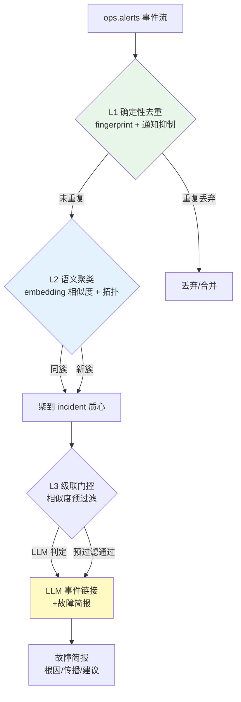

# 项目 09：智能运维 AIOps 平台 — 02-告警降噪聚类

> **定位**：把"2000 条告警/分钟"变成"值班只看 1 份故障简报"——三层降噪流水线（确定性去重 → 语义聚类 → LLM 事件链接与简报）。教程 38 级联路由 + 教程 22 标签设计的落地。本文代码为**完整可手写**（含全部 import、无省略）。
>
> 「遇到阻塞？→ [教程 38-Agent性能优化 §级联路由]、[教程 22-全链路可观测性 §标签设计]、[附录 10-语义缓存与性能/00-语义缓存实现 §相似查询缓存]」

---

## 1. 四问

| 问 | 答 |
|----|----|
| **新增了什么需求** | ① 三层降噪流水线（L1 去重 → L2 语义聚类 → L3 LLM 简报）② 输出"故障简报"（根因候选+传播路径+推荐动作）③ LLM 降级时告警必须放行（不丢告警） |
| **影响了哪些模块** | 在 v1 事件流之上加**降噪流水线**——不新增服务，作为消费 Kafka `ops.alerts` 的处理器；新增 `alert` 包的 `DedupWindow`/`SemanticClusterer`/`IncidentBriefService` |
| **架构如何演进** | v1 的"接入"演进为"接入 + 处理"：事件流 → L1 去重 → L2 聚类 → L3 门控 + LLM 简报 → 故障简报入库 |
| **上一版痛点是什么** | ① 告警洪水（2000/min）无法关联 ② 没有"该先看哪条" ③ LLM 调用成本不可控 |

**新增需求细节**：告警量降 80%+；输出"故障简报"（根因候选+传播路径+推荐动作）；LLM 降级时告警必须放行（不丢告警）。

### 1.1 本节核对（四问自测，轻量）

- [ ] 能说出三层各自的技术与成本（L1 零成本 / L2 embedding 毫秒级 / L3 LLM 仅 3-5% 流量）。
- [ ] 能指出降噪流水线的输入是 Kafka `ops.alerts`（复用 v1 事件流，不新增服务）。

## 2. 三层降噪流水线



**分层成本逻辑**（[调研 AIOps 2026 §告警降噪]）：L1 零成本确定性（Alertmanager fingerprint 基准）；L2 毫秒级 embedding（本地小模型）；L3 一次 LLM 调用（仅可疑簇触发，约 3-5% 流量）。

### 2.1 本节核对（流水线理解）

| # | 核对项 | 判据 |
|---|--------|------|
| 1 | 三层顺序与短路 | 去重在聚类前（重复即丢弃，不进 L2）；门控在 LLM 前 |
| 2 | 门控条件 | 簇 alertCount ≥3 或含 critical 才触发 LLM（对应 §3.5 `needsLLM`） |
| 3 | 降级语义 | LLM 失败回退规则简报，告警不放行即违背 ADR-407 |

## 3. 完整代码（照抄即可）

### 3.1 `IncidentCluster.java` 与 `IncidentBrief.java`（领域模型）

```java
package com.aiops.platform.alert;

import java.time.Instant;
import java.util.List;

/**
 * 一个 incident = 一次故障的所有相关告警。由 L2 语义聚类生成，L3 消费生成简报。
 */
public record IncidentCluster(
        String incidentId,
        String rootService,          // 拓扑根因候选（簇内最早告警所在服务）
        int alertCount,
        List<String> severities,     // 簇内出现的 severity 集合
        List<AlertEvent> alerts,
        Instant firstSeen,
        Instant lastSeen
) {}
```

```java
package com.aiops.platform.alert;

import java.util.List;

/**
 * 故障简报（L3 输出）。根因带置信度，证据供值班复核。
 */
public record IncidentBrief(
        String incidentId,
        RootCause rootCause,
        List<String> propagation,        // 传播路径（依赖链上的顺序）
        String recommendedAction,        // 推荐处置（标注可逆性）
        List<String> evidence            // 支撑证据（告警名/标签）
) {
    public record RootCause(String service, double confidence, String reason) {}
}
```

### 3.2 `DedupWindow.java`（L1 确定性去重）

```java
package com.aiops.platform.alert;

import com.github.benmanes.caffeine.cache.Cache;
import com.github.benmanes.caffeine.cache.Caffeine;
import org.springframework.stereotype.Component;

import java.time.Duration;

/**
 * L1 确定性去重：Alertmanager 三参数语义的简化版——group_wait 窗口内
 * 同 fingerprint 只放行一次。Caffeine 本地缓存（单实例适用；多实例需分布式窗口，v8 处理）。
 */
@Component
public class DedupWindow {

    private static final long DEDUP_WINDOW_MS = 300_000L;   // 5 分钟

    private final Cache<String, Long> seen = Caffeine.newBuilder()
            .expireAfterWrite(Duration.ofMinutes(5))
            .maximumSize(10_000)
            .build();

    /** 返回 true 表示该告警在窗口内重复，应合并/丢弃。 */
    public boolean isDuplicate(AlertEvent e) {
        Long prev = seen.getIfPresent(e.fingerprint());
        seen.put(e.fingerprint(), e.startedAt());
        return prev != null && (e.startedAt() - prev) < DEDUP_WINDOW_MS;
    }
}
```

### 3.3 `IncidentStore.java`（incident 落库 + 质心向量）

```java
package com.aiops.platform.alert;

import com.fasterxml.jackson.core.type.TypeReference;
import com.fasterxml.jackson.databind.ObjectMapper;
import org.springframework.ai.document.Document;
import org.springframework.ai.vectorstore.VectorStore;
import org.springframework.jdbc.core.simple.JdbcClient;
import org.springframework.stereotype.Repository;

import java.time.Instant;
import java.util.ArrayList;
import java.util.List;
import java.util.Map;
import java.util.UUID;

/**
 * incident 的持久化：关系表存聚合元数据（含 alerts_json 明细，供 L3 简报），
 * pgvector 存聚类质心（L2 查找相似簇用）。
 * 质心文本 = 首条告警的"告警名+severity+annotations"，后续告警归入不重算质心（简化版）。
 */
@Repository
public class IncidentStore {

    private final VectorStore vectorStore;
    private final JdbcClient jdbc;
    private final ObjectMapper mapper;

    public IncidentStore(VectorStore vectorStore, JdbcClient jdbc, ObjectMapper mapper) {
        this.vectorStore = vectorStore;
        this.jdbc = jdbc;
        this.mapper = mapper;
    }

    /** 建新簇：落 incident 表（含首条告警）+ 质心向量入 pgvector。 */
    public String create(AlertEvent e) {
        String incidentId = UUID.randomUUID().toString();
        long now = System.currentTimeMillis();
        try {
            jdbc.sql("""
                    INSERT INTO incident(incident_id, root_service, alert_count, severities,
                                         alerts_json, first_seen, last_seen)
                    VALUES(:incidentId, :rootService, 1, :severities, :alertsJson, :firstSeen, :lastSeen)
                    """)
                    .param("incidentId", incidentId)
                    .param("rootService", e.labels().getOrDefault("service", "unknown"))
                    .param("severities", mapper.writeValueAsString(List.of(e.severity())))
                    .param("alertsJson", mapper.writeValueAsString(List.of(e)))
                    .param("firstSeen", now)
                    .param("lastSeen", now)
                    .update();
        } catch (Exception ex) {
            throw new IllegalStateException("incident 序列化失败", ex);
        }

        vectorStore.add(List.of(Document.builder()
                .text(clusterText(e))
                .metadata(Map.of("incidentId", incidentId))
                .build()));
        return incidentId;
    }

    /** 归入已有簇：追加告警明细 + 合并 severity 集合（读-改-写，简化版）。 */
    public void addAlert(String incidentId, AlertEvent e) {
        IncidentCluster existing = load(incidentId);
        List<AlertEvent> alerts = new ArrayList<>(existing.alerts());
        alerts.add(e);
        List<String> sevs = new ArrayList<>(existing.severities());
        if (!sevs.contains(e.severity())) {
            sevs.add(e.severity());
        }
        try {
            jdbc.sql("""
                    UPDATE incident
                    SET alert_count = :count, last_seen = :lastSeen,
                        alerts_json = :alertsJson, severities = :severities
                    WHERE incident_id = :incidentId
                    """)
                    .param("incidentId", incidentId)
                    .param("count", alerts.size())
                    .param("lastSeen", System.currentTimeMillis())
                    .param("alertsJson", mapper.writeValueAsString(alerts))
                    .param("severities", mapper.writeValueAsString(sevs))
                    .update();
        } catch (Exception ex) {
            throw new IllegalStateException("incident 更新失败", ex);
        }
    }

    /** 加载簇（L3 简报输入，含告警明细）。 */
    public IncidentCluster load(String incidentId) {
        try {
            return jdbc.sql("""
                    SELECT root_service, alert_count, severities, alerts_json, first_seen, last_seen
                    FROM incident WHERE incident_id = :incidentId
                    """)
                    .param("incidentId", incidentId)
                    .query((rs, i) -> new IncidentCluster(
                            incidentId,
                            rs.getString("root_service"),
                            rs.getInt("alert_count"),
                            mapper.readValue(rs.getString("severities"),
                                    new TypeReference<List<String>>() {}),
                            mapper.readValue(rs.getString("alerts_json"),
                                    new TypeReference<List<AlertEvent>>() {}),
                            Instant.ofEpochMilli(rs.getLong("first_seen")),
                            Instant.ofEpochMilli(rs.getLong("last_seen"))))
                    .optional()
                    .orElseThrow(() -> new IllegalStateException("incident 不存在: " + incidentId));
        } catch (Exception e) {
            throw new IllegalStateException("incident 反序列化失败", e);
        }
    }

    static String clusterText(AlertEvent e) {
        return e.alertName() + " " + e.severity() + " "
                + String.join(" ", e.annotations().values());
    }
}
```

### 3.4 `SemanticClusterer.java`（L2 语义聚类）

```java
package com.aiops.platform.alert;

import org.springframework.ai.document.Document;
import org.springframework.ai.vectorstore.SearchRequest;
import org.springframework.ai.vectorstore.VectorStore;
import org.springframework.stereotype.Component;
import reactor.core.publisher.Mono;
import reactor.core.scheduler.Schedulers;

import java.util.List;

/**
 * L2 语义聚类：告警文本 embed（pgvector 内部完成）→ 与近 10 分钟 incident 质心比相似度 → 归类或建新簇。
 * VectorStore 是阻塞调用（PgVectorStore 走 JDBC），用 boundedElastic 桥接（[教程 42-响应式错误处理 §6]）。
 */
@Component
public class SemanticClusterer {

    /** 余弦距离阈值（pgvector COSINE_DISTANCE）：低于则归入该簇。需按数据校准。 */
    private static final double MERGE_COSINE_DISTANCE = 0.25;

    private final VectorStore vectorStore;
    private final IncidentStore incidentStore;

    public SemanticClusterer(VectorStore vectorStore, IncidentStore incidentStore) {
        this.vectorStore = vectorStore;
        this.incidentStore = incidentStore;
    }

    public Mono<String> cluster(AlertEvent e) {
        String text = IncidentStore.clusterText(e);
        return Mono.fromCallable(() -> {
                    List<Document> hits = vectorStore.similaritySearch(
                            SearchRequest.builder().query(text).topK(1).build());
                    if (!hits.isEmpty()) {
                        double distance = (Double) hits.get(0).getMetadata()
                                .getOrDefault("distance", 1.0);
                        if (distance < MERGE_COSINE_DISTANCE) {
                            String incidentId = (String) hits.get(0).getMetadata().get("incidentId");
                            incidentStore.addAlert(incidentId, e);   // 归入已有簇
                            return incidentId;
                        }
                    }
                    return incidentStore.create(e);                  // 建新簇
                })
                .subscribeOn(Schedulers.boundedElastic());
    }
}
```

**拓扑感知**：不只比文本相似，还看 label 中的 `instance`/`job`——同一服务的告警优先归簇。上面用 `clusterText` 里拼入 `alertName` + `severity` 的简化近似；生产可把 `labels.get("service")` 前置拼入文本增强拓扑信号。

### 3.5 `IncidentBriefService.java`（L3 级联门控 + LLM 简报）

```java
package com.aiops.platform.alert;

import org.slf4j.Logger;
import org.slf4j.LoggerFactory;
import org.springframework.ai.chat.client.ChatClient;
import org.springframework.stereotype.Service;
import reactor.core.publisher.Mono;
import reactor.core.scheduler.Schedulers;

import java.util.Comparator;
import java.util.List;

/**
 * L3 级联路由：便宜预过滤（簇规模/严重度）门控昂贵的 LLM 调用。
 * 只在"簇里告警数 >= 3 或含 critical"时才触发 LLM 生成简报；
 * LLM 故障时回退规则简报，绝不丢告警（ADR-407）。
 */
@Service
public class IncidentBriefService {

    private static final Logger log = LoggerFactory.getLogger(IncidentBriefService.class);

    private final ChatClient chatClient;

    public IncidentBriefService(ChatClient chatClient) {
        this.chatClient = chatClient;
    }

    /** 级联门控：低危单告警不花 LLM 成本——直接按规则出简报。 */
    public boolean needsLLM(IncidentCluster cluster) {
        return cluster.alertCount() >= 3
                || cluster.severities().contains("critical");
    }

    public Mono<IncidentBrief> generateBrief(IncidentCluster cluster) {
        return Mono.fromCallable(() -> chatClient.prompt()
                        .system("""
                                你是运维值班助手。根据以下告警簇生成故障简报，输出 JSON：
                                1. root_cause: {service, confidence, reason}
                                2. propagation: 传播路径（依赖链上的顺序）
                                3. recommended_action: 推荐处置（标注可逆性）
                                4. evidence: 支撑证据（告警名/标签）
                                只基于给定告警，不臆测；证据不足时 confidence 降低。
                                """)
                        .user(clusterToPrompt(cluster))
                        .call()
                        .entity(IncidentBrief.class))
                .subscribeOn(Schedulers.boundedElastic())
                .onErrorResume(err -> {                     // L3 降级：规则简报，绝不丢告警
                    log.warn("LLM 简报失败，回退规则简报：{}", err.getMessage());
                    return Mono.just(ruleBasedBrief(cluster));
                });
    }

    private String clusterToPrompt(IncidentCluster cluster) {
        StringBuilder sb = new StringBuilder("incident_id=").append(cluster.incidentId()).append('\n');
        cluster.alerts().stream()
                .sorted(Comparator.comparingLong(AlertEvent::startedAt))
                .forEach(a -> sb.append("- [").append(a.severity()).append("] ")
                        .append(a.alertName()).append(" service=")
                        .append(a.labels().getOrDefault("service", "?")).append('\n'));
        return sb.toString();
    }

    /** 规则简报：按 severity 排序，最早告警作根因候选。 */
    private IncidentBrief ruleBasedBrief(IncidentCluster cluster) {
        AlertEvent earliest = cluster.alerts().stream()
                .min(Comparator.comparingLong(AlertEvent::startedAt))
                .orElseThrow();
        return new IncidentBrief(
                cluster.incidentId(),
                new IncidentBrief.RootCause(
                        earliest.labels().getOrDefault("service", "unknown"),
                        0.5, "规则兜底：簇内最早告警所在服务"),
                List.of(earliest.alertName()),
                "按 runbook 人工确认后处置（LLM 不可用）",
                List.of(earliest.alertName() + " @ " + earliest.startedAt()));
    }
}
```

### 3.6 `ChatClientConfig.java`（共享 ChatClient Bean）

```java
package com.aiops.platform.config;

import org.springframework.ai.chat.client.ChatClient;
import org.springframework.context.annotation.Bean;
import org.springframework.context.annotation.Configuration;

/**
 * 共享 ChatClient Bean。工具在 v3/v4 用 .defaultTools() 注册，此处仅搭最小骨架。
 */
@Configuration
public class ChatClientConfig {

    @Bean
    public ChatClient chatClient(ChatClient.Builder builder) {
        return builder.build();
    }
}
```

### 3.7 `db/schema-v2.sql`（incident 表 DDL）

```sql
CREATE TABLE IF NOT EXISTS incident (
    incident_id   VARCHAR(64)  PRIMARY KEY,
    root_service  VARCHAR(128),
    alert_count   INT          NOT NULL DEFAULT 1,
    severities    JSONB        NOT NULL DEFAULT '[]',
    alerts_json   JSONB        NOT NULL DEFAULT '[]',   -- 簇内告警明细（L3 简报输入）
    first_seen    BIGINT       NOT NULL,
    last_seen     BIGINT       NOT NULL
);

CREATE INDEX IF NOT EXISTS idx_incident_last_seen ON incident (last_seen);
```

### 3.8 需在 pom.xml 中添加依赖

```xml
        <!-- 追加（v2）：向量检索（语义聚类） -->
        <dependency>
            <groupId>org.springframework.ai</groupId>
            <artifactId>spring-ai-starter-vector-store-pgvector</artifactId>
        </dependency>
        <!-- 追加（v2）：L1 去重本地缓存 -->
        <dependency>
            <groupId>com.github.ben-manes.caffeine</groupId>
            <artifactId>caffeine</artifactId>
        </dependency>
```

### 3.9 `application.yml` 追加 pgvector 配置

```yaml
spring:
  ai:
    vectorstore:
      pgvector:
        initialize-schema: true
        index-type: HNSW
        distance-type: COSINE_DISTANCE
        dimensions: 1536        # 与 OpenAI text-embedding-3-small 对齐
```

> **注意**：pgvector starter 需要一个 `EmbeddingModel` Bean（`spring-ai-starter-model-openai` 已提供）来 embed 查询文本；HNSW + COSINE_DISTANCE 是语义聚类常用组合。`dimensions` 需与所用 embedding 模型输出维度一致。

### 3.5 告警处置过程可见（哪个告警、为何聚类、如何处置）

> 过程可见性是工业级标配。AIOps 处置告警要可信——运维要看到"哪条告警被聚到哪簇、为何降噪、自动处置做了什么"。告警处理 emit 处置事件：`{alertId, 聚类簇, 降噪理由, 关联根因, 处置动作}`。运维看到"告警A因同窗口+同指标并入簇#3→判为次要→不升级"，而非一堆告警毫无解释。

### 3.10 本节测试与验证（L1 去重 / L2 聚类 / L3 简报）

**前置条件**：v1 验证已通过（webhook→Kafka→审计链路可用）；已按 §3.8 添加依赖并按 §3.9 配置 pgvector；`db/schema-v2.sql` 已执行。

**材料 A——三条相关告警 + 一条重复告警（同一故障簇）**：依次向 `/webhooks/alertmanager` POST（复用 [01 §4.10 材料 A] 的 curl 格式），四次 labels 分别为：

```json
[{"status":"firing","labels":{"alertname":"DbConnPoolHigh","severity":"critical","service":"order-db","instance":"db-01"},"startsAt":"2026-08-22T09:00:00Z","fingerprint":"fp-A1"},
 {"status":"firing","labels":{"alertname":"OrderQuerySlow","severity":"warning","service":"order-db","instance":"db-01"},"startsAt":"2026-08-22T09:00:30Z","fingerprint":"fp-A2"},
 {"status":"firing","labels":{"alertname":"OrderQuerySlow","severity":"warning","service":"order-api","instance":"pod-7"},"startsAt":"2026-08-22T09:01:00Z","fingerprint":"fp-A3"},
 {"status":"firing","labels":{"alertname":"DbConnPoolHigh","severity":"critical","service":"order-db","instance":"db-01"},"startsAt":"2026-08-22T09:02:00Z","fingerprint":"fp-A1"}]
```

**材料 B——incident 核对 SQL**：

```sql
SELECT incident_id, root_service, alert_count, severities, first_seen, last_seen
FROM incident ORDER BY first_seen DESC LIMIT 5;
SELECT alert_count, severities FROM incident WHERE root_service = 'order-db';
```

**步骤与断言**：

| # | 操作 | 预期（PASS 判据） |
|---|------|------------------|
| 1 | 材料四连发 | HTTP 200；第 4 条（fp-A1 重复）在 5 分钟窗口内被 L1 判定重复，不新建簇 |
| 2 | 材料 B | 3 条不同 fingerprint 形成 1 个簇：`alert_count=3`、`severities` 含 critical+warning（fp-A2/A3 语义相近归入 fp-A1 簇） |
| 3 | `last_seen` | 归簇后 `last_seen` 更新（晚于 `first_seen`） |
| 4 | L3 门控 | 簇满足 alertCount≥3 且含 critical → 日志出现 LLM 简报调用；`incident` 簇可读出简报（root_cause.service 为簇内服务） |
| 5 | L3 降级 | 临时改错 `OPENAI_API_KEY` 重发一组 → 日志"LLM 简报失败，回退规则简报"，仍得到 confidence=0.5 的规则简报（ADR-407/406） |
| 6 | 向量质心 | pgvector `vector_store` 表新增文档，metadata 含 `incidentId` |
| 7 | 低危单告警 | 单发 1 条 info 告警 → 不触发 LLM（`needsLLM` 为 false），无简报调用日志 |

**失败排查**：①步骤 2 拆成 3 簇→`MERGE_COSINE_DISTANCE` 过小或 embedding 模型对中文/告警名区分度过高（阈值按数据校准）；②步骤 1 未去重→fingerprint 实际不同（比对 `alert_audit.labels_json`）或两条间隔超过 5 分钟窗口；③步骤 4 无 LLM 日志→簇未达到门控阈值或 `IncidentBriefService` 未被调用；④步骤 5 抛错而非回退→`onErrorResume` 链被吞（确认在 `subscribeOn` 之后）；⑤质心未入库→`spring.ai.vectorstore.pgvector.dimensions` 与 embedding 模型实际维度不符。


## 4. 全篇回归验证

> 各节材料与断言已上移至 §3.10；本表为整篇迭代的回归验收（含 30 天回测类指标），不重复材料。

| # | 验收项 | 标准 |
|---|--------|------|
| 1 | 降噪率 | 告警量降 ≥ 80%（近 30 天回测）；误报率从 60% 降到 < 15% |
| 2 | 聚类准确 | 同一故障的相关告警归簇率 ≥ 90%（人工标注 100 簇抽样） |
| 3 | LLM 成本 | LLM 触发率 < 5% 流量（级联门控生效）；P99 延迟 < 500ms |
| 4 | 降级不丢 | LLM 故障时告警 100% 放行（规则简报） |
| 5 | 简报质量 | 抽检 50 份简报，root_cause 与人工定位一致率 ≥ 70% |

## 5. 本迭代的 ADR

| # | 决策 | 理由 |
|---|------|------|
| ADR-406 | 三层降噪 + 级联门控 | 确定性先过滤（便宜准），LLM 只收尾（贵）；LLM 成本是硬约束 |
| ADR-407 | LLM 降级必须放行告警 | 丢告警是确定性事故；粗糙简报只是质量下降 |
| ADR-408 | 语义聚类用 pgvector + 拓扑 label | 单一 embedding 不够，拓扑是依赖链的便宜近似 |

### 5.1 本节核对（ADR 一致性）

- [ ] ADR-406 落点 = §3.5 `needsLLM` 门控；ADR-407 落点 = §3.5 `onErrorResume` 规则简报；ADR-408 落点 = §3.4 拓扑 label 近似。
- [ ] 三条 ADR 与 [13-ADR架构决策记录 §3] 总账一致。

## 6. v2 的痛点（驱动下一迭代）

降噪把"2000 条"变成"10 个 incident"，但值班工程师的新问题是：**"简报说了根因候选，可我怎么验证？"**——当前简报只是 LLM 的推断，没有拉取对应的 Trace/日志/指标来**实证**。同时，多个 Agent 各查各的（一个查日志、一个查指标），没有统一的编排。→ [03-根因分析RCA.md](03-根因分析RCA.md)

### 6.1 本节核对（痛点承接）

- [ ] 痛点"简报无实证"由 [03] 的多数据源工具（trace/日志/指标）承接。
- [ ] 痛点"无统一编排"由 [03] 的 RCA 多 Agent 编排承接。
