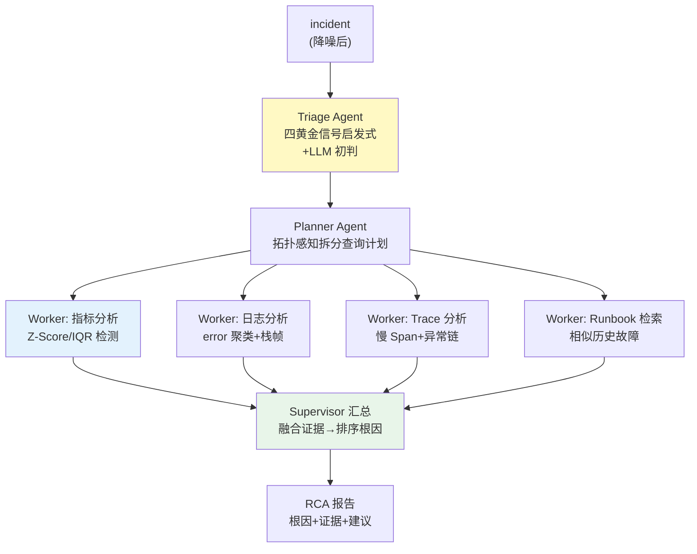

# 项目 09：智能运维 AIOps 平台 — 03-根因分析 RCA

> **定位**：把"简报的根因候选"变成"可实证的根因链"——trace_id 贯穿多数据源，多 Agent（Triage→Planner→并行 Worker→Supervisor）编排拉取 Trace/日志/指标，确定性计算先行、LLM 只读结论。教程 22 全链路可观测的运维侧落地。本文代码为**完整可手写**（含全部 import、无省略）。
>
> 「遇到阻塞？→ [教程 22-全链路可观测性 全篇]、[教程 09-多Agent协作]、[教程 35-高级RAG与AgenticRAG §Agentic 检索]」

---

## 1. 四问

| 问 | 答 |
|----|----|
| **新增了什么需求** | ① RCA 编排层（消费降噪后的 incident）② Prometheus/日志/Trace 检索封装为 `@Tool` ③ Runbook RAG 知识库（grounded 处置建议）④ 输出带置信度排序的根因假设（每条约 1 条证据） |
| **影响了哪些模块** | 新增 `rca` 包（编排器/工具/排名器）；新增 `RunbookRetriever`（RAG，v6 增强为混合检索）；复用 v1/v2 的 `AlertEvent`/`IncidentCluster` |
| **架构如何演进** | 从"LLM 单点推断"演进为"确定性计算先行 + LLM 只读结论"：Triage 启发式 → Worker 并行取证 → Supervisor 融合排序 |
| **上一版痛点是什么** | ① 简报只是 LLM 推断，无实证 ② 多数据源各查各的，无编排 ③ LLM 读原始数据成本高 |

**新增需求量化目标**：根因定位 MTTR 从 45 分钟降到 10 分钟内；单次 RCA 平均 LLM Token ≤ 2k。

## 2. RCA 多 Agent 编排



**层级思想**（[调研 AIOps 2026 §RCA 编排]）：Triage 用启发式快速定位关注域；Planner 把"查什么"拆给并行 Worker（各自查一个数据源）；Supervisor 融合所有证据输出排序根因。**聚合 Agent 不重新分析，只做融合**。

## 3. 完整代码（照抄即可）

### 3.1 领域模型（RCA 相关 record）

```java
package com.aiops.platform.rca;

import java.util.List;
import java.util.Map;

/** 指标时序点。 */
public record MetricPoint(long timestamp, double value, String metric, String service) {}

/** 指标异常（3σ 检出）。 */
public record MetricAnomaly(String service, String metric, long timestamp, double value, double zScore) {}

/** 日志聚类结果（Drain 模板聚类先行）。 */
public record LogCluster(String service, String pattern, int errorCount, long firstSeen) {}

/** Trace Span 信息。 */
public record SpanInfo(String traceId, String spanId, String service, String operation, long durationMs) {}

/** 四路 Worker 的证据汇总（并行 zip 的结果容器）。 */
public record WorkerEvidence(
        List<MetricAnomaly> metrics,
        List<LogCluster> logs,
        List<SpanInfo> traces,
        List<RunbookHit> runbooks) {}

/** 根因候选（按置信度排序）。 */
public record RootCauseCandidate(String service, double confidence, String reason) {}

/** Runbook 检索命中。 */
public record RunbookHit(String runbookId, String title, String summary, String source) {}
```

```java
package com.aiops.platform.rca;

import java.util.List;

/** RCA 报告：根因链 + 证据 + 处置建议（建议必须带 runbook citation）。 */
public record RcaReport(
        String incidentId,
        List<RootCauseCandidate> rootCauses,   // 按置信度排序
        List<String> evidenceChain,            // 指标/日志/trace 证据定位
        String recommendedAction,
        String runbookRef,                     // runbook citation，可被值班快速验证
        double confidence                      // 整体置信度
) {}
```

### 3.2 `PrometheusClient.java`（WebClient → Prometheus HTTP API）

```java
package com.aiops.platform.rca;

import com.fasterxml.jackson.databind.JsonNode;
import org.springframework.beans.factory.annotation.Value;
import org.springframework.stereotype.Component;
import org.springframework.web.reactive.function.client.WebClient;

import java.time.Duration;
import java.util.ArrayList;
import java.util.List;

/**
 * Prometheus 时序查询适配器（range query）。真实 API：
 * GET /api/v1/query_range?query={metric}&start=&end=&step=60
 * 响应里 values 是 [timestamp, "value"] 数组，故用 JsonNode 手工映射。
 * 调用方必须处于 boundedElastic 线程（内部 .block() 是故意的，[教程 42-响应式错误处理 §6]）。
 */
@Component
public class PrometheusClient {

    private final WebClient webClient;

    public PrometheusClient(@Value("${monitoring.prometheus.url}") String prometheusUrl) {
        this.webClient = WebClient.builder().baseUrl(prometheusUrl).build();
    }

    public List<MetricPoint> queryRange(String metric, long fromMs, long toMs) {
        JsonNode body = webClient.get()
                .uri(uri -> uri.path("/api/v1/query_range")
                        .queryParam("query", metric)
                        .queryParam("start", fromMs / 1000)
                        .queryParam("end", toMs / 1000)
                        .queryParam("step", "60")
                        .build())
                .retrieve()
                .bodyToMono(JsonNode.class)
                .block(Duration.ofSeconds(10));

        List<MetricPoint> points = new ArrayList<>();
        for (JsonNode result : body.path("data").path("result")) {
            String service = result.path("metric").path("service").asText("unknown");
            for (JsonNode v : result.path("values")) {
                long ts = v.get(0).asLong();
                double val = Double.parseDouble(v.get(1).asText());
                points.add(new MetricPoint(ts * 1000, val, metric, service));
            }
        }
        return points;
    }
}
```

> **说明**：`TraceClient`/`LogIndexer` 是 ELK/OTel 的适配接口（见 3.3），需按你现有监控栈实现（本仓库不引入具体 ELK/OTel 客户端）。

### 3.3 `ObservabilityTools.java`（数据源工具化 + 确定性过滤）

```java
package com.aiops.platform.rca;

import org.springframework.ai.tool.annotation.Tool;
import org.springframework.ai.tool.annotation.ToolParam;
import org.springframework.stereotype.Component;

import java.util.List;

/**
 * 把 Prometheus/ELK/OTel 查询封装为 Agent 可调用的工具。
 * 工具设计要点：Worker 先做确定性过滤（Drain 日志聚类、Z-Score 指标异常），
 * LLM 只读过滤后的结论——不把 40MB 原始日志喂给 LLM（[调研 AIOps 2026 §CI 诊断的日志预消化]）。
 */
@Component
public class ObservabilityTools {

    private final PrometheusClient prometheusClient;
    private final MetricAnalyzer metricAnalyzer;
    private final TraceClient traceClient;      // 适配接口，按现有 OTel 后端实现
    private final LogIndexer logIndexer;        // 适配接口，按现有 ELK 后端实现

    public ObservabilityTools(PrometheusClient prometheusClient,
                              MetricAnalyzer metricAnalyzer,
                              TraceClient traceClient,
                              LogIndexer logIndexer) {
        this.prometheusClient = prometheusClient;
        this.metricAnalyzer = metricAnalyzer;
        this.traceClient = traceClient;
        this.logIndexer = logIndexer;
    }

    @Tool(description = "查询指标时序，支持范围查询。metric 如 'http_requests_total'")
    public List<MetricPoint> queryMetrics(
            @ToolParam(description = "指标名") String metric,
            @ToolParam(description = "开始时间(epoch ms)") long from,
            @ToolParam(description = "结束时间(epoch ms)") long to) {
        return prometheusClient.queryRange(metric, from, to);
    }

    @Tool(description = "对指标做 3σ 异常检测，返回异常点（确定性计算，LLM 无需读原始序列）")
    public List<MetricAnomaly> detectMetricAnomalies(
            @ToolParam(description = "服务名") String service,
            @ToolParam(description = "指标名") String metric,
            @ToolParam(description = "开始时间(epoch ms)") long from,
            @ToolParam(description = "结束时间(epoch ms)") long to) {
        return metricAnalyzer.detectAnomalies(service, metric,
                prometheusClient.queryRange(metric, from, to));
    }

    @Tool(description = "按 trace_id 查询调用链，返回 Span 列表")
    public List<SpanInfo> queryTrace(
            @ToolParam(description = "trace_id") String traceId) {
        return traceClient.getTrace(traceId);
    }

    @Tool(description = "检索日志，按关键词过滤，返回聚类后的日志片段")
    public List<LogCluster> searchLogs(
            @ToolParam(description = "关键词") String keyword,
            @ToolParam(description = "时间窗口(分钟)") int windowMinutes) {
        return logIndexer.search(keyword, windowMinutes);   // Drain 模板聚类先行
    }
}
```

**适配接口**（`TraceClient` / `LogIndexer`——按你现有监控栈实现）：

```java
package com.aiops.platform.rca;

import java.util.List;

/** OTel Trace 后端适配器。按你的 Jaeger/Tempo/自建 OTel Collector 实现。 */
public interface TraceClient {
    List<SpanInfo> getTrace(String traceId);
}
```

```java
package com.aiops.platform.rca;

import java.util.List;

/** ELK 日志检索适配器。search 返回聚类后的日志（Drain 模板聚类先行，勿返回原始大文本）。 */
public interface LogIndexer {
    List<LogCluster> search(String keyword, int windowMinutes);
}
```

### 3.4 `MetricAnalyzer.java`（确定性 Z-Score 异常检测）

```java
package com.aiops.platform.rca;

import org.springframework.stereotype.Component;

import java.util.List;

/** 指标 Worker 核心：Z-Score（3σ）异常检测，纯确定性，零 LLM 成本。 */
@Component
public class MetricAnalyzer {

    public List<MetricAnomaly> detectAnomalies(String service, String metric, List<MetricPoint> points) {
        if (points.isEmpty()) {
            return List.of();
        }
        double mean = points.stream().mapToDouble(MetricPoint::value).average().orElse(0);
        double std = stdDev(points, mean);
        if (std == 0) {
            return List.of();                     // 恒值序列无异常
        }
        return points.stream()
                .filter(p -> Math.abs(p.value() - mean) > 3 * std)
                .map(p -> new MetricAnomaly(service, metric, p.timestamp(), p.value(),
                        (p.value() - mean) / std))
                .toList();
    }

    private double stdDev(List<MetricPoint> points, double mean) {
        double sumSq = points.stream()
                .mapToDouble(p -> (p.value() - mean) * (p.value() - mean))
                .sum();
        return Math.sqrt(sumSq / points.size());
    }
}
```

### 3.5 `RootCauseRanker.java`（Supervisor 的确定性融合）

```java
package com.aiops.platform.rca;

import org.springframework.stereotype.Component;

import java.util.Comparator;
import java.util.HashMap;
import java.util.List;
import java.util.Map;

/**
 * Supervisor 的确定性排序：按"异常时间最早 + 证据数量 + 异常强度"给根因候选打分。
 * 只做融合，不重新分析（ADR-410）。
 */
@Component
public class RootCauseRanker {

    public List<RootCauseCandidate> rank(WorkerEvidence evidence) {
        Map<String, Double> score = new HashMap<>();
        Map<String, Long> firstAnomaly = new HashMap<>();

        // 指标异常：Z 分越高越像根因，出现越早越像
        for (MetricAnomaly a : evidence.metrics()) {
            score.merge(a.service(), a.zScore(), Double::sum);
            firstAnomaly.merge(a.service(), a.timestamp(), Math::min);
        }
        // 日志错误聚类：错误条数越多越像
        for (LogCluster l : evidence.logs()) {
            score.merge(l.service(), Math.log1p(l.errorCount()) * 0.5, Double::sum);
            firstAnomaly.merge(l.service(), l.firstSeen(), Math::min);
        }
        // Trace 慢 Span（> 1s）：所在服务加分
        for (SpanInfo s : evidence.traces()) {
            if (s.durationMs() > 1000) {
                score.merge(s.service(), 1.0, Double::sum);
            }
        }

        long earliest = firstAnomaly.values().stream().mapToLong(v -> v).min().orElse(Long.MAX_VALUE);
        return score.entrySet().stream()
                .map(e -> new RootCauseCandidate(
                        e.getKey(),
                        normalize(e.getValue()),
                        reasonOf(e.getKey(), e.getValue(), firstAnomaly.getOrDefault(e.getKey(), earliest))))
                .sorted(Comparator.comparingDouble(RootCauseCandidate::confidence).reversed())
                .toList();
    }

    private double normalize(double raw) {
        return Math.min(1.0, Math.max(0.1, raw / 10.0));
    }

    private String reasonOf(String service, double score, long firstSeen) {
        return "service=" + service + " 异常强度得分 " + String.format("%.2f", score)
                + "，最早异常于 " + firstSeen;
    }
}
```

### 3.6 `RunbookRetriever.java`（RAG：相似历史故障检索）

```java
package com.aiops.platform.rca;

import org.springframework.ai.document.Document;
import org.springframework.ai.tool.annotation.Tool;
import org.springframework.ai.tool.annotation.ToolParam;
import org.springframework.ai.vectorstore.SearchRequest;
import org.springframework.ai.vectorstore.VectorStore;
import org.springframework.stereotype.Component;

import java.util.List;

/**
 * Runbook RAG 检索：从知识库召回相似历史故障，给处置建议提供 citation。
 * v3 用纯向量（runbook 文档由 v6 知识飞轮写入 pgvector）；
 * v6 升级为混合检索（FTS + 向量 + RRF + 重排，见 [06-运维知识飞轮]）。
 */
@Component
public class RunbookRetriever {

    private final VectorStore vectorStore;

    public RunbookRetriever(VectorStore vectorStore) {
        this.vectorStore = vectorStore;
    }

    @Tool(description = "检索相似历史故障的 runbook，返回带引用的处置建议")
    public List<RunbookHit> searchRunbooks(
            @ToolParam(description = "根因/症状描述") String query) {
        return vectorStore.similaritySearch(
                        SearchRequest.builder().query(query).topK(5).build())
                .stream()
                .map(this::toHit)
                .toList();
    }

    private RunbookHit toHit(Document d) {
        return new RunbookHit(
                (String) d.getMetadata().getOrDefault("runbookId", "?"),
                (String) d.getMetadata().getOrDefault("title", "untitled"),
                d.getText(),
                "向量检索");
    }
}
```

### 3.7 `RcaOrchestrator.java`（编排：Triage → 并行 Worker → Supervisor）

```java
package com.aiops.platform.rca;

import com.aiops.platform.alert.AlertEvent;
import com.aiops.platform.alert.IncidentCluster;
import org.slf4j.Logger;
import org.slf4j.LoggerFactory;
import org.springframework.ai.chat.client.ChatClient;
import org.springframework.stereotype.Service;
import reactor.core.publisher.Mono;
import reactor.core.scheduler.Schedulers;

import java.util.Comparator;
import java.util.List;

/**
 * RCA 编排器：确定性计算先行、LLM 只读结论（Zenjoy「程序计算、AI 总结」）。
 * ① Triage（确定性四黄金信号）→ ② Worker 并行取证（Z-Score/日志聚类/Trace 慢 Span/Runbook）
 * → ③ Supervisor 确定性排序 → ④ LLM 只对 top 候选做叙事摘要。
 */
@Service
public class RcaOrchestrator {

    private static final Logger log = LoggerFactory.getLogger(RcaOrchestrator.class);

    private final ObservabilityTools observabilityTools;
    private final MetricAnalyzer metricAnalyzer;
    private final RootCauseRanker ranker;
    private final RunbookRetriever runbookRetriever;
    private final ChatClient chatClient;

    public RcaOrchestrator(ObservabilityTools observabilityTools,
                           MetricAnalyzer metricAnalyzer,
                           RootCauseRanker ranker,
                           RunbookRetriever runbookRetriever,
                           ChatClient chatClient) {
        this.observabilityTools = observabilityTools;
        this.metricAnalyzer = metricAnalyzer;
        this.ranker = ranker;
        this.runbookRetriever = runbookRetriever;
        this.chatClient = chatClient;
    }

    public Mono<RcaReport> run(IncidentCluster incident) {
        String focus = deterministicTriage(incident);
        log.info("RCA 启动 incident={} focus={}", incident.incidentId(), focus);
        return gatherEvidence(incident, focus)
                .flatMap(evidence -> {
                    List<RootCauseCandidate> ranked = ranker.rank(evidence);
                    return summarize(ranked, evidence, focus, incident);
                });
    }

    /** ① Triage：确定性启发式——簇内最早告警所在服务为关注域。 */
    private String deterministicTriage(IncidentCluster incident) {
        return incident.alerts().stream()
                .min(Comparator.comparingLong(AlertEvent::startedAt))
                .map(a -> a.labels().getOrDefault("service", "unknown"))
                .orElse("unknown");
    }

    /** ② Worker：四路证据并行拉取（各自 boundedElastic，互不阻塞）。 */
    private Mono<WorkerEvidence> gatherEvidence(IncidentCluster incident, String focus) {
        long to = System.currentTimeMillis();
        long from = to - 3_600_000L;              // 前 1 小时窗口

        Mono<List<MetricAnomaly>> metrics = Mono.fromCallable(() ->
                        metricAnalyzer.detectAnomalies(focus, focus + ".cpu.usage",
                                observabilityTools.queryMetrics(focus + ".cpu.usage", from, to)))
                .subscribeOn(Schedulers.boundedElastic());

        Mono<List<LogCluster>> logs = Mono.fromCallable(() ->
                        observabilityTools.searchLogs(focus, 60))
                .subscribeOn(Schedulers.boundedElastic());

        Mono<List<SpanInfo>> traces = Mono.fromCallable(() ->
                        observabilityTools.queryTrace(firstTraceId(incident)))
                .subscribeOn(Schedulers.boundedElastic());

        Mono<List<RunbookHit>> runbooks = Mono.fromCallable(() ->
                        runbookRetriever.searchRunbooks(focus))
                .subscribeOn(Schedulers.boundedElastic());

        return Mono.zip(metrics, logs, traces, runbooks)
                .map(t -> new WorkerEvidence(t.getT1(), t.getT2(), t.getT3(), t.getT4()));
    }

    /** ③④⑤ Supervisor：LLM 只读 top-3 候选 + runbook 引用，生成叙事报告。 */
    private Mono<RcaReport> summarize(List<RootCauseCandidate> ranked,
                                      WorkerEvidence evidence,
                                      String focus,
                                      IncidentCluster incident) {
        List<RootCauseCandidate> top = ranked.isEmpty() ? List.of() : ranked.subList(0, Math.min(3, ranked.size()));
        RunbookHit runbook = evidence.runbooks().isEmpty() ? null : evidence.runbooks().get(0);

        return Mono.fromCallable(() -> chatClient.prompt()
                        .system("""
                                你是 RCA 报告撰写器。给定排序后的根因候选与证据，输出 JSON：
                                1. root_causes: [{service, confidence, reason}]
                                2. evidence_chain: 证据定位（指标/日志/trace 如何互相印证）
                                3. recommended_action: 处置建议（可逆性标注，引用 runbook）
                                4. runbook_ref: runbook 引用（无则 null）
                                5. confidence: 整体置信度 0-1
                                只基于给定候选与证据，不臆测；证据不足时降低 confidence。
                                """)
                        .user(toPrompt(top, evidence, runbook, incident))
                        .call()
                        .entity(RcaReport.class))
                .subscribeOn(Schedulers.boundedElastic())
                .onErrorResume(err -> {
                    log.warn("LLM 摘要失败，回退确定性报告：{}", err.getMessage());
                    return Mono.just(new RcaReport(
                            incident.incidentId(), ranked, List.of(focus + " 最早异常"),
                            "按 runbook 人工确认后处置（LLM 不可用）",
                            runbook == null ? null : runbook.runbookId(), 0.5));
                });
    }

    private String toPrompt(List<RootCauseCandidate> top, WorkerEvidence evidence,
                            RunbookHit runbook, IncidentCluster incident) {
        StringBuilder sb = new StringBuilder("incident_id=").append(incident.incidentId()).append('\n');
        sb.append("候选根因:\n");
        top.forEach(c -> sb.append("- ").append(c.service()).append(" (conf=")
                .append(String.format("%.2f", c.confidence())).append(") ").append(c.reason()).append('\n'));
        sb.append("指标异常数=").append(evidence.metrics().size())
          .append(" 日志簇=").append(evidence.logs().size())
          .append(" trace 慢Span=").append(evidence.traces().stream().filter(s -> s.durationMs() > 1000).count()).append('\n');
        if (runbook != null) {
            sb.append("相似 runbook: [").append(runbook.runbookId()).append("] ").append(runbook.title()).append('\n');
        }
        return sb.toString();
    }

    private String firstTraceId(IncidentCluster incident) {
        return incident.alerts().stream()
                .findFirst()
                .map(a -> a.labels().getOrDefault("trace_id", ""))
                .filter(s -> !s.isBlank())
                .orElse("unknown");
    }
}
```

### 3.8 需在 pom.xml 中添加依赖

> v3 复用 v2 的 `spring-ai-starter-vector-store-pgvector`（Runbook 向量检索）与基线 pom 的 `spring-boot-starter-webflux`（PrometheusClient 的 WebClient）。无需新增依赖。

### 3.9 `application.yml` 追加 Prometheus 地址

```yaml
monitoring:
  prometheus:
    url: ${PROMETHEUS_URL:http://localhost:9090}
```

### 3.10 `db/schema-v3.sql`（RCA 报告落库，供值班回看/复盘）

```sql
CREATE TABLE IF NOT EXISTS rca_report (
    incident_id       VARCHAR(64) PRIMARY KEY,
    root_causes_json  JSONB       NOT NULL,
    evidence_chain    JSONB       NOT NULL,
    recommended_action TEXT,
    runbook_ref       VARCHAR(64),
    confidence        REAL,
    created_at        BIGINT      NOT NULL
);

CREATE INDEX IF NOT EXISTS idx_rca_created ON rca_report (created_at);
```

## 4. 验收标准

| # | 验收项 | 标准 |
|---|--------|------|
| 1 | 定位时效 | MTTR 从 45 分钟 → ≤ 10 分钟（含人工确认时间） |
| 2 | 根因准确 | 抽检 50 起真实故障，top-1 根因与人工定位一致率 ≥ 70% |
| 3 | 证据可回溯 | 每条根因假设带 ≥ 1 条证据（指标/日志/trace 定位） |
| 4 | 成本可控 | 单次 RCA 平均 LLM Token ≤ 2k（确定性过滤生效） |
| 5 | Runbook 引用 | 处置建议 100% 带 runbook citation |

## 5. 本迭代的 ADR

| # | 决策 | 理由 |
|---|------|------|
| ADR-409 | RCA 数据源全 @Tool 化 + Worker 确定性过滤 | 工具化让 Agent 可编排；确定性过滤省 LLM 成本 |
| ADR-410 | Supervisor 只融合不重分析 | 聚合 Agent 重新分析会引入不一致 |
| ADR-411 | 处置建议带 citation | grounded 建议可被值班快速验证，防 LLM 幻觉处置 |

## 6. v3 的痛点（驱动下一迭代）

RCA 能定位了，但**处置环节暴露风险**：上周一起 DB 连接池故障，值班确认根因后，需要重启 3 个有状态 Pod——手动执行用了 20 分钟，且执行前没做风险评估。**高危动作需要"可逆性分级 + 审批闸门"才能安全自动化**。→ [04-自动处置HITL.md](04-自动处置HITL.md)
