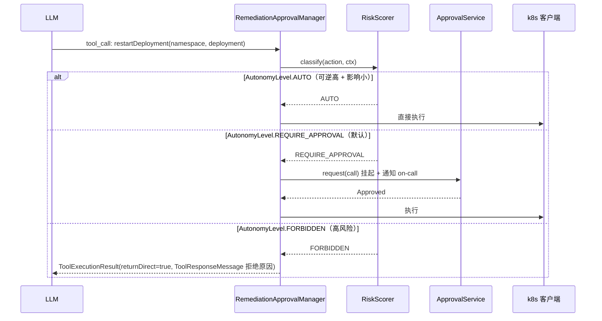

# 项目 09：智能运维 AIOps 平台 — 04-自动处置与 HITL 审批

> **定位**：把处置动作建模为工具，按"可逆性×爆炸半径"分级——低风险自动执行、中风险 HITL 审批、高风险升级。HITL 落点在 ToolCallingManager 装饰器（非 Advisor）。教程 28 的完整落地。本文代码为**完整可手写**（含全部 import、无省略），审批守卫模式即教程 28 的 HITL 模式落地。
>
> 「遇到阻塞？→ [教程 28-Human-in-the-Loop与审批流 全篇]、[教程 30-容错与弹性设计 §熔断]、[附录 05-SpringAI2-API基准/02 §ToolCallingManager]」

---

## 1. 四问

| 问 | 答 |
|----|----|
| **新增了什么需求** | ① 处置动作（重启 Pod/切流/清缓存/回滚）工具化 ② 风险分级（低=自动、中=审批、高=升级 on-call）③ 处置全量审计 |
| **影响了哪些模块** | 新增 `remediate` 包（`RemediationTools`/`RiskScorer`/`ApprovalService`/`RemediationApprovalManager`）；HITL 拦截在 ToolCallingManager 装饰器 |
| **架构如何演进** | 从"处置靠手动/凭经验"演进为"处置工具化 + 分级自动执行 + 审批闸门强制"：`风险打分 → 自动/审批/禁止` |
| **上一版痛点是什么** | ① 处置手动执行、耗时长（重启 3 个 Pod 用了 20 分钟）② 无风险评估就执行 ③ 审批无架构强制 |

### 1.1 本节核对（四问自测，轻量）

- [ ] 能复述三级分级与默认档位（AUTO / REQUIRE_APPROVAL 默认 / FORBIDDEN）。
- [ ] 能说出 HITL 落点是 ToolCallingManager 装饰器而非 Advisor（Advisor 看不到工具执行时点）。

## 2. 渐进自主阶梯

| 档位 | 模式 | 本项目默认 |
|------|------|-----------|
| 1 | 只读观察 | 全部动作先经过 |
| 2 | 建议 + 人工确认 | 全部动作默认 |
| 3 | **审批后执行（HITL）** | **本项目默认边界** |
| 4 | 有界自主（受限/可逆/低风险 + 可否决） | 仅对少数验证过的低风险动作开放 |
| 5 | 全自主 | 不开放 |

**2026 行业共识**（[调研 AIOps 2026 §HITL]）：「模型输出是请求，不是授权」；自动化危险已被真实事故验证（2025-10 AWS/2025-11 Cloudflare 故障中自动化放大故障）。本项目的默认边界停在 **第 3 档"审批后执行"**，第 4 档"有界自主"只对少数验证过的低风险动作开放。

### 2.1 本节核对（自主边界理解）

- [ ] 能指出本项目不开放第 5 档，且第 4 档仅限"验证过的低风险动作"。
- [ ] 能把 §4.3 `RiskScorer` 的 AUTO 判据（recoverability≥0.9 且 impact<0.2）与第 4 档"受限/可逆/低风险"对应起来。

## 3. HITL 审批流



### 3.1 本节核对（审批流理解）

| # | 核对项 | 判据 |
|---|--------|------|
| 1 | 三分支穷尽 | AUTO 直执行 / REQUIRE_APPROVAL 挂起等待 / FORBIDDEN 拒绝，与 §4.6 switch 三 case 一致 |
| 2 | fail-closed | 审批无响应/超时走 `Unavailable`，不会自动通过 |
| 3 | 防绕过 | 拒绝结果 `returnDirect=true`，终止工具循环（ADR-414） |

## 4. 完整代码（照抄即可）

### 4.1 处置领域模型（record + 分级枚举）

```java
package com.aiops.platform.remediate;

import java.util.Map;

/** 一次处置动作（工具参数已解析）。 */
public record RemediationAction(
        String toolName,
        Map<String, Object> arguments,
        double impact,            // 影响面（Pod 数/流量占比，0-1）
        double recoverability,    // 可逆性（0-1，1=完全可逆）
        double complexity         // 复杂度（0-1）
) {}
```

```java
package com.aiops.platform.remediate;

/** 处置结果（含审计引用）。 */
public record RemediationResult(
        boolean executed,
        String message,
        String actionId,          // 审计键
        String approvalId         // 审批引用（自动执行为 null）
) {}
```

```java
package com.aiops.platform.remediate;

/** 自主级别：自动执行 / 审批后执行 / 禁止。 */
public enum AutonomyLevel { AUTO, REQUIRE_APPROVAL, FORBIDDEN }
```

### 4.2 `RemediationTools.java`（处置动作工具化）

```java
package com.aiops.platform.remediate;

import org.springframework.ai.tool.annotation.Tool;
import org.springframework.ai.tool.annotation.ToolParam;
import org.springframework.stereotype.Component;

import java.util.UUID;

/**
 * 处置动作建模为 @Tool。真正执行委托给 k8sClient/cacheService/trafficRouter/deployClient，
 * 这些适配器按你现有基础设施实现（kubectl 只读/写、Redis 客户端、流量路由、发布平台）。
 */
@Component
public class RemediationTools {

    private final K8sClient k8sClient;
    private final CacheService cacheService;
    private final TrafficRouter trafficRouter;
    private final DeployClient deployClient;

    public RemediationTools(K8sClient k8sClient, CacheService cacheService,
                            TrafficRouter trafficRouter, DeployClient deployClient) {
        this.k8sClient = k8sClient;
        this.cacheService = cacheService;
        this.trafficRouter = trafficRouter;
        this.deployClient = deployClient;
    }

    @Tool(description = "重启指定 Deployment 的无状态 Pod（可逆性: 高，可通过重新调度恢复）")
    public RemediationResult restartDeployment(
            @ToolParam(description = "命名空间") String namespace,
            @ToolParam(description = "Deployment 名") String deployment) {
        String actionId = UUID.randomUUID().toString();
        k8sClient.restart(namespace, deployment);
        return new RemediationResult(true, "重启已提交", actionId, null);
    }

    @Tool(description = "清空 Redis 缓存键前缀（可逆性: 中，清空后需回源重建）")
    public RemediationResult flushCachePrefix(
            @ToolParam(description = "键前缀") String keyPrefix) {
        String actionId = UUID.randomUUID().toString();
        cacheService.flush(keyPrefix);
        return new RemediationResult(true, "缓存已清空", actionId, null);
    }

    @Tool(description = "将流量从某服务切走（可逆性: 高，可切回）")
    public RemediationResult redirectTraffic(
            @ToolParam(description = "目标服务") String service) {
        String actionId = UUID.randomUUID().toString();
        trafficRouter.redirect(service);
        return new RemediationResult(true, "流量已切走", actionId, null);
    }

    @Tool(description = "回滚上次发布（可逆性: 中，回滚本身有风险）")
    public RemediationResult rollbackDeployment(
            @ToolParam(description = "应用名") String app) {
        String actionId = UUID.randomUUID().toString();
        deployClient.rollback(app);
        return new RemediationResult(true, "回滚已提交", actionId, null);
    }
}
```

**适配接口**（按你现有基础设施实现）：

```java
package com.aiops.platform.remediate;

/** kubectl 写操作适配器。restart 为幂等操作（重启是无状态 Deployment，天然可重试）。 */
public interface K8sClient {
    void restart(String namespace, String deployment);
}
```

```java
package com.aiops.platform.remediate;

public interface CacheService {
    void flush(String keyPrefix);
}
```

```java
package com.aiops.platform.remediate;

public interface TrafficRouter {
    void redirect(String service);
}
```

```java
package com.aiops.platform.remediate;

public interface DeployClient {
    void rollback(String app);
}
```

### 4.3 `RiskScorer.java`（风险打分，决定自动/审批/禁止）

```java
package com.aiops.platform.remediate;

import org.springframework.stereotype.Component;

/**
 * 风险分级：risk = w1·impact + w2·(1−recoverability) + w3·complexity。
 * 判定规则：
 *   recoverability ≥ 0.9 && impact < 0.2 → AUTO（低风险可自动）
 *   risk > 0.7                          → FORBIDDEN（高风险禁止）
 *   其余                                 → REQUIRE_APPROVAL（默认审批）
 */
@Component
public class RiskScorer {

    private static final double AUTO_IMPACT_MAX = 0.2;
    private static final double AUTO_RECOVERABILITY_MIN = 0.9;
    private static final double FORBIDDEN_RISK = 0.7;

    public AutonomyLevel classify(RemediationAction action) {
        if (action.recoverability() >= AUTO_RECOVERABILITY_MIN && action.impact() < AUTO_IMPACT_MAX) {
            return AutonomyLevel.AUTO;                       // 验证过的低风险
        }
        double risk = 0.4 * action.impact()
                + 0.4 * (1 - action.recoverability())
                + 0.2 * action.complexity();
        if (risk > FORBIDDEN_RISK) {
            return AutonomyLevel.FORBIDDEN;
        }
        return AutonomyLevel.REQUIRE_APPROVAL;
    }
}
```

### 4.4 `ApprovalOutcome.java`（审批决策：sealed 穷尽，fail-closed）

```java
package com.aiops.platform.remediate;

/** 审批结果（Java 21 sealed）：fail-closed 默认 Unavailable。 */
public sealed interface ApprovalOutcome permits
        AllowedOnce, Rejected, Cancelled, Unavailable {
    record AllowedOnce() implements ApprovalOutcome {}
    record Rejected(String reason) implements ApprovalOutcome {}
    record Cancelled() implements ApprovalOutcome {}
    record Unavailable() implements ApprovalOutcome {}
}
```

### 4.5 `ApprovalService.java`（审批审计对 + 挂起存储）

```java
package com.aiops.platform.remediate;

import org.slf4j.Logger;
import org.slf4j.LoggerFactory;
import org.springframework.jdbc.core.simple.JdbcClient;
import org.springframework.stereotype.Service;

import java.time.Duration;
import java.util.Map;
import java.util.UUID;
import java.util.concurrent.CompletableFuture;
import java.util.concurrent.ConcurrentHashMap;

/**
 * HITL 审批：approval/asked + approval/decided 成对落库（审计可回放）。
 * 无 answerer / 超时 → Unavailable（fail-closed，绝不自动通过）。
 * 注意：request() 是同步阻塞等待，调用方应在 boundedElastic 线程（[教程 42-响应式错误处理 §6]）。
 */
@Service
public class ApprovalService {

    private static final Logger log = LoggerFactory.getLogger(ApprovalService.class);

    private final JdbcClient jdbc;
    private final Map<String, CompletableFuture<ApprovalOutcome>> pending = new ConcurrentHashMap<>();

    public ApprovalService(JdbcClient jdbc) {
        this.jdbc = jdbc;
    }

    /** 发起审批：写 asked 审计，挂起等待 answerer 决策；超时 → Unavailable。 */
    public ApprovalOutcome request(String sessionId, String toolName, String callId,
                                   String reason, Duration timeout) {
        String approvalId = UUID.randomUUID().toString();
        long now = System.currentTimeMillis();
        audit(approvalId, sessionId, toolName, callId, "ASKED", reason, now, null);

        CompletableFuture<ApprovalOutcome> future = new CompletableFuture<>();
        pending.put(approvalId, future);
        CompletableFuture.delayedExecutor(timeout.toMillis(), java.util.concurrent.TimeUnit.MILLISECONDS)
                .execute(() -> future.complete(new ApprovalOutcome.Unavailable()));

        log.info("审批挂起 approvalId={} tool={} session={}", approvalId, toolName, sessionId);
        ApprovalOutcome outcome = future.join();
        pending.remove(approvalId);

        audit(approvalId, sessionId, toolName, callId, "DECIDED", outcome.toString(), now, System.currentTimeMillis());
        return outcome;
    }

    /** answerer 决策入口（审批 UI 调用）。 */
    public void decide(String approvalId, ApprovalOutcome outcome) {
        CompletableFuture<ApprovalOutcome> f = pending.remove(approvalId);
        if (f != null && !f.isDone()) {
            f.complete(outcome);
        }
    }

    private void audit(String approvalId, String sessionId, String toolName, String callId,
                       String stage, String detail, long askedAt, Long decidedAt) {
        jdbc.sql("""
                INSERT INTO approval_audit(approval_id, session_id, tool_name, call_id,
                                           stage, detail, asked_at, decided_at)
                VALUES(:approvalId, :sessionId, :toolName, :callId, :stage, :detail, :askedAt, :decidedAt)
                """)
                .param("approvalId", approvalId)
                .param("sessionId", sessionId)
                .param("toolName", toolName)
                .param("callId", callId)
                .param("stage", stage)
                .param("detail", detail)
                .param("askedAt", askedAt)
                .param("decidedAt", decidedAt == null ? null : decidedAt)
                .update();
    }
}
```

### 4.6 `RemediationApprovalManager.java`（HITL 拦截：ToolCallingManager 装饰器）

```java
package com.aiops.platform.remediate;

import org.springframework.ai.chat.messages.AssistantMessage;      // 内含嵌套 record ToolCall
import org.springframework.ai.chat.messages.ToolResponseMessage;
import org.springframework.ai.chat.model.ChatResponse;
import org.springframework.ai.chat.prompt.Prompt;
import org.springframework.ai.model.tool.ToolCallingChatOptions;
import org.springframework.ai.model.tool.ToolCallingManager;       // Spring AI 2.0.0 真实包
import org.springframework.ai.model.tool.ToolExecutionResult;
import org.springframework.stereotype.Component;

import java.time.Duration;
import java.util.List;
import java.util.Map;
import java.util.Set;

/**
 * HITL 审批守卫：装饰 ToolCallingManager（拦截"工具意图返回后、执行前"时点），
 * 命中处置工具清单 → 按 RiskScorer 分级：AUTO 放行 / REQUIRE_APPROVAL 审批 / FORBIDDEN 拒绝。
 * 审批拒绝后 Agent 不得重试同一动作（返回 rejected 结果，防绕过）。
 * 正确落点：非 Advisor（Advisor 环绕整个 ChatClient 边界，看不到工具执行时点，[附录 05-SpringAI2-API基准/02 §1.3]）。
 */
@Component
public class RemediationApprovalManager implements ToolCallingManager {

    /** 需要审批闸门覆盖的处置工具名。 */
    private static final Set<String> REMEDIATION_TOOLS =
            Set.of("restartDeployment", "flushCachePrefix", "redirectTraffic", "rollbackDeployment");

    private static final Duration APPROVAL_TIMEOUT = Duration.ofMinutes(5);

    private final ToolCallingManager delegate;
    private final RiskScorer riskScorer;
    private final ApprovalService approvalService;

    public RemediationApprovalManager(ToolCallingManager delegate,
                                      RiskScorer riskScorer,
                                      ApprovalService approvalService) {
        this.delegate = delegate;
        this.riskScorer = riskScorer;
        this.approvalService = approvalService;
    }

    @Override
    public ToolExecutionResult executeToolCalls(Prompt prompt, ChatResponse chatResponse) {

        List<AssistantMessage.ToolCall> calls = extractToolCalls(chatResponse);
        String sessionId = sessionIdOf(prompt);

        for (AssistantMessage.ToolCall call : calls) {
            if (!REMEDIATION_TOOLS.contains(call.name())) {
                continue;                                  // 非处置工具放行
            }
            AutonomyLevel level = riskScorer.classify(toAction(call));
            switch (level) {
                case AUTO -> { }                           // 验证过的低风险，放行
                case REQUIRE_APPROVAL -> {
                    ApprovalOutcome outcome = approvalService.request(
                            sessionId, call.name(), call.id(), "处置动作需审批", APPROVAL_TIMEOUT);
                    if (!(outcome instanceof ApprovalOutcome.AllowedOnce)) {
                        return rejected(call, "处置被否决: " + outcome);  // 拒绝后 returnDirect=true，Agent 不得继续重试（防绕过）
                    }
                }
                case FORBIDDEN -> {
                    return rejected(call, "高风险动作禁止自动执行，已升级 on-call");
                }
            }
        }
        return delegate.executeToolCalls(prompt, chatResponse);
    }

    /** 构造拒绝结果：ToolResponseMessage 承载拒绝原因，returnDirect=true 终止工具循环（防绕过）。 */
    private ToolExecutionResult rejected(AssistantMessage.ToolCall call, String reason) {
        return ToolExecutionResult.builder()
                .conversationHistory(List.of(ToolResponseMessage.builder()
                        .responses(List.of(new ToolResponseMessage.ToolResponse(
                                call.id(), call.name(), reason)))
                        .build()))
                .returnDirect(true)
                .build();
    }

    /** 把 ToolCall 转成可打分的 RemediationAction（impact/recoverability/complexity 来自工具注册元数据）。 */
    private RemediationAction toAction(AssistantMessage.ToolCall call) {
        // 简化：从工具描述/参数推断影响面。生产可维护"工具→风险参数"注册表。
        double recoverability = switch (call.name()) {
            case "restartDeployment", "redirectTraffic" -> 0.9;    // 可逆性高
            case "flushCachePrefix", "rollbackDeployment" -> 0.5;  // 可逆性中
            default -> 0.5;
        };
        double impact = 0.3;                                       // 生产按参数（Pod 数/流量占比）计算
        double complexity = 0.3;
        return new RemediationAction(call.name(), call.arguments(), impact, recoverability, complexity);
    }

    private List<AssistantMessage.ToolCall> extractToolCalls(ChatResponse chatResponse) {
        return chatResponse.getResults().stream()
                .map(g -> g.getOutput().getToolCalls())
                .flatMap(List::stream)
                .toList();
    }

    private String sessionIdOf(Prompt prompt) {
        Map<String, Object> ctx = ((ToolCallingChatOptions) prompt.getOptions()).getToolContext();
        return ctx == null ? "unknown" : (String) ctx.getOrDefault("sessionId", "unknown");
    }
}
```

> **接线说明**：`RemediationApprovalManager` 声明为 `@Component` 并注入 `ToolCallingManager delegate`——`delegate` 是 Spring AI 自动配置的默认 ToolCallingManager；本项目以本项目装饰器替换该 Bean 参与 ChatClient 的工具执行。若你引入的 Spring AI 版本未自动配置 ToolCallingManager Bean，需在配置类中显式提供默认实现（用 `ObjectProvider<ToolCallingManager>` 取回环依赖）。

### 4.7 接线：把处置工具注册进 ChatClient（与 HITL 闸门生效）

```java
package com.aiops.platform.config;

import com.aiops.platform.remediate.RemediationTools;
import org.springframework.ai.chat.client.ChatClient;
import org.springframework.context.annotation.Bean;
import org.springframework.context.annotation.Configuration;

/**
 * 处置 ChatClient：注册处置工具后，LLM 才能调用；审批闸门在 ToolCallingManager 层生效。
 * 与 [02-迭代一 §3.6] 的 ChatClientConfig 二选一（本项目用本配置替换）。
 */
@Configuration
public class RemediationChatConfig {

    @Bean
    public ChatClient remediationChatClient(ChatClient.Builder builder,
                                            RemediationTools remediationTools) {
        return builder
                .defaultTools(remediationTools)
                .build();
    }
}
```

### 4.8 `db/schema-v4.sql`（审批审计表 DDL）

```sql
CREATE TABLE IF NOT EXISTS approval_audit (
    approval_id VARCHAR(64)  PRIMARY KEY,
    session_id  VARCHAR(64)  NOT NULL,
    tool_name   VARCHAR(64)  NOT NULL,
    call_id     VARCHAR(64),
    stage       VARCHAR(16)  NOT NULL,     -- ASKED / DECIDED
    detail      TEXT,
    asked_at    BIGINT       NOT NULL,
    decided_at  BIGINT
);

CREATE INDEX IF NOT EXISTS idx_approval_session ON approval_audit (session_id, asked_at);
```

### 4.9 需在 pom.xml 中添加依赖

> v4 复用基线 pom 的 `spring-boot-starter-jdbc` + `postgresql`（审批审计）。无需新增依赖。

### 4.10 本节测试与验证（风险分级与审批闸门）

**前置条件**：`db/schema-v4.sql` 已执行；`K8sClient` 等四个适配器已给出最小实现（可打日志不真执行）；`RemediationApprovalManager` 已作为 `ToolCallingManager` Bean 生效；`db/schema-v3.sql`（RCA）可用以便构造处置上下文。

**材料 A——RiskScorer 分级边界用例**（把 §4.3 复制到 /tmp 小 main 或写单测）：

| 用例 | impact | recoverability | complexity | 预期 |
|------|--------|----------------|-----------|------|
| R1 | 0.1 | 0.95 | 0.2 | AUTO |
| R2 | 0.3 | 0.9 | 0.3 | REQUIRE_APPROVAL（risk=0.4·0.3+0.4·0.1+0.2·0.3=0.22） |
| R3 | 0.9 | 0.1 | 0.9 | FORBIDDEN（risk=0.36+0.36+0.18=0.9 > 0.7） |
| R4 | 恒值空序列类边界：impact=0.2, recoverability=0.9 | | | REQUIRE_APPROVAL（impact 不满足 <0.2） |

**材料 B——审批审计核对 SQL**：

```sql
SELECT approval_id, tool_name, stage, detail, asked_at, decided_at
FROM approval_audit ORDER BY asked_at DESC LIMIT 6;
```

**步骤与断言**：

| # | 操作 | 预期（PASS 判据） |
|---|------|------------------|
| 1 | 材料 A 四用例 | 分级结果与表中预期逐一一致（纯函数可直接断言） |
| 2 | 触发一次 `flushCachePrefix`（recoverability=0.5 → REQUIRE_APPROVAL） | 日志"审批挂起 approvalId=..."；材料 B 出现 ASKED 行且 decided_at 为空 |
| 3 | 调 `ApprovalService.decide(approvalId, new ApprovalOutcome.AllowedOnce())` | ASKED 之后新增 DECIDED 行；适配器日志显示 flush 执行 |
| 4 | 再次发起但 decide 传 `Rejected("测试")` | 工具返回"处置被否决"；Agent 收到 returnDirect 终止，不再重试 |
| 5 | 发起后不 decide，等 5 分钟超时 | outcome=Unavailable（fail-closed），动作未执行 |
| 6 | 非处置工具（如 v3 的 queryMetrics）调用 | 直接放行，不产生审批记录 |

**失败排查**：①闸门不生效（工具直接执行）→装饰器 Bean 未替换默认 ToolCallingManager（检查注入的 delegate 来源）；②步骤 3 不执行→decide 传的 approvalId 与日志不一致或 future 已超时完成；③步骤 5 自动执行了→`Unavailable` 未被当拒绝处理（确认 `instanceof AllowedOnce` 判断）；④AUDIT 只有 ASKED 无 DECIDED→request 抛异常中断，查 JDBC 报错。

## 5. 全篇回归验证

> 各节材料与断言已上移至 §4.10；本表为整篇迭代的回归验收（含 500 样本统计与渗透项），不重复材料。

| # | 验收项 | 标准 |
|---|--------|------|
| 1 | 分级正确 | 500 个历史处置样本，风险分级与人工判定一致率 ≥ 90% |
| 2 | 闸门强制性 | 绕过审批直接执行处置的路径不存在（代码审查+渗透） |
| 3 | 自动边界 | 仅 `recoverability ≥ 0.9 && impact < 0.2` 的动作自动（验证过的） |
| 4 | 拒绝防绕过 | 审批拒绝后 Agent 不得重试同一动作 |
| 5 | 全量审计 | 每次处置（含自动）入审计链，可回放 |

## 6. 本迭代的 ADR

| # | 决策 | 理由 |
|---|------|------|
| ADR-412 | 处置工具化 + ToolCallingManager 拦截 | 工具执行层是"意图→执行"的唯一稳定拦截点 |
| ADR-413 | 渐进自主，默认停在"审批后执行" | 自动化放大故障是真实事故（AWS/Cloudflare），保守优先 |
| ADR-414 | 拒绝后禁止重试 | 消除"反复提交直到碰巧被批"的绕过面 |

### 6.1 本节核对（ADR 一致性）

- [ ] ADR-412 落点 = §4.6 `RemediationApprovalManager implements ToolCallingManager`；ADR-413 落点 = §4.3 AUTO 判据的保守取值；ADR-414 落点 = §4.6 `rejected` 的 `returnDirect(true)`。
- [ ] 三条 ADR 与 [13-ADR架构决策记录 §3] 总账一致。

## 7. v4 的痛点（驱动下一迭代）

自动处置跑通了，但**长任务巡检暴露短板**：巡检任务（逐集群检查证书过期/配额/异常 Pod）要跑 30 分钟，中途值班切走、进程重启，任务就断了，重跑浪费资源。**巡检需要 Checkpoint + 断点恢复**。→ [05-长任务巡检.md](05-长任务巡检.md)

### 7.1 本节核对（痛点承接）

- [ ] "Checkpoint + 断点恢复"由 [05 §2] 的 Checkpoint 机制承接。
