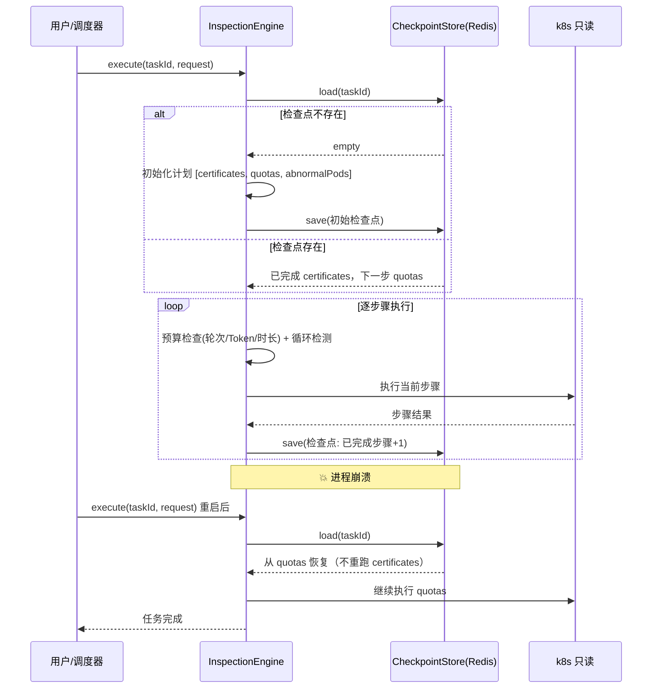

# 项目 09：智能运维 AIOps 平台 — 05-迭代四：长任务巡检

> **定位**：把"定时巡检/压测/长时诊断"从人工值班中解放出来——Checkpoint 化 + 断点恢复 + 预算控制 + 死循环防护。采用 [教程 35-长任务持久化与中断恢复] 的 Checkpoint 机制（可手写、零外部依赖）。本文代码为**完整可手写**（含全部 import、无省略）。
>
> 「遇到阻塞？→ [教程 35-长任务持久化与中断恢复 全篇]、[教程 24-容错与弹性设计 §重试]」

---

## 1. 四问

| 问 | 答 |
|----|----|
| **新增了什么需求** | ① 巡检任务（证书过期/配额/异常 Pod 检查）可中断续跑 ② 跨重启恢复 ③ 预算超限自动停止 ④ 巡检结果入知识库 |
| **影响了哪些模块** | 新增 `inspection` 包（`InspectionEngine`/`InspectionCheckpointStore`/`BudgetGuard`/`InspectionActivities`）；新增 Redis（Reactive）存检查点 |
| **架构如何演进** | 从"人工排班 + 中断即死"演进为"Checkpoint 持久化 + 断点恢复 + 三维预算"：`execute(taskId) → load检查点 → 续跑/新跑 → 每步落检查点` |
| **上一版痛点是什么** | ① 巡检任务中断即死，重跑浪费资源 ② 定时巡检靠人工排班 ③ 巡检无预算控制（无死循环防护） |

## 2. Checkpoint 机制（教程 35 落地）

> **认知基线**：**checkpoint ≠ durable execution**。Checkpoint 是"定期持久化中间状态，崩溃后从断点恢复"；durable execution（如 Temporal）更进一步，由外部运行时自动恢复执行、不重花 token。v5 采用**教程 35 的 Checkpoint 机制**（可手写、零外部依赖、够用），跨主机自动恢复的 durable execution（Temporal）记为生产演进方向（ADR-415 备选）。

| 维度 | v4 之前（无 checkpoint） | v5 Checkpoint（本项目） | 生产演进（Temporal durable execution） |
|------|------------------------|------------------------|----------------------------------------|
| 崩溃恢复 | 进程一死 run 就死 | 从最近检查点续跑（本进程重启） | 自动从持久状态恢复（跨进程/跨主机） |
| 定时启动 | 人工排班 | `@Scheduled` + `InspectionEngine` | 原生 schedule |
| 等待审批 | — | 挂起持久化（教程 35 §挂起） | durable sleep（零内存成本） |
| 事件历史 | 手写 | 检查点字段自带 | 自动管理（continue_as_new 防超限） |
| **结论** | 不可用 | **v5 选型（本文实现）** | 生产级演进方向 |

## 3. 巡检恢复流



## 4. 完整代码（照抄即可）

### 4.1 巡检领域模型

```java
package com.aiops.platform.inspection;

import java.util.List;

/** 巡检请求：cluster + 要执行的检查步骤。 */
public record InspectionRequest(String cluster, List<String> checkTypes) {

    /** 默认全量检查。 */
    public static InspectionRequest full(String cluster) {
        return new InspectionRequest(cluster, List.of("certificates", "quotas", "abnormalPods"));
    }
}
```

```java
package com.aiops.platform.inspection;

import java.util.List;

/** 巡检结果。 */
public record InspectionResult(
        String taskId,
        String status,                 // completed / budget_exceeded / failed
        List<StepResult> completedSteps,
        String summary
) {
    public record StepResult(int stepIndex, String stepName, String status, String summary, String errorMessage) {}
}
```

```java
package com.aiops.platform.inspection;

import java.util.List;
import java.util.Set;

/**
 * 检查点：保存"恢复所需的最小状态"（教程 35 §2.2）。
 * plan/completedSteps 决定续跑位置；budgetUsage/idempotencyKeys 保证不超预算、不重复副作用。
 */
public record InspectionCheckpoint(
        String taskId,
        InspectionRequest request,
        List<String> plan,                 // 步骤名列表
        List<InspectionResult.StepResult> completedSteps,
        int currentStepIndex,
        BudgetUsage budgetUsage,
        Set<String> idempotencyKeys,       // 已执行步骤的幂等键（防崩溃重放副作用）
        long timestamp
) {
    public record BudgetUsage(int turnsUsed, int tokensUsed, long startedAtMillis) {}
}
```

### 4.2 `InspectionCheckpointStore.java`（ReactiveRedis 检查点存储）

```java
package com.aiops.platform.inspection;

import com.fasterxml.jackson.databind.ObjectMapper;
import org.springframework.data.redis.core.ReactiveRedisTemplate;
import org.springframework.stereotype.Repository;
import reactor.core.publisher.Mono;
import reactor.core.scheduler.Schedulers;

import java.time.Duration;
import java.util.Optional;

/**
 * 检查点存储：Redis 低延迟（每步都写），TTL 7 天。
 * 序列化用 Jackson；读写都是响应式（WebFlux 铁律：Redis 用 ReactiveRedisTemplate）。
 */
@Repository
public class InspectionCheckpointStore {

    private static final Duration TTL = Duration.ofDays(7);
    private static final String KEY_PREFIX = "aiops:inspection:checkpoint:";

    private final ReactiveRedisTemplate<String, String> redis;
    private final ObjectMapper mapper;

    public InspectionCheckpointStore(ReactiveRedisTemplate<String, String> redis,
                                     ObjectMapper mapper) {
        this.redis = redis;
        this.mapper = mapper;
    }

    public Mono<Void> save(InspectionCheckpoint cp) {
        return Mono.fromCallable(() -> mapper.writeValueAsString(cp))
                .subscribeOn(Schedulers.boundedElastic())
                .flatMap(json -> redis.opsForValue().set(KEY_PREFIX + cp.taskId(), json, TTL))
                .then();
    }

    public Mono<Optional<InspectionCheckpoint>> load(String taskId) {
        return redis.opsForValue().get(KEY_PREFIX + taskId)
                .flatMap(json -> Mono.fromCallable(() ->
                                Optional.of(mapper.readValue(json, InspectionCheckpoint.class)))
                        .subscribeOn(Schedulers.boundedElastic()))
                .defaultIfEmpty(Optional.empty());
    }

    public Mono<Void> delete(String taskId) {
        return redis.delete(KEY_PREFIX + taskId).then();
    }
}
```

### 4.3 `BudgetGuard.java`（三维预算 + 死循环防护）

```java
package com.aiops.platform.inspection;

import org.springframework.stereotype.Component;

/**
 * 三维预算：最大轮次 / Token / 时长，超限抛 BudgetExceededException 终止巡检。
 * 结合 checkpoints 里的"连续重复步骤检测"，构成死循环防护（教程 35 §6）。
 */
@Component
public class BudgetGuard {

    public static final int MAX_TURNS = 50;
    public static final int MAX_TOKENS = 200_000;
    public static final long MAX_DURATION_MS = 3_600_000L;   // 60 分钟

    public void checkBudget(InspectionCheckpoint.BudgetUsage usage) {
        if (usage.turnsUsed() >= MAX_TURNS) {
            throw new BudgetExceededException("轮次超限: " + usage.turnsUsed() + "/" + MAX_TURNS);
        }
        if (usage.tokensUsed() >= MAX_TOKENS) {
            throw new BudgetExceededException("Token 超限: " + usage.tokensUsed() + "/" + MAX_TOKENS);
        }
        if (System.currentTimeMillis() - usage.startedAtMillis() >= MAX_DURATION_MS) {
            throw new BudgetExceededException("时长超限: " + MAX_DURATION_MS + "ms");
        }
    }

    public static class BudgetExceededException extends RuntimeException {
        public BudgetExceededException(String msg) { super(msg); }
    }
}
```

### 4.4 `InspectionActivities.java`（真正的业务逻辑，含 Agent）

```java
package com.aiops.platform.inspection;

import org.springframework.ai.chat.client.ChatClient;
import org.springframework.stereotype.Component;

import java.util.List;

/**
 * 巡检步骤实现（对应 Temporal 里的 Activity 概念）：真正干活的地方。
 * 确定性扫描（kubectl 只读）先行，LLM 只对"异常 Pod 根因初判"等结论型任务出场（省成本）。
 */
@Component
public class InspectionActivities {

    private final K8sReadClient k8sReadClient;
    private final ChatClient chatClient;

    public InspectionActivities(K8sReadClient k8sReadClient, ChatClient chatClient) {
        this.k8sReadClient = k8sReadClient;
        this.chatClient = chatClient;
    }

    /** 证书过期检查（纯确定性）。 */
    public String checkCertificates(String cluster) {
        List<CertInfo> certs = k8sReadClient.certificates(cluster);
        List<CertInfo> expiring = certs.stream().filter(c -> c.expiresInDays() < 30).toList();
        if (expiring.isEmpty()) {
            return "证书检查: " + certs.size() + " 个证书全部正常";
        }
        StringBuilder sb = new StringBuilder("证书检查: ").append(expiring.size()).append(" 个即将过期\n");
        expiring.forEach(c -> sb.append("- ").append(c.name())
                .append(" 剩 ").append(c.expiresInDays()).append(" 天\n"));
        return sb.toString().trim();
    }

    /** 资源配额检查（纯确定性）。 */
    public String checkQuotas(String cluster) {
        List<QuotaInfo> quotas = k8sReadClient.quotas(cluster);
        List<QuotaInfo> over = quotas.stream().filter(q -> q.usagePercent() > 80).toList();
        if (over.isEmpty()) {
            return "配额检查: " + quotas.size() + " 项配额全部正常";
        }
        StringBuilder sb = new StringBuilder("配额检查: ").append(over.size()).append(" 项接近上限\n");
        over.forEach(q -> sb.append("- ").append(q.resource())
                .append(" 使用率 ").append(String.format("%.0f%%", q.usagePercent())).append('\n'));
        return sb.toString().trim();
    }

    /** 异常 Pod 检查：确定性扫描 + LLM 根因初判。 */
    public String checkAbnormalPods(String cluster) {
        List<AbnormalPod> pods = k8sReadClient.abnormalPods(cluster);
        if (pods.isEmpty()) {
            return "异常 Pod 检查: 无异常";
        }
        // LLM 只对过滤后的异常列表做根因初判（不读原始大文本）
        String llmSummary = chatClient.prompt()
                .system("根据异常 Pod 列表，判断是否为同一根因，输出 3 行以内摘要，给出最可能的根因。")
                .user(abnormalToPrompt(pods))
                .call()
                .content();
        return "异常 Pod 检查: " + pods.size() + " 个\n" + llmSummary;
    }

    private String abnormalToPrompt(List<AbnormalPod> pods) {
        StringBuilder sb = new StringBuilder();
        pods.forEach(p -> sb.append("- ").append(p.name())
                .append(" status=").append(p.status())
                .append(" restarts=").append(p.restartCount())
                .append(" reason=").append(p.reason()).append('\n'));
        return sb.toString();
    }
}
```

**巡检读取适配器**（`K8sReadClient`——按你现有 kubectl/客户端实现）：

```java
package com.aiops.platform.inspection;

import java.util.List;

/** k8s 只读适配器。全部为只读操作，天然幂等。 */
public interface K8sReadClient {
    List<CertInfo> certificates(String cluster);
    List<QuotaInfo> quotas(String cluster);
    List<AbnormalPod> abnormalPods(String cluster);
}

record CertInfo(String name, int expiresInDays) {}
record QuotaInfo(String resource, double usagePercent) {}
record AbnormalPod(String name, String status, int restartCount, String reason) {}
```

### 4.5 `InspectionEngine.java`（可恢复执行引擎）

```java
package com.aiops.platform.inspection;

import org.slf4j.Logger;
import org.slf4j.LoggerFactory;
import org.springframework.stereotype.Service;
import reactor.core.publisher.Mono;
import reactor.core.scheduler.Schedulers;

import java.util.ArrayList;
import java.util.HashSet;
import java.util.List;
import java.util.Set;

/**
 * 可恢复的巡检引擎：execute(taskId) 尝试加载检查点，有则续跑、无则新跑。
 * 每步完成后落检查点；预算超限/异常时保存终态并终止。block() 仅在 boundedElastic 上出现（教程 37）。
 */
@Service
public class InspectionEngine {

    private static final Logger log = LoggerFactory.getLogger(InspectionEngine.class);

    private final InspectionCheckpointStore store;
    private final InspectionActivities activities;
    private final BudgetGuard budgetGuard;

    public InspectionEngine(InspectionCheckpointStore store,
                            InspectionActivities activities,
                            BudgetGuard budgetGuard) {
        this.store = store;
        this.activities = activities;
        this.budgetGuard = budgetGuard;
    }

    /** 执行巡检任务，支持从断点恢复。 */
    public Mono<InspectionResult> execute(String taskId, InspectionRequest request) {
        return store.load(taskId)
                .flatMap(opt -> opt.map(Mono::just)
                        .orElseGet(() -> startNew(taskId, request)))
                .flatMap(this::runLoop);
    }

    private Mono<InspectionCheckpoint> startNew(String taskId, InspectionRequest request) {
        InspectionCheckpoint cp = new InspectionCheckpoint(
                taskId, request, request.checkTypes(),
                new ArrayList<>(), 0,
                new InspectionCheckpoint.BudgetUsage(0, 0, System.currentTimeMillis()),
                new HashSet<>(), System.currentTimeMillis());
        return store.save(cp).thenReturn(cp);
    }

    private Mono<InspectionResult> runLoop(InspectionCheckpoint cp) {
        return Mono.fromCallable(() -> {
                    InspectionCheckpoint checkpoint = cp;
                    try {
                        budgetGuard.checkBudget(checkpoint.budgetUsage());
                        while (checkpoint.currentStepIndex() < checkpoint.plan().size()) {
                            int idx = checkpoint.currentStepIndex();
                            String step = checkpoint.plan().get(idx);

                            // 幂等键检查：崩溃恢复后不重跑已完成步骤
                            String idemKey = checkpoint.taskId() + ":" + idx + ":" + step;
                            if (!checkpoint.idempotencyKeys().contains(idemKey)) {
                                String summary = executeStep(step, checkpoint.request().cluster());
                                checkpoint.completedSteps().add(
                                        new InspectionResult.StepResult(idx, step, "done", summary, null));
                                checkpoint.idempotencyKeys().add(idemKey);
                            }
                            checkpoint = withIndex(checkpoint, idx + 1);
                            store.save(checkpoint).block();     // 每步落检查点
                        }
                        store.delete(checkpoint.taskId()).block();
                        return new InspectionResult(checkpoint.taskId(), "completed",
                                checkpoint.completedSteps(), summarize(checkpoint));
                    } catch (BudgetGuard.BudgetExceededException e) {
                        store.save(checkpoint).block();         // 预算超限也留终态
                        log.warn("巡检 {} 预算终止: {}", checkpoint.taskId(), e.getMessage());
                        return new InspectionResult(checkpoint.taskId(), "budget_exceeded",
                                checkpoint.completedSteps(), e.getMessage());
                    }
                })
                .subscribeOn(Schedulers.boundedElastic());
    }

    private String executeStep(String step, String cluster) {
        return switch (step) {
            case "certificates" -> activities.checkCertificates(cluster);
            case "quotas" -> activities.checkQuotas(cluster);
            case "abnormalPods" -> activities.checkAbnormalPods(cluster);
            default -> throw new IllegalStateException("未知巡检步骤: " + step);
        };
    }

    private InspectionCheckpoint withIndex(InspectionCheckpoint cp, int newIndex) {
        return new InspectionCheckpoint(
                cp.taskId(), cp.request(), cp.plan(), cp.completedSteps(), newIndex,
                cp.budgetUsage(), cp.idempotencyKeys(), System.currentTimeMillis());
    }

    private String summarize(InspectionCheckpoint cp) {
        return cp.completedSteps().stream()
                .map(s -> s.stepName() + ": " + s.summary())
                .reduce((a, b) -> a + "\n" + b)
                .orElse("无步骤");
    }
}
```

### 4.6 定时触发（`@Scheduled` + 恢复语义）

```java
package com.aiops.platform.inspection;

import org.slf4j.Logger;
import org.slf4j.LoggerFactory;
import org.springframework.scheduling.annotation.EnableScheduling;
import org.springframework.scheduling.annotation.Scheduled;
import org.springframework.stereotype.Component;

import java.util.List;
import java.util.UUID;

/** 每日凌晨 2 点全集群巡检（幂等：同一 cluster 复用同一 taskId，天然去重 + 可恢复）。 */
@Component
@EnableScheduling
public class InspectionScheduler {

    private static final Logger log = LoggerFactory.getLogger(InspectionScheduler.class);

    private final InspectionEngine engine;

    public InspectionScheduler(InspectionEngine engine) {
        this.engine = engine;
    }

    @Scheduled(cron = "0 0 2 * * *")
    public void dailyInspection() {
        for (String cluster : List.of("prod-cluster-1", "prod-cluster-2", "prod-cluster-3")) {
            String taskId = "inspection-" + cluster + "-" + java.time.LocalDate.now();
            engine.execute(taskId, InspectionRequest.full(cluster))
                    .subscribe(
                            r -> log.info("巡检完成 {} status={}", taskId, r.status()),
                            err -> log.error("巡检失败 {}", taskId, err));
        }
    }
}
```

> **幂等设计**：同一 cluster 的 taskId 含日期——当天崩溃重跑会用同一 taskId 命中检查点续跑，不会从头重来；第二天自然用新 taskId。

### 4.7 需在 pom.xml 中添加依赖

```xml
        <!-- 追加（v5）：检查点存储（Reactive Redis） -->
        <dependency>
            <groupId>org.springframework.boot</groupId>
            <artifactId>spring-boot-starter-data-redis-reactive</artifactId>
        </dependency>
```

### 4.8 `application.yml` 追加 Redis

```yaml
spring:
  data:
    redis:
      host: ${REDIS_HOST:localhost}
      port: ${REDIS_PORT:6379}
```

## 5. 验收标准

| # | 验收项 | 标准 |
|---|--------|------|
| 1 | 崩溃恢复 | 巡检中途 kill 进程，重启后从断点恢复、不重跑已完成步骤 |
| 2 | 定时触发 | 每日巡检按时启动，结果入知识库 |
| 3 | 预算控制 | 巡检 Token/轮次/时长超限自动终止（不无限跑） |
| 4 | 幂等 | 重试不产生重复处置动作（幂等键命中跳过） |
| 5 | 恢复一致 | 崩溃恢复后结果与"未崩溃跑完"一致（completedSteps 不重复） |

## 6. 本迭代的 ADR

| # | 决策 | 理由 |
|---|------|------|
| ADR-415 | 巡检用 Checkpoint 机制（教程 35）持久化断点；跨主机 durable execution（Temporal）记为生产演进方向 | checkpoint 可手写、零外部依赖，覆盖"进程重启续跑"的核心需求；跨进程自动恢复是更大工程，按需引入 |
| ADR-416 | 巡检步骤"确定性扫描先行、LLM 只读结论"（如异常 Pod 根因初判） | 步骤可重放（幂等）；LLM 只在结论型步骤出场，省成本 |
| ADR-417 | 巡检设计为"可中断 + 断点续跑 + 幂等"而非"一次跑几天" | 长时 Agent 四大失效模式（context rot 等），小时级而非天级 |

## 7. v5 的痛点（驱动下一迭代）

巡检自动跑了，但**知识没有沉淀**：每次故障的复盘（postmortem）结论、每次处置的 runbook、每次巡检的异常模式——都散落在各自系统里，下次类似故障 RCA 还是要从头推理。**需要"复盘→runbook→RAG"的知识飞轮**。→ [06-迭代五-运维知识飞轮.md](06-迭代五-运维知识飞轮.md)
