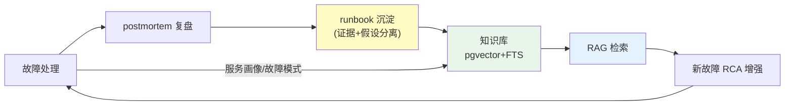

# 项目 09：智能运维 AIOps 平台 — 06-运维知识飞轮

> **定位**：把"故障复盘→runbook 沉淀→RAG 增强→下次更快"的闭环建起来——每次故障不是结束，而是让平台更懂业务。教程 41 数据飞轮的运维侧落地。本文代码为**完整可手写**（含全部 import、无省略）。
>
> 「遇到阻塞？→ [教程 41-数据飞轮与持续改进 全篇]、[教程 05-RAG检索增强生成]、[附录 10-语义缓存与性能/00-语义缓存实现 §混合检索]」

---

## 1. 四问

| 问 | 答 |
|----|----|
| **新增了什么需求** | ① postmortem 结构化入库 ② runbook 混合检索（RAG，FTS+向量+RRF）③ "服务画像/故障模式"沉淀 ④ ephemeral runbook（危机时的临时 runbook） |
| **影响了哪些模块** | 新增 `knowledge` 包（`PostmortemStore`/`RunbookIndex`/`ServiceProfileStore`/`EphemeralRunbookBuilder`）；升级 v3 的 `RunbookRetriever` 指向混合检索 |
| **架构如何演进** | 从"知识散落各系统"演进为"复盘→runbook→RAG 闭环"：postmortem 结构化入库 → runbook 向量化 + 索引 → RCA/处置层检索增强 |
| **上一版痛点是什么** | ① 复盘结论散落，下次重推 ② RCA 每次都从头推理 ③ runbook 静态过期 |

## 2. 知识飞轮闭环



**证据与假设分离**（[调研 AIOps 2026 §知识飞轮]）：postmortem 中「观察到的客观事实」与「AI 生成的假设」分开标注，防止模型输出被当成已验证根因。

## 3. 完整代码（照抄即可）

### 3.1 postmortem 领域模型（证据/假设分离）

```java
package com.aiops.platform.knowledge;

import java.time.Instant;
import java.util.List;

/**
 * postmortem 结构化模型。facts（客观证据）与 hypotheses（AI 假设）分字段存储——
 * 检索只信 facts，假设仅作提示并标注"未验证"（防知识污染，ADR-419）。
 */
public record Postmortem(
        String incidentId,
        Instant occurredAt,
        List<EvidenceFact> facts,         // 客观证据（告警/指标/日志/trace 定位）
        List<String> hypotheses,          // AI 生成的假设（标注"未验证"）
        String confirmedRootCause,
        List<ActionItem> actions,         // 处置动作（含可逆性标记）
        String runbookTitle               // 沉淀出的 runbook 标题
) {
    public record EvidenceFact(String kind, String value, long time, String source) {}
    public record ActionItem(String description, String owner, boolean reversible) {}
}
```

```java
package com.aiops.platform.knowledge;

/** 一次故障的简化记录（飞轮学习输入）。 */
public record IncidentRecord(
        String incidentId,
        String service,
        String symptomPattern,      // 症状模式，如 "payment-service 在 canary 后 503"
        String confirmedRootCause,
        String runbookRef
) {}
```

### 3.2 `PostmortemStore.java`（复盘结构化入库）

```java
package com.aiops.platform.knowledge;

import com.fasterxml.jackson.databind.ObjectMapper;
import org.springframework.jdbc.core.simple.JdbcClient;
import org.springframework.stereotype.Repository;

/**
 * postmortem 落库：facts 与 hypotheses 分 JSONB 字段存储——
 * 检索只信 facts（facts_json），假设仅作提示（hypotheses_json）。
 */
@Repository
public class PostmortemStore {

    private final JdbcClient jdbc;
    private final ObjectMapper mapper;

    public PostmortemStore(JdbcClient jdbc, ObjectMapper mapper) {
        this.jdbc = jdbc;
        this.mapper = mapper;
    }

    public void save(Postmortem pm) {
        try {
            jdbc.sql("""
                    INSERT INTO postmortem(incident_id, occurred_at, facts_json, hypotheses_json,
                                           confirmed_root_cause, actions_json, runbook_title, created_at)
                    VALUES(:incidentId, :occurredAt, :factsJson, :hypothesesJson,
                           :rootCause, :actionsJson, :runbookTitle, :createdAt)
                    ON CONFLICT (incident_id) DO UPDATE SET
                        facts_json = EXCLUDED.facts_json,
                        hypotheses_json = EXCLUDED.hypotheses_json,
                        confirmed_root_cause = EXCLUDED.confirmed_root_cause,
                        actions_json = EXCLUDED.actions_json,
                        runbook_title = EXCLUDED.runbook_title
                    """)
                    .param("incidentId", pm.incidentId())
                    .param("occurredAt", pm.occurredAt().toEpochMilli())
                    .param("factsJson", mapper.writeValueAsString(pm.facts()))
                    .param("hypothesesJson", mapper.writeValueAsString(pm.hypotheses()))
                    .param("rootCause", pm.confirmedRootCause())
                    .param("actionsJson", mapper.writeValueAsString(pm.actions()))
                    .param("runbookTitle", pm.runbookTitle())
                    .param("createdAt", System.currentTimeMillis())
                    .update();
        } catch (Exception e) {
            throw new IllegalStateException("postmortem 序列化失败", e);
        }
    }
}
```

### 3.3 `RunbookIngestionService.java`（复盘 → runbook 向量化入库）

```java
package com.aiops.platform.knowledge;

import org.springframework.ai.document.Document;
import org.springframework.ai.vectorstore.VectorStore;
import org.springframework.stereotype.Service;

import java.util.List;
import java.util.Map;

/**
 * 复盘 → runbook 文档入库（pgvector）。只把 facts（客观证据）拼入文档体，
 * hypotheses 不入体——防止 AI 假设污染检索（ADR-419）。
 */
@Service
public class RunbookIngestionService {

    private final VectorStore vectorStore;

    public RunbookIngestionService(VectorStore vectorStore) {
        this.vectorStore = vectorStore;
    }

    public void ingest(Postmortem pm) {
        String runbookId = "rb-" + pm.incidentId();
        String title = pm.runbookTitle();
        String body = title + "\n" + pm.facts().stream()
                .map(f -> f.kind() + ": " + f.value())
                .reduce((a, b) -> a + "\n" + b)
                .orElse("");

        // 生产用 runbookId 作 Document id 实现幂等 upsert；此处以 metadata 存 runbookId。
        vectorStore.add(List.of(Document.builder()
                .text(body)
                .metadata(Map.of("runbookId", runbookId, "title", title))
                .build()));
    }
}
```

### 3.4 `RunbookIndex.java`（混合检索：FTS + 向量 + RRF 融合）

```java
package com.aiops.platform.knowledge;

import com.aiops.platform.rca.RunbookHit;
import org.springframework.ai.document.Document;
import org.springframework.ai.vectorstore.SearchRequest;
import org.springframework.ai.vectorstore.VectorStore;
import org.springframework.jdbc.core.simple.JdbcClient;
import org.springframework.stereotype.Component;

import java.util.HashMap;
import java.util.List;
import java.util.Map;

/**
 * runbook 索引：标题感知分块 + 混合检索（FTS 全文 + 向量语义 + RRF 融合 + 重排）。
 * 为什么混合而非纯向量（[调研 AIOps 2026 §知识飞轮]）：危机时刻的准确检索依赖结构化数据
 * （标签/服务目录），纯 embedding 在"告警名近似但关键参数不同"时会误召回。
 */
@Component
public class RunbookIndex {

    private final VectorStore vectorStore;
    private final JdbcClient jdbc;

    public RunbookIndex(VectorStore vectorStore, JdbcClient jdbc) {
        this.vectorStore = vectorStore;
        this.jdbc = jdbc;
    }

    /** 混合检索：向量 topK=10 ∪ FTS topK=10，RRF 融合后取 topN。 */
    public List<RunbookHit> hybridSearch(String query, int topN) {
        List<Document> semantic = vectorStore.similaritySearch(
                SearchRequest.builder().query(query).topK(10).build());
        List<RunbookHit> lexical = ftsSearch(query, 10);
        return rrfFuse(semantic, lexical, topN);
    }

    private List<RunbookHit> ftsSearch(String query, int limit) {
        return jdbc.sql("""
                SELECT runbook_id, title, summary FROM runbook
                WHERE to_tsvector('simple', title || ' ' || COALESCE(summary, ''))
                      @@ plainto_tsquery('simple', :q)
                ORDER BY ts_rank(to_tsvector('simple', title || ' ' || COALESCE(summary, '')),
                                 plainto_tsquery('simple', :q)) DESC
                LIMIT :limit
                """)
                .param("q", query)
                .param("limit", limit)
                .query((rs, i) -> new RunbookHit(
                        rs.getString("runbook_id"),
                        rs.getString("title"),
                        rs.getString("summary"),
                        "FTS"))
                .list();
    }

    /** RRF（Reciprocal Rank Fusion）：按 rank 倒序给分，融合两路结果，按总分重排。 */
    private List<RunbookHit> rrfFuse(List<Document> semantic, List<RunbookHit> lexical, int topN) {
        Map<String, Double> scores = new HashMap<>();
        Map<String, RunbookHit> hits = new HashMap<>();

        for (int i = 0; i < semantic.size(); i++) {
            Document d = semantic.get(i);
            String id = (String) d.getMetadata().get("runbookId");
            if (id == null) continue;
            scores.merge(id, 1.0 / (60 + i), Double::sum);
            hits.putIfAbsent(id, new RunbookHit(id,
                    (String) d.getMetadata().getOrDefault("title", "untitled"),
                    d.getText(), "向量"));
        }
        for (int i = 0; i < lexical.size(); i++) {
            RunbookHit h = lexical.get(i);
            scores.merge(h.runbookId(), 1.0 / (60 + i), Double::sum);
            hits.putIfAbsent(h.runbookId(), h);
        }

        return scores.entrySet().stream()
                .sorted(Map.Entry.<String, Double>comparingByValue().reversed())
                .limit(topN)
                .map(e -> hits.get(e.getKey()))
                .toList();
    }
}
```

> **升级衔接**：v3 的 `RunbookRetriever.searchRunbooks` 升级为委托 `RunbookIndex.hybridSearch(query, 5)`，RCA 处置建议因此带混合检索 citation。

### 3.5 `ServiceProfileStore.java`（服务画像与故障模式沉淀）

```java
package com.aiops.platform.knowledge;

import com.fasterxml.jackson.core.type.TypeReference;
import com.fasterxml.jackson.databind.ObjectMapper;
import org.springframework.jdbc.core.simple.JdbcClient;
import org.springframework.stereotype.Repository;

import java.util.ArrayList;
import java.util.List;
import java.util.Optional;

/**
 * 服务画像：依赖 + 故障模式集合。每次故障后更新，下次该服务告警先查画像
 * （记忆召回优于从零生成——教程 34 原则的运维应用，ADR-420）。
 */
@Repository
public class ServiceProfileStore {

    private final JdbcClient jdbc;
    private final ObjectMapper mapper;

    public ServiceProfileStore(JdbcClient jdbc, ObjectMapper mapper) {
        this.jdbc = jdbc;
        this.mapper = mapper;
    }

    public ServiceProfile getOrCreate(String service) {
        Optional<ServiceProfile> hit = jdbc.sql("""
                SELECT service, dependencies, fault_modes FROM service_profile WHERE service = :service
                """)
                .param("service", service)
                .query((rs, i) -> new ServiceProfile(
                        rs.getString("service"),
                        readList(rs.getString("dependencies")),
                        readFaultModes(rs.getString("fault_modes"))))
                .optional();
        if (hit.isPresent()) {
            return hit.get();
        }
        ServiceProfile fresh = new ServiceProfile(service, new ArrayList<>(), new ArrayList<>());
        save(fresh);
        return fresh;
    }

    /** 故障后学习：向服务画像追加一条故障模式。 */
    public void learnFromIncident(IncidentRecord incident) {
        ServiceProfile profile = getOrCreate(incident.service());
        List<FaultMode> updated = new ArrayList<>(profile.faultModes());
        updated.add(new FaultMode(incident.symptomPattern(),
                incident.confirmedRootCause(), incident.runbookRef()));
        save(new ServiceProfile(profile.service(), profile.dependencies(), List.copyOf(updated)));
    }

    private void save(ServiceProfile p) {
        try {
            jdbc.sql("""
                    INSERT INTO service_profile(service, dependencies, fault_modes, updated_at)
                    VALUES(:service, :dependencies, :faultModes, :updatedAt)
                    ON CONFLICT (service) DO UPDATE SET
                        dependencies = EXCLUDED.dependencies,
                        fault_modes = EXCLUDED.fault_modes,
                        updated_at = EXCLUDED.updated_at
                    """)
                    .param("service", p.service())
                    .param("dependencies", mapper.writeValueAsString(p.dependencies()))
                    .param("faultModes", mapper.writeValueAsString(p.faultModes()))
                    .param("updatedAt", System.currentTimeMillis())
                    .update();
        } catch (Exception e) {
            throw new IllegalStateException("服务画像序列化失败", e);
        }
    }

    private List<String> readList(String json) {
        try {
            return mapper.readValue(json, new TypeReference<List<String>>() {});
        } catch (Exception e) {
            return new ArrayList<>();
        }
    }

    private List<FaultMode> readFaultModes(String json) {
        try {
            return mapper.readValue(json, new TypeReference<List<FaultMode>>() {});
        } catch (Exception e) {
            return new ArrayList<>();
        }
    }
}
```

```java
package com.aiops.platform.knowledge;

import java.util.List;

/** 服务画像：依赖 + 故障模式。 */
public record ServiceProfile(
        String service,
        List<String> dependencies,
        List<FaultMode> faultModes
) {}
```

```java
package com.aiops.platform.knowledge;

/** 故障模式：症状 → 根因 → runbook 引用。 */
public record FaultMode(String symptomPattern, String confirmedRootCause, String runbookRef) {}
```

### 3.6 `EphemeralRunbookBuilder.java`（危机时的临时 runbook）

```java
package com.aiops.platform.knowledge;

import com.aiops.platform.rca.RunbookHit;
import org.springframework.ai.chat.client.ChatClient;
import org.springframework.stereotype.Component;
import reactor.core.publisher.Mono;
import reactor.core.scheduler.Schedulers;

import java.util.List;

/**
 * ephemeral runbook：故障处理中从"现场证据 + 历史 runbook"动态组装"一次性"runbook，
 * 比静态文档更适合危机时刻（[调研 AIOps 2026 §ephemeral runbook]）。
 */
@Component
public class EphemeralRunbookBuilder {

    private final ChatClient chatClient;

    public EphemeralRunbookBuilder(ChatClient chatClient) {
        this.chatClient = chatClient;
    }

    public Mono<EphemeralRunbook> buildEphemeral(String incidentId,
                                                 List<Postmortem.EvidenceFact> facts,
                                                 List<RunbookHit> history) {
        return Mono.fromCallable(() -> chatClient.prompt()
                        .system("""
                                你是值班助手。基于现场证据 + 历史 runbook，组装一份危机时刻的一次性 runbook，输出 JSON：
                                1. steps: 处置步骤（可执行、每步标注风险）
                                2. warnings: 风险警告
                                3. based_on_runbook_ids: 引用的历史 runbook id 列表
                                只基于给定证据与历史 runbook，不臆造。
                                """)
                        .user("incident_id=" + incidentId
                                + "\n现场证据: " + facts
                                + "\n历史 runbook: " + history)
                        .call()
                        .entity(EphemeralRunbook.class))
                .subscribeOn(Schedulers.boundedElastic());
    }
}
```

```java
package com.aiops.platform.knowledge;

import java.util.List;

/** 一次性 runbook（危机场景临时组装）。 */
public record EphemeralRunbook(
        String incidentId,
        List<String> steps,
        List<String> warnings,
        List<String> basedOnRunbookIds
) {}
```

### 3.7 `db/schema-v5.sql`（知识库三表 DDL）

```sql
CREATE TABLE IF NOT EXISTS postmortem (
    incident_id          VARCHAR(64)  PRIMARY KEY,
    occurred_at          BIGINT       NOT NULL,
    facts_json           JSONB        NOT NULL,
    hypotheses_json      JSONB        NOT NULL,
    confirmed_root_cause TEXT,
    actions_json         JSONB        NOT NULL,
    runbook_title        VARCHAR(255),
    created_at           BIGINT       NOT NULL
);

CREATE TABLE IF NOT EXISTS runbook (
    runbook_id  VARCHAR(64)  PRIMARY KEY,
    title       VARCHAR(255) NOT NULL,
    summary     TEXT,
    content     TEXT,
    created_at  BIGINT       NOT NULL
);
CREATE INDEX IF NOT EXISTS idx_runbook_title ON runbook (title);

CREATE TABLE IF NOT EXISTS service_profile (
    service      VARCHAR(128) PRIMARY KEY,
    dependencies JSONB        NOT NULL DEFAULT '[]',
    fault_modes  JSONB        NOT NULL DEFAULT '[]',
    updated_at   BIGINT       NOT NULL
);
```

### 3.8 需在 pom.xml 中添加依赖

> v6 复用 v2 的 `spring-ai-starter-vector-store-pgvector` 与基线 pom 的 `spring-boot-starter-jdbc` + `postgresql`。无需新增依赖。

## 4. 验收标准

| # | 验收项 | 标准 |
|---|--------|------|
| 1 | 复盘入库存量 | 近 30 天故障 100% 有结构化 postmortem |
| 2 | 检索增益 | 相似历史故障检索命中 top-3 一致率 ≥ 70% |
| 3 | RCA 提速 | 复用知识后 RCA 平均定位时间再降 30% |
| 4 | 证据分离 | 检索只返回 facts（hypotheses 标记"未验证"） |
| 5 | 飞轮运转 | 连续 3 个月"新故障→复盘→runbook→复用"闭环有记录 |

## 5. 本迭代的 ADR

| # | 决策 | 理由 |
|---|------|------|
| ADR-418 | 混合检索 + citation | 纯向量危机时刻误召回；citation 让建议可验证 |
| ADR-419 | 证据与假设分离存储 | 防止 AI 假设被当成已验证根因 |
| ADR-420 | 服务画像先行 | 记忆召回优于从零生成（教程 34 原则的运维应用） |

## 6. v6 的痛点（驱动下一迭代）

平台越来越懂"已发生的故障"，但**容量问题还是被动**：大促前不知道哪些服务会撑不住，全靠架构师拍脑袋扩容。**需要容量预测**——用历史时序预测未来资源需求，提前预警。→ [07-容量预测.md](07-容量预测.md)
