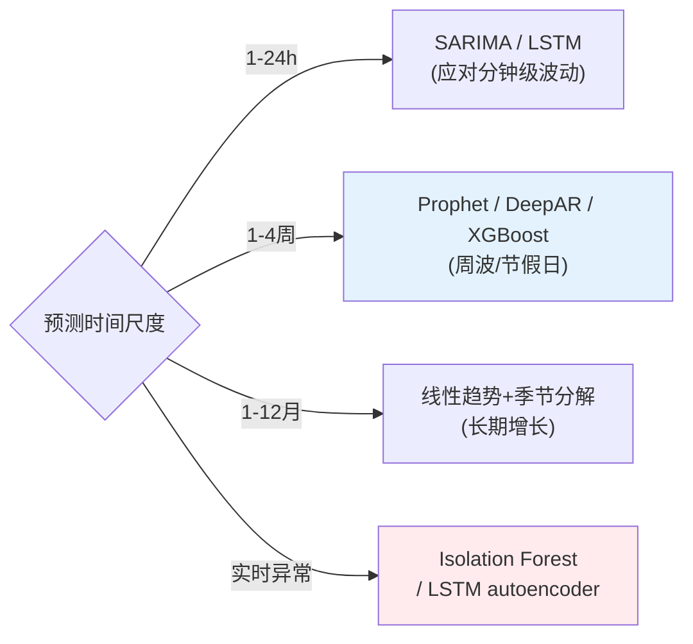

# 项目 09：智能运维 AIOps 平台 — 07-迭代六：容量预测

> **定位**：把"大促前拍脑袋扩容"变成"数据驱动的容量预警"——时序预测 + LLM 辅助解释。基于调研结论：容量预测是 ROI 最高的 AIOps 场景，算法按时间尺度选型。教程 33 性能优化 + 教程 39 边缘部署参考。本文代码为**完整可手写**（含全部 import、无省略）。
>
> 「遇到阻塞？→ [教程 33-Agent性能优化]、[教程 39-多模型协作与供应策略 §模型编排]、[附录 05-LLM基础理论/02-上下文窗口与Token §时序]」

---

## 1. 四问

| 问 | 答 |
|----|----|
| **新增了什么需求** | ① CPU/内存/连接数等指标的时序预测（1-24h/1-4周/1-12月三档）② 按 P95 置信上界配置容量 ③ 每周重跑预测 ④ 容量耗尽前兆实时告警 |
| **影响了哪些模块** | 新增 `capacity` 包（`CapacityForecaster`/`CapacityAdvisor`/`CapacityAlertScheduler`）；接入时序数据源（Prometheus/自建时序库） |
| **架构如何演进** | 从"拍脑袋扩容"演进为"确定性时序预测先行、LLM 只读结论解释"：历史时序 → 趋势+季节分解 → P95 预测 → LLM 生成容量报告 |
| **上一版痛点是什么** | ① 大促前扩容靠拍脑袋 ② 容量耗尽无前兆 ③ 预测结果看不懂 |

## 2. 算法按时间尺度选型



**关键原则**（[调研 AIOps 2026 §容量预测]）：按 **95 分位（置信上界）而非均值**配置容量——均值会低估峰值；每周重跑预测应对漂移；最高可省 30% 云成本。

## 3. 完整代码（照抄即可）

### 3.1 容量领域模型

```java
package com.aiops.platform.capacity;

/** 时序点。 */
public record TimePoint(long timestamp, double value) {}
```

```java
package com.aiops.platform.capacity;

/** 容量预测结果：p50 是均值预测，p95 是置信上界（配置容量的依据）。 */
public record CapacityForecast(
        String metric,
        long forecastTimestamp,
        double p50,
        double p95,
        String model
) {}
```

```java
package com.aiops.platform.capacity;

/** 容量报告（LLM 生成，值班可执行）。 */
public record CapacityReport(
        String service,
        String riskLevel,          // 低/中/高
        String bottleneck,
        String recommendation,
        String basis
) {}
```

### 3.2 `CapacityForecaster.java`（确定性预测：趋势 + 季节分解 + P95）

```java
package com.aiops.platform.capacity;

import org.springframework.stereotype.Component;

import java.time.DayOfWeek;
import java.time.Instant;
import java.time.ZoneId;
import java.util.ArrayList;
import java.util.EnumMap;
import java.util.List;
import java.util.Map;

/**
 * 确定性容量预测：线性趋势 + 按星期几的季节偏移 + 残差标准差（P95 = 均值 + 1.65σ）。
 * 覆盖"1-4 周"尺度；更短/更长的尺度按 §2 选型换算法（本类是可替换的数学核心，无 LLM）。
 */
@Component
public class CapacityForecaster {

    private static final double Z_P95 = 1.65;
    private static final ZoneId ZONE = ZoneId.of("Asia/Shanghai");

    public CapacityForecast forecast(String metric, List<TimePoint> history, int horizonDays) {
        if (history.isEmpty()) {
            return new CapacityForecast(metric, System.currentTimeMillis(), 0, 0, "empty");
        }
        double slope = linearTrend(history);
        Map<DayOfWeek, Double> seasonal = decomposeSeasonal(history);
        double residualStd = residualStd(history, slope, seasonal);

        TimePoint last = history.get(history.size() - 1);
        double base = last.value() + slope * horizonDays;
        double seasonalAdj = seasonal.getOrDefault(dayOfWeek(last.timestamp()), 0.0);
        double p50 = base + seasonalAdj;
        double p95 = p50 + Z_P95 * residualStd;

        return new CapacityForecast(metric,
                last.timestamp() + (long) horizonDays * 24 * 3600_000L,
                p50, p95, "seasonal + linear trend");
    }

    /** 最小二乘线性回归斜率（以样本序号为 x）。 */
    private double linearTrend(List<TimePoint> history) {
        int n = history.size();
        if (n < 2) {
            return 0;
        }
        double sx = 0, sy = 0, sxy = 0, sxx = 0;
        for (int i = 0; i < n; i++) {
            double v = history.get(i).value();
            sx += i;
            sy += v;
            sxy += i * v;
            sxx += (double) i * i;
        }
        double denom = n * sxx - sx * sx;
        if (denom == 0) {
            return 0;
        }
        return (n * sxy - sx * sy) / denom;
    }

    /** 按星期几分组求平均偏移（相对全局均值）。 */
    private Map<DayOfWeek, Double> decomposeSeasonal(List<TimePoint> history) {
        Map<DayOfWeek, List<Double>> byDay = new EnumMap<>(DayOfWeek.class);
        for (TimePoint p : history) {
            byDay.computeIfAbsent(dayOfWeek(p.timestamp()), k -> new ArrayList<>()).add(p.value());
        }
        double overall = history.stream().mapToDouble(TimePoint::value).average().orElse(0);
        Map<DayOfWeek, Double> seasonal = new EnumMap<>(DayOfWeek.class);
        byDay.forEach((dow, vals) -> seasonal.put(dow,
                vals.stream().mapToDouble(v -> v).average().orElse(overall) - overall));
        return seasonal;
    }

    private double residualStd(List<TimePoint> history, double slope, Map<DayOfWeek, Double> seasonal) {
        if (history.size() < 2) {
            return 0;
        }
        double base0 = history.get(0).value();
        double sumSq = 0;
        for (int i = 0; i < history.size(); i++) {
            TimePoint p = history.get(i);
            double fitted = base0 + slope * i + seasonal.getOrDefault(dayOfWeek(p.timestamp()), 0.0);
            double diff = p.value() - fitted;
            sumSq += diff * diff;
        }
        return Math.sqrt(sumSq / (history.size() - 1));
    }

    private DayOfWeek dayOfWeek(long epochMs) {
        return Instant.ofEpochMilli(epochMs).atZone(ZONE).getDayOfWeek();
    }
}
```

### 3.3 `CapacityAdvisor.java`（LLM 生成容量报告，只读结论）

```java
package com.aiops.platform.capacity;

import org.springframework.ai.chat.client.ChatClient;
import org.springframework.stereotype.Service;
import reactor.core.publisher.Mono;
import reactor.core.scheduler.Schedulers;

/**
 * LLM 只解释预测结果，不读原始时序（程序计算、AI 总结）。
 * LLM 故障时由调度器回退确定性规则告警，不阻塞（ADR-422）。
 */
@Service
public class CapacityAdvisor {

    private final ChatClient chatClient;

    public CapacityAdvisor(ChatClient chatClient) {
        this.chatClient = chatClient;
    }

    public Mono<CapacityReport> explain(CapacityForecast forecast, String service) {
        return Mono.fromCallable(() -> chatClient.prompt()
                        .system("""
                                你是容量规划顾问。根据服务的容量预测，输出 JSON：
                                1. risk_level: 未来 N 天容量风险（低/中/高）
                                2. bottleneck: 最可能最先耗尽资源的维度
                                3. recommendation: 扩容建议（扩多少、何时扩）
                                4. basis: 依据（预测值、P95、趋势斜率）
                                只基于给定预测数据，不臆测业务。
                                """)
                        .user("服务: " + service + "\n预测: " + forecast)
                        .call()
                        .entity(CapacityReport.class))
                .subscribeOn(Schedulers.boundedElastic());
    }
}
```

### 3.4 `CapacityAlertScheduler.java`（容量耗尽前兆告警）

```java
package com.aiops.platform.capacity;

import org.slf4j.Logger;
import org.slf4j.LoggerFactory;
import org.springframework.scheduling.annotation.Scheduled;
import org.springframework.stereotype.Component;

import java.util.List;

/**
 * 每小时重跑 7 天预测：P95 将超配额 80% → 提前告警（而非等真耗尽）。
 * 预测服务不可用时用确定性规则兜底（趋势阈值），不阻塞（ADR-422 降级）。
 */
@Component
public class CapacityAlertScheduler {

    private static final Logger log = LoggerFactory.getLogger(CapacityAlertScheduler.class);
    private static final int HORIZON_DAYS = 7;
    private static final double WARN_THRESHOLD = 0.8;

    private final MetricStore metricStore;
    private final ServiceQuotaStore quotaStore;
    private final CapacityForecaster forecaster;
    private final CapacityAdvisor advisor;
    private final CapacityNotifier notifier;

    public CapacityAlertScheduler(MetricStore metricStore,
                                  ServiceQuotaStore quotaStore,
                                  CapacityForecaster forecaster,
                                  CapacityAdvisor advisor,
                                  CapacityNotifier notifier) {
        this.metricStore = metricStore;
        this.quotaStore = quotaStore;
        this.forecaster = forecaster;
        this.advisor = advisor;
        this.notifier = notifier;
    }

    @Scheduled(fixedRate = 3_600_000L)   // 每小时重跑
    public void checkCapacityWarnings() {
        for (String service : quotaStore.allServices()) {
            try {
                String metric = service + ".cpu.usage";
                List<TimePoint> history = metricStore.last90Days(metric);
                CapacityForecast f = forecaster.forecast(metric, history, HORIZON_DAYS);
                double limit = quotaStore.cpuLimit(service);
                if (f.p95() > limit * WARN_THRESHOLD) {
                    notifier.warn("容量预警", "%s 未来 %d 天 CPU P95 %.0f%% 超配额 80%%"
                            .formatted(service, HORIZON_DAYS, f.p95() * 100));
                    // 异步生成可读报告（LLM 失败不回滚上面的确定性告警）
                    advisor.explain(f, service).subscribe(
                            report -> log.info("容量报告 {}: {}", service, report),
                            err -> log.warn("容量报告生成失败 {}: {}", service, err.getMessage()));
                }
            } catch (Exception e) {
                log.warn("容量检查失败 {}: {}", service, e.getMessage());   // 单服务失败不阻断全部
            }
        }
    }
}
```

**时序数据源 / 配额 / 通知适配接口**（按你现有 Prometheus/时序库/服务目录/通知渠道实现）：

```java
package com.aiops.platform.capacity;

import java.util.List;

/** 历史时序读取适配器（Prometheus query_range 或自建时序库）。 */
public interface MetricStore {
    List<TimePoint> last90Days(String metric);
}
```

```java
package com.aiops.platform.capacity;

import java.util.List;

/** 服务配额/服务目录适配器。 */
public interface ServiceQuotaStore {
    List<String> allServices();
    double cpuLimit(String service);
}
```

```java
package com.aiops.platform.capacity;

/** 告警通知适配器（企业微信/钉钉/邮件/on-call）。 */
public interface CapacityNotifier {
    void warn(String title, String message);
}
```

### 3.5 `db/schema-v6.sql`（容量报告落库 DDL）

```sql
CREATE TABLE IF NOT EXISTS capacity_report (
    metric       VARCHAR(128) PRIMARY KEY,
    forecast_ts  BIGINT NOT NULL,
    p50          REAL   NOT NULL,
    p95          REAL   NOT NULL,
    risk_level   VARCHAR(16),
    model        VARCHAR(64),
    created_at   BIGINT NOT NULL
);
```

### 3.6 需在 pom.xml 中添加依赖

> v7 复用基线 pom（无新依赖）。`@Scheduled` 依赖 `spring-boot-starter` 的调度支持（已在 webflux starter 传递引入）。

## 4. 验收标准

| # | 验收项 | 标准 |
|---|--------|------|
| 1 | 预测准确 | 7 天预测 MAE ≤ 15%（回测 90 天）；P95 覆盖真实峰值 ≥ 90% |
| 2 | 提前预警 | 容量耗尽前 ≥ 7 天预警（回测历史扩容事件） |
| 3 | 成本节省 | 按 P95 配置后，过度扩容减少（对比拍脑袋基线） |
| 4 | 报告可读 | 容量报告含瓶颈/建议/依据，值班可执行 |
| 5 | 降级不丢 | 预测服务故障时规则兜底告警仍生效 |

## 5. 本迭代的 ADR

| # | 决策 | 理由 |
|---|------|------|
| ADR-421 | 按 P95 置信上界配置容量 | 均值低估峰值；P95 匹配"不撑爆"目标 |
| ADR-422 | 确定性预测先行、LLM 只读解释 | 预测是数学问题，LLM 只做叙事（省成本）；LLM 故障规则兜底 |
| ADR-423 | 按时间尺度选算法 | 单一算法无法覆盖 1h-12月 的多尺度 |

## 6. v7 的痛点（驱动下一迭代）

功能全家桶就位，但**平台自身成了新单点**：RCA 编排、知识库、容量预测都跑在一个进程里，一次 OOM 全挂；降噪流水线串行在热路径上，单环节故障影响全部。**平台自身需要容灾与演练**。→ [08-迭代七-高可用与演练.md](08-迭代七-高可用与演练.md)
