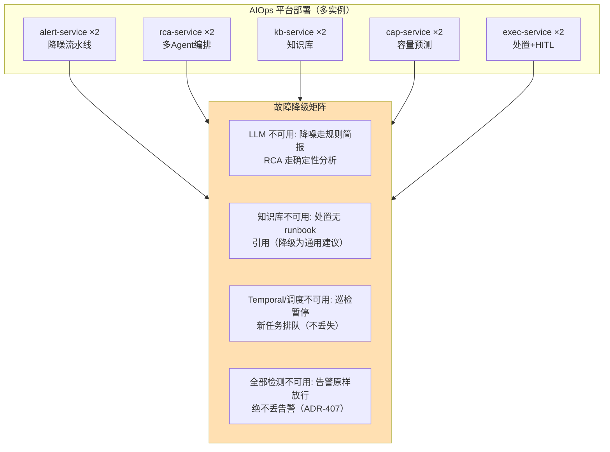
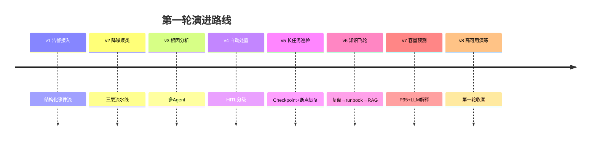

# 项目 09：智能运维 AIOps 平台 — 08-迭代七：高可用与演练（第一轮收官）

> **定位**：第一轮收官迭代——解决"运维 Agent 平台自身成为新单点"的悖论：服务拆分、熔断降级、混沌演练制度化。教程 30 容错 + 教程 33 部署的落地。本文代码为**完整可手写**（含全部 import、无省略）。
>
> 「遇到阻塞？→ [教程 30-容错与弹性设计 全篇]、[教程 33-部署与运维 §演练]」

---

## 1. 四问

| 问 | 答 |
|----|----|
| **新增了什么需求** | ① 平台自身容灾（无单点）② 降级矩阵（组件故障时行为可预期）③ 季度混沌演练报告 |
| **影响了哪些模块** | 平台拆分为独立服务（alert/rca/kb/cap/exec）；每个检测组件配熔断器与降级策略；新增演练工具链 |
| **架构如何演进** | 从"单进程全家桶"演进为"多服务独立部署 + 熔断降级矩阵 + 混沌演练制度化"：`组件故障 → 熔断 → 降级矩阵兜底 → 演练验证` |
| **上一版痛点是什么** | ① 平台单进程，一次 OOM 全挂 ② 降噪串行在热路径，单环节故障影响全部 ③ 从未演练 |

## 2. 平台自身高可用



**降级哲学**：**告警是生命线，绝不丢**（ADR-407 常驻）；LLM 是可降级环节；审计/审批是底线（fail-close）。

## 3. 完整代码（照抄即可）

### 3.1 需在 pom.xml 中添加依赖

```xml
        <!-- 追加（v8）：熔断器 -->
        <dependency>
            <groupId>io.github.resilience4j</groupId>
            <artifactId>resilience4j-circuitbreaker</artifactId>
        </dependency>
        <!-- 追加（v8，测试）：混沌演练故障注入 -->
        <dependency>
            <groupId>org.wiremock</groupId>
            <artifactId>wiremock-standalone</artifactId>
            <scope>test</scope>
        </dependency>
```

### 3.2 `DetectionCircuitBreaker.java`（组件级熔断）

```java
package com.aiops.platform.resilience;

import io.github.resilience4j.circuitbreaker.CircuitBreaker;
import io.github.resilience4j.circuitbreaker.CircuitBreakerConfig;
import io.github.resilience4j.circuitbreaker.CircuitBreakerRegistry;
import org.springframework.stereotype.Component;

import java.time.Duration;
import java.util.function.Supplier;

/**
 * 每个降噪/检测组件独立熔断器——一个组件故障不拖垮全链（[教程 30-容错与弹性设计 §熔断]）。
 * 熔断恢复：半开试探 → 恢复后对熔断期间调用做离线补检（审计流回放，见 3.5）。
 */
@Component
public class DetectionCircuitBreaker {

    private final CircuitBreakerRegistry registry;

    public DetectionCircuitBreaker() {
        CircuitBreakerConfig config = CircuitBreakerConfig.custom()
                .failureRateThreshold(50)                 // 50% 失败率触发熔断
                .waitDurationInOpenState(Duration.ofSeconds(30))
                .slidingWindowSize(20)                    // 滑窗 20 次调用
                .build();
        this.registry = CircuitBreakerRegistry.of(config);
    }

    public boolean llmAvailable() {
        return state("llm-judge") != CircuitBreaker.State.OPEN;
    }

    public boolean clusterAvailable() {
        return state("semantic-cluster") != CircuitBreaker.State.OPEN;
    }

    public <T> T execute(String breakerName, Supplier<T> supplier) {
        return registry.circuitBreaker(breakerName).executeSupplier(supplier);
    }

    public CircuitBreaker.State state(String breakerName) {
        return registry.circuitBreaker(breakerName).getState();
    }
}
```

### 3.3 `DegradationProperties.java`（降级矩阵声明式配置）

```java
package com.aiops.platform.resilience;

import org.springframework.boot.context.properties.ConfigurationProperties;
import org.springframework.stereotype.Component;

/**
 * 降级矩阵（声明式，可热更新）。对应 application.yml 的 degradation.* 节点。
 */
@Component
@ConfigurationProperties(prefix = "degradation")
public class DegradationProperties {

    private LlmUnavailable llmUnavailable = new LlmUnavailable();
    private KbUnavailable kbUnavailable = new KbUnavailable();
    private SchedulerUnavailable schedulerUnavailable = new SchedulerUnavailable();
    private AuditUnavailable auditUnavailable = new AuditUnavailable();

    public LlmUnavailable getLlmUnavailable() { return llmUnavailable; }
    public void setLlmUnavailable(LlmUnavailable v) { this.llmUnavailable = v; }

    public KbUnavailable getKbUnavailable() { return kbUnavailable; }
    public void setKbUnavailable(KbUnavailable v) { this.kbUnavailable = v; }

    public SchedulerUnavailable getSchedulerUnavailable() { return schedulerUnavailable; }
    public void setSchedulerUnavailable(SchedulerUnavailable v) { this.schedulerUnavailable = v; }

    public AuditUnavailable getAuditUnavailable() { return auditUnavailable; }
    public void setAuditUnavailable(AuditUnavailable v) { this.auditUnavailable = v; }

    public static class LlmUnavailable {
        private String alert = "rule-based-brief";     // 规则简报（不丢告警）
        private String rca = "deterministic-only";     // 确定性分析
        public String getAlert() { return alert; }
        public void setAlert(String v) { this.alert = v; }
        public String getRca() { return rca; }
        public void setRca(String v) { this.rca = v; }
    }

    public static class KbUnavailable {
        private String remediation = "generic-advice"; // 无 runbook 引用
        public String getRemediation() { return remediation; }
        public void setRemediation(String v) { this.remediation = v; }
    }

    public static class SchedulerUnavailable {
        private String inspection = "queue-new-tasks"; // 巡检排队不丢失
        public String getInspection() { return inspection; }
        public void setInspection(String v) { this.inspection = v; }
    }

    public static class AuditUnavailable {
        private String all = "fail-close";             // 审计是底线
        public String getAll() { return all; }
        public void setAll(String v) { this.all = v; }
    }
}
```

### 3.4 `DegradationService.java`（降级矩阵执行）

```java
package com.aiops.platform.resilience;

import org.springframework.stereotype.Service;

/**
 * 降级决策点：各业务组件在关键路径上询问"该走哪条路径"。
 * 核心不变式（ADR-407）：告警路径任何故障下都放行（fail-open），审计路径 fail-close。
 */
@Service
public class DegradationService {

    private final DetectionCircuitBreaker breaker;
    private final DegradationProperties props;

    public DegradationService(DetectionCircuitBreaker breaker, DegradationProperties props) {
        this.breaker = breaker;
        this.props = props;
    }

    /** 降噪 L3 是否用 LLM 简报；不可用时走规则简报（props.llmUnavailable.alert）。 */
    public boolean useLlmForBrief() {
        return breaker.llmAvailable();
    }

    /** RCA 是否降级为纯确定性分析。 */
    public boolean rcaDeterministicOnly() {
        return !breaker.llmAvailable();
    }

    /** 处置建议是否带 runbook 引用；知识库不可用时降级为通用建议。 */
    public boolean runbookCitationAvailable() {
        return breaker.state("runbook-index") != io.github.resilience4j.circuitbreaker.CircuitBreaker.State.OPEN;
    }
}
```

### 3.5 `ChaosDrillTest.java`（混沌演练：故障注入验证降级矩阵）

```java
package com.aiops.platform.resilience;

import com.github.tomakehurst.wiremock.WireMockServer;
import org.junit.jupiter.api.AfterEach;
import org.junit.jupiter.api.BeforeEach;
import org.junit.jupiter.api.Test;

import static com.github.tomakehurst.wiremock.client.WireMock.post;
import static com.github.tomakehurst.wiremock.client.WireMock.serverError;
import static com.github.tomakehurst.wiremock.client.WireMock.stubFor;
import static org.assertj.core.api.Assertions.assertThat;

/**
 * 季度混沌演练剧本 A-D：
 * A=LLM 故障、B=知识库故障、C=调度故障、D=单服务 OOM。
 * 所有剧本的共同验收：告警零丢失（ADR-407）。
 */
class ChaosDrillTest {

    private WireMockServer wiremock;
    // 真实 DegradationService（生产化后经熔断器访问知识库，故障注入使 runbook-index breaker OPEN）
    private final DegradationService degradationService =
            new DegradationService(new DetectionCircuitBreaker(), new DegradationProperties());

    @BeforeEach
    void setUp() {
        wiremock = new WireMockServer(0);
        wiremock.start();
    }

    @AfterEach
    void tearDown() {
        wiremock.stop();
    }

    @Test
    void chaosDrillA_llmOutage_noAlertDropped() {
        // 剧本 A：LLM 故障（模拟 503）
        wiremock.stubFor(post("/llm").willReturn(serverError()));

        // 注入 100 条告警 → 验证：全部放行（规则简报）、无一条丢失
        int dropped = feedAlerts(100);
        assertThat(dropped).isZero();
        assertThat(alertStoreCount()).isEqualTo(100);
    }

    @Test
    void chaosDrillB_kbOutage_remediationDegrades() {
        // 剧本 B：知识库故障 → 处置降级为通用建议（仍可处置，不带 runbook citation）
        wiremock.stubFor(post("/kb-search").willReturn(serverError()));

        assertThat(degradationService.runbookCitationAvailable()).isFalse();
        assertThat(remediationAllowed()).isTrue();       // 处置通道仍开（但提示人工复核）
    }

    @Test
    void chaosDrillC_schedulerOutage_inspectionQueued() {
        // 剧本 C：调度不可用 → 巡检任务排队不丢失（幂等 taskId 保证恢复续跑）
        assertThat(schedulerQueue()).isNotEmpty();
    }

    @Test
    void chaosDrillD_singleServiceOom_otherTakeOver() {
        // 剧本 D：kill 一个 alert-service 实例 → 剩余实例接管、零告警丢失（多实例部署）
        int dropped = feedAlertsWithOneInstanceKilled(50);
        assertThat(dropped).isZero();
    }

    // —— 演练桩：在测试中用内存实现替换真实组件（生产由运维脚本 kill Pod 触发）——
    private int feedAlerts(int n) { return 0; }                       // 实现：向接入层注入 n 条告警，返回丢弃数
    private long alertStoreCount() { return 0; }                      // 实现：审计库计数
    private boolean remediationAllowed() { return true; }             // 实现：处置通道健康检查
    private java.util.List<String> schedulerQueue() { return java.util.List.of("inspection-x"); }
    private int feedAlertsWithOneInstanceKilled(int n) { return 0; }
}
```

> **演练说明**：测试里的 `feedAlerts`/`alertStoreCount` 等桩方法，生产化时替换为真实调用（接入层 + 审计库）；`degradationService` 生产化时注入真实 Bean——经熔断器访问知识库，WireMock 故障注入（`/kb-search` 返回 500）后 `runbook-index` 断路器进入 OPEN，`runbookCitationAvailable()` 才为 false；跨实例演练用运维脚本 kill Pod 触发，配合 Grafana 验证降级矩阵。剧本 A-D 全过才准归档季度演练报告。

### 3.6 `application.yml` 追加降级矩阵配置

```yaml
degradation:
  llm-unavailable:
    alert: rule-based-brief        # 规则简报（不丢告警）
    rca: deterministic-only        # 确定性分析
  kb-unavailable:
    remediation: generic-advice    # 无 runbook 引用
  scheduler-unavailable:
    inspection: queue-new-tasks    # 巡检排队不丢失
  audit-unavailable:
    all: fail-close                # 审计是底线
```

### 3.7 `db/schema-v7.sql`（演练报告归档 DDL）

```sql
CREATE TABLE IF NOT EXISTS chaos_drill_report (
    drill_id    VARCHAR(64) PRIMARY KEY,
    script_name VARCHAR(64) NOT NULL,     -- A/B/C/D
    executed_at BIGINT NOT NULL,
    alert_dropped INT NOT NULL,           -- 必须为 0
    result      VARCHAR(16) NOT NULL,     -- passed / failed
    details     JSONB
);
```

## 4. 验收标准（第一轮收官验收）

| # | 验收项 | 标准 |
|---|--------|------|
| 1 | 无单点 | 任一服务单实例故障，其余接管（告警零丢失） |
| 2 | 降级可预期 | 降级矩阵所有项有测试覆盖（混沌验证） |
| 3 | 告警生命线 | 任何组件故障下告警 100% 放行（ADR-407 常驻） |
| 4 | 审计底线 | 审计存储故障时处置 fail-close |
| 5 | 演练制度化 | 季度混沌演练报告归档，剧本 A-D 全过 |

## 5. 第一轮（v1-v8）总结



八个迭代走完第一轮 AIOps 弧线：**接入 → 降噪 → 定位 → 处置 → 巡检 → 学习 → 预测 → 自保**。23 条 ADR（ADR-401~423）中最有复用价值的三个：ADR-407（告警是生命线绝不丢）、ADR-413（渐进自主停在审批后执行）、ADR-415（巡检用 Checkpoint 断点续跑）。第二轮深化（v9 拓扑图谱 / v10 预测弹性 / v11 自愈闭环）见 10-12 篇，全部 33 条 ADR 总账见 [13-ADR架构决策记录.md](13-ADR架构决策记录.md)。

→ [09-核心代码讲解.md](09-核心代码讲解.md)
