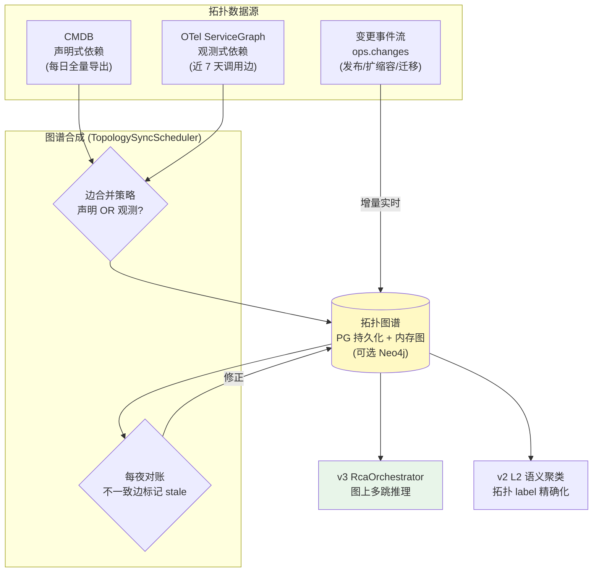
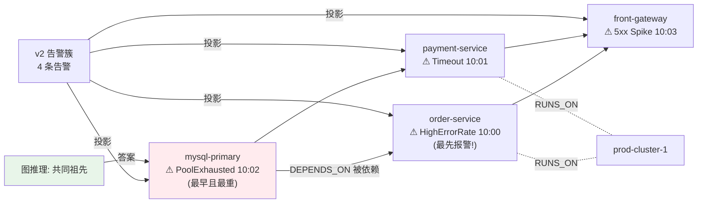
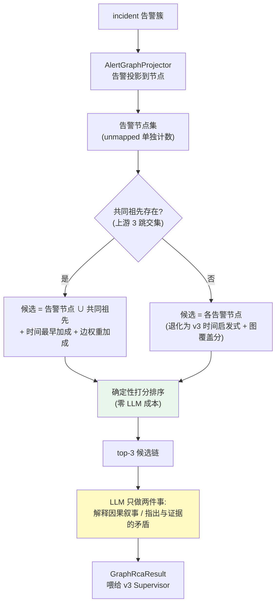
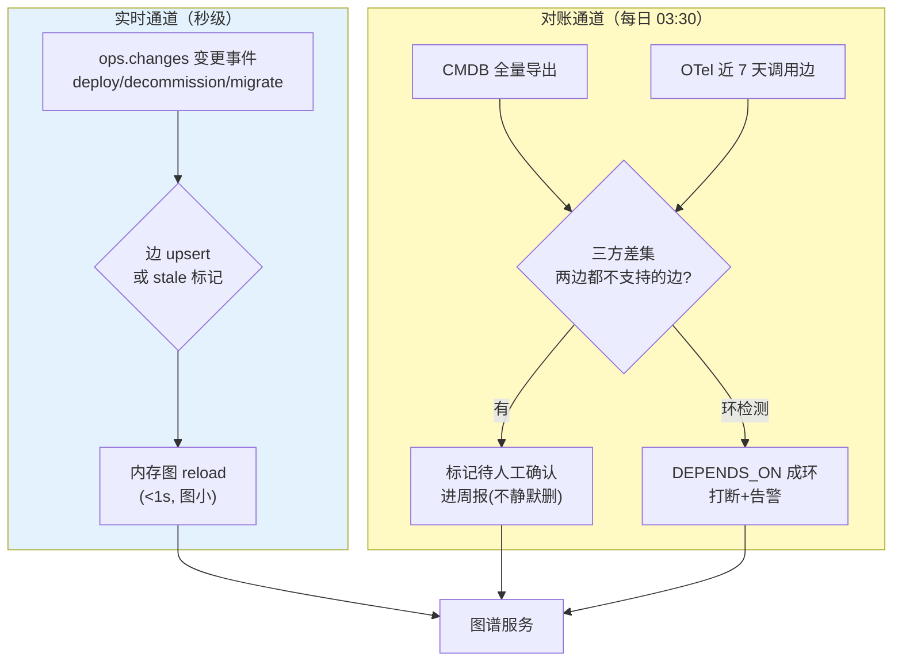

# 项目 09：智能运维 AIOps 平台 — 10-根因分析知识图谱

> **定位**：第二轮演进的第一个迭代——把 v3 RCA 的"簇内最早告警"启发式升级为**拓扑图谱上的因果推理**：运维拓扑图构建（CMDB + 运行时依赖发现双源合成）、告警图谱化（聚合到拓扑节点）、多跳 RCA（图上推理"哪个是因"）、图谱增量更新（变更事件驱动 + 对账兜底）。GraphRAG 思想在运维场景的落地（[教程 78-高级RAG与AgenticRAG §2] 的多跳推理）。本文代码为**完整可手写**（含全部 import、无省略）。
>
> 「遇到阻塞？→ [教程 78-高级RAG与AgenticRAG §2 GraphRAG 与 §4 Agentic 检索]、[附录 10-知识图谱工程/00-Neo4j落地GraphRAG §2 图谱 Schema]、[附录 10-知识图谱工程/01-GraphRAG工程化落地 §增量更新]」

---

## 1. 四问

| 问 | 答 |
|----|----|
| **新增了什么需求** | ① 运维拓扑图谱（服务依赖 + 中间件 + K8s 集群三层实体）② 告警投影到拓扑节点（图谱化的 incident 视图）③ 多跳 RCA：在图上推理"共同祖先 + 传播方向"，LLM 只解释因果链 ④ 拓扑增量更新（发布/变更事件驱动 + 每夜对账兜底） |
| **影响了哪些模块** | 新增 `topology` 包（`TopologyGraphService`/`AlertGraphProjector`/`GraphRcaInference`/`TopologySyncScheduler`）；升级 v3 `RcaOrchestrator.deterministicTriage` 为图上推理；复用 v2 `IncidentCluster` 与 v6 `ServiceProfileStore`（依赖清单互校） |
| **架构如何演进** | 从"时间最早启发式 + label 拓扑近似"演进为"拓扑图谱是 RCA 的第一等数据结构"：确定性图算法（共同祖先/上游子图）先行，LLM 只对 top-3 候选因果链做方向解释（延续"程序计算、AI 总结"） |
| **上一版痛点是什么** | ① v3 的 Triage 启发式在"上游故障、下游先爆"场景指错关注域（连接池满时最先报警的是下游 web 层）② Planner 的"拓扑感知拆分"只有 label 近似，无真实依赖边 ③ 依赖关系散在 CMDB/人脑/OTel 三处，无单一事实源 |

**新增需求量化目标**：跨服务故障根因 top-1 准确率从 v3 的 70% 提升到 ≥ 80%；拓扑更新滞后（真实变更→图谱可见）≤ 5 分钟；图谱推理零 LLM 成本（LLM 仅解释环节 ≤ 1.5k Token）。

### 1.1 本节核对（四问自测，轻量）

- [ ] 能复述 v3 启发式的失效场景（"上游故障、下游先爆"→连接池满时下游 web 层先报警）。
- [ ] 能说出三个量化目标及验收口径（对照 §4 验收对照表）。

## 2. 为什么 RCA 需要拓扑图谱

v3 的 RCA 把"簇内最早告警所在服务"当作关注域，这在**单服务故障**里是对的，但在**依赖传播故障**里会系统性指错：DB 连接池耗尽时，最先越过阈值的是下游的 `order-service`（因为它直接持连接），而真正的因在两跳之外的 `mysql-primary`。告警时间序回答不了"因果方向"，只有**依赖图的拓扑 + 时间序联合**才能回答。

这就是 [教程 35 §2] GraphRAG 的核心论断在运维侧的重述：**多跳问题（"哪个上游故障导致这批告警"）无法用向量相似度回答，必须在显式的图结构上推理**。运维恰好天然拥有这张图的原料——CMDB（声明式依赖）与 OTel（观测式依赖），缺的是把它们合成一张**单一事实源图谱**并让 RCA 用它。

### 2.1 拓扑图谱构建：双源合成



**双源互校**（ADR-424）：CMDB 说"A 依赖 B"但 OTel 近 7 天无一条 A→B 调用——要么依赖已下线（CMDB 过期），要么是冷备路径（OTel 盲区）。合成策略：**声明边与观测边取并集，观测边带调用量权重，对账发现的不一致边标记 `stale` 并进周报**，而不是静默删除——删错一条边，RCA 就会在真正的传播路径上断链。

### 2.2 一个 incident 的图谱化视图（告警投影示例）

以 v2 痛点里的真实场景为例：DB 连接池耗尽，下游先爆。图谱化前，值班看到的是 4 条无关联告警；图谱化后，它们变成同一张依赖图上的**带告警节点**，根因候选一眼可见：



注意反转点：**最先报警的 `order-service` 不是根因**——它在依赖图的下游，且 `mysql-primary` 的异常时间更早、更重。v3 的"最早告警启发式"在此例必错（它选 order-service），图推理选 mysql-primary——这就是 §4 测试 4 的回归剧本。

### 2.3 多跳 RCA 推理流



**推理责任的边界**（ADR-425）：走哪个方向（谁是谁的上游）、哪个候选排第一——图结构与时间序的确定性计算；为什么它是因、候选之间怎么互相排除——LLM 叙事。LLM **不能改排序、不能新增候选**：方向错了它只能指出矛盾，不能"发挥"。

### 2.4 图 Schema（三层实体）

| 实体/边 | 来源 | 示例 |
|---------|------|------|
| 节点：`Service` | CMDB/注册中心 | `order-service` |
| 节点：`Middleware` | CMDB | `mysql-primary`、`redis-cache`、`kafka` |
| 节点：`Cluster` | K8s 只读 | `prod-cluster-1`（Service 部署于 Cluster） |
| 边：`DEPENDS_ON` | 声明 ∪ 观测 | `order-service → mysql-primary`（带 qps 权重） |
| 边：`RUNS_ON` | K8s 只读 | `order-service → prod-cluster-1` |

### 2.5 本节核对（图谱设计理解）

| # | 核对项 | 判据 |
|---|--------|------|
| 1 | 双源互校策略 | 并集 + 观测带权重 + 不一致标 stale 不删（ADR-424），能说出"删错边=RCA 断链" |
| 2 | 反转点 | §2.2 示例中最先报警的 order-service 不是根因，图推理选 mysql-primary |
| 3 | 推理责任边界 | 方向/排序=确定性计算；叙事/矛盾=LLM（不得改排序、不得新增候选，ADR-425） |

## 3. 完整代码（照抄即可）

### 3.1 拓扑领域模型

```java
package com.aiops.platform.topology;

import java.util.List;
import java.util.Map;

/** 拓扑节点：服务/中间件/集群统一为节点，type 区分。 */
public record TopoNode(String id, String type, Map<String, String> attrs) {

    public static TopoNode service(String name) {
        return new TopoNode(name, "service", Map.of());
    }

    public static TopoNode middleware(String name, String kind) {
        return new TopoNode(name, "middleware", Map.of("kind", kind));
    }
}
```

```java
package com.aiops.platform.topology;

/** 依赖边：from DEPENDS_ON to。weight 为近 7 天观测调用量（声明边为 0）。 */
public record TopoEdge(String from, String to, String kind, double weight, boolean stale) {

    public static final String DEPENDS_ON = "DEPENDS_ON";
    public static final String RUNS_ON = "RUNS_ON";
}
```

```java
package com.aiops.platform.topology;

import java.util.List;

/** 传播链：根因节点 → 各跳 → 最远受影响节点，每跳带告警证据。 */
public record PropagationChain(
        String rootCauseNode,
        List<String> path,               // [根因节点, 第1跳, 第2跳, ..., 最远受影响节点]
        List<String> alertEvidence,      // 每跳命中的告警名
        double confidence                // 图结构 + 时间序联合得分
) {}
```

```java
package com.aiops.platform.topology;

import java.util.List;

/** 图上多跳 RCA 的输出（喂给 v3 Supervisor 的结构化结论）。 */
public record GraphRcaResult(
        String incidentId,
        List<PropagationChain> candidates,   // 按置信度排序，top-3 给 LLM 解释
        String commonAncestor,               // 告警节点的最近共同祖先（无则 null）
        int graphHops                        // 根因到最远告警的跳数
) {}
```

### 3.2 `TopologyGraphService.java`（内存图 + PG 持久化）

```java
package com.aiops.platform.topology;

import org.springframework.jdbc.core.simple.JdbcClient;
import org.springframework.stereotype.Service;

import java.util.ArrayDeque;
import java.util.ArrayList;
import java.util.Deque;
import java.util.HashMap;
import java.util.HashSet;
import java.util.List;
import java.util.Map;
import java.util.Set;

/**
 * 拓扑图谱服务：邻接表内存图（读多写少，全量 < 10 万边，单机足够），
 * PG 持久化（审计 + 重启恢复）。图查询全部确定性，零 LLM 成本（ADR-425）。
 * Neo4j 为可选演进：图规模超百万边或需 Cypher 图算法时引入（见 §3.6 依赖说明）。
 */
@Service
public class TopologyGraphService {

    private final JdbcClient jdbc;
    private volatile Map<String, List<TopoEdge>> adjacency = Map.of();   // from -> edges
    private volatile Set<String> nodeIds = Set.of();

    public TopologyGraphService(JdbcClient jdbc) {
        this.jdbc = jdbc;
        reload();
    }

    /** 全量重载（启动时 + 每夜对账后调用）。 */
    public synchronized void reload() {
        Map<String, List<TopoEdge>> adj = new HashMap<>();
        Set<String> nodes = new HashSet<>();
        jdbc.sql("SELECT from_id, to_id, kind, weight, stale FROM topology_edge WHERE stale = false")
                .query((rs, i) -> new TopoEdge(rs.getString("from_id"), rs.getString("to_id"),
                        rs.getString("kind"), rs.getDouble("weight"), false))
                .forEach(e -> {
                    adj.computeIfAbsent(e.from(), k -> new ArrayList<>()).add(e);
                    nodes.add(e.from());
                    nodes.add(e.to());
                });
        this.adjacency = Map.copyOf(adj);
        this.nodeIds = Set.copyOf(nodes);
    }

    /** 上游 N 跳子图（含中间件，跳过 stale 边）。BFS，确定性。 */
    public Map<String, Integer> upstream(String node, int maxHops) {
        Map<String, Integer> hops = new HashMap<>();
        Deque<String> queue = new ArrayDeque<>();
        queue.add(node);
        hops.put(node, 0);
        while (!queue.isEmpty()) {
            String cur = queue.poll();
            int d = hops.get(cur);
            if (d >= maxHops) {
                continue;
            }
            for (TopoEdge e : adjacency.getOrDefault(cur, List.of())) {
                if (!hops.containsKey(e.to())) {
                    hops.put(e.to(), d + 1);
                    queue.add(e.to());
                }
            }
        }
        return hops;
    }

    /** 最近共同祖先：多个告警节点的上游交集里，深度最大（最靠近告警）者。 */
    public String commonAncestor(List<String> nodes, int maxHops) {
        if (nodes.isEmpty()) {
            return null;
        }
        Map<String, Integer> inter = upstream(nodes.get(0), maxHops);
        for (int i = 1; i < nodes.size(); i++) {
            Map<String, Integer> up = upstream(nodes.get(i), maxHops);
            inter.keySet().retainAll(up.keySet());
        }
        inter.remove(nodes.get(0));                       // 排除告警节点自身
        return inter.entrySet().stream()
                .max(Map.Entry.comparingByValue())
                .map(Map.Entry::getKey)
                .orElse(null);
    }

    /** 判断 from 是否在 to 的上游 maxHops 跳内（传播方向判定）。 */
    public boolean isUpstreamOf(String from, String to, int maxHops) {
        return upstream(to, maxHops).containsKey(from);
    }

    /** 被依赖权重：所有指向 node 的边的 weight 之和（被多少流量真实依赖，传播路径存在性的代理）。 */
    public double dependentWeight(String node) {
        double sum = 0;
        for (List<TopoEdge> edges : adjacency.values()) {
            for (TopoEdge e : edges) {
                if (node.equals(e.to())) {
                    sum += e.weight();
                }
            }
        }
        return sum;
    }

    public Set<String> nodeIds() {
        return nodeIds;
    }
}
```

### 3.3 `AlertGraphProjector.java`（告警图谱化：投影到拓扑节点）

```java
package com.aiops.platform.topology;

import com.aiops.platform.alert.AlertEvent;
import com.aiops.platform.alert.IncidentCluster;
import org.springframework.stereotype.Component;

import java.util.ArrayList;
import java.util.HashMap;
import java.util.List;
import java.util.Map;

/**
 * 告警图谱化：把 incident 簇内的告警投影到拓扑节点上。
 * 投影规则（确定性）：labels.service 命中 Service 节点；告警名含 mysql/redis/kafka
 * 且 labels.instance 命中 Middleware 节点。未命中任何节点的告警归入 "unmapped"
 * （不丢弃——图谱盲区本身是要修的拓扑缺口，进周报）。
 */
@Component
public class AlertGraphProjector {

    private static final List<String> MW_PREFIXES = List.of("mysql", "redis", "kafka", "es");

    private final TopologyGraphService graph;

    public AlertGraphProjector(TopologyGraphService graph) {
        this.graph = graph;
    }

    /** 返回 节点id -> 命中告警列表（图谱化的 incident 视图）。 */
    public Map<String, List<AlertEvent>> project(IncidentCluster incident) {
        Map<String, List<AlertEvent>> projected = new HashMap<>();
        for (AlertEvent a : incident.alerts()) {
            String node = resolveNode(a);
            projected.computeIfAbsent(node, k -> new ArrayList<>()).add(a);
        }
        return projected;
    }

    private String resolveNode(AlertEvent a) {
        String service = a.labels().getOrDefault("service", "");
        if (graph.nodeIds().contains(service)) {
            return service;
        }
        String lower = a.alertName().toLowerCase();
        for (String mw : MW_PREFIXES) {
            if (lower.contains(mw)) {
                String instance = a.labels().getOrDefault("instance", "");
                if (graph.nodeIds().contains(instance)) {
                    return instance;
                }
            }
        }
        return "unmapped";
    }
}
```

### 3.4 `GraphRcaInference.java`（多跳 RCA：图结构 + 时间序联合推理，LLM 只解释）

```java
package com.aiops.platform.topology;

import com.aiops.platform.alert.AlertEvent;
import com.aiops.platform.alert.IncidentCluster;
import org.slf4j.Logger;
import org.slf4j.LoggerFactory;
import org.springframework.ai.chat.client.ChatClient;
import org.springframework.stereotype.Component;
import reactor.core.publisher.Mono;
import reactor.core.scheduler.Schedulers;

import java.util.ArrayList;
import java.util.Comparator;
import java.util.List;
import java.util.Map;

/**
 * 图上多跳 RCA（ADR-425）：
 * ① 告警投影到节点 → ② 候选根因 = 告警节点 ∪ 其上游 3 跳内节点（且自身有告警证据）
 * ③ 因果方向由"图上游 + 异常时间最早"联合打分（确定性）→ ④ LLM 只对 top-3 链
 * 做叙事解释与合理性校验（不定向、不打分——方向错了 LLM 只能指出矛盾，不能改）。
 */
@Component
public class GraphRcaInference {

    private static final Logger log = LoggerFactory.getLogger(GraphRcaInference.class);
    private static final int MAX_HOPS = 3;

    private final TopologyGraphService graph;
    private final AlertGraphProjector projector;
    private final ChatClient chatClient;

    public GraphRcaInference(TopologyGraphService graph,
                             AlertGraphProjector projector,
                             ChatClient chatClient) {
        this.graph = graph;
        this.projector = projector;
        this.chatClient = chatClient;
    }

    /** 确定性推理：输出排序后的候选传播链。 */
    public GraphRcaResult infer(IncidentCluster incident) {
        Map<String, List<AlertEvent>> projected = projector.project(incident);
        List<String> alertNodes = projected.keySet().stream()
                .filter(n -> !"unmapped".equals(n)).toList();
        if (alertNodes.isEmpty()) {
            return new GraphRcaResult(incident.incidentId(), List.of(), null, 0);
        }

        String ancestor = graph.commonAncestor(alertNodes, MAX_HOPS);
        List<PropagationChain> candidates = new ArrayList<>();
        for (String node : alertNodes) {
            long firstAlertAt = projected.get(node).stream()
                    .mapToLong(AlertEvent::startedAt).min().orElse(Long.MAX_VALUE);
            double score = score(node, ancestor, firstAlertAt, projected, alertNodes);
            candidates.add(new PropagationChain(
                    node, List.of(node, ancestor == null ? "?" : ancestor),
                    projected.get(node).stream().map(AlertEvent::alertName).limit(3).toList(),
                    score));
        }
        candidates.sort(Comparator.comparingDouble(PropagationChain::confidence).reversed());
        return new GraphRcaResult(incident.incidentId(),
                candidates.subList(0, Math.min(3, candidates.size())), ancestor, MAX_HOPS);
    }

    /**
     * 联合得分：共同祖先 +0.35；是其他告警节点上游 +0.25/跳内每节点；最早异常 +0.2；
     * 观测调用量权重归一 +0.2（权重高 = 传播路径真实存在）。
     */
    private double score(String node, String ancestor, long firstAlertAt,
                         Map<String, List<AlertEvent>> projected, List<String> alertNodes) {
        double s = 0;
        if (node.equals(ancestor)) {
            s += 0.35;
        }
        long upstreamHits = alertNodes.stream()
                .filter(other -> !other.equals(node) && graph.isUpstreamOf(node, other, MAX_HOPS))
                .count();
        s += Math.min(0.25, upstreamHits * 0.1);
        long minStart = projected.values().stream()
                .flatMap(List::stream).mapToLong(AlertEvent::startedAt).min().orElse(0);
        if (firstAlertAt == minStart) {
            s += 0.2;
        }
        s += 0.2 * Math.min(1.0, degreeWeight(node));
        return Math.min(1.0, s);
    }

    private double degreeWeight(String node) {
        return Math.min(1.0, graph.dependentWeight(node) / 1000.0);   // 被依赖的观测调用量归一（qps 千级封顶）
    }

    /** LLM 解释（只读结论）：对 top-3 候选链生成因果叙事，并校验图结构矛盾。 */
    public Mono<String> explain(GraphRcaResult result) {
        return Mono.fromCallable(() -> chatClient.prompt()
                        .system("""
                                你是 RCA 解释器。给定图推理输出的候选传播链（已按确定性得分排序），
                                输出 3 段以内解释：1) 为什么最可能的第一候选是因（引用拓扑方向与时间序）
                                2) 其余候选为何排后 3) 若候选与证据矛盾请指出（不得改排序、不得新增候选）。
                                """)
                        .user(String.valueOf(result))
                        .call()
                        .content())
                .subscribeOn(Schedulers.boundedElastic())
                .onErrorResume(err -> {
                    log.warn("图谱 RCA 解释降级为纯确定性输出: {}", err.getMessage());
                    return Mono.just("LLM 不可用，输出确定性候选链: " + result.candidates());
                });
    }
}
```

> **接入 v3**：`RcaOrchestrator.deterministicTriage` 升级为——先 `GraphRcaInference.infer(incident)` 拿到图上候选，取 top-1 的根因节点作为 focus 域（替代"簇内最早告警所在服务"）；LLM 摘要环节追加 `explain(result)` 的因果叙事。v3 的四路 Worker 取证**不变**——图谱负责"往哪看"，Worker 负责"看到什么"。

### 3.5 `TopologySyncScheduler.java`（增量更新：变更驱动 + 对账兜底）

图谱与代码一样有"漂移"问题——服务天天在发布，图停在昨天就是错图。双通道更新：



```java
package com.aiops.platform.topology;

import org.slf4j.Logger;
import org.slf4j.LoggerFactory;
import org.springframework.jdbc.core.simple.JdbcClient;
import org.springframework.scheduling.annotation.Scheduled;
import org.springframework.stereotype.Component;

import java.util.List;

/**
 * 图谱增量更新（ADR-426）：双通道——
 * ① 实时通道：消费 ops.changes 变更事件（发布新增依赖/下线服务/迁移集群）即时 upsert 边；
 * ② 对账通道：每夜 CMDB 全量导出 + OTel 近 7 天调用边全量比对，修 stale、补漏边。
 * 不变式：图必须无环（DEPENDS_ON 成环 = 数据错误，对账时打断并告警）。
 */
@Component
public class TopologySyncScheduler {

    private static final Logger log = LoggerFactory.getLogger(TopologySyncScheduler.class);

    private final JdbcClient jdbc;
    private final TopologyGraphService graph;

    public TopologySyncScheduler(JdbcClient jdbc, TopologyGraphService graph) {
        this.jdbc = jdbc;
        this.graph = graph;
    }

    /** 实时通道：变更事件处理（由 Kafka @KafkaListener 调用，见 v1 事件流接线）。 */
    public void onChangeEvent(ChangeEvent event) {
        switch (event.kind()) {
            case "deploy" -> upsertEdge(event.service(), event.dependsOn(), TopoEdge.DEPENDS_ON);
            case "decommission" -> jdbc.sql("UPDATE topology_edge SET stale = true WHERE from_id = :s OR to_id = :s")
                    .param("s", event.service()).update();
            case "migrate" -> upsertEdge(event.service(), event.cluster(), TopoEdge.RUNS_ON);
            default -> log.warn("未知变更事件类型: {}", event.kind());
        }
        graph.reload();                                    // 增量后即时可见（图小，全量重载 < 1s）
    }

    /** 对账通道：每夜 03:30 全量比对。 */
    @Scheduled(cron = "0 30 3 * * *")
    public void nightlyReconcile() {
        List<ChangeCandidate> diffs = jdbc.sql("""
                SELECT e.from_id, e.to_id FROM topology_edge e
                WHERE e.stale = false
                  AND NOT EXISTS (
                      SELECT 1 FROM cmdb_dependency c
                      WHERE c.from_id = e.from_id AND c.to_id = e.to_id)
                  AND NOT EXISTS (
                      SELECT 1 FROM otel_service_graph o
                      WHERE o.from_id = e.from_id AND o.to_id = e.to_id
                        AND o.window_start > EXTRACT(EPOCH FROM NOW() - INTERVAL '7 days') * 1000)
                """)
                .query((rs, i) -> new ChangeCandidate(rs.getString("from_id"), rs.getString("to_id")))
                .list();
        diffs.forEach(d -> log.warn("拓扑对账: 声明与观测均不支持的边 {} -> {}，标记待人工确认", d.from(), d.to()));
        graph.reload();
    }

    private void upsertEdge(String from, String to, String kind) {
        if (from == null || to == null) {
            return;
        }
        jdbc.sql("""
                INSERT INTO topology_edge(from_id, to_id, kind, weight, stale, updated_at)
                VALUES(:f, :t, :k, 0, false, :now)
                ON CONFLICT (from_id, to_id, kind) DO UPDATE SET stale = false, updated_at = :now
                """)
                .param("f", from).param("t", to).param("k", kind)
                .param("now", System.currentTimeMillis())
                .update();
    }

    /** 变更事件（消费 ops.changes 的反序列化目标）。 */
    public record ChangeEvent(String kind, String service, String dependsOn, String cluster) {}

    record ChangeCandidate(String from, String to) {}
}
```

### 3.6 `db/schema-v9.sql` 与依赖说明

```sql
CREATE TABLE IF NOT EXISTS topology_node (
    node_id  VARCHAR(128) PRIMARY KEY,
    type     VARCHAR(32)  NOT NULL,      -- service / middleware / cluster
    attrs    JSONB        NOT NULL DEFAULT '{}',
    updated_at BIGINT     NOT NULL
);

CREATE TABLE IF NOT EXISTS topology_edge (
    from_id    VARCHAR(128) NOT NULL,
    to_id      VARCHAR(128) NOT NULL,
    kind       VARCHAR(32)  NOT NULL,    -- DEPENDS_ON / RUNS_ON
    weight     REAL         NOT NULL DEFAULT 0,
    stale      BOOLEAN      NOT NULL DEFAULT false,
    updated_at BIGINT       NOT NULL,
    PRIMARY KEY (from_id, to_id, kind)
);
CREATE INDEX IF NOT EXISTS idx_topo_edge_to ON topology_edge (to_id);
```

> **源表说明**：`TopologySyncScheduler.nightlyReconcile` 引用的 `cmdb_dependency`（CMDB 每日导出）与 `otel_service_graph`（OTel ServiceMap 聚合，含 window_start/qps）是**数据源侧接入表**——由 CMDB 导出任务与 OTel 聚合作业各自写入（字段以你的实际监控栈为准），本文不定义其 DDL；对账 SQL 只依赖上述查询列存在。

> **依赖说明**：本迭代核心实现零新依赖（PG + 内存图）。若图规模超百万边或需要 Cypher 图算法（社区发现/中心性），引入 Neo4j——真实坐标：`org.neo4j.driver:neo4j-java-driver`（本地仓库有 `org.neo4j.driver:neo4j-java-driver-bom:6.1.0` 可导入管理版本，但 jar 未下载，**需引入依赖后 javap 实证驱动 API**），图模型设计与增量更新策略见 [附录 10-知识图谱工程/00-Neo4j落地GraphRAG §4]。在引入前，本文实现即为可用形态（ADR-424 的"够用先跑"原则）。

### 3.7 本节测试与验证（图谱构建、投影与多跳推理）

**前置条件**：`db/schema-v9.sql` 已执行；`cmdb_dependency`/`otel_service_graph` 源表可空（对账 SQL 依赖列存在即可）。

**材料 A——三层依赖图种子数据（§2.2 剧本）**：

```sql
INSERT INTO topology_node(node_id, type, attrs, updated_at) VALUES
 ('mysql-primary','middleware','{"kind":"mysql"}', extract(epoch from now())*1000),
 ('order-service','service','{}', extract(epoch from now())*1000),
 ('payment-service','service','{}', extract(epoch from now())*1000),
 ('front-gateway','service','{}', extract(epoch from now())*1000);

INSERT INTO topology_edge(from_id, to_id, kind, weight, stale, updated_at) VALUES
 ('order-service','mysql-primary','DEPENDS_ON',800,false,extract(epoch from now())*1000),
 ('payment-service','mysql-primary','DEPENDS_ON',600,false,extract(epoch from now())*1000),
 ('front-gateway','order-service','DEPENDS_ON',900,false,extract(epoch from now())*1000),
 ('front-gateway','payment-service','DEPENDS_ON',700,false,extract(epoch from now())*1000);
```

**材料 B——告警簇构造**（复用 [02 §3.10] 的四连发思路）：order-service 10:00 HighErrorRate、payment-service 10:01 Timeout、mysql-primary 10:02 PoolExhausted、front-gateway 10:03 Spike，labels 带 service（mysql 告警 alertName 含 "Mysql" 且 instance=mysql-primary）。

**步骤与断言**：

| # | 操作 | 预期（PASS 判据） |
|---|------|------------------|
| 1 | 材料入图后 `graph.reload()`，查 `upstream("front-gateway", 3)` | 含 order-service/payment-service(1 跳)、mysql-primary(2 跳) |
| 2 | `commonAncestor(["order-service","front-gateway"], 3)` | 返回 `mysql-primary`（而非 front-gateway） |
| 3 | `AlertGraphProjector.project(材料 B 簇)` | 4 告警各命中对应节点；labels 无 service 的构造一条 → 归入 "unmapped"（不丢弃） |
| 4 | `GraphRcaInference.infer(材料 B 簇)` | top-1 = `mysql-primary`（共同祖先 +0.35、上游命中、最早异常 10:02 加成）；对照 v3 启发式会选 order-service（10:00 最早）——反转点成立 |
| 5 | LLM 只解释 | `explain(result)` 输出叙事且不改 candidates 顺序；改错 api-key → 回退"确定性候选链"文案（降级不失败） |
| 6 | 增量通道 | 调 `onChangeEvent(new ChangeEvent("deploy","new-svc","mysql-primary",null))` | topology_edge 新增 new-svc→mysql-primary；内存图 reload 后 `nodeIds()` 含 new-svc |
| 7 | decommission 事件 | 该服务相关边 stale=true，reload 后不在图中（查询跳过 stale） |
| 8 | 对账 | 造一条两边都不支持的边，手动调 `nightlyReconcile()` | 日志"标记待人工确认"，边保留（不静默删） |

**失败排查**：①步骤 2 返回 front-gateway→边方向插反（DEPENDS_ON 是 from 依赖 to）；②步骤 4 top-1=order→共同祖先判空（边缺 mysql 连接）或 earliest 加成权重覆盖了祖先分；③投影全 unmapped→labels 缺 service 且 instance 不在节点表；④reload 后图不变→SQL 未提交或 reload 未被调用。

## 4. 全篇回归验证

> 单步材料（种子图 SQL、告警簇、逐步断言）已上移至 §3.7；本表为整篇迭代的回归测试项与量化目标对照，不重复材料。

| # | 测试 | 方法 | 通过标准 |
|---|------|------|---------|
| 1 | 单测：共同祖先 | 构造 DB→order→front 三层图，对 {order, front} 求共同祖先 | 返回 `mysql-primary`（而非 front） |
| 2 | 单测：无环不变式 | 构造 A→B→C→A 环 | `nightlyReconcile` 检出并打断（stale 标记 + 告警） |
| 3 | 单测：unmapped 不丢 | 喂 labels 无 service 的告警 | 投影到 "unmapped"，周报计数 |
| 4 | 集成：指错域回归 | 注入"连接池满"剧本（下游先爆、上游后爆且更重） | 图推理 top-1 = `mysql-primary`；v3 启发式 top-1 = `order-service`（对照组） |
| 5 | 回放：历史对照 | v6 postmortem 近 50 起跨服务故障回放 | 图推理 top-1 与人工确认根因一致率 ≥ 80% |
| 6 | 增量时效 | 发布事件→图谱可见→RCA 可用 | 端到端 ≤ 5 分钟 |

**验收对照**（对照 §1 量化目标）：

| 量化目标 | 验收结果口径 |
|---------|-------------|
| 跨服务故障 top-1 准确率 ≥ 80% | 测试 5 回放集（v3 基线 70%，提升来自图结构而非调 Prompt） |
| 拓扑更新滞后 ≤ 5 分钟 | 测试 6（实时通道 upsert + reload） |
| 推理零 LLM 成本 / 解释 ≤ 1.5k Token | `infer()` 纯 Java；`explain()` 只读 top-3 候选（输入 < 500 Token） |

## 5. 本迭代的 ADR

| # | 决策 | 理由 |
|---|------|------|
| ADR-424 | 拓扑双源合成：CMDB 声明 ∪ OTel 观测，不一致标记不删除 | 单一来源必有盲区（CMDB 过期/OTel 看不到冷备）；删错边 = RCA 断链 |
| ADR-425 | 因果方向由"图上游 + 时间最早"确定性判定，LLM 只解释不定向 | 方向是可枚举的结构问题；让 LLM 定向会把幻觉注入根因结论 |
| ADR-426 | 增量更新走变更事件，每夜对账兜底；图无环为不变式 | 只有增量会漂移，只有对账会滞后；双通道互补 |

### 5.1 本节核对（ADR 一致性）

- [ ] ADR-424 落点 = §3.2 stale 过滤 + §3.5 对账不删；ADR-425 落点 = §3.4 `infer` 纯 Java + `explain` 只读；ADR-426 落点 = §3.5 双通道。
- [ ] 三条 ADR 与 [13-ADR架构决策记录 §3] 总账一致（编号 424-426）。

## 6. v9 的痛点（驱动下一迭代）

图谱让 RCA "指得准"了，但平台对故障的响应仍是**事后**的：等告警来、等人确认、再调处置工具。容量侧同样被动——v7 预测只出报告和预警，扩容仍靠人执行；HPA 反应式扩容在大促爬坡时总是慢半拍。**预测要驱动弹性执行（提前扩容），而不是停留在报告里**。→ [11-预测性容量与弹性.md](11-预测性容量与弹性.md)

### 6.1 本节核对（痛点承接）

- [ ] "预测驱动弹性执行"由 [11 §2] 前馈 vs 反馈与 §3 ScalingPlan 承接。
