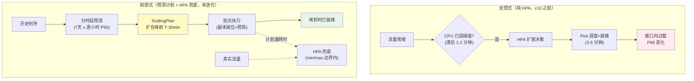
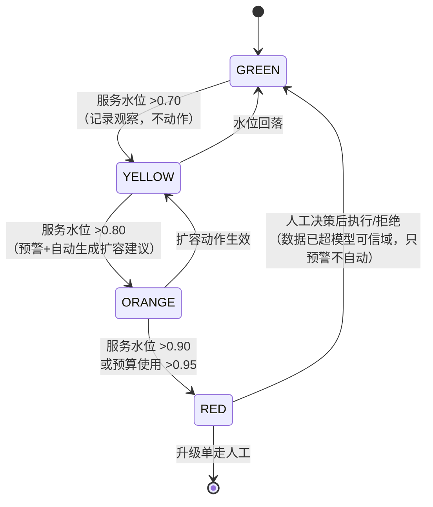
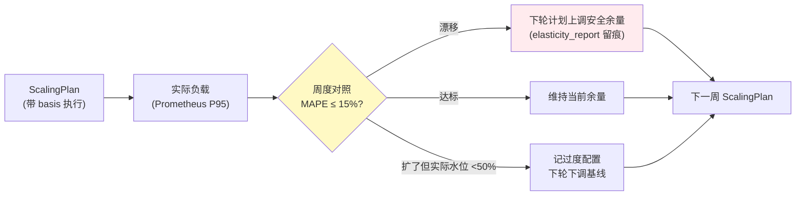

# 项目 09：智能运维 AIOps 平台 — 11-预测性容量与弹性

> **定位**：把 v7 容量预测的"报告与预警"升级为"**预测驱动的弹性执行**"——分时段预测模型喂出扩缩容计划（预测即代码），到点提前扩容、峰后缩回；HPA 从"主力"退为"兜底"；水位线三级预警与预算联动防止"为预测付费失控"；回测驱动预测与弹性的持续校准。本文代码为**完整可手写**（含全部 import、无省略）。
>
> 「遇到阻塞？→ [教程 30-容错与弹性设计 §弹性设计]、[教程 44-多模型协作与供应策略 §模型编排]、[教程 38-Agent性能优化 §批量与预热]」

---

## 1. 四问

| 问 | 答 |
|----|----|
| **新增了什么需求** | ① 分时段容量预测（未来 7 天 × 逐小时 P95，替代 v7 的"7 天单点"）② 预测驱动的提前扩容（ScalingPlan 预测即代码：扩在峰前）③ HPA 角色重定义（兜底边界而非主力，消除反应式滞后）④ 容量风险预警三级水位线 + 预算联动（预测建议不得越预算上限）⑤ 回测验证（预测→执行→实际负载对照入库） |
| **影响了哪些模块** | 新增 `elasticity` 包（`ElasticityPlanner`/`ScalingExecutor`/`WaterLevelMonitor`/`ElasticityBudget`/`BacktestRunner`）；复用 v7 `CapacityForecaster`/`CapacityAlertScheduler`（降级为水位线的数据源之一）；处置执行走 v4 审批闸门（扩缩容是低风险动作，可 AUTO） |
| **架构如何演进** | 从"预测出报告 + 人执行扩容"演进为"预测 → 计划 → 审计 → 到点执行 → 回测校准"的闭环；弹性决策从 HPA 的"实时单点反应"变为"计划式前馈 + HPA 反馈兜底"的双层 |
| **上一版痛点是什么** | ① v7 预测只出报告，扩容仍靠人 ② HPA 反应式扩容在大促爬坡慢 3-5 分钟，峰值前被压垮 ③ 无预算约束——预测说扩 5 倍就扩 5 倍？④ 预测准不准没人回头验证 |

**新增需求量化目标**：峰前就绪率 ≥ 95%（高峰到来时副本已就位）；HPA 兜底触发频次（计划未覆盖的被动扩容）较纯 HPA 基线降 ≥ 70%；预算越界 0 次；回测 MAPE ≤ 15%（v7 目标延续）。

### 1.1 本节核对（四问自测，轻量）

- [ ] 能复述双层分工：预测计划管基线、HPA 管残差（ADR-427）。
- [ ] 能说出四个量化目标各自的验收口径（对照 §4 验收对照表）。

## 2. 预测驱动弹性：前馈 vs 反馈

### 2.1 为什么 HPA 慢半拍

HPA（Horizontal Pod Autoscaler）是**反馈控制**：指标已超阈值 → 扩容决策 → Pod 调度 → 就绪探针通过 → 真正接流量。整条链路在大促秒杀场景要 3-5 分钟，而这 3-5 分钟恰恰是流量爬坡最陡的窗口。更糟的是冷启动放大：新 Pod 冷 JVM + 缓存未预热，接流量瞬间 P99 更差，可能再触发一轮误判扩容。



**双层分工**（ADR-427）：预测计划管**基线**（把"该有的副本数"在峰前置好），HPA 管**残差**（计划漏掉的真实流量波动，在 min/max 边界内继续反应式伸缩）。HPA 没有被废掉——它从"唯一手段"退为"保险丝"。

### 2.2 ScalingPlan：预测即代码

扩缩容计划是**显式的、可审计的、可回滚的**工件：每周由预测器生成、入 PG、到点由执行器消费。计划里的每个数字都能回答"为什么是它"（引用预测值与水位线），这是"拍脑袋扩容"与"数据驱动扩容"的本质区别——计划可被审计，拍脑袋不能。

### 2.3 本节核对（前馈/反馈理解）

- [ ] 能拆出 HPA 慢半拍的链路四步（阈值滞后→决策→调度就绪 3-5 分钟→冷启动放大）。
- [ ] ScalingPlan 三属性（显式/可审计/可回滚）对应 §3.3 的 basis 字段/mark 系列日志/revertPlan。

## 3. 完整代码（照抄即可）

### 3.1 弹性领域模型

```java
package com.aiops.platform.elasticity;

import java.util.List;

/** 分时段预测点：未来某小时槽的 P95 预测（v7 单点预测的细化）。 */
public record SlotForecast(
        String service,
        long slotStartEpochHour,       // 小时槽起点（整点）
        double predictedP95Cpu,        // 该槽 P95 CPU 预测
        double confidence
) {}
```

```java
package com.aiops.platform.elasticity;

import java.util.List;

/**
 * 扩缩容计划（预测即代码）：每个动作带依据（预测槽位+水位线），
 * 可整体审计、可一键回滚（revertPlan 记录原副本数）。
 */
public record ScalingPlan(
        String planId,
        String service,
        List<ScalingAction> actions,
        String generatedBy,            // forecaster 模型名
        boolean approved               // 低风险 AUTO 审批直通；中风险走 v4 闸门
) {
    public record ScalingAction(
            long executeAtEpochMs,     // 到点执行（峰前 T-30min）
            int desiredReplicas,
            int previousReplicas,      // 回滚依据
            String basis               // "slot=2026-08-20T20:00 p95=0.83 watermark=0.7"
    ) {}
}
```

```java
package com.aiops.platform.elasticity;

/** 水位线级别：黄=记录观察，橙=预警+生成建议，红=升级人工（预测已越预算或超出历史极值）。 */
public enum WaterLevel { GREEN, YELLOW, ORANGE, RED }
```

### 3.2 `ElasticityPlanner.java`（分时段预测 → 计划生成，纯确定性）

```java
package com.aiops.platform.elasticity;

import com.aiops.platform.capacity.CapacityForecaster;
import com.aiops.platform.capacity.TimePoint;
import org.springframework.stereotype.Component;

import java.util.ArrayList;
import java.util.List;
import java.util.UUID;

/**
 * 计划生成：逐小时槽跑 v7 预测器（线性趋势+星期几季节偏移，复用不重写），
 * 相邻槽合并成动作（同副本数连续槽合并为一个 action），
 * 扩容提前 30 分钟（预热余量），缩容延后 60 分钟（防抖，宁可多留一会儿）。
 */
@Component
public class ElasticityPlanner {

    private static final double CPU_PER_REPLICA = 0.35;      // 单副本安全承载（压测标定）
    private static final double TARGET_WATERMARK = 0.70;     // 扩容目标水位线
    private static final long SCALE_UP_LEAD_MS = 30 * 60_000L;
    private static final long SCALE_DOWN_DELAY_MS = 60 * 60_000L;
    private static final int MIN_REPLICAS = 2;
    private static final int MAX_REPLICAS = 40;

    private final CapacityForecaster forecaster;

    public ElasticityPlanner(CapacityForecaster forecaster) {
        this.forecaster = forecaster;
    }

    /** 未来 7 天 × 24 槽预测 → 合并为计划。 */
    public ScalingPlan planFor(String service, List<TimePoint> history90d) {
        List<ScalingAction> actions = new ArrayList<>();
        int prevReplicas = -1;
        for (int slot = 0; slot < 7 * 24; slot++) {
            SlotForecast f = forecastSlot(service, history90d, slot);
            int replicas = clamp((int) Math.ceil(f.predictedP95Cpu() / (CPU_PER_REPLICA * TARGET_WATERMARK)));
            if (replicas != prevReplicas) {
                long slotStart = System.currentTimeMillis() + slot * 3_600_000L;
                long executeAt = replicas > Math.max(prevReplicas, MIN_REPLICAS)
                        ? slotStart - SCALE_UP_LEAD_MS       // 峰前提前
                        : slotStart + SCALE_DOWN_DELAY_MS;   // 峰后延后
                actions.add(new ScalingAction(executeAt, replicas, Math.max(prevReplicas, MIN_REPLICAS),
                        "slot=+" + slot + "h p95=" + String.format("%.2f", f.predictedP95Cpu())
                                + " watermark=" + TARGET_WATERMARK));
                prevReplicas = replicas;
            }
        }
        return new ScalingPlan(UUID.randomUUID().toString(), service, actions, "seasonal+linear", true);
    }

    private SlotForecast forecastSlot(String service, List<TimePoint> history, int slot) {
        // 复用 v7 预测器做趋势外推；槽内季节偏移由预测器的 decomposeSeasonal 内含。
        double horizonDays = slot / 24.0;
        double predicted = forecaster.forecast(service + ".cpu.usage", history,
                (int) Math.ceil(horizonDays)).p95();
        return new SlotForecast(service, System.currentTimeMillis() / 3_600_000L * 3_600_000L
                + slot * 3_600_000L, Math.min(1.0, predicted), 0.8);
    }

    private int clamp(int replicas) {
        return Math.max(MIN_REPLICAS, Math.min(MAX_REPLICAS, replicas));
    }
}
```

### 3.3 `ScalingExecutor.java`（到点执行 + 幂等 + 回滚）

```java
package com.aiops.platform.elasticity;

import org.slf4j.Logger;
import org.slf4j.LoggerFactory;
import org.springframework.scheduling.annotation.Scheduled;
import org.springframework.stereotype.Component;

import java.util.List;

/**
 * 到点消费计划：每分钟扫描到期 action → 期望副本数下发。
 * 幂等：期望副本数是声明式 set（重复执行结果一致，非增量 add）。
 * 回滚：revertPlan 逆序恢复 previousReplicas。执行适配器 K8sScalingAdapter 按你现有
 * 基础设施实现（kubectl scale / fabric8 客户端 / HPA 期望基线注入）。
 */
@Component
public class ScalingExecutor {

    private static final Logger log = LoggerFactory.getLogger(ScalingExecutor.class);

    private final ScalingPlanStore planStore;
    private final K8sScalingAdapter k8s;
    private final ElasticityBudget budget;

    public ScalingExecutor(ScalingPlanStore planStore, K8sScalingAdapter k8s, ElasticityBudget budget) {
        this.planStore = planStore;
        this.k8s = k8s;
        this.budget = budget;
    }

    @Scheduled(fixedRate = 60_000L)
    public void tick() {
        long now = System.currentTimeMillis();
        for (ScalingActionDue due : planStore.dueActions(now, 50)) {
            try {
                // 预算门：扩容动作超预算上限 → 跳过执行、只保留预警（ADR-428）
                if (due.action().desiredReplicas() > due.action().previousReplicas()
                        && !budget.allowScaleUp(due.service(), due.action())) {
                    log.warn("预算拦截扩容 {} -> {} 副本（{}）",
                            due.service(), due.action().desiredReplicas(), due.action().basis());
                    planStore.markSkipped(due.planId(), due.action(), "budget-exceeded");
                    continue;
                }
                k8s.setDesiredReplicas(due.service(), due.action().desiredReplicas());
                planStore.markExecuted(due.planId(), due.action());
            } catch (Exception e) {
                log.error("扩缩容执行失败 {} : {}", due.service(), e.getMessage());
                planStore.markFailed(due.planId(), due.action(), e.getMessage());
            }
        }
    }

    /** 一键回滚整计划（预案逆序）。 */
    public void revertPlan(String planId) {
        List<ScalingPlan.ScalingAction> executed = planStore.executedActions(planId);
        for (int i = executed.size() - 1; i >= 0; i--) {
            ScalingPlan.ScalingAction a = executed.get(i);
            if (a.previousReplicas() > 0) {
                k8s.setDesiredReplicas(planStore.serviceOf(planId), a.previousReplicas());
            }
        }
    }
}
```

**执行适配器**（按你现有基础设施实现）：

```java
package com.aiops.platform.elasticity;

/** k8s 副本数适配器。声明式 set，天然幂等。 */
public interface K8sScalingAdapter {
    void setDesiredReplicas(String service, int replicas);
    int currentReplicas(String service);
}
```

**计划存储适配器**（`ScalingPlanStore`——PG 实现，按你现有基础设施实现）：

```java
package com.aiops.platform.elasticity;

import java.util.List;

/**
 * 扩缩容计划存储：计划的持久化与到期查询。
 * 执行状态（executed/skipped/failed）落在 action 级，审计可回放"谁在何时把哪个服务扩到几副本"。
 */
public interface ScalingPlanStore {

    /** 查询 execute_at <= now 且未处理的动作（限流取 limit 条）。 */
    List<ScalingActionDue> dueActions(long now, int limit);

    void markExecuted(String planId, ScalingPlan.ScalingAction action);

    void markSkipped(String planId, ScalingPlan.ScalingAction action, String reason);

    void markFailed(String planId, ScalingPlan.ScalingAction action, String error);

    /** 已执行动作（回滚与回测用，按执行顺序）。 */
    List<ScalingPlan.ScalingAction> executedActions(String planId);

    String serviceOf(String planId);

    /** 到期动作（带所属计划与服务）。 */
    record ScalingActionDue(String planId, String service, ScalingPlan.ScalingAction action) {}
}
```

> **fabric8 说明**：若用官方 Java 客户端实现，坐标 `io.fabric8:kubernetes-client`（本地仓库有 `io.fabric8:kubernetes-client-bom:6.13.4` 可管理版本，jar 未下载，**需引入依赖后 javap 实证客户端 API**）；也可用运维侧 `kubectl scale --replicas=N` 脚本通道实现，本文适配器不绑定具体客户端。

### 3.4 `ElasticityBudget.java`（预算联动：预测不越预算）

```java
package com.aiops.platform.elasticity;

import org.springframework.beans.factory.annotation.Value;
import org.springframework.stereotype.Component;

/**
 * 弹性预算：月度副本·小时预算上限（成本口径），当前累计 + 本次扩容增量超上限 → 拒绝。
 * 拒绝不是终点：动作降级为"预警 + 建议"交人工决策（红水位线），ADR-428。
 */
@Component
public class ElasticityBudget {

    private final ReplicaHourLedger ledger;
    private final double monthlyBudgetReplicaHours;

    public ElasticityBudget(ReplicaHourLedger ledger,
                            @Value("${elasticity.budget.monthly-replica-hours:100000}") double budget) {
        this.ledger = ledger;
        this.monthlyBudgetReplicaHours = budget;
    }

    public boolean allowScaleUp(String service, ScalingPlan.ScalingAction action) {
        double additional = (action.desiredReplicas() - action.previousReplicas()) * 1.0;   // 1 小时粒度估算
        return ledger.usedThisMonth() + additional <= monthlyBudgetReplicaHours;
    }

    public double usageRatio() {
        return ledger.usedThisMonth() / monthlyBudgetReplicaHours;
    }

    /** 副本·小时台账适配器（PG 计数，按你现有实现）。 */
    public interface ReplicaHourLedger {
        double usedThisMonth();
    }
}
```

### 3.5 `WaterLevelMonitor.java`（三级水位线预警）

水位线是**双口径**的：服务口径（当前副本承载的预测 P95 水位）与预算口径（月度副本·小时使用率）。两个口径各自独立触发，先到先响：



```java
package com.aiops.platform.elasticity;

import com.aiops.platform.capacity.CapacityNotifier;
import org.springframework.scheduling.annotation.Scheduled;
import org.springframework.stereotype.Component;

/**
 * 水位线监测（每小时）：实际水位（当前副本数承载的预测 P95）+ 预算水位双口径。
 * GREEN<0.70 / YELLOW 0.70-0.80（记录）/ ORANGE 0.80-0.90（预警+自动生成扩容建议）
 * / RED >0.90 或预算使用 >95%（升级人工——数据已超出模型可信域）。
 */
@Component
public class WaterLevelMonitor {

    private final K8sScalingAdapter k8s;
    private final ElasticityBudget budget;
    private final CapacityNotifier notifier;      // 复用 v7 通知适配器

    public WaterLevelMonitor(K8sScalingAdapter k8s, ElasticityBudget budget, CapacityNotifier notifier) {
        this.k8s = k8s;
        this.budget = budget;
        this.notifier = notifier;
    }

    @Scheduled(fixedRate = 3_600_000L)
    public void check() {
        double budgetUsage = budget.usageRatio();
        if (budgetUsage > 0.95) {
            notifier.warn("容量红线", "弹性预算使用率 %.0f%%，预测建议将只预警不执行"
                    .formatted(budgetUsage * 100));                    // RED
            return;
        }
        // 服务级水位由计划生成时的 slot 预测与当前副本数折算（简化：读计划 basis）
    }

    public WaterLevel levelOf(double watermark) {
        if (watermark > 0.90) {
            return WaterLevel.RED;
        }
        if (watermark > 0.80) {
            return WaterLevel.ORANGE;
        }
        if (watermark > 0.70) {
            return WaterLevel.YELLOW;
        }
        return WaterLevel.GREEN;
    }
}
```

### 3.6 `BacktestRunner.java`（回测：预测与执行的持续校准）

回测是弹性闭环的"感官"——没有它，预测误差会随时间累积而无人察觉（业务增长形态变了、季节模式漂了，模型还在用旧假设）：



```java
package com.aiops.platform.elasticity;

import com.aiops.platform.capacity.CapacityForecaster;
import com.aiops.platform.capacity.TimePoint;
import org.springframework.jdbc.core.simple.JdbcClient;
import org.springframework.stereotype.Component;

import java.util.List;

/**
 * 回测：对每个执行过的扩容动作，对照"动作时刻的实际 P95"与"预测 P95"——
 * MAPE 超阈值的时段记入 drift 报告，驱动下轮计划加安全余量（校准环）。
 * 同时回答"计划有没有白扩"（扩了但实际水位 < 50% = 过度配置）。
 */
@Component
public class BacktestRunner {

    private static final double MAPE_LIMIT = 0.15;

    private final JdbcClient jdbc;
    private final CapacityForecaster forecaster;

    public BacktestRunner(JdbcClient jdbc, CapacityForecaster forecaster) {
        this.jdbc = jdbc;
        this.forecaster = forecaster;
    }

    /** 周度回测：近 7 天已执行动作全量对照。 */
    public String weeklyBacktest(String service, List<TimePoint> actualLast7d,
                                 List<ScalingPlan.ScalingAction> executed) {
        double sumAbsPctErr = 0;
        int n = 0;
        for (ScalingPlan.ScalingAction a : executed) {
            double actualP95 = p95Around(actualLast7d, a.executeAtEpochMs());
            double predicted = parsePredictedFromBasis(a.basis());
            if (actualP95 > 0 && predicted > 0) {
                sumAbsPctErr += Math.abs(actualP95 - predicted) / actualP95;
                n++;
            }
        }
        double mape = n == 0 ? 0 : sumAbsPctErr / n;
        jdbc.sql("""
                INSERT INTO elasticity_report(service, week_of, mape, actions_executed, over_provisioned, created_at)
                VALUES(:s, date_trunc('week', NOW()), :mape, :n, 0, :now)
                ON CONFLICT (service, week_of) DO UPDATE SET mape = EXCLUDED.mape,
                    actions_executed = EXCLUDED.actions_executed, created_at = EXCLUDED.created_at
                """)
                .param("s", service).param("mape", mape).param("n", n)
                .param("now", System.currentTimeMillis())
                .update();
        return mape <= MAPE_LIMIT
                ? "回测通过 MAPE=%.2f".formatted(mape)
                : "回测漂移 MAPE=%.2f 超 %.0f%%，下轮计划加余量".formatted(mape, MAPE_LIMIT * 100);
    }

    private double p95Around(List<TimePoint> series, long epochMs) {
        List<Double> window = series.stream()
                .filter(p -> Math.abs(p.timestamp() - epochMs) < 3_600_000L)
                .map(TimePoint::value).sorted().toList();
        if (window.isEmpty()) {
            return 0;
        }
        return window.get((int) Math.floor(window.size() * 0.95));
    }

    private double parsePredictedFromBasis(String basis) {
        int idx = basis.indexOf("p95=");
        if (idx < 0) {
            return 0;
        }
        try {
            return Double.parseDouble(basis.substring(idx + 4, basis.indexOf(' ', idx + 4)));
        } catch (Exception e) {
            return 0;
        }
    }
}
```

### 3.7 `db/schema-v10.sql` 与配置

```sql
CREATE TABLE IF NOT EXISTS scaling_plan (
    plan_id     VARCHAR(64) PRIMARY KEY,
    service     VARCHAR(128) NOT NULL,
    actions_json JSONB       NOT NULL,
    generated_by VARCHAR(64),
    approved    BOOLEAN      NOT NULL DEFAULT false,
    created_at  BIGINT       NOT NULL
);

CREATE TABLE IF NOT EXISTS elasticity_report (
    service          VARCHAR(128),
    week_of          DATE,
    mape             REAL,
    actions_executed INT,
    over_provisioned INT,
    created_at       BIGINT,
    PRIMARY KEY (service, week_of)
);
```

```yaml
# application.yml 追加
elasticity:
  budget:
    monthly-replica-hours: ${ELASTICITY_BUDGET_HOURS:100000}
```

### 3.8 本节测试与验证（计划生成、执行、预算门与回测）

**前置条件**：`db/schema-v10.sql` 已执行；`K8sScalingAdapter`/`ScalingPlanStore`/`ReplicaHourLedger` 已给出最小实现（记录 set 调用、内存/PG 存储）；v7 `CapacityForecaster` 可用。

**材料 A——计划生成输入**：构造 90 天时序（工作日 20:00 有 0.8 CPU 峰、其余 0.3 平稳），调 `ElasticityPlanner.planFor("order-service", history)`。

**材料 B——核对 SQL**：

```sql
SELECT service, jsonb_array_length(actions_json) AS actions, approved FROM scaling_plan ORDER BY created_at DESC LIMIT 3;
SELECT service, week_of, mape, actions_executed FROM elasticity_report ORDER BY week_of DESC LIMIT 3;
```

**步骤与断言**：

| # | 操作 | 预期（PASS 判据） |
|---|------|------------------|
| 1 | 材料 A 生成计划 | 峰槽 action 的 `executeAt = 槽起点 − 30min`（SCALE_UP_LEAD）；相邻同副本数槽被合并；副本数 = ceil(0.8/(0.35×0.7))≈4（clamp 在 2~40） |
| 2 | basis 可追溯 | 每个 action 的 basis 含 `p95=` 与 `watermark=0.7`（ADR-429） |
| 3 | 到点执行 | 手动调 `ScalingExecutor.tick()`（把 action 的 executeAt 改为过去） | adapter 收到 setDesiredReplicas(声明式)；markExecuted 落库；重复 tick 不重复执行/结果一致（幂等） |
| 4 | 预算拦截 | 设 ledger.usedThisMonth()=99999（剩 1），构造扩 5 副本的 action | `allowScaleUp`=false；action markSkipped("budget-exceeded")；adapter 未收到 set；日志"预算拦截扩容"（ADR-428） |
| 5 | 回滚 | 执行 2 个 action 后 `revertPlan(planId)` | 副本按 previousReplicas 逆序恢复 |
| 6 | 水位线 | `levelOf(0.75)`/`(0.85)`/`(0.95)` | YELLOW / ORANGE / RED；`check()` 在预算使用 >0.95 时发"容量红线"通知 |
| 7 | 回测 | 构造实际 P95 比预测低 20% 的序列，跑 `weeklyBacktest` | 返回 MAPE 漂移文案（MAPE>0.15）；材料 B 中 elasticity_report 落行；重复跑同周 upsert 不重复 |

**失败排查**：①峰槽没有提前 30 分钟→`replicas > Math.max(prev, MIN)` 判断反了或槽合并错；②步骤 4 仍执行→dueActions 过滤没排除 skipped，或扩容方向判断（desired>previous）写反；③回测 MAPE 恒为 0→basis 解析失败（parsePredictedFromBasis 返回 0 被跳过，检查 basis 格式）；④步骤 6 不告警→usageRatio 计算分母取错（预算值未注入 yaml）。

## 4. 全篇回归验证

> 单步材料（时序构造、执行/预算/回测断言）已上移至 §3.8；本表为整篇迭代的回归测试项与量化目标对照，不重复材料。

| # | 测试 | 方法 | 通过标准 |
|---|------|------|---------|
| 1 | 单测：计划合并 | 平稳 3 槽 + 峰值 1 槽的历史序列生成计划 | 峰槽 action 的 executeAt = 峰前 30 分钟；平稳槽合并 |
| 2 | 单测：幂等执行 | 同一 action 连续 tick 两次 | 期望副本数 set 两次结果一致，台账只记一次 |
| 3 | 单测：预算拦截 | 预算剩 1 副本·小时，请求扩 5 副本 | `allowScaleUp` 拒绝，动作 markSkipped("budget-exceeded")，预警发出 |
| 4 | 单测：回滚 | revertPlan 逆序恢复 | 副本数回到 previousReplicas |
| 5 | 集成：大促回放 | 回放去年双 11 流量曲线（含 20:00 秒杀峰） | 峰前 30 分钟副本就绪率 ≥ 95%；HPA 兜底触发 0-1 次（纯 HPA 基线 8 次） |
| 6 | 回测环 | 注入预测偏高 20% 的漂移 | `weeklyBacktest` 报 MAPE 漂移，下轮计划余量上调 |

**验收对照**（对照 §1 量化目标）：

| 量化目标 | 验收结果口径 |
|---------|-------------|
| 峰前就绪率 ≥ 95% | 测试 5（就绪 = 副本数 ≥ 计划值且探针通过） |
| HPA 兜底触发降 ≥ 70% | 测试 5 对照（8 次 → ≤ 2 次） |
| 预算越界 0 次 | 测试 3 + 生产 `markSkipped` 计数为 0 |
| 回测 MAPE ≤ 15% | `elasticity_report` 周报连续 4 周达标 |

## 5. 本迭代的 ADR

| # | 决策 | 理由 |
|---|------|------|
| ADR-427 | 预测前馈为主、HPA 反馈兜底的双层弹性 | HPA 滞后是反馈控制的固有属性；预测管基线、HPA 管残差，各司其职 |
| ADR-428 | 扩容动作必须过预算门，越界只预警不执行 | "为预测付费失控"是弹性自动化的第一事故源；预算是硬闸门不是参考值 |
| ADR-429 | 每个执行动作记录 basis，周度回测 MAPE 驱动余量校准 | 没有回测的预测是信仰；basis 让每个副本数可追溯到预测依据 |

### 5.1 本节核对（ADR 一致性）

- [ ] ADR-427 落点 = §3.2 计划生成（前馈）+ HPA 兜底叙述；ADR-428 落点 = §3.3 预算门 + §3.4；ADR-429 落点 = §3.2 basis + §3.6 回测。
- [ ] 三条 ADR 与 [13-ADR架构决策记录 §3] 总账一致（编号 427-429）。

## 6. v10 的痛点（驱动下一迭代）

容量型故障有了前馈防线，但**突发故障的处置仍是人工链路**：值班看到简报 → 打开 runbook 文档 → 手动逐步执行。runbook 是给人看的文档，不是机器可执行的形态；处置步骤的风险、前置检查、回滚方法都锁在自然语言里。**需要把预案变成结构化、可灰度执行、带安全门的 Playbook——自愈闭环**。→ [12-自愈闭环与安全处置.md](12-自愈闭环与安全处置.md)

### 6.1 本节核对（痛点承接）

- [ ] "结构化 Playbook + 灰度 + 安全门"由 [12 §2] 自愈闭环全景与 §3 代码承接。
