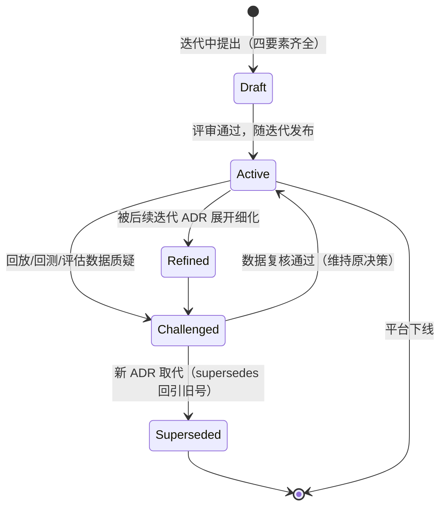
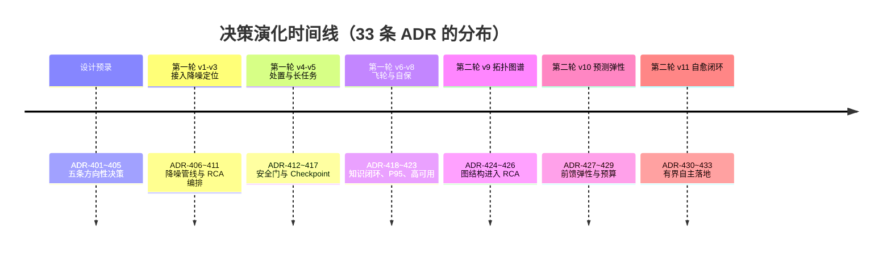
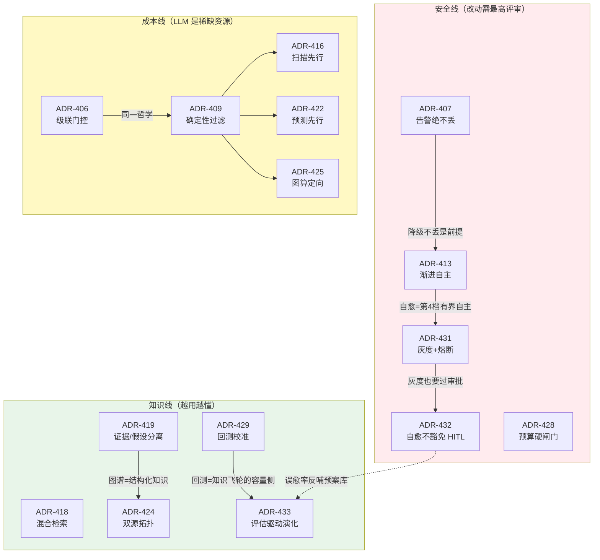

# 项目 09：智能运维 AIOps 平台 — 13-ADR架构决策记录

> **定位**：全项目决策资产篇——33 条 ADR（ADR-401~433）的总账、决策关系与演化时间线；对 11 条关键决策做"上下文 / 备选方案 / 取舍 / 可回滚性"四要素详解。读完本篇应能回答：这个平台**每个关键设计当初为什么这么选、放弃了什么、还能不能改回去**。方法论锚点：[附录 08-架构决策方法论 全篇]。
>
> 「遇到阻塞？→ [附录 08-架构决策方法论 全篇]、[教程 20-管控分离架构 §决策与治理]、[教程 43-Agent治理与合规框架 §行为审计]」

---

## 1. 四问

| 问 | 答 |
|----|----|
| **新增了什么需求** | ① ADR 总账：三轮演进（设计预录 → 第一轮八迭代 → 第二轮三迭代）的 33 条决策统一编号、按主题归类 ② 决策关系：哪些决策互相支撑、哪些互相约束（改动一个必须连带评估哪些）③ 关键决策详解：≥ 8 条按四要素展开 ④ ADR 维护规范：何时新增、何时标 superseded、谁来评审 |
| **影响了哪些模块** | 纯文档资产，无代码影响；后续任何迭代的架构变更以本篇为决策基线（新 ADR 编号从 434 顺延） |
| **架构如何演进** | 决策从"散落在各迭代篇末的表格"资产化为"可检索、可追溯、可回滚评估的总账"——这是平台进入成熟期的标志（改架构先查 ADR，而不是翻代码猜意图） |
| **上一版痛点是什么** | ① 决策散落 13 篇，回看"当初为什么"要全文检索 ② 决策之间的依赖关系隐性存在（动 ADR-407 必须连带评估 406/413/431），无人显式记录 ③ 预录决策（00 篇 ADR-401~405）与迭代决策（406+）的细化关系没有说明 |

## 2. ADR 的价值与生命周期

ADR（Architecture Decision Record）回答的是**代码回答不了的问题**：代码只记录"是什么"，ADR 记录"为什么、还考虑过什么、代价是什么"。对 AIOps 平台尤其重要——它的许多决策是**安全承诺**（告警绝不丢、自愈必过安全门），这些承诺一旦只存在于当时的对话与记忆里，就会在下一次重构中被无声地破坏。

| 阶段 | 动作 | 本项目对应 |
|------|------|-----------|
| 预录 | 架构设计期写下方向性决策（允许被后续迭代细化/推翻） | 00 篇 ADR-401~405 |
| 迭代 | 每迭代 2~3 条，决策与需求同篇（上下文天然完整） | 406~423（第一轮）、424~433（第二轮） |
| 细化 | 预录决策被迭代决策展开（不是推翻，是展开） | 401→406/407、403→412/413、404→415、405→418/419 |
| superseded | 显式标号不删除，留"决策曾存在"的证据 | 本项目暂无（33 条全部有效）；规范见 §7 |

ADR 自身的状态迁移（与 [附录 08-架构决策方法论 §ADR 生命周期] 对齐）：

**编号纪律**：ADR-401~405 是 00 篇预录、ADR-406 起按迭代顺延——预录与迭代编号**不重不跳**。读总账时若发现两条内容相近（如 401 与 406），那是"设计期方向 → 迭代期落地"的细化关系，不是重复错误。

## 3. ADR 总账（33 条）

### 3.1 设计预录（00 篇，架构方向）

| # | 决策（一句话） | 状态 |
|---|---------------|------|
| ADR-401 | 降噪三层流水线：确定性去重 → 语义聚类 → LLM 简报 | 有效，被 406/407 细化 |
| ADR-402 | RCA 用 trace_id 贯穿 + 多 Agent 编排 | 有效，被 409/410 细化 |
| ADR-403 | 处置按"可逆性×爆炸半径"分级，HITL 落在 ToolCallingManager | 有效，被 412/413 细化 |
| ADR-404 | 长任务用 Checkpoint 持久化断点 | 有效，被 415 细化 |
| ADR-405 | 知识飞轮混合检索 + citation + 证据/假设分离 | 有效，被 418/419 细化 |

### 3.2 第一轮八迭代（01~08 篇）

| # | 决策（一句话） | 出自 |
|---|---------------|------|
| ADR-406 | 三层降噪 + 级联门控（LLM 只收尾） | 02 |
| ADR-407 | LLM 降级必须放行告警（丢告警是确定性事故） | 02 |
| ADR-408 | 语义聚类 pgvector + 拓扑 label 近似 | 02 |
| ADR-409 | RCA 数据源全 @Tool 化 + Worker 确定性过滤 | 03 |
| ADR-410 | Supervisor 只融合不重分析 | 03 |
| ADR-411 | 处置建议必带 runbook citation | 03 |
| ADR-412 | 处置工具化 + ToolCallingManager 拦截 | 04 |
| ADR-413 | 渐进自主，默认停在"审批后执行" | 04 |
| ADR-414 | 审批拒绝后禁止重试（防绕过） | 04 |
| ADR-415 | 巡检用 Checkpoint；durable execution 记为演进方向 | 05 |
| ADR-416 | 巡检确定性扫描先行、LLM 只读结论 | 05 |
| ADR-417 | 巡检可中断 + 断点续跑 + 幂等，小时级而非天级 | 05 |
| ADR-418 | runbook 混合检索（FTS+向量+RRF）+ citation | 06 |
| ADR-419 | 证据与假设分离存储（防知识污染） | 06 |
| ADR-420 | 服务画像先行（记忆召回优于从零生成） | 06 |
| ADR-421 | 容量按 P95 置信上界配置 | 07 |
| ADR-422 | 确定性预测先行、LLM 只读解释 | 07 |
| ADR-423 | 预测算法按时间尺度选型 | 07 |

### 3.3 第二轮三迭代（10~12 篇）

| # | 决策（一句话） | 出自 |
|---|---------------|------|
| ADR-424 | 拓扑双源合成（CMDB 声明 ∪ OTel 观测），不一致标记不删除 | 10 |
| ADR-425 | 因果方向由"图上游+时间最早"确定性判定，LLM 只解释不定向 | 10 |
| ADR-426 | 图谱增量走变更事件、每夜对账兜底，无环为不变式 | 10 |
| ADR-427 | 预测前馈为主、HPA 反馈兜底的双层弹性 | 11 |
| ADR-428 | 扩容必过预算门，越界只预警不执行 | 11 |
| ADR-429 | 每个执行动作带 basis，周度回测 MAPE 驱动余量校准 | 11 |
| ADR-430 | 预案结构化：触发/前置/分级步骤/回滚四要素 | 12 |
| ADR-431 | 灰度自愈（爆炸半径 ≤ 1 实例）+ 一键熔断 | 12 |
| ADR-432 | 自愈不豁免 HITL：高危步骤必经 ToolCallingManager 安全门 | 12 |
| ADR-433 | 误愈率是自愈第一指标，评估驱动预案库演化 | 12 |

## 4. 决策时间线与关系

决策不是孤立的——三条"主线"把它们串成网：

**读法**：安全线（红）是**不可妥协层**——动其中任何一条必须连带评估其余四条（例如想放开 ADR-413 到全自主，必须先回答 ADR-431 的爆炸半径与 ADR-432 的 HITL 拿什么替代）；成本线（黄）是"确定性优先"哲学家族——五条决策是同一思想在不同环节的投影；知识线（绿）是飞轮家族——它们的共同点是"用可度量的反馈（检索命中/对账/回测/误愈率）驱动演化"。

## 5. 关键决策详解（上下文 / 备选 / 取舍 / 可回滚）

> 以下 11 条按"被问到的频率"排序详解。四要素：**上下文**（当时的约束与痛点）、**备选**（还考虑过什么）、**取舍**（选它的理由与付出的代价）、**可回滚**（改回去的代价与触发条件）。

### 5.1 ADR-407：LLM 降级必须放行告警

- **上下文**：v2 三层降噪中 L3 依赖 LLM 简报；LLM 是整条链路最不可靠的组件（限流/宕机/超时都家常便饭）。
- **备选**：① 降级即丢弃未简报的告警（等 LLM 恢复重放）② 降级放行原始告警（无简报）③ 降级走规则简报放行。
- **取舍**：选 ③。① 违反告警生命线（值班在降级窗口失明，是确定性事故）；② 降噪率归零但安全；③ 在 ② 的安全之上保住可读性。代价：规则简报质量粗糙（根因候选只有"最早告警"启发式）——但**粗糙是质量下降，丢失是安全事故**，两者不可比。
- **可回滚**：不可回滚（安全承诺，无适用场景）。若未来告警分级引入"可延迟告警"（如容量预警类），可为该子类改为 ① 的"暂存重放"——需新 ADR 明确分级清单。

### 5.2 ADR-412 + 413：HITL 落在 ToolCallingManager + 渐进自主

- **上下文**：v4 要把处置自动化；2025 年 AWS/Cloudflare 事故证明自动化会放大故障；处置动作是工具调用，不是 ChatClient 调用。
- **备选**：① HITL 写成 Advisor（环绕 ChatClient 边界）② HITL 写在工具方法内部（每个工具自己审批）③ ToolCallingManager 装饰器统一拦截 ④ 不做审批，靠 Prompt 约束模型"别做危险操作"。
- **取舍**：选 ③。① 拦不到"工具意图返回后、执行前"的时点（Advisor 看不到工具执行细节）；② 每个工具重复实现审批、漏一个就是绕过面；④ 是把安全交给概率（模型输出是请求不是授权）。代价：装饰器要处理与 Spring AI 自动配置的 Bean 替换（[04-迭代三 §4.6] 接线说明），版本升级时需回归验证。ADR-413 同场景下把默认档位停在"审批后执行"：第 4 档"有界自主"直到 v11 才以"灰度 + 熔断 + 可否决"的形态对少数预案开放（ADR-430/431/432 是它的准入条件）。
- **可回滚**：部分可回滚——自主档位可按预案逐个收回（预案 enabled=false 即回第 3 档）；审批拦截本身不可回滚。

### 5.3 ADR-415：长任务用 Checkpoint 而非 durable execution

- **上下文**：v5 巡检任务跑 30 分钟，进程重启即断；引入 Temporal 意味着新运行时、新运维面、团队学习成本。
- **备选**：① 只把状态落库、无恢复循环（"假 checkpoint"）② 自研完整恢复循环（教程 40 Checkpoint 机制）③ Temporal durable execution ④ 不做恢复，靠任务重跑。
- **取舍**：选 ②。① 崩溃后仍要人工干预（状态存了没人读）；④ 浪费已执行成本且长窗口任务重跑代价大；③ 最强但当前需求只有"本进程重启续跑"，为零外部依赖选择自研。代价：跨主机故障（Pod 漂移）时新实例需重新加载检查点续跑，恢复逻辑自己维护；任务若演进到跨服务编排，需升级 ③。
- **可回滚**：可平滑升级到 ③——检查点的字段设计（plan/completedSteps/budget/idempotencyKeys）与 Temporal 的事件历史语义同构，迁移是"换存储与调度器"，业务步骤不用重写。触发条件：出现跨主机自动恢复需求或巡检时长超小时级且频次密集。

### 5.4 ADR-419：证据与假设分离存储

- **上下文**：v6 postmortem 入库时，AI 生成的根因假设与人工确认的事实若混存，未经证实的假设会被后续 RAG 检索当成"已验证结论"，污染所有后续 RCA。
- **备选**：① 混存但假设加前缀标记（"【假设】..."）② 分字段存储（facts_json / hypotheses_json），检索只信 facts ③ AI 假设不入库。
- **取舍**：选 ②。① 依赖下游 Prompt 自觉过滤，一次改写就失效；③ 丢失假设的提示价值（假设常是下次故障的先验）。代价：检索管道要做双字段处理，简报里假设必须带"未验证"标注——多一层复杂度，换知识库的可信性。
- **可回滚**：不可回滚（知识污染是不可逆的——一条被当事实的假设会派生多条错误决策；事后清洗成本远高于事前分离）。

### 5.5 ADR-421 + 429：P95 配置容量 + 回测校准

- **上下文**：v7 容量预测若按均值配置，"平均 60% CPU、峰值 95%"的服务会撑爆；v10 弹性执行后预测错了会真实扩错容（花钱）。
- **备选**：均值 / P50 / P95 / P99 / max。执行侧：不做回测（预测一次管一季度）/ 周度回测。
- **取舍**：P95——P99 与 max 为极值过度配置（成本 +30% 以上），均值 P50 低估峰值；P95 是"不撑爆"与"不过度"的行业平衡点。代价：P95 仍略过度配置，这是容量治理允许的误差。ADR-429 补上执行侧闭环：每个扩容动作带 basis（预测依据），周度回测 MAPE 超 15% 自动加余量——**没有回测的预测是信仰**。
- **可回滚**：分位数可通过配置调整（水位线阈值是参数不是代码）；回测环不可关（关掉就回到"信仰模式"）。

### 5.6 ADR-424 + 425：双源拓扑 + 因果方向确定性

- **上下文**：v9 之前 RCA 用"最早告警"启发式定关注域，跨服务故障系统性指错；依赖数据散在 CMDB（会过期）与 OTel（有盲区）两处。
- **备选**：拓扑源——只信 CMDB / 只信 OTel / 双源并集。因果方向——LLM 判断 / 时间序启发式 / 图结构+时间序联合确定性打分。
- **取舍**：双源并集 + 不一致标记不删除（删错边 = 真实传播路径断链，宁可 stale 进周报人工裁决）；因果方向用确定性打分（共同祖先 +0.35、上游覆盖 +0.25、最早异常 +0.2、边权重 +0.2），LLM 只解释与找矛盾。代价：双源合成有对账成本；确定性打分的权重是拍定的初始值，需用回放集调参（v9 测试 5 的 50 起回放就是调参依据）。
- **可回滚**：可回滚到 v3 启发式（图不可用时 `infer()` 降级输出空候选，编排器回退"最早告警"）；权重可随回放集迭代修正。

### 5.7 ADR-427 + 428：前馈弹性 + 预算硬闸门

- **上下文**：HPA 反馈控制固有滞后 3-5 分钟，大促爬坡窗口被压垮；但预测若直接驱动扩容，"预测说扩 5 倍"可能把成本扩爆。
- **备选**：① 纯 HPA（现状）② 纯预测计划（废 HPA）③ 预测管基线 + HPA 管残差 ④ 预测建议无预算约束 ⑤ 预算越界自动否决。
- **取舍**：③+⑤。② 废掉反馈回路等于把可用性全押在预测准确率上（回测 MAPE 15% 意味着 1/7 的槽位不准）；① 慢半拍无解。预算不是参考值是硬闸门——越界动作降级为预警交人工（红水位线），宁可少扩，不可失控。
- **可回滚**：③ 可回退（把计划 actions 全部 disabled 即回纯 HPA）；⑤ 不可回滚（成本失控是双向事故：预算爆炸和容量爆炸同级）。

### 5.8 ADR-430~433：Playbook 四要素 + 灰度 + 不豁免 + 误愈率第一

- **上下文**：v11 把处置从"人驱动单步"升级为"故障驱动多步"；多步组合的整体风险高于单步之和（每步低危、组合可能高危）。
- **备选**：预案形态——自然语言 runbook 直接喂 LLM 执行 / 结构化 Playbook。安全——组合风险运行时判断 / 预案静态声明。评估——自愈成功率第一 / 误愈率第一。
- **取舍**：结构化 Playbook（前置检查防"错误前提下执行正确步骤"；风险在**编写时**由人审定并登记注册表，运行时只查表——运行时判断组合风险等于又把安全交给模型）；灰度爆炸半径 ≤ 1 实例 + 连续失败自动熔断（最坏情况可控）；误愈率第一（自愈价值排序：不添乱 > 快 > 自动——一次误愈摧毁的信任需要十次成功自愈挽回）。
- **可回滚**：预案可逐个下架（enabled=false 降级为"仅建议"）；kill switch 一键全局回退人工模式；"误愈率第一"的评估环不可拆（拆掉即失去预案库的演化依据）。

### 5.9 ADR-406 + 409 + 416 + 422：确定性优先家族（合并详解）

- **上下文**：告警每秒级、RCA 每次故障、巡检每天、容量每周——频次差异三个数量级，LLM 成本是硬约束。
- **备选**：每环节都让 LLM 全程参与（智能最大化）vs 确定性算法处理流量、LLM 只在"结论型/叙事型"环节出场。
- **取舍**：后者，且形成统一判据——**"可枚举的结构问题用代码，开放的叙事问题用 LLM"**：去重/聚类/异常检测/图定向/预测数值/打分排序全是代码；简报撰写/根因解释/异常摘要/容量报告全给 LLM 读过滤后的结论。代价：确定性算法有边界情况（恒值序列、冷启动数据不足），需要规则兜底；家族五成员共用同一降级模式（LLM 失败回退确定性输出，绝不阻塞主流程）。
- **可回滚**：单向演进——随着 LLM 成本下降与可靠性上升，个别环节（如 L2 聚类）可试点提升 LLM 占比，但"告警生命线相关环节的确定性兜底"不可撤（与 ADR-407 联动）。

### 5.10 ADR-410：Supervisor 只融合不重分析

- **上下文**：v3 多 Agent 编排里，Supervisor 拿到四路 Worker 证据后"重新分析一遍"的诱惑很大（显得更智能）。
- **备选**：Supervisor 重分析 / Supervisor 只做确定性融合排序 + LLM 叙事。
- **取舍**：后者。聚合 Agent 重分析会引入与 Worker 不一致的结论（同一份日志两个 Agent 两个判断），且把最贵的 LLM 调用放在了最不需要的位置。代价：Supervisor 的融合权重（Z 分、最早异常、慢 Span 计数）需要用回放集调参。
- **可回滚**：可回滚（编排器内部结构，不影响对外契约），但没有回滚的动机——这条是教训结晶。

### 5.11 ADR-414：审批拒绝后禁止重试

- **上下文**：审批流一旦允许 Agent 重试被拒动作，就存在"反复提交直到碰巧被批/审批人疲劳误批"的绕过面。
- **备选**：允许重试（换措辞再提）/ 拒绝后同动作同会话封禁 / 拒绝后全局封禁该动作直至人工解封。
- **取舍**：同动作同会话封禁（returnDirect=true 终止工具循环，拒绝原因回给模型但不允许再试）。更严的全局封禁会误伤"确实需要该动作的下一个独立故障"。代价：极少数情况下人工需重新发起会话——安全冗余可接受。
- **可回滚**：不可放宽（放宽即重开绕过面）；封禁粒度可在新 ADR 中讨论。

## 6. 决策密度与模式观察

| 模式 | 成员 | 一句话提炼 |
|------|------|-----------|
| **确定性优先** | 406/409/416/422/425 | 可枚举的结构问题用代码，开放的叙事问题用 LLM |
| **生命线 fail-open，底线 fail-close** | 407/413/428/431/432 | 告警路径任何故障都放行；审计/审批/预算路径任何故障都拒绝 |
| **反馈闭环** | 415(检查点)/418-420(飞轮)/429(回测)/433(评估) | 每个自动化能力必须自带"度量自己"的回路 |
| **渐进自主** | 413→430/431/432 | 自主性不是开关是阶梯；每上一档都要新增一层安全设施 |
| **知识可信性** | 419/424/411/418 | 假设不入事实、边不静默删、建议必带 citation |

**密度观察**：第一轮 18 条决策里 11 条与"安全/成本"相关（平台从 0 到 1 时风险最高）；第二轮 10 条里 7 条与"闭环/校准"相关（能力就位后，如何证明自己可信成为主要矛盾）——决策主题的迁移本身就是平台成熟度的刻度。

## 7. ADR 维护规范（本项目版）

1. **新增**：任何迭代的架构级变更先写 ADR（编号 434 顺延），四要素齐全（上下文/备选/取舍/可回滚），与迭代文档同篇发布。
2. **superseded**：推翻旧决策不删除不重号——新 ADR 引用旧号并标注 `supersedes ADR-4XX`，旧条目状态改"已被 X 取代"。决策的尸体也是资产（它记录了"那个方案为什么不行"）。
3. **联动评审**：改动安全线（407/413/428/431/432）任一条，评审必须覆盖其余四条——见 §4 关系图。
4. **预录与细化**：预录 ADR 被迭代细化时，在迭代 ADR 的"上下文"里回引预录号（本项目第一轮已隐式做到，第二轮起新决策需显式回引）。
5. **年度盘点**：每年随混沌演练（v8 制度）盘点一次——被回放/回测/评估数据挑战的决策进入修订队列，而非等事故倒逼。

## 8. 总结

33 条 ADR 的价值不在数量，在于**它们共同构成了平台的"决策免疫系统"**：新人接手时不靠口口相传（ADR 能回答"为什么"）；重构时不靠胆量（动安全线必须连带评审）；演进时不靠遗忘（superseded 留痕）。检验本篇的方式：随机挑一条 ADR，不看原文，只凭 §5 的四要素向同事讲清楚"它防的是什么事故"。

**下一篇**：决策资产盘点完，最后用 2026 年真实工业实践校准整个项目的方向——评估驱动、Agent 治理、记忆 TTL、模拟先行、长任务持久化的前沿映射与演进优先级。→ [14-工业前沿与演进方向.md](14-工业前沿与演进方向.md)
