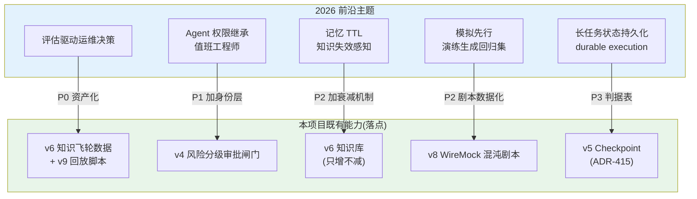
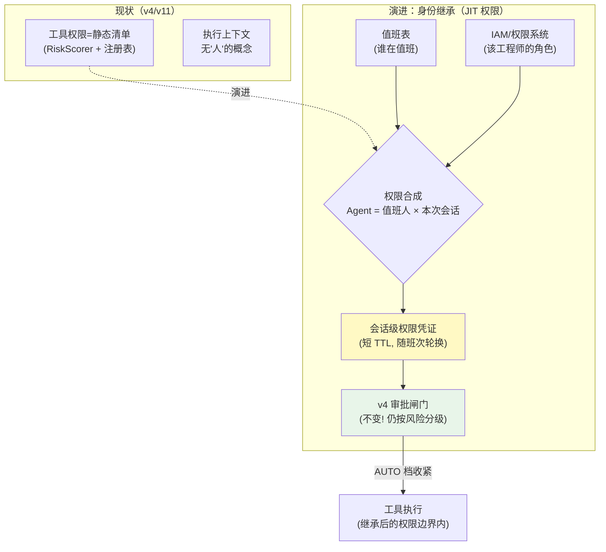
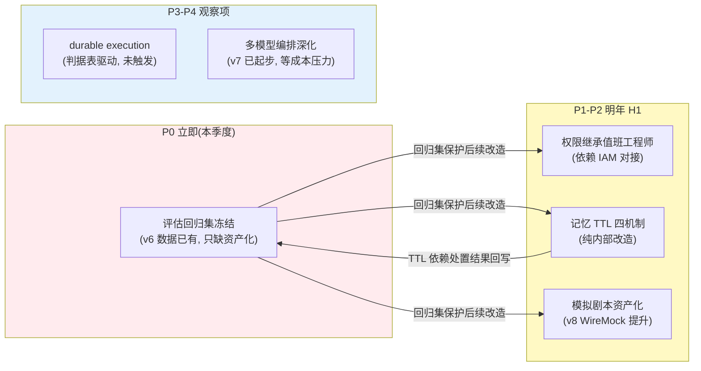

# 项目 09：智能运维 AIOps 平台 — 14-工业前沿与演进方向

> **定位**：收官篇——用 2026 年工业界关于"生产级 AI Agent"的真实工程文献（Google / Nebius / PagerDuty），校准本项目已建能力与行业前沿的差距，把五个前沿主题（评估驱动运维决策、Agent 级治理与权限继承、记忆 TTL 与知识失效、模拟先行、长任务状态持久化）映射为本平台的具体演进方向，最后以项目收官语收束。
>
> 「遇到阻塞？→ [教程 37-自我反思与Agent评估]、[教程 43-Agent治理与合规框架]、[教程 39-高级记忆架构 §记忆演化与衰减]、[教程 40-长任务持久化与中断恢复]」

---

## 1. 四问

| 问 | 答 |
|----|----|
| **新增了什么需求** | ① 用真实工业文献校准：本项目前 14 篇（00-13）建成的能力在 2026 生产级 Agent 工程的标准里处于什么位置 ② 五个前沿主题逐个映射到已有模块（映射表 + 演进动作）③ 演进优先级 P0~P4 与投入判断 ④ 收官自检清单 |
| **影响了哪些模块** | 纯方向篇，无代码；演进动作落到具体模块（评估集→v6 飞轮、权限继承→v4 审批、记忆 TTL→v6 知识库、模拟先行→v8 演练、长任务→v5 巡检） |
| **架构如何演进** | 不新增架构，而是给既有架构标注"前沿坐标"：哪些决策与行业共识一致（坚定）、哪些是行业已进一步而我们停在原地（演进）、哪些是我们的场景特有（保留） |
| **上一版痛点是什么** | ① 33 条 ADR 盘清了"我们为什么这么建"，但没回答"行业走到了哪" ② 演进方向散在各篇"痛点"段（图谱→弹性→自愈→ADR），缺一张带优先级的路线图 |

**参考来源**（均为 2026 年真实工程文献，规则 14 全量标注链接）：

| 来源 | 主题 | 链接 |
|------|------|------|
| Google Cloud（developers & practitioners） | 五篇构建与扩展生产级 AI Agent 指南 | https://cloud.google.com/blog/topics/developers-practitioners/five-guides-to-building-and-scaling-production-ready-ai-agents |
| Nebius | 生产级 Agent Blueprint（架构参考） | https://nebius.com/blog/posts/introducing-the-nebius-agents-blueprint |
| PagerDuty Engineering | 生产级 AI Agent：从想法到现实的差距 | https://www.pagerduty.com/eng/production-ai-agents-closing-the-gaps-between-idea-and-reality/ |

## 2. 共识校准：本项目站在哪

三家来源的公共结论，与本项目前 14 篇（00-13）的对照：

| 行业共识（三来源交叉印证） | 本项目对应 | 判定 |
|---------------------------|-----------|------|
| 生产级 Agent 的瓶颈不在模型能力，在评估、可观测与运维纪律 | v8 平台自观测 + v6 飞轮 + [13 篇] ADR 制度 | **一致** |
| 人工介入点（审批/确认）是架构组件不是流程约定 | v4 ToolCallingManager 审批闸门（ADR-412） | **一致** |
| 长任务必须有持久化状态与恢复机制 | v5 Checkpoint（ADR-415） | **一致**（跨主机 durable execution 停在演进方向，见 §7） |
| 危险动作需爆炸半径控制与一键停止 | v11 灰度自愈 + kill switch（ADR-431） | **一致** |
| Agent 权限应继承"人的最小权限"而非平台管理员 | v4 风险分级按动作粒度，**尚无"身份继承"概念** | **差距**（见 §4） |
| 知识/记忆需要失效管理（TTL、版本、衰减） | v6 知识库版本化（playbook version），**无 TTL/衰减** | **差距**（见 §5） |
| 评估集先于能力扩展（eval-driven） | v6 飞轮有采集、**无独立回归评估集** | **差距**（见 §3） |

结论：**安全与可靠性主线我们与前沿同频；差距集中在"评估、身份、记忆失效"三个治理深水区**——恰好都是"能力建完之后"才暴露的问题，与 [13 篇 §6] 的决策密度观察（第二轮主题转向闭环/校准）互相印证。

五个前沿主题与既有模块的映射关系：

**读法**：五个主题**没有一个是推倒重来**——每个都挂在既有模块上加一层（资产化/身份/衰减/数据化/判据）。这正是两轮演进积累的架构红利：能力分层清晰，前沿差距以"增量"而非"重构"的形态出现。

## 3. 前沿主题一：评估驱动的运维决策（eval-driven ops）

Google 五指南与 PagerDuty 都强调：**没有评估集的 Agent 能力不敢上生产，也不敢改**——改一版 Prompt、换一个模型，怎么知道 RCA 变好还是变坏？本项目现状：v6 飞轮采集了 postmortem/incident 数据，v9 用 50 起回放调过图权重，但回放集是**一次性脚本**，不是持续运行的回归资产。

**演进动作（P0，最高优先）**：

1. **冻结回归集**：从 v6 `postmortem` 抽取"症状 → 确认根因"对，构成只增不减的回归集（每起新复盘自动追加）；改 Prompt/模型/图权重前先跑回归。
2. **指标口径统一**：RCA top-1 准确率 / 降噪归簇率 / 自愈误愈率三个核心指标进同一张周报——对应 [13 篇] 知识线 ADR-429/433 的推广。
3. **用官方 Evaluator 体系**：Spring AI 2.0 有真实 Evaluator API（`RelevancyEvaluator`/`FactCheckingEvaluator`，[附录 05-SpringAI2-API基准 §17]），简报质量评估可基于它自写 Judge，而非裸 Prompt。

这与 [教程 37-自我反思与Agent评估] 的"在线监控 + 离线评估闭环"完全同构——AIOps 平台自己就是第一个该被评估的 Agent 系统。

## 4. 前沿主题二：Agent 级治理——运维 Agent 权限继承值班工程师

PagerDuty 的生产实践指向一个具体模型：**运维 Agent 的权限不应是"平台给的一组静态工具权限"，而应继承当前值班工程师的权限范围**——Agent 在夜里 3 点能做的事 = 值班工程师本人此刻被授权能做的事，不多也不少。这解决了两个矛盾：工具权限写死则权限随人员变动而腐化；权限全开则 Agent 比任何人都大（违反最小权限）。

**演进动作（P1）**：会话建立时读值班表 + IAM 合成"Agent 即值班人"的会话权限（换班自动轮换）；审批闸门**不变**——继承的是"能做什么"的上界，高危动作仍走 HITL（ADR-432 与本主题正交：权限继承解决"范围"，审批解决"时机"）。实现依赖企业 IAM（spring-security 体系，本地未下载相关 jar，**需引入依赖后 javap 实证**），锚点 [教程 31-安全与权限控制]、[教程 43-Agent治理与合规框架 §权限模型]。

## 5. 前沿主题三：记忆 TTL——运维知识失效感知

运维知识的**半衰期极短**：半年前的扩容 runbook 可能因服务改架构而完全失效，但向量库里它依然"高相似度"地被检索出来。三家来源都提到 memory/knowledge 的生命周期管理。本项目现状：v6 知识库只增不减（playbook 有 version 但无退役机制），**检索不区分"三年前的经验"与"上周的经验"**。

**演进动作（P2）**——把 [教程 39-高级记忆架构 §记忆演化与衰减] 落到知识库：

| 机制 | 规则 | 落点 |
|------|------|------|
| 复核 TTL | runbook 超过 180 天未被复核 → 标记 `stale`，检索时降权并提示"请核实" | `RunbookIndex.hybridSearch` 排序项 |
| 引用衰减 | 被引用命中且处置成功的 runbook TTL 重置；连续误召回的进淘汰队列 | 处置结果回写（v11 healing_session 关联） |
| 架构变更失效 | v9 拓扑对账发现服务依赖大改 → 该服务相关 runbook 批量标 `stale` | `TopologySyncScheduler.nightlyReconcile` 联动 |
| 事实固化 | 复核确认有效的经验升级为 `verified`（永不过期，直到被 superseded） | 与 ADR-419 证据/假设分离衔接 |

注意方向：**TTL 不是删除是降权**——与 ADR-424"不一致标记不删除"同一哲学：宁可提示"可能过期"，不可静默丢知识。

## 6. 前沿主题四：模拟先行——故障演练生成回归集

Google 指南强调 Agent 系统要有可重复的测试环境；对 AIOps 更进一步的做法是**"模拟先行"：每次真实故障与演练，除了验证降级矩阵，还应沉淀为可重放的模拟剧本**——形成"故障 → 模拟案例 → 回归集"的飞轮，与 v6 知识飞轮并列成"能力飞轮"。

**演进动作（P2）**：v8 混沌演练的 WireMock 剧本（A-D）从测试代码提升为**数据化的剧本资产**（scenario JSON：注入什么告警、期待什么根因/简报/自愈结果）；每起真实故障复盘后自动生成 scenario 入库。评估集（§3）与模拟剧本（§6）合流：**回归 = 用剧本重放，断言用评估集口径**。这直接复用 v8 的 WireMock 依赖与 v11 的 healing_session 断言，边际成本低。

## 7. 前沿主题五：长任务状态持久化——durable execution 的转正时机

v5（ADR-415）把 Temporal 类 durable execution 记为"生产演进方向"，判据是模糊的"出现跨主机需求时"。Nebius blueprint 把长任务状态持久化列为生产级 Agent 的标配组件之一——行业在往前走，本项目需要**明确的转正判据**而非感觉：

| 判据 | 阈值 | 现状 |
|------|------|------|
| 巡检任务跨主机存活需求 | Pod 漂移/节点维护导致巡检中断月均 ≥ 2 次 | 当前单进程重启可恢复，未达 |
| 任务时长与频次 | 小时级任务 × 每日多次 × 多集群 | 30 分钟 × 每日 1 轮，未达 |
| 跨服务编排 | 自愈链路需等待外部系统（工单/审批/供应商）小时级回调 | v11 观察窗 5 分钟，未达 |
| 团队运维能力 | 愿意承担新运行时的运维面 | 12 人团队，紧 |

**结论（P3）**：三条技术判据均未触发，**维持 ADR-415 不变**；但第 3 条正在接近——若自愈预案出现"等工单系统回调"类步骤（真实运维常见），先把该类等待改造为 v5 的"挂起持久化"（检查点保存等待状态，教程 40 机制），仍不引入外部运行时。把这个判据表写进 ADR-415 的修订（[13 篇] §5.3 已预留"触发条件"字段）。

## 8. 演进优先级与投入判断

**投入判断**：P0 几乎零新代码（数据与口径已存在，缺的是"资产化"动作）却保护所有后续改造——这是全表性价比最高的一项，先做；P1 依赖企业 IAM 对接节奏，外部依赖最强，早立项晚交付；P3-P4 明确"不做什么"（durable execution 未触发不做、多模型编排无成本压力不深化）——**演进路线里"暂不"与"要做"同等重要**（与 ADR-415 的可回滚设计一脉相承）。

## 9. 收官自检清单（对照三来源的生产级标准）

| # | 自检项 | 本项目答案 |
|---|--------|-----------|
| 1 | 你的 Agent 系统有评估集吗？改 Prompt 敢不敢先跑回归？ | 部分（回放用过、未资产化）→ P0 |
| 2 | 危险动作的审批是架构强制还是流程约定？ | 架构强制（ToolCallingManager，ADR-412） |
| 3 | 长任务崩溃后能恢复吗？判据是什么？ | 能（Checkpoint）；durable execution 判据表已立（§7） |
| 4 | Agent 的权限边界随人员/组织变化自动更新吗？ | 否 → P1 |
| 5 | 知识会过期吗？过期了系统知道吗？ | 会过期、系统不知道 → P2 |
| 6 | 每次故障让系统变强了吗？度量是什么？ | 知识侧是（v6 飞轮）；能力侧（模拟剧本）→ P2 |
| 7 | 平台自己挂了，业务会怎么样？ | 告警零丢失（v8 降级矩阵 + 季度演练） |
| 8 | 每个架构决策能回答"为什么、备选、代价、可回滚"吗？ | 能（33 条 ADR，[13 篇]） |

八问中五问已有确定答案、三问有明确演进项——这就是"生产级"与"能跑"的区别：**不是没有缺口，而是每个缺口都有编号、优先级和判据**。

## 10. 总结（项目 09 收官）

十五篇走完，项目 09 的完整弧线是两轮演进：**第一轮（v1-v8）**接入 → 降噪 → 定位 → 处置 → 巡检 → 学习 → 预测 → 自保，把"值班工程师的一天"逐步装进平台，落成三层降噪、多 Agent RCA、ToolCallingManager 审批闸门、Checkpoint 巡检、证据/假设分离的知识飞轮与告警生命线降级矩阵；**第二轮（v9-v11）**图谱 → 弹性 → 自愈，把第一轮"看得准、处置得对"的能力推向"因果在图上推理、容量在峰前就位、预案在灰度里执行"的自治深水区；再加决策资产（[13 篇]，33 条 ADR）与前沿校准（本篇），构成从 demo 到生产级 AIOps 平台的完整决策史。

最有复用价值的五条：ADR-407（告警是生命线，降级只降质量不丢数据）、ADR-413+432（渐进自主，自愈不豁免 HITL）、ADR-415（Checkpoint 够用先跑，durable execution 判据化）、ADR-419（证据与假设分离，知识不自我污染）、ADR-425（因果方向是结构问题，确定性代码优先于 LLM 判断）。检验你是否真正吸收了本项目：拿这五条向同事各讲三分钟"它防的是什么事故、代价是什么、什么时候可以改回去"——讲得清，你就不是"用过 AIOps 工具"，而是"能设计 AIOps 平台"。

项目 09 至此完结。
