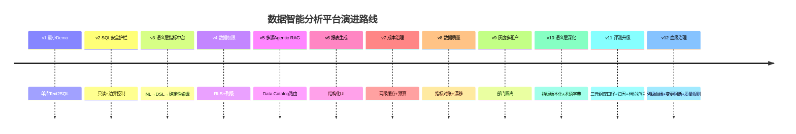
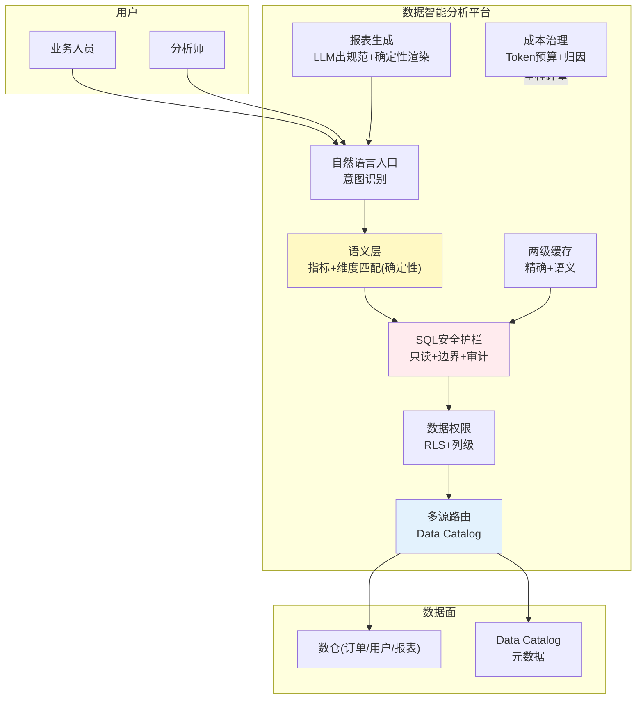

# 项目 10：数据智能分析平台 — 00-需求分析与架构设计

> **定位**：本文是项目 10 的起点——一个「**自然语言查数 → 安全可审计 → 口径统一 → 权限可控 → 报表交付 → 成本可治理**」的企业级自助数据智能分析平台。项目 10 是**完整独立**的项目，不依赖也不引用其他项目。**本项目的核心使命：把教程 01-WebFlux与响应式编程/03-Sinks详解（结构化输出）、35（Agentic RAG）、26（数据权限）、31（安全）、27（成本治理）在"数据分析"这个企业 AI 落地最普遍的场景落地。** 全部代码为**完整可手写**（一行不省略），由你照抄手写（项目规范不生成 .java 文件）。
>
> 「遇到阻塞？→ [教程 02-SpringAI核心机制/03-结构化输出]、[教程 08-架构师进阶/01-高级RAG与AgenticRAG]、[教程 04-企业级架构主干/06-多租户隔离与资源治理 §数据权限]、[教程 04-企业级架构主干/11-安全与权限控制 §SQL 注入]、[教程 04-企业级架构主干/07-成本治理与Token计量]；API 真实性以 [附录 05-SpringAI2-API基准] 为准」

---

## ★ 阅读顺序总览（序号 = 你的实际阅读顺序）

> 本子文件夹 16 个文件，**文件名编号 00-15 即阅读顺序**。按"全貌 → 主体迭代 → 主体收口 → 进阶迭代 → 支撑 → 前沿"组织，每文件标注读者应在什么阶段读：

| 阶段 | 文件 | 读者定位 |
|------|------|---------|
| ① 全貌 | 00-需求分析与架构设计 | **先读**：目标架构、演进路线、量化验收、基线依赖 |
| ② 主体迭代 | 01~09（最小Demo + 迭代一~八） | **严格顺序**：能查→安全→准确→隔离→会选→好看→省钱→可信→可治理——每迭代先跑测试再进下一步 |
| ③ 主体收口 | 10-核心代码讲解 | **回顾**：九个迭代的关键代码索引与六个关键设计复盘 |
| ④ 进阶迭代 | 11~13（语义层深化 / 评测护栏升级 / 血缘治理） | **深化**：口径体系化、评测归因闭环、变更影响雷达——读完 10 后按序深入 |
| ⑤ 支撑 | 14-ADR架构决策记录 | **按需查阅**：42+ 条决策的上下文/备选/取舍/回滚——改架构前必查 |
| ⑥ 前沿 | 15-工业前沿与演进方向 | **扩展**：2026 前沿对齐与 v13 起演进路线，收官篇 |

> 按此顺序，读者从"知道平台长什么样"一路演进到"能照着搭到生产、并知道每个决策为什么"。**序号即学习顺序**（目录结构铁律）。

---

## 1. 业务场景

### 1.1 背景

某企业有 200+ 张业务表、3 个数仓（订单/用户/报表），数据分析团队 8 人每天被 200+ 个取数需求淹没，业务人员排队等数据：

| 痛点 | 数据 |
|------|------|
| **取数靠人肉** | 业务提需求 → 数据分析师写 SQL → 排队 1-3 天 |
| **口径不一** | "GMV"在 7 个报表里有 3 种算法（含税/不含税/退款后） |
| **权限难控** | 直接给业务只读账号，无法做行级/列级隔离 |
| **成本失控** | LLM 调用与全表扫描无预算，一次大查询跑半小时 |
| **结果不可信** | 纯 Text2SQL 黑盒，无法追溯匹配了哪些表和列 |

### 1.2 项目目标

1. **自然语言查数**：业务人员输入问题 → 生成可执行 SQL（经安全护栏）→ 返回结果 + 依据
2. **指标口径统一**：语义层/指标中台，覆盖的问题准确率趋近 100%（确定性编译，非 LLM 猜）
3. **数据权限**：行级 RLS + 列级脱敏 + 角色数据可见性
4. **多源路由**：Agent 决策查哪个库，跨库关联用预定义 join 图
5. **报表生成**：LLM 产结构化 JSON（chart spec + 叙事），确定性渲染 ECharts
6. **成本治理**：两级缓存 + Token 预算 + 按租户归因

### 1.3 非目标

- 不做数据仓库本身（数仓已存在，本项目消费）
- 不做写入型 BI（只读分析）
- 不做告警推送（那是运维，非本项目）

### 1.4 本节核对（业务场景）

- [ ] 五个痛点（取数/口径/权限/成本/可信）每个都能对应到后文一个迭代（v1/v3/v4/v7/v12）
- [ ] 六条项目目标均落在 §3 目标架构图中的某个组件上，无"图外目标"
- [ ] 三条非目标与六条目标无重叠（如"不做写入型 BI"与"自然语言查数"只读边界一致）

## 2. 演进路线

> 核心纪律：**禁止一上来给最终版架构。** 每个迭代由真实痛点驱动，回答四问。



**顺序理由**：

| 顺序 | 决策理由 | 反面 |
|------|---------|------|
| 安全护栏在语义层前 | 没护栏就上 AI 查数=裸奔；护栏是查数能上线的底线 | 先语义层——无护栏的 Text2SQL 不敢给业务用 |
| 语义层在权限前 | 先统一口径，再谈谁能看；语义层定义"什么是可查询的" | 先权限——口径乱+权限也控不住"查错" |
| 权限在多源前 | 权限是数据访问的统一框架，多源复用 | 先多源——跨库时权限规则要重设计 |
| 成本治理在报表后 | 报表生成是最耗 LLM 的环节，成本压力在它上线后浮现 | 先成本——报表还没用上，预算对象不明确 |
| 灰度/多租户最后 | 平台稳定后才有部门隔离与灰度需求 | 先灰度——平台还在演进，灰度的对象天天变 |

### 2.1 本节核对（演进路线）

- [ ] timeline 中 v1~v12 与子文件夹文件 01~13 一一对应（01→v1，……，13→v12）
- [ ] 五条"顺序理由"的反面列各自成立——若某反面成立而无理由覆盖，说明顺序论证有缺口
- [ ] 无跳级：每个 vN 的前置痛点都在 v(N-1) 篇末"痛点"节出现

## 3. 目标架构（v9 终态预览）



**核心定位**：NL→语义层 DSL→**确定性 SQL 编译**（杜绝 join 幻觉）；LLM 只做"意图→指标选择题"，SQL 由规则引擎生成。

> 本图是 v9 迭代终态；v10~v12 进阶篇（11~13）不改变该数据面拓扑，深化的是治理资产——指标版本化/术语字典（11）、评测归因与档位护栏（12）、列级血缘与质量规则（13）。

### 3.1 本节核对（目标架构）

- [ ] 架构图八个平台组件与 §1.2 六条目标对应（NL/SEM↔目标1-2、PERM↔目标3、ROUTE↔目标4、RPT↔目标5、CACHE/COST↔目标6、SEC↔目标2 前置）
- [ ] "确定性编译"核心定位与 ADR-501 表述一致（LLM 选指标，SQL 由规则引擎生成）
- [ ] 数据面只有 DW 与 Catalog，无任何写入路径（与"只读分析"非目标一致）

## 4. 关键 ADR（预录）

| # | 决策 | 理由 |
|---|------|------|
| ADR-501 | 首选 NL→语义层 DSL→确定性编译，ad hoc 才走直生 Text2SQL | 语义层把"生成 SQL"（开放空间易幻觉）压缩为"选指标选维度"（封闭选择题难错）；覆盖问题准确率趋近 100% |
| ADR-502 | SQL 安全在 DB 层（只读角色+RLS+列权限+只读副本），不在 prompt 层 | prompt 指令无法实施访问控制，只有存储层能 |
| ADR-503 | 多源路由先查 Data Catalog 元数据再查数据 | 路由决策必须 grounded in governed metadata，非手写 docstring |
| ADR-504 | 报表 LLM 产结构化 JSON（chart spec+叙事），Java 确定性渲染 | Composability 原则：LLM 出规范、确定性模块做统计真值 |
| ADR-505 | 两级缓存 + Token 预算 BUDGET_EXCEEDED | 语义缓存降延迟/省 token；成本是硬约束 |

### 4.1 本节核对（关键 ADR 预录）

- [ ] ADR-501~505 各在后续迭代篇正文实现（501→03、502→02/04、503→05、504→06、505→07），与 14-ADR 篇的决策索引可互查
- [ ] 每条 ADR 的"理由"都能反驳一个备选方案（如 502 反驳 prompt 层管控）

## 5. 技术栈与依赖（项目基线）

基线：Spring Boot 4.1 + Spring AI 2.0 + WebFlux + Java 21。数据库 PostgreSQL（只读副本 + RLS + pgvector）。报表前端 ECharts。各迭代新依赖按规范标注「需在 pom.xml 中添加依赖」并给出完整 `<dependency>` 片段。

### 5.1 `pom.xml`（v1 基线，后续迭代只增不改）

```xml
<?xml version="1.0" encoding="UTF-8"?>
<project xmlns="http://maven.apache.org/POM/4.0.0"
         xmlns:xsi="http://www.w3.org/2001/XMLSchema-instance"
         xsi:schemaLocation="http://maven.apache.org/POM/4.0.0 https://maven.apache.org/xsd/maven-4.0.0.xsd">
    <modelVersion>4.0.0</modelVersion>
    <parent>
        <groupId>org.springframework.boot</groupId>
        <artifactId>spring-boot-starter-parent</artifactId>
        <version>4.1.0</version>
        <relativePath/>
    </parent>
    <groupId>com.group</groupId>
    <artifactId>data-intelligence-platform</artifactId>
    <version>0.1.0</version>
    <name>data-intelligence-platform</name>

    <properties>
        <java.version>21</java.version>
    </properties>

    <dependencyManagement>
        <dependencies>
            <dependency>
                <groupId>org.springframework.ai</groupId>
                <artifactId>spring-ai-bom</artifactId>
                <version>2.0.0</version>
                <type>pom</type>
                <scope>import</scope>
            </dependency>
        </dependencies>
    </dependencyManagement>

    <dependencies>
        <dependency>
            <groupId>org.springframework.boot</groupId>
            <artifactId>spring-boot-starter-webflux</artifactId>
        </dependency>
        <dependency>
            <groupId>org.springframework.ai</groupId>
            <artifactId>spring-ai-starter-model-openai</artifactId>
        </dependency>
        <dependency>
            <groupId>org.springframework.boot</groupId>
            <artifactId>spring-boot-starter-jdbc</artifactId>
        </dependency>
        <dependency>
            <groupId>org.postgresql</groupId>
            <artifactId>postgresql</artifactId>
            <scope>runtime</scope>
        </dependency>
        <dependency>
            <groupId>org.projectlombok</groupId>
            <artifactId>lombok</artifactId>
            <optional>true</optional>
        </dependency>
        <dependency>
            <groupId>org.springframework.boot</groupId>
            <artifactId>spring-boot-starter-test</artifactId>
            <scope>test</scope>
        </dependency>
    </dependencies>
</project>
```

### 5.2 配置文件（v1 基线，两段式：application.yaml + application-datainsight.yaml）

**① `src/main/resources/application.yaml`**（只放骨架：环境文件导入 + 激活 profile，业务配置不写在这里）：

```yaml
spring:
  application:
    name: data-intelligence-platform
  config:
    import: optional:file:.env[.properties]   # 密钥等敏感配置从 .env 读，不落仓库
  profiles:
    active: datainsight                       # 默认激活 datainsight（本项目的唯一 profile）
```

**② `src/main/resources/application-datainsight.yaml`**（业务配置，profile 专属）：

```yaml
spring:
  ai:
    openai:
      base-url: https://api.deepseek.com          # DeepSeek 兼容 OpenAI 协议
      api-key: ${DEEPSEEK_API_KEY}                # .env 提供，不落明文
      chat:
        model: deepseek-chat          # Spring AI 2.0.0：无 options 中缀，参数直挂
  datasource:
    url: jdbc:postgresql://replica.internal:5432/data_warehouse   # 只读副本，主库不暴露给 AI 查询
    username: ${DB_READONLY_USER}                 # v1 用 ai_analyst，v2 换 ai_analyst_readonly
    password: ${DB_READONLY_PASSWORD}
    hikari:
      maximum-pool-size: 20
      connection-timeout: 5000
server:
  port: 8081                        # 本项目基准端口（单体；后续如拆服务按端口矩阵另分配）
```

### 5.3 本节测试与验证（v1 基线工程可编译可启动）

**前置条件**：JDK 21、Maven、可达的 PostgreSQL 只读副本；`DEEPSEEK_API_KEY`/`DB_READONLY_USER`/`DB_READONLY_PASSWORD` 已导出。

**步骤与断言**：

| # | 操作 | 预期（PASS 判据） |
|---|------|------------------|
| 1 | 把 §5.1 的 `pom.xml`、§5.2 的 `application.yml` 放入新工程，`mvn clean verify` | 编译通过，BOM 解析出 Spring AI 2.0.0，无依赖冲突 |
| 2 | `mvn spring-boot:run -Dspring-boot.run.profiles=datainsight` | 应用启动到 8081，无密钥占位符解析失败（`${DEEPSEEK_API_KEY}` 未导出会启动报错，属预期防线） |
| 3 | 核对连接 | 启动日志无 Hikari 连接失败（`connection-timeout: 5000` 生效） |

**失败排查**：① BOM 版本解析失败→检查 `spring-ai-bom 2.0.0` 是否在本地仓库（`/Volumes/data/software/maven/repository`）；② 启动即密钥报错→环境变量未导出；③ Hikari 超时→只读副本地址/账号不通。

## 6. 迭代与教程知识点对照

| 迭代 | 落地的教程知识 |
|------|---------------|
| 01 Text2SQL | [教程 02-SpringAI核心机制/03-结构化输出 §entity]、[教程 00-基础与核心/05-RAG检索增强生成 §2] |
| 02 SQL 护栏 | [教程 04-企业级架构主干/11-安全与权限控制 §SQL 注入]、[教程 04-企业级架构主干/06-多租户隔离与资源治理 §RLS] |
| 03 语义层 | [教程 08-架构师进阶/01-高级RAG与AgenticRAG §Agentic 检索]、[教程 02-SpringAI核心机制/03-结构化输出 §entity] |
| 04 数据权限 | [教程 04-企业级架构主干/06-多租户隔离与资源治理 §数据层隔离]、[教程 08-架构师进阶/08-响应式错误处理 §Context 传递] |
| 05 多源 | [教程 08-架构师进阶/01-高级RAG与AgenticRAG §Agentic 检索] |
| 06 报表 | [教程 02-SpringAI核心机制/03-结构化输出]、[附录 13-Agent交互设计] |
| 07 成本 | [教程 04-企业级架构主干/07-成本治理与Token计量]、[附录 09-语义缓存与性能] |
| 08 数据质量 | [教程 08-架构师进阶/03-自我反思与Agent评估]、[教程 08-架构师进阶/07-数据飞轮与持续改进] |
| 09 灰度多租户 | [教程 04-企业级架构主干/09-灰度发布与版本管理]、[教程 04-企业级架构主干/06-多租户隔离与资源治理 §多租户] |
| 10 语义层深化 | [教程 08-架构师进阶/01-高级RAG与AgenticRAG]、[教程 04-企业级架构主干/09-灰度发布与版本管理 §版本门禁]、[教程 00-基础与核心/05-RAG检索增强生成 §2] |
| 11 评测护栏升级 | [教程 08-架构师进阶/03-自我反思与Agent评估]、[教程 08-架构师进阶/07-数据飞轮与持续改进]、[附录 04-测试策略/02-Eval评估] |
| 12 血缘治理 | [教程 04-企业级架构主干/08-Human-in-the-Loop与审批流 §审批触发]、[教程 04-企业级架构主干/05-历史记录持久化与合规]、[附录 06-企业级架构模式] |

### 6.1 本节核对（知识点对照）

- [ ] 12 个迭代每一行至少引用 1 个真实存在的教程/附录篇目，锚点章节号不越界
- [ ] 无重复覆盖冲突：同一教程章节被多个迭代引用时，引用的角度不同（如教程 05-Observation可观测/02-组件交互：Registry、Handler、Convention、Filter协作 在 03/05/10 分别承担语义匹配/Agentic 检索/版本门禁）

## 7. 下一步

→ [01-最小Demo搭建.md](01-最小Demo搭建.md) — 不是数仓的复刻，而是把"自然语言→SQL→结果"跑通的最小内核（单库只读）。

---

## 8. 代码使用说明（照抄前必读）

本项目的代码遵循「项目文档不生成 .java 文件、代码由用户手写」的规范，但**代码全部为完整可手写形态**：

1. **框架 API 全部真实**：Spring AI 2.0.0 的 `ChatClient`/`@Tool`/`CallAdvisor`/`entity()` 等均按 [附录 05-SpringAI2-API基准] 的真实签名书写，**每个 Java 类含全部 import、无 `...` 省略，可照抄编译**。
2. **自定义业务类是完整骨架**：`SqlGuardrail`、`MetricSemanticLayer`、`DataCatalogRouter` 等为本项目专属业务类，给出完整类定义（含构造注入与关键方法实现）；个别"业务取数逻辑"（如具体 join 路径）标注 TODO 由你按业务补全——这正是学习目标。
3. **依赖标注**：凡引入 pom.xml 未声明的新依赖，均标注「需在 pom.xml 中添加依赖」并给出完整 `<dependency>` 片段。
4. **WebFlux 一致性**：所有代码遵循响应式铁律（Reactor Context 传请求上下文、禁 ThreadLocal、EventLoop 上禁 block、Redis 用 ReactiveRedisTemplate）；阻塞 JDBC 调用一律 `subscribeOn(Schedulers.boundedElastic())`。
5. **演进式阅读**：每个迭代篇都从"上一版痛点"出发，回答四问，请按 `00 → 01 → 02 → ...` 顺序阅读，不要跳读最终版。

### 8.1 本节核对（代码使用说明）

- [ ] 后续任意迭代篇抽 1 个 Java 类：含全部 import、无 `...` 省略、阻塞 JDBC 均包 `subscribeOn(Schedulers.boundedElastic())`
- [ ] 抽 1 处新依赖：文档确实标注「需在 pom.xml 中添加依赖」并附完整 `<dependency>` 片段，且未声称已改 pom.xml

> **定位回顾**：本文定义「为什么建这个项目、基线依赖长什么样、往哪演进」。接下来从 [01-最小Demo搭建] 开始，先让查数链路立住。
