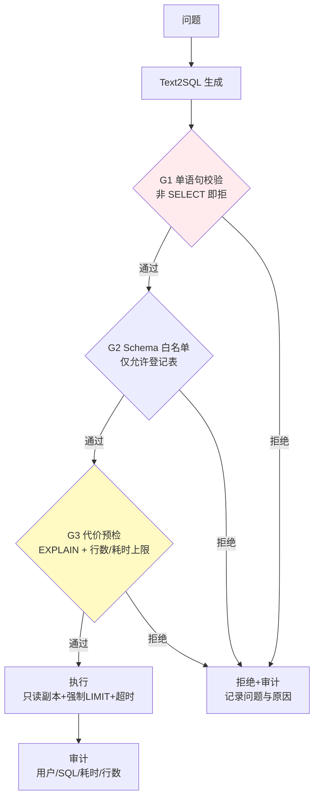

# 项目 10：数据智能分析平台 — 02-迭代一：SQL 安全护栏

> **定位**：给 Text2SQL 加"护栏"——数据库层强制（只读角色 + 单语句校验 + 边界控制）+ 查询层兜底（超时/LIMIT/EXPLAIN 预检）。**核心原则：安全在 DB 层，不在 prompt 层**（prompt 指令无法实施访问控制）。教程 25 §SQL 注入防御 + 教程 20 §RLS 的落地。本文给出**完整可手写代码**（一行不省略）。
>
> 「遇到阻塞？→ [教程 31-安全与权限控制 §SQL 注入]、[教程 26-多租户隔离与资源治理 §数据层隔离]」

---

## 1. 四问

| 问 | 答 |
|----|----|
| **新增了什么需求** | SQL 网关（拦截校验层）；只读数据库角色（DB 层强制）；查询边界（超时/行数/代价上限）；审计日志 |
| **影响了哪些模块** | 新增 `SqlGuardrail`（查询网关层）+ `QueryGuardService`（执行前预检 + 执行兜底）；`SqlExecutor` 被网关接管；DB 侧配置只读角色/RLS |
| **架构如何演进** | v1 的直生链路不变，但执行前插入护栏链：`validate → ensureLimit → explainCost → execute → audit` |
| **上一版痛点是什么** | ① SQL 裸奔（注入/全表扫描/超时都可能）② Schema 全量注入 token 爆炸 ③ 黑盒不可信 |

**v1 痛点 → 本迭代对策**：

| v1 痛点 | 本次迭代对策 |
|---------|-------------|
| SQL 注入/全表扫描/超时 | 数据库层：只读角色 + 单语句校验 + statement timeout + 强制 LIMIT |
| Schema 全量注入 token 爆炸 | Schema 裁剪：按问题相关表检索（schema linking 起步） |
| 黑盒不可信 | 带 SQL 溯源 + EXPLAIN 预检（执行前评估代价） |

## 2. 目标与量化验收

| # | 验收项 | 标准 |
|---|--------|------|
| 1 | 注入阻断 | `SELECT 1; DROP TABLE` 类多语句 100% 拒绝；非 SELECT 100% 拒绝 |
| 2 | 全表扫描 | 无 LIMIT 查询自动加 LIMIT；EXPLAIN 代价超限拒绝 |
| 3 | 强制只读 | DB 层验证：AI 账号无法 INSERT/UPDATE/DELETE（绕过应用也失败） |
| 4 | 超时兜底 | 慢查询 10s 超时终止，不占资源 |
| 5 | 审计完整 | 所有查询（含拒绝）入审计库，可追溯 |
| 6 | 延迟影响 | 护栏新增 P99 延迟 < 100ms（解析+EXPLAIN 代价可控） |

## 3. 安全护栏分层



**分层原则**：数据库层（只读角色/RLS/列权限）是**强制边界**（prompt 注入也绕不过）；查询层（单语句校验/EXPLAIN/超时/LIMIT）是**成本与风险控制**。

## 4. 完整代码（照抄即可，一行不省略）

### 4.1 需在 pom.xml 中添加依赖

```xml
<!-- SQL 语法级解析（真实坐标 com.github.jsqlparser） -->
<dependency>
    <groupId>com.github.jsqlparser</groupId>
    <artifactId>jsqlparser</artifactId>
    <version>4.9</version>
</dependency>
```

### 4.2 `UserContext.java`（共享请求上下文，v2 起引入）

```java
package com.group.dataplat.dto;

/** 请求上下文：用户 / 租户 / 角色 / 数据区域（v4 扩展 region）。 */
public record UserContext(String userId, String tenantId, String role, String region) {}
```

### 4.3 `SqlVerdict.java`

```java
package com.group.dataplat.security;

/** 护栏判定结果：allow / reject(reason)。 */
public record SqlVerdict(boolean allowed, String reason) {

    public static SqlVerdict allow() {
        return new SqlVerdict(true, null);
    }

    public static SqlVerdict reject(String reason) {
        return new SqlVerdict(false, reason);
    }
}
```

### 4.4 `SqlGuardrail.java`（语法级校验：单语句 + 只读 + 危险函数）

```java
package com.group.dataplat.security;

import net.sf.jsqlparser.expression.ExpressionVisitorAdapter;
import net.sf.jsqlparser.expression.Function;
import net.sf.jsqlparser.parser.CCJSqlParserUtil;
import net.sf.jsqlparser.parser.JSQLParserException;
import net.sf.jsqlparser.statement.Statement;
import net.sf.jsqlparser.statement.Statements;
import net.sf.jsqlparser.statement.select.PlainSelect;
import net.sf.jsqlparser.statement.select.Select;
import net.sf.jsqlparser.statement.select.SelectVisitorAdapter;
import org.springframework.stereotype.Component;

import java.util.ArrayList;
import java.util.List;
import java.util.Locale;
import java.util.Set;

/**
 * 语法级 SQL 护栏（真实 JSqlParser 4.9）。
 * 正则黑名单可被编码绕过；语法级解析才能识别 "SELECT 1; DROP TABLE" 多语句注入。
 */
@Component
public class SqlGuardrail {

    /** 危险函数/关键字（pg_sleep 拖垮 DB、COPY 读写文件、存储过程调用等）。 */
    private static final Set<String> FORBIDDEN = Set.of(
            "PG_SLEEP", "BENCHMARK", "XP_CMDSHELL", "PG_READ_FILE", "PG_LS_DIR",
            "LO_IMPORT", "COPY", "CALL", "EXEC", "EXECUTE");

    public SqlVerdict validate(String sql) {
        try {
            // parseStatements 解析全部语句——多语句注入才能被发现
            Statements statements = CCJSqlParserUtil.parseStatements(sql);
            if (statements.size() != 1) {
                return SqlVerdict.reject("仅允许单条语句（检测到 " + statements.size() + " 条）");
            }
            Statement stmt = statements.get(0);
            if (!(stmt instanceof Select)) {
                return SqlVerdict.reject("仅允许 SELECT 查询");
            }
            List<String> forbidden = findForbiddenFunctions((Select) stmt);
            if (!forbidden.isEmpty()) {
                return SqlVerdict.reject("检测到危险函数/关键字: " + forbidden);
            }
            return SqlVerdict.allow();
        } catch (JSQLParserException e) {
            return SqlVerdict.reject("SQL 解析失败: " + e.getMessage());
        }
    }

    /** 遍历 where/having/join 中的表达式，收集命中黑名单的函数名。 */
    private List<String> findForbiddenFunctions(Select select) {
        List<String> found = new ArrayList<>();
        ExpressionVisitorAdapter exprVisitor = new ExpressionVisitorAdapter() {
            @Override
            public void visit(Function function) {
                String name = function.getName() == null ? ""
                        : function.getName().toUpperCase(Locale.ROOT);
                if (FORBIDDEN.contains(name)) {
                    found.add(name);
                }
                super.visit(function);
            }
        };
        select.getSelectBody().accept(new SelectVisitorAdapter() {
            @Override
            public void visit(PlainSelect plainSelect) {
                if (plainSelect.getWhere() != null) {
                    plainSelect.getWhere().accept(exprVisitor);
                }
                if (plainSelect.getHaving() != null) {
                    plainSelect.getHaving().accept(exprVisitor);
                }
            }
        });
        return found;
    }
}
```

### 4.5 `AuditOutcome.java` + `PlanCost.java` + 异常（承载类）

```java
package com.group.dataplat.service;

/** 审计结果：行数 / 耗时 / 拒绝原因（拒绝时 reason 非空）。 */
public record AuditOutcome(int rowCount, long durationMs, String rejectionReason) {}
```

```java
package com.group.dataplat.service;

/** EXPLAIN 预检结果。 */
public record PlanCost(long estimatedRows, long estimatedCost) {}
```

```java
package com.group.dataplat.service;

/** 被护栏拒绝（单语句/只读/危险函数）。 */
public class SqlRejectedException extends RuntimeException {
    public SqlRejectedException(String reason) {
        super("SQL 被护栏拒绝: " + reason);
    }
}
```

```java
package com.group.dataplat.service;

/** 查询代价超限（EXPLAIN 预检拒绝）。 */
public class QueryTooExpensiveException extends RuntimeException {

    private final PlanCost cost;

    public QueryTooExpensiveException(PlanCost cost) {
        super("查询代价超限: " + cost);
        this.cost = cost;
    }

    public PlanCost cost() {
        return cost;
    }
}
```

### 4.6 `AuditStore.java`（全量查询审计）

```java
package com.group.dataplat.service;

import com.group.dataplat.dto.UserContext;
import org.springframework.jdbc.core.simple.JdbcClient;
import org.springframework.stereotype.Service;

import java.time.Instant;
import java.util.UUID;

/**
 * 全量查询日志：用户 + SQL + 耗时 + 行数 + 拒绝原因。
 */
@Service
public class AuditStore {

    private final JdbcClient jdbcClient;

    public AuditStore(JdbcClient jdbcClient) {
        this.jdbcClient = jdbcClient;
    }

    public void record(UserContext user, String sql, AuditOutcome outcome) {
        jdbcClient.sql("""
                INSERT INTO query_audit(id, user_id, tenant_id, sql_text, row_count,
                                        duration_ms, rejection_reason, occurred_at)
                VALUES (:id, :userId, :tenantId, :sql, :rows, :duration, :reason, :at)
                """)
                .param("id", UUID.randomUUID().toString())
                .param("userId", user.userId())
                .param("tenantId", user.tenantId())
                .param("sql", sql)
                .param("rows", outcome.rowCount())
                .param("duration", outcome.durationMs())
                .param("reason", outcome.rejectionReason())
                .param("at", Instant.now())
                .update();
    }
}
```

### 4.7 `QueryGuardService.java`（护栏链编排：校验 → LIMIT → EXPLAIN → 执行 → 审计）

```java
package com.group.dataplat.service;

import com.group.dataplat.dto.QueryResult;
import com.group.dataplat.dto.UserContext;
import com.group.dataplat.security.SqlGuardrail;
import com.group.dataplat.security.SqlVerdict;
import org.springframework.jdbc.core.JdbcTemplate;
import org.springframework.stereotype.Service;
import reactor.core.publisher.Mono;
import reactor.core.scheduler.Schedulers;

import java.time.Duration;
import java.util.List;
import java.util.Map;
import java.util.regex.Pattern;

/**
 * 查询网关：把 v1 的裸执行升级为"多层边界"。
 * ① 语法级校验 → ② 强制 LIMIT → ③ EXPLAIN 预检 → ④ 执行 + 超时 → ⑤ 审计。
 * 注意：JDBC 阻塞 API，整体 subscribeOn(boundedElastic)——EventLoop 上禁 block。
 */
@Service
public class QueryGuardService {

    private static final int MAX_ROWS = 1000;
    private static final long MAX_COST = 1_000_000L;
    private static final Duration TIMEOUT = Duration.ofSeconds(10);

    /** 已有显式 LIMIT 则不再追加（粗判，细判交给语法层）。 */
    private static final Pattern HAS_LIMIT =
            Pattern.compile("\\blimit\\s+\\d+\\s*$", Pattern.CASE_INSENSITIVE);

    private final SqlGuardrail guardrail;
    private final JdbcTemplate jdbcTemplate;
    private final AuditStore auditStore;

    public QueryGuardService(SqlGuardrail guardrail,
                             JdbcTemplate jdbcTemplate,
                             AuditStore auditStore) {
        this.guardrail = guardrail;
        this.jdbcTemplate = jdbcTemplate;
        this.auditStore = auditStore;
    }

    public Mono<QueryResult> guardedExecute(String sql, UserContext user) {
        // ① 语法级校验（单语句 + 只读 + 危险函数）
        SqlVerdict verdict = guardrail.validate(sql);
        if (!verdict.allowed()) {
            auditStore.record(user, sql, new AuditOutcome(0, 0, verdict.reason()));
            return Mono.error(new SqlRejectedException(verdict.reason()));
        }

        // ② 强制 LIMIT（防全表扫描）
        String limited = ensureLimit(sql, MAX_ROWS);

        return Mono.fromCallable(() -> {
            // ③ EXPLAIN 预检：评估代价，超阈值拒绝
            PlanCost cost = explainCost(limited);
            if (cost.estimatedRows() > MAX_ROWS || cost.estimatedCost() > MAX_COST) {
                auditStore.record(user, sql, new AuditOutcome(0, 0, "代价超限: " + cost));
                throw new QueryTooExpensiveException(cost);
            }
            // ④ 执行（只读副本 + statement timeout 兜底）
            long start = System.currentTimeMillis();
            List<Map<String, Object>> rows = jdbcTemplate.queryForList(limited);
            long durationMs = System.currentTimeMillis() - start;
            auditStore.record(user, sql, new AuditOutcome(rows.size(), durationMs, null));
            return new QueryResult(rows, limited, rows.size(), durationMs);
        }).timeout(TIMEOUT).subscribeOn(Schedulers.boundedElastic());
    }

    private String ensureLimit(String sql, int maxRows) {
        if (HAS_LIMIT.matcher(sql).find()) {
            return sql;
        }
        return sql + " LIMIT " + maxRows;
    }

    /** 解析 PG EXPLAIN 首行提取 rows=/cost=。 */
    private PlanCost explainCost(String sql) {
        List<Map<String, Object>> plan = jdbcTemplate.queryForList("EXPLAIN " + sql);
        String first = String.valueOf(plan.get(0).values().iterator().next());
        return new PlanCost(extractLong(first, "rows="), extractLong(first, "cost="));
    }

    private long extractLong(String text, String key) {
        int idx = text.indexOf(key);
        if (idx < 0) {
            return 0;
        }
        int i = idx + key.length();
        StringBuilder num = new StringBuilder();
        while (i < text.length() && (Character.isDigit(text.charAt(i)) || text.charAt(i) == '.')) {
            num.append(text.charAt(i));
            i++;
        }
        return num.isEmpty() ? 0 : (long) Double.parseDouble(num.toString());
    }
}
```

### 4.8 数据库层强制边界（不只是应用层）`db/schema-v2.sql`

```sql
-- ① 只读角色：业务查询账号仅 SELECT（非 superuser 不可绕过）
CREATE ROLE ai_analyst_readonly;
GRANT CONNECT ON DATABASE data_warehouse TO ai_analyst_readonly;
GRANT USAGE ON SCHEMA public TO ai_analyst_readonly;
GRANT SELECT ON ALL TABLES IN SCHEMA public TO ai_analyst_readonly;
ALTER DEFAULT PRIVILEGES IN SCHEMA public GRANT SELECT ON TABLES TO ai_analyst_readonly;
REVOKE ALL ON SCHEMA public FROM ai_analyst_readonly;   -- 最小权限

-- ② 行级安全（v4 完善，此处启用框架）——prompt 注入也绕不过
ALTER TABLE orders ENABLE ROW LEVEL SECURITY;

-- ③ 审计表
CREATE TABLE IF NOT EXISTS query_audit (
    id               VARCHAR(36) PRIMARY KEY,
    user_id          VARCHAR(64)   NOT NULL,
    tenant_id        VARCHAR(64)   NOT NULL,
    sql_text         TEXT          NOT NULL,
    row_count        INT           NOT NULL DEFAULT 0,
    duration_ms      BIGINT        NOT NULL DEFAULT 0,
    rejection_reason TEXT,
    occurred_at      TIMESTAMPTZ   NOT NULL
);
CREATE INDEX IF NOT EXISTS idx_query_audit_at ON query_audit(occurred_at);
```

> 连接只读物理副本（replica），主库不暴露给 AI 查询——写入结构性不可能（最强边界）。

### 4.9 接入点：`TextToSqlService` 改用网关

```java
// TextToSqlService 改造（v2）：
// ① 注入 QueryGuardService，删除直接持有的 SqlExecutor
// ② ask() 尾部从 sqlExecutor.execute(...) 改为 guardService.guardedExecute(...)
public Mono<QueryResult> ask(String question, UserContext user) {
    String schema = schemaProvider.loadSchema();
    return Mono.fromCallable(() -> chatClient.prompt()
            .system("""
                    你是数据分析助手。根据给定数据库 Schema，将自然语言问题转为 SQL。
                    规则：
                    1. 只输出 SQL，不输出解释
                    2. 只允许 SELECT 查询
                    3. 表名/列名必须严格来自 Schema，不得臆造
                    4. 不确定的字段归入 missing_fields
                    """)
            .user("问题：" + question + "\n\nSchema:\n" + schema)
            .call()
            .entity(GeneratedSql.class))
        .subscribeOn(Schedulers.boundedElastic())
        .flatMap(generated -> guardService.guardedExecute(generated.sql(), user));
}
```

## 5. ADR 演进决策

| # | 决策 | 理由 |
|---|------|------|
| ADR-506 | 安全在 DB 层（只读角色+RLS+只读副本） | prompt 指令无法实施访问控制，只有存储层能 |
| ADR-507 | 语法级校验（JSqlParser `parseStatements`）而非正则 | 正则黑名单可被编码绕过；语法级能识别多语句注入 |
| ADR-508 | 强制 LIMIT + EXPLAIN 预检 + 超时 | 多层边界：防注入、防全表扫描、防慢查询 |

## 6. v2 的痛点（驱动下一迭代）

护栏把查询"锁住了"，但业务反馈：**"问'这个月 GMV 多少'，10 个分析师可能给出 10 种 SQL"**——口径不一（含税/不含税/退款后）导致结果不可比。而且每次都要描述完整口径很累。**需要一个"指标语义层"统一口径**。→ [03-迭代二-语义层与指标中台.md](03-迭代二-语义层与指标中台.md)
