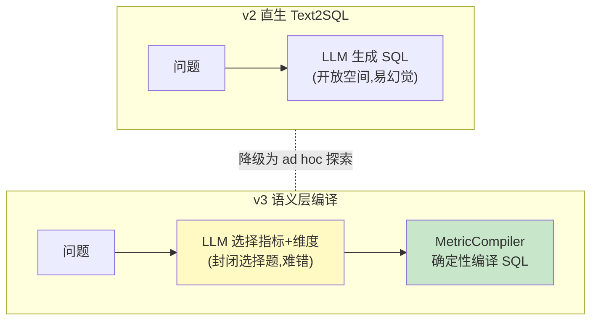

# 项目 10：数据智能分析平台 — 03-语义层与指标中台

> **定位**：把"Text2SQL 猜口径"升级为"NL→语义层 DSL→确定性 SQL 编译"——指标口径统一，覆盖的问题准确率趋近 100%。**这是本项目区别于"套壳 Text2SQL"的核心架构决策。** 教程 05-Observation可观测/02-组件交互：Registry、Handler、Convention、Filter协作 §Agentic 检索 + 教程 01-WebFlux与响应式编程/03-Sinks详解 §结构化输出的落地。本文给出**完整可手写代码**（一行不省略）。
>
> 「遇到阻塞？→ [教程 08-架构师进阶/01-高级RAG与AgenticRAG §Agentic 检索]、[教程 02-SpringAI核心机制/03-结构化输出]、[附录 01-LLM基础理论/02-上下文窗口与Token]」

---

## 1. 四问

| 问 | 答 |
|----|----|
| **新增了什么需求** | 指标中台（原子指标/派生指标分层管理）；NL→DSL 编译（确定性）；指标字典 RAG（few-shot 案例库）；未命中降级 |
| **影响了哪些模块** | 新增 `MetricRegistry`（指标字典）+ `JoinGraph`（预定义 join 图）+ `MetricCompiler`（确定性 SQL 编译）+ `SemanticLayerService`；直生 Text2SQL 降级为 ad hoc 探索路径 |
| **架构如何演进** | v1/v2 的"问题→SQL"直生拆为两条路：命中语义层→确定性编译（高准确）；未命中→ad hoc 直生（带 v2 护栏） |
| **上一版痛点是什么** | ① 口径不一（GMV 有 3 种算法）② 每次问"GMV"都要描述口径 ③ join 幻觉/表选错 |

**v2 痛点 → 本迭代对策**：

| v2 痛点 | 本次迭代对策 |
|---------|-------------|
| 口径不一（GMV 有 3 种算法） | 指标字典：统一指标定义与算法 |
| 每次问"GMV"都要描述口径 | LLM 只做"意图→指标+维度"选择题，SQL 确定性编译 |
| join 幻觉/表选错 | 语义层预定义 join 图，不让 LLM 现场 join |

> **本节核对（四问一句话）**：四个新增模块与 §4 一一对应（4.2 Registry/4.3 JoinGraph/4.5 Compiler/4.6 门面）；三条 v2 痛点均有对策。

## 2. 目标与量化验收

| # | 验收项 | 标准 |
|---|--------|------|
| 1 | 指标准确 | 语义层覆盖的问题准确率 ≥ 95%（对照人工标注 200 问） |
| 2 | 口径统一 | 同一指标不同问法返回一致结果（"GMV"与"本月GMV"） |
| 3 | join 正确 | 跨表查询 100% 走预定义 join 图（无 LLM 现场 join） |
| 4 | 覆盖降级 | 语义层未命中自动降级 ad hoc（带护栏），不报错 |
| 5 | 成本下降 | 语义层路径 LLM Token 比直生 SQL 降 ≥ 40%（选择题 vs 生成题） |

## 3. 语义层 vs 直生 Text2SQL

> **为什么语义层是正解**：语义层基准证明加 4KB 语义层文档 → 准确率 +17~23pp，且模型差异几乎无统计显著，**语义层有无才是主导变量**；ad hoc 用 Text2SQL，准确性至上的企业用语义层。LLM 从"生成 SQL"（开放空间，易幻觉）降为"选指标选维度"（封闭选择题，难错）。



### 3.1 本节核对（语义层 vs 直生）

- [ ] 图中 OLD 路径与 §4.6 的降级分支（`textToSqlService.ask`）对应，NEW 路径与 `deterministicExecute` 对应
- [ ] "开放空间 vs 封闭选择题"的表述与 ADR-509 一致，无第三个路径漏画

## 4. 完整代码（照抄即可，一行不省略）

### 4.1 `MetricDefinition.java`（指标字典的"真相源"）

```java
package com.group.dataplat.semantic;

import java.util.List;

/**
 * 指标中台：原子指标 + 派生指标分层管理。
 * expr 为确定性聚合表达式；filter 为指标级固定过滤（口径的一部分，不允许业务绕过）。
 */
public record MetricDefinition(
        String id,                 // "gmv"
        String name,               // "GMV"
        String definition,         // 口径: 支付成功订单的实付金额合计（不含退款）
        String expr,               // 确定性表达式: SUM(pay_amount)
        String filter,             // 固定过滤: status = 'paid'（可空）
        List<String> dimensionIds, // 可下钻维度: [date, channel, region]
        String rootTable,          // 主表: orders
        String timeColumn          // 时间列: order_date
) {}
```

### 4.2 `MetricRegistry.java`（指标字典注册表）

```java
package com.group.dataplat.semantic;

import org.springframework.stereotype.Component;

import java.util.LinkedHashMap;
import java.util.List;
import java.util.Map;

/**
 * 指标字典——分析师维护的"真相源"。
 * v3 先用内存注册表，v8 迁数据库 + 灰度版本（部门级指标集）。
 */
@Component
public class MetricRegistry {

    private final Map<String, MetricDefinition> metrics = new LinkedHashMap<>();

    public MetricRegistry() {
        register(new MetricDefinition(
                "gmv", "GMV", "支付成功订单的实付金额合计（不含退款）",
                "SUM(pay_amount)", "status = 'paid'",
                List.of("date", "channel", "region"), "orders", "order_date"));
        register(new MetricDefinition(
                "order_count", "订单数", "支付成功的订单数量",
                "COUNT(*)", "status = 'paid'",
                List.of("date", "channel", "region"), "orders", "order_date"));
        register(new MetricDefinition(
                "active_users", "活跃用户数", "当日有支付行为的去重用户数",
                "COUNT(DISTINCT user_id)", null,
                List.of("date"), "orders", "order_date"));
    }

    public void register(MetricDefinition def) {
        metrics.put(def.id(), def);
    }

    public MetricDefinition get(String id) {
        return metrics.get(id);
    }

    public List<MetricDefinition> all() {
        return List.copyOf(metrics.values());
    }
}
```

### 4.3 `JoinGraph.java`（预定义 join 图，跨表关联唯一路径）

```java
package com.group.dataplat.semantic;

import org.springframework.stereotype.Component;

import java.util.LinkedHashMap;
import java.util.Map;

/**
 * 预定义 join 图——分析师维护一次，"JOIN 逻辑从 LLM 任务中彻底剥离"。
 * key: "rootTable:dimensionId" → 维度引用（所属表.列 + 关联主表的 join 子句）。
 * 主表自身列 joinClause 为 null；跨表维度携带 LEFT JOIN。
 */
@Component
public class JoinGraph {

    private final Map<String, DimensionRef> dimensions = new LinkedHashMap<>();

    public record DimensionRef(String table, String column, String joinClause) {}

    public JoinGraph() {
        // orders 主表自身的列（无需 join）
        dimensions.put("orders:date",    new DimensionRef("orders", "order_date", null));
        dimensions.put("orders:channel", new DimensionRef("orders", "channel", null));
        dimensions.put("orders:region",  new DimensionRef("orders", "region", null));
        // customers 维度需要 join：orders.user_id = customers.customer_id
        dimensions.put("orders:customer_name", new DimensionRef("customers", "name",
                "LEFT JOIN customers ON orders.user_id = customers.customer_id"));
    }

    public record QualifiedColumn(String qualifiedColumn, String joinClause) {}

    /** 沿 join 图解析维度列；不在图内直接抛异常（杜绝 LLM 现场 join）。 */
    public QualifiedColumn resolve(MetricDefinition metric, String dimensionId) {
        DimensionRef ref = dimensions.get(metric.rootTable() + ":" + dimensionId);
        if (ref == null) {
            throw new IllegalArgumentException("维度不在 join 图内: " + dimensionId);
        }
        return new QualifiedColumn(ref.table() + "." + ref.column(), ref.joinClause());
    }
}
```

### 4.4 `MetricIntent.java`（LLM 的封闭选择题输出）

```java
package com.group.dataplat.semantic;

import java.util.List;

/**
 * LLM 输出封闭的指标选择（不是 SQL！）。
 * confidence < 阈值时降级 ad hoc——选择题也不是 100% 可靠。
 */
public record MetricIntent(
        String metricId,                        // 选中的指标（来自指标字典）
        List<DimensionChoice> dimensions,       // 选中的维度 + 筛选值
        String timeRange,                       // 时间范围 YYYY-MM-DD..YYYY-MM-DD
        double confidence                       // 命中置信度 0~1
) {}

public record DimensionChoice(String dimensionId, String filterValue) {}
```

### 4.5 `MetricCompiler.java`（确定性 SQL 编译 + 参数绑定防注入）

```java
package com.group.dataplat.semantic;

import org.springframework.stereotype.Component;

import java.util.ArrayList;
import java.util.List;

/**
 * 语义层 DSL → SQL 的确定性编译（规则引擎，非 LLM）。
 * 核心纪律：跨表关联走预定义 join 图；筛选值一律参数绑定（杜绝字符串拼接注入）。
 */
@Component
public class MetricCompiler {

    private final MetricRegistry metricRegistry;
    private final JoinGraph joinGraph;

    public MetricCompiler(MetricRegistry metricRegistry, JoinGraph joinGraph) {
        this.metricRegistry = metricRegistry;
        this.joinGraph = joinGraph;
    }

    /** 编译结果：SQL + 预编译参数（执行层用 PreparedStatement 绑定）。 */
    public record CompileResult(String sql, List<Object> params) {}

    public CompileResult compile(MetricIntent intent) {
        MetricDefinition metric = metricRegistry.get(intent.metricId());
        if (metric == null) {
            throw new IllegalArgumentException("未知指标: " + intent.metricId());
        }

        List<Object> params = new ArrayList<>();
        List<String> groupBy = new ArrayList<>();
        List<String> joins = new ArrayList<>();
        List<String> conds = new ArrayList<>();

        // 指标级固定过滤（口径的一部分）
        if (metric.filter() != null) {
            conds.add(metric.filter());
        }

        // 维度 + 筛选（白名单校验：必须走 join 图，防注入）
        for (DimensionChoice dim : intent.dimensions()) {
            JoinGraph.QualifiedColumn qc = joinGraph.resolve(metric, dim.dimensionId());
            groupBy.add(qc.qualifiedColumn());
            if (qc.joinClause() != null) {
                joins.add(qc.joinClause());
            }
            if (dim.filterValue() != null && !dim.filterValue().isBlank()) {
                conds.add(qc.qualifiedColumn() + " = ?");
                params.add(dim.filterValue());
            }
        }

        // 时间范围（参数绑定，不做字符串拼接）
        if (intent.timeRange() != null && !intent.timeRange().isBlank()) {
            String[] parts = intent.timeRange().split("\\.\\.");
            if (parts.length == 2) {
                // 参数绑定：日期字符串由 PG 按列类型（date）隐式转换，不用 DATE 关键字拼参数（DATE ? 非法语法）
                conds.add(metric.timeColumn() + " BETWEEN ? AND ?");
                params.add(parts[0].trim());
                params.add(parts[1].trim());
            }
        }

        StringBuilder sql = new StringBuilder("SELECT ").append(metric.expr());
        if (!groupBy.isEmpty()) {
            sql.append(", ").append(String.join(", ", groupBy));
        }
        sql.append(" FROM ").append(metric.rootTable());
        if (!joins.isEmpty()) {
            sql.append(" ").append(String.join(" ", joins));
        }
        if (!conds.isEmpty()) {
            sql.append(" WHERE ").append(String.join(" AND ", conds));
        }
        if (!groupBy.isEmpty()) {
            sql.append(" GROUP BY ").append(String.join(", ", groupBy));
        }
        sql.append(" LIMIT 1000");

        return new CompileResult(sql.toString(), List.copyOf(params));
    }
}
```

**为什么不让 LLM join**：跨表关联是 SQL 幻觉的重灾区（fan-out 膨胀/笛卡尔积/错选 join 策略）。语义层用**预定义 join 图**——分析师维护一次，"JOIN 逻辑从 LLM 任务中彻底剥离"。

### 4.6 `SemanticLayerService.java`（NL→选择题→编译→执行；未命中降级）

```java
package com.group.dataplat.semantic;

import com.group.dataplat.dto.QueryResult;
import com.group.dataplat.dto.UserContext;
import com.group.dataplat.service.TextToSqlService;
import org.springframework.ai.chat.client.ChatClient;
import org.springframework.jdbc.core.JdbcTemplate;
import org.springframework.stereotype.Service;
import reactor.core.publisher.Mono;
import reactor.core.scheduler.Schedulers;

import java.util.List;
import java.util.Map;

/**
 * 语义层门面：命中指标字典 → 确定性编译（高准确）；未命中 → 降级 ad hoc（v2 护栏保护）。
 */
@Service
public class SemanticLayerService {

    private static final double CONFIDENCE_THRESHOLD = 0.8;

    private final ChatClient chatClient;
    private final MetricRegistry metricRegistry;
    private final MetricCompiler metricCompiler;
    private final JdbcTemplate jdbcTemplate;
    private final TextToSqlService textToSqlService;

    public SemanticLayerService(ChatClient chatClient,
                                MetricRegistry metricRegistry,
                                MetricCompiler metricCompiler,
                                JdbcTemplate jdbcTemplate,
                                TextToSqlService textToSqlService) {
        this.chatClient = chatClient;
        this.metricRegistry = metricRegistry;
        this.metricCompiler = metricCompiler;
        this.jdbcTemplate = jdbcTemplate;
        this.textToSqlService = textToSqlService;
    }

    public Mono<QueryResult> answer(String question, UserContext user) {
        return resolveIntent(question).flatMap(intent ->
                intent.confidence() > CONFIDENCE_THRESHOLD
                        ? deterministicExecute(intent)          // 语义层路径
                        : textToSqlService.ask(question, user)  // 直生降级（v2 护栏保护）
        );
    }

    /** LLM 只做"选择题"：从指标字典中选指标 + 维度 + 时间范围（不是生成 SQL）。 */
    private Mono<MetricIntent> resolveIntent(String question) {
        List<MetricDefinition> catalog = metricRegistry.all();
        return Mono.fromCallable(() -> chatClient.prompt()
                .system("""
                    根据指标字典，将问题映射为指标选择。只从给定指标字典中选，不臆造指标。
                    输出 JSON：metricId + dimensions(含可选 filterValue) + timeRange + confidence。
                    指标歧义时选择默认口径并降低 confidence。
                    时间范围格式：YYYY-MM-DD..YYYY-MM-DD。
                    """)
                .user("问题：" + question + "\n\n指标字典：\n" + toCatalogPrompt(catalog))
                .call()
                .entity(MetricIntent.class))     // 真实重载 entity(Class)，附录 05-02 §2
            .subscribeOn(Schedulers.boundedElastic());
    }

    private Mono<QueryResult> deterministicExecute(MetricIntent intent) {
        MetricCompiler.CompileResult compiled = metricCompiler.compile(intent);
        return Mono.fromCallable(() -> {
            long start = System.currentTimeMillis();
            List<Map<String, Object>> rows = jdbcTemplate.queryForList(
                    compiled.sql(), compiled.params().toArray());
            long durationMs = System.currentTimeMillis() - start;
            return new QueryResult(rows, compiled.sql(), rows.size(), durationMs);
        }).subscribeOn(Schedulers.boundedElastic());
    }

    private String toCatalogPrompt(List<MetricDefinition> catalog) {
        StringBuilder sb = new StringBuilder();
        for (MetricDefinition m : catalog) {
            sb.append("- ").append(m.id()).append(": ").append(m.name())
              .append("（").append(m.definition()).append("），可下钻: ")
              .append(m.dimensionIds()).append('\n');
        }
        return sb.toString();
    }
}
```

### 4.7 本节测试与验证（语义层编译与降级）

**前置条件**：[02 §4.11] 已通过；`MetricRegistry` 三个指标（gmv/order_count/active_users）已注册；种子数据仍是 [01 §3.10] 的 4 单（paid 3 单合计 897.00，east paid 2 单 798.00）。

**材料——编译器单元断言（`MetricCompilerTest`，JUnit 5，由你手写）**：

```java
// A. 单指标 + 时间范围：SELECT SUM(pay_amount) ... WHERE status='paid' AND order_date BETWEEN ? AND ?
var r1 = compiler.compile(new MetricIntent("gmv", List.of(), "2026-06-01..2026-06-30", 0.9));
assertTrue(r1.sql().contains("status = 'paid'"));         // 口径固定过滤在
assertEquals(2, r1.params().size());                      // 时间两参数绑定
// B. 跨表维度：customer_name 必须携带 LEFT JOIN customers ...
var r2 = compiler.compile(new MetricIntent("gmv",
        List.of(new DimensionChoice("customer_name", null)), "2026-06-01..2026-06-30", 0.9));
assertTrue(r2.sql().contains("LEFT JOIN customers ON orders.user_id = customers.customer_id"));
// C. 图外维度必须抛异常（杜绝 LLM 现场 join）
assertThrows(IllegalArgumentException.class, () -> compiler.compile(new MetricIntent("gmv",
        List.of(new DimensionChoice("not_in_graph", null)), null, 0.9)));
// D. 未知指标
assertThrows(IllegalArgumentException.class, () -> compiler.compile(new MetricIntent("nope", List.of(), null, 0.9)));
```

**材料——端到端问句（走 `/api/query`，注意 Controller 需已接入 `SemanticLayerService.answer`）**：

| # | 问题 | 预期路径 |
|---|------|---------|
| E1 | 2026 年 6 月的 GMV 是多少 | 语义层，SUM=897.00（3 单 paid） |
| E2 | 本月支付成功订单总金额 | 同 E1（同义问法口径一致） |
| E3 | 2026-06 华东的订单数 | 语义层，region=east 维度筛选，2 |
| E4 | 昨天哪个 SKU 卖得最好 | 语义层未命中 → 降级 ad hoc（v2 护栏保护） |

**步骤与断言**：

| # | 操作 | 预期（PASS 判据） |
|---|------|------------------|
| 1 | 编译器单测 A~D | 4 组断言全绿（口径过滤/参数绑定/join 图/白名单异常） |
| 2 | 端到端 E1 与 E2 | 返回金额一致（口径统一）；`sql` 均由 `MetricCompiler` 产出（含 `status = 'paid'`、`LIMIT 1000`） |
| 3 | 端到端 E3 | SQL 含 `region = ?` 参数绑定，非字符串拼接 |
| 4 | 端到端 E4 | 不报错，返回 ad hoc 路径结果（v2 护栏仍生效，`sql` 走 `guardedExecute`） |
| 5 | SQL 抽查 | 任何语义层 SQL 不含 LLM 现场编写的 JOIN（只可能是 join 图里的 LEFT JOIN 原样子句） |

**失败排查**：①E1/E2 结果不一致→`resolveIntent` 对同义词映射到不同 timeRange，检查 System Prompt 的时间归一化；②E4 报错而非降级→`confidence` 阈值判断写反或降级分支没接 `TextToSqlService`；③C 不抛异常→`JoinGraph.resolve` 的 key 拼接（`rootTable + ":" + dimensionId`）写错；④SQL 语法错在日期→检查是否用了 `DATE ?` 拼接（§4.5 注释已说明该写法非法）。

## 5. ADR 演进决策

| # | 决策 | 理由 |
|---|------|------|
| ADR-509 | NL→语义层 DSL→确定性编译 | 封闭选择题难错；语义层基准 +17~23pp |
| ADR-510 | join 用预定义图，不让 LLM 现场 join | join 幻觉重灾区；语义层剥离后跨表 100% 可审计 |
| ADR-511 | 语义层未命中降级 ad hoc | 兼顾探索需求；降级路径有护栏保护 |
| ADR-509a | 筛选值/时间范围一律参数绑定 | 编译期参数化杜绝字符串拼接注入（与 v2 护栏双层） |

> **本节核对（ADR 一句话）**：ADR-509a（参数绑定）能在 §4.5 代码里找到两处 `?` 绑定（维度筛选值、时间范围），非仅口号。

## 6. v3 的痛点（驱动下一迭代）

口径统一了，但**数据权限暴露**：业务 A 的销售经理问"全国销售额"，平台返回了全部——**行级权限（只能看自己区域）+ 列级脱敏（不能看客户明细）没有接入**。给不同人"看到该看的"是数据分析的信任前提。→ [04-数据权限.md](04-数据权限.md)

## 7. 全篇回归验证

**回归断言**（§4.7 本节验证通过后，按 §2 验收表整体验收）：

| # | 操作 | 预期（PASS 判据） |
|---|------|------------------|
| 1 | 人工标注 200 问（覆盖 3 指标 × 各维度组合）走 `/api/query`，逐条对照人工核算值 | 语义层覆盖问题准确率 ≥ 95%（验收 1） |
| 2 | 对比计量：同一批 50 问分别强制走语义层与 v2 直生路径，看 LLM Token | 语义层 Token 降 ≥ 40%（验收 5；选择题 prompt 短于全量 schema） |
| 3 | 200 问中混入 30 个未命中问题 | 全部自动降级不报错（验收 4） |

**失败排查**：准确率 < 95%→先看错例归因是"选错指标"（字典描述不清，改 definition）还是"时间范围错"（同义归一）；Token 降幅不足→`toCatalogPrompt` 是否把全量 schema 也拼进了 prompt（语义层路径不应带 schema）。

## 验收对照

| 验收项 | 标准 | 状态 |
|--------|------|------|
| 指标准确 | 语义层覆盖问题准确率 ≥ 95%（全篇回归 1） | ☐ |
| 口径统一 | 同一指标不同问法结果一致 | ☐ |
| join 正确 | 跨表 100% 走预定义 join 图 | ☐ |
| 覆盖降级 | 未命中自动降级 ad hoc 不报错（全篇回归 3） | ☐ |
| 成本下降 | 语义层路径 Token 降 ≥ 40%（全篇回归 2） | ☐ |
