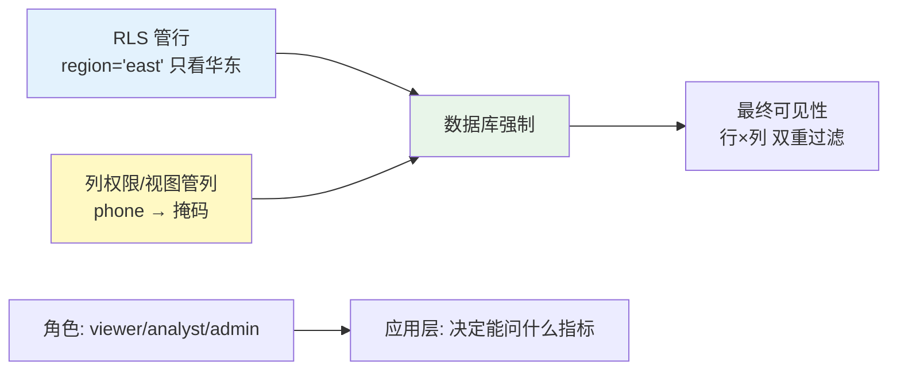

# 项目 10：数据智能分析平台 — 04-数据权限

> **定位**：行级 RLS + 列级脱敏 + 角色数据可见性——给不同人"看到该看的"。核心：权限在 DB 层（RLS 强制），响应式侧用 Reactor Context 传租户。教程 26 §数据层隔离 + 教程 42 §Context 传递的落地。本文给出**完整可手写代码**（一行不省略）。
>
> 「遇到阻塞？→ [教程 59-多租户隔离与资源治理 §数据层隔离]、[教程 85-响应式错误处理 §Context 传递]」

---

## 1. 四问

| 问 | 答 |
|----|----|
| **新增了什么需求** | 行级 RLS（按 region/department）；列级脱敏（PII 列掩码）；角色数据可见性（viewer/analyst/admin）；越权测试矩阵 |
| **影响了哪些模块** | DB 层启用 RLS + 列权限/视图；新增 `TenantContextFilter`（WebFilter 写 Reactor Context）+ `RegionAwareQueryExecutor`（SET LOCAL 事务级）；查询执行统一走 `RegionAwareQueryExecutor` |
| **架构如何演进** | 请求链路：WebFilter 解析 JWT → Reactor Context 携带租户 → 执行层 deferContextual 取租户 → SET LOCAL 注入 RLS 会话变量 → 查询 |
| **上一版痛点是什么** | ① 行级不可控（销售经理看全国）② 列级不可控（能看到客户明细）③ 权限靠应用层自觉 |

**v3 痛点 → 本迭代对策**：

| v3 痛点 | 本次迭代对策 |
|---------|-------------|
| 行级不可控（销售经理看全国） | PostgreSQL RLS：行按 region 过滤 |
| 列级不可控（能看到客户明细） | 列级权限 + 脱敏视图（敏感列掩码） |
| 权限靠应用层自觉 | DB 层强制（漏写 where 也安全） |

> **本节核对（四问一句话）**：链路"WebFilter → Reactor Context → SET LOCAL → 查询"四步与 §4.3/§4.4 代码一一对应；三条 v3 痛点均有对策。

## 2. 目标与量化验收

| # | 验收项 | 标准 |
|---|--------|------|
| 1 | RLS 强制 | 绕过应用直连 DB 也无法跨 region 读（FORCE RLS） |
| 2 | 列级掩码 | PII 列按角色掩码；privacy_officer 可看原文 |
| 3 | 越权矩阵 | 全接口 × 越权场景 0 泄露（CI） |
| 4 | 无串号 | 500 并发混合 region 事务，零串号（事务级绑定） |
| 5 | 存在性保护 | 越权访问返回 404 非 403 |

## 3. 二维权限模型



**维度说明**：RLS 管行、列级 GRANT/视图管列，两者叠加可防 LLM 生成的 `SELECT *` 泄露。

### 3.1 本节核对（二维权限模型）

- [ ] "RLS 管行 + 列权限/视图管列"两条边都汇入 DB 强制，与 §4.1 的 ②③④ 对应
- [ ] 角色只影响"能问什么指标"（应用层），不影响行/列过滤（DB 层）——两者不混层

## 4. 完整代码（照抄即可，一行不省略）

### 4.1 DB 层 RLS（强制边界）`db/schema-v4.sql`

```sql
-- ① 启用行级安全（FORCE 使表 owner 也受约束）
ALTER TABLE orders ENABLE ROW LEVEL SECURITY;
ALTER TABLE orders FORCE ROW LEVEL SECURITY;

-- ② 按区域过滤（租户上下文来自会话变量 app.current_region）
CREATE POLICY region_isolation ON orders
    USING (region = current_setting('app.current_region')::text);

-- ③ 列级安全：先 REVOKE 表级再 GRANT 列级（防表级覆盖）
REVOKE ALL ON customers FROM ai_analyst_readonly;
GRANT SELECT (customer_id, name, region) ON customers TO ai_analyst_readonly;  -- phone 不可见

-- ④ 动态数据掩码视图（列级权限的标准载体：按角色掩码，不按个人）
CREATE VIEW customer_masked AS
SELECT customer_id,
       name,
       CASE WHEN has_role(current_user, 'privacy_officer') THEN phone
            ELSE regexp_replace(phone, '(\d{3})\d{4}(\d{4})', '\1****\2')
       END AS phone,
       region
FROM customers;
```

**按角色掩码而非按个人**：>50 人后按人维护崩盘；角色成员关系放 IdP。

### 4.2 `TenantContext.java`（Reactor Context 中的租户上下文）

```java
package com.group.dataplat.security;

/** Reactor Context 中携带的租户上下文（WebFlux 禁 ThreadLocal）。 */
public record TenantContext(String tenantId, String region) {

    public static final String KEY = "tenant_ctx";

    public static TenantContext defaultCtx() {
        return new TenantContext("tenant-default", "east");
    }
}
```

### 4.3 `TenantContextFilter.java`（WebFilter：JWT → Reactor Context）

```java
package com.group.dataplat.security;

import org.springframework.stereotype.Component;
import org.springframework.web.server.ServerWebExchange;
import org.springframework.web.server.WebFilter;
import org.springframework.web.server.WebFilterChain;
import reactor.core.publisher.Mono;

/**
 * WebFlux 正确姿势：从请求解析 region/tenant → 写入 Reactor Context（禁 ThreadLocal）。
 * 教程 42 §Context 传递——请求级上下文只经 contextWrite，不下沉到实例字段。
 */
@Component
public class TenantContextFilter implements WebFilter {

    @Override
    public Mono<Void> filter(ServerWebExchange exchange, WebFilterChain chain) {
        String region = header(exchange, "X-Region", "east");
        String tenantId = header(exchange, "X-Tenant-Id", "tenant-default");
        return chain.filter(exchange)
                .contextWrite(ctx -> ctx.put(TenantContext.KEY,
                        new TenantContext(tenantId, region)));
    }

    /** 生产从 JWT claim 解析；此处 Header 简化（示意，真实解析见项目 07 v2 租户模型）。 */
    private String header(ServerWebExchange exchange, String name, String fallback) {
        String v = exchange.getRequest().getHeaders().getFirst(name);
        return v != null && !v.isBlank() ? v : fallback;
    }
}
```

### 4.4 `RegionAwareQueryExecutor.java`（SET LOCAL 事务级 + 查询）

```java
package com.group.dataplat.service;

import com.group.dataplat.security.TenantContext;
import org.springframework.jdbc.core.JdbcTemplate;
import org.springframework.stereotype.Service;
import org.springframework.transaction.PlatformTransactionManager;
import org.springframework.transaction.support.TransactionTemplate;
import reactor.core.publisher.Mono;
import reactor.core.scheduler.Schedulers;

import java.util.List;
import java.util.Map;

/**
 * 从 Reactor Context 取 region → SET LOCAL app.current_region（事务级）→ 执行查询。
 * 连接池下"事务级绑定"防串号：连接归还池后会话变量不残留。
 * WebFlux 纪律：阻塞 JDBC 一律 subscribeOn(boundedElastic)。
 */
@Service
public class RegionAwareQueryExecutor {

    private final JdbcTemplate jdbcTemplate;
    private final TransactionTemplate transactionTemplate;

    public RegionAwareQueryExecutor(JdbcTemplate jdbcTemplate,
                                    PlatformTransactionManager txManager) {
        this.jdbcTemplate = jdbcTemplate;
        this.transactionTemplate = new TransactionTemplate(txManager);
    }

    public Mono<List<Map<String, Object>>> queryInRegion(String sql) {
        return Mono.deferContextual(ctx -> {
            TenantContext tenant = ctx.getOrDefault(TenantContext.KEY, TenantContext.defaultCtx());
            return Mono.fromCallable(() ->
                    transactionTemplate.execute(status -> {
                        // SET LOCAL 只对当前事务生效——RLS 策略读取 app.current_region 过滤行
                        jdbcTemplate.update("SET LOCAL app.current_region = ?", tenant.region());
                        return jdbcTemplate.queryForList(sql);
                    }))
                .subscribeOn(Schedulers.boundedElastic());
        });
    }
}
```

### 4.5 接入：`SemanticLayerService` 与 `QueryGuardService` 的执行改走 `RegionAwareQueryExecutor`

```java
// QueryGuardService 改造（v4）：把 jdbcTemplate.queryForList 换成 regionAwareQueryExecutor.queryInRegion
public Mono<QueryResult> guardedExecute(String sql, UserContext user) {
    SqlVerdict verdict = guardrail.validate(sql);
    if (!verdict.allowed()) {
        auditStore.record(user, sql, new AuditOutcome(0, 0, verdict.reason()));
        return Mono.error(new SqlRejectedException(verdict.reason()));
    }
    String limited = ensureLimit(sql, MAX_ROWS);
    return Mono.fromCallable(() -> explainCost(limited))
            .map(cost -> {
                if (cost.estimatedRows() > MAX_ROWS || cost.estimatedCost() > MAX_COST) {
                    throw new QueryTooExpensiveException(cost);
                }
                return cost;
            })
            .then(regionAwareQueryExecutor.queryInRegion(limited))
            .map(rows -> {
                auditStore.record(user, sql, new AuditOutcome(rows.size(), 0, null));
                return new QueryResult(rows, limited, rows.size(), 0);
            })
            .timeout(TIMEOUT)
            .subscribeOn(Schedulers.boundedElastic());
}
```

> ⚠ `SET LOCAL` 必须与查询同事务；`RegionAwareQueryExecutor` 已用 `TransactionTemplate` 包裹。若两个方法各开连接，会话变量不会生效——这是本迭代最容易写错的地方。

### 4.6 越权测试矩阵（进 CI）`PermissionIsolationTest.java`

```java
package com.group.dataplat;

import com.group.dataplat.service.RegionAwareQueryExecutor;
import org.junit.jupiter.api.Test;
import org.springframework.beans.factory.annotation.Autowired;
import org.springframework.boot.test.context.SpringBootTest;   // ⚠ 需引入依赖 org.springframework.boot:spring-boot-starter-test（本地未下载，未 javap 实证；以引入依赖后 javap 输出为准）

import java.util.List;
import java.util.Map;

import static org.assertj.core.api.Assertions.assertThat;

/**
 * 越权测试矩阵：每个数据访问接口 × 越权场景，CI 必跑。
 * 模拟"绕过应用直连 DB"——RLS 在存储层强制过滤。
 */
@SpringBootTest
class PermissionIsolationTest {

    @Autowired
    private RegionAwareQueryExecutor executor;

    @Test
    void salesManagerEastCannotSeeWestOrders() {
        // 测试无 Reactor Context → defaultCtx(region=east) → RLS 过滤 west
        List<Map<String, Object>> rows = executor.queryInRegion(
                "SELECT count(*) AS cnt FROM orders WHERE region = 'west'").block();
        assertThat(rows).isNotNull();
        Object cnt = rows.get(0).get("cnt");
        assertThat(Long.parseLong(String.valueOf(cnt))).isEqualTo(0L);
    }
}
```

### 4.7 本节测试与验证（RLS 行级 + 列级脱敏）

**前置条件**：[03 §4.7] 已通过；`db/schema-v4.sql` 已执行（RLS 策略 + 列级 GRANT + `customer_masked` 视图）；需给 customers 插入含 11 位手机号的种子行（如 `('张三','13812345678','east')`）并创建一个具备 `privacy_officer` 角色的 DB 账号。

**材料——直连 DB 的 RLS/掩码核对（psql，绕过应用）**：

```sql
-- A. 未 SET 会话变量直查（模拟绕过应用的越权读）
SET app.current_region = 'east';
SELECT count(*) FROM orders;                      -- 预期只见 east 行
SET app.current_region = 'west';
SELECT count(*) FROM orders;                      -- 预期只见 west 行

-- B. 列级：表上直接 SELECT phone 应报权限错；走视图看掩码
SELECT phone FROM customers LIMIT 1;              -- 预期 permission denied（未 GRANT phone）
SELECT phone FROM customer_masked LIMIT 1;        -- 普通账号预期 138****5678；privacy_officer 预期原文
```

**材料——端到端越权问句（走 `/api/query`，带 Header 控制租户）**：

```sh
curl -X POST "http://localhost:8080/api/query?userId=u1" \
  -H "Content-Type: text/plain" -H "X-Region: east" \
  -d "2026 年 6 月各区域的订单数"    # 预期：只返回 east 行（RLS 过滤 west）
```

**步骤与断言**：

| # | 操作 | 预期（PASS 判据） |
|---|------|------------------|
| 1 | 跑 §4.6 `PermissionIsolationTest`（CI） | east 上下文查 west 计数 = 0（越权矩阵红绿灯） |
| 2 | 材料 A 第一组 | east 会话 count 与种子 east 行数一致（2 单） |
| 3 | 材料 A 第二组 | `SELECT phone FROM customers` 报 `permission denied`；掩码视图输出 `138****5678`；privacy_officer 账号看原文 |
| 4 | 材料 curl（east Header） | 返回行只含 east，无 west 数据泄露 |
| 5 | 500 并发混合 east/west 请求（可用脚本交替打） | 每个响应行集与自身 region 一致，零串号 |

**失败排查**：①步骤 2 不过滤→RLS 策略未建或连库账号是表 owner/superuser（FORCE RLS 才约束 owner，superuser 永远绕过——换普通账号测）；②掩码失效→`customer_masked` 查询账号没有视图权限，或 `has_role` 函数未按角色实现（该函数需自行在 DB 创建，示意见 §4.1 注释）；③串号→`SET LOCAL` 与查询不在同一事务（§4.5 ⚠ 的高发错误，检查是否都包在同一个 `TransactionTemplate.execute` 内）；④404 变 403→存在性保护属应用层响应映射，检查 Controller 的异常处理。

## 5. ADR 演进决策

| # | 决策 | 理由 |
|---|------|------|
| ADR-512 | RLS 管行 + 列权限/视图管列，双层 | 单层防不了 `SELECT *` 泄露 |
| ADR-513 | 按角色掩码不按个人 | >50 人后按人维护崩盘；角色成员在 IdP |
| ADR-514 | Reactor Context 传 region + SET LOCAL 事务级 | WebFlux 禁 ThreadLocal；连接池下事务级防串号 |

> **本节核对（ADR 一句话）**：ADR-512/513/514 分别对应 §4.1 的 ②③④ / §4.1 ④ / §4.4 实现，无空挂决策。

## 6. v4 的痛点（驱动下一迭代）

权限可控了，但**多数据源暴露**：订单库/用户库/报表库三个库，Agent 不知道该查哪个；跨库关联（"华东客户的订单"要 join 用户库）LLM 现场猜 join 会错。**需要 Data Catalog 路由**。→ [05-多数据源AgenticRAG.md](05-多数据源AgenticRAG.md)

## 7. 全篇回归验证

**回归断言**（§4.7 本节验证通过后，按 §2 验收表整体验收）：

| # | 操作 | 预期（PASS 判据） |
|---|------|------------------|
| 1 | 把 §4.6 越权矩阵扩展到全部数据接口（/api/query × 语义层/降级两路径）× east/west 两 region | CI 全绿，0 泄露（验收 3） |
| 2 | 越权访问一个不存在的跨 region 资源 | 响应语义为"未找到"而非"无权限"（验收 5，存在性保护） |
| 3 | 500 并发混合事务后抽查审计库 | 每条记录的行数与请求 region 匹配（验收 4 佐证） |

**失败排查**：矩阵偶发红→大概率是串号（回查 §4.7 排查 ③）而非权限规则本身；404/403 区分不清→应用层把 RLS 过滤后的空结果统一映射为"未找到"即可。
