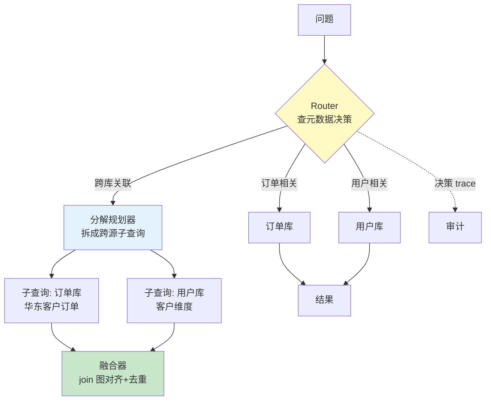

# 项目 10：数据智能分析平台 — 05-迭代四：多数据源 Agentic RAG

> **定位**：Agent 决策"查哪个库、怎么跨库关联"——Data Catalog 中枢 + Router/分解/融合 + 决策 trace。跨库关联用语义层预定义 join 图（v3 的扩展），不让 LLM 现场 join。教程 35 §Agentic 检索的落地。本文给出**完整可手写代码**（一行不省略）。
>
> 「遇到阻塞？→ [教程 35-高级RAG与AgenticRAG §Agentic 检索]、[教程 09-多Agent协作]、[附录 01-LLM基础理论/01-Embedding原理]」

---

## 1. 四问

| 问 | 答 |
|----|----|
| **新增了什么需求** | Data Catalog（元数据中枢）；多源路由 + 分解 + 融合；跨库 join 图扩展；决策 trace 审计 |
| **影响了哪些模块** | 新增 `DataCatalogService`（元数据）+ `CatalogTools`（@Tool 暴露 catalog 查询）+ `MultiSourceRouter`（路由决策）+ `CrossSourceJoinService`（分解融合）；语义层 join 图扩展到跨库 |
| **架构如何演进** | 查数链路前插"路由决策"：Agent 先查 Data Catalog 元数据（@Tool）再决策查哪个库；跨库时拆子查询并行执行、沿预定义 join 图融合 |
| **上一版痛点是什么** | ① 三库不知查哪个 ② 跨库关联 LLM 现场猜 join 会错 ③ 路由决策不可追溯 |

**v4 痛点 → 本迭代对策**：

| v4 痛点 | 本次迭代对策 |
|---------|-------------|
| 三库不知查哪个 | Data Catalog 路由：Agent 先查元数据再查数据 |
| 跨库关联 LLM 现场猜 | 预定义 join 图（跨库关联唯一路径） |
| 路由决策不可追溯 | 决策 trace：记录每次路由选择 |

## 2. 目标与量化验收

| # | 验收项 | 标准 |
|---|--------|------|
| 1 | 路由准确 | 单源问题路由到正确库 ≥ 95%（100 问对照） |
| 2 | 跨库正确 | 跨库关联结果与人工 SQL 对照一致率 ≥ 90%（join 图路径） |
| 3 | 决策可追溯 | 每次查询的 routing plan 入审计（查了哪个库/哪个 join） |
| 4 | 防劣质表 | 路由避开 catalog 标记为"untrusted/过期"的表 |
| 5 | 无 join 幻觉 | 跨库关联 100% 走预定义 join 图（LLM 不现场生成 join） |

## 3. 多源路由架构



**多源是最难的问题**：难点不是 LLM 质量，是 schema 冲突（Salesforce account_id vs ERP client_no vs 数仓 dim_customer_key）、上下文碎片化、join 顺序失败、指标口径漂移。**Data Catalog 是路由中枢**——路由决策必须 grounded in governed metadata。

## 4. 完整代码（照抄即可，一行不省略）

### 4.1 SQL DDL `db/schema-v5.sql`（Data Catalog 元数据中枢）

```sql
CREATE TABLE IF NOT EXISTS data_catalog (
    concept        VARCHAR(64) NOT NULL,
    datasource     VARCHAR(32) NOT NULL,
    table_name     VARCHAR(64) NOT NULL,
    schema_summary TEXT        NOT NULL,
    trust          VARCHAR(16) NOT NULL DEFAULT 'trusted'   -- trusted | untrusted | stale
);

CREATE TABLE IF NOT EXISTS join_graph (
    left_table   VARCHAR(64) NOT NULL,
    right_table  VARCHAR(64) NOT NULL,
    left_column  VARCHAR(64) NOT NULL,
    right_column VARCHAR(64) NOT NULL,
    join_type    VARCHAR(16) NOT NULL DEFAULT 'LEFT',
    PRIMARY KEY (left_table, right_table)
);

CREATE TABLE IF NOT EXISTS routing_audit (
    id            VARCHAR(36) PRIMARY KEY,
    question      TEXT      NOT NULL,
    sources       TEXT      NOT NULL,
    decomposition BOOLEAN   NOT NULL,
    join_paths    TEXT,
    occurred_at   TIMESTAMPTZ NOT NULL
);

-- 种子：标记 payments 为 stale（路由应避开）
INSERT INTO data_catalog(concept, datasource, table_name, schema_summary, trust) VALUES
('订单', 'order_dw', 'orders',    '订单主表: order_id/user_id/region/channel/status/pay_amount/order_date', 'trusted'),
('客户', 'user_dw',  'customers', '客户表: customer_id/name/phone/region', 'trusted'),
('支付', 'order_dw', 'payments',  '支付流水表: payment_id/order_id/amount/paid_at', 'stale');

INSERT INTO join_graph(left_table, right_table, left_column, right_column, join_type) VALUES
('orders', 'customers', 'user_id', 'customer_id', 'LEFT');
```

### 4.2 元数据载体 `CatalogEntry.java` + `JoinPath.java`

```java
package com.group.dataplat.catalog;

/** Data Catalog 元数据条目：业务概念 → 库/表/schema/可信度。 */
public record CatalogEntry(
        String concept,     // 业务概念: "订单"
        String datasource,  // 库: order_dw
        String table,       // 表: orders
        String schema,      // 表结构摘要
        String trust        // trusted | untrusted | stale
) {}
```

```java
package com.group.dataplat.catalog;

/** 跨库 join 预定义路径（分析师维护，LLM 不现场生成）。 */
public record JoinPath(
        String leftTable,
        String rightTable,
        String leftColumn,
        String rightColumn,
        String joinType     // LEFT | INNER
) {}
```

### 4.3 `DataCatalogService.java`（元数据检索）

```java
package com.group.dataplat.catalog;

import org.springframework.jdbc.core.simple.JdbcClient;
import org.springframework.stereotype.Service;

import java.util.List;

/**
 * Data Catalog 元数据中枢。路由决策必须先查它——grounded in governed metadata。
 */
@Service
public class DataCatalogService {

    private final JdbcClient jdbcClient;

    public DataCatalogService(JdbcClient jdbcClient) {
        this.jdbcClient = jdbcClient;
    }

    /** 按业务概念查数据源（可信表优先，untrusted/stale 排后供 Agent 决策避开）。 */
    public List<CatalogEntry> search(String concept) {
        return jdbcClient.sql("""
                SELECT concept, datasource, table_name AS table, schema_summary AS schema, trust
                FROM data_catalog
                WHERE concept ILIKE :pattern
                ORDER BY CASE trust WHEN 'trusted' THEN 0 ELSE 1 END
                """)
                .param("pattern", "%" + concept + "%")
                .query((rs, rowNum) -> new CatalogEntry(
                        rs.getString("concept"),
                        rs.getString("datasource"),
                        rs.getString("table"),
                        rs.getString("schema"),
                        rs.getString("trust")))
                .list();
    }

    /** 查询两表间预定义 join 路径；无则抛异常（Agent 不得现场造 join）。 */
    public JoinPath joinPath(String leftTable, String rightTable) {
        return jdbcClient.sql("""
                SELECT left_table, right_table, left_column, right_column, join_type
                FROM join_graph
                WHERE (left_table = :l AND right_table = :r)
                   OR (left_table = :r AND right_table = :l)
                LIMIT 1
                """)
                .param("l", leftTable).param("r", rightTable)
                .query((rs, rowNum) -> new JoinPath(
                        rs.getString("left_table"),
                        rs.getString("right_table"),
                        rs.getString("left_column"),
                        rs.getString("right_column"),
                        rs.getString("join_type")))
                .optional()
                .orElseThrow(() -> new IllegalArgumentException(
                        "无预定义 join 路径: " + leftTable + " ↔ " + rightTable));
    }
}
```

### 4.4 `CatalogTools.java`（@Tool 暴露 catalog 查询——让 Agent 先查元数据再查数据）

```java
package com.group.dataplat.catalog;

import org.springframework.ai.tool.annotation.Tool;
import org.springframework.ai.tool.annotation.ToolParam;
import org.springframework.stereotype.Component;

import java.util.List;

/**
 * 工具化 Data Catalog。Agent 若跳过 catalog 直接猜表名，跨库必然猜错——
 * 路由必须是"选择题"（在 catalog 内选），不是"生成题"。
 */
@Component
public class CatalogTools {

    private final DataCatalogService catalog;

    public CatalogTools(DataCatalogService catalog) {
        this.catalog = catalog;
    }

    @Tool(name = "find_sources",
          description = "按业务概念查数据源：返回该概念在哪些库、哪些表、表结构摘要及可信度")
    public List<CatalogEntry> findSources(
            @ToolParam(description = "业务概念，如 '订单'、'客户'、'支付'") String concept) {
        return catalog.search(concept);
    }

    @Tool(name = "get_join_path",
          description = "查询跨库/跨表 join 图：返回两表间的预定义关联路径（禁止自行臆造 join）")
    public JoinPath getJoinPath(
            @ToolParam(description = "表 A") String tableA,
            @ToolParam(description = "表 B") String tableB) {
        return catalog.joinPath(tableA, tableB);
    }
}
```

### 4.5 工具注册 `CatalogToolConfig.java`（@Tool 需显式 Provider）

```java
package com.group.dataplat.config;

import com.group.dataplat.catalog.CatalogTools;
import org.springframework.ai.tool.ToolCallbackProvider;   // Spring AI 2.0.0 真实包
import org.springframework.ai.tool.method.MethodToolCallbackProvider;
import org.springframework.context.annotation.Bean;
import org.springframework.context.annotation.Configuration;

/** @Tool 不会自动注册——必须显式声明 ToolCallbackProvider（附录 05-02 §1）。 */
@Configuration
public class CatalogToolConfig {

    @Bean
    public ToolCallbackProvider catalogToolProvider(CatalogTools catalogTools) {
        return MethodToolCallbackProvider.builder()
                .toolObjects(catalogTools)
                .build();
    }
}
```

### 4.6 `RoutingPlan.java`（路由决策的结构化输出）

```java
package com.group.dataplat.catalog;

import java.util.List;

/** 路由决策输出（LLM 结构化）：查哪些源 + 是否分解 + 跨库 join 路径。 */
public record RoutingPlan(
        List<String> sources,       // 需要查询的库（来自 catalog，不臆造）
        boolean decomposition,      // 是否需要拆分子查询（跨库关联时）
        List<String> joinPaths      // 跨库关联的预定义路径
) {}
```

### 4.7 `RoutingAuditStore.java`（决策 trace 入库）

```java
package com.group.dataplat.service;

import com.group.dataplat.catalog.RoutingPlan;
import org.springframework.jdbc.core.simple.JdbcClient;
import org.springframework.stereotype.Service;

import java.time.Instant;
import java.util.UUID;

/** 决策 trace：每次路由"查了哪个库/哪个 join"都留痕。 */
@Service
public class RoutingAuditStore {

    private final JdbcClient jdbcClient;

    public RoutingAuditStore(JdbcClient jdbcClient) {
        this.jdbcClient = jdbcClient;
    }

    public void record(String question, RoutingPlan plan) {
        jdbcClient.sql("""
                INSERT INTO routing_audit(id, question, sources, decomposition, join_paths, occurred_at)
                VALUES (:id, :q, :sources, :decomp, :joins, :at)
                """)
                .param("id", UUID.randomUUID().toString())
                .param("q", question)
                .param("sources", String.join(",", plan.sources()))
                .param("decomp", plan.decomposition())
                .param("joins", String.join(",", plan.joinPaths()))
                .param("at", Instant.now())
                .update();
    }
}
```

### 4.8 `MultiSourceRouter.java`（路由决策 + 决策 trace）

```java
package com.group.dataplat.service;

import com.group.dataplat.catalog.CatalogTools;
import com.group.dataplat.catalog.RoutingPlan;
import org.springframework.ai.chat.client.ChatClient;
import org.springframework.stereotype.Service;
import reactor.core.publisher.Mono;
import reactor.core.scheduler.Schedulers;

/**
 * Router：LLM 依据 Data Catalog 输出 RoutingPlan（封闭选择，不生成表名）。
 */
@Service
public class MultiSourceRouter {

    private final ChatClient chatClient;
    private final CatalogTools catalogTools;
    private final RoutingAuditStore auditStore;

    public MultiSourceRouter(ChatClient chatClient,
                             CatalogTools catalogTools,
                             RoutingAuditStore auditStore) {
        this.chatClient = chatClient;
        this.catalogTools = catalogTools;
        this.auditStore = auditStore;
    }

    public Mono<RoutingPlan> route(String question) {
        return Mono.fromCallable(() -> chatClient.prompt()
                .system("""
                    根据 Data Catalog，决定查询哪些数据源。输出 JSON：
                    1. sources: 需要查询的库（来自 find_sources 工具结果，不臆造）
                    2. decomposition: 是否需要拆分子查询（跨库关联时为 true）
                    3. join_paths: 跨库关联的预定义路径（来自 get_join_path 工具结果）
                    规则：只选 catalog 中 trust=trusted 的源；禁止臆造表名。
                    """)
                .tools(catalogTools)                       // @Tool 注入本轮（find_sources / get_join_path）
                .user(question)
                .call()
                .entity(RoutingPlan.class))                // 真实重载 entity(Class)
            .subscribeOn(Schedulers.boundedElastic())
            .doOnNext(plan -> auditStore.record(question, plan));   // 决策 trace 入库
    }
}
```

### 4.9 `CrossSourceJoinService.java`（分解 + 并行查源 + 预定义 join 图融合）

```java
package com.group.dataplat.service;

import com.group.dataplat.catalog.DataCatalogService;
import com.group.dataplat.catalog.JoinPath;
import com.group.dataplat.catalog.RoutingPlan;
import com.group.dataplat.dto.QueryResult;
import org.springframework.jdbc.core.JdbcTemplate;
import org.springframework.stereotype.Service;
import reactor.core.publisher.Mono;
import reactor.core.scheduler.Schedulers;

import java.util.ArrayList;
import java.util.LinkedHashMap;
import java.util.List;
import java.util.Map;

/**
 * 跨库关联: 分解成子查询 → 并行查各源（Mono.zip）→ 沿预定义 join 图融合去重。
 * 融合是确定性逻辑——LLM 不现场 join（防 fan-out/笛卡尔积）。
 */
@Service
public class CrossSourceJoinService {

    private final JdbcTemplate jdbcTemplate;
    private final DataCatalogService catalog;

    public CrossSourceJoinService(JdbcTemplate jdbcTemplate, DataCatalogService catalog) {
        this.jdbcTemplate = jdbcTemplate;
        this.catalog = catalog;
    }

    public Mono<QueryResult> crossSourceJoin(RoutingPlan plan) {
        // 简版演示：订单库 × 用户库。真实多源为每库独立 DataSource + JdbcTemplate，此处同一连接简化。
        Mono<List<Map<String, Object>>> orderRows = querySource("orders");
        Mono<List<Map<String, Object>>> customerRows = querySource("customers");
        return Mono.zip(orderRows, customerRows)
                .map(tuple -> fuse("orders", "customers",
                        tuple.getT1(), tuple.getT2()))
                .map(rows -> new QueryResult(rows, "跨源 join: " + plan.sources(),
                        rows.size(), 0));
    }

    private Mono<List<Map<String, Object>>> querySource(String table) {
        // 子查询走语义层编译 + v2 护栏 + v4 RLS（同一执行链），此处直接查表简化演示
        return Mono.fromCallable(() -> jdbcTemplate.queryForList("SELECT * FROM " + table))
                .subscribeOn(Schedulers.boundedElastic());
    }

    /** 融合: 沿预定义 join 图对齐 + 去重（key 用 join 列）。 */
    private List<Map<String, Object>> fuse(String leftTable, String rightTable,
                                           List<Map<String, Object>> left,
                                           List<Map<String, Object>> right) {
        JoinPath join = catalog.joinPath(leftTable, rightTable);
        Map<Object, Map<String, Object>> rightIndex = new LinkedHashMap<>();
        for (Map<String, Object> r : right) {
            rightIndex.put(r.get(join.rightColumn()), r);
        }
        List<Map<String, Object>> merged = new ArrayList<>();
        for (Map<String, Object> l : left) {
            Map<String, Object> row = new LinkedHashMap<>(l);
            Map<String, Object> r = rightIndex.get(l.get(join.leftColumn()));
            if (r != null) {
                r.forEach((k, v) -> row.putIfAbsent(k, v));   // 对齐（防右侧覆盖左侧）
            }
            merged.add(row);
        }
        return merged.stream().distinct().toList();
    }
}
```

**为什么先查元数据**：Agent 若跳过 catalog 直接猜表名，跨库必然猜错。查元数据是"grounded in governed metadata"——识别最小充分数据源集，99% 避开劣质表。

### 验证包（手工测试与验证）

**前置条件**：上一迭代已通过；本迭代组件与样例数据就绪。

**材料**：多数据源（数仓/文档/API）+ 混合检索探针问题；AgenticRAG 多跳问题集。

**步骤与断言（由验收表转断言清单）**：

| # | 操作 | 预期（PASS 判据） |
|---|------|------------------|
| 1 | 用材料构造「路由准确」场景执行 | 单源问题路由到正确库 ≥ 95%（100 问对照） |
| 2 | 用材料构造「跨库正确」场景执行 | 跨库关联结果与人工 SQL 对照一致率 ≥ 90%（join 图路径） |
| 3 | 用材料构造「决策可追溯」场景执行 | 每次查询的 routing plan 入审计（查了哪个库/哪个 join） |
| 4 | 用材料构造「防劣质表」场景执行 | 路由避开 catalog 标记为"untrusted/过期"的表 |
| 5 | 用材料构造「无 join 幻觉」场景执行 | 跨库关联 100% 走预定义 join 图（LLM 不现场生成 join） |
**失败排查**：断言不符先分层——入口日志（请求到没到）→ SQL 护栏/策略服务（为何拦/放）→ DB 层（只读强制是否在库层）；安全类失败优先验证"测试前置样本是否真的到达被测层"，再查实现。
## 5. ADR 演进决策

| # | 决策 | 理由 |
|---|------|------|
| ADR-515 | Data Catalog 中枢 + 先查元数据再查数据 | 路由决策必须 grounded in governed metadata |
| ADR-516 | 跨库关联用预定义 join 图 | 现场 join 是 fan-out/笛卡尔积重灾区 |
| ADR-517 | 决策 trace 审计 | 多源查询的"为什么查这个库"要可追溯 |

## 6. v5 的痛点（驱动下一迭代）

数据能查了，但**业务要的是"答案"不是"表格"**——"给我看华东 6 月的销售趋势"应该直接出图表，不是甩一堆行。**需要报表/可视化生成**。→ [06-报表与可视化生成.md](06-报表与可视化生成.md)
