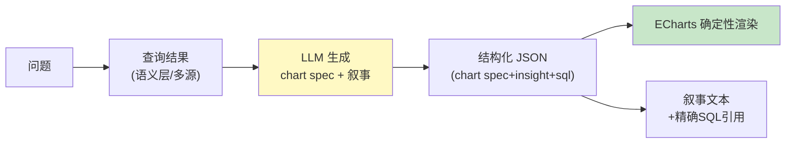

# 项目 10：数据智能分析平台 — 06-迭代五：报表与可视化生成

> **定位**：从"返回表格"升级为"交付洞察"——LLM 产结构化 JSON（chart spec + 叙事），Java 确定性渲染 ECharts。教程 12 §结构化输出 + 附录 11 Agent 交互设计的落地。本文给出**完整可手写代码**（一行不省略）。
>
> 「遇到阻塞？→ [教程 13-结构化输出]、[附录 14-Agent交互设计/00-Agent用户体验设计]、[教程 18-Agentic-UI设计 §生成式 UI]」

---

## 1. 四问

| 问 | 答 |
|----|----|
| **新增了什么需求** | 自然语言 → 结构化报表（图表 + 叙事 + 依据 SQL）；多格式（Web 报告/PDF）；定时报表 |
| **影响了哪些模块** | 新增 `ReportGenerator`（LLM 出 chart spec）+ `ReportDelivery`（投递）；复用语义层/多源结果；前端新增 `ReportViewer`（ECharts 确定性渲染） |
| **架构如何演进** | 查数链路尾部加"报表层"：语义层/多源结果 → LLM 生成结构化 spec → 前端确定性渲染；LLM 只出规范不碰 DOM |
| **上一版痛点是什么** | ① 业务要"答案"不是"表格" ② 图表凭感觉选 ③ 报表结果不可信 |

**v5 痛点 → 本迭代对策**：

| v5 痛点 | 本次迭代对策 |
|---------|-------------|
| 业务要"答案"不是"表格" | 报表生成：LLM 出规范，确定性渲染图表 |
| 图表凭感觉选 | 语义元数据 → 规则求解器推导图表（white-box） |
| 报表结果不可信 | 图表附精确 SQL 建立信任 |

## 2. 目标与量化验收

| # | 验收项 | 标准 |
|---|--------|------|
| 1 | 图表正确 | chart 类型与数据匹配率 ≥ 90%（人工标注 100 份） |
| 2 | 叙事可信 | insights 100% 基于数据（无编造数字） |
| 3 | 信任建立 | 报表 100% 附 SQL 引用 |
| 4 | 安全 | chart spec 是受限 DSL（无任意 HTML/脚本） |
| 5 | 渲染性能 | 单报表渲染 < 1s（P95） |

## 3. 生成式报表（Composability 原则）

> **核心原则**：**LLM 出规范、确定性模块做统计真值与渲染**——LLM 不直接画图，只输出结构化 JSON 描述；渲染由 ECharts 确定性完成。



## 4. 完整代码（照抄即可，一行不省略）

### 4.1 报表规范载体（受限 DSL）`ChartSpec.java` + `Insight.java` + `ReportSpec.java`

```java
package com.group.dataplat.report;

import java.util.List;

/** ECharts 图表规范——受限 DSL（type/x_field/series），不是任意 HTML（防间接注入 XSS）。 */
public record ChartSpec(
        String type,           // line | bar | pie
        String xField,         // x 轴字段
        List<String> series    // 系列字段
) {}
```

```java
package com.group.dataplat.report;

/** 叙事：一条关键发现（必须基于数据，不编造）。 */
public record Insight(String title, String detail) {}
```

```java
package com.group.dataplat.report;

import java.util.List;

/** LLM 产出的报表规范：chart spec + 叙事 + 依据 SQL + 数据局限。 */
public record ReportSpec(
        ChartSpec chart,              // {type: line/bar/pie, x_field, series}
        List<Insight> insights,       // 关键发现（叙事）
        String sqlUsed,               // 依据 SQL（建立信任）
        List<String> warnings         // 数据局限（样本不足/口径说明）
) {}
```

### 4.2 `ReportGenerator.java`（LLM 生成结构化报表规范）

```java
package com.group.dataplat.report;

import com.group.dataplat.dto.QueryResult;
import org.springframework.ai.chat.client.ChatClient;
import org.springframework.stereotype.Service;
import reactor.core.publisher.Mono;
import reactor.core.scheduler.Schedulers;

import java.util.List;
import java.util.Map;

/**
 * LLM 只输出受控的 chart spec（不是自由 HTML）——教程 44 §4.3 防注入。
 * 渲染由前端确定性完成，LLM 不直接碰 DOM。
 */
@Service
public class ReportGenerator {

    private final ChatClient chatClient;

    public ReportGenerator(ChatClient chatClient) {
        this.chatClient = chatClient;
    }

    public Mono<ReportSpec> generateReport(String question, QueryResult data) {
        return Mono.fromCallable(() -> chatClient.prompt()
                .system("""
                    根据查询结果生成报表规范，输出 JSON：
                    1. chart: {type: line/bar/pie, x_field, series}
                    2. insights: 2-3 条关键发现 {title, detail}
                    3. sql_used: 引用生成结果的 SQL
                    4. warnings: 数据局限（样本不足/口径说明）
                    只基于给定数据，不编造数字。
                    """)
                .user("问题：" + question + "\n\n数据（前50行）：\n" + preview(data))
                .call()
                .entity(ReportSpec.class))        // 真实重载 entity(Class)
            .subscribeOn(Schedulers.boundedElastic());
    }

    /** 只把前 50 行喂给 LLM（防上下文爆炸）。 */
    private String preview(QueryResult data) {
        List<Map<String, Object>> rows =
                data.rows().subList(0, Math.min(50, data.rows().size()));
        StringBuilder sb = new StringBuilder();
        for (Map<String, Object> row : rows) {
            sb.append(row).append('\n');
        }
        return sb.toString();
    }
}
```

### 4.3 `ReportDelivery.java`（报表投递）

```java
package com.group.dataplat.report;

import org.springframework.stereotype.Component;

/** 报表投递：邮件 / 内部报表平台。示例仅打印。 */
@Component
public class ReportDelivery {

    public void send(String department, ReportSpec spec) {
        // 真实实现：邮件服务 / 内部报表平台 API（spec.chart() 为受限 DSL，可安全渲染）
        System.out.println("发送部门周报 " + department
                + "，图表=" + spec.chart().type()
                + "，insights=" + spec.insights().size());
    }
}
```

### 4.4 `ReportScheduler.java`（定时报表，订阅式）

```java
package com.group.dataplat.report;

import com.group.dataplat.dto.QueryResult;
import com.group.dataplat.dto.UserContext;
import com.group.dataplat.semantic.SemanticLayerService;
import org.springframework.scheduling.annotation.Scheduled;
import org.springframework.stereotype.Component;

import java.util.List;

/**
 * 定时报表：每周一生成部门周报（复用 v3 语义层 + 本迭代报表生成）。
 * 定时任务非响应式链路，允许 block()（教程 37）；系统租户上下文走 RLS。
 */
@Component
public class ReportScheduler {

    private final SemanticLayerService semanticLayer;
    private final ReportGenerator reportGenerator;
    private final ReportDelivery reportDelivery;

    public ReportScheduler(SemanticLayerService semanticLayer,
                           ReportGenerator reportGenerator,
                           ReportDelivery reportDelivery) {
        this.semanticLayer = semanticLayer;
        this.reportGenerator = reportGenerator;
        this.reportDelivery = reportDelivery;
    }

    @Scheduled(cron = "0 0 8 * * MON")
    public void weeklyDepartmentReport() {
        List<String> departments = List.of("sales", "finance", "ops");
        for (String dept : departments) {
            UserContext system = new UserContext("scheduler", "tenant-sys", "admin", "east");
            QueryResult data = semanticLayer.answer(dept + " 上周核心指标", system).block();
            ReportSpec spec = reportGenerator.generateReport(dept + " 周报", data).block();
            reportDelivery.send(dept, spec);
        }
    }
}
```

> ⚠ 启用定时任务：在 `DataPlatApplication` 类上加 `@EnableScheduling`：
>
> ```java
> package com.group.dataplat;
>
> import org.springframework.boot.SpringApplication;
> import org.springframework.boot.autoconfigure.SpringBootApplication;
> import org.springframework.scheduling.annotation.EnableScheduling;
>
> @EnableScheduling
> @SpringBootApplication
> public class DataPlatApplication {
>     public static void main(String[] args) {
>         SpringApplication.run(DataPlatApplication.class, args);
>     }
> }
> ```

### 4.5 前端契约 `ReportViewer.tsx`（确定性渲染 ECharts，React 19）

```typescript
// React 侧（前端契约，参考教程 44 §生成式 UI）
import { useMemo } from 'react';
import ReactECharts from 'echarts-for-react';

type ChartSpec = { type: 'line' | 'bar' | 'pie'; xField: string; series: string[] };
type Insight = { title: string; detail: string };
type ReportSpec = { chart: ChartSpec; insights: Insight[]; sqlUsed: string; warnings?: string[] };

// 确定性映射：chart spec → ECharts option（受限 DSL，不直接渲染 HTML）
function toEChartsOption(spec: ChartSpec) {
  return {
    xAxis: { type: 'category', data: [] },
    yAxis: { type: 'value' },
    series: spec.series.map((s) => ({ name: s, type: spec.type, data: [] })),
  };
}

export function ReportViewer({ spec }: { spec: ReportSpec }) {
  const option = useMemo(() => toEChartsOption(spec.chart), [spec.chart]);
  return (
    <div>
      <ReactECharts option={option} />
      <ul>
        {spec.insights.map((i) => (
          <li key={i.title}>
            {i.title}: {i.detail}
          </li>
        ))}
      </ul>
      <details>
        <summary>查看 SQL</summary>
        <pre>{spec.sqlUsed}</pre>
      </details>
      {spec.warnings?.map((w) => (
        <div key={w} style={{ color: '#b26a00' }}>
          ⚠ {w}
        </div>
      ))}
    </div>
  );
}
```

## 5. ADR 演进决策

| # | 决策 | 理由 |
|---|------|------|
| ADR-518 | LLM 出 chart spec + 确定性渲染 | Composability：LLM 出规范、确定性模块做真值 |
| ADR-519 | 报表附精确 SQL | 建立信任；审计可回溯 |
| ADR-520 | chart spec 受限 DSL 非任意 HTML | 防间接注入导致 XSS（教程 44 §4.3） |

## 6. v6 的痛点（驱动下一迭代）

报表上线后，**成本账出来了**：每个问题一次 LLM 生成 + 一次报表生成，100 个业务每天 500 问 = LLM 调用量大增；相似问题（"上周GMV"和"6月GMV"）重复花钱。**需要成本治理与缓存**。→ [07-迭代六-成本治理与缓存.md](07-迭代六-成本治理与缓存.md)
