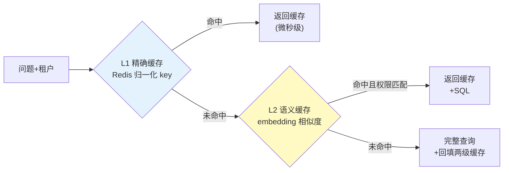

# 项目 10：数据智能分析平台 — 07-成本治理与缓存

> **定位**：把"每次问都花钱"变成"相似问题不重复花钱"——两级缓存（精确 + 语义）+ Token 预算 + 按租户成本归因。教程 27 §成本治理 + 附录 10 §语义缓存的落地。本文给出**完整可手写代码**（一行不省略）。
>
> 「遇到阻塞？→ [教程 60-成本治理与Token计量]、[附录 09-语义缓存与性能/00-语义缓存实现]、[教程 81-Agent性能优化 §缓存策略]」

---

## 1. 四问

| 问 | 答 |
|----|----|
| **新增了什么需求** | 两级缓存（存"问题-SQL-结果"三元组）；Token 预算与配额；按租户成本报表 |
| **影响了哪些模块** | 新增 `CacheService`（L1 精确）+ `SemanticCacheService`（L2 语义）+ `TokenBudgetService`（预算）+ `CostAttributionService`（归因）；查询入口先查缓存再走语义层/多源 |
| **架构如何演进** | 查数链路前插"缓存层"：L1 精确（Redis）→ L2 语义（pgvector 向量）→ 未命中完整查询 + 回填两级缓存 |
| **上一版痛点是什么** | ① 相似问题重复花钱 ② 无预算，成本失控 ③ 成本说不清归谁 |

**v6 痛点 → 本迭代对策**：

| v6 痛点 | 本次迭代对策 |
|---------|-------------|
| 相似问题重复花钱 | 两级缓存：精确匹配（Redis）+ 语义缓存（向量） |
| 无预算，成本失控 | Token 预算 BUDGET_EXCEEDED 终止 |
| 成本说不清归谁 | 按租户/用户/指标归因（gen_ai 计量） |

> **本节核对（四问一句话）**：四个新增服务与 §4 对应（4.3 L1 / 4.4 L2 / 4.5+4.6 预算 / 4.7 归因）；缓存层位于语义层/多源之前的链路顺序与 §4.8 门面一致。

## 2. 目标与量化验收

| # | 验收项 | 标准 |
|---|--------|------|
| 1 | 缓存命中率 | 语义缓存命中率 ≥ 40%（回测 1000 问） |
| 2 | 延迟 | 缓存命中 P95 < 50ms（vs 完整查询 < 15s） |
| 3 | 权限隔离 | A 租户绝不命中 B 租户缓存（含语义缓存） |
| 4 | 预算执行 | 超限 100% 终止（BUDGET_EXCEEDED），不静默继续 |
| 5 | 成本归因 | 按租户/用户/类型成本报表可导出，命中计入节省 |

## 3. 两级缓存



**关键**：语义缓存命中**必须校验权限边界**——权限内才可命中，防止 A 租户命中 B 租户的缓存数据；TTL 按数据敏感度分层。

### 3.1 本节核对（两级缓存）

- [ ] L2 命中条件是"命中且权限匹配"（图上节点文本），代码 §4.4 有对应的 `tenant_id` 比对——权限校验是命中的一部分而非后置
- [ ] 未命中路径有"回填两级缓存"，与 §4.8 `fullQueryAndCache` 的 `semanticPut + exactPut` 对应

## 4. 完整代码（照抄即可，一行不省略）

### 4.1 需在 pom.xml 中添加依赖

```xml
<!-- Redis 响应式客户端（L1 精确缓存） -->
<dependency>
    <groupId>org.springframework.boot</groupId>
    <artifactId>spring-boot-starter-data-redis-reactive</artifactId>
</dependency>
<!-- pgvector 向量存储（L2 语义缓存） -->
<dependency>
    <groupId>org.springframework.ai</groupId>
    <artifactId>spring-ai-starter-vector-store-pgvector</artifactId>
</dependency>
```

### 4.2 application.yml 新增

```yaml
spring:
  data:
    redis:
      host: localhost
      port: 6379
  ai:
    vectorstore:
      pgvector:
        index-type: HNSW
        distance-type: COSINE_DISTANCE
        dimensions: 1536          # 需与所用 embedding 模型输出维度一致
```

### 4.3 `CacheService.java`（L1 精确缓存：Redis，微秒级）

```java
package com.group.dataplat.service;

import com.fasterxml.jackson.core.JsonProcessingException;
import com.fasterxml.jackson.databind.ObjectMapper;
import com.group.dataplat.dto.QueryResult;
import org.springframework.data.redis.core.ReactiveRedisTemplate;
import org.springframework.stereotype.Service;
import reactor.core.publisher.Mono;

import java.time.Duration;

/**
 * L1 精确缓存——归一化 key（问题+租户），零 embedding 成本。
 * 用 ReactiveRedisTemplate<String,String> + Jackson 存 JSON（响应式铁律：Redis 用响应式模板）。
 */
@Service
public class CacheService {

    private static final Duration EXACT_TTL = Duration.ofMinutes(30);

    private final ReactiveRedisTemplate<String, String> redis;
    private final ObjectMapper objectMapper;

    public CacheService(ReactiveRedisTemplate<String, String> redis, ObjectMapper objectMapper) {
        this.redis = redis;
        this.objectMapper = objectMapper;
    }

    public Mono<QueryResult> exactHit(String question, String tenantId) {
        String key = "query:" + tenantId + ":" + question;
        return redis.opsForValue().get(key)
                .map(this::deserialize);
    }

    public Mono<Void> exactPut(String question, String tenantId, QueryResult result) {
        String key = "query:" + tenantId + ":" + question;
        return redis.opsForValue().set(key, serialize(result), EXACT_TTL).then();
    }

    private String serialize(QueryResult result) {
        try {
            return objectMapper.writeValueAsString(result);
        } catch (JsonProcessingException e) {
            throw new IllegalStateException("缓存序列化失败", e);
        }
    }

    private QueryResult deserialize(String json) {
        try {
            return objectMapper.readValue(json, QueryResult.class);
        } catch (JsonProcessingException e) {
            throw new IllegalStateException("缓存反序列化失败", e);
        }
    }
}
```

### 4.4 `SemanticCacheService.java`（L2 语义缓存：embedding + 权限校验 + TTL）

```java
package com.group.dataplat.service;

import com.fasterxml.jackson.core.JsonProcessingException;
import com.fasterxml.jackson.databind.ObjectMapper;
import com.group.dataplat.dto.QueryResult;
import org.springframework.ai.document.Document;
import org.springframework.ai.vectorstore.SearchRequest;
import org.springframework.ai.vectorstore.VectorStore;
import org.springframework.stereotype.Service;

import java.util.List;
import java.util.Map;
import java.util.Optional;

/**
 * L2 语义缓存——embedding 余弦相似度 + 阈值 + 权限校验。
 * 命中必须校验 tenant_id 边界：防 A 租户命中 B 租户缓存（数据泄漏）。
 */
@Service
public class SemanticCacheService {

    private static final double THRESHOLD = 0.92;

    private final VectorStore vectorStore;
    private final ObjectMapper objectMapper;

    public SemanticCacheService(VectorStore vectorStore, ObjectMapper objectMapper) {
        this.vectorStore = vectorStore;
        this.objectMapper = objectMapper;
    }

    public Optional<QueryResult> semanticHit(String question, String tenantId) {
        List<Document> hits = vectorStore.similaritySearch(
                SearchRequest.builder().query(question).topK(1)
                        .similarityThreshold(THRESHOLD).build());   // 附录 05-02 §4 新式
        if (hits.isEmpty()) {
            return Optional.empty();
        }
        Document doc = hits.get(0);
        // 权限边界校验：缓存命中必须属于同一租户
        Object cachedTenant = doc.getMetadata().get("tenant_id");
        if (!tenantId.equals(cachedTenant)) {
            return Optional.empty();
        }
        return Optional.of(deserialize(doc.getText()));
    }

    public void semanticPut(String question, String tenantId, QueryResult result) {
        Document doc = Document.builder()
                .text(serialize(result))
                .metadata(Map.of("tenant_id", tenantId, "question", question))
                .build();
        vectorStore.add(List.of(doc));
    }

    private String serialize(QueryResult result) {
        try {
            return objectMapper.writeValueAsString(result);
        } catch (JsonProcessingException e) {
            throw new IllegalStateException("语义缓存序列化失败", e);
        }
    }

    private QueryResult deserialize(String text) {
        try {
            return objectMapper.readValue(text, QueryResult.class);
        } catch (JsonProcessingException e) {
            throw new IllegalStateException("语义缓存反序列化失败", e);
        }
    }
}
```

### 4.5 `TokenMeter.java` + `BudgetExceededException.java`

```java
package com.group.dataplat.service;

import org.springframework.stereotype.Service;

import java.util.Map;
import java.util.concurrent.ConcurrentHashMap;
import java.util.concurrent.atomic.AtomicLong;

/**
 * Token 计量。简版内存计数（生产用 Redis INCRBY + 日滚动 key，v9 迁成本归因表）。
 */
@Service
public class TokenMeter {

    private final Map<String, AtomicLong> daily = new ConcurrentHashMap<>();

    public void add(String tenantId, long tokens) {
        daily.computeIfAbsent(tenantId, k -> new AtomicLong()).addAndGet(tokens);
    }

    public long dailyUsed(String tenantId) {
        AtomicLong counter = daily.get(tenantId);
        return counter == null ? 0 : counter.get();
    }
}
```

```java
package com.group.dataplat.service;

/** 每租户 Token 预算超限（BUDGET_EXCEEDED）。 */
public class BudgetExceededException extends RuntimeException {

    public BudgetExceededException(String tenantId) {
        super("租户 Token 预算超限: " + tenantId);
    }
}
```

### 4.6 `TokenBudgetService.java`（预算检查）

```java
package com.group.dataplat.service;

import org.springframework.stereotype.Service;
import reactor.core.publisher.Mono;

/**
 * 每租户每日 Token 预算——超限终止（BUDGET_EXCEEDED），不静默继续。
 * 数据查询的预算纪律：宁可拒绝不可静默错。
 */
@Service
public class TokenBudgetService {

    private final TokenMeter tokenMeter;

    public TokenBudgetService(TokenMeter tokenMeter) {
        this.tokenMeter = tokenMeter;
    }

    public Mono<Void> checkBudget(String tenantId, long estimatedTokens) {
        long used = tokenMeter.dailyUsed(tenantId);
        if (used + estimatedTokens > budgetOf(tenantId)) {
            return Mono.error(new BudgetExceededException(tenantId));
        }
        return Mono.empty();
    }

    private long budgetOf(String tenantId) {
        // 简化：销售部 50 万/日；其余 30 万/日（v9 迁部门配置表）
        return "sales".equals(tenantId) ? 500_000L : 300_000L;
    }
}
```

### 4.7 `CostAttributionService.java`（成本归因：gen_ai 计量）

```java
package com.group.dataplat.service;

import io.micrometer.core.instrument.Counter;
import io.micrometer.core.instrument.MeterRegistry;
import org.springframework.stereotype.Service;

/**
 * 复用 Spring AI 原生 gen_ai.client.token.usage（教程 27 §指标体系）。
 * 归因标签：tenant_id × user_id × 请求类型（query/report/cache_hit）。
 * cache_hit 计入"省下的成本"——报表中单独聚合。
 */
@Service
public class CostAttributionService {

    private final MeterRegistry meterRegistry;

    public CostAttributionService(MeterRegistry meterRegistry) {
        this.meterRegistry = meterRegistry;
    }

    public void attribute(String tenantId, String userId, String queryType, long tokens) {
        Counter counter = Counter.builder("gen_ai.client.token.usage")
                .tag("tenant_id", tenantId)
                .tag("user_id", userId)
                .tag("query_type", queryType)   // query | report | cache_hit
                .register(meterRegistry);
        counter.increment(tokens);
    }
}
```

### 4.8 接入：查询入口先查两级缓存（伪代码链路，真实 API 见上文类）

```java
// 查询门面（v7）：
// ① exactHit → 命中直接返回（省 token）
// ② semanticHit（权限校验）→ 命中返回 + 回填 L1
// ③ 未命中 → checkBudget → 完整查询（语义层/多源）→ 回填 L1+L2
public Mono<QueryResult> answer(String question, UserContext user) {
    return cacheService.exactHit(question, user.tenantId())
            .switchIfEmpty(Mono.defer(() -> semanticAndMiss(question, user)));
}

private Mono<QueryResult> semanticAndMiss(String question, UserContext user) {
    // 语义缓存命中含 embedding + 向量检索（阻塞 I/O），必须切 boundedElastic——EventLoop 上禁 block
    return Mono.fromCallable(() -> semanticCacheService.semanticHit(question, user.tenantId()))
            .subscribeOn(Schedulers.boundedElastic())
            .flatMap(opt -> opt.isPresent()
                    ? cacheService.exactPut(question, user.tenantId(), opt.get()).thenReturn(opt.get())
                    : fullQueryAndCache(question, user));
}

private Mono<QueryResult> fullQueryAndCache(String question, UserContext user) {
    return tokenBudgetService.checkBudget(user.tenantId(), estimateTokens(question))
            .then(semanticLayerService.answer(question, user))
            .doOnNext(r -> {
                semanticCacheService.semanticPut(question, user.tenantId(), r);
                cacheService.exactPut(question, user.tenantId(), r).subscribe();
            });
}
```

> 上面「查询门面」中的 `switchIfEmpty`/`then`/`doOnNext` 均为 Reactor 真实操作符；`estimateTokens` 为按字符数粗估（每 4 字符约 1 token）。接入时把 `TextToSqlService.ask` / `SemanticLayerService.answer` 换成你的门面入口。

### 4.9 本节测试与验证（两级缓存 / 预算 / 归因）

**前置条件**：[06 §4.6] 已通过；Redis 可连（localhost:6379）；pgvector 依赖与 `spring.ai.vectorstore.pgvector` 配置就绪且 `dimensions` 与实际 embedding 模型输出一致。

**材料——预算与缓存单元断言（`TokenBudgetServiceTest` 等，JUnit 5，由你手写）**：

```java
// A. 预算超限必须抛 BUDGET_EXCEEDED，不静默
tokenMeter.add("sales", 499_999L);
StepVerifier.create(tokenBudgetService.checkBudget("sales", 10L))
    .expectError(BudgetExceededException.class).verify();
// B. 未超限放行
StepVerifier.create(tokenBudgetService.checkBudget("finance", 10L)).verifyComplete();
```

**材料——缓存端到端（走门面入口）**：

```sh
# C. 同一问连问两次（L1 精确命中）
curl -X POST "http://localhost:8080/api/query?userId=u1" -H "Content-Type: text/plain" \
  -H "X-Tenant-Id: tenant-a" -d "2026 年 6 月的 GMV 是多少"
#   第二次预期毫秒级返回、LLM 零调用（看日志无 chat 请求）
# D. 相似问（清 Redis 后问，L2 语义命中）："上个月 GMV 多少" vs "上月 GMV 总量是多少"
# E. 跨租户同问（隔离）：tenant-a 问过后，tenant-b 带同问题再问 → 不得命中，走完整查询
```

```sh
# F. L1 键核对（Redis）
redis-cli KEYS 'query:tenant-a:*'
redis-cli TTL 'query:tenant-a:2026 年 6 月的 GMV 是多少'   # 预期 ≤ 1800（30min TTL）
```

**步骤与断言**：

| # | 操作 | 预期（PASS 判据） |
|---|------|------------------|
| 1 | 材料单测 A/B | 超限抛 `BudgetExceededException`；未超限正常放行 |
| 2 | 材料 C 第二问 | 命中 L1：耗时 < 50ms、响应与第一问一致、无 LLM 调用日志 |
| 3 | 材料 D | 相似问命中 L2（相似度 ≥ 0.92 且 tenant 匹配），返回带原 SQL |
| 4 | 材料 E | tenant-b 不命中 tenant-a 缓存（`semanticHit` 的 tenant 比对生效），结果经自身权限过滤 |
| 5 | 材料 F | key 形如 `query:<tenant>:<question>`，TTL ≤ 1800s |
| 6 | Micrometer 指标 | `gen_ai.client.token.usage{query_type=cache_hit}` 有计数（命中计入节省） |

**失败排查**：①L1 永不命中→key 拼接不一致（问题文本含尾部空白未归一）或 Redis 未连（启动日志 `ReactiveRedisTemplate` 装配失败）；②L2 误命中跨租户→`doc.getMetadata().get("tenant_id")` 比对被跳过或 metadata key 写错；③阈值 0.92 不命中→embedding 模型换过导致相似度分布偏移，用几次实测相似度重新定阈；④预算不生效→`checkBudget` 没在 `fullQueryAndCache` 链首（`.then` 之前）；⑤`dimensions` 报错→pgvector 配置维度与 embedding 实际输出不一致（参照项目 00 运行备注的 1024/1536 教训）。

## 5. ADR 演进决策

| # | 决策 | 理由 |
|---|------|------|
| ADR-521 | 两级缓存（精确 + 语义） | 精确零成本、语义覆盖相似问；互补 |
| ADR-522 | 语义缓存命中必校验权限 | 防跨租户缓存泄漏 |
| ADR-523 | 超限终止而非降质 | 数据查询的预算纪律：宁可拒绝不可静默错 |

> **本节核对（ADR 一句话）**：ADR-521/522/523 分别对应 §4.3+§4.4 / §4.4 的 tenant 比对 / §4.6 `Mono.error` 终止。

## 6. v7 的痛点（驱动下一迭代）

成本可控了，但**数据质量暴露**："上周 GMV"这周再问，结果和上周不一样——是数据变了，还是口径/查询漂移了？业务开始怀疑"clean-looking wrong answers"。**需要指标对账与漂移检测**。→ [08-数据质量与治理.md](08-数据质量与治理.md)

## 7. 全篇回归验证

**回归断言**（§4.9 本节验证通过后，按 §2 验收表整体验收）：

| # | 操作 | 预期（PASS 判据） |
|---|------|------------------|
| 1 | 回测 1000 问（含 40%+ 相似问变体） | 语义缓存命中率 ≥ 40%（验收 1） |
| 2 | 命中请求计时分布 | P95 < 50ms（验收 2） |
| 3 | 双租户交叉回放全部命中路径 | 0 次跨租户命中（验收 3） |
| 4 | 人为调低某租户预算后压测 | 超限 100% 抛 BUDGET_EXCEEDED（验收 4） |
| 5 | 导出 `gen_ai.client.token.usage` 按 tag 聚合 | 租户/用户/类型三维度可出报表，`cache_hit` 单列（验收 5） |

**失败排查**：命中率不达标→相似问变体覆盖不足或阈值过严（0.92→0.90 每降一档需人工抽检误命中）；跨租户泄露→立即回查 §4.4 排查 ②，这是 P0 级安全缺陷。
