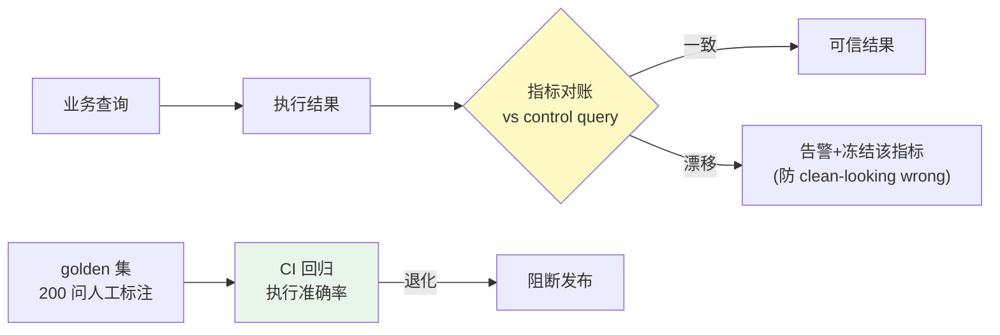

# 项目 10：数据智能分析平台 — 08-迭代七：数据质量与治理

> **定位**：防"clean-looking wrong answers"——指标对账 + 漂移检测 + 查询正确性评估。教程 32 §评估 + 教程 36 §数据飞轮的落地。本文给出**完整可手写代码**（一行不省略）。
>
> 「遇到阻塞？→ [教程 32-自我反思与Agent评估]、[教程 36-数据飞轮与持续改进]、[附录 04-测试策略/02-Eval评估]」

---

## 1. 四问

| 问 | 答 |
|----|----|
| **新增了什么需求** | 指标对账（CI 中与 control query 比对）；漂移检测告警；查询正确性评估集（CI 回归） |
| **影响了哪些模块** | 新增 `ReconciliationService`（对账）+ `ControlQueryStore`（分析师手写基准）+ `MetricFreezeService`（漂移冻结）+ `EvaluationService`（golden 回归）；与成本归因联动 |
| **架构如何演进** | 数据质量闭环：业务查询 → 指标对账 → 漂移冻结/可信结果；golden 集 CI 回归 → 退化阻断发布 |
| **上一版痛点是什么** | ① 结果不可信（口径/查询漂移）② 漂移难发现 ③ 无法评估查询质量 |

**v7 痛点 → 本迭代对策**：

| v7 痛点 | 本次迭代对策 |
|---------|-------------|
| 结果不可信（口径/查询漂移） | 指标对账：每个指标与手写 control query 对账 |
| 漂移难发现 | 漂移检测：捕获列改名/数据源停更/口径不再匹配 |
| 无法评估查询质量 | 查询正确性评估（golden set 回归） |

## 2. 目标与量化验收

| # | 验收项 | 标准 |
|---|--------|------|
| 1 | 对账覆盖 | 核心指标 100% 有 control query 对账 |
| 2 | 漂移捕获 | 注入"列改名"场景，1 天内被冻结告警 |
| 3 | golden 回归 | 200 问执行准确率 ≥ 90%（退化即阻断发布） |
| 4 | 冻结可见 | 漂移指标返回结果带"待复核"标注 |
| 5 | 无静默错 | 对账发现漂移后不返回未标注的可信结果 |

## 3. 数据质量闭环



**对账思想**：每个指标在 CI 里与手写 control query 对账，漂移检测捕获"列改名/数据源停更/指标不再匹配"——防"看起来对但实际错"的答案。

## 4. 完整代码（照抄即可，一行不省略）

### 4.1 `UserContext` 新增 `system()` 静态工厂

```java
// 在 UserContext（02 定义）上新增：
public record UserContext(String userId, String tenantId, String role, String region) {

    public static UserContext system() {
        return new UserContext("system", "tenant-sys", "admin", "east");
    }
}
```

### 4.2 `ReconciliationResult.java`

```java
package com.group.dataplat.quality;

import java.math.BigDecimal;

/** 对账结果：平台结果 vs control query 的相对差异。 */
public record ReconciliationResult(
        String metricId,
        boolean drifted,
        BigDecimal diff            // 相对差异（绝对值，0=一致）
) {
    public static ReconciliationResult ok(String metricId) {
        return new ReconciliationResult(metricId, false, BigDecimal.ZERO);
    }

    public static ReconciliationResult drifted(String metricId, BigDecimal diff) {
        return new ReconciliationResult(metricId, true, diff);
    }
}
```

### 4.3 `ControlQueryStore.java`（分析师手写的可信 SQL——对账基准）

```java
package com.group.dataplat.quality;

import org.springframework.jdbc.core.JdbcTemplate;
import org.springframework.stereotype.Component;

import java.math.BigDecimal;

/**
 * 分析师手写的可信 SQL——指标对账的基准（随口径变更同步维护）。
 */
@Component
public class ControlQueryStore {

    private final JdbcTemplate jdbcTemplate;

    public ControlQueryStore(JdbcTemplate jdbcTemplate) {
        this.jdbcTemplate = jdbcTemplate;
    }

    public BigDecimal execute(String metricId) {
        return switch (metricId) {
            case "gmv" -> jdbcTemplate.queryForObject("""
                    SELECT COALESCE(SUM(pay_amount), 0)
                    FROM orders
                    WHERE status = 'paid'
                      AND order_date >= date_trunc('month', CURRENT_DATE)
                    """, BigDecimal.class);
            case "order_count" -> jdbcTemplate.queryForObject("""
                    SELECT COUNT(*)
                    FROM orders
                    WHERE status = 'paid'
                      AND order_date >= date_trunc('month', CURRENT_DATE)
                    """, BigDecimal.class);
            default -> throw new IllegalArgumentException("无 control query: " + metricId);
        };
    }
}
```

### 4.4 `ReconciliationService.java`（指标对账）

```java
package com.group.dataplat.quality;

import com.group.dataplat.dto.QueryResult;
import com.group.dataplat.dto.UserContext;
import com.group.dataplat.semantic.SemanticLayerService;
import org.springframework.stereotype.Service;

import java.math.BigDecimal;
import java.math.RoundingMode;

/**
 * 指标对账：平台结果 vs 手写 control query，相对差异超阈值即"漂移"。
 * 漂移≠立即拒绝，而是进入冻结流程（防 clean-looking wrong）。
 */
@Service
public class ReconciliationService {

    private static final BigDecimal THRESHOLD = new BigDecimal("0.01");   // 1%

    private final SemanticLayerService semanticLayer;
    private final ControlQueryStore controlQueries;

    public ReconciliationService(SemanticLayerService semanticLayer,
                                 ControlQueryStore controlQueries) {
        this.semanticLayer = semanticLayer;
        this.controlQueries = controlQueries;
    }

    public ReconciliationResult reconcileMetric(String metricId, String timeRange) {
        BigDecimal aiResult = aiMetricValue(metricId, timeRange);
        BigDecimal control = controlQueries.execute(metricId);
        if (control.compareTo(BigDecimal.ZERO) == 0) {
            return ReconciliationResult.ok(metricId);   // 基准为 0 无法算相对差异
        }
        BigDecimal diff = aiResult.subtract(control).abs()
                .divide(control, 4, RoundingMode.HALF_UP);
        return diff.compareTo(THRESHOLD) > 0
                ? ReconciliationResult.drifted(metricId, diff)
                : ReconciliationResult.ok(metricId);
    }

    /** 取平台对指定指标返回的首个数值（语义层路径）。 */
    private BigDecimal aiMetricValue(String metricId, String timeRange) {
        QueryResult result = semanticLayer.answer(
                "查询指标 " + metricId + "，时间范围 " + timeRange,
                UserContext.system()).block();
        if (result.rows().isEmpty()) {
            return BigDecimal.ZERO;
        }
        Object first = result.rows().get(0).values().iterator().next();
        return new BigDecimal(String.valueOf(first));
    }
}
```

### 4.5 `MetricFreezeService.java` + `DriftAlerting.java`

```java
package com.group.dataplat.quality;

import org.springframework.stereotype.Service;

import java.util.Set;
import java.util.concurrent.ConcurrentHashMap;

/** 漂移指标冻结：从"自动编译"降级为"需人工确认"，不静默给错答案。 */
@Service
public class MetricFreezeService {

    private final Set<String> frozen = ConcurrentHashMap.newKeySet();

    public void freeze(String metricId) {
        frozen.add(metricId);
    }

    public void unfreeze(String metricId) {
        frozen.remove(metricId);
    }

    public boolean isFrozen(String metricId) {
        return frozen.contains(metricId);
    }
}
```

```java
package com.group.dataplat.quality;

import org.springframework.stereotype.Component;

@Component
public class DriftAlerting {

    public void warn(String title, ReconciliationResult r) {
        // 真实实现：钉钉 / 企业微信 / 邮件告警
        System.out.println("[ALERT] " + title + " metric=" + r.metricId()
                + " diff=" + r.diff() + " drifted=" + r.drifted());
    }
}
```

### 4.6 `ReconciliationScheduler.java`（定时对账 + 漂移冻结）

```java
package com.group.dataplat.quality;

import com.group.dataplat.semantic.MetricRegistry;
import org.springframework.scheduling.annotation.Scheduled;
import org.springframework.stereotype.Component;

import java.util.List;

/**
 * 定时对账（每日 2 点）+ 元数据变更触发（生产可在 DDL 钩子调用 reconcile）。
 */
@Component
public class ReconciliationScheduler {

    private final MetricRegistry metricRegistry;
    private final ReconciliationService reconciliation;
    private final MetricFreezeService freezeService;
    private final DriftAlerting alerting;

    public ReconciliationScheduler(MetricRegistry metricRegistry,
                                   ReconciliationService reconciliation,
                                   MetricFreezeService freezeService,
                                   DriftAlerting alerting) {
        this.metricRegistry = metricRegistry;
        this.reconciliation = reconciliation;
        this.freezeService = freezeService;
        this.alerting = alerting;
    }

    @Scheduled(cron = "0 0 2 * * *")
    public void dailyReconcileAll() {
        List<String> metricIds = metricRegistry.all().stream().map(m -> m.id()).toList();
        for (String metricId : metricIds) {
            ReconciliationResult r = reconciliation.reconcileMetric(metricId, "本月");
            if (r.drifted()) {
                freezeService.freeze(metricId);       // 冻结：语义层该指标降级为"需人工确认"
                alerting.warn("指标漂移", r);
            }
        }
    }
}
```

**冻结语义**：漂移指标从"自动编译"降级为"返回结果时标注'该指标口径待复核'"——不静默给错答案。

### 4.7 `GoldenCase.java` + `EvaluationSet.java`（golden 集）

```java
package com.group.dataplat.quality;

import java.math.BigDecimal;

/** golden 用例：人工标注的问题 + 期望 SQL + 期望数值结果。 */
public record GoldenCase(
        String question,
        String expectedSql,
        BigDecimal expectedValue
) {}
```

```java
package com.group.dataplat.quality;

import org.springframework.stereotype.Component;

import java.util.List;

/**
 * golden 集（200 问，人工标注 SQL + 期望结果）→ CI 每日回归。
 * 生产从文件/DB 加载；此处示例 2 条。
 */
@Component
public class EvaluationSet {

    public List<GoldenCase> all() {
        return List.of(
                new GoldenCase("华东 6 月 GMV 是多少",
                        "SELECT SUM(pay_amount) FROM orders WHERE status='paid' AND region='east' AND order_date BETWEEN DATE '2026-06-01' AND DATE '2026-06-30'",
                        new BigDecimal("199.00")),
                new GoldenCase("全国订单数",
                        "SELECT COUNT(*) FROM orders WHERE status='paid'",
                        new BigDecimal("3")));
    }
}
```

### 4.8 `EvaluationReport.java` + `EvaluationService.java`（golden 回归）

```java
package com.group.dataplat.quality;

/** 评估报告：通过/失败 + 通过率（退化即阻断发布）。 */
public record EvaluationReport(
        boolean passed,
        int total,
        int passCount,
        double passRate
) {
    public static EvaluationReport passed(int total, int pass, double rate) {
        return new EvaluationReport(true, total, pass, rate);
    }

    public static EvaluationReport failed(int total, int pass, double rate) {
        return new EvaluationReport(false, total, pass, rate);
    }
}
```

```java
package com.group.dataplat.quality;

import com.group.dataplat.dto.QueryResult;
import com.group.dataplat.dto.UserContext;
import com.group.dataplat.semantic.SemanticLayerService;
import org.springframework.stereotype.Service;

import java.math.BigDecimal;

/**
 * golden 集 CI 回归。数值型答案用"执行准确率"（计算事实正确性）——
 * 数字对了才是对，RAGAS 语义相似度不可用于数值答案。
 */
@Service
public class EvaluationService {

    private static final double MIN_PASS_RATE = 0.90;

    private final EvaluationSet goldenSet;
    private final SemanticLayerService semanticLayer;

    public EvaluationService(EvaluationSet goldenSet, SemanticLayerService semanticLayer) {
        this.goldenSet = goldenSet;
        this.semanticLayer = semanticLayer;
    }

    public EvaluationReport evaluate() {
        int total = goldenSet.all().size();
        int pass = 0;
        for (GoldenCase c : goldenSet.all()) {
            QueryResult r = semanticLayer.answer(c.question(), UserContext.system()).block();
            if (matchesExpected(r, c.expectedValue())) {
                pass++;
            }
        }
        double rate = pass / (double) total;
        return rate >= MIN_PASS_RATE
                ? EvaluationReport.passed(total, pass, rate)
                : EvaluationReport.failed(total, pass, rate);
    }

    /** 相对误差 < 0.1% 即算通过（浮点/取整容差）。 */
    private boolean matchesExpected(QueryResult result, BigDecimal expected) {
        if (result.rows().isEmpty()) {
            return false;
        }
        Object first = result.rows().get(0).values().iterator().next();
        BigDecimal actual = new BigDecimal(String.valueOf(first));
        return actual.subtract(expected).abs()
                .compareTo(expected.abs().multiply(new BigDecimal("0.001"))) <= 0;
    }
}
```

> 阻断发布：在 CI 里调用 `evaluationService.evaluate()`，`!report.passed()` 即 `System.exit(1)`（构建失败）。

## 5. ADR 演进决策

| # | 决策 | 理由 |
|---|------|------|
| ADR-524 | 指标 CI 对账 + 漂移冻结 | 防 clean-looking wrong；冻结比静默错安全 |
| ADR-525 | 数值用执行准确率评估 | 数字对才是对；语义相似度不可用于数值答案 |
| ADR-526 | golden 集 CI 回归阻断发布 | 查询质量是发布门禁 |

## 6. v8 的痛点（驱动下一迭代）

质量可控了，但**多部门上线暴露治理需求**：销售/财务/运营三个部门要隔离（各自指标、各自权限、各自查询策略），且改指标口径要灰度（先让一个部门试跑）。**需要多租户 + 灰度发布**。→ [09-迭代八-灰度发布与多租户.md](09-迭代八-灰度发布与多租户.md)
