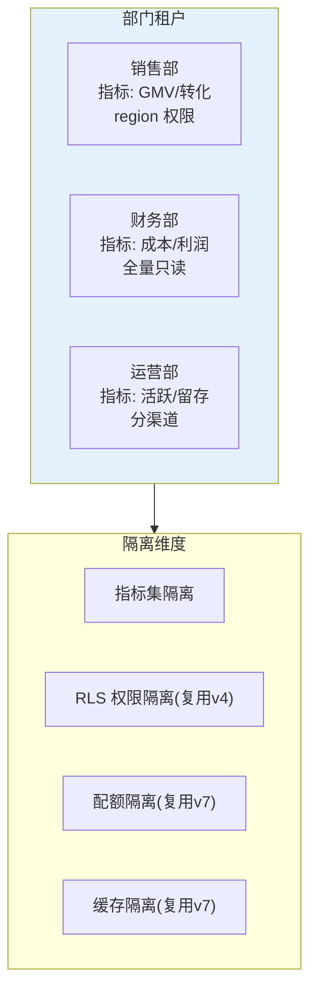
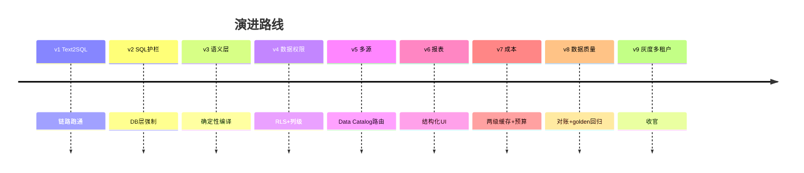

# 项目 10：数据智能分析平台 — 09-迭代八：灰度发布与多租户（收官）

> **定位**：收官迭代——多部门（销售/财务/运营）隔离的租户治理 + 指标口径/查询策略的灰度发布。教程 23 §灰度 + 教程 20 §多租户的落地。本文给出**完整可手写代码**（一行不省略）。
>
> 「遇到阻塞？→ [教程 29-灰度发布与版本管理]、[教程 26-多租户隔离与资源治理]」

---

## 1. 四问

| 问 | 答 |
|----|----|
| **新增了什么需求** | 部门租户隔离（指标/权限/配额）；指标口径灰度发布；查询策略 A/B；灰度自动回滚 |
| **影响了哪些模块** | 复用 v4 权限 + v7 成本的多租户框架，扩展到"部门租户"；新增 `DepartmentProperties`（部门指标集）+ `GrayscaleService`（灰度）+ `BucketService`（确定性分桶）+ `ExperimentRegistry`（实验台账） |
| **架构如何演进** | 租户从"默认单租户"升级为"部门多租户"：指标集/RLS/配额/缓存按部门隔离；口径变更为"试点→门禁→放量/回滚"的实验流程 |
| **上一版痛点是什么** | ① 多部门共享指标，口径冲突 ② 改口径全量生效有风险 ③ 查询策略无法 A/B |

**v8 痛点 → 本迭代对策**：

| v8 痛点 | 本次迭代对策 |
|---------|-------------|
| 多部门共享指标，口径冲突 | 部门级多租户：各自指标集、权限、查询策略 |
| 改口径全量生效有风险 | 指标口径灰度：先试点部门，指标门禁通过再全量 |
| 查询策略无法 A/B | 查询策略灰度（语义层版本对比） |

## 2. 目标与量化验收（项目收官验收）

| # | 验收项 | 标准 |
|---|--------|------|
| 1 | 部门隔离 | 销售部看不到财务指标/数据（指标集 + RLS 双隔离） |
| 2 | 口径灰度 | 试点部门改口径，golden 集门禁达标才放量 |
| 3 | 自动回滚 | 口径变更致 golden 通过率 < 92%，1 窗口内回滚 |
| 4 | 配额生效 | 各部门配额独立（销售爆不影响财务） |
| 5 | 灰度可见 | 每次口径/策略灰度有决策留痕（实验记录） |

## 3. 部门多租户



**复用而非新建**：部门租户 = 已有 RLS 权限 + 成本配额 + 缓存隔离的统一应用。新增的是**部门级指标集声明**与**灰度发布**。

## 4. 完整代码（照抄即可，一行不省略）

### 4.1 部门级指标声明 `application.yml` 新增

```yaml
departments:
  sales:
    metrics: [gmv, order_count, active_users]
    regions: [east, west]           # RLS 作用域（复用 v4）
    budget_tokens: 500000           # 配额（复用 v7）
  finance:
    metrics: [gmv, order_count]
    regions: [all]                  # 全量只读
    budget_tokens: 300000
  ops:
    metrics: [active_users]
    regions: [east]
    budget_tokens: 200000
```

### 4.2 `DepartmentProperties.java`（部门租户配置绑定）

```java
package com.group.dataplat.tenant;

import org.springframework.boot.context.properties.ConfigurationProperties;
import org.springframework.stereotype.Component;

import java.util.List;
import java.util.Map;

/**
 * 部门租户配置：指标集 / RLS 作用域 / Token 配额。
 * "all" 表示该部门对 region 无限制（全量只读，复用 v4 框架）。
 */
@ConfigurationProperties(prefix = "departments")
@Component
public class DepartmentProperties {

    private Map<String, Department> departments = Map.of();

    public Map<String, Department> getDepartments() {
        return departments;
    }

    public void setDepartments(Map<String, Department> departments) {
        this.departments = departments;
    }

    public static class Department {
        private List<String> metrics = List.of();
        private List<String> regions = List.of();
        private long budgetTokens = 100_000;

        public List<String> getMetrics() { return metrics; }
        public void setMetrics(List<String> metrics) { this.metrics = metrics; }
        public List<String> getRegions() { return regions; }
        public void setRegions(List<String> regions) { this.regions = regions; }
        public long getBudgetTokens() { return budgetTokens; }
        public void setBudgetTokens(long budgetTokens) { this.budgetTokens = budgetTokens; }
    }
}
```

> ⚠ 若 IDE 不自动提示配置绑定，可在 pom 加 `spring-boot-configuration-processor`（optional），非必须。

### 4.3 `MetricExperiment.java` + `ExperimentRegistry.java`（灰度实验台账）

```java
package com.group.dataplat.gray;

import com.group.dataplat.semantic.MetricDefinition;

import java.util.List;

/** 指标口径灰度实验：试点部门 + 门禁条件。 */
public record MetricExperiment(
        String metricId,
        MetricDefinition v2,            // 新口径定义
        List<String> pilotDepartments,  // 试点部门
        List<String> gates              // 门禁条件（如 "golden_pass_rate >= 0.92"）
) {}
```

```java
package com.group.dataplat.gray;

import org.springframework.stereotype.Component;

import java.util.List;
import java.util.concurrent.ConcurrentHashMap;
import java.util.concurrent.CopyOnWriteArrayList;

/** 活跃灰度实验台账（决策留痕：每次口径/策略灰度有实验记录）。 */
@Component
public class ExperimentRegistry {

    private final ConcurrentHashMap<String, MetricExperiment> active = new ConcurrentHashMap<>();

    public void start(MetricExperiment exp) {
        active.put(exp.metricId(), exp);
    }

    public void rollbackToBaseline(MetricExperiment exp) {
        active.remove(exp.metricId());
    }

    public List<MetricExperiment> active() {
        return new CopyOnWriteArrayList<>(active.values());
    }
}
```

### 4.4 `BucketService.java`（确定性分桶）

```java
package com.group.dataplat.gray;

import org.springframework.stereotype.Component;

import java.nio.charset.StandardCharsets;
import java.security.MessageDigest;
import java.security.NoSuchAlgorithmException;

/**
 * 确定性分桶：sha256 + floorMod（避开 abs(hashCode)%100 溢出，教程 23 §确定性分桶）。
 * 同部门同用户永远分到同一桶（幂等、可复现）。
 */
@Component
public class BucketService {

    public String bucketFor(String department, String userId) {
        long hash = sha256Long(department + ":" + userId);
        long bucket = Math.floorMod(hash, 100);
        return bucket < 50 ? "A" : "B";
    }

    private long sha256Long(String input) {
        try {
            MessageDigest digest = MessageDigest.getInstance("SHA-256");
            byte[] bytes = digest.digest(input.getBytes(StandardCharsets.UTF_8));
            long result = 0;
            for (int i = 0; i < 8; i++) {
                result = (result << 8) | (bytes[i] & 0xff);
            }
            return result;
        } catch (NoSuchAlgorithmException e) {
            throw new IllegalStateException("SHA-256 不可用", e);
        }
    }
}
```

### 4.5 `GrayAlerting.java`

```java
package com.group.dataplat.gray;

import org.springframework.stereotype.Component;

@Component
public class GrayAlerting {

    public void warn(String title, String metricId) {
        // 真实实现：告警通道
        System.out.println("[GRAY-ALERT] " + title + " metric=" + metricId);
    }
}
```

### 4.6 `GrayscaleService.java`（指标口径灰度：试点 → 门禁 → 放量/回滚）

```java
package com.group.dataplat.gray;

import com.group.dataplat.quality.EvaluationReport;
import com.group.dataplat.quality.EvaluationService;
import com.group.dataplat.semantic.MetricDefinition;
import com.group.dataplat.semantic.MetricRegistry;
import org.springframework.scheduling.annotation.Scheduled;
import org.springframework.stereotype.Service;

import java.util.List;

/**
 * 指标口径灰度：先试点部门，golden 门禁达标才放量；不达标自动回滚。
 * 复用 v8 的数据质量门禁（golden 集 + 对账）——口径变更是高风险变更，必须用评估数据而非感觉。
 */
@Service
public class GrayscaleService {

    private static final double GATE_PASS_RATE = 0.92;

    private final ExperimentRegistry experimentRegistry;
    private final EvaluationService evaluationService;
    private final MetricRegistry metricRegistry;
    private final GrayAlerting alerting;

    public GrayscaleService(ExperimentRegistry experimentRegistry,
                            EvaluationService evaluationService,
                            MetricRegistry metricRegistry,
                            GrayAlerting alerting) {
        this.experimentRegistry = experimentRegistry;
        this.evaluationService = evaluationService;
        this.metricRegistry = metricRegistry;
        this.alerting = alerting;
    }

    /** 口径变更：先试点部门（sales），对照 golden 集门禁。 */
    public void rolloutMetricChange(String metricId, MetricDefinition v2) {
        experimentRegistry.start(new MetricExperiment(
                metricId,
                v2,
                List.of("sales"),    // 试点部门
                List.of("golden_pass_rate >= 0.92", "reconcile_diff < 1%")));
    }

    /** 灰度 watchdog：试点部门门禁达标 → 放量；不达标 → 自动回滚（秒级切回基线）。 */
    @Scheduled(fixedDelay = 60_000)
    public void checkMetricExperiments() {
        for (MetricExperiment exp : experimentRegistry.active()) {
            EvaluationReport report = evaluationService.evaluate();   // v8 golden 回归复用
            if (report.passRate() >= GATE_PASS_RATE) {
                metricRegistry.register(exp.v2());                    // 放量：新口径进指标字典
                experimentRegistry.rollbackToBaseline(exp);           // 实验完成
            } else {
                experimentRegistry.rollbackToBaseline(exp);           // 口径切回基线（秒级）
                alerting.warn("指标灰度回滚", exp.metricId());
            }
        }
    }
}
```

**复用数据质量门禁**（v8 的 golden 集 + 对账）作为灰度门禁——口径变更是高风险变更，必须用评估数据而非感觉。

### 4.7 查询策略 A/B（语义层版本对比）

```java
// 语义层 join 图/指标 DSL 的 A/B：同部门 50/50 分桶，对比 golden 集通过率。
// 接入示意：
public String strategyVersion(String department, String userId) {
    return bucketService.bucketFor(department, userId);   // "A" | "B" 分桶
}
// 分到 B 桶的请求走"候选 DSL"（如新 join 图），与 A 桶的 baseline 对比 v8 评估通过率。
```

## 5. ADR 演进决策

| # | 决策 | 理由 |
|---|------|------|
| ADR-527 | 部门租户 = 指标集 + RLS + 配额 + 缓存的统一应用（复用 v4/v7） | 复用而非新建；新增的只是部门级指标集声明 |
| ADR-528 | 口径灰度走"试点→golden 门禁→放量/回滚"实验流程 | 口径变更是高风险变更，必须用评估数据而非感觉（复用 v8 门禁） |
| ADR-529 | 确定性分桶用 sha256 + floorMod | 幂等可复现；避开 abs(hashCode)%100 的溢出（教程 23） |

## 6. 项目 10 总结



九个迭代走完数据智能平台完整弧线：**能查 → 安全 → 准确（语义层）→ 隔离（权限）→ 会选（多源）→ 好看（报表）→ 省钱（成本）→ 可信（质量）→ 可治理（灰度多租户）**。26 条 ADR 中最有复用价值的三个：ADR-509（语义层确定性编译）、ADR-510（join 用预定义图）、ADR-524（指标对账防 clean-looking wrong）。

→ [10-核心代码讲解.md](10-核心代码讲解.md)
