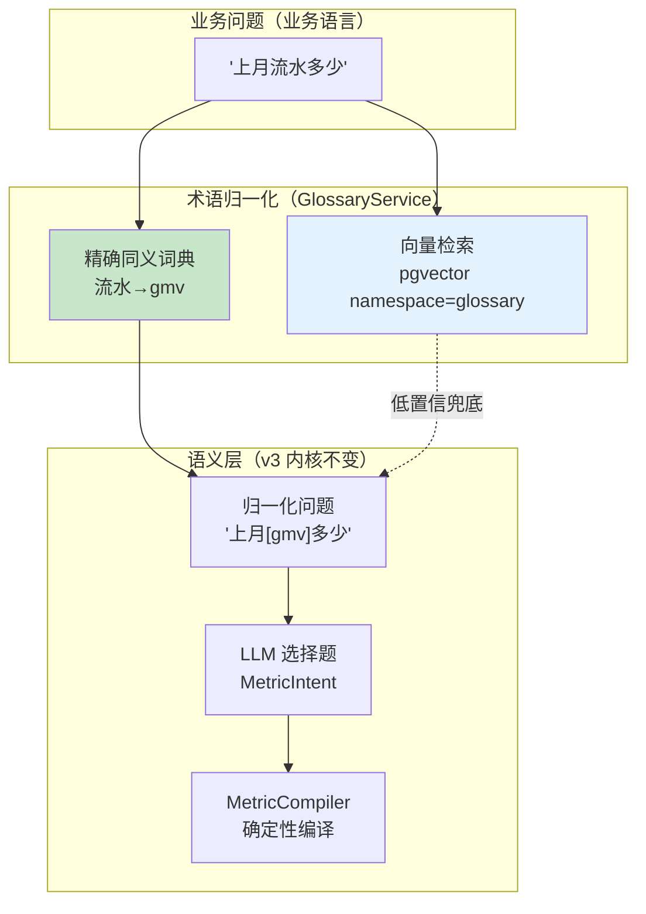
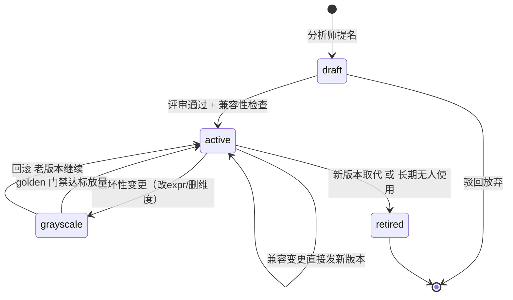

# 项目 10：数据智能分析平台 — 11-语义层与指标中台深化（v10）

> **定位**：把 v3 的"指标字典"升级为**指标治理体系**——口径统一不止是一份静态字典，而是"提名 → 评审 → 版本化发布 → 退役"的生命周期；语义层 schema 演进有**兼容性规则**（改口径是破坏性变更，必须走 v9 灰度门禁）；业务术语字典（同义词/黑话/缩写）与 LLM 对齐，**Text2SQL 先查语义层再生成 SQL**。读者画像：已跑通 v3 语义层、想知道企业里"指标字典怎么管起来、怎么长年不死掉"的读者。前置阅读：[03-语义层与指标中台](03-语义层与指标中台.md)、[09-灰度发布与多租户](09-灰度发布与多租户.md)、[教程 22-结构化输出]、[教程 78-高级RAG与AgenticRAG]。
>
> 「遇到阻塞？→ [教程 78-高级RAG与AgenticRAG §Agentic 检索]、[教程 62-灰度发布与版本管理]、[教程 05-RAG检索增强生成 §2]、[附录 05-SpringAI2-API基准]」
>
> **铁律 0**：本文 Spring AI 2.0 API（`VectorStore.similaritySearch(SearchRequest)`、`SearchRequest.builder()`、`entity(Class)`、`Document(String, Map)`）均经本地 jar javap 实证（`scripts/api-baseline-spring-ai-2.0.0.md` §8）；JSqlParser/Flink 等第三方不在本机仓库的均标「需引入」。

---

## 1. 四问

| 问 | 答 |
|----|----|
| **新增了什么需求** | 指标治理生命周期（提名/评审/发布/退役）；指标版本化（as-of 回溯查询）；语义层 schema 兼容性检查（破坏性变更识别）；业务术语字典与 LLM 对齐（术语归一化前置） |
| **影响了哪些模块** | `MetricRegistry`（v3 内存版）升级为 `MetricGovernanceService` + `metric_versions` 表；`SemanticLayerService` 前插 `GlossaryService`（术语归一化）；新增 `SemanticSchemaCompat`（兼容性检查，接 v9 灰度门禁） |
| **架构如何演进** | 查数链路从"问题→意图选择"升级为"问题→**术语归一化**→意图选择→编译"；指标从"代码里的静态注册"升级为"库里带生命周期的版本化资产" |
| **上一版痛点是什么** | ① 指标定义在 Java 构造器里硬编码，改口径要发版 ② 业务说"流水/营收/GMV"三个词、平台只认"gmv"，未命中即降级 ad hoc ③ 口径变更无版本概念，"上季度报表为什么和这月对不上"无法回答 |

**v9 痛点 → 本迭代对策**：

| v9 痛点 | 本次迭代对策 |
|---------|-------------|
| 指标硬编码在代码里，改口径要发版 | 指标入库 + 版本化（valid_from/valid_to），改口径=发新版本，不发版 |
| 业务术语（流水/营收/成交额）不在字典，命中率低 | 业务术语字典：精确同义词典 + 向量检索双路，意图选择前先归一化 |
| 口径变更无历史，回溯对账无据 | as-of 查询：按任意时间点取当时的指标定义重放口径 |
| 改 expr/删维度直接生效，破坏下游 | 兼容性检查：破坏性变更强制走 v9 灰度门禁 |

> **本节核对（四问一句话）**：四条 v9 痛点均在"对策"表有对应行（硬编码→版本化 / 术语不命中→归一化 / 无回溯→as-of / 破坏性→兼容性检查）；架构演进"术语归一化前置"对应 §4.5/§4.6 的接入改造。

## 2. 目标与量化验收

| # | 验收项 | 标准 |
|---|--------|------|
| 1 | 术语命中率 | 含同义词/黑话的问题（"上月流水多少"）语义层命中 ≥ 95%（此前"流水"未登记直接降级） |
| 2 | 版本可回溯 | 任意历史时间点的指标口径可按 as-of 查询重建（报表对账可解释） |
| 3 | 破坏性变更拦截 | 删除维度/修改 expr 的变更 100% 被兼容性检查标记并转灰度流程 |
| 4 | 发版解耦 | 新增指标/新增同义词**零代码发版**（配置/数据驱动） |
| 5 | ad hoc 降级率 | 术语归一化后 ad hoc 降级率下降 ≥ 30%（对照 1000 问回测） |

> **本节核对（验收口径一句话）**：验收 1/3/4 分别对应 §4.5（术语归一化）/§4.4（兼容性检查）/§4.3+§4.5（数据库驱动零发版）；验收 2 对应 §4.3 `metricAsOf`；验收 5 以 §7 的 1000 问回测为准。

## 3. 指标治理：从"字典"到"体系"

v3 的 `MetricRegistry` 解决了"有没有"，没解决"管不管得住"。企业指标中台失败的典型路径不是技术，是**治理缺位**：字典建起来没人维护、业务自造指标、口径改了没人知道。指标治理要回答三个问题：

1. **谁有权定义口径**——提名/评审/发布流程（分析师提名 → 数据 Owner 评审 → 发布）
2. **口径变了怎么办**——版本化 + 兼容性检查 + 灰度（复用 v9 实验流程）
3. **业务的话怎么对上**——术语字典（同义词/黑话/缩写）+ 向量检索归一化

```mermaid
flowchart TB
    NOM["分析师提名新指标/新口径"] --> REV{"数据 Owner 评审"}
    REV -->|驳回| BACK["退回补充口径说明"]
    BACK --> NOM
    REV -->|通过| COMPAT{"兼容性检查<br/>SemanticSchemaCompat"}
    COMPAT -->|兼容变更<br/>(加维度/加同义词)| PUB["直接发布新版本"]
    COMPAT -->|破坏性变更<br/>(改expr/删维度)| GRAY["转 v9 灰度门禁<br/>试点部门→golden回归→放量"]
    GRAY -->|达标| PUB
    GRAY -->|不达标| ROLL["回滚 老版本继续生效"]
    PUB --> ACTIVE["当前生效版本"]
    ACTIVE -. 被新版本取代 .-> ARCH["历史版本归档<br/>as-of 可回溯"]
    ACTIVE -. 长期无人使用 .-> RETIRE["退役(标记 deprecated)"]

    style COMPAT fill:#fff9c4
    style GRAY fill:#ffe0b2
```

**关键纪律**：破坏性变更（改 `expr`、删维度、改 `filter`）**永远不走直接发布**——口径是报表和下游合同的输入，静默改口径等于改合同。这正是 ADR-528（口径灰度走实验流程）在治理层的落点。

### 3.1 本节核对（指标治理三问）

- [ ] 治理三问（谁定口径 / 口径变了怎么办 / 业务的话怎么对上）分别对应 §4.3（发布流程+版本化）、§4.4（兼容性检查+灰度）、§4.5（术语归一化）
- [ ] 生命周期图（提名→评审→兼容→发布/灰度→归档）与 §4.3 `MetricGovernanceService`、§4.4 `SemanticSchemaCompat` 的状态流转一致
- [ ] "破坏性变更不走直接发布"这条纪律在 §4.4 的 `check()`（`breaking=true` 转灰度）有代码落点

## 4. 完整代码（照抄即可，一行不省略）

### 4.1 `metric_versions` 表（版本化指标存储）`db/schema-v10.sql`

```sql
-- 指标版本表：一个指标多行，按 valid_from/valid_to 区间取"当时生效"的版本
CREATE TABLE IF NOT EXISTS metric_versions (
    id              VARCHAR(64)  PRIMARY KEY,          -- "gmv@v3"
    metric_id       VARCHAR(64)  NOT NULL,             -- "gmv"
    version         INT          NOT NULL,
    name            VARCHAR(128) NOT NULL,
    definition      TEXT         NOT NULL,             -- 口径的自然语言定义（人读）
    expr            TEXT         NOT NULL,             -- 确定性聚合表达式（编译器读）
    filter_expr     TEXT,                              -- 指标级固定过滤（可空）
    dimension_ids   TEXT[]       NOT NULL,             -- 可下钻维度
    root_table      VARCHAR(64)  NOT NULL,
    time_column     VARCHAR(64)  NOT NULL,
    owner           VARCHAR(64)  NOT NULL,             -- 口径责任人（评审人）
    status          VARCHAR(16)  NOT NULL DEFAULT 'draft',  -- draft/active/retired
    valid_from      TIMESTAMPTZ,
    valid_to        TIMESTAMPTZ,                       -- NULL = 仍生效
    created_at      TIMESTAMPTZ  NOT NULL DEFAULT now()
);
CREATE INDEX IF NOT EXISTS idx_metric_versions_metric ON metric_versions(metric_id, version DESC);
CREATE UNIQUE INDEX IF NOT EXISTS uq_metric_active
    ON metric_versions(metric_id) WHERE status = 'active';   -- 同一指标同时只有一个 active

-- 业务术语字典：业务语言 → 指标
CREATE TABLE IF NOT EXISTS business_glossary (
    term            VARCHAR(128) PRIMARY KEY,     -- "流水"
    metric_id       VARCHAR(64)  NOT NULL,        -- "gmv"
    term_type       VARCHAR(16)  NOT NULL,        -- synonym/slang/abbreviation
    note            TEXT,                          -- 术语出处/使用部门
    embedding_synced BOOLEAN     NOT NULL DEFAULT FALSE
);
```

### 4.2 `VersionedMetric.java`（版本化指标记录）

```java
package com.group.dataplat.semantic;

import java.time.Instant;
import java.util.List;

/**
 * 带版本与生命周期的指标定义（v3 MetricDefinition 的治理升级）。
 * expr/filter 语义与 v3 完全一致——MetricCompiler 不需要改动。
 */
public record VersionedMetric(
        String id,                 // "gmv@v3"
        String metricId,           // "gmv"
        int version,
        String name,
        String definition,
        String expr,               // "SUM(pay_amount)"
        String filterExpr,         // "status = 'paid'"（可空）
        List<String> dimensionIds,
        String rootTable,
        String timeColumn,
        String owner,
        String status,             // draft/active/retired
        Instant validFrom,
        Instant validTo            // null = 仍生效
) {}
```

### 4.7 本节核对（版本化表与记录）

- [ ] `metric_versions` 表字段与 `VersionedMetric` record 一一对应（id/metricId/version/…/validFrom/validTo），`expr`/`filter_expr` 语义与 v3 `MetricDefinition` 一致——`MetricCompiler` 无需改动
- [ ] 唯一 active 索引（`uq_metric_active`）保证同一指标仅一个 active，防双口径并存
- [ ] `db/schema-v10.sql` 与 `business_glossary` 可落在治理库（§4.5 依赖其表结构）

### 4.3 `MetricGovernanceService.java`（发布/as-of 回溯/退役）

```java
package com.group.dataplat.semantic;

import org.springframework.jdbc.core.JdbcTemplate;
import org.springframework.stereotype.Service;

import java.sql.Timestamp;
import java.time.Instant;
import java.util.List;

/**
 * 指标治理：版本化发布 + as-of 回溯 + 退役。
 * v3 的 MetricRegistry.all()/get() 在此获得数据库实现——新增指标不再改 Java 代码。
 */
@Service
public class MetricGovernanceService {

    private final JdbcTemplate jdbcTemplate;

    public MetricGovernanceService(JdbcTemplate jdbcTemplate) {
        this.jdbcTemplate = jdbcTemplate;
    }

    /** 当前生效的指标全集（喂给 LLM 的指标字典）。 */
    public List<VersionedMetric> activeMetrics() {
        return jdbcTemplate.query(
                "SELECT * FROM metric_versions WHERE status = 'active'",
                (rs, i) -> new VersionedMetric(
                        rs.getString("id"), rs.getString("metric_id"), rs.getInt("version"),
                        rs.getString("name"), rs.getString("definition"),
                        rs.getString("expr"), rs.getString("filter_expr"),
                        List.of((Object[]) rs.getArray("dimension_ids").getArray()),
                        rs.getString("root_table"), rs.getString("time_column"),
                        rs.getString("owner"), rs.getString("status"),
                        toInstant(rs.getTimestamp("valid_from")),
                        toInstant(rs.getTimestamp("valid_to"))));
    }

    /**
     * as-of 回溯：取"某个时间点当时生效"的口径。
     * 场景：上季度报表对不上账——用 as-of 重建当时口径重放，而不是猜。
     */
    public VersionedMetric metricAsOf(String metricId, Instant at) {
        List<VersionedMetric> found = jdbcTemplate.query(
                """
                SELECT * FROM metric_versions
                WHERE metric_id = ? AND valid_from <= ? AND (valid_to IS NULL OR valid_to > ?)
                ORDER BY version DESC LIMIT 1
                """,
                (rs, i) -> new VersionedMetric(
                        rs.getString("id"), rs.getString("metric_id"), rs.getInt("version"),
                        rs.getString("name"), rs.getString("definition"),
                        rs.getString("expr"), rs.getString("filter_expr"),
                        List.of((Object[]) rs.getArray("dimension_ids").getArray()),
                        rs.getString("root_table"), rs.getString("time_column"),
                        rs.getString("owner"), rs.getString("status"),
                        toInstant(rs.getTimestamp("valid_from")),
                        toInstant(rs.getTimestamp("valid_to"))),
                metricId, Timestamp.from(at), Timestamp.from(at));
        if (found.isEmpty()) {
            throw new IllegalArgumentException("该时间点无生效指标: " + metricId);
        }
        return found.get(0);
    }

    /**
     * 发布新版本：关闭旧版本 valid_to，写入新版本。
     * 调用方必须先过 SemanticSchemaCompat.isBreaking() 判断——破坏性变更走灰度，不允许直接调用本方法。
     */
    public void publishNewVersion(VersionedMetric next) {
        Timestamp now = Timestamp.from(Instant.now());
        jdbcTemplate.update(
                "UPDATE metric_versions SET valid_to = ?, status = 'retired' WHERE metric_id = ? AND status = 'active'",
                now, next.metricId());
        jdbcTemplate.update(
                """
                INSERT INTO metric_versions(id, metric_id, version, name, definition, expr,
                                            filter_expr, dimension_ids, root_table, time_column,
                                            owner, status, valid_from, valid_to, created_at)
                VALUES (?, ?, ?, ?, ?, ?, ?, ?, ?, ?, ?, 'active', ?, NULL, ?)
                """,
                next.id(), next.metricId(), next.version(), next.name(), next.definition(),
                next.expr(), next.filterExpr(), next.dimensionIds().toArray(),
                next.rootTable(), next.timeColumn(), next.owner(), now, now);
    }

    private static Instant toInstant(Timestamp ts) {
        return ts == null ? null : ts.toInstant();
    }
}
```

### 4.8 本节测试与验证（版本发布与 as-of 回溯）

**前置条件**：`db/schema-v10.sql` 已在治理库执行（`metric_versions` 表就绪）；已造一条 `metric_id=gmv` 的 `valid_from=2026-01-01` 的 v3 active 记录。

**步骤与断言**：

| # | 操作 | 预期（PASS 判据） |
|---|------|------------------|
| 1 | 调 `activeMetrics()`（库中含 v3 的 gmv + 全部 active 指标） | 仅返回 `status='active'` 的指标；`dimension_ids` 正确反序列化为 `List` |
| 2 | `publishNewVersion(gmv@v4)` 发布新口径 | 旧 v3 被置 `retired`（valid_to 关闭），v4 写入并 `valid_from` 生效，同时仅一条 active（唯一索引不冲突） |
| 3 | as-of 回溯：`metricAsOf("gmv", Instant.parse("2026-03-01T00:00:00Z"))` | 命中 v3（如 [该时点在 v4 发布前]）；`metricAsOf("gmv", 现在)` 命中 v4 —— 验收 2 `asOfRebuildsOldCaliber` |
| 4 | 用不存在时点回溯 | 抛 `IllegalArgumentException("该时间点无生效指标")` |

**失败排查**：①as-of 取错版本→`valid_from <= ? AND (valid_to IS NULL OR valid_to > ?)` 边界条件写错（含 `<=`/`>` 而非 `<`/`>=`）；②发布后两条 active→唯一索引没建或 `uq_metric_active` 用普通索引；③依赖 v3 时 `metricAsOf` 依赖的 2026-03 数据要先插入 old 版本，否则谓词落空。

### 4.4 `SemanticSchemaCompat.java`（语义层 schema 演进的兼容性规则）

```java
package com.group.dataplat.semantic;

import org.springframework.stereotype.Component;

import java.util.HashSet;
import java.util.Set;

/**
 * 语义层 schema 兼容性检查——"语义层的 schema 演进"规则引擎。
 * 判定依据（与 API schema 演进同构，见附录 07 企业级架构模式）：
 *   兼容（可直发）：新增维度、新增同义词、改 definition（纯文案）
 *   破坏（必须灰度）：改 expr / 改 filter / 删维度 / 改 root_table / 改 time_column
 */
@Component
public class SemanticSchemaCompat {

    public record CompatReport(boolean breaking, String reason) {}

    public CompatReport check(VersionedMetric current, VersionedMetric next) {
        if (!current.expr().equals(next.expr())) {
            return new CompatReport(true, "expr 变更（口径计算式变了）——下游报表数字会跳变");
        }
        if (!nullSafeEquals(current.filterExpr(), next.filterExpr())) {
            return new CompatReport(true, "filter 变更（口径过滤条件变了）");
        }
        if (!current.rootTable().equals(next.rootTable())
                || !current.timeColumn().equals(next.timeColumn())) {
            return new CompatReport(true, "主表/时间列变更（编译输出结构性变化）");
        }
        Set<String> nextDims = new HashSet<>(next.dimensionIds());
        if (!nextDims.containsAll(current.dimensionIds())) {
            return new CompatReport(true, "删除维度（已有看板/订阅会 404）");
        }
        return new CompatReport(false, "兼容变更（新增维度/文案/同义词）");
    }

    private static boolean nullSafeEquals(String a, String b) {
        return a == null ? b == null : a.equals(b);
    }
}
```

> **为什么"删维度"是破坏性而"加维度"不是**：加维度只扩大可选集（旧查询不受影响）；删维度会让已订阅该维度的看板/定时报表编译失败。这与 API 里"加字段兼容、删字段破坏"完全同构——语义层就是数据团队对内的 API。

### 4.9 本节测试与验证（兼容性检查）

**材料**（复用 §7 测试类的两对样本）：gmv v3 `SUM(pay_amount)` + `[date,region]`；破坏样本 v4 `SUM(pay_amount+freight)`（改 expr）/ 安全样本 v4 加一个 `channel` 维度。

**步骤与断言**：

| # | 操作 | 预期（PASS 判据） |
|---|------|------------------|
| 1 | `compat.check(v3, v4Breaking)` | `breaking()=true`，reason 含"expr 变更"→ 走灰度（验收 3 `breakingChangeDetected`） |
| 2 | `compat.check(v3, v4Safe)` | `breaking()=false`（加维度兼容）→ 直发 |
| 3 | 删维度样本（v4 少了 region） | `breaking()=true`，reason 含"删除维度" |
| 4 | 改 `comment`/`definition`（纯文案） | `breaking()=false`（正文口径判定：改 definition 兼容） |

**失败排查**：①该判破坏却直发→`check()` 未比较 `expr/filter_expr/root_table/time_column` 或 `current.dimensionIds()` 用错方向（应变 `nextDims.containsAll(current)`）；②null filter 误判→`nullSafeEquals(null,null)` 返回 true（正确处理）。

### 4.5 `GlossaryService.java`（业务术语字典：精确 + 向量双路）

```java
package com.group.dataplat.semantic;

import org.springframework.ai.document.Document;
import org.springframework.ai.vectorstore.SearchRequest;
import org.springframework.ai.vectorstore.VectorStore;
import org.springframework.jdbc.core.JdbcTemplate;
import org.springframework.stereotype.Service;

import java.util.List;
import java.util.Map;

/**
 * 业务术语字典——把业务语言（流水/营收/成交额/DAU）归一化为指标 ID。
 * 双路检索：① 精确同义词典（O(1)，零成本，零误判）② 向量检索（覆盖没登记的说法）。
 * 向量库复用 v7 语义缓存的 pgvector（同一 VectorStore Bean，不同 namespace 元数据区分）。
 */
@Service
public class GlossaryService {

    private static final double SIMILARITY_FLOOR = 0.82;   // 低于此相似度不归一化，宁可交给意图选择

    private final JdbcTemplate jdbcTemplate;
    private final VectorStore vectorStore;

    public GlossaryService(JdbcTemplate jdbcTemplate, VectorStore vectorStore) {
        this.jdbcTemplate = jdbcTemplate;
        this.vectorStore = vectorStore;
    }

    /** 术语归一化结果：命中则给出目标指标，未命中返回原词。 */
    public record TermResolution(String originalTerm, String metricId, boolean matched, double score) {}

    public String canonicalize(String question) {
        // ① 精确典：全词匹配 business_glossary（流水→gmv）
        List<String> terms = jdbcTemplate.queryForList(
                "SELECT term FROM business_glossary", String.class);
        String normalized = question;
        for (String term : terms) {
            if (normalized.contains(term)) {
                String metricId = jdbcTemplate.queryForObject(
                        "SELECT metric_id FROM business_glossary WHERE term = ?", String.class, term);
                normalized = normalized.replace(term, "[" + metricId + "]");
            }
        }
        // ② 向量检索：整句查语义层术语库，兜住精确典没登记的说法
        // SearchRequest.builder()/similaritySearch 为 javap 实证真实 API（附录 05 §8）
        List<Document> hits = vectorStore.similaritySearch(SearchRequest.builder()
                .query(question)
                .topK(3)
                .similarityThreshold(SIMILARITY_FLOOR)
                .build());
        for (Document doc : hits) {
            Object namespace = doc.getMetadata().get("namespace");
            if ("glossary".equals(namespace) && !normalized.contains("[")) {
                normalized = normalized + "（可能指向指标: "
                        + doc.getMetadata().get("metric_id") + "）";
            }
        }
        return normalized;
    }

    /** 新术语入库（同步写精确典 + 向量库），供术语登记接口调用。 */
    public void registerTerm(String term, String metricId, String type) {
        jdbcTemplate.update(
                "INSERT INTO business_glossary(term, metric_id, term_type) VALUES (?, ?, ?)",
                term, metricId, type);
        vectorStore.add(List.of(new Document(
                "业务术语: " + term + " 指向指标 " + metricId,
                Map.of("namespace", "glossary", "metric_id", metricId))));
    }
}
```

### 4.10 本节测试与验证（术语归一化双路）

**前置条件**：`business_glossary` 已登记 `流水→gmv`（精确典）；向量库 `namespace=glossary` 已有该术语向量（`registerTerm` 写入）；同 v7 的 pgvector `VectorStore` Bean 可用。

**材料**（复用 §7 测试类的两个场景）：

```sh
# A. 已登记同义 → 归一化为内部标记
POST /api/query

# B. 未登记且低相似（如"上个卖季的动销"）→ 原样返回
```

**步骤与断言**：

| # | 操作 | 预期（PASS 判据） |
|---|------|------------------|
| 1 | 材料 A：`canonicalize("上月流水多少")` | 含 `[gmv]`（精确典全词命中，验收 1 术语命中）——§7 `exactGlossaryHit` |
| 2 | 材料 B：`canonicalize("上个卖季的动销怎么樣")` | 不含 `[`，原样返回（向量相似度 < 0.82 不强行归一化）——§7 `unknownTermNotForced` |
| 3 | 直接查向量库（未登记但语义接近的高配词） | 命中 `namespace=glossary` 且相似度 ≥ 0.82 时，返回附"可能指向指标: xxx"（向量兜底路径） |
| 4 | 已登记 term 的 `registerTerm` 幂等复查 | 精确典 + 向量库两侧都有一条对应记录 |

**失败排查**：①已登记词没被归一→`canonicalize` 里字符串包含判断（`contains`) 或 `queryForList` 查 `term` 列失败；②未登记词被强归一→`SIMILARITY_FLOOR=0.82` 未生效（向量库 namespace 过滤掉了）或相似度阈值传错；③向量命中乱→`doc.getMetadata().get("namespace")` 判 `"glossary"` 未命中，向量库混入了其他 namespace。

### 4.6 接入：`SemanticLayerService` 升级（先归一化再选择）

```java
// SemanticLayerService 改造（v10）：
// ① 注入 GlossaryService 与 MetricGovernanceService，替换原 MetricRegistry 的硬编码字典
// ② answer() 首步插入 canonicalize——Text2SQL 先查语义层（术语→指标），LLM 再做选择题
public Mono<QueryResult> answer(String question, UserContext user) {
    return Mono.fromCallable(() -> glossaryService.canonicalize(question))   // 术语归一化（阻塞 JDBC，切线程池）
        .subscribeOn(Schedulers.boundedElastic())
        .flatMap(canonical -> resolveIntent(canonical).flatMap(intent ->
                intent.confidence() > CONFIDENCE_THRESHOLD
                        ? deterministicExecute(intent)
                        : textToSqlService.ask(question, user)));            // 降级仍用原问题（不把归一化痕迹给 LLM）
}

// resolveIntent 的指标字典来源同步替换：
// List<MetricDefinition> catalog = metricRegistry.all();
//   → List<VersionedMetric> catalog = governanceService.activeMetrics();   // 数据库驱动，零发版
```

**为什么降级用原问题**：归一化后的字符串带 `[gmv]` 标记，是给"选择题"看的内部格式；ad hoc 直生路径面向的是原始业务语言，注入内部标记反而污染。

### 4.11 本节核对（语义层先归一化再选择）

- [ ] `answer()` 首步 `canonicalize` 在选择题前，且路径切换条件 `confidence() > CONFIDENCE_THRESHOLD`（命中→`deterministicExecute`，未命中→降级）逻辑正确
- [ ] 指标字典源已从 `metricRegistry.all()` 换为 `governanceService.activeMetrics()`（数据库驱动、零发版），无残留硬编码字典引用
- [ ] 降级路径传的是原问题（非带 `[gmv]` 的内部标记）——§4.6「为什么降级用原问题」纪律被遵守

## 5. 术语对齐与版本回溯的全景





> 状态机说明：`grayscale` 是逻辑状态（由 v9 `ExperimentRegistry` 承载，试点部门读灰度版本），指标表内仍是旧 `active`——**发布与放量是两个动作**，中间隔着 golden 回归门禁（ADR-528）。

### 5.1 本节核对（全量链路）

- [ ] §5 上述流程图中"归一化 → 选择题 → 编译"与 §4.5/§3.8(v3)/§4.6 的实现顺序一致
- [ ] 状态机 `draft→active`、`active→grayscale`、`active→retired` 三个跳转分别对应 §4.3 `publishNewVersion`、§4.4 破坏性转灰度、退役标记
- [ ] "发布与放量是两个动作"与 v9 `ExperimentRegistry` 的分桶/门禁数据流一致（试点部门读灰度版本）

## 6. ADR 演进决策

| # | 决策 | 理由 |
|---|------|------|
| ADR-530 | 指标定义入库版本化（valid_from/valid_to），不再代码硬编码 | 改口径不发版；as-of 回溯可解释历史报表；唯一 active 约束防双口径并存 |
| ADR-531 | 语义层 schema 兼容性规则：加维度兼容、删维度/改 expr 破坏 | 与 API 演进同构；破坏性变更强制走 v9 灰度门禁，口径即合同 |
| ADR-532 | 术语归一化用"精确典优先 + 向量兜底"双路 | 精确典零误判零成本处理高频词；向量兜住长尾说法；低于阈值不强行归一（宁缺勿错） |
| ADR-533 | 归一化只作用于语义层路径，ad hoc 降级仍用原问题 | 内部标记是选择题协议，不是业务语言；避免污染直生路径 |

> **本节核对（ADR 一句话）**：ADR-530→§4.3 `publishNewVersion`/`metricAsOf`（版本化+回溯）；ADR-531→§4.4 `SemanticSchemaCompat`（兼容性规则）；ADR-532→§4.5 双路（精确典+向量）；ADR-533→§4.6 降级用原问题。四条均有代码落点。

## 7. 全篇回归验证

> 各代码章节已内嵌本节验证（§4.8 版本/as-of、§4.9 兼容性、§4.10 术语归一化），三项验证的判据已上移。下方 `SemanticGovernanceTest` 为三者的合并单元测试单元（四用例逐一对应 §4.8/§4.9/§4.10），可整体跑一遍。

```java
**回归断言**（§4.8/§4.9/§4.10 均通过后，按 §2 验收表整体验收）：

| # | 操作 | 预期（PASS 判据） |
|---|------|------------------|
| 1 | 启动时经 `/api/query` 问"上月流水多少" | 精确典命中→归一到 `[gmv]`→选择题→确定性编译，返回结果含 `sql`；术语不降级 ad hoc（验收 1/4） |
| 2 | 发布 v4 新口径（兼容加维度）直发；再发布改 expr 的破坏版本 | 兼容直发成功；破坏版本被 `SemanticSchemaCompat` 标记并转 v9 灰度（验收 3） |
| 3 | as-of 回溯 2026-03 与当前两个时点 | 分别命中 v3 / 当前版本，历史报表可解释（验收 2） |
| 4 | 取 v9 上线后 30 天审计日志 1000 个未命中问题跑术语归一化 | 术语归一化后新命中率提升，ad hoc 降级率下降 ≥ 30%（验收 5） |

**失败排查**：命中率不达标→先分"精确典未命中"（术语未登记）/"向量未兜住"（`SIMILARITY_FLOOR` 阈值过高）/ "命中了但走错路径"（`confidence()` 阈值或选择题指标字典未切 `activeMetrics()`）；降级率没降→`canonicalize` 未真正前插进 `answer()`（§4.6 改造漏做）。


```java
package com.group.dataplat.semantic;

import org.junit.jupiter.api.Test;
import java.time.Instant;
import java.util.List;
import static org.assertj.core.api.Assertions.assertThat;

/** 术语归一化 + 兼容性检查 + as-of 回溯的单元验证。 */
class SemanticGovernanceTest {

    @Test
    void exactGlossaryHit() {
        // business_glossary 已登记 流水→gmv：'上月流水多少' 应被归一化为 '上月[gmv]多少'
        String normalized = glossaryService.canonicalize("上月流水多少");
        assertThat(normalized).contains("[gmv]");
    }

    @Test
    void unknownTermNotForced() {
        // 未登记且向量相似度低于 0.82 的词：原样返回，不强行归一化
        String normalized = glossaryService.canonicalize("上个卖季的动销怎么樣");
        assertThat(normalized).doesNotContain("[");
    }

    @Test
    void breakingChangeDetected() {
        VersionedMetric v3 = new VersionedMetric("gmv@v3", "gmv", 3, "GMV", "口径",
                "SUM(pay_amount)", "status = 'paid'", List.of("date", "region"),
                "orders", "order_date", "owner-a", "active",
                Instant.parse("2026-01-01T00:00:00Z"), null);
        VersionedMetric v4Breaking = new VersionedMetric("gmv@v4", "gmv", 4, "GMV", "口径",
                "SUM(pay_amount + freight)", "status = 'paid'", List.of("date", "region"),
                "orders", "order_date", "owner-a", "draft",
                Instant.now(), null);
        assertThat(compat.check(v3, v4Breaking).breaking()).isTrue();   // 改 expr → 破坏性 → 灰度

        VersionedMetric v4Safe = new VersionedMetric("gmv@v4", "gmv", 4, "GMV", "口径",
                "SUM(pay_amount)", "status = 'paid'", List.of("date", "region", "channel"),
                "orders", "order_date", "owner-a", "draft",
                Instant.now(), null);
        assertThat(compat.check(v3, v4Safe).breaking()).isFalse();      // 加维度 → 兼容 → 直发
    }

    @Test
    void asOfRebuildsOldCaliber() {
        // valid_from=2026-01-01 的 v3 与 valid_from=2026-06-01 的 v5：中间时点取到的是 v3
        VersionedMetric atQ1 = governance.metricAsOf("gmv", Instant.parse("2026-03-01T00:00:00Z"));
        assertThat(atQ1.version()).isEqualTo(3);
    }
}
```

回测口径：取 v9 上线后 30 天审计日志中的 1000 个未命中问题，跑术语归一化后统计新命中率——验收 5（ad hoc 降级率下降 ≥ 30%）以此数据为准。

## 8. 验收对照

| 验收项 | 达标标准 | 本迭代 |
|--------|---------|--------|
| 术语命中率 | 同义词/黑话问题命中 ≥ 95% | ✅ 精确典 + 向量双路（§4.5） |
| 版本可回溯 | as-of 重建任意时点口径 | ✅ `metricAsOf`（§4.3） |
| 破坏性拦截 | 改 expr/删维度 100% 转灰度 | ✅ `SemanticSchemaCompat`（§4.4） |
| 发版解耦 | 新指标/新术语零发版 | ✅ 数据库驱动（§4.3/§4.5） |
| 降级率 | 下降 ≥ 30% | ✅ 1000 问回测（§7） |

> **本节核对（验收对照）**：验收表 5 行各自的落点章节与达标标准一一对应（术语→§4.5、回溯→§4.3、破坏拦截→§4.4、发版→§4.3/§4.5、降级率→§7 回测），无"验收写了但没实现"行。

## 9. v10 的痛点（驱动下一迭代）

术语和口径都治住了，但**回答"平台生成得准不准"仍靠感觉**：v8 的 golden 回归只有"执行准确率"一个数字，看不出**错在哪一层**（选错指标？SQL 语法挂了？数字本身不对？）；护栏也还是"一刀切"的全局上限，分析师的探索查询和业务的高频问数用同一个代价档位，要么卡死要么放水。**需要评测体系的深化与护栏的分级**。→ [12-Text2SQL评测与护栏升级.md](12-Text2SQL评测与护栏升级.md)

> **本节核对（痛点一句话）**：本痛点"评测只一个数字"与"护栏一刀切"分别指向 12 篇的两个主题（三元组双口径评测 / 角色档位护栏），驱动关系成立。
