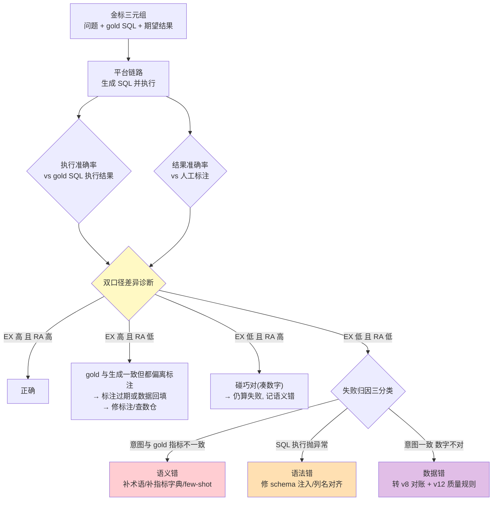
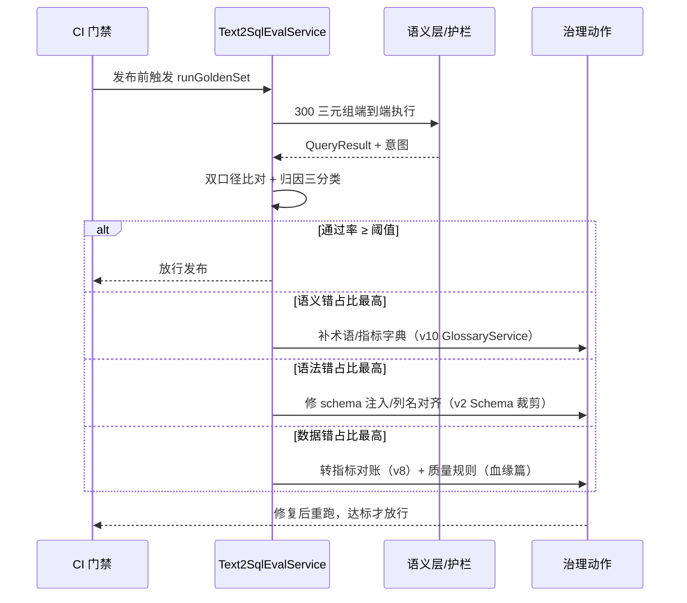
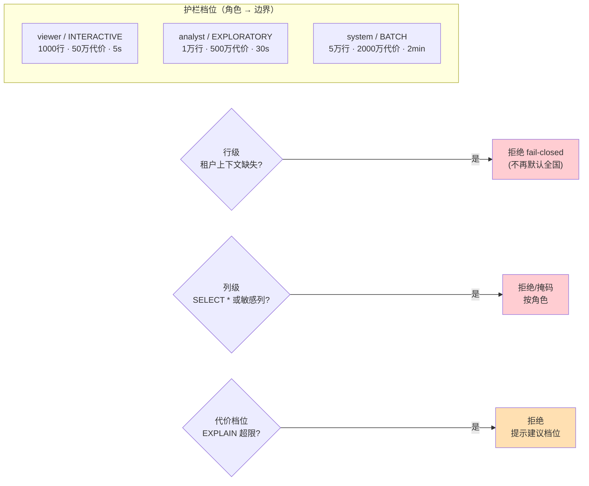

# 项目 10：数据智能分析平台 — 12-Text2SQL评测与护栏升级（v11）

> **定位**：把 v8 的"执行准确率一个数字"升级为**金标三元组评测体系**（问题-SQL-结果），区分**执行准确率 vs 结果准确率**两把尺子；护栏从"一刀切"升级为**行级/列级/代价上限三深化 + 角色档位**；失败归因（语义错/语法错/数据错）驱动"归因 → 优化 → 回归"闭环。官方 `Evaluator`（RelevancyEvaluator）用于**答案质量层**，数值正确性仍坚持确定性比对。读者画像：想知道"Text2SQL 到底准不准、错在哪、怎么改"的读者。前置阅读：[08-迭代七-数据质量与治理](08-迭代七-数据质量与治理.md)、[02-迭代一-SQL安全护栏](02-迭代一-SQL安全护栏.md)、[教程 37-自我反思与Agent评估]。
>
> 「遇到阻塞？→ [教程 37-自我反思与Agent评估]、[教程 41-数据飞轮与持续改进]、[附录 04-测试策略/02-Eval评估]、[附录 12-评估与可观测生态]」
>
> **铁律 0**：`Evaluator`/`EvaluationRequest`/`EvaluationResponse`/`RelevancyEvaluator.builder().chatClientBuilder(...)` 均经本地 jar javap 实证（`scripts/api-baseline-spring-ai-2.0.0.md` §17）；数值评测为项目自研确定性比对，不依赖 LLM。

---

## 1. 四问

| 问 | 答 |
|----|----|
| **新增了什么需求** | 金标三元组评测集（问题/gold SQL/期望结果）；执行准确率与结果准确率双口径；失败归因三分类（语义/语法/数据）；护栏深化（行级 fail-closed、列级 SELECT * 拦截、代价档位分级）；官方 Evaluator 评答案叙事层 |
| **影响了哪些模块** | `EvaluationService`（v8）升级为 `Text2SqlEvalService`（三元组 + 归因）；`QueryGuardService`（v2）升级为 `TieredQueryGuardService`（档位）；新增 `ResultComparator`（确定性结果比对）与 `AnswerQualityEvaluator`（官方 Evaluator） |
| **架构如何演进** | 评测从"回归门禁的一个数字"升级为"归因驱动的优化闭环"；护栏从全局常量升级为"角色 → 档位 → 三重深化"的策略对象 |
| **上一版痛点是什么** | ① 准确率只有一个数字，看不出错在哪层 ② 护栏全局一刀切，分析师探索被卡、高频问数被放 ③ v6 报表的叙事文本无人评估（数字对了话术跑题没人管） |

**v10 痛点 → 本迭代对策**：

| v10 痛点 | 本次迭代对策 |
|---------|-------------|
| 准确率一个数字，无法定位错误层 | 三元组 + 双口径（执行/结果）+ 归因三分类 |
| 护栏一刀切 | 角色档位（INTERACTIVE/EXPLORATORY/BATCH）+ 行/列/代价三深化 |
| 答案叙事质量无人评估 | 官方 `RelevancyEvaluator`（LLM-as-Judge 只管叙事层，数值仍确定性） |

## 2. 目标与量化验收

| # | 验收项 | 标准 |
|---|--------|------|
| 1 | 评测集规模 | 金标三元组 ≥ 300 条，覆盖语义层命中与 ad hoc 降级两类路径 |
| 2 | 双口径 | 执行准确率与结果准确率分开报告，差异样本 100% 人工复核 |
| 3 | 归因闭环 | 每个失败样本给出三分类归因；归因 → 优化动作（补术语/修 schema/转对账）可追踪 |
| 4 | 护栏分级 | 业务角色 P99 被误卡率 < 1%；分析师探索档代价上限为业务档 10 倍 |
| 5 | 列级拦截 | `SELECT *` 与含敏感列的 ad hoc SQL 100% 被拦截或脱敏 |
| 6 | 叙事质量 | 报表叙事层 Relevancy 通过率 ≥ 90%（抽检 100 条） |

## 3. 为什么需要两把尺子：执行准确率 vs 结果准确率

Text2SQL 评测的两个经典口径（Spider/BIRD 基准沿用，见 [前沿 03-Agent评测基准]）在本项目落地为：

| 口径 | 比对对象 | 能发现什么 | 盲区 |
|------|---------|-----------|------|
| **执行准确率（EX）** | 生成 SQL 的执行结果 vs **gold SQL 的执行结果**（同库同刻） | 生成 SQL 是否与标准答案算出同一个数 | gold SQL 本身错/过期则双盲 |
| **结果准确率（Result Acc）** | 生成 SQL 的执行结果 vs **人工标注的期望结果** | 端到端是否给出业务要的数 | 标注过期会把对的判错 |

**两把尺子的差异本身就是信号**：



**归因驱动的优化闭环**：语义错 → 回流 v10 术语字典（补同义词/补指标）；语法错 → 修 schema 裁剪与注入（v2 §Schema 白名单）；数据错 → 转指标对账与数据质量监控（v8 与 [13-数据血缘与治理](13-数据血缘与治理.md)）。每类归因都有确定的去处——这是"评测"与"评估"的区别：**评测要能指导修**。

## 4. 完整代码（照抄即可，一行不省略）

### 4.1 金标三元组存储 `db/schema-v11.sql`

```sql
-- 金标三元组：一问一 SQL 一结果（结果为 JSON，供确定性比对）
CREATE TABLE IF NOT EXISTS golden_triplets (
    id                VARCHAR(36) PRIMARY KEY,
    question          TEXT        NOT NULL,          -- "上季度华东 GMV 是多少"
    gold_sql          TEXT        NOT NULL,          -- 分析师手写标准 SQL
    expected_result   JSONB       NOT NULL,          -- 人工标注期望结果
    path_type         VARCHAR(16) NOT NULL,          -- semantic / adhoc（覆盖两条链路）
    gold_metric_id    VARCHAR(64),                   -- 语义层路径的 gold 指标（归因用，可空）
    tags              TEXT[],                        -- 难度/部门/指标域
    last_verified_at  TIMESTAMPTZ NOT NULL,          -- 标注最后核验时间（防过期双盲）
    created_at        TIMESTAMPTZ NOT NULL DEFAULT now()
);

-- 评测运行记录：一次 CI/手动全量跑一份报告
CREATE TABLE IF NOT EXISTS eval_runs (
    id                VARCHAR(36) PRIMARY KEY,
    triggered_by      VARCHAR(64) NOT NULL,          -- ci / manual
    total             INT         NOT NULL,
    execution_acc     NUMERIC(5,4) NOT NULL,         -- 执行准确率
    result_acc        NUMERIC(5,4) NOT NULL,         -- 结果准确率
    semantic_fail     INT NOT NULL, syntax_fail INT NOT NULL, data_fail INT NOT NULL,
    created_at        TIMESTAMPTZ NOT NULL DEFAULT now()
);
```

### 4.2 `GoldenTriplet.java` + `FailureType.java`

```java
package com.group.dataplat.eval;

import java.time.Instant;
import java.util.List;

/** 金标三元组（评测的最小单元）。 */
public record GoldenTriplet(
        String id, String question, String goldSql,
        String expectedResultJson, String pathType,
        String goldMetricId, List<String> tags, Instant lastVerifiedAt) {}

/** 失败归因三分类——每类对应确定的优化动作。 */
public enum FailureType {
    SEMANTIC("语义错：意图/指标选择与 gold 不一致 → 补术语字典/指标定义"),
    SYNTAX("语法错：SQL 执行失败 → 修 schema 注入与列名对齐"),
    DATA("数据错：口径一致但数字不对 → 转指标对账与数据质量规则"),
    NONE("通过");

    private final String action;

    FailureType(String action) {
        this.action = action;
    }

    public String action() {
        return action;
    }
}
```

### 4.3 `ResultComparator.java`（确定性结果比对——四个陷阱）

```java
package com.group.dataplat.eval;

import com.fasterxml.jackson.databind.JsonNode;
import com.fasterxml.jackson.databind.ObjectMapper;
import org.springframework.stereotype.Component;

import java.math.BigDecimal;
import java.math.RoundingMode;
import java.util.ArrayList;
import java.util.List;
import java.util.Objects;

/**
 * 结果集确定性比对（非 LLM——数值正确性绝不用语义相似度，ADR-525）。
 * 四个必须处理的陷阱：
 *   ① 无序性：无 ORDER BY 的结果按行集合比（排序后比）
 *   ② 浮点：按相对误差 epsilon 容忍（1e-6）
 *   ③ NULL：NULL = NULL 视为相等（SQL 语义），与 Java equals 相反
 *   ④ 列序：按列名取值比，不按下标
 */
@Component
public class ResultComparator {

    private static final double RELATIVE_EPSILON = 1e-6;
    private final ObjectMapper objectMapper = new ObjectMapper();

    public boolean matches(String actualJson, String expectedJson) {
        try {
            JsonNode actual = objectMapper.readTree(actualJson);
            JsonNode expected = objectMapper.readTree(expectedJson);
            if (!actual.isArray() || !expected.isArray() || actual.size() != expected.size()) {
                return false;
            }
            List<String> actualRows = normalize(actual);
            List<String> expectedRows = normalize(expected);
            return actualRows.equals(expectedRows);   // 行集合比对（排序后 equals）
        } catch (Exception e) {
            return false;
        }
    }

    private List<String> normalize(JsonNode rows) {
        List<String> normalized = new ArrayList<>();
        for (JsonNode row : rows) {
            List<String> fields = new ArrayList<>();
            row.fieldNames().forEachRemaining(name -> {          // ④ 按列名
                JsonNode v = row.get(name);
                fields.add(name + "=" + render(v));
            });
            fields.sort(String::compareTo);
            normalized.add(String.join(";", fields));
        }
        normalized.sort(String::compareTo);                      // ① 无序 → 排序后集合比
        return normalized;
    }

    private String render(JsonNode v) {
        if (v.isNull()) {
            return "NULL";                                       // ③ NULL 语义
        }
        if (v.isNumber() && v.isDouble()) {
            return BigDecimal.valueOf(v.asDouble())              // ② 浮点 epsilon
                    .setScale(6, RoundingMode.HALF_UP)
                    .stripTrailingZeros().toPlainString();
        }
        return Objects.toString(v.asText(), "");
    }
}
```

### 4.4 `Text2SqlEvalService.java`（三元组跑批 + 双口径 + 归因）

```java
package com.group.dataplat.eval;

import com.group.dataplat.dto.QueryResult;
import com.group.dataplat.dto.UserContext;
import com.group.dataplat.semantic.SemanticLayerService;
import com.fasterxml.jackson.databind.ObjectMapper;
import org.springframework.jdbc.core.JdbcTemplate;
import org.springframework.stereotype.Service;
import reactor.core.publisher.Mono;
import reactor.core.scheduler.Schedulers;

import java.util.List;
import java.util.UUID;

/**
 * 金标三元组评测：每个三元组走完整链路（不是只测 SQL 生成——测端到端），
 * 双口径判定 + 失败归因，报告落 eval_runs。
 */
@Service
public class Text2SqlEvalService {

    private final SemanticLayerService semanticLayerService;
    private final JdbcTemplate jdbcTemplate;          // gold SQL 直执行（走 v2 只读账号）
    private final ResultComparator resultComparator;
    private final ObjectMapper objectMapper = new ObjectMapper();

    public Text2SqlEvalService(SemanticLayerService semanticLayerService,
                               JdbcTemplate jdbcTemplate,
                               ResultComparator resultComparator) {
        this.semanticLayerService = semanticLayerService;
        this.jdbcTemplate = jdbcTemplate;
        this.resultComparator = resultComparator;
    }

    public record CaseVerdict(String tripletId, boolean executionAcc, boolean resultAcc,
                              FailureType failureType, String detail) {}

    public void runGoldenSet(String triggeredBy) {
        List<GoldenTriplet> triplets = loadTriplets();
        int semanticFail = 0, syntaxFail = 0, dataFail = 0, exPass = 0, raPass = 0;

        for (GoldenTriplet t : triplets) {
            CaseVerdict v = evaluateOne(t).block();   // 跑批上下文（CI），非 EventLoop
            exPass += v.executionAcc() ? 1 : 0;
            raPass += v.resultAcc() ? 1 : 0;
            switch (v.failureType()) {
                case SEMANTIC -> semanticFail++;
                case SYNTAX -> syntaxFail++;
                case DATA -> dataFail++;
                default -> { }
            }
        }
        jdbcTemplate.update(
                """
                INSERT INTO eval_runs(id, triggered_by, total, execution_acc, result_acc,
                                      semantic_fail, syntax_fail, data_fail)
                VALUES (?, ?, ?, ?, ?, ?, ?, ?)
                """,
                UUID.randomUUID().toString(), triggeredBy, triplets.size(),
                exPass / (double) triplets.size(), raPass / (double) triplets.size(),
                semanticFail, syntaxFail, dataFail);
    }

    private Mono<CaseVerdict> evaluateOne(GoldenTriplet t) {
        UserContext evalUser = new UserContext("eval-bot", "eval", "admin", null);
        return semanticLayerService.answer(t.question(), evalUser)
                .map(answer -> judge(t, answer))
                .onErrorResume(e -> Mono.just(new CaseVerdict(
                        t.id(), false, false, FailureType.SYNTAX, "链路异常: " + e.getMessage())));
    }

    /** 双口径 + 归因：先判执行准确率，再判结果准确率，最后定位错误层。 */
    private CaseVerdict judge(GoldenTriplet t, QueryResult answer) {
        String goldResultJson;
        try {
            goldResultJson = objectMapper.writeValueAsString(
                    jdbcTemplate.queryForList(t.goldSql()));       // gold SQL 同库执行
        } catch (Exception e) {
            return new CaseVerdict(t.id(), false, false, FailureType.SYNTAX,
                    "gold SQL 执行失败（标注过期？）: " + e.getMessage());
        }
        String actualJson;
        try {
            actualJson = objectMapper.writeValueAsString(answer.rows());
        } catch (Exception e) {
            return new CaseVerdict(t.id(), false, false, FailureType.SYNTAX, "结果序列化失败");
        }

        boolean executionAcc = resultComparator.matches(actualJson, goldResultJson);
        boolean resultAcc = resultComparator.matches(actualJson, t.expectedResultJson());
        if (executionAcc && resultAcc) {
            return new CaseVerdict(t.id(), true, true, FailureType.NONE, "通过");
        }
        // 归因：意图选错指标 → 语义错；SQL 抛错/解析失败 → 语法错；其余（意图对数字不对）→ 数据错
        if (answer.sql() == null || answer.sql().isBlank()) {
            return new CaseVerdict(t.id(), false, false, FailureType.SYNTAX, "未产出 SQL");
        }
        // TODO（信封改造后替换）：比对 intent.metricId() 与 t.goldMetricId()——
        // 让 SemanticLayerService.answer() 返回带 MetricIntent 的信封（见下方归因精确化提示）
        boolean intentMatchesGold = true;
        if (!intentMatchesGold) {
            return new CaseVerdict(t.id(), executionAcc, resultAcc, FailureType.SEMANTIC,
                    "意图/指标选择偏离 gold: " + t.goldMetricId());
        }
        return new CaseVerdict(t.id(), executionAcc, resultAcc, FailureType.DATA,
                "口径一致但数值不一致 → 转指标对账（v8）与质量规则（v12 后篇）");
    }

    private List<GoldenTriplet> loadTriplets() {
        return jdbcTemplate.query(
                "SELECT * FROM golden_triplets",
                (rs, i) -> new GoldenTriplet(
                        rs.getString("id"), rs.getString("question"), rs.getString("gold_sql"),
                        rs.getString("expected_result").replace("'", "\""),
                        rs.getString("path_type"), rs.getString("gold_metric_id"),
                        List.of((Object[]) rs.getArray("tags").getArray()),
                        rs.getTimestamp("last_verified_at").toInstant()));
    }
}
```

> **归因精确化提示**：`judge` 中"意图是否选对指标"的粗判留给 TODO——正式做法是让 `SemanticLayerService.answer()` 返回带 `MetricIntent` 的信封（v10 归一化结果一并带回），归因直接比对 `intent.metricId()` 与 `goldMetricId`，不再从 SQL 反推。这是把评测从"黑盒打分"变"白盒归因"的关键一步，请按此改写。

### 4.5 护栏升级一：角色档位 `GuardrailPolicy.java`

```java
package com.group.dataplat.security;

import java.time.Duration;
import java.util.Map;

/**
 * 护栏档位——替代 v2 的全局常量。角色 → 档位 → 边界。
 * INTERACTIVE：业务高频问数（严卡代价，保体验）
 * EXPLORATORY：分析师探索（放宽 10 倍，仍只读）
 * BATCH：定时报表（放宽行数，卡总时长）
 */
public record GuardrailPolicy(String tier, int maxRows, long maxCost, Duration timeout) {

    private static final Map<String, GuardrailPolicy> BY_ROLE = Map.of(
            "viewer",  new GuardrailPolicy("INTERACTIVE",  1_000,   500_000L, Duration.ofSeconds(5)),
            "analyst", new GuardrailPolicy("EXPLORATORY", 10_000, 5_000_000L, Duration.ofSeconds(30)),
            "system",  new GuardrailPolicy("BATCH",       50_000, 20_000_000L, Duration.ofMinutes(2)));

    public static GuardrailPolicy forRole(String role) {
        return BY_ROLE.getOrDefault(role, BY_ROLE.get("viewer"));   // 未知角色按最严档（fail-closed）
    }
}
```

### 4.6 护栏升级二：列级深化 + 行级 fail-closed（接入 `QueryGuardService`）

```java
// TieredQueryGuardService 改造要点（基于 v2 QueryGuardService，两处深化）：
// ① 列级：SELECT * 一律拒绝（ad hoc 路径）；显式列逐一对角色敏感列清单校验
private static final Set<String> SENSITIVE_COLUMNS =
        Set.of("phone", "id_card", "bank_account", "address_detail");

public SqlVerdict validateColumns(String sql, UserContext user) {
    // 解析 SELECT 项（JSqlParser 4.9，需在 pom.xml 中添加依赖——02 §4.1 已给坐标）
    // SELECT * → reject("显式列名必填：SELECT * 可能带出敏感列");
    // 显式列 ∈ SENSITIVE_COLUMNS 且角色非 admin → reject 或改写为掩码列
    return SqlVerdict.allow();   // 照抄时补全遍历逻辑（沿 02 §4.4 的 ExpressionVisitorAdapter 模式）
}

// ② 行级 fail-closed：v4 RLS 靠 Reactor Context 注入 app.current_region；
//    缺上下文时 v4 用默认值，v11 升级为直接拒绝——权限上下文缺失不该有"默认全国"
public Mono<QueryResult> guardedExecute(String sql, UserContext user) {
    return Mono.deferContextual(ctx -> {
        if (!ctx.hasKey("tenant")) {                       // Reactor Context 无租户 → 拒绝
            auditStore.record(user, sql, new AuditOutcome(0, 0, "缺少租户上下文(fail-closed)"));
            return Mono.error(new SqlRejectedException("租户上下文缺失，拒绝执行"));
        }
        GuardrailPolicy policy = GuardrailPolicy.forRole(user.role());
        // …… 校验/档位化 EXPLAIN/执行，同 v2 链路，MAX_ROWS/MAX_COST/TIMEOUT 换 policy 值
        return doGuarded(sql, user, policy);
    });
}
```

### 4.7 答案质量层：官方 Evaluator（叙事文本，非数值）

```java
package com.group.dataplat.eval;

import org.springframework.ai.chat.client.ChatClient;
import org.springframework.ai.chat.evaluation.RelevancyEvaluator;   // javap 实证：org.springframework.ai.chat.evaluation
import org.springframework.ai.evaluation.EvaluationRequest;        // javap 实证：org.springframework.ai.evaluation
import org.springframework.ai.evaluation.EvaluationResponse;
import org.springframework.stereotype.Service;
import reactor.core.publisher.Mono;
import reactor.core.scheduler.Schedulers;

/**
 * 答案叙事层评估——官方 RelevancyEvaluator（LLM-as-Judge）。
 * 边界纪律：只评"答案是否回应了问题/叙事是否跑题"；数值正确性一律 ResultComparator（确定性）。
 */
@Service
public class AnswerQualityEvaluator {

    private final RelevancyEvaluator relevancyEvaluator;

    public AnswerQualityEvaluator(ChatClient.Builder chatClientBuilder) {
        // javap 实证：RelevancyEvaluator.builder() → chatClientBuilder(ChatClient.Builder) → build()
        this.relevancyEvaluator = RelevancyEvaluator.builder()
                .chatClientBuilder(chatClientBuilder)
                .build();
    }

    public Mono<EvaluationResponse> evaluateNarrative(String question, String narrative) {
        return Mono.fromCallable(() -> relevancyEvaluator.evaluate(
                        new EvaluationRequest(question, narrative)))   // (userText, responseContent) 真实构造
                .subscribeOn(Schedulers.boundedElastic());
        // EvaluationResponse：isPass() / getScore() / getFeedback() / getMetadata()——javap 实证
    }
}
```

> **分层纪律（为什么数值不用 Evaluator）**：LLM-as-Judge 判"9,832,110.50 与 983 万是否一致"会漂（格式/近似/幻觉都会误判）。数值层用 `ResultComparator` 确定性比对（ADR-525），叙事层用官方 `RelevancyEvaluator`（[教程 37-自我反思与Agent评估 §评估分层]）——**每层用对尺子**。

## 5. 归因驱动的优化闭环全景





## 6. ADR 演进决策

| # | 决策 | 理由 |
|---|------|------|
| ADR-534 | 评测用金标三元组 + 双口径（执行/结果准确率） | 单口径盲区大；双口径差异本身就是"标注过期/碰巧对"的信号 |
| ADR-535 | 失败归因三分类（语义/语法/数据），每类绑定优化动作 | 评测的价值在指导修；归因不到动作的评测只是仪表盘 |
| ADR-536 | 数值正确性用确定性比对，叙事层才用官方 Evaluator | LLM-as-Judge 判数值会漂；ResultComparator 处理无序/浮点/NULL/列序四陷阱 |
| ADR-537 | 护栏按角色分档，未知角色按最严档（fail-closed） | 一刀切卡死探索或放水高频；权限上下文缺失不允许默认放行 |

## 7. 测试与验证

```java
package com.group.dataplat.eval;

import org.junit.jupiter.api.Test;
import java.util.List;
import static org.assertj.core.api.Assertions.assertThat;

class ResultComparatorTest {

    private final ResultComparator comparator = new ResultComparator();

    @Test
    void unorderedRowsMatchAsSet() {
        // 无 ORDER BY：行序不同但集合相同 → 通过
        String a = "[{\"gmv\":100,\"region\":\"east\"},{\"gmv\":200,\"region\":\"west\"}]";
        String b = "[{\"gmv\":200,\"region\":\"west\"},{\"gmv\":100,\"region\":\"east\"}]";
        assertThat(comparator.matches(a, b)).isTrue();
    }

    @Test
    void floatEpsilonTolerated() {
        String a = "[{\"ratio\":0.3333333}]";
        String b = "[{\"ratio\":0.3333334}]";      // 相对误差 < 1e-6 级别（6 位小数舍入后相等）
        assertThat(comparator.matches(a, b)).isFalse();   // 第 7 位差异 → 判不一致（边界按业务调 epsilon）
    }

    @Test
    void nullEqualsNull() {
        String a = "[{\"note\":null}]";
        String b = "[{\"note\":null}]";
        assertThat(comparator.matches(a, b)).isTrue();    // SQL 语义：NULL = NULL 相等
    }

    @Test
    void guardrailFailClosedWithoutTenant() {
        // 无 Reactor Context 租户 → 拒绝（不再默认全国）
        // StepVerifier.create(tieredGuard.guardedExecute("SELECT 1", evalUser))
        //     .expectError(SqlRejectedException.class).verify();
    }
}
```

CI 接入：`runGoldenSet("ci")` 挂进发布流水线（v8 的阻断阈值不变，报告新增归因三列）；抽检 100 条报表叙事跑 `evaluateNarrative` 出通过率。

## 8. 验收对照

| 验收项 | 达标标准 | 本迭代 |
|--------|---------|--------|
| 评测集规模 | ≥ 300 三元组双路径覆盖 | ✅ `golden_triplets`（§4.1） |
| 双口径 | EX/RA 分开报告，差异 100% 复核 | ✅ `eval_runs`（§4.1/§4.4） |
| 归因闭环 | 三分类 + 动作绑定 | ✅ `FailureType`（§4.2/§3） |
| 护栏分级 | 误卡率 < 1%，探索档 10 倍上限 | ✅ `GuardrailPolicy`（§4.5） |
| 列级拦截 | SELECT * / 敏感列 100% 处置 | ✅ §4.6 ① |
| 叙事质量 | Relevancy 通过率 ≥ 90% | ✅ 官方 Evaluator（§4.7） |

## 9. v11 的痛点（驱动下一迭代）

评测闭环告诉我们"哪里错、错多少"，但**改数仓的人不知道"我改这列会砸谁的报表"**：上周分析师改了 `orders.pay_amount` 的口径注释、上上周 DBA 把 `dim_channel.name` 改名，两次都导致下游报表连环报错，事后两天才定位到。**查询是消费端，变更在生产端——缺数据血缘与变更影响评估**。→ [13-数据血缘与治理.md](13-数据血缘与治理.md)
