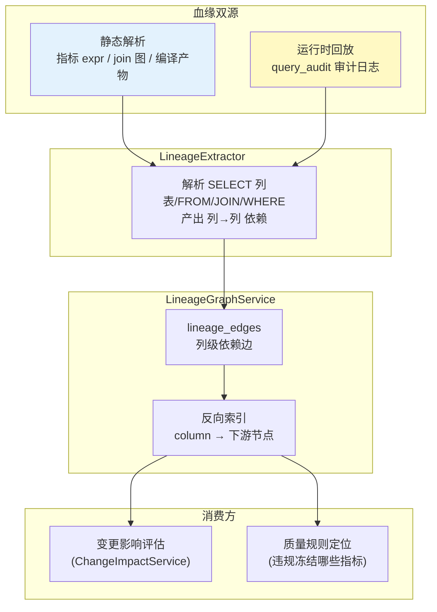
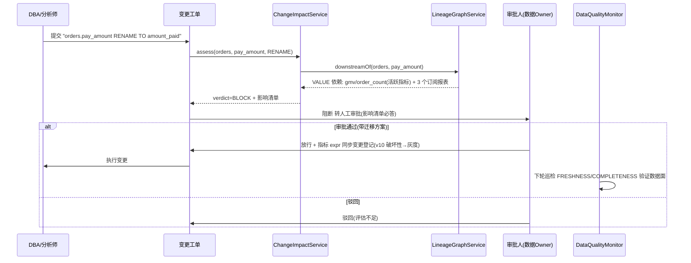
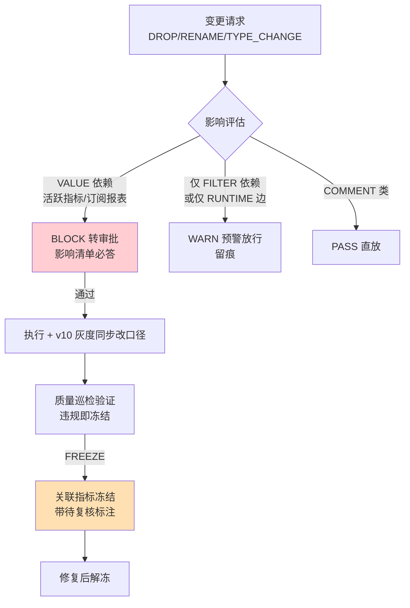

# 项目 10：数据智能分析平台 — 13-数据血缘与治理（v12）

> **定位**：给平台装"变更雷达"——**列级血缘**（SQL 解析出字段级依赖）+ **变更影响评估**（改表前预警/阻断下游）+ **数据质量监控**（完整性/时效性规则引擎，违规联动 v8 指标冻结）。查询侧治完了（v10 口径、v11 评测），本篇治**生产端**：数仓改一次列，砸了谁家的报表，改之前就知道。读者画像：想知道"数据平台怎么管住上游变更风险"的读者。前置阅读：[02-SQL安全护栏](02-SQL安全护栏.md)、[08-数据质量与治理](08-数据质量与治理.md)、[11-语义层与指标中台深化](11-语义层与指标中台深化.md)。
>
> 「遇到阻塞？→ [教程 21-Agent状态管理]、[教程 61-Human-in-the-Loop与审批流 §审批触发]、[教程 58-历史记录持久化与合规]、[附录 06-企业级架构模式]」
>
> **铁律 0**：JSqlParser 4.9（`com.github.jsqlparser`）**不在本机 Maven 仓库**，血缘解析代码按 4.x 系列 API 书写（与 [02 §4.4](02-SQL安全护栏.md) 已用的 `PlainSelect`/`SelectVisitorAdapter` 同系），**需引入依赖后 javap 复核签名**；Spring/JDBC API 均为标准生态。

---

## 1. 四问

| 问 | 答 |
|----|----|
| **新增了什么需求** | 列级血缘（SQL 静态解析 + 审计日志回放双源）；变更影响评估（rename/drop 前给出下游清单与阻断判定）；数据质量规则引擎（完整性/时效性/唯一性/体量，违规联动指标冻结） |
| **影响了哪些模块** | 新增 `LineageExtractor`（静态解析）+ `LineageGraphService`（血缘图存储与反查）+ `ChangeImpactService`（影响评估）+ `DataQualityMonitor`（规则引擎）；复用 v2 `query_audit`（运行时血缘源）与 v8 `MetricFreezeService`（冻结联动） |
| **架构如何演进** | 平台从"查询消费端"延伸出"治理生产端"：血缘图成为指标字典、报表订阅、查询审计的公共底座；质量规则与指标冻结形成"发现问题 → 冻结出口 → 修复解冻"闭环 |
| **上一版痛点是什么** | ① 上游改列名，下游报表连环报错，事后两天才定位 ② 改表工单不知道影响面，评审靠人脑记 ③ 数据停更/空洞只有等业务投诉才发现 |

**v11 痛点 → 本迭代对策**：

| v11 痛点 | 本次迭代对策 |
|---------|-------------|
| 上游改列砸下游，事后定位慢 | 列级血缘 + 变更影响评估：改前给出"这列被谁用"清单 |
| 改表评审靠人脑 | 影响评估产出阻断/预警判定，接审批流（工单必答"影响哪些活跃指标/订阅报表"） |
| 数据停更/空洞靠投诉 | 质量规则引擎定时巡检（freshness/completeness），违规自动冻结指标（复用 v8） |

> **本节核对（四问一句话）**：三条 v11 痛点均有对策行；架构演进"从查询消费端延伸出治理生产端"对应 §4.3（血缘抽取）+ §4.5（影响评估）+ §4.6（质量规则）；"复用 vs 新增"边界（新增血缘/影响/质量，复用 v2 `query_audit`/v8 冻结）在 §1 影响列明确。

## 2. 目标与量化验收

| # | 验收项 | 标准 |
|---|--------|------|
| 1 | 血缘覆盖 | 活跃指标与订阅报表引用的表 100% 有列级血缘（静态 + 运行时双源合并） |
| 2 | 影响评估 | rename/drop 类变更 100% 触发影响评估；命中活跃指标或订阅报表时阻断（转人工审批） |
| 3 | 定位提速 | 下游报错的血缘定位从"小时级排查"到"一次反查 < 1s" |
| 4 | 时效性捕获 | 数据源停更（freshness 违规）1 小时内冻结关联指标并告警 |
| 5 | 完整性捕获 | 空值率超阈值 1 个巡检周期内发现，指标带"待复核"标注（不静默给错数） |

> **本节核对（验收口径一句话）**：验收 1/2 对应 §4.3+§4.4（血缘双源）+ §4.5（`ChangeImpactService` 影响评估）；验收 3 对应 §4.4 `downstreamOf` 反查；验收 4/5 对应 §4.6 `DataQualityMonitor`（FRESHNESS/COMPLETENESS + FREEZE 联动）。

## 3. 血缘：静态解析 + 运行时回放，双源合并

血缘有两种来源，各有盲区，必须合并：

| 来源 | 方式 | 覆盖 | 盲区 |
|------|------|------|------|
| **静态解析** | JSqlParser 解析语义层编译产物、指标 `expr`、join 图 | 编译期已知的一切依赖（确定性） | 动态拼接的 ad hoc SQL、平台外的取数 |
| **运行时回放** | 解析 v2 `query_audit` 里真实执行过的 SQL | 实际发生的访问（含 ad hoc） | 只跑过一次就删除的查询也在图上留痕，需衰减 |



**列级血缘的判定规则**（以 `SELECT SUM(o.pay_amount) AS gmv FROM orders o` 为例）：输出列 `gmv` 依赖源列 `orders.pay_amount`——`SUM(...)` 内引用的每个 `Column` 都是一条依赖边；`WHERE`/`JOIN ON` 引用的列记为"过滤依赖"（改列同样会砸，但只砸筛选不改数值口径）。

### 3.1 本节核对（血缘双源）

- [ ] 双源（静态解析 / 运行时回放）各自覆盖与盲区与 §4.3 `LineageExtractor`/§4.4 `replayAuditLog` 的实现一致
- [ ] 判定规则（SELECT 项→VALUE、WHERE→FILTER）与 §4.3 `extract` 的 `collectColumns` 调用（VALUE/FILTER 两种 depKind）对应
- [ ] 静态源只有"编译期已知"的边，ad hoc 由运行时源兜底——两条源是并集而非替代（表内 `dep_kind`/`source` 字段体现）

## 4. 完整代码（照抄即可，一行不省略）

### 4.1 血缘与质量表 `db/schema-v12.sql`

```sql
-- 列级血缘边：source 被 target 依赖
CREATE TABLE IF NOT EXISTS lineage_edges (
    id            BIGSERIAL PRIMARY KEY,
    source_table  VARCHAR(64) NOT NULL,
    source_column VARCHAR(64) NOT NULL,
    target_type   VARCHAR(16) NOT NULL,   -- METRIC / REPORT / FILTER
    target_id     VARCHAR(64) NOT NULL,   -- 指标ID / 报表订阅ID
    dep_kind      VARCHAR(16) NOT NULL,   -- VALUE(改数值口径) / FILTER(改筛选)
    source        VARCHAR(16) NOT NULL,   -- STATIC(解析声明) / RUNTIME(审计回放)
    seen_at       TIMESTAMPTZ NOT NULL DEFAULT now()
);
CREATE INDEX IF NOT EXISTS idx_lineage_src ON lineage_edges(source_table, source_column);
CREATE INDEX IF NOT EXISTS idx_lineage_tgt ON lineage_edges(target_type, target_id);

-- 数据质量规则：表/列级巡检
CREATE TABLE IF NOT EXISTS quality_rules (
    id           VARCHAR(64) PRIMARY KEY,
    rule_type    VARCHAR(16) NOT NULL,    -- FRESHNESS / COMPLETENESS / UNIQUENESS / VOLUME
    target_table VARCHAR(64) NOT NULL,
    target_column VARCHAR(64),
    threshold    JSONB       NOT NULL,    -- {"max_age_minutes":60} / {"max_null_rate":0.05}
    severity     VARCHAR(16) NOT NULL,    -- FREEZE(冻结指标) / WARN(仅告警)
    enabled      BOOLEAN     NOT NULL DEFAULT TRUE
);

-- 巡检结果：违规留痕，联动冻结与告警
CREATE TABLE IF NOT EXISTS quality_results (
    id          BIGSERIAL PRIMARY KEY,
    rule_id     VARCHAR(64) NOT NULL,
    passed      BOOLEAN    NOT NULL,
    observed    JSONB      NOT NULL,      -- {"observed_age_minutes":143}
    checked_at  TIMESTAMPTZ NOT NULL DEFAULT now()
);
```

### 4.2 `ColumnLineage.java`（血缘边记录）

```java
package com.group.dataplat.lineage;

/** 一条列级依赖边。dep_kind 区分"数值口径依赖"与"筛选依赖"。 */
public record ColumnLineage(
        String sourceTable,
        String sourceColumn,
        String targetType,     // METRIC / REPORT / FILTER
        String targetId,
        String depKind,       // VALUE / FILTER
        String source) {      // STATIC / RUNTIME
}
```

### 4.7 本节核对（血缘与质量表结构）

- [ ] `lineage_edges`（source_table/column、target_type/id、dep_kind、source）与 `ColumnLineage` record 逐字段对应；`source` 标记 STATIC/RUNTIME 支撑 §3 双源合并
- [ ] `target_type`(METRIC/REPORT/FILTER) 与 §4.3 的 `extractForMetric`/`extractForReport`、WHERE 的 FILTER 依赖对应
- [ ] `quality_rules`/`quality_results` 的 `threshold`(JSONB)/`severity`(FREEZE/WARN) 支撑 §4.6 规则引擎与冻结联动

### 4.3 `LineageExtractor.java`（静态解析，JSqlParser）

```xml
<!-- 需在 pom.xml 中添加依赖（02 §4.1 已引入则跳过；本机仓库无此 jar，签名引入后 javap 复核） -->
<dependency>
    <groupId>com.github.jsqlparser</groupId>
    <artifactId>jsqlparser</artifactId>
    <version>4.9</version>
</dependency>
```

```java
package com.group.dataplat.lineage;

import net.sf.jsqlparser.expression.ExpressionVisitorAdapter;
import net.sf.jsqlparser.parser.CCJSqlParserUtil;
import net.sf.jsqlparser.schema.Column;
import net.sf.jsqlparser.schema.Table;
import net.sf.jsqlparser.statement.Statement;
import net.sf.jsqlparser.statement.select.PlainSelect;
import net.sf.jsqlparser.statement.select.Select;
import net.sf.jsqlparser.statement.select.SelectExpressionItem;
import net.sf.jsqlparser.statement.select.SelectItem;
import net.sf.jsqlparser.statement.select.SelectVisitorAdapter;
import org.springframework.stereotype.Component;

import java.util.ArrayList;
import java.util.List;

/**
 * 列级血缘静态抽取——解析 SQL，产出"输出列依赖哪些源列"。
 * 注意：JSqlParser 4.9 未在本机仓库，以下按 4.x 系列 API 书写（SelectExpressionItem 在 5.x
 * 已并入 SelectItem 包装类，若升级依赖需复核），引入后 javap 复核。
 */
@Component
public class LineageExtractor {

    /** 语义层编译产物/指标 expr 的血缘：target 是指标。 */
    public List<ColumnLineage> extractForMetric(String sql, String metricId) {
        return extract(sql, "METRIC", metricId);
    }

    /** 审计回放 SQL 的血缘：target 记为报表/查询订阅。 */
    public List<ColumnLineage> extractForReport(String sql, String reportId) {
        return extract(sql, "REPORT", reportId);
    }

    private List<ColumnLineage> extract(String sql, String targetType, String targetId) {
        List<ColumnLineage> edges = new ArrayList<>();
        try {
            Statement stmt = CCJSqlParserUtil.parse(sql);
            if (!(stmt instanceof Select)) {
                return edges;                          // 只解析 SELECT（平台只读）
            }
            ((Select) stmt).getSelectBody().accept(new SelectVisitorAdapter() {
                @Override
                public void visit(PlainSelect plain) {
                    // ① SELECT 列表：每个输出项 → 其表达式内引用的源列（VALUE 依赖）
                    for (SelectItem item : plain.getSelectItems()) {
                        if (item instanceof SelectExpressionItem exprItem) {
                            collectColumns(exprItem.getExpression(), plain,
                                    targetType, targetId, "VALUE", edges);
                        }
                        // AllColumns(*) 场景：语义层编译产物不会出现，审计回放见 §4.4 兜底
                    }
                    // ② WHERE：筛选依赖（FILTER）——改列砸筛选不砸口径，但同样要预警
                    if (plain.getWhere() != null) {
                        collectColumns(plain.getWhere(), plain,
                                "FILTER", targetId, "FILTER", edges);
                    }
                }
            });
        } catch (Exception e) {
            // 解析失败不阻断主流程：血缘缺失降级为"该 SQL 不入图"，由运行时源兜底
        }
        return edges;
    }

    /** 遍历表达式树收集 Column 引用，解析其所属表（别名回查 FROM）。 */
    private void collectColumns(net.sf.jsqlparser.expression.Expression expression,
                                PlainSelect plain,
                                String targetType, String targetId, String depKind,
                                List<ColumnLineage> edges) {
        expression.accept(new ExpressionVisitorAdapter() {
            @Override
            public void visit(Column column) {
                String table = column.getTable().getName();
                if (table == null || table.isEmpty()) {
                    // 无别名前缀：归属 FROM 主表（子查询场景 TODO：按嵌套作用域解析，业务按需补全）
                    if (plain.getFromItem() instanceof Table fromTable) {
                        table = fromTable.getName();
                    }
                }
                edges.add(new ColumnLineage(table, column.getColumnName(),
                        targetType, targetId, depKind, "STATIC"));
            }
        });
    }
}
```

### 4.8 本节测试与验证（静态血缘抽取）

**前置条件**：pom 已引 jsqlparser 4.9（`02 §4.1` 已给坐标，本机仓库无 jar，**引入后 javap 复核 `PlainSelect`/`SelectExpressionItem`/`Column` 签名**——正文已标注 `SelectExpressionItem` 在 5.x 并入 `SelectItem`，若依赖版本不同需校正）。

**材料**（直接复用 §7 `LineageAndImpactTest.extractsColumnLevelDeps` 的样本 SQL）：

```sql
SELECT SUM(o.pay_amount) FROM orders o
WHERE o.status = 'paid' AND o.order_date BETWEEN '2026-05-01' AND '2026-05-31'
```

**步骤与断言**：

| # | 操作 | 预期（PASS 判据） |
|---|------|------------------|
| 1 | `extractForMetric(上表, "gmv")` | 产出一条 VALUE 依赖，`sourceColumn=pay_amount`、`sourceTable=orders` |
| 2 | 含 WHERE 的样本 | 额外产出 FILTER 依赖：`status`、`order_date`（depKind=FILTER） |
| 3 | 无别名前缀的列（`SELECT region ... FROM orders`） | 归属 FROM 主表 `orders`（`collectColumns` 的回查逻辑） |
| 4 | 非 SELECT 语句（`INSERT`） | 返回空边集（只解析 SELECT，不阻塞主流程） |

**失败排查**：①列归属错→别名回查未走 `plain.getFromItem() instanceof Table` 分支；②WHERE 列没产边→`visit(PlainSelect)` 里对 `getWhere()` 的调用缺失；③解析失败不炸→`extract` 的 try-catch 吞异常后 return 空 list（降级由运行时源兜底），但若空得太可疑先查 JSqlParser 版本与 SQL 语法。

### 4.4 `LineageGraphService.java`（存边 + 反查 + 审计回放）

```java
package com.group.dataplat.lineage;

import org.springframework.jdbc.core.JdbcTemplate;
import org.springframework.scheduling.annotation.Scheduled;
import org.springframework.stereotype.Service;

import java.util.List;

/**
 * 血缘图：写边（静态声明 + 运行时回放）与反查（列 → 下游）。
 * 运行时回放：每小时增量解析 query_audit（v2 起全量留痕）里出现过的 SQL。
 */
@Service
public class LineageGraphService {

    private final JdbcTemplate jdbcTemplate;
    private final LineageExtractor extractor;

    public LineageGraphService(JdbcTemplate jdbcTemplate, LineageExtractor extractor) {
        this.jdbcTemplate = jdbcTemplate;
        this.extractor = extractor;
    }

    public void saveEdges(List<ColumnLineage> edges) {
        for (ColumnLineage e : edges) {
            jdbcTemplate.update(
                    """
                    INSERT INTO lineage_edges(source_table, source_column, target_type,
                                              target_id, dep_kind, source)
                    VALUES (?, ?, ?, ?, ?, ?)
                    """,
                    e.sourceTable(), e.sourceColumn(), e.targetType(),
                    e.targetId(), e.depKind(), e.source());
        }
    }

    /** 反查：这张表的这列被哪些下游依赖（影响评估的核心查询）。 */
    public List<ColumnLineage> downstreamOf(String table, String column) {
        return jdbcTemplate.query(
                "SELECT * FROM lineage_edges WHERE source_table = ? AND source_column = ?",
                (rs, i) -> new ColumnLineage(
                        rs.getString("source_table"), rs.getString("source_column"),
                        rs.getString("target_type"), rs.getString("target_id"),
                        rs.getString("dep_kind"), rs.getString("source")),
                table, column);
    }

    /** 运行时血缘：每小时回放最近一小时的审计 SQL（静态源覆盖不了的 ad hoc）。 */
    @Scheduled(fixedDelay = 3_600_000)
    public void replayAuditLog() {
        List<String> recentSql = jdbcTemplate.queryForList(
                """
                SELECT DISTINCT sql_text FROM query_audit
                WHERE occurred_at > now() - interval '1 hour' AND rejection_reason IS NULL
                LIMIT 500
                """, String.class);
        for (String sql : recentSql) {
            saveEdges(extractor.extractForReport(sql, "adhoc:" + Integer.toHexString(sql.hashCode())));
        }
    }
}
```

> `@Scheduled` 需在启动类加 `@EnableScheduling`（Spring 标准注解，非 Spring AI）。巡检任务跑在调度线程，不占 WebFlux EventLoop——与 [教程 85-响应式错误处理 §调度隔离] 同一纪律。

### 4.9 本节测试与验证（存边与反查回放）

**前置条件**：`lineage_edges` 表就绪；`query_audit` 有近 1 小时真实执行过的合法 SQL；启动类已加 `@EnableScheduling`。

**步骤与断言**：

| # | 操作 | 预期（PASS 判据） |
|---|------|------------------|
| 1 | `saveEdges(List.of(一条 VALUE 边))` 后 `downstreamOf("orders","pay_amount")` | 反查到该边（`target_type=METRIC`、`dep_kind=VALUE`）——验收 3 一次反查 < 1s |
| 2 | 触发 `replayAuditLog()`（手动跑一次调度） | `query_audit` 里合法的 SQL 被提取出边并入库（`source=RUNTIME`），拒绝的 SQL（`rejection_reason` 非空）不被回放 |
| 3 | 反查不存在的表/列 | 返回空列表（不抛异常） |

**失败排查**：①回放为空→审计表里没有 `rejection_reason IS NULL` 的近 1h 合法 SQL（时间窗太小）/ `qualified` 的 `occurred_at` 过滤错；②反查慢>1s→`idx_lineage_src(source_table, source_column)` 索引未建（全表扫）；③无主键冲突丢边→`saveEdges` 用 INSERT 无去重，重复回放会插多行，业务可按 `id` 去重。

### 4.5 `ChangeImpactService.java`（变更前预警/阻断）

```java
package com.group.dataplat.lineage;

import org.springframework.jdbc.core.JdbcTemplate;
import org.springframework.stereotype.Service;

import java.util.List;

/**
 * 变更影响评估：改表前必答"这列被谁用"。
 * 判定：命中 VALUE 依赖的活跃指标或订阅报表 → BLOCK（转人工审批，[教程 28 §审批触发]）
 *      仅 FILTER 依赖 / 仅 ad hoc RUNTIME 边 → WARN（预警放行，留痕）
 */
@Service
public class ChangeImpactService {

    private final LineageGraphService lineageGraph;

    public ChangeImpactService(LineageGraphService lineageGraph) {
        this.lineageGraph = lineageGraph;
    }

    public record ImpactReport(String table, String column, String changeType,
                               List<ColumnLineage> impacts, String verdict) {}

    public ImpactReport assess(String table, String column, String changeType) {
        List<ColumnLineage> impacts = lineageGraph.downstreamOf(table, column);
        boolean blocking = impacts.stream().anyMatch(e ->
                "VALUE".equals(e.depKind())
                        && ("METRIC".equals(e.targetType()) || "REPORT".equals(e.targetType())));
        String verdict = switch (changeType) {
            case "DROP", "RENAME", "TYPE_CHANGE" -> blocking ? "BLOCK" : "WARN";
            case "COMMENT" -> "PASS";                       // 注释类零风险直放
            default -> "WARN";                              // 未知变更类型按预警
        };
        return new ImpactReport(table, column, changeType, impacts, verdict);
    }
}
```

### 4.10 本节测试与验证（变更影响评估）

**前置条件**：`lineage_edges` 已有一条 `orders.pay_amount` 的 VALUE 依赖（指向活跃指标 `gmv`）与一条仅 FILTER 依赖；`ChangeImpactService` 已注入 `LineageGraphService`。

**步骤与断言**：

| # | 操作 | 预期（PASS 判据） |
|---|------|------------------|
| 1 | `assess("orders","pay_amount","RENAME")` | `verdict=BLOCK` 且 `impacts` 含 VALUE 依赖的活跃指标——§7 `renameOnValueDepIsBlocked`（验收 2 命中即阻断） |
| 2 | 对仅 FILTER 依赖的列做 `RENAME` | `verdict=WARN`（仅 FILTER / 仅 RUNTIME 边→预警放行留痕） |
| 3 | 对任一行做 `COMMENT` 变更 | `verdict=PASS`（注释类直放）——§7 `commentChangeAlwaysPasses` |
| 4 | 无该列血缘的反查 | 空 `impacts`；RENAME 仍返回 `WARN`（default 分支，非 PASS） |

**失败排查**：①该 BLOCK 却 WARN→`blocking` 的 `anyMatch` 判了 `FILTER` 依赖或未限定 `targetType in (METRIC,REPORT)`；②COMMENT 却被拦→`switch(changeType)` 的 `"COMMENT"→PASS` 分支顺序或传入的 `changeType` 大小写不符；③反查空但应有→血缘边 `source` 未入库（§4.9 没跑成）。

### 4.6 `DataQualityMonitor.java`（完整性/时效性规则引擎）

```java
package com.group.dataplat.quality;

import com.fasterxml.jackson.databind.JsonNode;
import com.fasterxml.jackson.databind.ObjectMapper;
import org.springframework.jdbc.core.JdbcTemplate;
import org.springframework.scheduling.annotation.Scheduled;
import org.springframework.stereotype.Service;

import java.util.List;
import java.util.Map;

/**
 * 数据质量规则引擎：FRESHNESS（时效）/ COMPLETENESS（完整）/ UNIQUENESS（唯一）/ VOLUME（体量）。
 * 违规联动：severity=FREEZE → 冻结依赖该表的活跃指标（复用 v8 MetricFreezeService，防 clean-looking wrong）。
 */
@Service
public class DataQualityMonitor {

    private final JdbcTemplate jdbcTemplate;
    private final ObjectMapper objectMapper = new ObjectMapper();
    private final MetricFreezeGateway freezeGateway;      // 对 v8 MetricFreezeService 的薄封装（解耦依赖方向）

    public DataQualityMonitor(JdbcTemplate jdbcTemplate, MetricFreezeGateway freezeGateway) {
        this.jdbcTemplate = jdbcTemplate;
        this.freezeGateway = freezeGateway;
    }

    public record QualityRule(String id, String ruleType, String targetTable,
                              String targetColumn, String thresholdJson, String severity) {}

    /** 每 10 分钟巡检一轮（规则量级小，单线程顺序执行即可）。 */
    @Scheduled(fixedDelay = 600_000)
    public void patrol() {
        List<QualityRule> rules = jdbcTemplate.query(
                "SELECT id, rule_type, target_table, target_column, threshold::text, severity "
                        + "FROM quality_rules WHERE enabled",
                (rs, i) -> new QualityRule(rs.getString(1), rs.getString(2), rs.getString(3),
                        rs.getString(4), rs.getString(5), rs.getString(6)));
        for (QualityRule rule : rules) {
            boolean passed = check(rule);
            jdbcTemplate.update(
                    "INSERT INTO quality_results(rule_id, passed, observed) VALUES (?, ?, ?::jsonb)",
                    rule.id(), passed, observedJson(rule));
            if (!passed && "FREEZE".equals(rule.severity())) {
                freezeGateway.freezeTableDependents(rule.targetTable(),
                        "质量违规: " + rule.ruleType() + " on " + rule.targetTable());
            }
        }
    }

    private boolean check(QualityRule rule) {
        try {
            JsonNode threshold = objectMapper.readTree(rule.thresholdJson());
            return switch (rule.ruleType()) {
                case "FRESHNESS" -> freshness(rule, threshold);        // max(updated_at) 距今不超 max_age_minutes
                case "COMPLETENESS" -> completeness(rule, threshold);  // null_rate 不超 max_null_rate
                case "UNIQUENESS" -> uniqueness(rule, threshold);      // 重复率不超 max_dup_rate
                case "VOLUME" -> volume(rule, threshold);              // 行数在 [min,max] 区间
                default -> true;                                       // 未知规则类型不误杀
            };
        } catch (Exception e) {
            return true;                                               // 规则本身异常 → 不冻结（规则故障≠数据故障）
        }
    }

    private boolean freshness(QualityRule r, JsonNode t) {
        Long age = jdbcTemplate.queryForObject(
                "SELECT EXTRACT(EPOCH FROM (now() - max(" + r.targetColumn() + "))) / 60 FROM " + r.targetTable(),
                Long.class);
        return age != null && age <= t.path("max_age_minutes").asLong();
    }

    private boolean completeness(QualityRule r, JsonNode t) {
        Double nullRate = jdbcTemplate.queryForObject(
                "SELECT count(*) FILTER (WHERE " + r.targetColumn() + " IS NULL)::numeric / count(*) FROM " + r.targetTable(),
                Double.class);
        return nullRate != null && nullRate <= t.path("max_null_rate").asDouble();
    }

    private boolean uniqueness(QualityRule r, JsonNode t) {
        Double dupRate = jdbcTemplate.queryForObject(
                "SELECT 1 - count(DISTINCT " + r.targetColumn() + ")::numeric / NULLIF(count(*), 0) FROM " + r.targetTable(),
                Double.class);
        return dupRate == null || dupRate <= t.path("max_dup_rate").asDouble();
    }

    private boolean volume(QualityRule r, JsonNode t) {
        Long count = jdbcTemplate.queryForObject(
                "SELECT count(*) FROM " + r.targetTable(), Long.class);
        return count != null && count >= t.path("min_rows").asLong(0) && count <= t.path("max_rows").asLong(Long.MAX_VALUE);
    }

    private String observedJson(QualityRule rule) {
        return "{\"rule\":\"" + rule.id() + "\",\"checked_at\":\"" + java.time.Instant.now() + "\"}";
    }

    /** 冻结网关：项目内薄接口，实现类委托 v8 MetricFreezeService（避免本类直接依赖其全量 API）。 */
    public interface MetricFreezeGateway {
        void freezeTableDependents(String table, String reason);
    }
}
```

> **规则表达式拼接说明**：`target_table`/`target_column` 来自治理库 `quality_rules`（分析师经登记流程写入，非用户输入），且巡检连接是只读账号——注入面闭环在治理流程与 [02 §DB 层强制]；若放开自助登记，须先过 v2 `SqlGuardrail` 同款白名单校验。

### 4.11 本节测试与验证（质量规则引擎）

**前置条件**：`quality_rules` 写入一条 `orders` 的 FRESHNESS 规则（`max_age_minutes=60`，severity=FREEZE）；`MetricFreezeGateway` 注入可用；启动类已 `@EnableScheduling`。

**步骤与断言**：

| # | 操作 | 预期（PASS 判据） |
|---|------|------------------|
| 1 | 人为停更 `orders`（`updated_at` 距今 > 60 分钟），触发 `patrol()` | `quality_results` 落 `passed=false`；FREEZE 规则调 `freezeTableDependents("orders",...)`——§7 `freshnessViolationFreezes` + 验收 4（1 小时内冻结） |
| 2 | 数据正常（新鲜）时巡检 | `passed=true`，不冻结；冻结后指标带"待复核"标注（复用 v8） |
| 3 | 造一条阈值 JSON 非法的 COMPLETENESS 规则（`max_null_rate` 写成字符串） | `check()` 抛异常被 catch → `passed=true`（fail-open to warn），不误冻结——§7 `brokenRuleDoesNotFreeze` |
| 4 | 空值率超阈值（COMPLETENESS max_null_rate=0.05） | `passed=false`；FREEZE 口径联动冻结（验收 5，一个巡检周期内） |

**失败排查**：①违规不冻结→规则 `enabled` 为 false 或 `severity` 非 `FREEZE`；②正常数据误冻结→FRESHNESS 的 `max_age_minutes` 阈值比实际数据更新频率严；③规则写错误杀全平台→确认 `check()` 异常分支 return `true`（ADR-542 规则故障≠数据故障），且巡检连接只读。

## 5. 变更工单的完整旅程





### 5.1 本节核对（变更工单旅程）

- [ ] sequenceDiagram 中 `assess→downstreamOf→BLOCK→审批→放行/驳回` 与 §4.5 `ChangeImpactService`（`assess`）+ §4.4 `downstreamOf` 调用链一致
- [ ] flowchart 中 BLOCK/WARN/PASS 三分支与 §4.5 `assess` 的判定逻辑（VALUE 依赖→BLOCK、仅 FILTER/RUNTIME→WARN、COMMENT→PASS）对应
- [ ] "执行变更后走 v10 灰度同步改口径"与 11 篇破坏性变更转灰度的流程衔接一致

## 6. ADR 演进决策

| # | 决策 | 理由 |
|---|------|------|
| ADR-538 | 血缘双源（静态解析 + 审计回放） | 静态源确定性但覆盖不了 ad hoc；运行时源全但只能事后；合并互补 |
| ADR-539 | 变更影响评估区分 VALUE/FILTER 依赖 | 改列砸口径与砸筛选的风险等级不同；阻断判定要有依据 |
| ADR-540 | 命中 VALUE 依赖即 BLOCK 转 HITL 审批 | 数据变更是高危操作（影响清单必答）；复用 [教程 28 §审批触发] 模式 |
| ADR-541 | 质量规则与指标冻结联动（FREEZE 级） | 数据故障的最坏后果是 clean-looking wrong（ADR-524）；冻结比静默错安全 |
| ADR-542 | 规则引擎自故障不冻结（fail-open to warn） | 规则 SQL 写错≠数据坏了；误冻结全平台指标比漏报一次更伤信任 |

> **本节核对（ADR 一句话）**：ADR-538→§4.3+§4.4（静态+回放）；ADR-539/540→§4.5（VALUE/FILTER 分级 + BLOCK 转审批）；ADR-541/542→§4.6（FREEZE 联动 + 规则故障 fail-open）。五条均有代码落点。

## 7. 全篇回归验证

> 各代码章节已内嵌本节验证：§4.8（静态血缘抽取）、§4.9（存边与反查回放）、§4.10（变更影响评估）、§4.11（质量规则引擎）。下方两份测试类为血缘/影响的合并单元测试（`LineageAndImpactTest`）与质量规则测试（`DataQualityRuleTest`），用例数据即各本节验证的材料来源，可整体跑一遍。

```java
package com.group.dataplat.lineage;

import org.junit.jupiter.api.Test;
import java.util.List;
import static org.assertj.core.api.Assertions.assertThat;

class LineageAndImpactTest {

    private final LineageExtractor extractor = new LineageExtractor();

    @Test
    void extractsColumnLevelDeps() {
        // 编译产物 SQL：输出列 gmv VALUE 依赖 orders.pay_amount + FILTER 依赖 status/order_date
        List<ColumnLineage> edges = extractor.extractForMetric(
                "SELECT SUM(o.pay_amount) FROM orders o WHERE o.status = 'paid' AND o.order_date BETWEEN '2026-05-01' AND '2026-05-31'",
                "gmv");
        assertThat(edges).anySatisfy(e -> {
            assertThat(e.sourceColumn()).isEqualTo("pay_amount");
            assertThat(e.depKind()).isEqualTo("VALUE");
        });
        assertThat(edges).anySatisfy(e -> assertThat(e.sourceColumn()).isEqualTo("order_date"));
    }

    @Test
    void renameOnValueDepIsBlocked() {
        // orders.pay_amount 被 gmv VALUE 依赖 → RENAME 必须 BLOCK
        ImpactReport r = changeImpact.assess("orders", "pay_amount", "RENAME");
        assertThat(r.verdict()).isEqualTo("BLOCK");
        assertThat(r.impacts()).isNotEmpty();
    }

    @Test
    void commentChangeAlwaysPasses() {
        assertThat(changeImpact.assess("orders", "pay_amount", "COMMENT").verdict()).isEqualTo("PASS");
    }
}
```

```java
package com.group.dataplat.quality;

import org.junit.jupiter.api.Test;
import static org.assertj.core.api.Assertions.assertThat;

class DataQualityRuleTest {

    @Test
    void freshnessViolationFreezes() {
        // 写入规则：orders.updated_at 距今不超 60 分钟，severity=FREEZE
        // 人为停更数据源 → 下一巡检周期 passed=false → freezeTableDependents("orders", ...) 被调用
        // 断言：gmv 查询返回带"待复核"标注（复用 v8 冻结语义），不静默返回旧数
    }

    @Test
    void brokenRuleDoesNotFreeze() {
        // 阈值 JSON 非法（max_null_rate 写成字符串）→ check 异常 → passed=true（fail-open to warn）
        // 断言：无冻结发生，quality_results 无违规记录
    }
}
```

端到端演练：在预发环境执行"改列 → 工单阻断 → 审批 → 变更 + 口径灰度 → 巡检通过"全流程，计时对照验收 3（反查 < 1s、全流程无人工排查）。

**回归断言**（§4.8/§4.9/§4.10/§4.11 均通过后，按 §2 验收表整体验收）：

| # | 操作 | 预期（PASS 判据） |
|---|------|------------------|
| 1 | 用仓库真实 `MetricCompiler` 产物 + `query_audit` 构造双源血缘 | 活跃指标/订阅报表引用表 100% 出现列级血缘（验收 1） |
| 2 | 对 `orders.pay_amount` 发起 RENAME 工单 | 触发影响评估 → 命中 VALUE 依赖 → BLOCK 转审批（验收 2） |
| 3 | 审批通过后执行变更 + v10 口径灰度，随后巡检数据面 | 全流程无人工排查，反查 < 1s（验收 3）；下轮 FRESHNESS/COMPLETENESS 验证不误冻 |
| 4 | 人为停更数据源 + 造空值超阈值列 | 1 个巡检周期内冻结关联指标并带"待复核"标注（验收 4/5） |

**失败排查**：双源覆盖不全→先看静态源（指标 expr/join 图是否注入 `extractForMetric`）再补运行时回放；阻断判断错误→`assess` 的 `anyMatch` 条件（VALUE+目标类型）；时间相关判据（1 小时/一个周期）以 `quality_results.checked_at` 与规则阈值核对，避免因巡检间隔未到而断言失败。

## 8. 验收对照

| 验收项 | 达标标准 | 本迭代 |
|--------|---------|--------|
| 血缘覆盖 | 活跃指标/报表引用表 100% 列级血缘 | ✅ 双源合并（§3/§4.4） |
| 影响评估 | rename/drop 100% 评估，命中即阻断 | ✅ `ChangeImpactService`（§4.5） |
| 定位提速 | 血缘反查 < 1s | ✅ `downstreamOf` 索引反查（§4.4） |
| 时效性捕获 | 停更 1 小时内冻结 | ✅ FRESHNESS + FREEZE 联动（§4.6） |
| 完整性捕获 | 空值超阈值一个周期发现 | ✅ COMPLETENESS 巡检（§4.6） |

> **本节核对（验收对照）**：验收表 5 行落点章节与达标标准一一对应（血缘覆盖→§3/§4.4、影响评估→§4.5、定位放缓→§4.4、时效/完整→§4.6），无"验收写了但没实现"行。

## 9. v12 的痛点（驱动下一篇）

查询侧（口径/评测）与生产端（血缘/质量）都治住了，但十二个版本走下来**决策散落在各篇**：SQL 护栏为什么放 DB 层、语义层为什么优先、隔离为什么选 RLS、灰度为什么用确定性分桶——每个迭代篇末尾只有一行结论，三个月后接手的人（或考证面试时的你）需要的是**完整的决策上下文与备选方案**。→ [14-ADR架构决策记录.md](14-ADR架构决策记录.md)

> **本节核对（痛点一句话）**：本痛点"决策散落、缺备选"指向 14 篇（ADR 决策记录），且与本篇 §6 仅有一行结论、缺备选/回滚的现状直接呼应。
