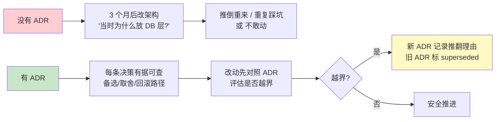
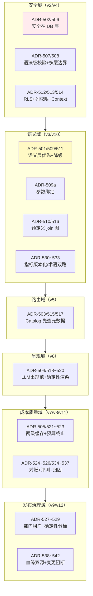
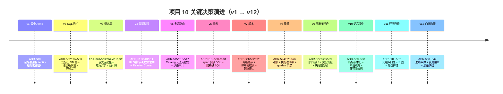
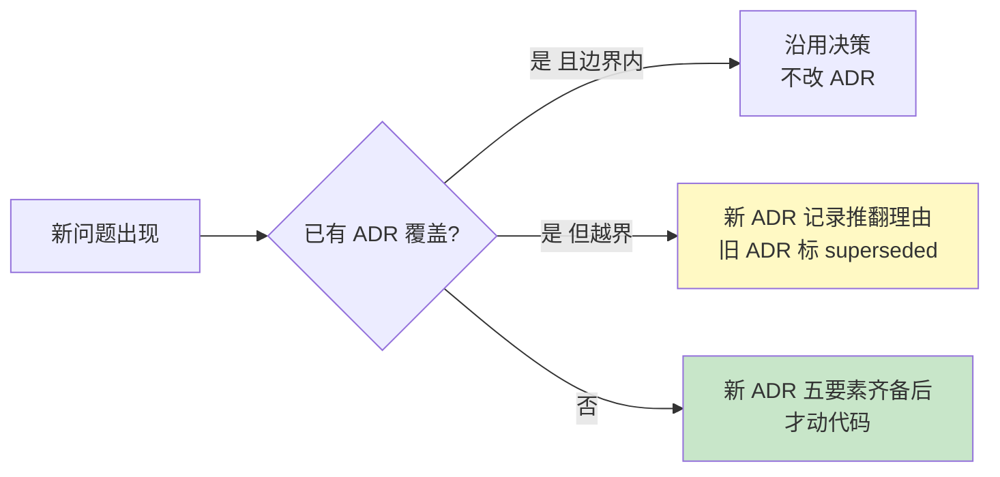

# 项目 10：数据智能分析平台 — 14-ADR 架构决策记录

> **定位**：把项目 10 从 00 到 13 的**架构决策**汇集成体系 ADR（Architecture Decision Record）——每条记录**决策上下文 / 备选方案 / 取舍理由 / 后果 / 可回滚性**。这是本项目的"决策资产"：三个月后改架构时（或面试复盘时），能知道"当时为什么这么定、还剩哪些路没走"。读者画像：想理解项目 10 每个关键决策"为什么"的读者，以及把它当数据平台决策范式的读者。前置阅读：[00-需求分析与架构设计](00-需求分析与架构设计.md)、[10-核心代码讲解](10-核心代码讲解.md)、[附录 08-架构决策方法论]。
>
> **铁律 0**：涉及 Spring AI 2.0 API 的决策均以本地 jar javap 实证为前提（`scripts/api-baseline-spring-ai-2.0.0.md`）；JSqlParser 等第三方标真实坐标。

---

## 1. 四问

| 问 | 答 |
|----|----|
| **新增了什么需求** | 决策资产化：散落在 13 篇迭代文末的 42 条一行式 ADR，升级为"上下文/备选/取舍/后果/可回滚"五要素的完整决策记录 |
| **影响了哪些模块** | 不改代码——沉淀文档资产；后续所有口径/架构变更按本文规范新增 ADR 编号 |
| **架构如何演进** | 项目从"能跑的十二个版本"升级为"可交接的决策体系"：每条决策可追溯、可评估、可推翻 |
| **上一版痛点是什么** | ① 决策只有结论没有备选（"为什么不用 X"答不上）② 决策散落，接手成本高 ③ 改架构时不知道动的是哪条决策的边界 |

## 2. 为什么需要 ADR

**ADR 五要素**（[附录 08-架构决策方法论 §记录模板]）：上下文（当时的问题与约束）、决策（选了什么）、备选（还考虑过什么、为何不选）、后果（代价与收益）、可回滚性（回退到哪、怎么退）。

## 3. 决策域地图（42 条 ADR 的全景分域）

**读图方式**：六大决策域对应六类风险（越权/口径错/查错库/展示错/花钱错/发布错）；箭头是项目演进中决策域出现的顺序，不是依赖关系。

## 4. 决策演进时间线

## 5. 十条关键 ADR 详解（五要素完整版）

> 编号沿用各迭代篇（决策处标 ADR 编号可反查落地篇）；此处是完整版。

### ADR-502/506：SQL 安全在 DB 层，不在 prompt 层

- **上下文**：v1 直生 SQL 裸奔——注入、全表扫描、越权都可能发生；要给 AI 查数上"护栏"，护栏放哪一层？
- **备选**：
  - A：prompt 层约束（系统提示"只写 SELECT"）——❌ 约束不是强制，LLM 可被注入可犯错
  - B：应用层校验（正则/语法解析）——⚠️ 只挡"经过本应用"的流量，绕过应用直连即失效
  - C：DB 层强制（只读角色 + RLS + 列权限 + 只读物理副本）——✅ 存储层边界，绕不过
- **决策**：C 为主边界（第一道），B 为第二道（v2 `SqlGuardrail` 语法级校验），A 仅作生成质量引导。
- **取舍/后果**：DB 层配置重（角色/策略要 DBA 协同）、只读副本有成本；换来"prompt 注入也绕不过"的强制力。
- **可回滚**：角色与 RLS 策略独立于应用代码，回收权限即回退；两道边界可分别增减。

### ADR-501/509/511：语义层优先，ad hoc 直生降级

- **上下文**：口径不一（GMV 有 3 种算法）+ join 幻觉；纯 Text2SQL 在企业私有基准上准确率惨淡（开放空间生成易错）。
- **备选**：
  - A：纯 Text2SQL + 更强模型/微调——❌ 微调贵且覆盖不了口径业务性；换模型增益有限
  - B：只做语义层，禁掉直生——❌ 探索性长尾需求覆盖不了，业务绕开平台
  - C：语义层优先（命中走确定性编译）+ 未命中降级 ad hoc（带 v2 护栏）——✅
- **决策**：C。LLM 从"生成 SQL"（开放）压缩为"选指标选维度"（封闭选择题），SQL 由规则引擎编译（v3 `MetricCompiler`）。
- **取舍/后果**：分析师要维护指标字典/join 图（治理成本，v10 把它体系化）；换来覆盖问题准确率趋近 100%、跨表 100% 可审计。
- **可回滚**：两条路径并存，置信度阈值（0.8）调节流量比例；语义层故障可全量切 ad hoc。

### ADR-509a：筛选值/时间范围一律参数绑定

- **上下文**：确定性编译如果拼字符串，注入从 LLM 侧回流（生成的 filterValue 可能带恶意 payload）。
- **备选**：A：白名单正则校验后拼接——❌ 校验清单永远追不上编码绕过；B：编译期参数化（`?` 占位 + params 列表）——✅。
- **决策**：B（`CompileResult(sql, params)`，执行层 PreparedStatement 绑定）；与 v2 护栏构成双层。
- **取舍/后果**：时间参数依赖 PG 按列类型隐式转换（不写 `DATE ?` 非法语法）；换来注入面在编译层结构性消失。
- **可回滚**：编译器内聚，改回拼接只需动 `MetricCompiler` 一处（但不应回退）。

### ADR-510/516：join 用预定义图，不让 LLM 现场 join

- **上下文**：跨表关联是幻觉重灾区——fan-out 膨胀、笛卡尔积、错选 join 键。
- **备选**：A：LLM 现场 join（给齐外键让它自己写）——❌ 不可审计且错误率高；B：物化宽表——⚠️ 存储与刷新成本、口径仍要人管；C：预定义 join 图（分析师维护一次的确定性路径）——✅。
- **决策**：C（v3 `JoinGraph`，v5 扩展到跨库）；维度不在图内直接抛异常（杜绝现场 join）。
- **取舍/后果**：新关联要分析师补图（可接受：新关联本来就该评审）；换来 join 逻辑 100% 可审计。
- **可回滚**：图是数据不是代码，加边/删边零发版。

### ADR-503/515/517：多源路由先查 Data Catalog 再查数据

- **上下文**：三个数仓，Agent 不知道查哪个库；跨库键名不统一（account_id vs client_no vs dim_customer_key），猜表必错。
- **备选**：A：手写路由规则（if 问题含"客户" then 用户库）——❌ 规则腐化、覆盖不了新问法；B：把三库 schema 全塞 prompt——❌ token 爆炸且记不住；C：Catalog 元数据中枢 + Agent 先查元数据再决策（路由也是"选择题"）——✅。
- **决策**：C（v5 `DataCatalogService` + `@Tool` 暴露 + `entity(RoutingPlan.class)` 输出决策 + 决策 trace 审计）。
- **取舍/后果**：Catalog 要维护（血缘篇 v12 让它反哺变更预警）；换来路由 grounded in governed metadata、"为什么查这个库"可追溯。
- **可回滚**：Catalog 未登记的表退化为显式白名单路由。

### ADR-512/513/514：租户数据隔离 = RLS 管行 + 列权限管列 + Reactor Context 传上下文

- **上下文**：行级（销售经理只能看本区）与列级（PII 脱敏）都要；WebFlux 禁 ThreadLocal；连接池下会话变量会串号。
- **备选**：
  - A：应用层 WHERE 拼租户谓词——❌ 漏拼即泄漏，且绕过应用失效
  - B：每租户独立库/schema——❌ 200 表 × N 部门的迁移与连接成本
  - C：DB 层 RLS（`SET LOCAL` 事务级会话变量）+ 列 GRANT/视图 + 掩码按角色——✅
- **决策**：C；行级靠 `RegionAwareQueryExecutor`（Reactor Context → `SET LOCAL` → RLS），列级靠 GRANT + 按角色掩码（不按人，>50 人维护崩盘）。
- **取舍/后果**：`SET LOCAL` 必须与查询同事务（最易写错点）；换来双层强制 + v11 升级为缺上下文即拒绝（fail-closed）。
- **可回滚**：RLS 策略可禁用（应急），列权限逐列回收。

### ADR-504/518/519/520：LLM 产结构化规范，Java 确定性渲染

- **上下文**：业务要图表不要表格；但让 LLM 直接产 HTML/JS 有 XSS 面，产统计数字会幻觉。
- **备选**：A：LLM 直接产完整前端代码——❌ 注入面 + 不可审计；B：固定模板套数据——❌ 图型选择死板；C：LLM 产受限 chart spec（结构化 JSON）+ 叙事，Java 确定性渲染统计真值 + 附精确 SQL——✅。
- **决策**：C（v6 `entity(ReportSpec.class)` + 受限 DSL 白名单 + 报表附 SQL 建立信任）。
- **取舍/后果**：DSL 表达力有边界（新图型要扩白名单）；换来统计数字来自数据库而非模型、XSS 面收敛。
- **可回滚**：spec 校验失败降级为纯表格输出。

### ADR-505/521/522/523：两级缓存 + 命中必验权限 + 超限终止

- **上下文**：相似问题重复花钱、无预算、成本归因不清。
- **备选**：A：不缓存（每次全链）——❌ 成本线性涨；B：仅精确缓存（问题归一化 key）——⚠️ 覆盖不了"上周GMV"vs"6月GMV"；C：精确（Redis）+ 语义（pgvector）两级，命中校验 tenant 边界 + Token 预算 BUDGET_EXCEEDED——✅。
- **决策**：C。**成本优化不得以安全为代价**：语义缓存命中必须校验 `tenant_id`（A 命中 B 的缓存=数据泄漏）；预算超限终止而非降质（宁可拒绝不可静默错）。
- **取舍/后果**：缓存一致性依赖 TTL 与口径版本失效联动（v10 后按 metric version 失效）；换来命中率 ≥40%、P95 < 50ms。
- **可回滚**：两级独立开关，语义缓存可单关。

### ADR-524/525/526：对账 + 执行准确率 + golden 门禁

- **上下文**：clean-looking wrong answers（看起来对实际错）比明显错更危险；数值答案不能用语义相似度评。
- **备选**：A：LLM-as-Judge 判数值对错——❌ 判"983 万 vs 9,832,110.50"会漂；B：人工抽检——❌ 覆盖率与时效都不可行；C：指标 CI 对账（vs control query）+ 数值执行准确率 + golden 集回归阻断发布——✅。
- **决策**：C（v8），v11 深化为三元组双口径 + 归因三分类（官方 `RelevancyEvaluator` 只管叙事层）。
- **取舍/后果**：control query 与 golden 集要人工维护（标注护城河）；换来发布从拍脑袋变评估驱动。
- **可回滚**：门禁阈值可调（92%），不可拆（拆门禁=回到黑盒）。

### ADR-528/529：口径灰度走实验流程 + 确定性分桶

- **上下文**：改指标口径是高风险变更（数字会跳变）；灰度要可复现、可对照、可回滚。
- **备选**：A：随机分流（每次请求掷骰子）——❌ 同一用户横跳两口径，对账灾难；B：UUID 哈希取模——⚠️ `abs(hashCode)%N` 有溢出坑；C：sha256(稳定键) + `floorMod` 确定性分桶 + 试点→golden 门禁→放量/回滚——✅。
- **决策**：C（v9 `BucketService` + `ExperimentRegistry`；v10 起破坏性口径变更强制入此流程）。
- **取舍/后果**：分桶键选错（如用会变的 userId）则流量漂移；换来幂等可复现、实验留痕。
- **可回滚**：实验一键回滚（老版本 `active` 未动，见 [11 §5 状态机](11-语义层与指标中台深化.md)）。

## 6. v10–v12 新增决策索引（详解见各篇 §ADR）

| # | 决策 | 落地篇 |
|---|------|--------|
| ADR-530 | 指标定义入库版本化（as-of 回溯） | [11](11-语义层与指标中台深化.md) |
| ADR-531 | 语义层兼容性规则：加维度兼容/删维度破坏 | [11](11-语义层与指标中台深化.md) |
| ADR-532 | 术语归一化双路（精确典 + 向量兜底） | [11](11-语义层与指标中台深化.md) |
| ADR-533 | 归一化只作用于语义层路径 | [11](11-语义层与指标中台深化.md) |
| ADR-534 | 金标三元组 + 双口径（执行/结果准确率） | [12](12-Text2SQL评测与护栏升级.md) |
| ADR-535 | 失败归因三分类绑定优化动作 | [12](12-Text2SQL评测与护栏升级.md) |
| ADR-536 | 数值确定性比对，叙事才用官方 Evaluator | [12](12-Text2SQL评测与护栏升级.md) |
| ADR-537 | 护栏角色档位 + 未知角色 fail-closed | [12](12-Text2SQL评测与护栏升级.md) |
| ADR-538 | 血缘双源（静态解析 + 审计回放） | [13](13-数据血缘与治理.md) |
| ADR-539/540 | VALUE/FILTER 依赖分级 + 命中即阻断转审批 | [13](13-数据血缘与治理.md) |
| ADR-541/542 | 质量违规联动冻结 + 规则故障不冻结 | [13](13-数据血缘与治理.md) |

## 7. ADR 维护规范与自检

| 项 | 规范 |
|----|------|
| 必填 | 上下文 + ≥2 备选 + 取舍理由 + 后果 + 可回滚性 |
| 编号 | ADR-5xx 顺序追加，**不改旧 ADR** |
| 推翻 | 决策被替代时新增 ADR 并把旧条目标 `superseded by ADR-5xx`，不删除 |
| 引用 | 迭代篇决策处标 ADR 编号；本篇 §5 详解标落地篇——双向可追溯 |

**自检清单**：① §5 十条 ADR 五要素齐备 ② 每条可从迭代篇反查（编号一致）③ 至少 2 个备选且说明不选理由 ④ 每条有可回滚路径 ⑤ 推翻流程成文（上图）。

## 8. 总结

项目 10 的 42+ 条 ADR 是它的"决策 DNA"：从"为什么安全在 DB 层"到"为什么灰度用确定性分桶"，每条都有上下文、备选、取舍、回滚。最有复用价值的三条：**ADR-501/509（语义层把开放生成压缩为封闭选择）、ADR-502/506（安全在 DB 层不在 prompt 层）、ADR-524/525（数值正确性用确定性比对）**——它们是从"会调 Text2SQL API"到"能设计数据智能平台"的分水岭（呼应 [10 §1 六个关键设计](10-核心代码讲解.md)）。

**下一篇**：[15-工业前沿与演进方向.md](15-工业前沿与演进方向.md)——平台建完了，2026 年的数据智能前沿往哪走。
