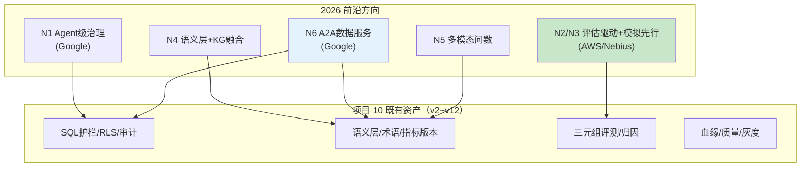
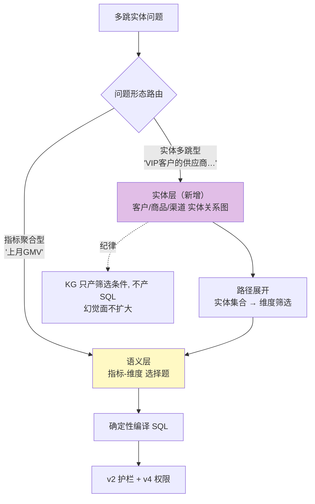
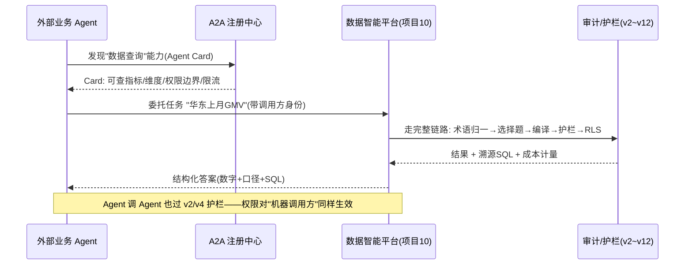
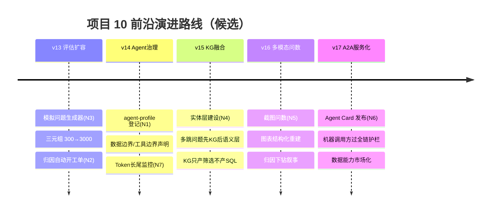

# 项目 10：数据智能分析平台 — 15-工业前沿与演进方向（收官）

> **定位**：对项目 10 做**工业前沿调研**——梳理 2026 年 Google / AWS / Nebius 等关于生产级 Agent 与数据智能的最佳实践，对照项目 10 找缺口，给出 **v13 起的演进方向**。读者画像：想把本项目对齐行业前沿、规划下一步演进的读者。前置阅读：[00-需求分析与架构设计](00-需求分析与架构设计.md)、[14-ADR架构决策记录](14-ADR架构决策记录.md)、[教程 08-架构师进阶/01-高级RAG与AgenticRAG]、[前沿 00-A2A协议]。
>
> **来源**：本文引用均为真实外部资料，已标注链接（CLAUDE.md 规则 14）；调研结论映射到本项目演进，不虚构"行业数据"。

---

## 1. 四问

| 问 | 答 |
|----|----|
| **新增了什么需求** | 前沿对齐：识别 2026 数据智能的五个行业转变，对照项目 10 十二个版本找缺口，规划 v13 起演进 |
| **影响了哪些模块** | 暂不改代码——产出演进路线图；新增能力组（Agent 治理/模拟评估/KG 融合/多模态问数/A2A 服务化）列为后续迭代候选 |
| **架构如何演进** | 从"内部数据平台"向"可被其他 Agent 调用的数据服务 + 自身作为数据 Agent 被治理"双向演进 |
| **上一版痛点是什么** | ① 平台建完即"封版"，没有对照行业前沿的自查框架 ② 缺口不知道优先级（先做哪个） |

> **本节核对（四问一句话）**：两条痛点分别被 §3 对照表（有自查框架）与 §5 演进路线（N 项标优先级）回应，"暂不改代码、产出路线图"与正文各节一致。

## 2. 调研结论：2026 数据智能的五个转变

三大来源的共识提炼（原文见文末链接），落在数据智能场景：

1. **Agent 是运维软件，不是聊天机器人**（[Google 生产级 Agent 五指南](https://cloud.google.com/blog/topics/developers-practitioners/five-guides-to-building-and-scaling-production-ready-ai-agents)）：每个 Agent 要集中登记——所有者、目标数据、允许工具。数据 Agent 拿着只读账号查数仓，本身就是需要被治理的"数据访问主体"。
2. **Agent 失败是系统失败，不是模型失败**（[Nebius Agents Blueprint](https://nebius.com/blog/posts/introducing-the-nebius-agents-blueprint)）：单步 95% 成功率，十步任务只剩 ~60%；检索质量/编排/评估的影响大于换模型。对 Text2SQL：**语义层与评测体系的价值 > 换更强模型**——这正是 ADR-501 的行业佐证。
3. **评估驱动开发，评估资产企业自持**（[AWS 企业生产级 Agent 指南](https://cloud.it168.com/a2026/0708/6939/000006939041.shtml)）：40% Agent 项目因成本/价值/风险被砍；金标数据集与评分标准是护城河，不能依赖第三方。项目 10 的 `golden_triplets`（v11）正是这类资产。
4. **模拟先行（Simulate first）**（[Nebius Agents Blueprint](https://nebius.com/blog/posts/introducing-the-nebius-agents-blueprint)）：部署前跑数百个模拟任务，产出评估集与回归套件——比上线后用真实业务流量试错便宜一个量级。
5. **开放标准互操作：MCP 是工具桥，A2A 是 Agent 桥**（[Google 生产级 Agent 五指南](https://cloud.google.com/blog/topics/developers-practitioners/five-guides-to-building-and-scaling-production-ready-ai-agents)）：数据能力将以 Agent Card 形式被其他 Agent 发现与调用——数据平台从"给人用的 BI"变成"给 Agent 用的数据服务"。

> **本节核对（五个转变一句话）**：五条转变均标注了外部来源链接（规则 14），且能映射到本项目（如"评估资产企业自持"↔v11 `golden_triplets`，"模拟先行"↔v11 归因），无无出处"行业数据"。

## 3. 前沿特性对照（项目 10 缺口）

| # | 前沿特性 | 来源 | 项目 10 现状 | 演进方向 |
|---|---------|------|-------------|---------|
| N1 | **Agent 级治理**：数据 Agent 登记/所有者/数据边界/工具边界 | [Google](https://cloud.google.com/blog/topics/developers-practitioners/five-guides-to-building-and-scaling-production-ready-ai-agents) | 治理的是"指标/查询"，未治理"平台自身作为 Agent" | 新增 `agent-profile` 登记：本平台的目标数据（三库+只读副本）、允许工具（catalog 查询/编译/执行）、所有者与升级路径——把 v2~v12 的安全资产打包成对外可审计的 Agent Profile |
| N2 | **评估驱动 Text2SQL**：企业自持金标 + 归因闭环 | [AWS](https://cloud.it168.com/a2026/0708/6939/000006939041.shtml) | v11 已有三元组+归因（领先项） | 深化：归因报告自动生成"优化工单"（补术语/修 schema），接入数据飞轮（[教程 08-架构师进阶/07-数据飞轮与持续改进]） |
| N3 | **模拟先行**：部署前模拟任务产出评估集 | [Nebius](https://nebius.com/blog/posts/introducing-the-nebius-agents-blueprint) | 金标靠人工标注积累 | 新增"模拟问题生成器"：用 LLM 按指标字典批量生成变体问法，分析师只审核 gold SQL——三元组从 300 条到 3000 条的成本降一个量级 |
| N4 | **语义层 + 知识图谱融合**：实体/关系多跳补齐语义层盲区 | [Google](https://cloud.google.com/blog/topics/developers-practitioners/five-guides-to-building-and-scaling-production-ready-ai-agents)（Agentic 检索章节） | 语义层是"指标-维度"平面结构 | 语义层之上加实体层（客户/商品/渠道的实体与关系），跨实体多跳问题先走 KG 再落语义层（[教程 05-Observation可观测/02-组件交互：Registry、Handler、Convention、Filter协作 §GraphRAG]、[附录 10-知识图谱工程]） |
| N5 | **自然语言 BI 多模态化**：图表理解/截图问数/语音问数 | [Nebius](https://nebius.com/blog/posts/introducing-the-nebius-agents-blueprint)（多模态输入章节） | v6 报表是"文生图"，无"图问数" | 反向链路：上传报表截图问"这个图为什么 6 月掉了"——多模态输入经 `UserMessage+Media`（[教程 09-前沿专题/02-多模态Agent开发]）+ 图表结构化重建 + 归因下钻 |
| N6 | **A2A 数据服务互操作**：Agent Card 描述数据能力，被其他 Agent 调用 | [Google](https://cloud.google.com/blog/topics/developers-practitioners/five-guides-to-building-and-scaling-production-ready-ai-agents)、[前沿 00-A2A协议] | 平台只服务人类用户 | 数据能力封装为 A2A 服务：Agent Card 声明"可查询指标/维度/权限边界"，外部 Agent 按 Card 委托取数——v2~v12 的护栏/权限/审计天然成为 A2A 的安全底座 |
| N7 | **Token 长尾监控**：一次错误执行路径乘数放大账单 | [Nebius](https://nebius.com/blog/posts/introducing-the-nebius-agents-blueprint) | v7 有预算与归因，无长尾分析 | 成本报表加 P99 长尾维度：识别"一次失败重试链"的成本乘数 |

**读图要点**：五个方向没有一个是从零开始——全部踩在 v2~v12 的既有资产上。这是"评估/护栏/血缘先行"策略的复利：前沿到来时，底座已经在了。

### 3.1 本节核对（前沿特性对照）

- [ ] N1–N7 每条都标了来源（Google/AWS/Nebius）与"项目 10 现状 + 演进方向"，无"现状描述与 [vX 落地] 现实不符"
- [ ] "现状"列引用的既有能力（v11 三元组、v7 预算、v6 报表）都真实存在于对应篇，无把规划当现状
- [ ] 七个方向当前都标注为"演进方向/候选"，非已实现能力（与 §5 的"候选"口径一致）

## 4. 两大高优先方向的设计预研

### 4.1 语义层 + 知识图谱融合（N4）

语义层擅长"指标聚合"（GMV 按区域/渠道下钻），不擅长"实体多跳"（"华东 VIP 客户的供应商在华南的订单"——客户→供应商→订单三跳）。融合架构：

**纪律不变**：KG 展开的结果是"实体 ID 集合 → 语义层维度筛选值"，SQL 仍由 `MetricCompiler` 确定性编译——把 [ADR-509（开放→封闭）](14-ADR架构决策记录.md)的原则延伸到新组件，**任何新能力都不允许重新打开 LLM 直生 SQL 的口子**。

### 4.1.1 本节核对（语义层 + KG 融合预研）

- [ ] 问题形态路由（指标聚合型→语义层 / 实体多跳型→KG）与 flow chart 的 `ROUTE` 分支一致
- [ ] "KG 只产筛选条件、不产 SQL"（`KG -. 纪律 .-> NOTE`）延续 ADR-509 开放→封闭原则，无扩开 LLM 直生 SQL 口子的设计
- [ ] 本预研为"设计方向"非已实现能力，落地时须按 [00](00-需求分析与架构设计.md) 四问重走

### 4.2 A2A 数据服务互操作（N6）

**关键点**：A2A 化不是新开一条"免检通道"，而是把既有链路（术语归一 → 选择题 → 编译 → 护栏 → RLS → 审计）原样暴露为服务。调用方从"人"变成"Agent"，护栏一个都不能少——`UserContext.tenantId` 换成调用方 Agent 的身份（[教程 03-React前端与AgenticUI/02-React与SSE流式UI §多租户] 的主体泛化）。这也是 N1（Agent 级治理）的落点：平台对外的 Agent Card 就是它的"数据边界声明"。

### 4.2.1 本节核对（A2A 数据服务预研）

- [ ] sequenceDiagram 中`发现→委托→全链执行→返回`与既有链路（术语归一→选择题→编译→护栏→RLS→审计）一致，无"免检通道"
- [ ] "机器调用方也过人/机器护栏"（`UserContext.tenantId` 换 Agent 身份）延续 v4/v9 多租户原则，未降低安全边界
- [ ] 属于预研设计，落地时过 [00](00-需求分析与架构设计.md) 四问纪律（新增需求/影响模块/架构演进/上一版痛点）

## 5. 演进路线（v13 起，规划非承诺）

优先级理由：**v13/v14（评估+治理）先行**——它们直接强化已有护城河且无新风险面；**v15（KG）次之**——补语义层盲区但引入新组件复杂度；**v16/v17 最后**——多模态与 A2A 依赖前面的安全与治理底座先就位（对外暴露前必须先"自证清白"）。

> **本节核对（演进路线）**：v13–v17 五站逐一对应 §3 的 N 项（v13↔N2/N3、v14↔N1/N7、v15↔N4、v16↔N5、v17↔N6）；标题"候选/规划非承诺"与 timeline 一致；优先级理由与"不先对外暴露"的安全底线性一致。

### 5.1 演进方向落地验收标准

> 每条前沿方向一行：**预研判据**（什么信号出现才立项）→ **落地验收**（做到什么程度算落地，逐条可检验）。落地的共同底线：任何新能力不得重新打开 LLM 直生 SQL 的口子（ADR-509 延伸）。

| 方向 | 预研判据 | 落地验收（做到即 PASS） | 依赖教程锚点 |
|------|---------|------------------------|-------------|
| v13 模拟问题生成器（N3） | 金标积累速度跟不上指标字典增长（人工标注成瓶颈） | LLM 按指标字典批量生成变体问法，分析师**只审核 gold SQL**；三元组 300→3000 条，单位成本降一个量级；生成的问法进入 v11 归因体系可追踪 | [教程 08-架构师进阶/07-数据飞轮与持续改进] |
| v13 归因自动开工单（N2） | 归因报告人工转优化动作的滞后成为迭代瓶颈 | 归因报告自动生成"优化工单"（补术语/修 schema）进入数据飞轮；工单闭环率与回流效果可度量 | [教程 08-架构师进阶/07-数据飞轮与持续改进] |
| v14 agent-profile 登记（N1） | 平台开始被当作"数据访问主体"审计（对外服务或合规检查前） | 平台自身登记：目标数据（三库+只读副本）/允许工具（catalog 查询/编译/执行）/所有者与升级路径；v2~v12 安全资产打包为对外可审计的 Agent Profile；未登记能力不上线 | [教程 04-企业级架构主干/11-安全与权限控制] |
| v14 Token 长尾监控（N7） | 账单出现"单次执行路径"导致的异常尖刺 | 成本报表增加 P99 长尾维度；能识别"一次失败重试链"的成本乘数并归因到具体执行路径 | 无外部教程锚点（复用 v7 预算与归因既有埋点） |
| v15 语义层 + KG 融合（N4） | "实体多跳"问题（客户→供应商→订单类）在真实问数中占比可观 | 问题形态路由上线：指标聚合型走语义层、实体多跳型先 KG 展开为实体 ID 集合再落语义层维度筛选；**KG 只产筛选条件不产 SQL**，SQL 仍由 `MetricCompiler` 确定性编译（抽取任意一条多跳答案的 SQL 验证无 LLM 直生片段） | [附录 10-知识图谱工程] |
| v16 多模态问数（N5） | 用户开始拿报表截图问"为什么掉了" | 上传截图 → 图表结构化重建 → 归因下钻链路可跑通；反向链路答案与正向查数口径一致 | [教程 09-前沿专题/02-多模态Agent开发] |
| v17 A2A 数据服务（N6） | 真实出现外部 Agent 取数需求（有调用方身份与限流诉求） | Agent Card 声明可查指标/维度/权限边界/限流；机器调用方过**全链**护栏（术语归一→选择题→编译→护栏→RLS→审计，零豁免）；`UserContext.tenantId` 换为调用方 Agent 身份后隔离与审计不降级 | [前沿 00-A2A协议] |

**验收用法**：每行"落地验收"即为该迭代立项时的量化验收标准；v13/v14 无外部依赖可先行，v15-v17 依赖前序安全与治理底座（对外暴露前先"自证清白"）。

## 6. 收官：项目 10 的完整弧线

十二个版本 + 进阶三篇 + 决策资产 + 前沿对齐，项目 10 走完了数据智能平台的完整弧线：

**能查（v1）→ 安全（v2）→ 准确（v3）→ 隔离（v4）→ 会选（v5）→ 好看（v6）→ 省钱（v7）→ 可信（v8）→ 可治理（v9）→ 口径成体系（v10）→ 评测能归因（v11）→ 变更有雷达（v12）→ 决策有资产（14）→ 前沿有对齐（15）**。

检验标准（呼应 [10 §1](10-核心代码讲解.md)）：能独立复述六个关键设计——语义层确定性编译（为什么开放变封闭）、安全在 DB 层（为什么 prompt 不是边界）、join 预定义图（为什么不让 LLM join）、先查 Catalog 再查数据（为什么路由是选择题）、缓存命中验权限（为什么省钱不能省安全）、对账防 clean-looking wrong（为什么数值不用 LLM 判）——它们是从"会调 Text2SQL API"到"能设计数据智能平台"的分水岭，而 [14-ADR架构决策记录](14-ADR架构决策记录.md) 把每个"为什么"都留了底。

**项目 10 至此收官。** 前沿路线（v13 起）是给未来的地图，不是本文的欠债——当你真的要走向 KG 融合或 A2A 服务化时，回到 [00](00-需求分析与架构设计.md) 的四问纪律重新开始：新增了什么需求、影响了哪些模块、架构如何演进、上一版的痛点是什么。

> **本节核对（收官一句话）**："六个关键设计"分水岭与 [10 §1](10-核心代码讲解.md) 的六个设计一致；[14](14-ADR架构决策记录.md) 承接下来"每个为什么留了底"，收官弧线闭环、无未兑现承诺。

1. Google, *Five guides to building and scaling production-ready AI agents* — <https://cloud.google.com/blog/topics/developers-practitioners/five-guides-to-building-and-scaling-production-ready-ai-agents>
2. AWS 企业生产级 Agent 指南（转载） — <https://cloud.it168.com/a2026/0708/6939/000006939041.shtml>
3. Nebius, *Introducing the Nebius Agents Blueprint* — <https://nebius.com/blog/posts/introducing-the-nebius-agents-blueprint>
