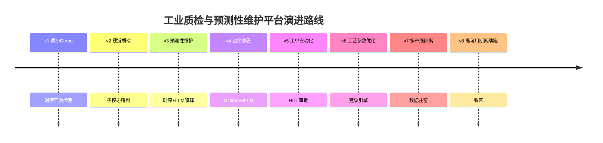
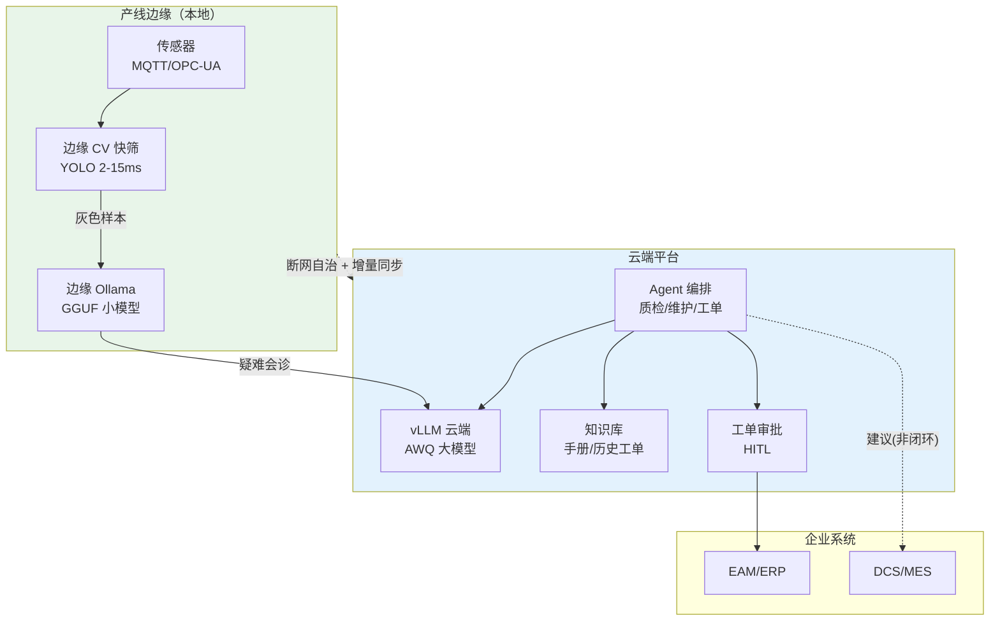

# 项目 11：工业质检与预测性维护 — 00-需求分析与架构设计

> **定位**：某制造业工厂的质检与设备维护 Agent 平台——产线视觉质检（多模态 LLM 精判）、设备预测性维护（时序 + LLM 解释）、维护工单自动化（HITL）、边缘部署与断网续跑。项目 11 是**完整独立**的项目，不依赖也不引用其他项目。**本项目的核心使命：把教程 44（边缘部署）、前沿 02（多模态）、教程 30（容错）、教程 40（长任务）在"制造业工业场景"落地。**
>
> 「遇到阻塞？→ [教程 44-多模型协作与供应策略 §边缘部署]、[前沿 02-多模态Agent]、[教程 30-容错与弹性设计]、[教程 40-长任务持久化与中断恢复]」

---

## 1. 业务场景

### 1.1 背景

某工厂有 3 条注塑产线、2 条装配线，核心设备 40 台。现状：

| 痛点 | 数据 |
|------|------|
| **质检靠人眼** | 质检员日检 2000 件，小缺陷漏检率 14%（疲劳），判级标准不一 |
| **设备故障停机** | 平均每月 3 次非计划停机，每次损失 ≥ 5 万元（停机 2 小时 × 产值） |
| **维护靠事后** | 坏了才修（reactive），备件无预测、维修排期被动 |
| **工单靠手工** | 预测到异常→人肉写工单→跨 CMMS/排程协调，最长 2 周 |
| **断网即停** | 边缘依赖云，产线断网后本地无法决策 |

### 1.2 项目目标

1. **视觉质检**：小模型快筛 + 多模态 LLM 精判的接力架构，缺陷识别率 ≥ 99%，判级可解释
2. **预测性维护**：传感器时序异常检测 + LLM 根因解释，故障预警提前 14-21 天
3. **维护工单自动化**：预测 → 建议工单 → HITL 审批 → 接入 EAM/ERP
4. **边缘部署**：Ollama 边缘 + vLLM 云端双引擎，断网边缘自治续跑
5. **工艺参数优化**：LLM+约束的建议引擎（非闭环写 PLC）

### 1.3 非目标

- 不做产线 PLC 闭环控制（工业安全红线，只做建议引擎+人工确认）
- 不做设备数据采集硬件（传感器/网关已部署，本项目消费 MQTT/OPC-UA）
- 不做质检的毫秒级实时检测回路（那由边缘 CV/YOLO 承担，本项目 Agent 做第二道精判）

## 2. 演进路线

> 核心纪律：**禁止一上来给最终版架构。** 每个迭代由真实痛点驱动，回答四问。



**顺序理由**：

| 顺序 | 决策理由 | 反面 |
|------|---------|------|
| 时序异常在质检前 | 时序检测是 PdM 的地基（v3 复用），先立住 | 先质检——PdM 的时序基础设施未建 |
| 预测性维护在边缘前 | 先验证算法有效，再考虑部署形态 | 先边缘——模型还没验证就上边缘 |
| 工单自动化在预测后 | 工单的前提是"预测准了"；且审批流需要风险分级 | 先工单——预测不准的工单是骚扰 |
| 多产线隔离在后期 | 单产线验证后才有隔离需求 | 先隔离——单产线还不需要 |
| 高可用断网最后 | 稳定运行后才有断网韧性压力 | 先高可用——平台还在演进 |

## 3. 目标架构（v8 终态预览）



**三层漏斗质检**（[调研 工业质检 2026 §三层漏斗]）：L1 边缘 CV 快筛（2-15ms 过滤 95%+）→ L2 边缘 VLM 精判（80-150ms 灰色样本）→ L3 云端大模型疑难会诊。**LLM 只能辅助判级，不能唯一判级依据**。

## 4. 关键 ADR（预录）

| # | 决策 | 理由 |
|---|------|------|
| ADR-011-00 | 质检三层漏斗：CV 快筛 → VLM 精判 → 云端会诊 | LLM 不能承担毫秒级实时；只做灰色样本精判（[调研 §"99%陷阱"解法]） |
| ADR-011-04 | PdM 双轨：统计预筛 + LLM 唤醒 | ICML 2025 LEAD：统计先过滤、LLM 只解释显著事件，Token 降 12 倍 |
| ADR-011-10 | 工单 HITL：建议工单落 EAM 前必须审批 | 2026 现实是"assistive 为主、governed autonomy 起步"（[调研 §工单自动化]） |
| ADR-011-13 | 工艺优化是建议引擎非闭环控制 | 直接写 PLC 是工业安全红线；建议 + 人工确认 |
| ADR-011-07 | 边缘 Ollama + 云端 vLLM 双引擎，断网自治 | 产线断网不可停；边缘自治"感知-决策-执行"本地闭环 |

## 5. 技术栈与依赖

基线：Spring Boot 4.1 + Spring AI 2.0 + WebFlux + Java 21。设备接入 Eclipse Milo（OPC-UA）/MQTT；时序库 TDengine；关系型元数据 PostgreSQL；边缘 Ollama、云端 vLLM；EAM/ERP 走 REST + 审批回调。各迭代新依赖按规范标注「需在 pom.xml 中添加依赖」并给出完整 `<dependency>` 片段。

### 5.1 基线 `pom.xml`（v1 起就存在，后续迭代增量追加）

```xml
<?xml version="1.0" encoding="UTF-8"?>
<project xmlns="http://maven.apache.org/POM/4.0.0"
         xmlns:xsi="http://www.w3.org/2001/XMLSchema-instance"
         xsi:schemaLocation="http://maven.apache.org/POM/4.0.0 https://maven.apache.org/xsd/maven-4.0.0.xsd">
    <modelVersion>4.0.0</modelVersion>
    <parent>
        <groupId>org.springframework.boot</groupId>
        <artifactId>spring-boot-starter-parent</artifactId>
        <version>4.1.0</version>
        <relativePath/>
    </parent>
    <groupId>com.plant</groupId>
    <artifactId>iq-agent</artifactId>
    <version>0.1.0</version>
    <name>iq-agent</name>

    <properties>
        <java.version>21</java.version>
    </properties>

    <dependencyManagement>
        <dependencies>
            <dependency>
                <groupId>org.springframework.ai</groupId>
                <artifactId>spring-ai-bom</artifactId>
                <version>2.0.0</version>
                <type>pom</type>
                <scope>import</scope>
            </dependency>
        </dependencies>
    </dependencyManagement>

    <dependencies>
        <dependency>
            <groupId>org.springframework.boot</groupId>
            <artifactId>spring-boot-starter-webflux</artifactId>
        </dependency>
        <dependency>
            <groupId>org.springframework.ai</groupId>
            <artifactId>spring-ai-starter-model-openai</artifactId>
        </dependency>
        <dependency>
            <groupId>org.projectlombok</groupId>
            <artifactId>lombok</artifactId>
            <optional>true</optional>
        </dependency>
        <dependency>
            <groupId>org.springframework.boot</groupId>
            <artifactId>spring-boot-starter-jdbc</artifactId>
        </dependency>
        <dependency>
            <groupId>org.springframework.integration</groupId>
            <artifactId>spring-integration-mqtt</artifactId>
        </dependency>
        <dependency>
            <groupId>com.taosdata.jdbc</groupId>
            <artifactId>taos-jdbcdriver</artifactId>
            <version>3.2.7</version>
        </dependency>
        <dependency>
            <groupId>org.springframework.boot</groupId>
            <artifactId>spring-boot-starter-test</artifactId>
            <scope>test</scope>
        </dependency>
    </dependencies>
</project>
```

> 完整可手写代码从 [01-最小Demo搭建.md](01-最小Demo搭建.md) 开始：每篇给出**完整 Java 类（含全部 import）、完整 `application.yml`、完整 SQL DDL**，一行不省略。

## 6. 迭代与教程知识点对照

| 迭代 | 落地的教程知识 |
|------|---------------|
| 01 时序异常 | [教程 30-容错与弹性设计 §异常检测]、[附录 06-WebFlux与响应式编程] |
| 02 视觉质检 | [前沿 02-多模态Agent]、[教程 03-工具调用] |
| 03 预测性维护 | [教程 39-高级记忆架构 §时序记忆]、[教程 05-RAG] |
| 04 边缘部署 | [教程 44-多模型协作与供应策略 §边缘部署] |
| 05 工单自动化 | [教程 28-Human-in-the-Loop与审批流]、[附录 05-SpringAI2-API基准/02 §1.3] |
| 06 工艺优化 | [教程 08-Plan-and-Execute模式]、[教程 37-自我反思与Agent评估] |
| 07 多产线隔离 | [教程 26-多租户隔离与资源治理]、[教程 37 §Reactor Context] |
| 08 高可用断网 | [教程 30-容错与弹性设计]、[教程 33-部署与运维 §演练] |

## 7. 下一步

→ [01-最小Demo搭建.md](01-最小Demo搭建.md) — 不是采集系统的复刻，而是把传感器时序接入 + 异常检测跑通的最小内核。

---

## 8. 代码使用说明（照抄前必读）

本项目的代码遵循「项目文档不生成 .java 文件、代码由用户手写」的规范，但**代码已升级为完整可手写**：

1. **框架 API 全部真实**：Spring AI 2.0.0 的 `ChatClient`/`@Tool`/`CallAdvisor`/`ToolCallingManager`/多模态 `.media()`/`entity()` 结构化输出均按 [附录 05-SpringAI2-API基准] 的真实签名书写，**含全部 import、无 `...` 省略，可照抄编译**。
2. **自定义业务类是完整实现**：如 `EwmaAnomalyDetector`、`VisionService`、`RulEstimator`、`WorkOrderApprovalManager` 等均为完整可手写类（含 import、含方法体）；标注「概念代码」的仅限**外部系统接入点**（YOLO 服务、MLOps 平台、通知网关），那是你按环境补齐的边界。
3. **依赖标注**：凡引入 pom.xml 未声明的新依赖，均标注「需在 pom.xml 中添加依赖」并给出完整 `<dependency>` 片段。
4. **WebFlux 一致性**：所有代码遵循响应式铁律（Reactor Context 传请求上下文、禁 ThreadLocal、EventLoop 上禁 block、WebClient 非阻塞调用）。
5. **演进式阅读**：每个迭代篇都从"上一版痛点"出发，回答"新增需求→影响模块→架构演进→痛点"四问，请按 `00 → 01 → 02 → ...` 顺序阅读，不要跳读最终版。
