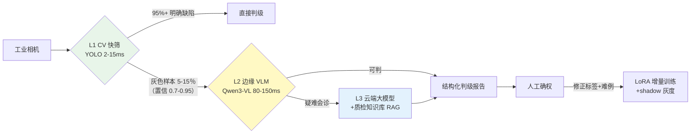

# 项目 11：工业质检与预测性维护 — 02-视觉质检多模态

> **定位**：把质检从"人眼 + 判级不一"升级为"边缘 CV 快筛 + 多模态 LLM 精判"的三层接力架构——小模型毫秒级过滤，LLM 只对灰色样本精判并输出可解释判级报告。前沿 02 多模态 + 教程 00-基础与核心/03-工具调用 工具调用的落地。本文给出**完整可手写代码**。
>
> 「遇到阻塞？→ [前沿 02-多模态Agent]、[教程 00-基础与核心/03-工具调用]、[教程 02-SpringAI核心机制/03-结构化输出]；API 真实性以 [附录 05-SpringAI2-API基准] 为准」

---

## 1. 四问

| 问 | 答 |
|----|----|
| **新增了什么需求** | 视觉质检三层漏斗；结构化判级报告（缺陷位置/类型/置信度/理由）；质检数据闭环（人工确权 → 难例回流 → 增量训练） |
| **影响了哪些模块** | 新增 VisionService（边缘 CV + 边缘 VLM + 云端会诊）、InspectionAgent（@Tool 编排）、DataFlywheel（数据闭环）；新增第二数据源 PostgreSQL（关系型元数据） |
| **架构如何演进** | 数据管线之上长出"AI 精判层"：Controller → InspectionAgent（@Tool）→ VisionService（YOLO + 多模态 LLM）→ DataFlywheel 闭环 |
| **上一版痛点是什么** | ① 质检靠人眼，漏检 14%、判级不一 ② 判级不可解释 ③ 模型漂移无感知 |

### 1.1 本节核对（四问）

- [ ] 第 3 行"架构演进"与 §4 代码产物（Controller → InspectionAgent(@Tool) → VisionService(YOLO+VLM) → DataFlywheel）链路一一对应，无缺件
- [ ] 第 4 行三个痛点分别被 §4.10 数据闭环 / §3.5 过程可见 / ADR-011-03 覆盖

## 2. 目标与量化验收

| # | 目标 | 验收 |
|---|------|------|
| 1 | 缺陷识别率 | 综合缺陷识别率 ≥ 99%（对照人工 + 标准件） |
| 2 | 节拍 | L1 CV 快筛 < 15ms（产线节拍内）；L2 灰色样本精判 < 200ms |
| 3 | 判级可解释 | 精判报告 100% 含位置/类型/置信度/理由 |
| 4 | 漏检率 | 小缺陷漏检率从 14% 降到 < 5% |
| 5 | 数据闭环 | 人工确权 100% 回流；难例达标触发增量训练 |

**本迭代明确不做**：预测性维护（v3）、边缘部署（v4）、工单（v5）。

### 2.1 本节核对（目标与量化验收）

- [ ] 五项验收（识别率 ≥ 99% / L1<15ms 且 L2<200ms / 判级报告 100% 可解释 / 漏检 < 5% / 确权 100% 回流）都能在 §4 代码三件套（VisionService / DefectReport / DataFlywheel）中找到落地类
- [ ] 验收项 5"难例达标触发增量训练"对应 §4.10 `DataFlywheel` 的 `TRAIN_THRESHOLD=500` 常量

## 3. 三层漏斗质检

> **为什么三层**（[调研 工业质检 2026 §三层漏斗]）：传统 CV（YOLO）2-15ms、>500FPS 承担产线节拍；多模态 LLM 处理置信度 0.70~0.95 的**灰色样本**（约 5%-15% 总量）并输出解释；云端大模型做疑难会诊。**LLM 不能承担毫秒级实时，只做第二道精判**。



### 3.5 质检判定过程可见

> 过程可见性是工业级标配。质检 Agent 判"合格/缺陷"要看得见依据——哪个 ROI 区域、模型置信、缺陷类型。检测 emit 质检事件：`{img, 置信, 缺陷类型, 命中ROI框, 判定}`。质检员看到"区域#3 置信0.87→判为划痕→复检"，可点开查实时 ROI 框；低置信自动转人工复核（过程可见+衔接 HITL）。

### 3.6 本节核对（三层漏斗与过程可见）

- [ ] 三层漏斗（L1 CV 快筛 → L2 边缘 VLM 灰色样本 → L3 云端会诊）与 §4.9 `InspectionAgent.inspect` 的分支逻辑（`confidence >= 0.95` 直接判 / 否则精判）一致，且与 ADR-011-01"LLM 只做灰色样本精判"不矛盾
- [ ] 过程可见（emit 质检事件 + 低置信转人工）与 §4.11 `InspectionController.confirm` 的难例回流衔接

## 4. 完整代码（照抄即可，一行不省略）

### 4.1 `pom.xml` 追加依赖

```xml
        <!-- 追加（v2）：关系型元数据存储（质检难例回流） -->
        <dependency>
            <groupId>org.postgresql</groupId>
            <artifactId>postgresql</artifactId>
            <scope>runtime</scope>
        </dependency>
```

### 4.2 `application.yml` 追加第二数据源

```yaml
spring:
  datasource:
    url: jdbc:TAOS-RS://taos-server:6041/iq_plant
    username: root
    password: ${TAOS_PASSWORD:taosdata}
    driver-class-name: com.taosdata.jdbc.rs.RestfulDriver
    app:                                   # 第二数据源：关系型元数据
      url: jdbc:postgresql://localhost:5432/iq_plant
      username: ${DB_USER:postgres}
      password: ${DB_PASSWORD:postgres}
```

### 4.3 SQL DDL `db/schema-v2.sql`

```sql
-- PostgreSQL（db: iq_plant）——质检难例回流库（防模型漂移）
CREATE TABLE IF NOT EXISTS inspection_hard_example (
    id            BIGSERIAL PRIMARY KEY,
    image_id      VARCHAR(64)  NOT NULL,
    model_label   VARCHAR(32)  NOT NULL,
    correct       BOOLEAN      NOT NULL,
    correct_label VARCHAR(32),
    line_id       VARCHAR(32)  NOT NULL DEFAULT 'line-a',
    ts            TIMESTAMPTZ  NOT NULL DEFAULT now()
);
CREATE INDEX IF NOT EXISTS idx_hard_example_ts ON inspection_hard_example (ts);
```

### 4.4 `AppDataSourceConfig.java`（第二数据源，关系型元数据）

```java
package com.plant.iq.config;

import org.springframework.beans.factory.annotation.Qualifier;
import org.springframework.boot.context.properties.ConfigurationProperties;
import org.springframework.boot.jdbc.DataSourceBuilder;
import org.springframework.context.annotation.Bean;
import org.springframework.context.annotation.Configuration;
import org.springframework.jdbc.core.JdbcTemplate;

import javax.sql.DataSource;

/** 第二数据源：关系型元数据（质检难例/工单/审批）；TDengine 只扛高频时序 */
@Configuration
public class AppDataSourceConfig {

    @Bean(name = "appDataSource")
    @ConfigurationProperties(prefix = "spring.datasource.app")
    public DataSource appDataSource() {
        return DataSourceBuilder.create().build();
    }

    @Bean(name = "appJdbcTemplate")
    public JdbcTemplate appJdbcTemplate(@Qualifier("appDataSource") DataSource ds) {
        return new JdbcTemplate(ds);
    }
}
```

### 4.5 `AgentConfig.java`（默认 ChatClient 通道）

```java
package com.plant.iq.config;

import org.springframework.ai.chat.client.ChatClient;
import org.springframework.context.annotation.Bean;
import org.springframework.context.annotation.Configuration;
import org.springframework.context.annotation.Primary;

@Configuration
public class AgentConfig {

    /**
     * 默认模型通道（云端）——v2 起多模态/结构化输出走这里；
     * @Primary 使无限定注入（如 ModelTierRouter）拿到云端通道；v4 另加边缘通道。
     */
    @Bean
    @Primary
    public ChatClient chatClient(ChatClient.Builder builder) {
        return builder
                .defaultSystem("你是工厂质检与设备维护助手。基于证据回答，不臆测。")
                .build();
    }
}
```

### 4.6 领域记录 `DefectBox` / `DefectReport` / `InspectionDecision`

```java
package com.plant.iq.vision;

/** L1 边缘 CV 返回的缺陷框 */
public record DefectBox(String defectType, double confidence,
                        double x, double y, double w, double h) {}
```

```java
package com.plant.iq.vision;

import com.fasterxml.jackson.annotation.JsonIgnoreProperties;
import com.fasterxml.jackson.annotation.JsonProperty;

/** VLM 精判输出的结构化判级报告（必须可解释——质检员要能复核） */
@JsonIgnoreProperties(ignoreUnknown = true)
public record DefectReport(
        @JsonProperty("defect_type") String defectType,     // 气孔/缺料/杂质/颜色不均/无缺陷
        @JsonProperty("location") String location,           // 缺陷位置（如 "R3.5mm 圆角过渡区"）
        @JsonProperty("size_mm") double sizeMm,              // 缺陷尺寸
        @JsonProperty("confidence") double confidence,       // 置信度 0-1
        @JsonProperty("reasoning") String reasoning,         // 判级理由（可解释性）
        @JsonProperty("suggested_action") String suggestedAction) {}   // 返工/报废/放行
```

```java
package com.plant.iq.vision;

import java.util.List;

public record InspectionDecision(
        String imageId,
        List<DefectBox> boxes,
        DefectReport report,
        DecisionSource source) {

    public enum DecisionSource { L1_CV_DEFECT, L2_VLM_JUDGED, L3_CLOUD_CONSULT }

    public static InspectionDecision definite(String imageId, List<DefectBox> boxes) {
        return new InspectionDecision(imageId, boxes, null, DecisionSource.L1_CV_DEFECT);
    }

    public static InspectionDecision judged(String imageId, List<DefectBox> boxes, DefectReport report) {
        return new InspectionDecision(imageId, boxes, report, DecisionSource.L2_VLM_JUDGED);
    }
}
```

### 4.7 `ImageStore.java`（图像缓存）

```java
package com.plant.iq.vision;

import org.springframework.stereotype.Component;

import java.util.Map;
import java.util.concurrent.ConcurrentHashMap;

@Component
public class ImageStore {

    private final Map<String, byte[]> store = new ConcurrentHashMap<>();

    public void save(String imageId, byte[] imageBytes) {
        store.put(imageId, imageBytes);
    }

    public byte[] load(String imageId) {
        byte[] bytes = store.get(imageId);
        if (bytes == null) throw new IllegalArgumentException("图像不存在: " + imageId);
        return bytes;
    }
}
```

### 4.8 `VisionService.java`（YOLO 快筛 + VLM 精判）

```java
package com.plant.iq.vision;

import org.springframework.ai.chat.client.ChatClient;
import org.springframework.core.io.ByteArrayResource;
import org.springframework.stereotype.Service;
import org.springframework.util.MimeTypeUtils;
import org.springframework.web.reactive.function.client.WebClient;

import java.util.List;
import java.util.Map;

@Service
public class VisionService {

    private final ChatClient visionChatClient;
    private final WebClient yoloWebClient;

    public VisionService(ChatClient visionChatClient, WebClient.Builder webClientBuilder) {
        this.visionChatClient = visionChatClient;
        this.yoloWebClient = webClientBuilder.baseUrl("http://edge-yolo:9000").build();
    }

    /** L1 边缘 CV 快筛：毫秒级，返回缺陷框（下游 YOLO HTTP 服务） */
    public List<DefectBox> fastScreen(String imageId, byte[] imageBytes) {
        YoloResult result = yoloWebClient.post()
                .uri("/detect")
                .bodyValue(Map.of("imageId", imageId, "bytes", imageBytes))
                .retrieve()
                .bodyToMono(YoloResult.class)
                .block();   // 工具执行线程（非 EventLoop），block 可接受
        return result == null ? List.of() : result.boxes();
    }

    /** L2 边缘 VLM 精判：多模态 LLM 输出结构化判级报告 */
    public DefectReport precisionJudge(String imageId, byte[] imageBytes) {
        return visionChatClient.prompt()
                .system("""
                        你是注塑件质检专家。根据图像输出结构化判级报告：
                        1. defect_type: 气孔/缺料/杂质/颜色不均/无缺陷
                        2. location: 缺陷位置描述
                        3. size_mm: 缺陷尺寸（毫米）
                        4. confidence: 置信度 0-1
                        5. reasoning: 判级理由（质检员要能复核）
                        6. suggested_action: 返工/报废/放行
                        只基于图像，不臆测；证据不足时降低置信度。
                        """)
                .user(u -> u
                        .text("请判级这张注塑件图像（imageId=" + imageId + "）：")
                        .media(MimeTypeUtils.IMAGE_JPEG, new ByteArrayResource(imageBytes)))
                .call()
                .entity(DefectReport.class);
    }
}
```

```java
package com.plant.iq.vision;

import java.util.List;

/** 边缘 YOLO 服务的返回体 */
public record YoloResult(String imageId, List<DefectBox> boxes) {}
```

### 4.9 `InspectionAgent.java`（三层漏斗编排 + @Tool）

```java
package com.plant.iq.vision;

import org.springframework.ai.tool.annotation.Tool;
import org.springframework.ai.tool.annotation.ToolParam;
import org.springframework.stereotype.Component;
import reactor.core.publisher.Mono;
import reactor.core.scheduler.Schedulers;

import java.util.List;

@Component
public class InspectionAgent {

    private final VisionService visionService;
    private final ImageStore imageStore;

    public InspectionAgent(VisionService visionService, ImageStore imageStore) {
        this.visionService = visionService;
        this.imageStore = imageStore;
    }

    @Tool(description = "调用边缘 CV 快筛，返回缺陷框与置信度（毫秒级）")
    public List<DefectBox> fastScreen(
            @ToolParam(description = "图像 ID") String imageId) {
        return visionService.fastScreen(imageId, imageStore.load(imageId));
    }

    @Tool(description = "对灰色样本调用边缘 VLM 精判，返回结构化缺陷报告")
    public DefectReport precisionJudge(
            @ToolParam(description = "图像 ID") String imageId) {
        return visionService.precisionJudge(imageId, imageStore.load(imageId));
    }

    /** 三层漏斗编排：快筛 → 明确缺陷直接判 / 灰色样本精判 */
    public Mono<InspectionDecision> inspect(String imageId) {
        return Mono.fromCallable(() -> {
                List<DefectBox> boxes = fastScreen(imageId);
                boolean allCertain = !boxes.isEmpty()
                        && boxes.stream().allMatch(b -> b.confidence() >= 0.95);
                return allCertain
                        ? InspectionDecision.definite(imageId, boxes)
                        : InspectionDecision.judged(imageId, boxes,
                                precisionJudge(imageId, imageStore.load(imageId)));
            })
            .subscribeOn(Schedulers.boundedElastic());
    }
}
```

### 4.10 数据闭环 `DataFlywheel` + `MlopsGateway`

```java
package com.plant.iq.vision;

public interface MlopsGateway {
    /** 触发增量训练（LoRA < 30 分钟）→ shadow 并行 → 灰度切流 */
    void triggerIncrementalTrain();
}
```

```java
package com.plant.iq.vision;

import org.springframework.boot.autoconfigure.condition.ConditionalOnMissingBean;
import org.springframework.stereotype.Component;

@Component
@ConditionalOnMissingBean(MlopsGateway.class)
public class NoopMlopsGateway implements MlopsGateway {
    @Override
    public void triggerIncrementalTrain() {
        // 概念代码：接入你的 MLOps 平台（LoRA 训练 + shadow 灰度切流）
    }
}
```

```java
package com.plant.iq.vision;

import org.springframework.beans.factory.annotation.Qualifier;
import org.springframework.jdbc.core.JdbcTemplate;
import org.springframework.stereotype.Component;

import java.sql.Timestamp;
import java.time.Instant;

/**
 * 质检数据闭环（防漂移）：上线 3 个月误判率可从 2.1% 升到 4.7%——
 * 价值不在"一次完美模型"而在"持续适应产线"（[调研 §质检数据闭环]）。
 */
@Component
public class DataFlywheel {

    private static final int TRAIN_THRESHOLD = 500;

    private final JdbcTemplate appJdbc;
    private final MlopsGateway mlops;

    public DataFlywheel(@Qualifier("appJdbcTemplate") JdbcTemplate appJdbc, MlopsGateway mlops) {
        this.appJdbc = appJdbc;
        this.mlops = mlops;
    }

    /** 人工确权：修正标签 + 难例回流；累计达标触发增量训练 */
    public void confirmAndFeed(String imageId, String modelLabel, boolean correct, String correctLabel) {
        appJdbc.update("INSERT INTO inspection_hard_example(image_id, model_label, correct, correct_label, line_id, ts) "
                        + "VALUES (?, ?, ?, ?, ?, ?)",
                imageId, modelLabel, correct, correctLabel,
                "line-a", Timestamp.from(Instant.now()));
        if (!correct && hardExamplesCount() >= TRAIN_THRESHOLD) {
            mlops.triggerIncrementalTrain();
        }
    }

    public long hardExamplesCount() {
        Long n = appJdbc.queryForObject("SELECT COUNT(*) FROM inspection_hard_example", Long.class);
        return n == null ? 0 : n;
    }
}
```

### 4.11 `InspectionController.java`

```java
package com.plant.iq.web;

import com.plant.iq.vision.ImageStore;
import com.plant.iq.vision.InspectionAgent;
import com.plant.iq.vision.InspectionDecision;
import com.plant.iq.vision.DataFlywheel;
import org.springframework.http.MediaType;
import org.springframework.web.bind.annotation.*;
import reactor.core.publisher.Mono;

import java.util.Map;

@RestController
@RequestMapping("/api/inspection")
public class InspectionController {

    private final InspectionAgent inspectionAgent;
    private final ImageStore imageStore;
    private final DataFlywheel dataFlywheel;

    public InspectionController(InspectionAgent inspectionAgent, ImageStore imageStore,
                                DataFlywheel dataFlywheel) {
        this.inspectionAgent = inspectionAgent;
        this.imageStore = imageStore;
        this.dataFlywheel = dataFlywheel;
    }

    /** 上传图像并触发三层漏斗质检 */
    @PostMapping(value = "/judge/{imageId}", consumes = MediaType.APPLICATION_OCTET_STREAM_VALUE)
    public Mono<InspectionDecision> judge(@PathVariable String imageId, @RequestBody byte[] imageBytes) {
        imageStore.save(imageId, imageBytes);
        return inspectionAgent.inspect(imageId);
    }

    /** 人工确权回流（难例闭环） */
    @PostMapping("/confirm")
    public Map<String, String> confirm(@RequestParam String imageId,
                                       @RequestParam String modelLabel,
                                       @RequestParam boolean correct,
                                       @RequestParam(required = false) String correctLabel) {
        dataFlywheel.confirmAndFeed(imageId, modelLabel, correct, correctLabel);
        return Map.of("status", "recorded");
    }
}
```

### 4.12 本节测试与验证（视觉质检主链路）

**前置条件**：v1 已通过；第二数据源 PostgreSQL（§4.2 `datasource.app`）与 §4.3 `inspection_hard_example` 表已建；`DEEPSEEK_API_KEY` 已导出；下游 YOLO 服务 `edge-yolo:9000` 可连。

**材料——来自正文**：

```sh
# A. 上传图像并触发三层漏斗质检（§4.11 /judge）
curl -X POST "http://localhost:8081/api/inspection/judge/img-001" \
  -H "Content-Type: application/octet-stream" \
  --data-binary @./samples/pick-0001.jpg

# B. 人工确权回流（§4.11 /confirm，难例闭环）
curl -X POST "http://localhost:8081/api/inspection/confirm?imageId=img-001&modelLabel=气孔&correct=false&correctLabel=缺料"
```

```sql
-- C. 难例入库核对（§4.3 DDL）
SELECT image_id, model_label, correct, correct_label FROM inspection_hard_example ORDER BY id DESC LIMIT 3;
```

**步骤与断言**：

| # | 操作 | 预期（PASS 判据） |
|---|------|------------------|
| 1 | 推送合格样件到 /judge，观察快筛 | L1 CV 快筛 < 15ms；明确缺陷直接返回 `DecisionSource.L1_CV_DEFECT`（节拍项） |
| 2 | 推送低对比度灰色样本到 /judge | 走精判分支返回 `L2_VLM_JUDGED` + `DefectReport` 判级报告（L2 < 200ms） |
| 3 | 材料 B /confirm+correctLabel 修正 | 返回 `{"status":"recorded"}`；材料 C 查到以正确标签回流（确权 100% 回流前提） |
| 4 | 抽检 3 份判级报告 | 100% 含位置/类型/置信度/理由（判级可解释项） |
| 5 | 小缺陷样件集逐件 /judge | 小缺陷漏检率 < 5%（对照人工 + 标准件金标） |

**失败排查**：①启动报 `BeanDefinitionOverrideException` 或第二数据源未注入→`AppDataSourceConfig`（§4.4）`@Qualifier("appJdbcTemplate")` 未生效；②/confirm 落库失败→§4.2 yml `app:` 数据源配置或 `inspection_hard_example` 表未建；③判级报告字段空白→`DefectReport` 的 `@JsonProperty` 与 VLM 输出 key 不一致；④L1 超 15ms→YOLO 服务未就绪或 `VisionService.fastScreen` 阻塞在 EventLoop（须工具线程）。

## 5. 本迭代的 ADR

### ADR 011-01：三层漏斗，LLM 只做灰色样本精判
- **决策**：L1 CV 快筛（2-15ms）→ L2 边缘 VLM 精判（灰色样本）→ L3 云端会诊
- **取舍理由**：LLM 无法承担毫秒级实时；"99% 陷阱"的解法——用 CV 过滤 95%+，LLM 只在模糊区精判（[调研 §三层漏斗]）

### ADR 011-02：判级报告结构化 + 可解释
- **决策**：VLM 输出 `DefectReport`（位置/类型/尺寸/置信度/理由/建议），entity() 结构化解析
- **取舍理由**：质检员要能复核；可解释是判级落地的前提

### ADR 011-03：数据闭环（确权 → 难例 → 增量训练）
- **决策**：人工确权 100% 回流难例库，达标触发 LoRA 增量训练 + shadow 灰度
- **取舍理由**：防模型漂移；价值在持续适应产线

### 5.1 本节核对（本迭代 ADR）

- [ ] ADR-011-01/02/03 分别与正文三层漏斗（§3）、`DefectReport` 结构化（§4.6）、`DataFlywheel` 闭环（§4.10）一一对应
- [ ] 三条 ADR 编号与 13-ADR架构决策记录 的 ADR-011-01~03 衔接、无重复

## 6. 全篇回归验证

**回归断言**（§4.12 本节测试与验证通过后，按 §2 验收表整体验收）：

| # | 操作 | 预期（PASS 判据） |
|---|------|------------------|
| 1 | 混合合格/灰色/小缺陷/难例四类样件整体跑一轮 /judge + 确权 | 综合缺陷识别率 ≥ 99%（对照人工 + 标准件，验收项 1） |
| 2 | 对每份判级报告抽检 | 100% 含位置/类型/置信度/理由（验收项 3） |
| 3 | 用小缺陷集统计（含低对比度难例） | 漏检率 < 5%（验收项 4） |
| 4 | 累计确权回流直至难例 ≥ 500 | `DataFlywheel` 触发 `mlops.triggerIncrementalTrain()`（验收项 5） |
| 5 | 压测高峰 L1/L2 | L1 < 15ms、L2 < 200ms（验收项 2） |

**失败排查**：识别率 < 99%→L1 阈值或灰色带划分不当；漏检不降→`ImageStore.load` 取错图或 `VisionService` 喂了降采样图；确权未触发训练→`TRAIN_THRESHOLD` 未达或 `MlopsGateway` 未注入（确认 `NoopMlopsGateway` 仅概念兜底）。

## 7. 验收对照

| 验收项 | 标准 | 状态 |
|--------|------|------|
| 缺陷识别率 | 综合缺陷识别率 ≥ 99%（§2-1，§6 回归） | ☐ |
| 节拍 | L1 CV 快筛 < 15ms、L2 精判 < 200ms（§2-2，§6 回归） | ☐ |
| 判级可解释 | 精判报告 100% 含位置/类型/置信度/理由（§2-3，§6 回归） | ☐ |
| 漏检率 | 小缺陷漏检率 < 5%（§2-4，§6 回归） | ☐ |
| 数据闭环 | 人工确权 100% 回流、难例触发增量训练（§2-5，§6 回归） | ☐ |

## 8. 验收与已知痛点

**验收**：综合识别率 ≥ 99%、L1 < 15ms / L2 < 200ms、判级报告 100% 可解释、漏检率 < 5%、确权 100% 回流。

**已知痛点（驱动下一迭代）**：
1. 质检准了，但**设备维护还是事后**——上月泵轴承坏了停机 2 小时损失 5 万，传感器数据前两周就有振动缓慢爬升的异常信号，没人看
2. 检测信号只有数值，缺 LLM 可读解释与 RUL 寿命预测
3. 维护排期被动，无建议窗口

> **定位回顾**：v2 完成"AI 精判层"。下一站 [03-设备预测性维护.md](03-设备预测性维护.md)——把 v1 的 EWMA 升级为预测性维护（RUL + LLM 解释 + 提前预警）。
