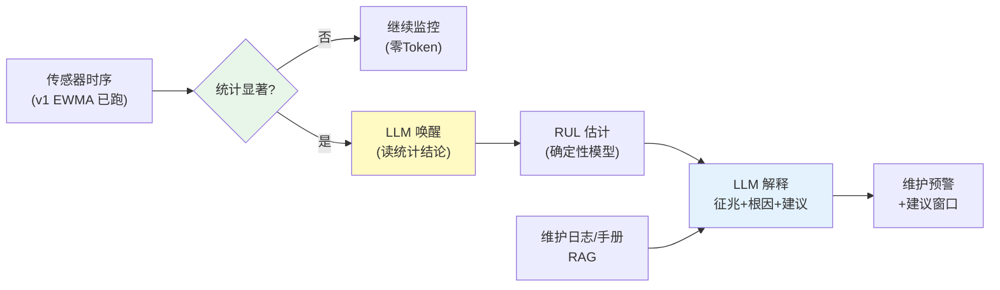

# 项目 11：工业质检与预测性维护 — 03-设备预测性维护

> **定位**：把 v1 的 EWMA 检测升级为完整的 PdM——"统计预筛 + LLM 唤醒"双轨制、RUL 剩余寿命估计、LLM 生成可读的故障解释与维护建议。教程 05-Observation可观测/06-Trace链路：traceId贯穿HTTP、LLM、工具与日志 §时序记忆 + 教程 00-基础与核心/05-RAG检索增强生成 RAG 的落地。本文给出**完整可手写代码**。
>
> 「遇到阻塞？→ [教程 08-架构师进阶/05-高级记忆架构 §时序记忆]、[教程 00-基础与核心/05-RAG检索增强生成]、[附录 01-LLM基础理论/02-上下文窗口与Token]」

---

## 1. 四问

| 问 | 答 |
|----|----|
| **新增了什么需求** | RUL 剩余寿命估计；LLM 解释故障征兆（读统计结论）；维护建议带依据（知识库）；设备健康状态持久化 |
| **影响了哪些模块** | 新增 PdMAnalyzer（RUL 估计 + 信号融合）、MaintenanceInsightService（LLM 唤醒）、MaintenanceKnowledgeBase（手册/历史工单）；复用 v1 的 EWMA 信号流 |
| **架构如何演进** | 在 v1 检测信号之上长出"预测层"：StatSignal（统计显著）→ RUL 确定性估计 → LLM 唤醒生成洞察 → 预警 + 健康状态落库 |
| **上一版痛点是什么** | ① 设备故障事后才发现 ② 传感器信号看不懂 ③ 维护排期被动，无建议窗口 |

### 1.1 本节核对（四问）

- [ ] 第 3 行"架构演进"与 §4 代码产物（StatSignal → RulEstimator → MaintenanceInsightService(LLM 唤醒) → DeviceRegistry 落库）链路对应，复用 v1 的 `StatSignal` 信号流
- [ ] 四个痛点分别被 §4.3 RUL / §4.6 LLM 唤醒 / §4.8 预警落库覆盖

## 2. 目标与量化验收

| # | 目标 | 验收 |
|---|------|------|
| 1 | 预警提前 | 可预测故障预警提前 ≥ 14 天（回测历史故障） |
| 2 | RUL 准确 | RUL 估计 MAE ≤ 20%（回测 30 起故障） |
| 3 | 成本 | LLM 触发率 < 5% 流量（统计预筛生效）；单次洞察 Token ≤ 1k |
| 4 | 解释可读 | 洞察含征兆/根因/建议/证据，维护人员可执行 |
| 5 | 误报可控 | 正常设备误预警率 < 5%（对照历史正常期） |

**本迭代明确不做**：边缘部署（v4）、工单自动化（v5）、工艺优化（v6）。

### 2.1 本节核对（目标与量化验收）

- [ ] 五项验收（预警提前 ≥ 14 天 / RUL MAE ≤ 20% / LLM 触发 < 5% 流量 / 洞察可执行 / 误预警 < 5%）都能在 §4 代码（RulEstimator / MaintenanceInsightService / MaintenanceNotifier）中找到落地件
- [ ] 验收项 3"LLM 触发率 < 5%"对应 §3 双轨制"统计显著事件才唤醒 LLM"

## 3. 双轨制（统计预筛 + LLM 唤醒）

> **核心**（[调研 工业质检 2026 §PdM 双轨制] / ICML 2025 LEAD）：轻量统计（EWMA/CUSUM/孤立森林）在边缘持续跑（CPU，零 Token），**只有统计显著事件才触发 LLM** 做根因解释、生成维护建议——Token 降 12 倍。传感器 + 维护日志多模态融合比纯传感器多发现 65-75% 可预测故障，预测窗口 3-5 天 → 14-21 天。



### 3.1 本节核对（双轨制）

- [ ] 双轨制图中"统计显著?"分支与 §4.6 `MaintenanceInsightService.explainSignal` 只在 `StatSignal` 显著时被调用的实现一致（LLM 不读原始时序，只读 `rul.toPrompt()` 结论）
- [ ] "Token 降 12 倍"的表述与 ADR-011-04、验收项 3（触发 < 5%）口径一致

## 4. 完整代码（照抄即可，一行不省略）

### 4.1 `pom.xml` 追加依赖

v3 无新依赖（知识库为完整可手写的关键词检索；生产换向量检索需引入 `spring-ai-starter-vector-store-pgvector`，见[教程 00-基础与核心/05-RAG检索增强生成]）。

### 4.2 SQL DDL `db/schema-v3.sql`

```sql
-- PostgreSQL（db: iq_plant）——设备健康状态与维护预警
CREATE TABLE IF NOT EXISTS device_status (
    device_id    VARCHAR(32) PRIMARY KEY,
    risk_level   VARCHAR(16)  NOT NULL DEFAULT 'NORMAL',
    last_insight JSONB,
    updated_at   TIMESTAMPTZ  NOT NULL DEFAULT now()
);
```

### 4.3 `RulEstimate.java` + `RulEstimator.java`（确定性 RUL，非 LLM）

```java
package com.plant.iq.pdm;

/** RUL 剩余寿命估计结果 */
public record RulEstimate(String deviceId, double daysToFailure, double probability) {

    public static RulEstimate healthy(String deviceId) {
        return new RulEstimate(deviceId, -1, 0);
    }

    public boolean isHealthy() {
        return daysToFailure < 0;
    }

    /** 给 LLM 的提示（只喂结论，不喂原始时序） */
    public String toPrompt() {
        return isHealthy()
                ? "健康"
                : String.format("%.1f 天内故障概率 %.0f%%", daysToFailure, probability * 100);
    }
}
```

```java
package com.plant.iq.pdm;

import com.plant.iq.ingest.SensorReading;
import org.springframework.stereotype.Component;

import java.util.List;

/**
 * RUL: 基于振动退化轨迹的确定性估计（线性退化 + 生存分析）。
 * LLM 不估 RUL——那是数学问题，LLM 只解释征兆（程序计算、AI 总结）。
 */
@Component
public class RulEstimator {

    public RulEstimate estimate(String deviceId, List<SensorReading> history) {
        double trendSlope = linearRegressionSlope(history);       // RMS/天
        double currentRms = history.isEmpty() ? 0 : history.get(history.size() - 1).vibration();
        double failureThreshold = thresholdOf(deviceId);          // 设备型号的故障阈值

        if (trendSlope <= 0) return RulEstimate.healthy(deviceId);

        double daysToFailure = (failureThreshold - currentRms) / trendSlope;
        if (daysToFailure < 0) daysToFailure = 0;
        double probability = clamp01(daysToFailure <= 14 ? 0.78 : 0.5);   // 14 天内 → 高概率
        return new RulEstimate(deviceId, daysToFailure, probability);
    }

    /** 最近 30 天振动 RMS 的线性退化斜率（最小二乘） */
    private double linearRegressionSlope(List<SensorReading> history) {
        int n = Math.min(history.size(), 30);
        if (n < 2) return 0;
        double sumX = 0, sumY = 0, sumXY = 0, sumXX = 0;
        for (int i = 0; i < n; i++) {
            double x = i;
            double y = history.get(history.size() - n + i).vibration();
            sumX += x; sumY += y; sumXY += x * y; sumXX += x * x;
        }
        return (n * sumXY - sumX * sumY) / (n * sumXX - sumX * sumX);
    }

    private double thresholdOf(String deviceId) {
        return 1.2;   // 概念代码：按设备型号配置故障阈值
    }

    private double clamp01(double v) {
        return Math.max(0, Math.min(1, v));
    }
}
```

### 4.4 `MaintenanceInsight.java`（结构化洞察）

```java
package com.plant.iq.pdm;

import com.fasterxml.jackson.annotation.JsonIgnoreProperties;
import com.fasterxml.jackson.annotation.JsonProperty;

@JsonIgnoreProperties(ignoreUnknown = true)
public record MaintenanceInsight(
        @JsonProperty("symptom") String symptom,                // 异常征兆描述
        @JsonProperty("probable_cause") String probableCause,   // 最可能的故障根因
        @JsonProperty("recommended_action") String recommendedAction,  // 维护建议
        @JsonProperty("evidence") String evidence,              // 支撑证据（信号/趋势）
        @JsonProperty("confidence") double confidence,          // 置信度 0-1
        @JsonProperty("suggested_window") String suggestedWindow) {}   // 建议维护窗口（如"3 天内"）
```

### 4.5 `MaintenanceKnowledgeBase.java`（手册/历史工单检索）

```java
package com.plant.iq.pdm;

import org.springframework.stereotype.Component;

import java.util.List;
import java.util.Locale;

/**
 * 设备知识库（手册/历史工单）。生产换向量检索（VectorStore + QuestionAnswerAdvisor，[教程 00-基础与核心/05-RAG检索增强生成]）；
 * 此处为完整可手写的关键词检索实现（概念代码标注——真实 RAG 见 [教程 00-基础与核心/05-RAG检索增强生成 §RAG]）。
 */
@Component
public class MaintenanceKnowledgeBase {

    private final List<String> docs = List.of(
            "pump-01 离心泵轴承：振动 RMS 超过 1.0 时预示轴承磨损，需润滑检查",
            "pump-01 历史故障 2026-05：轴承内圈点蚀，维修方案为更换轴承 6205",
            "compressor-03 螺杆压缩机：排气温度 > 105℃ 时需清洗油滤");

    public String search(String deviceId) {
        return docs.stream()
                .filter(d -> d.toLowerCase(Locale.ROOT).contains(deviceId.toLowerCase(Locale.ROOT)))
                .reduce((a, b) -> a + "\n" + b)
                .orElse("无该设备知识");
    }
}
```

### 4.6 `MaintenanceInsightService.java`（LLM 唤醒，读统计结论）

```java
package com.plant.iq.pdm;

import com.plant.iq.detect.StatSignal;
import com.plant.iq.ingest.SensorReading;
import org.springframework.ai.chat.client.ChatClient;
import org.springframework.stereotype.Service;
import reactor.core.publisher.Mono;
import reactor.core.scheduler.Schedulers;

import java.util.List;

@Service
public class MaintenanceInsightService {

    private final ChatClient chatClient;
    private final RulEstimator rulEstimator;
    private final MaintenanceKnowledgeBase knowledgeBase;

    public MaintenanceInsightService(ChatClient chatClient, RulEstimator rulEstimator,
                                     MaintenanceKnowledgeBase knowledgeBase) {
        this.chatClient = chatClient;
        this.rulEstimator = rulEstimator;
        this.knowledgeBase = knowledgeBase;
    }

    /** 统计显著事件才唤醒 LLM（读结论，不读原始时序——省 Token 12 倍） */
    public Mono<MaintenanceInsight> explainSignal(String deviceId,
                                                  List<SensorReading> history,
                                                  List<StatSignal> recentSignals) {
        RulEstimate rul = rulEstimator.estimate(deviceId, history);
        return Mono.fromCallable(() -> chatClient.prompt()
                .system("""
                        你是设备维护工程师助手。根据统计检测结论生成维护洞察，输出 JSON：
                        1. symptom: 异常征兆描述（基于统计信号）
                        2. probable_cause: 最可能的故障根因（参考设备知识库）
                        3. recommended_action: 维护建议（含建议窗口）
                        4. evidence: 支撑证据（信号/趋势）
                        5. confidence: 置信度 0-1
                        6. suggested_window: 建议维护窗口
                        只基于给定统计结论与知识库，不臆测；证据不足时降低置信度。
                        """)
                .user("设备: " + deviceId
                        + "\nRUL 估计: " + rul.toPrompt()
                        + "\n近期信号: " + signalsToPrompt(recentSignals)
                        + "\n设备知识: " + knowledgeBase.search(deviceId))
                .call()
                .entity(MaintenanceInsight.class))
            .subscribeOn(Schedulers.boundedElastic());
    }

    private String signalsToPrompt(List<StatSignal> signals) {
        return signals.isEmpty() ? "无显著信号" :
                signals.stream().limit(5)
                        .map(StatSignal::toString)
                        .reduce((a, b) -> a + " | " + b)
                        .orElse("");
    }
}
```

### 4.7 `RecentSignalStore.java`（近期统计信号窗口）

```java
package com.plant.iq.pdm;

import com.plant.iq.detect.AnomalyEventSink;
import com.plant.iq.detect.StatSignal;
import org.springframework.stereotype.Component;

import java.util.ArrayDeque;
import java.util.Deque;
import java.util.List;

/** 消费 v1 异常事件流，维护最近信号的滑动窗口（供 LLM 唤醒取证据） */
@Component
public class RecentSignalStore {

    private static final int MAX = 20;

    private final Deque<StatSignal> window = new ArrayDeque<>();

    public RecentSignalStore(AnomalyEventSink sink) {
        sink.stream().subscribe(this::record);   // multicast，多订阅者互不影响
    }

    private void record(StatSignal signal) {
        synchronized (window) {
            window.addLast(signal);
            if (window.size() > MAX) window.removeFirst();
        }
    }

    public List<StatSignal> latest() {
        synchronized (window) {
            return List.copyOf(window);
        }
    }
}
```

### 4.8 `MaintenanceNotifier.java` + `DeviceRegistry.java`

```java
package com.plant.iq.pdm;

import org.slf4j.Logger;
import org.slf4j.LoggerFactory;
import org.springframework.stereotype.Component;

@Component
public class MaintenanceNotifier {

    private static final Logger log = LoggerFactory.getLogger(MaintenanceNotifier.class);

    public void warn(String deviceId, MaintenanceInsight insight) {
        log.warn("[PdM] 设备 {} 预警（置信 {}）: {} —— 建议窗口 {}",
                deviceId, insight.confidence(), insight.symptom(), insight.suggestedWindow());
        // 概念代码：接入钉钉/短信/邮件多渠道通知
    }
}
```

```java
package com.plant.iq.pdm;

import com.fasterxml.jackson.databind.ObjectMapper;
import org.springframework.beans.factory.annotation.Qualifier;
import org.springframework.jdbc.core.JdbcTemplate;
import org.springframework.stereotype.Component;

import java.sql.Timestamp;
import java.time.Instant;

@Component
public class DeviceRegistry {

    private final JdbcTemplate appJdbc;
    private final ObjectMapper mapper;

    public DeviceRegistry(@Qualifier("appJdbcTemplate") JdbcTemplate appJdbc, ObjectMapper mapper) {
        this.appJdbc = appJdbc;
        this.mapper = mapper;
    }

    public void markAtRisk(String deviceId, MaintenanceInsight insight) {
        try {
            appJdbc.update("INSERT INTO device_status(device_id, risk_level, last_insight, updated_at) "
                            + "VALUES (?, 'AT_RISK', CAST(? AS jsonb), ?) "
                            + "ON CONFLICT (device_id) DO UPDATE SET "
                            + "risk_level = 'AT_RISK', last_insight = EXCLUDED.last_insight, "
                            + "updated_at = EXCLUDED.updated_at",
                    deviceId, mapper.writeValueAsString(insight), Timestamp.from(Instant.now()));
        } catch (Exception e) {
            throw new IllegalStateException("设备状态落库失败: " + deviceId, e);
        }
    }

    public boolean isAtRisk(String deviceId) {
        Integer n = appJdbc.queryForObject(
                "SELECT COUNT(*) FROM device_status WHERE device_id = ? AND risk_level = 'AT_RISK'",
                Integer.class, deviceId);
        return n != null && n > 0;
    }
}
```

### 4.9 `SensorQuery.java`（读时序历史）

```java
package com.plant.iq.ingest;

import org.springframework.jdbc.core.JdbcTemplate;
import org.springframework.stereotype.Repository;

import java.sql.Timestamp;
import java.time.Instant;
import java.util.List;

@Repository
public class SensorQuery {

    private final JdbcTemplate jdbc;

    public SensorQuery(JdbcTemplate jdbc) {
        this.jdbc = jdbc;
    }

    /** 读设备最近 N 天时序（供 RUL 估计） */
    public List<SensorReading> recent(String deviceId, int days) {
        return jdbc.query(
                "SELECT device_id, vibration, temp, ts FROM " + childTable(deviceId)
                        + " WHERE ts >= ? ORDER BY ts ASC LIMIT 1000",
                (rs, i) -> new SensorReading(
                        rs.getString("device_id"),
                        rs.getDouble("vibration"),
                        rs.getDouble("temp"),
                        rs.getTimestamp("ts").toInstant()),
                Timestamp.from(Instant.now().minusSeconds(days * 86400L)));
    }

    private String childTable(String deviceId) {
        return "sensor_" + deviceId.replaceAll("[^a-zA-Z0-9_]", "_");
    }
}
```

### 4.10 `PdMController.java`

```java
package com.plant.iq.web;

import com.plant.iq.ingest.SensorQuery;
import com.plant.iq.pdm.*;
import org.springframework.web.bind.annotation.*;
import reactor.core.publisher.Mono;
import reactor.core.scheduler.Schedulers;

@RestController
@RequestMapping("/api/pdm")
public class PdMController {

    private final MaintenanceInsightService insightService;
    private final SensorQuery sensorQuery;
    private final RecentSignalStore recentSignalStore;
    private final MaintenanceNotifier notifier;
    private final DeviceRegistry deviceRegistry;

    public PdMController(MaintenanceInsightService insightService, SensorQuery sensorQuery,
                         RecentSignalStore recentSignalStore, MaintenanceNotifier notifier,
                         DeviceRegistry deviceRegistry) {
        this.insightService = insightService;
        this.sensorQuery = sensorQuery;
        this.recentSignalStore = recentSignalStore;
        this.notifier = notifier;
        this.deviceRegistry = deviceRegistry;
    }

    /** 对设备生成维护洞察（读统计结论 + RUL + 知识库） */
    @PostMapping("/explain/{deviceId}")
    public Mono<MaintenanceInsight> explain(@PathVariable String deviceId) {
        // JDBC 阻塞查询移到 boundedElastic 工作线程（WebFlux 铁律：EventLoop 上禁 block）
        return Mono.fromCallable(() -> sensorQuery.recent(deviceId, 30))
                .flatMap(history -> insightService.explainSignal(deviceId, history,
                        recentSignalStore.latest()))
                .subscribeOn(Schedulers.boundedElastic())
                .doOnNext(insight -> {
                    if (insight.confidence() > 0.7) {
                        notifier.warn(deviceId, insight);
                        deviceRegistry.markAtRisk(deviceId, insight);   // 提前 14-21 天预警
                    }
                });
    }
}
```

### 4.11 本节测试与验证（预测性维护主链路）

**前置条件**：v2 已通过；§4.2 `device_status` 表已建；PostgreSQL 第二数据源（v2 `appJdbcTemplate`）可用；`RecentSignalStore` 订阅到 v1 事件流。

**材料——来自正文**：

```sh
# A. 对设备生成维护洞察（§4.10 /explain；读统计结论 + RUL + 知识库）
curl -X POST "http://localhost:8080/api/pdm/explain/pump-01"
```

```sql
-- B. 设备健康状态落库核对（§4.2 DDL；置信 > 0.7 时 markAtRisk）
SELECT device_id, risk_level, last_insight::text FROM device_status WHERE device_id='pump-01';
```

```sh
# C. 制造退化输入：向 pump-01 连续喂振动缓慢爬升的读数（v1 时序入库，供 RUL 线性回归取斜率）
mosquitto_pub -h mqtt-broker -t factory/sensors/pump-01/reading -m '{"deviceId":"pump-01","vibration":0.78,"temp":70.0}'
```

**步骤与断言**：

| # | 操作 | 预期（PASS 判据） |
|---|------|------------------|
| 1 | 喂入退化趋势数据后调 /explain/pump-01 | 返回 `MaintenanceInsight` 含 symptom/probable_cause/recommended_action/evidence（解释可执行）；RUL 引用 `RulEstimator` 确定性结果 |
| 2 | 断言 `confidence()` > 0.7 时 | `notifier.warn` 触发；材料 B 查到 `risk_level='AT_RISK'`（提前 14-21 天预警落库） |
| 3 | 喂正常基线数据后再 /explain | 不误标记 AT_RISK（置信低不落库），误预警 < 5%（验收项 5） |
| 4 | 检查 LLM 调用量 | 仅统计显著信号唤醒 LLM → 触发流量 < 5%、单次洞察 Token ≤ 1k（验收项 3） |
| 5 | 回放历史故障时段 | 可预测故障预警提前 ≥ 14 天、RUL MAE ≤ 20%（验收项 1/2） |

**失败排查**：①返回空/字段缺→`MaintenanceInsight` 的 `@JsonProperty` 与 LLM 输出 key 不一致；②从不 AT_RISK→`confidence > 0.7` 分支未触发或 `RecentSignalStore` 没订阅到信号；③RUL 恒 healthy→`linearRegressionSlope` 取不到正斜率（缺退化趋势时序）；④LLM 调用频繁炸 Token→`Schedulers.boundedElastic()` 与统计预筛层缺失。

## 5. 本迭代的 ADR

### ADR 011-04：统计预筛 + LLM 唤醒双轨
- **决策**：EWMA 统计在 CPU 持续跑，统计显著事件才唤醒 LLM 解释
- **取舍理由**：统计先过滤（Token 降 12 倍）；LLM 只解释显著事件（[调研 §PdM 双轨制] / ICML 2025 LEAD）

### ADR 011-05：RUL 用确定性模型，LLM 不估 RUL
- **决策**：RUL 由线性退化 + 生存分析确定性计算
- **取舍理由**：RUL 是数学问题；LLM 只做叙事，防止"AI 瞎猜寿命"

### ADR 011-06：传感器 + 维护日志多模态融合
- **决策**：LLM 上下文同时带统计信号与知识库（维护日志/手册）
- **取舍理由**：比纯传感器多发现 65-75% 可预测故障（[调研 §PdM 双轨制]）

### 5.1 本节核对（本迭代 ADR）

- [ ] ADR-011-04/05/06 分别与正文双轨制（§3）、`RulEstimator`（§4.3）、`MaintenanceKnowledgeBase` 多源（§4.5）一一对应
- [ ] 三条 ADR 编号与 13-ADR架构决策记录 的 ADR-011-04~06 衔接、无重复

## 6. 全篇回归验证

**回归断言**（§4.11 本节测试与验证通过后，按 §2 验收表整体验收）：

| # | 操作 | 预期（PASS 判据） |
|---|------|------------------|
| 1 | 回测 30 起历史故障，逐台 /explain | 可预测故障预警提前 ≥ 14 天（验收项 1） |
| 2 | 对上述 30 起比对 RUL 估计与真实停机 | RUL MAE ≤ 20%（验收项 2） |
| 3 | 统计近一段 LLM 洞察调用量 | 触发流量 < 5%、单次 Token ≤ 1k（验收项 3） |
| 4 | 抽取洞察样本交维护人员评审 | 含征兆/根因/建议/证据，可执行（验收项 4） |
| 5 | 对照历史正常期抽样 | 误预警率 < 5%（验收项 5） |

**失败排查**：预警不提前→退化时序未灌入或知识库 `search` 命不中；RUL 偏大/偏小→`failureThreshold`（`thresholdOf` 概念值 1.2）需按设备校准；LLM 触发超 5%→统计预筛层被绕过（确认 `explainSignal` 只在 `StatSignal` 显著时调用）。

## 7. 验收与已知痛点

**验收**：预警提前 ≥ 14 天、RUL MAE ≤ 20%、LLM 触发率 < 5%、洞察可执行、误预警 < 5%。

**已知痛点（驱动下一迭代）**：
1. PdM 能预测了，但**部署形态是硬伤**——质检 VLM、预测推理、Agent 编排都跑在云端，**产线断网就停**
2. 云端 LLM 每次往返延迟高、费用高
3. 模型选型无据（Ollama/vLLM 各适合什么场景不清楚）

> **定位回顾**：v3 完成"预测层"。下一站 [04-边缘部署.md](04-边缘部署.md)——轻量模型放边缘，云端做疑难会诊，断网边缘自治。
