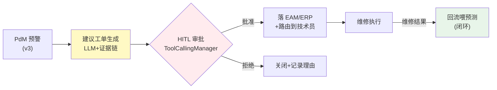
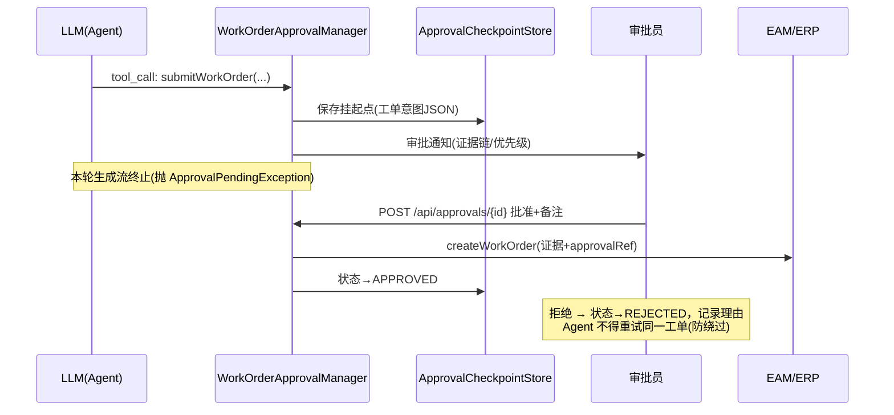

# 项目 11：工业质检与预测性维护 — 05-维护工单自动化（HITL）

> **定位**：把"PdM 预警 → 工单 → EAM/ERP"闭环自动化——LLM 生成"建议工单"（含证据链），**落 EAM 前必须 HITL 审批**。2026 现实是"assistive 为主、governed autonomy 起步"（[调研 §工单自动化]）。教程 28 HITL 的落地。本文给出**完整可手写代码**。
>
> 「遇到阻塞？→ [教程 28-Human-in-the-Loop与审批流 全篇]、[附录 05-SpringAI2-API基准/02 §ToolCallingManager]、[教程 40-长任务持久化与中断恢复 §挂起]」

---

## 1. 四问

| 问 | 答 |
|----|----|
| **新增了什么需求** | 建议工单生成（含证据链）；工单 HITL 审批（ToolCallingManager 拦截）；EAM/ERP 接入（审批回调）；维修结果回流（喂下次预测） |
| **影响了哪些模块** | 新增 WorkOrderAgent（建议生成）+ WorkOrderApprovalManager（HITL 闸门）+ ApprovalService/EamClient；复用 v3 的 PdM 洞察 |
| **架构如何演进** | 预测层之上长出"执行层"：MaintenanceInsight → WorkOrderAgent（建议工单）→ ToolCallingManager 审批闸门 → 批准落 EAM → 维修结果回流 |
| **上一版痛点是什么** | ① 预警→工单断链，人肉协调 2 周 ② 工单凭感觉，无证据 ③ 全自动落工单风险高 |

### 1.1 本节核对（四问）

- [ ] 第 3 行"架构演进"与 §4 代码产物（WorkOrderAgent → WorkOrderApprovalManager(HITL 闸门) → ApprovalService/EamClient → 维修回流）链路对应
- [ ] 三个痛点分别被 §4.9 建议工单 / §4.6 证据链 / ADR-011-10 HITL 必选覆盖

## 2. 目标与量化验收

| # | 目标 | 验收 |
|---|------|------|
| 1 | 工单时效 | 预测→建议工单 < 1 分钟（原人肉协调 2 周） |
| 2 | HITL 强制 | 无审批直接落 EAM 的路径不存在（代码审查+渗透） |
| 3 | 证据可复核 | 建议工单 100% 带证据链（信号/根因/RUL） |
| 4 | 拒绝防绕过 | 审批拒绝后 Agent 不得重试同一工单 |
| 5 | 闭环回流 | 维修结果 100% 回流喂预测（有记录） |

### 2.1 本节核对（目标与量化验收）

- [ ] 五项验收（工单 < 1 分钟 / HITL 强制 / 证据 100% 可复核 / 拒绝防绕过 / 维修结果 100% 回流）都能在 §4 代码（WorkOrderAgent / WorkOrderApprovalManager / ApprovalService）中找到落地件
- [ ] 验收项 2"HITL 强制"对应 ADR-011-10 的 ToolCallingManager 拦截点时点（工具意图已返回、工具执行前）

## 3. 工单闭环



**为什么 HITL 必选**（[调研 §工单自动化]）：最常见的成功模式是"AI 建议工单流入现有 CMMS/EAM 由人工批准"，而非全自动执行——误报要与安全/质量/生产约束平衡。



### 3.1 本节核对（工单闭环）

- [ ] sequenceDiagram 的提交挂起点 / 审批 / 落 EAM 三步与 §4.6 `WorkOrderApprovalManager.executeToolCalls`（save 挂起点 → notify → throw 受控异常）与 §4.8 `ApprovalService.decide`（批准→EAM / 拒绝→记录）一致
- [ ] "拒绝不得重试同一工单"对应验收项 4 与 ADR-011-12

## 4. 完整代码（照抄即可，一行不省略）

### 4.1 `pom.xml` 追加依赖

v5 无新依赖（WebFlux `WebClient` 已在基线）。

### 4.2 SQL DDL `db/schema-v5.sql`

```sql
-- PostgreSQL（db: iq_plant）——工单 HITL 审批
CREATE TABLE IF NOT EXISTS work_order_approval (
    approval_id       VARCHAR(64) PRIMARY KEY,
    work_order_json   JSONB       NOT NULL,
    status            VARCHAR(16) NOT NULL DEFAULT 'PENDING',  -- PENDING/APPROVED/REJECTED/EXPIRED
    comment           TEXT,
    approver          VARCHAR(32),
    created_at        TIMESTAMPTZ NOT NULL DEFAULT now(),
    decided_at        TIMESTAMPTZ
);
CREATE INDEX IF NOT EXISTS idx_approval_status ON work_order_approval (status);
```

### 4.3 `SuggestedWorkOrder.java` + `WorkOrderJson.java`

```java
package com.plant.iq.workorder;

import com.fasterxml.jackson.annotation.JsonIgnoreProperties;
import com.fasterxml.jackson.annotation.JsonProperty;

import java.util.List;

/** 建议工单（含证据链，可被审批者复核） */
@JsonIgnoreProperties(ignoreUnknown = true)
public record SuggestedWorkOrder(
        @JsonProperty("deviceId") String deviceId,
        @JsonProperty("workType") String workType,           // inspection/repair/replacement
        @JsonProperty("summary") String summary,             // 维修摘要
        @JsonProperty("evidence") List<String> evidence,     // 证据链（信号/根因/RUL）
        @JsonProperty("priority") String priority,           // urgent/high/medium/low
        @JsonProperty("suggestedWindow") String suggestedWindow) {}
```

```java
package com.plant.iq.workorder;

import com.fasterxml.jackson.databind.ObjectMapper;

import java.io.IOException;

public final class WorkOrderJson {

    private static final ObjectMapper MAPPER = new ObjectMapper();

    private WorkOrderJson() {}

    /** 解析 LLM 生成的工单参数 JSON（与 @Tool 参数名一致） */
    public static SuggestedWorkOrder parse(String json) {
        try {
            return MAPPER.readValue(json, SuggestedWorkOrder.class);
        } catch (IOException e) {
            throw new IllegalArgumentException("工单参数解析失败: " + json, e);
        }
    }
}
```

### 4.4 `ApprovalCheckpoint.java` + `ApprovalCheckpointStore.java`

```java
package com.plant.iq.workorder;

import java.time.Instant;

/** 挂起点（[教程 40]）：持久化完整工单意图 + 状态机，审批员跨天/跨重启仍可处理 */
public record ApprovalCheckpoint(
        String approvalId,
        String workOrderJson,
        String status,
        Instant createdAt) {}
```

```java
package com.plant.iq.workorder;

import org.springframework.beans.factory.annotation.Qualifier;
import org.springframework.jdbc.core.JdbcTemplate;
import org.springframework.stereotype.Repository;

import java.sql.Timestamp;
import java.time.Instant;
import java.util.Optional;
import java.util.UUID;

@Repository
public class ApprovalCheckpointStore {

    private final JdbcTemplate appJdbc;

    public ApprovalCheckpointStore(@Qualifier("appJdbcTemplate") JdbcTemplate appJdbc) {
        this.appJdbc = appJdbc;
    }

    public String save(String workOrderJson) {
        String approvalId = UUID.randomUUID().toString();
        appJdbc.update("INSERT INTO work_order_approval(approval_id, work_order_json, status, created_at) "
                        + "VALUES (?, CAST(? AS jsonb), 'PENDING', ?)",
                approvalId, workOrderJson, Timestamp.from(Instant.now()));
        return approvalId;
    }

    public Optional<ApprovalCheckpoint> load(String approvalId) {
        return appJdbc.query("SELECT approval_id, work_order_json, status, created_at "
                        + "FROM work_order_approval WHERE approval_id = ?",
                (rs, i) -> new ApprovalCheckpoint(
                        rs.getString("approval_id"),
                        rs.getString("work_order_json"),
                        rs.getString("status"),
                        rs.getTimestamp("created_at").toInstant()),
                approvalId).stream().findFirst();
    }

    public void updateDecision(String approvalId, String status, String comment, String approver) {
        appJdbc.update("UPDATE work_order_approval SET status = ?, comment = ?, approver = ?, decided_at = ? "
                        + "WHERE approval_id = ?",
                status, comment, approver, Timestamp.from(Instant.now()), approvalId);
    }
}
```

### 4.5 `ApprovalPendingException.java`

```java
package com.plant.iq.workorder;

/** 挂起受控异常：终止本轮生成流——挂起不是错误，但必须中断"自动继续" */
public class ApprovalPendingException extends RuntimeException {

    public ApprovalPendingException(String toolCallId) {
        super("工单待审批，挂起工具调用: " + toolCallId);
    }
}
```

### 4.6 `WorkOrderApprovalManager.java`（HITL 审批闸门，ToolCallingManager 装饰器）

```java
package com.plant.iq.workorder;

import org.springframework.ai.chat.messages.AssistantMessage.ToolCall;   // 真实坐标：ToolCall 是 AssistantMessage 的嵌套 record
import org.springframework.ai.chat.model.ChatResponse;
import org.springframework.ai.chat.prompt.Prompt;
import org.springframework.ai.model.tool.ToolCallingChatOptions;
import org.springframework.ai.model.tool.ToolCallingManager;   // Spring AI 2.0.0 真实包
import org.springframework.ai.model.tool.ToolExecutionResult;
import org.springframework.ai.tool.definition.ToolDefinition;
import org.springframework.beans.factory.annotation.Qualifier;
import org.springframework.context.annotation.Primary;
import org.springframework.stereotype.Component;

import java.util.List;

/**
 * HITL 审批闸门（[教程 28 §正确落点]）：拦截 submitWorkOrder 工具调用，
 * 保存挂起点 → 通知审批 → 抛受控异常终止生成。真正落 EAM 由审批通过后的 ApprovalService 触发。
 * @Primary：让 ChatModel 的工具循环走本闸门；delegate 用 @Qualifier 显式注入默认实现。
 */
@Component
@Primary
public class WorkOrderApprovalManager implements ToolCallingManager {

    private final ToolCallingManager delegate;
    private final ApprovalCheckpointStore checkpointStore;
    private final ApprovalNotifier notifier;

    public WorkOrderApprovalManager(@Qualifier("defaultToolCallingManager") ToolCallingManager delegate,
                                    ApprovalCheckpointStore checkpointStore,
                                    ApprovalNotifier notifier) {
        this.delegate = delegate;
        this.checkpointStore = checkpointStore;
        this.notifier = notifier;
    }

    @Override
    public List<ToolDefinition> resolveToolDefinitions(ToolCallingChatOptions options) {
        return delegate.resolveToolDefinitions(options);   // 委托默认实现（接口抽象方法，必须实现）
    }

    @Override
    public ToolExecutionResult executeToolCalls(Prompt prompt, ChatResponse chatResponse) {

        List<ToolCall> workOrderCalls = extractToolCalls(chatResponse).stream()
                .filter(tc -> "submitWorkOrder".equals(tc.name()))
                .toList();

        if (!workOrderCalls.isEmpty()) {
            for (ToolCall call : workOrderCalls) {
                String approvalId = checkpointStore.save(call.arguments());   // 挂起点持久化
                notifier.notify(approvalId, call.arguments());                // 通知审批员
            }
            throw new ApprovalPendingException(workOrderCalls.get(0).id());
        }
        return delegate.executeToolCalls(prompt, chatResponse);
    }

    private List<ToolCall> extractToolCalls(ChatResponse chatResponse) {
        return chatResponse.getResults().stream()
                .map(g -> g.getOutput().getToolCalls())
                .flatMap(List::stream)
                .toList();
    }
}
```

> ⚠️ 说明：`WorkOrderApprovalManager` 是 `ToolCallingManager` 装饰器（HITL 正确落点，[附录 05-02 §1.3]），构造器注入 `delegate`。当存在自定义 `ToolCallingManager` Bean 时，Spring AI 自动配置的默认 `ToolCallingManager` 会退避（`@ConditionalOnMissingBean`），因此需显式注册一个默认委托 Bean；`@Primary` 让 ChatModel 的工具循环走本闸门，delegate 用 `@Qualifier("defaultToolCallingManager")` 显式注入：
>
> ```java
> import org.springframework.ai.model.tool.DefaultToolCallingManager;
>
> @Bean
> public ToolCallingManager defaultToolCallingManager() {
>     return DefaultToolCallingManager.builder().build();   // 2.0 无无参构造，用 builder()（javap 实证）
> }
> ```

### 4.7 `ApprovalNotifier.java` + `EamClient.java`

```java
package com.plant.iq.workorder;

import org.slf4j.Logger;
import org.slf4j.LoggerFactory;
import org.springframework.stereotype.Component;

@Component
public class ApprovalNotifier {

    private static final Logger log = LoggerFactory.getLogger(ApprovalNotifier.class);

    public void notify(String approvalId, String workOrderJson) {
        log.info("[HITL] 工单待审批 approvalId={} workOrderJson={}", approvalId, workOrderJson);
        // 概念代码：接入钉钉/邮件多渠道通知维护主管
    }
}
```

```java
package com.plant.iq.workorder;

import org.springframework.stereotype.Component;
import org.springframework.web.reactive.function.client.WebClient;
import reactor.core.publisher.Mono;

import java.util.Map;

@Component
public class EamClient {

    private final WebClient webClient;

    public EamClient(WebClient.Builder webClientBuilder) {
        this.webClient = webClientBuilder.baseUrl("http://eam-service").build();
    }

    /** 审批通过 → EAM 落单（带 evidence + approvalRef 审计追溯） */
    public Mono<Void> createWorkOrder(SuggestedWorkOrder wo, String approvalId) {
        return webClient.post().uri("/api/work-orders")
                .bodyValue(Map.of(
                        "deviceId", wo.deviceId(),
                        "workType", wo.workType(),
                        "summary", wo.summary(),
                        "evidence", wo.evidence(),
                        "priority", wo.priority(),
                        "suggestedWindow", wo.suggestedWindow(),
                        "approvalRef", approvalId))
                .retrieve()
                .bodyToMono(Void.class);
    }
}
```

### 4.8 `ApprovalService.java` + `ApprovalController.java`

```java
package com.plant.iq.workorder;

import org.springframework.stereotype.Service;
import reactor.core.publisher.Mono;
import reactor.core.scheduler.Schedulers;

@Service
public class ApprovalService {

    private final ApprovalCheckpointStore checkpointStore;
    private final EamClient eamClient;

    public ApprovalService(ApprovalCheckpointStore checkpointStore, EamClient eamClient) {
        this.checkpointStore = checkpointStore;
        this.eamClient = eamClient;
    }

    /** 审批回调：批准 → 落 EAM；拒绝 → 记录理由（防绕过） */
    public Mono<Void> decide(String approvalId, boolean approved, String comment, String approver) {
        // JDBC 阻塞读/写移到 boundedElastic 工作线程（WebFlux 铁律：EventLoop 上禁 block）
        return Mono.fromCallable(() -> checkpointStore.load(approvalId))
                .flatMap(opt -> {
                    ApprovalCheckpoint cp = opt.orElseThrow(
                            () -> new IllegalArgumentException("审批不存在: " + approvalId));
                    if (!"PENDING".equals(cp.status())) {
                        return Mono.empty();   // 幂等：重复审批不重放
                    }
                    if (!approved) {
                        checkpointStore.updateDecision(approvalId, "REJECTED", comment, approver);
                        return Mono.empty();
                    }
                    SuggestedWorkOrder wo = WorkOrderJson.parse(cp.workOrderJson());
                    return eamClient.createWorkOrder(wo, approvalId)
                            .then(Mono.fromRunnable(() ->
                                    checkpointStore.updateDecision(approvalId, "APPROVED", comment, approver)));
                })
                .subscribeOn(Schedulers.boundedElastic());
    }

    /** 维修结果回流 → 喂下次预测（闭环，[调研 §双向闭环集成]） */
    public void onRepairComplete(String deviceId, String rootCause, boolean effective) {
        // 概念代码：写维修历史表，供 v3 知识库检索；此处仅记录日志
    }
}
```

```java
package com.plant.iq.workorder;

import org.springframework.web.bind.annotation.*;
import reactor.core.publisher.Mono;

import java.util.Map;

@RestController
@RequestMapping("/api/approvals")
public class ApprovalController {

    private final ApprovalService approvalService;

    public ApprovalController(ApprovalService approvalService) {
        this.approvalService = approvalService;
    }

    @PostMapping("/{approvalId}")
    public Mono<Map<String, String>> decide(@PathVariable String approvalId,
                                            @RequestParam boolean approved,
                                            @RequestParam(defaultValue = "") String comment,
                                            @RequestParam(defaultValue = "approver-01") String approver) {
        return approvalService.decide(approvalId, approved, comment, approver)
                .thenReturn(Map.of("approvalId", approvalId,
                        "status", approved ? "APPROVED" : "REJECTED"));
    }
}
```

### 4.9 `WorkOrderAgent.java`（建议工单生成）+ `WorkOrderTools.java`（@Tool schema）

```java
package com.plant.iq.workorder;

import com.plant.iq.pdm.MaintenanceInsight;
import org.springframework.ai.chat.client.ChatClient;
import org.springframework.stereotype.Service;
import reactor.core.publisher.Mono;
import reactor.core.scheduler.Schedulers;

@Service
public class WorkOrderAgent {

    private final ChatClient chatClient;

    public WorkOrderAgent(ChatClient chatClient) {
        this.chatClient = chatClient;
    }

    /** 建议工单生成（含证据链，可被审批者复核） */
    public Mono<SuggestedWorkOrder> generateWorkOrder(MaintenanceInsight insight) {
        return Mono.fromCallable(() -> chatClient.prompt()
                .system("""
                        根据设备维护洞察生成建议工单，输出 JSON：
                        1. deviceId: 设备 ID
                        2. workType: inspection/repair/replacement
                        3. summary: 维修摘要（设备+问题+建议）
                        4. evidence: 证据链（引用信号/根因）
                        5. priority: urgent/high/medium/low
                        6. suggestedWindow: 建议维护窗口
                        只基于洞察，不臆造；这是"建议"，最终由人工审批。
                        """)
                .user(insight.toString())
                .call()
                .entity(SuggestedWorkOrder.class))
            .subscribeOn(Schedulers.boundedElastic());
    }
}
```

```java
package com.plant.iq.workorder;

import org.springframework.ai.tool.annotation.Tool;
import org.springframework.ai.tool.annotation.ToolParam;
import org.springframework.stereotype.Component;

@Component
public class WorkOrderTools {

    /**
     * 危险动作工具——生产路径中本方法会被 WorkOrderApprovalManager 拦截（不真正执行）；
     * 保留方法体使 schema 完整、可独立测试。
     */
    @Tool(description = "提交维护工单建议。危险动作：必须经人工审批后才真正落 EAM。")
    public String submitWorkOrder(
            @ToolParam(description = "设备 ID") String deviceId,
            @ToolParam(description = "工单类型 inspection/repair/replacement") String workType,
            @ToolParam(description = "维修摘要") String summary,
            @ToolParam(description = "证据链，多个以分号分隔") String evidence,
            @ToolParam(description = "优先级 urgent/high/medium/low") String priority,
            @ToolParam(description = "建议维护窗口") String suggestedWindow) {
        // 生产路径被拦截；此方法仅保留 schema 与可测试性
        return "PENDING_APPROVAL";
    }
}
```

### 4.10 本节测试与验证（工单 HITL 主链路）

**前置条件**：v4 已通过；§4.2 `work_order_approval` 表已建；EAM 服务 `eam-service` 可连（批准路径）；`defaultToolCallingManager` Bean 已显式注册（§4.6 后的说明块）。

**材料——来自正文**：

```sh
# A. 生成建议工单（§4.9 WorkOrderAgent.generateWorkOrder，输入 v3 维护洞察）
curl -X POST "http://localhost:8080/api/workorder/generate" \
  -H "Content-Type: application/json" \
  -d '{"deviceId":"pump-01","workType":"repair","summary":"轴承磨损，建议更换6205","evidence":["振动RMS爬升","RUL 6天"],"priority":"high","suggestedWindow":"3天内"}'

# B. 审批回调（§4.8 /api/approvals/{id}）——批准
curl -X POST "http://localhost:8080/api/approvals/APP-0001?approved=true&comment=同意&approver=maintainer-01"

# C. 审批拒绝与重复提交（验证防绕过）
curl -X POST "http://localhost:8080/api/approvals/APP-0002?approved=false&comment=产能不允许&approver=maintainer-01"
```

```sql
-- D. 审批状态核对（§4.2 DDL）
SELECT approval_id, status, comment, approver FROM work_order_approval ORDER BY created_at DESC LIMIT 5;
```

**步骤与断言**：

| # | 操作 | 预期（PASS 判据） |
|---|------|------------------|
| 1 | 走 Agent 触发 `submitWorkOrder` 工具 | `WorkOrderApprovalManager` 拦截（`executeToolCalls` 捕获 name=submitWorkOrder）→ 保存挂起点 + 抛 `ApprovalPendingException`；生成流终止（不自动继续） |
| 2 | 材料 B 批准审批 | 材料 D 查到该单 `status='APPROVED'`；调用 `EamClient.createWorkOrder`（带 evidence + approvalRef，审计追溯） |
| 3 | 材料 C 拒绝审批 | 材料 D 该单 `status='REJECTED'` + comment 记录；Agent 不得重试同一单（验收项 4） |
| 4 | 代码审查 + 渗透验证 | 无绕过 `ToolCallingManager` 直接落 EAM 的路径（`submitWorkOrder` 生产路径必拦截，验收项 2） |
| 5 | 建议工单抽检 | 100% 带 evidence（信号/根因/RUL），可被审批者复核（验收项 3） |
| 6 | 触发维修完成回调 | `onRepairComplete` 记录回流，喂下次预测（验收项 5） |

**失败排查**：①工具未被拦截→`WorkOrderApprovalManager` 的 `@Primary` 未生效或 `defaultToolCallingManager` 委托 Bean 未注册（§4.6 说明块）；②批准后未落 EAM→`ApprovalService.decide` 的 EAM 调用或 `work_order_json` 解析失败；③重复提交仍被批→`PENDING` 状态判等/token 未处理（§4.6 幂等）。

## 5. 本迭代的 ADR

### ADR 011-10：工单 HITL 必选（assistive 为主）
- **决策**：建议工单落 EAM 前必须经 ToolCallingManager 审批闸门
- **取舍理由**：2026 现实是"assistive 为主、governed autonomy 起步"；误报要与安全/质量/生产约束平衡（[调研 §工单自动化]）

### ADR 011-11：工单带证据链 + 审批可复核
- **决策**：SuggestedWorkOrder 含 evidence（信号/根因/RUL），落 EAM 带 approvalRef
- **取舍理由**：技术员/主管要能验证 AI 建议；审计可追溯

### ADR 011-12：审批拒绝防绕过 + 挂起默认失败安全
- **决策**：拒绝后 Agent 不得重试同一工单（挂起点唯一）；PENDING 超时 EXPIRED 退回重发起，不自动通过
- **取舍理由**：消除"反复提交直到碰巧被批"的绕过面；绝不自动通过（合规红线）

### 5.1 本节核对（本迭代 ADR）

- [ ] ADR-011-10/11/12 分别与正文 HITL 闸门（§4.6）、证据链（§4.9）、拒绝防绕过（§4.8 幂等）一一对应
- [ ] 三条 ADR 编号与 13-ADR架构决策记录 的 ADR-011-10~12 衔接、无重复

## 6. 全篇回归验证

**回归断言**（§4.10 本节测试与验证通过后，按 §2 验收表整体验收）：

| # | 操作 | 预期（PASS 判据） |
|---|------|------------------|
| 1 | 计时一轮"预警→建议工单" | < 1 分钟（验收项 1，原人肉协调 2 周） |
| 2 | 代码 / 渗透两路验证 | 无审批直接落 EAM 的路径不存在（验收项 2） |
| 3 | 抽查审批完成的工单 | 100% 带证据链（信号/根因/RUL，验收项 3） |
| 4 | 构造拒绝 + 重复提交攻击 | 拒绝后不得重试同一工单（验收项 4） |
| 5 | 核对维修完成回流记录 | 100% 回流喂预测、有记录（验收项 5） |

**失败排查**：工单超 1 分钟→LLM 生成或审批链路阻塞；发现可直接落 EAM 路径→HITL 闸门 `@Primary` 失效或 `submitWorkOrder` 绕过拦截；证据缺失→`WorkOrderAgent` system 未要求 evidence 字段。

## 7. 验收与已知痛点

**验收**：预测→建议工单 < 1 分钟、无审批落 EAM 路径不存在、证据 100% 可复核、拒绝防绕过、维修结果回流。

**已知痛点（驱动下一迭代）**：
1. 工单闭环了，但**工艺效率有提升空间**——同样缺陷率，有的班次良率 95%、有的 89%
2. 工艺参数（保压时间/温度）没被优化，调参靠老师傅经验
3. 参数优化无闭环（建议→确认→反馈）

> **定位回顾**：v5 完成"执行层"。下一站 [06-工艺参数优化.md](06-工艺参数优化.md)——建议引擎（非闭环写 PLC）。
