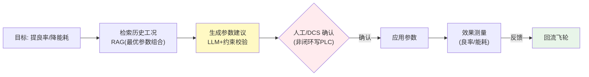

# 项目 11：工业质检与预测性维护 — 06-工艺参数优化

> **定位**：把"班次良率差异"变成"工艺参数建议引擎"——LLM + RAG/约束检索历史工况，生成参数建议，经人工/DCS 确认后反馈效果，回流飞轮。**关键红线：工艺优化是建议引擎，不是闭环控制（直接写 PLC 是工业安全红线）**。教程 08 Plan-and-Execute + 教程 37 反思的落地。本文给出**完整可手写代码**。
>
> 「遇到阻塞？→ [教程 08-Plan-and-Execute模式]、[教程 37-自我反思与Agent评估]、[教程 41-数据飞轮与持续改进]」

---

## 1. 四问

| 问 | 答 |
|----|----|
| **新增了什么需求** | 工艺参数建议生成（含依据）；建议经人工/DCS 确认（非闭环写 PLC）；效果反馈回流飞轮 |
| **影响了哪些模块** | 新增 ProcessOptimizer（建议引擎）+ ConstraintTable（确定性约束校验）+ ProcessOutcomeRecorder（效果回流）；与质检良率数据联动 |
| **架构如何演进** | 在"执行层"之上长出"优化层"：目标 → 检索历史工况（RAG）→ 生成建议（LLM + 约束校验）→ 确认（人工/DCS）→ 效果测量 → 回流飞轮 |
| **上一版痛点是什么** | ① 班次良率差异（95% vs 89%）无解释 ② 调参靠老师傅经验 ③ 参数优化无闭环 |

### 1.1 本节核对（四问）

- [ ] 第 3 行"架构演进"与 §4 代码产物（ProcessOptimizer(建议+约束校验) → 人工/DCS 确认 → ProcessOutcomeRecorder 回流）链路对应
- [ ] 三个痛点分别被 §4.6 建议引擎 / §4.3~4.4 约束表 / §4.7 效果回流覆盖

## 2. 目标与量化验收

| # | 目标 | 验收 |
|---|------|------|
| 1 | 建议有效 | 采纳建议后良率提升可复现（A/B 对照 ≥ 2 周） |
| 2 | 约束强制 | 建议 100% 过确定性约束校验（越界即拒） |
| 3 | 非闭环 | 无直接写 PLC 路径（建议必须经确认） |
| 4 | 效果回流 | 已应用建议的效果 100% 回流 RAG |
| 5 | 可追溯 | 每次建议含依据（历史工况引用）+ 确认人 |

### 2.1 本节核对（目标与量化验收）

- [ ] 五项验收（建议有效 / 100% 过约束校验 / 非闭环无写 PLC / 效果 100% 回流 / 依据+确认人）都能在 §4 代码（ProcessOptimizer / ConstraintTable / ProcessOutcomeRecorder）中找到落地件
- [ ] 验收项 3"非闭环"对应 ADR-011-13 与红线"建议只是建议，不写 PLC"

## 3. 建议引擎架构（非闭环控制）

> **核心**（[调研 工业质检 2026 §工艺优化]）：工艺优化在 Agent 平台中的正确落点是"**建议引擎**"而非"直接闭环控制"：Agent 检索历史工况 → 生成参数建议 → 经 DCS/MES 或人工确认 → 反馈效果 → 回流飞轮。直接写 PLC 属于工业安全红线。



### 3.1 本节核对（建议引擎架构）

- [ ] 图中"生成参数建议 → 人工/DCS 确认"（非闭环写 PLC）与 §4.6 `ProcessOptimizer.suggest`（只建议）+ `ConstraintTable.validate`（越界即拒）一致
- [ ] "效果测量 → 回流飞轮"与 §4.7 `ProcessOutcomeRecorder.onApplied` 及 ADR-011-15 一致

## 4. 完整代码（照抄即可，一行不省略）

### 4.1 `pom.xml` 追加依赖

v6 无新依赖。

### 4.2 SQL DDL `db/schema-v6.sql`

```sql
-- PostgreSQL（db: iq_plant）——工艺优化效果回流
CREATE TABLE IF NOT EXISTS process_outcome (
    id               BIGSERIAL PRIMARY KEY,
    product          VARCHAR(32) NOT NULL,
    parameter        VARCHAR(32) NOT NULL,
    suggested_value  DOUBLE PRECISION NOT NULL,
    measured_yield   DOUBLE PRECISION,
    energy_delta     DOUBLE PRECISION,
    confirmed_by     VARCHAR(32),
    applied_at       TIMESTAMPTZ NOT NULL DEFAULT now()
);
```

### 4.3 `ProcessSuggestion.java` + `ValidationResult.java`

```java
package com.plant.iq.process;

import com.fasterxml.jackson.annotation.JsonIgnoreProperties;
import com.fasterxml.jackson.annotation.JsonProperty;

/** 参数优化建议（输出受限 JSON，含依据与约束校验） */
@JsonIgnoreProperties(ignoreUnknown = true)
public record ProcessSuggestion(
        @JsonProperty("parameter") String parameter,          // 如 "保压时间"
        @JsonProperty("current_value") double currentValue,
        @JsonProperty("suggested_value") double suggestedValue,
        @JsonProperty("rationale") String rationale,          // 依据（历史最优工况）
        @JsonProperty("constraint_check") String constraintCheck,   // 约束校验结果
        @JsonProperty("expected_gain") double expectedGain) {}      // 预期收益（良率/能耗）
```

```java
package com.plant.iq.process;

public record ValidationResult(boolean passed, String message) {

    public static ValidationResult pass() {
        return new ValidationResult(true, "通过");
    }

    public static ValidationResult reject(String message) {
        return new ValidationResult(false, message);
    }
}
```

### 4.4 `ConstraintTable.java`（确定性约束，防越界建议）

```java
package com.plant.iq.process;

import org.springframework.stereotype.Component;

import java.util.Map;

/** 工艺约束表——安全边界是硬约束，LLM 建议必须过确定性校验（[调研 §"检索-生成-验证"闭环]） */
@Component
public class ConstraintTable {

    public record Constraint(double min, double max, double maxStep) {}

    // 产品 → 工艺约束（示例：保压时间 s）
    private final Map<String, Constraint> table = Map.of(
            "housing-x", new Constraint(8.0, 20.0, 3.0),
            "housing-y", new Constraint(6.0, 18.0, 2.5));

    public Constraint of(String product) {
        Constraint c = table.get(product);
        if (c == null) throw new IllegalArgumentException("未知产品约束: " + product);
        return c;
    }
}
```

### 4.5 `HistoryRag.java`（历史工况检索）

```java
package com.plant.iq.process;

import org.springframework.stereotype.Component;

import java.util.Map;

/**
 * 历史工况检索。生产换向量检索（[教程 05]）；
 * 此处为完整可手写的内存样例工况库（概念代码标注）。
 */
@Component
public class HistoryRag {

    private final Map<String, String> samples = Map.of(
            "housing-x", "保压时间=14s 时良率 95.2%（2026-07-15 班次A）",
            "housing-y", "保压时间=12s 时良率 93.8%（2026-07-22 班次C）");

    public String searchOptimal(String product, String target) {
        return samples.getOrDefault(product, "无历史工况");
    }
}
```

### 4.6 `ProcessOptimizer.java`（建议生成 + 约束校验）

```java
package com.plant.iq.process;

import org.springframework.ai.chat.client.ChatClient;
import org.springframework.stereotype.Service;
import reactor.core.publisher.Mono;
import reactor.core.scheduler.Schedulers;

@Service
public class ProcessOptimizer {

    private final ChatClient chatClient;
    private final ConstraintTable constraintTable;
    private final HistoryRag historyRag;

    public ProcessOptimizer(ChatClient chatClient, ConstraintTable constraintTable, HistoryRag historyRag) {
        this.chatClient = chatClient;
        this.constraintTable = constraintTable;
        this.historyRag = historyRag;
    }

    /** 生成参数优化建议（只建议，不执行） */
    public Mono<ProcessSuggestion> suggest(String product, String target) {
        return Mono.fromCallable(() -> chatClient.prompt()
                .system("""
                        你是工艺工程师助手。根据历史工况检索结果生成参数优化建议，输出 JSON：
                        1. parameter: 建议调整的参数
                        2. current_value / suggested_value
                        3. rationale: 依据（引用历史最优工况）
                        4. constraint_check: 是否在安全边界内（工艺约束表）
                        5. expected_gain: 预期收益
                        规则：只建议，不执行；超出工艺约束边界的建议必须标注"需工艺工程师确认"。
                        """)
                .user("产品: " + product
                        + "\n目标: " + target
                        + "\n历史最优工况: " + historyRag.searchOptimal(product, target)
                        + "\n工艺约束: " + constraintTable.of(product))
                .call()
                .entity(ProcessSuggestion.class))
            .subscribeOn(Schedulers.boundedElastic());
    }

    /** 确定性约束校验（越界即拒） */
    public ValidationResult validate(ProcessSuggestion s, String product) {
        ConstraintTable.Constraint c = constraintTable.of(product);
        boolean inRange = s.suggestedValue() >= c.min() && s.suggestedValue() <= c.max();
        boolean stepOk = Math.abs(s.suggestedValue() - s.currentValue()) <= c.maxStep();
        return inRange && stepOk
                ? ValidationResult.pass()
                : ValidationResult.reject("超出工艺约束边界");
    }
}
```

### 4.7 `ProcessOutcomeRecorder.java`（效果反馈回流）

```java
package com.plant.iq.process;

import org.springframework.beans.factory.annotation.Qualifier;
import org.springframework.jdbc.core.JdbcTemplate;
import org.springframework.stereotype.Component;

import java.sql.Timestamp;
import java.time.Instant;

/** 建议被确认应用后 → 测量效果 → 回流（飞轮：让"哪个参数组合有效"可被检索，[教程 41]） */
@Component
public class ProcessOutcomeRecorder {

    private final JdbcTemplate appJdbc;

    public ProcessOutcomeRecorder(@Qualifier("appJdbcTemplate") JdbcTemplate appJdbc) {
        this.appJdbc = appJdbc;
    }

    public void onApplied(String product, String parameter, double suggestedValue,
                          double measuredYield, double energyDelta) {
        appJdbc.update("INSERT INTO process_outcome(product, parameter, suggested_value, measured_yield, energy_delta, applied_at) "
                        + "VALUES (?, ?, ?, ?, ?, ?)",
                product, parameter, suggestedValue, measuredYield, energyDelta,
                Timestamp.from(Instant.now()));
    }
}
```

### 4.8 `ProcessController.java`

```java
package com.plant.iq.process;

import org.springframework.web.bind.annotation.*;
import reactor.core.publisher.Mono;
import reactor.core.scheduler.Schedulers;

import java.util.Map;

@RestController
@RequestMapping("/api/process")
public class ProcessController {

    private final ProcessOptimizer optimizer;
    private final ProcessOutcomeRecorder outcomeRecorder;

    public ProcessController(ProcessOptimizer optimizer, ProcessOutcomeRecorder outcomeRecorder) {
        this.optimizer = optimizer;
        this.outcomeRecorder = outcomeRecorder;
    }

    /** 生成建议 + 确定性约束校验（越界即拒） */
    @PostMapping("/suggest")
    public Mono<Map<String, Object>> suggest(@RequestParam String product, @RequestParam String target) {
        return optimizer.suggest(product, target)
                .map(s -> Map.<String, Object>of(
                        "suggestion", s,
                        "validation", optimizer.validate(s, product)));
    }

    /** 确认应用 + 效果回流 */
    @PostMapping("/applied")
    public Mono<Map<String, String>> applied(@RequestParam String product,
                                             @RequestParam String parameter,
                                             @RequestParam double suggestedValue,
                                             @RequestParam double measuredYield,
                                             @RequestParam double energyDelta) {
        return Mono.fromRunnable(() -> outcomeRecorder.onApplied(
                        product, parameter, suggestedValue, measuredYield, energyDelta))
                .subscribeOn(Schedulers.boundedElastic())   // JDBC 写入移到工作线程（WebFlux 铁律）
                .thenReturn(Map.of("status", "recorded"));
    }
}
```

### 4.9 本节测试与验证（工艺参数优化主链路）

**前置条件**：v5 已通过；§4.2 `process_outcome` 表已建；PostgreSQL 第二数据源可用。

**材料——来自正文**：

```sh
# A. 生成建议（§4.8 /api/process/suggest；含确定性约束校验结果）
curl -X POST "http://localhost:8080/api/process/suggest?product=housing-x&target=提良率"

# B. 越界建议应被拒：显式请求超 maxStep 的大步长（越界即拒，验收项 2）
curl -X POST "http://localhost:8080/api/process/suggest?product=housing-x&target=大幅改参数"

# C. 确认应用 + 效果回流（§4.8 /api/process/applied）
curl -X POST "http://localhost:8080/api/process/applied?product=housing-x&parameter=保压时间&suggestedValue=14&measuredYield=95.2&energyDelta=-0.3"
```

```sql
-- D. 效果回流核对（§4.2 DDL；建议参数/实测良率/能耗差）
SELECT parameter, suggested_value, measured_yield, energy_delta FROM process_outcome ORDER BY id DESC LIMIT 3;
```

**步骤与断言**：

| # | 操作 | 预期（PASS 判据） |
|---|------|------------------|
| 1 | 材料 A 生成建议 | 返回 `ProcessSuggestion` 含 rationale（依据历史工况）+ `constraint_check`；对 housing-x 的 `suggestedValue` 落在 `ConstraintTable(8.0,20.0,3.0)` 内 |
| 2 | 材料 B 大步长建议 | `validate()` 返回 reject（越界即拒，验收项 2） |
| 3 | 材料 C 确认应用 | 返回 `{"status":"recorded"}`；材料 D 查到该建议参数与实测良率（效果 100% 回流，验收项 4） |
| 4 | 代码审查 | 无直接写 PLC（`writePlc`）路径；建议必须经 `/applied` 确认（验收项 3） |
| 5 | 建议与确认人抽检 | 每次建议含依据（历史工况引用）+ 确认人（验收项 5） |

**失败排查**：①建议越界未拒→`ProcessOptimizer.validate` 未调用或 `ConstraintTable.of(product)` 抛未知产品异常；②回流不落库→`process_outcome` 表未建或 `/applied` 参数名与 DDL 列不一致；③发现写 PLC 路径→代码审查未过红线（回查 ADR-011-13）。

## 5. 本迭代的 ADR

### ADR 011-13：工艺优化是建议引擎非闭环控制
- **决策**：只生成建议，经人工/DCS 确认后应用
- **取舍理由**：直接写 PLC 是工业安全红线；"建议 + 确认 + 反馈"而非"建议 + 执行"

### ADR 011-14：建议过确定性约束校验
- **决策**：LLM 建议必须通过 `ConstraintTable`（min/max/maxStep）校验，越界即拒
- **取舍理由**：LLM 建议可能越界；安全边界是硬约束（[调研 §"检索-生成-验证"闭环]）

### ADR 011-15：效果反馈回流 RAG
- **决策**：已应用建议的效果写入 process_outcome，回流历史工况库
- **取舍理由**：飞轮——让"哪个参数组合有效"可被下次检索到（[教程 41 §数据飞轮]）

### 5.1 本节核对（本迭代 ADR）

- [ ] ADR-011-13/14/15 分别与正文建议引擎（§4.6）、约束校验（§4.4 ConstraintTable）、效果回流（§4.7）一一对应
- [ ] 三条 ADR 编号与 13-ADR架构决策记录 的 ADR-011-13~15 衔接、无重复

## 6. 全篇回归验证

**回归断言**（§4.9 本节测试与验证通过后，按 §2 验收表整体验收）：

| # | 操作 | 预期（PASS 判据） |
|---|------|------------------|
| 1 | 对一类参数采纳建议并运行 ≥ 2 周 A/B | 良率提升可复现（验收项 1） |
| 2 | 批量生成扫参建议并校验越界 | 建议 100% 过确定性约束校验（验收项 2） |
| 3 | 代码审查 + 尝试触发写 PLC | 无直接写 PLC 路径（验收项 3） |
| 4 | 统计已应用建议的效果回流 | 100% 回流 RAG / `process_outcome`（验收项 4） |
| 5 | 抽查历史建议 | 每次含依据（历史工况引用）+ 确认人（验收项 5） |

**失败排查**：良率不提升→`HistoryRag` 检索的最优工况不适用当前工况（样本库需扩充）；越界漏放→`ConstraintTable` 覆盖的产品不全（`of` 抛未知产品）；回流不全→`/applied` 未统计部分确认动作。

## 7. 验收与已知痛点

**验收**：建议采纳后良率提升可复现、建议 100% 过约束校验、无直接写 PLC 路径、效果 100% 回流、建议含依据 + 确认人。

**已知痛点（驱动下一迭代）**：
1. 单产线跑通了，但**多产线/多工厂隔离暴露**——集团有 3 条产线 + 分厂，各产线数据、质检标准、维护策略不同
2. 各产线数据互相串扰风险、分厂数据驻留合规、权限无分级

> **定位回顾**：v6 完成"优化层"。下一站 [07-多产线隔离.md](07-多产线隔离.md)——产线级隔离 + 数据驻留。
