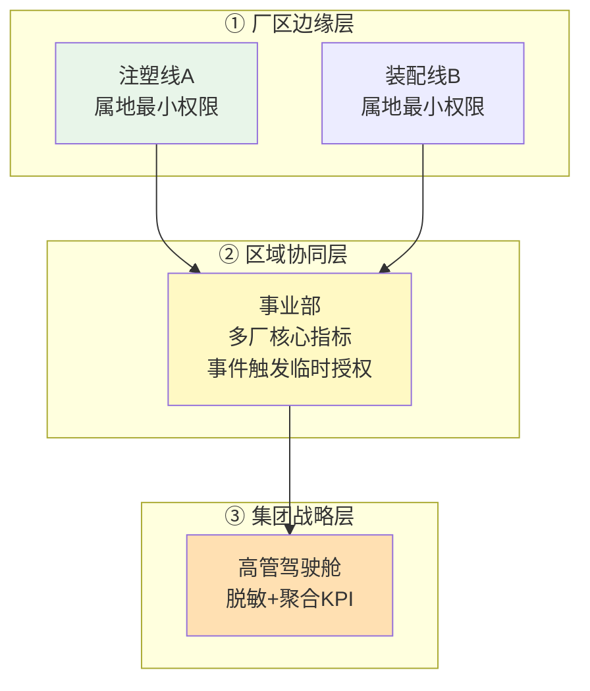

# 项目 11：工业质检与预测性维护 — 07-多产线隔离

> **定位**：工业场景的"多租户"= 多产线/多工厂/多子公司——物理节点隔离 + 逻辑隔离（产线 ID + 行级 + namespace）混合，数据驻留硬合规。教程 26 §多租户 + 教程 42 §Reactor Context 的落地。本文给出**完整可手写代码**。
>
> 「遇到阻塞？→ [教程 26-多租户隔离与资源治理]、[教程 42-响应式错误处理 §Context 传递]」

---

## 1. 四问

| 问 | 答 |
|----|----|
| **新增了什么需求** | 产线/工厂逻辑隔离（RLS 行级）；分厂物理隔离（数据驻留）；三级权限管控（边缘最小权限/区域协同临时授权/集团脱敏聚合） |
| **影响了哪些模块** | 复用 v4 权限框架扩展到产线维度；新增物理节点隔离部署；权限模型 = RBAC + ABAC（身份/位置/生产事件） |
| **架构如何演进** | 单产线 → 多产线隔离：`LineContextFilter`（Reactor Context 传产线）→ RLS 行级安全 → `AccessControlService`（RBAC + ABAC 三级权限） |
| **上一版痛点是什么** | ① 多产线数据串扰 ② 分厂数据驻留合规 ③ 权限无分级 |

## 2. 目标与量化验收

| # | 目标 | 验收 |
|---|------|------|
| 1 | 产线隔离 | 注塑线操作员无法读写装配线数据（RLS 强制） |
| 2 | 数据驻留 | 分厂数据不出厂（物理节点隔离验证） |
| 3 | 临时授权回收 | 区域协同临时授权任务完成自动回收（无残留） |
| 4 | 集团脱敏 | 高管只见聚合脱敏 KPI（无明细） |
| 5 | 无串号 | 500 并发混合产线事务零串号 |

## 3. 工业多租户形态

> **工业特殊性**（[调研 工业质检 2026 §多产线]）：工业里的"租户"是**产线/工厂/子公司**，隔离边界不只是数据，还包括**数据驻留**（数据不出厂、不出区域是硬合规）。成熟范式是"物理节点部署 + 节点内逻辑分区"组合。



## 4. 完整代码（照抄即可，一行不省略）

### 4.1 `pom.xml` 追加依赖

v7 无新依赖（WebFilter/JDBC 已在基线）。

### 4.2 SQL DDL `db/schema-v7.sql`（行级安全）

```sql
-- ① 逻辑隔离（PostgreSQL）：RLS 按 line_id（数据不出厂内逻辑边界）
ALTER TABLE pending_work_order ADD COLUMN IF NOT EXISTS line_id VARCHAR(32);
ALTER TABLE work_order_approval  ADD COLUMN IF NOT EXISTS line_id VARCHAR(32);
ALTER TABLE inspection_hard_example ADD COLUMN IF NOT EXISTS line_id VARCHAR(32) DEFAULT 'line-a';

ALTER TABLE pending_work_order ENABLE ROW LEVEL SECURITY;
CREATE POLICY line_isolation_pwo ON pending_work_order
    USING (line_id = current_setting('app.current_line')::text);

ALTER TABLE work_order_approval ENABLE ROW LEVEL SECURITY;
CREATE POLICY line_isolation_woa ON work_order_approval
    USING (line_id = current_setting('app.current_line')::text);

ALTER TABLE inspection_hard_example ENABLE ROW LEVEL SECURITY;
CREATE POLICY line_isolation_he ON inspection_hard_example
    USING (line_id = current_setting('app.current_line')::text);

-- ② 物理隔离：分厂独立部署节点（数据驻留）——[调研 §数据驻留] 硬合规
-- 集团节点对所有分厂做分租户抽取与统一监管（"可分可合"）
```

### 4.3 `LineContext.java`（Reactor Context 读产线）

```java
package com.plant.iq.isolation;

import reactor.core.publisher.Mono;

/** 从 Reactor Context 取当前产线 ID（WebFlux 正确姿势，禁 ThreadLocal） */
public final class LineContext {

    private LineContext() {}

    public static Mono<String> currentLine() {
        return Mono.deferContextual(ctx ->
                Mono.justOrEmpty(ctx.getOrEmpty("line_id")));
    }
}
```

### 4.4 `LineContextFilter.java`（WebFilter 写入 Reactor Context）

```java
package com.plant.iq.isolation;

import org.springframework.stereotype.Component;
import org.springframework.web.server.ServerWebExchange;
import org.springframework.web.server.WebFilter;
import org.springframework.web.server.WebFilterChain;
import reactor.core.publisher.Mono;

@Component
public class LineContextFilter implements WebFilter {

    @Override
    public Mono<Void> filter(ServerWebExchange exchange, WebFilterChain chain) {
        String lineId = resolveLine(exchange);
        return chain.filter(exchange)
                .contextWrite(ctx -> ctx.put("line_id", lineId));
    }

    private String resolveLine(ServerWebExchange exchange) {
        // 概念代码：设备 mTLS 证书或 JWT claim → 产线；此处取请求头简化
        String header = exchange.getRequest().getHeaders().getFirst("X-Line-Id");
        return header == null ? "unknown" : header;
    }
}
```

### 4.5 `LineIsolationDao.java`（事务级 RLS 上下文）

```java
package com.plant.iq.isolation;

import org.springframework.beans.factory.annotation.Qualifier;
import org.springframework.jdbc.core.JdbcTemplate;
import org.springframework.stereotype.Repository;
import org.springframework.transaction.annotation.Transactional;

import java.util.function.Supplier;

@Repository
public class LineIsolationDao {

    private final JdbcTemplate appJdbc;

    public LineIsolationDao(@Qualifier("appJdbcTemplate") JdbcTemplate appJdbc) {
        this.appJdbc = appJdbc;
    }

    /** 事务内设置产线上下文 → RLS 自动过滤（set_config(? , ?, false) 仅当前事务生效） */
    @Transactional
    public <T> T queryInLine(String lineId, Supplier<T> action) {
        appJdbc.update("SELECT set_config('app.current_line', ?, false)", lineId);
        return action.get();
    }
}
```

### 4.6 `AccessControlService.java`（RBAC + ABAC 三级权限）

```java
package com.plant.iq.isolation;

import org.springframework.stereotype.Service;

@Service
public class AccessControlService {

    public enum Role { LINE_OPERATOR, REGION_MANAGER, EXECUTIVE }

    public record Resource(String type, boolean aggregatedAndMasked) {}

    public record AccessContext(String lineId, boolean incidentOpen) {}

    public record Principal(Role role, String assignedLine) {}

    /**
     * 权限模型 = RBAC（定角色）+ ABAC（定上下文：身份/位置/生产事件）
     * ① 厂区边缘：属地最小权限 ② 区域协同：事件触发临时授权 ③ 集团战略：脱敏聚合
     */
    public boolean canAccess(Principal user, Resource res, AccessContext ctx) {
        return switch (user.role()) {
            case LINE_OPERATOR -> ctx.lineId().equals(user.assignedLine());
            case REGION_MANAGER -> ctx.incidentOpen() && grantTemporary(user, res);
            case EXECUTIVE -> res.aggregatedAndMasked();
        };
    }

    private boolean grantTemporary(Principal user, Resource res) {
        // 概念代码：临时授权 + 到期自动回收（Redis TTL / 定时回收任务，[调研 §临时授权回收]）
        return true;
    }
}
```

### 4.7 改造点：`LineContextFilter` 生效 + 数据访问走 `LineIsolationDao`

```java
// 数据访问统一从 Reactor Context 取 line_id → SET LOCAL（事务级，示意用法）；
// queryInLine 内是阻塞 JDBC，须移到 boundedElastic 工作线程（WebFlux 铁律）：
LineContext.currentLine()
        .flatMap(lineId -> Mono.fromSupplier(
                () -> lineIsolationDao.queryInLine(lineId,
                        () -> checkpointStore.load(approvalId)))
                .subscribeOn(Schedulers.boundedElastic()))   // RLS 按产线过滤 + 不阻塞 EventLoop
```

## 5. 本迭代的 ADR

### ADR 011-16：物理节点隔离 + 逻辑分区混合
- **决策**：分厂物理独立节点（数据不出厂），节点内 RLS 逻辑分区（产线级行级安全）
- **取舍理由**：数据驻留硬合规；"可分可合"（工业互联网范式，[调研 §多产线]）

### ADR 011-17：RBAC + ABAC 三级权限
- **决策**：权限模型 = 角色定级（RBAC）+ 上下文定权（ABAC：身份/位置/生产事件）
- **取舍理由**：边缘最小权限/区域协同临时授权/集团脱敏聚合，三级各自边界清晰

### ADR 011-18：临时授权到期自动回收
- **决策**：区域协同临时授权任务完成自动回收
- **取舍理由**：事件驱动授权需防权限残留（[调研 §临时授权回收]）

### 验证包（手工测试与验证）

**前置条件**：上一迭代已通过；本迭代组件与样品数据就绪。

**材料**：多产线账号 + 产线隔离测试 + 配额剧本。

**步骤与断言（由验收表转断言清单）**：

| # | 操作 | 预期（PASS 判据） |
|---|------|------------------|
| 1 | 用材料构造「产线隔离」场景执行 | 注塑线操作员无法读写装配线数据（RLS 强制） |
| 2 | 用材料构造「数据驻留」场景执行 | 分厂数据不出厂（物理节点隔离验证） |
| 3 | 用材料构造「临时授权回收」场景执行 | 区域协同临时授权任务完成自动回收（无残留） |
| 4 | 用材料构造「集团脱敏」场景执行 | 高管只见聚合脱敏 KPI（无明细） |
| 5 | 用材料构造「无串号」场景执行 | 500 并发混合产线事务零串号 |
**失败排查**：断言不符先分层——感知/推理侧（图像/时序模型输出）→ 业务决策（工单/工艺/隔离逻辑）→ 边缘/网关（数据是否到正确位置）；质检类失败优先验证"测试样本图像是否真的到达模型输入"，再查阈值/后处理。
## 6. 验收与已知痛点

**验收**：RLS 强制产线隔离、分厂数据不出厂、临时授权自动回收、高管只见脱敏聚合、500 并发零串号。

**已知痛点（驱动下一迭代）**：
1. 隔离可控了，但**平台韧性最后短板**——边缘断网虽能自治，但**断网久了/边缘崩溃**如何保证产线检测不中断
2. 质检误报导致异常停线如何快速恢复
3. 无平台级高可用与断网续跑演练

> **定位回顾**：v7 完成"隔离层"。下一站 [08-高可用断网续跑.md](08-高可用断网续跑.md)——平台级高可用 + 断网续跑演练 + 误报治理（收官）。
