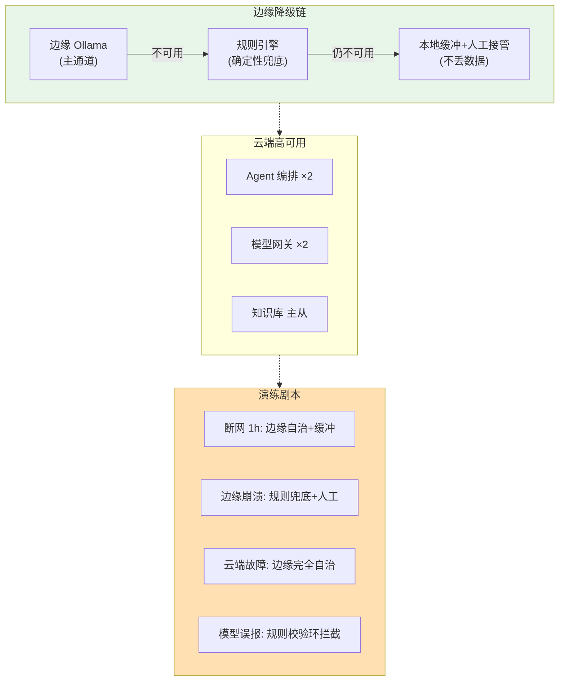
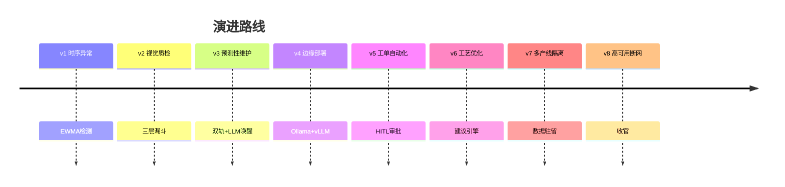

# 项目 11：工业质检与预测性维护 — 08-高可用与断网续跑（主体收官）

> **定位**：收官迭代——平台自身高可用 + 边缘断网续跑演练 + 模型误报治理。把"产线停线容忍"变成可验证的工程事实。教程 30 容错 + 教程 33 演练的落地。本文给出**完整可手写代码**。
>
> 「遇到阻塞？→ [教程 63-容错与弹性设计 全篇]、[教程 66-部署与运维 §演练]」

---

## 1. 四问

| 问 | 答 |
|----|----|
| **新增了什么需求** | 平台级高可用（云端多实例 + 边缘自治 + 确定性降级链）；断网/停线演练制度化；模型误报治理（受约束推理 + 规则校验环） |
| **影响了哪些模块** | 新增 DegradationChain（确定性降级链）+ ValidatedInference（规则校验环）；质检/维护的 Agent 输出过校验环 |
| **架构如何演进** | 从"功能完整"到"韧性可验证"：单通道 → 确定性降级链（边缘 LLM → 规则引擎 → 人工接管）；误报从 22% 治理到 ≤ 8% |
| **上一版痛点是什么** | ① 平台自身无容灾 ② 断网续跑未验证 ③ 质检误报导致异常停线 |

### 1.1 本节核对（四问）

- [ ] 第 3 行"架构演进"与 §4 代码产物（DegradationChain / ValidatedInference）链路对应
- [ ] 三个痛点分别被 §4.3 降级链 / §4.4 演练 / §4.2 规则校验环覆盖

## 2. 目标与量化验收（项目收官验收）

| # | 目标 | 验收 |
|---|------|------|
| 1 | 断网续跑 | 断网 1 小时，产线检测/决策不中断（演练验证） |
| 2 | 确定性降级 | 边缘 LLM 不可用无缝切规则引擎（不报错不丢数据） |
| 3 | 误报治理 | 误报率从 22% 降到 ≤ 8%（回测 2 周） |
| 4 | 无根据结论拦截 | 无证据的 LLM 结论 100% 转人工/拒绝（规则校验环） |
| 5 | 演练制度化 | 季度演练报告归档，剧本 A-D 全过 |

### 2.1 本节核对（目标与量化验收）

- [ ] 五项验收（断网 1h 不中断 / 确定性降级 / 误报 22%→8% / 无根据结论拦截 / 剧本 A-D 归档）都能在 §4 代码（DegradationChain / ValidatedInference）中找到落地件
- [ ] 验收项 3/4 对应 ADR-011-20 受约束推理

## 3. 高可用与降级



**确定性降级**：把"模型随机性宕机"转化为"架构确定性降级"（[调研 §确定性降级]）——主通道异常无缝切备用，算力拥堵降级为本地小模型或规则引擎。

### 3.1 本节核对（高可用与降级）

- [ ] 图中降级链（边缘 LLM → 规则引擎 → 本地缓冲+人工）与 §4.3 `DegradationChain.currentTier()` 的 `EDGE_LLM / RULE_ENGINE / HUMAN_TAKEOVER` 对应
- [ ] "确定性降级"表述与 ADR-011-19 一致

## 4. 完整代码（照抄即可，一行不省略）

### 4.1 `pom.xml` 追加依赖

v8 无新依赖。

### 4.2 `Evidence.java` + `InferenceDecision.java` + `ValidatedInference.java`（受约束推理 + 规则校验环）

```java
package com.plant.iq.inference;

/** 一条确定性证据：来源 + 陈述 + 是否支持/反驳某个结论 */
public record Evidence(String source, String statement, boolean supports, boolean contradicts) {}
```

```java
package com.plant.iq.inference;

import java.util.List;

public record InferenceDecision(String claim, DecisionStatus status, List<Evidence> evidence) {

    public enum DecisionStatus { ACCEPTED, REJECTED, NEEDS_CONFIRMATION }

    public static InferenceDecision accept(String claim, List<Evidence> evidence) {
        return new InferenceDecision(claim, DecisionStatus.ACCEPTED, evidence);
    }

    public static InferenceDecision reject(String claim) {
        return new InferenceDecision(claim, DecisionStatus.REJECTED, List.of());
    }

    public static InferenceDecision needsConfirmation(String claim) {
        return new InferenceDecision(claim, DecisionStatus.NEEDS_CONFIRMATION, List.of());
    }
}
```

```java
package com.plant.iq.inference;

import org.springframework.stereotype.Service;

import java.util.List;

/**
 * 受约束推理 + 规则校验环（[调研 §Condition Insight Agent]）：
 * ① 确定性证据先于 LLM——统计信号/阈值是事实基础
 * ② LLM 结论必须能被证据支持——规则校验环抑制无根据结论
 */
@Service
public class ValidatedInference {

    public InferenceDecision validate(String claim, List<Evidence> evidence) {
        boolean contradicted = evidence.stream().anyMatch(Evidence::contradicts);
        if (contradicted) return InferenceDecision.reject(claim);
        boolean supported = evidence.stream().anyMatch(Evidence::supports);
        return supported
                ? InferenceDecision.accept(claim, evidence)
                : InferenceDecision.needsConfirmation(claim);   // 无证据: 要求人工确认
    }
}
```

### 4.3 `DegradationChain.java`（确定性降级链）

```java
package com.plant.iq.inference;

import com.plant.iq.edge.CloudReachability;
import com.plant.iq.edge.LocalAlarm;
import org.springframework.stereotype.Service;

/**
 * 确定性降级链：把"模型随机性宕机"转化为"架构确定性降级"（[调研 §确定性降级]）。
 * 主通道异常无缝切备用，算力拥堵降级为本地小模型或规则引擎。
 */
@Service
public class DegradationChain {

    public enum Tier { EDGE_LLM, RULE_ENGINE, HUMAN_TAKEOVER }

    private final CloudReachability reachability;
    private final LocalAlarm localAlarm;

    public DegradationChain(CloudReachability reachability, LocalAlarm localAlarm) {
        this.reachability = reachability;
        this.localAlarm = localAlarm;
    }

    /** 返回当前可用层：边缘 LLM → 规则引擎 → 人工接管（不丢数据） */
    public Tier currentTier() {
        if (reachability.isReachable()) return Tier.EDGE_LLM;
        if (ruleEngineAvailable()) return Tier.RULE_ENGINE;
        localAlarm.raise("all");   // 概念代码：全厂告警 + 人工接管
        return Tier.HUMAN_TAKEOVER;
    }

    private boolean ruleEngineAvailable() {
        return true;   // 概念代码：本地规则引擎健康检查
    }
}
```

### 4.4 断网演练与误报治理单元测试 `ValidatedInferenceTest.java`

```java
package com.plant.iq.inference;

import org.junit.jupiter.api.Test;

import java.util.List;

import static org.assertj.core.api.Assertions.assertThat;

class ValidatedInferenceTest {

    private final ValidatedInference validator = new ValidatedInference();

    /** 剧本 R4：注入"无证据的 LLM 结论" → 规则校验环转人工（不直接采纳） */
    @Test
    void no_evidence_requires_confirmation() {
        InferenceDecision d = validator.validate("轴承即将失效", List.of());
        assertThat(d.status()).isEqualTo(InferenceDecision.DecisionStatus.NEEDS_CONFIRMATION);
    }

    /** 剧本 R4：证据矛盾 → 拒绝 */
    @Test
    void contradiction_is_rejected() {
        Evidence contrary = new Evidence("ewma", "振动 z=0.8 < 阈值 3.0", false, true);
        InferenceDecision d = validator.validate("轴承即将失效", List.of(contrary));
        assertThat(d.status()).isEqualTo(InferenceDecision.DecisionStatus.REJECTED);
    }

    /** 证据支持 → 接受 */
    @Test
    void supported_claim_accepted() {
        Evidence support = new Evidence("rul", "RUL 估计 6 天", true, false);
        InferenceDecision d = validator.validate("轴承即将失效", List.of(support));
        assertThat(d.status()).isEqualTo(InferenceDecision.DecisionStatus.ACCEPTED);
    }
}
```

### 4.5 断网演练（剧本 A-D 概览）

| 剧本 | 注入 | 验证 |
|------|------|------|
| A 断网 1h | `simulateNetworkDrop(1h)` | 边缘自治检测全部本地完成、`LocalBuffer` 缓冲零丢失、恢复后 100% 同步 |
| B 边缘崩溃 | 停边缘 Ollama | 切规则引擎兜底（`DegradationChain.currentTier() == RULE_ENGINE`）不报错不丢数据 |
| C 云端故障 | 停云端 | 边缘完全自治（`currentTier() == EDGE_LLM` + 本地决策） |
| D 模型误报 | 注入无证据结论 | 规则校验环拦截/转人工（`ValidatedInferenceTest`） |

```java
// 完整集成演练需注入真实 Bean（Spring Boot Test + @MockBean CloudReachability），此处示意核心断言：
/*
@SpringBootTest
class HighAvailabilityDrillTest {

    @Autowired LocalBuffer buffer;
    @Autowired EdgeAutonomy edgeAutonomy;
    @MockBean CloudReachability reachability;

    @Test
    void drill_a_edgeOffline1h_noDataLoss() {
        when(reachability.isReachable()).thenReturn(false);   // 断网
        StatSignal s = new StatSignal("pump-01", 0.8, 5.2, Instant.now());
        buffer.stash(s);
        assertThat(buffer.isEmpty()).isFalse();

        when(reachability.isReachable()).thenReturn(true);    // 恢复
        List<StatSignal> drained = buffer.drain();
        assertThat(drained).hasSize(1);                       // 零丢失
    }
}
*/
```

### 4.6 平台自愈

```java
// Smart Factory 模式：服务崩溃恢复 < 5s（Docker 重启 + Kafka offset 回放），数据丢失率 < 0.1%
// [调研 §故障自愈]——部署层靠 K8s 探针 + 状态外置（时序库/审批库均为持久化），此处无需业务代码
```

### 4.7 本节测试与验证（高可用与断网续跑主链路）

**前置条件**：v7 已通过；`CloudReachability` 健康端点可探测（§4.3 依赖）；本地规则引擎可用。

**材料——来自正文**：

```bash
# A. 受约束推理单元测试（§4.4 ValidatedInferenceTest：无证据需确认 / 矛盾拒绝 / 有据接受）
mvn test -Dtest=ValidatedInferenceTest
```

```sh
# B. 断网演练剧本（§4.5 概览，@MockBean CloudReachability 注入断网/恢复，复刻 drill_a_edgeOffline1h_noDataLoss）
# - 剧本 A：simulateNetworkDrop(1h) → 断言边缘自治全部本地完成、LocalBuffer 缓冲零丢失、恢复后 100% 同步
# - 剧本 D：注入无证据结论 → ValidatedInferenceTest（规则校验环拦截/转人工）
```

```sql
-- C. 误报治理回测口径（§2 验收项 3：误报率 22% → ≤ 8%，回测 2 周，以人工确权 correct=false 占比计）
SELECT correct, COUNT(*) FROM inspection_hard_example GROUP BY correct;
```

**步骤与断言**：

| # | 操作 | 预期（PASS 判据） |
|---|------|------------------|
| 1 | `mvn clean test -Dtest=ValidatedInferenceTest` | 三用例全绿：无证据 → `NEEDS_CONFIRMATION`；矛盾 → `REJECTED`；有据 → `ACCEPTED` |
| 2 | 剧本 A 断网 1h（drill_a_edgeOffline1h_noDataLoss） | 边缘自治检测全部本地完成、`LocalBuffer` 缓冲零丢失、恢复后 `drain` 100% 同步（验收项 1） |
| 3 | 剧本 B 停边缘 Ollama | `DegradationChain.currentTier() == RULE_ENGINE`，不报错不丢数据（验收项 2） |
| 4 | 剧本 D 注入无证据结论 | 规则校验环拦截/转人工，100% 不直接采纳（验收项 4） |
| 5 | 回测 2 周误报率（材料 C） | 误报率 ≤ 8%（验收项 3） |
| 6 | 季度演练剧本 A-D 全跑并归档 | 报告归档，剧本 A-D 全过（验收项 5） |

**失败排查**：①断网仍走云端→`CloudReachability` mock 未生效或 `DegradationChain` 未装；②无证据结论被采纳→`ValidatedInference` 未接入质检/维护推理链；③误报不降→受约束推理未在 Agent 输出侧加校验环。

## 5. 本迭代的 ADR

### ADR 011-19：确定性降级链（边缘 LLM → 规则引擎 → 人工接管）
- **决策**：降级不是随机失败，而是有明确梯队的确定性路径
- **取舍理由**：把"模型随机性宕机"转化为"架构确定性降级"（[调研 §确定性降级]）

### ADR 011-20：受约束推理 + 规则校验环
- **决策**：质检/维护的 Agent 结论必须能被确定性证据支持，无证据转人工/拒绝
- **取舍理由**："LLM 辅助判级但不可信口开河"的工程保障；目标误报率 22%→8%

### ADR 011-21：断网演练制度化
- **决策**：季度演练剧本 A-D，故障注入验证降级链与断网续跑，报告归档
- **取舍理由**："产线停线容忍"必须可验证，不能靠宣称（[教程 33 §演练]）

### 5.1 本节核对（本迭代 ADR）

- [ ] ADR-011-19/20/21 分别与正文降级链（§4.3）、受约束推理（§4.2）、演练制度化（§4.5）一一对应
- [ ] 三条 ADR 编号与 13-ADR架构决策记录 的 ADR-011-19~21 衔接、无重复

## 6. 主体迭代总结（v1-v8）



八个主体迭代走完工业质检与 PdM 完整弧线：**感知（时序）→ 视觉（质检）→ 预测（维护）→ 部署（边缘）→ 执行（工单）→ 优化（工艺）→ 隔离（产线）→ 韧性（断网）**。主体迭代的 22 条 ADR（ADR-011-00~21）中最有复用价值的三个：ADR-011-04（统计预筛+LLM唤醒降 Token 12 倍）、ADR-011-10（工单 HITL 必选）、ADR-011-13（工艺优化是建议引擎非闭环）。

→ [09-核心代码讲解.md](09-核心代码讲解.md)（复盘后再进进阶迭代 v9-v11：[10-边缘AI推理优化](10-边缘AI推理优化.md)）

### 6.1 本节核对（主体迭代总结）

- [ ] timeline 的 v1-v8 八个版本号与 01-08 各迭代标题一一对应，无缺漏错位
- [ ] 三条"最有复用价值"ADR（04/10/13）与各自的迭代正文（03/05/06）决策口径一致

## 7. 全篇回归验证

**回归断言**（§4.7 本节测试与验证通过后，按 §2 验收表整体验收）：

| # | 操作 | 预期（PASS 判据） |
|---|------|------------------|
| 1 | 断网 1 小时完整剧本 | 产线检测/决策不中断（演练验证，验收项 1） |
| 2 | 停边缘 LLM 观察切换 | 无缝切规则引擎，不报错不丢数据（验收项 2） |
| 3 | 回测 2 周误报率 | 误报率从 22% 降到 ≤ 8%（验收项 3） |
| 4 | 注入无证据结论 | 100% 转人工/拒绝（规则校验环，验收项 4） |
| 5 | 季度剧本 A-D 全跑 | 报告归档、剧本 A-D 全过（验收项 5） |

**失败排查**：断网掉数据→`LocalBuffer` 缓冲未覆盖全部信号类型；降级不生效→`DegradationChain.currentTier` 前置探测失效；误报不降→受约束推理未接入质检/维护推理链（校验环缺失）。
