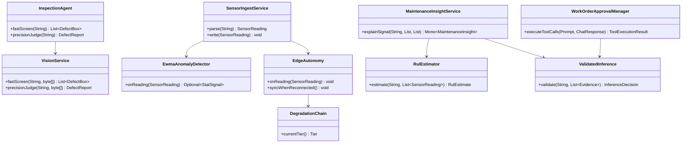

# 项目 11：工业质检与预测性维护 — 09-核心代码讲解

> **定位**：全项目关键代码与决策复盘——聚焦工业场景特有的六个设计，工程骨架与包结构，自检清单与教程映射收尾。

---

## 1. 工程骨架（包结构 + 最终依赖）

### 1.1 包结构

```text
com.plant.iq
├── IqAgentApplication.java            # 启动类（v1）
├── config/
│   ├── AgentConfig.java               # 默认 ChatClient（@Primary 云端通道，v2）
│   ├── AppDataSourceConfig.java       # 第二数据源 PostgreSQL（v2）
│   └── SchedulingConfig.java          # @EnableScheduling（v4）
├── ingest/
│   ├── SensorReading.java             # 传感器读数记录（v1）
│   ├── SensorIngestConfig.java        # MQTT 入站 IntegrationFlow（v1）
│   ├── SensorIngestService.java       # 解析+写时序库+路由 EdgeAutonomy（v1/v4）
│   └── SensorQuery.java               # 读时序历史（v3）
├── detect/
│   ├── EwmaAnomalyDetector.java       # EWMA 统计预筛，零 LLM（v1）
│   ├── StatSignal.java                # 统计显著事件（v1）
│   └── AnomalyEventSink.java          # Sinks.Many 异常事件流（v1）
├── vision/
│   ├── DefectBox / DefectReport / InspectionDecision.java  # 判级模型（v2）
│   ├── VisionService.java             # YOLO 快筛 + VLM 精判（v2）
│   ├── InspectionAgent.java           # @Tool 三层漏斗编排（v2）
│   ├── DataFlywheel.java              # 数据闭环（v2）
│   └── MlopsGateway.java              # 增量训练网关（v2）
├── pdm/
│   ├── RulEstimator.java              # 确定性 RUL（v3）
│   ├── MaintenanceInsightService.java # 统计显著才唤醒 LLM（v3）
│   ├── MaintenanceKnowledgeBase.java  # 手册/历史工单检索（v3）
│   └── RecentSignalStore.java         # 近期信号窗口（v3）
├── edge/
│   ├── ModelGatewayConfig.java        # 边缘 Ollama 专属通道（v4）
│   ├── ModelTierRouter.java           # 路由/降级（v4）
│   ├── EdgeAutonomy.java              # 断网本地闭环 + 增量同步（v4）
│   ├── LocalBuffer.java               # JSONL 落盘缓冲（v4）
│   ├── CloudReachability.java         # 断网探测（v4）
│   ├── EdgeBatcher.java               # CV 侧微批攒批（v9，见进阶篇 10）
│   ├── ResolutionPolicy.java          # 动态分辨率两段式（v9）
│   ├── AutonomyPolicy.java            # 断网自治 L0-L3 分级（v9）
│   ├── ReconciliationService.java     # 恢复回传对账/幂等键（v9）
│   └── SplitRatioController.java      # 边缘-云分流闭环（v9）
├── workorder/
│   ├── WorkOrderApprovalManager.java  # ToolCallingManager HITL 闸门（v5）
│   ├── ApprovalCheckpointStore.java   # 挂起点持久化（v5）
│   ├── ApprovalService / EamClient.java  # 审批→EAM（v5）
│   └── WorkOrderAgent.java            # 建议工单生成（v5）
├── process/
│   ├── ProcessOptimizer.java          # 建议引擎（v6）
│   ├── ConstraintTable.java           # 确定性约束校验（v6）
│   └── ProcessOutcomeRecorder.java    # 效果回流（v6）
├── isolation/
│   ├── LineContextFilter.java         # WebFilter 写 Reactor Context（v7）
│   ├── LineContext.java               # 读产线 ID（v7）
│   ├── LineIsolationDao.java          # 事务级 RLS（v7）
│   └── AccessControlService.java      # RBAC + ABAC（v7）
├── inference/
│   ├── ValidatedInference.java        # 受约束推理 + 规则校验环（v8）
│   └── DegradationChain.java          # 确定性降级链（v8）
├── fusion/                            # 三模态融合质检（v10，见进阶篇 11）
│   ├── SignalDigest.java              # 时序特征化摘要（RMS/峭度/主频带）
│   ├── VibrationFeatureExtractor.java # 振动特征化（确定性，LLM 不读原始波形）
│   ├── WeightedFusion.java            # 决策级加权融合 + 不对称冲突规则
│   ├── FusionJudgeService.java        # LLM 融合叙事（只解释不重算）
│   └── QualityEscalationQueue.java    # 质检人工升级队列（冲突 100% 升级）
└── modelmgmt/                         # 预测性维护模型管理（v11，见进阶篇 12）
    ├── ModelRegistry.java             # 版本台账 + 产线绑定（影子换线 0 停线）
    ├── DriftDetector.java             # PSI + 确权误判率双信号漂移
    ├── RetrainPipelineService.java    # 再训练三道闸门（金标/影子/卡片）
    └── ModelCardService.java          # 模型卡片生成（无卡片不发布）
```

### 1.2 最终累积依赖（`pom.xml`）

```xml
    <dependencies>
        <dependency>
            <groupId>org.springframework.boot</groupId>
            <artifactId>spring-boot-starter-webflux</artifactId>
        </dependency>
        <dependency>
            <groupId>org.springframework.ai</groupId>
            <artifactId>spring-ai-starter-model-openai</artifactId>
        </dependency>
        <dependency>
            <groupId>org.projectlombok</groupId>
            <artifactId>lombok</artifactId>
            <optional>true</optional>
        </dependency>
        <dependency>
            <groupId>org.springframework.boot</groupId>
            <artifactId>spring-boot-starter-jdbc</artifactId>
        </dependency>
        <!-- v1：MQTT 设备接入 -->
        <dependency>
            <groupId>org.springframework.integration</groupId>
            <artifactId>spring-integration-mqtt</artifactId>
        </dependency>
        <!-- v1：TDengine 时序库 -->
        <dependency>
            <groupId>com.taosdata.jdbc</groupId>
            <artifactId>taos-jdbcdriver</artifactId>
            <version>3.2.7</version>
        </dependency>
        <!-- v2：关系型元数据（PostgreSQL） -->
        <dependency>
            <groupId>org.postgresql</groupId>
            <artifactId>postgresql</artifactId>
            <scope>runtime</scope>
        </dependency>
        <dependency>
            <groupId>org.springframework.boot</groupId>
            <artifactId>spring-boot-starter-test</artifactId>
            <scope>test</scope>
        </dependency>
    </dependencies>
```

### 1.3 关键类依赖图



### 1.4 本节核对（工程骨架）

- [ ] 包结构里每个类都能对应到其所属迭代的代码篇（ingest→01、vision→02、pdm→03…），读包结构能复述"哪个能力来自第几迭代"
- [ ] 最终累积依赖（§1.2）与各迭代正文的「需在 pom.xml 中添加依赖」增量叠加后一致（webflux/openai/lombok/jdbc/MQTT/TDengine/PG/test）
- [ ] classDiagram 中 `SensorIngestService --> EdgeAutonomy`、`MaintenanceInsightService --> ValidatedInference` 等依赖与正文代码的构造器注入一致

## 2. 六个关键设计复盘

### 2.1 为什么质检是"三层漏斗"而非"纯 LLM"

传统 CV（YOLO）2-15ms、>500FPS 承担产线节拍硬约束；多模态 LLM 处理灰色样本（5-15%）并输出解释；云端大模型疑难会诊。**LLM 不能承担毫秒级实时，也不能做唯一判级依据**（基准研究显示移除物体名词后 I-AUROC 从 97.4 骤降至 82.6，[调研 §VLM 短板]）。这就是"99% 陷阱"的解法——用 CV 过滤 95%+，LLM 只在"模糊区"精判。对应代码：[02 §4.8 VisionService]、[02 §4.9 InspectionAgent]。

### 2.2 为什么 PdM 是"统计预筛 + LLM 唤醒"

ICML 2025 LEAD 证明：轻量统计先过滤（CPU 零成本）、LLM 只解释统计显著事件，Token 降 12 倍、精确率从 27%/39%（纯深度学习/纯 LLM）提升到 72%。**统计层是"事实基础"，LLM 只做"叙事解释"**——这与数据智能平台的"语义层确定性编译"、AIOps 的"确定性先行"是同构思想：LLM 永远不读原始数据，只读确定性过滤后的结论。对应代码：[01 §3.7 EwmaAnomalyDetector]、[03 §4.6 MaintenanceInsightService]。

### 2.3 为什么工单必须 HITL（assistive 为主）

2026 现实：最常见的成功模式是"AI 建议工单流入现有 CMMS/EAM 由人工批准"，而非全自动执行——误报要与安全/质量/生产约束平衡。工单落 EAM 是"危险动作"，HITL 在 `ToolCallingManager` 装饰器拦截（[附录 05-02 §1.3]）。**拦截时点：工具意图已返回、工具执行前**。对应代码：[05 §4.6 WorkOrderApprovalManager]。

### 2.4 为什么工艺优化是"建议引擎"非闭环控制

直接写 PLC 是工业安全红线。Agent 的正确落点是：检索历史工况 → 生成参数建议 → 经 DCS/MES 或人工确认 → 反馈效果 → 回流飞轮。**"建议 + 确认 + 反馈"而非"建议 + 执行"**——工业场景的信任边界比互联网更保守。对应代码：[06 §4.6 ProcessOptimizer]（建议 + 确定性约束校验）。

### 2.5 为什么边缘部署是"Ollama + vLLM 双引擎"

边缘 Ollama（GGUF Q4，工控机可跑，省延迟/省成本/断网自治）处理 80% 常规；云端 vLLM（AWQ，高并发）疑难会诊。统一 OpenAI 兼容接口让 Agent 无感路由。断网时边缘自治"感知-决策-执行"本地闭环，恢复后增量同步——产线停线不可容忍。对应代码：[04 §4.3 ModelGatewayConfig]、[04 §4.6 EdgeAutonomy]。

### 2.6 为什么"受约束推理 + 规则校验环"

质检/维护的 Agent 结论必须能被确定性证据支持（ACL 2026 的 Condition Insight Agent 范式）——无证据的 LLM 结论转人工/拒绝，抑制"无根据结论"。这是"LLM 辅助判级但不可信口开河"的工程保障，目标误报率 22%→8%。对应代码：[08 §4.2 ValidatedInference]。

### 2.7 本节核对（六个关键设计复盘）

- [ ] 六个设计（三层漏斗 / 统计预筛+LLM 唤醒 / 工单 HITL / 工艺建议引擎 / 边缘双引擎 / 受约束推理）都能各自说清"为什么这么选、不这么做会怎样"
- [ ] 六个设计都与对应迭代的 ADR（01/04/10/13/07/19-20）形成闭环，能复述每个设计回应的真实痛点
- [ ] 2.1/2.2 的"LLM 不读原始数据，只读确定性过滤后的结论"贯穿 2.3/2.4/2.5 的核心理念一致

## 3. 最容易写错的五处

| # | 位置 | 错误 | 后果 | 正确 |
|---|------|------|------|------|
| 1 | 质检 | 让 LLM 承担毫秒级实时检测 | 跟不上产线节拍 | CV 快筛 + LLM 灰色样本精判（三层漏斗） |
| 2 | PdM | 全量时序喂 LLM | Token 爆炸 | 统计预筛（EWMA/CUSUM）+ LLM 唤醒 |
| 3 | 工单 | 全自动落 EAM | 误报工单骚扰/风险 | HITL 审批（assistive 为主，ToolCallingManager 拦截） |
| 4 | 工艺 | 直接写 PLC | 工业安全红线 | 建议引擎 + 人工/DCS 确认 + 确定性约束校验 |
| 5 | 边缘 | 只部署云端 | 断网即停 | 边缘自治 + 增量同步 |
| 6 | 隔离 | ThreadLocal 传产线 | WebFlux 线程模型下串号 | Reactor Context + RLS（[教程 85]） |

### 3.1 本节核对（最容易写错的六处）

- [ ] 能不看表复述六处高频错误（LLM 扛毫秒实时 / 全量时序喂 LLM / 全自动落 EAM / 直接写 PLC / 只部署云端 / ThreadLocal 传产线）及其后果
- [ ] 六处中至少能对应到六个迭代篇的某一处具体代码位置

## 4. 教程映射与项目闭环

| 迭代 | 主要教程 |
|------|---------|
| v1 | 30（异常检测）、附录 06 |
| v2 | 前沿 02（多模态）、03（工具调用） |
| v3 | 39（时序记忆）、05（RAG） |
| v4 | 44（边缘部署） |
| v5 | 28（HITL）、附录 05-02、40（挂起） |
| v6 | 08（Plan-Execute）、37（反思） |
| v7 | 26（多租户）、42（Reactor Context） |
| v8 | 30（容错）、33（演练） |
| v9 | 38（批量合并）、32（路由降级）、40（幂等）、附录 16（AIInfra） |
| v10 | 48（多模态）、28（风险分级）、37（评估指标） |
| v11 | 41（数据飞轮）、29（灰度切分）、附录 13/01（模型卡片） |

**主体迭代 v1-v8 完成。** 检验标准：能独立复述 §2 六个决策——特别是 2.1（三层漏斗）、2.2（统计预筛+LLM唤醒）、2.4（建议引擎非闭环）——它们是从"会调多模态 API"到"能设计工业 Agent 平台"的分水岭。

### 4.1 本节核对（教程映射与项目闭环）

- [ ] 教程映射表中 v1-v11 每行的教程编号与该迭代篇正文「遇到阻塞？」标注的教程一致，无缺漏
- [ ] 能指出进阶迭代 v9/v10/v11 三条映射（38/32/40、48/28/37、41/29/附录13/01）与 [10]/[11]/[12] 正文的对应关系

**下一篇**：[10-边缘AI推理优化.md](10-边缘AI推理优化.md)——进阶迭代 v9 起：模型轻量化选型（量化/蒸馏/剪枝）、CV 微批与动态分辨率两段式、断网自治 L0-L3 分级与恢复对账、边缘-云分流比例闭环。
