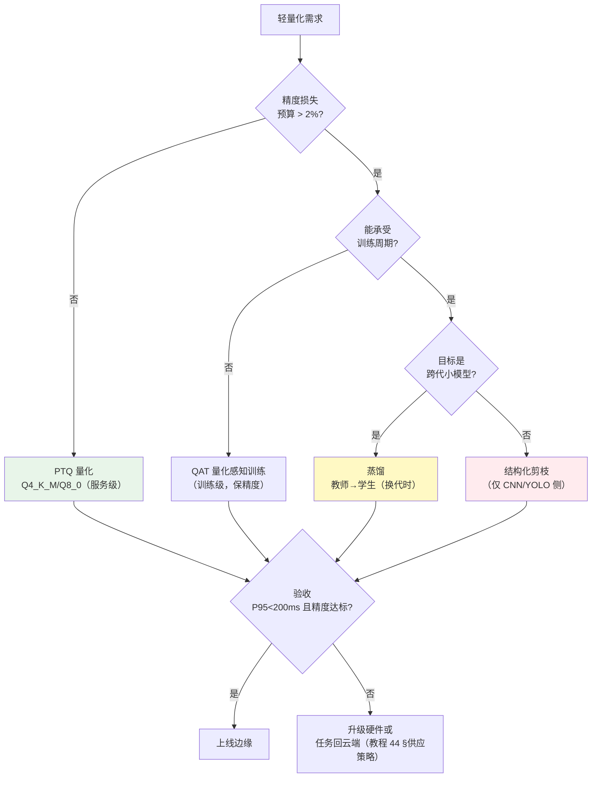
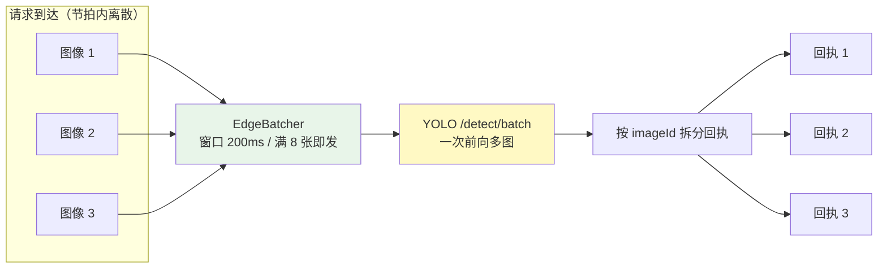
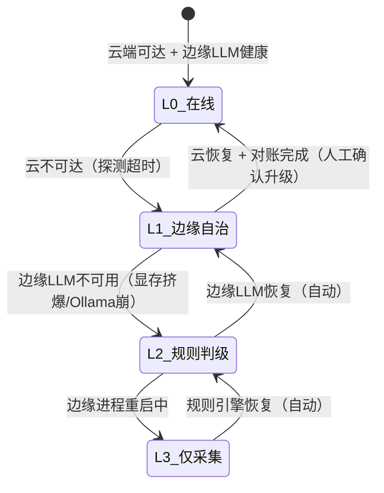
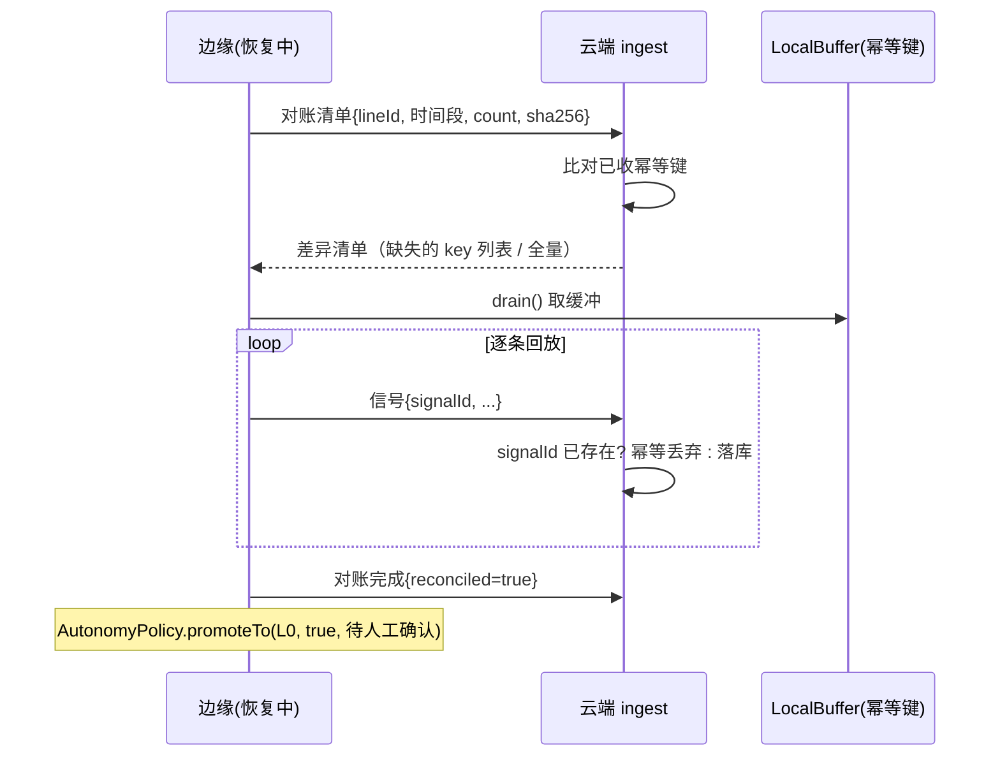
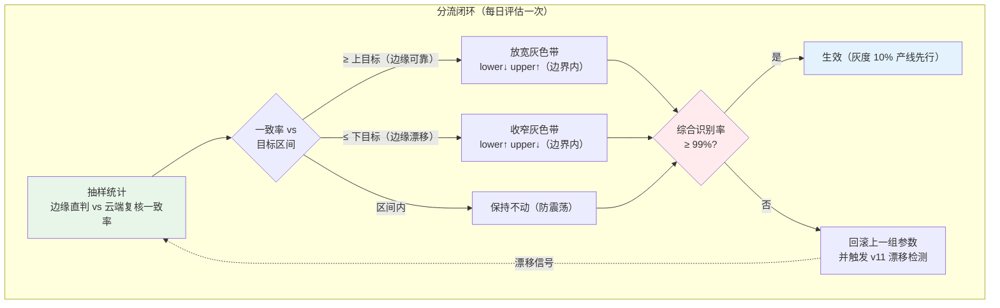

# 项目 11：工业质检与预测性维护 — 10-进阶迭代一：边缘 AI 推理优化（v9）

> **定位**：v4 把模型放上边缘、v8 验证了断网续跑，但边缘还是"能跑"而非"跑得好"——本篇深化部署层：模型轻量化选型（量化/蒸馏/剪枝）、边缘推理运行时优化（微批攒批 + 动态分辨率两段式）、断网自治从一刀切升级为 L0-L3 四级策略 + 恢复回传对账（幂等去重）、边缘-云分流比例从静态拍脑袋升级为闭环自动调节。读者画像：跑通 v1-v8 后想让边缘扛住高峰期与长断网的读者。前置阅读：[04-边缘部署](04-边缘部署.md)、[08-高可用断网续跑](08-高可用断网续跑.md)。
>
> 「遇到阻塞？→ [教程 87-多模型协作与供应策略 §边缘部署]、[教程 81-Agent性能优化 §批量与并行]、[教程 65-模型路由与降级]、[教程 83-长任务持久化与中断恢复 §幂等]、[附录 15-AIInfra与推理部署/00-vLLM推理服务与SpringAI集成]、[前沿 10-边缘Agent与端云协同]」

---

## 1. 四问

| 问 | 答 |
|----|----|
| **新增了什么需求** | ① 高峰期 L2 边缘 VLM 排队 P95 > 400ms（节拍内完不成）② 断网自治一刀切（弱断网也走本地缓冲，浪费边缘 LLM 算力）③ 恢复同步无对账，云端重复计数告警 ④ 边缘/云分流比例 80/20 是拍定的，不随质量反馈调节 |
| **影响了哪些模块** | `edge/` 包扩展：新增 `EdgeBatcher`（CV 侧微批）、`ResolutionPolicy`（动态分辨率两段式）、`AutonomyPolicy`（L0-L3 自治分级）、`ReconciliationService`（恢复对账）、`SplitRatioController`（分流闭环）；`ModelTierRouter`（v4）增加 `gray_judge` 路由类型与灰色带参数 |
| **架构如何演进** | 部署层从"有边缘"到"边缘高效且可对账"：模型侧（轻量化选型）+ 运行时侧（批处理/分辨率）+ 韧性侧（自治分级/对账）+ 协同侧（分流闭环）四条线同时收敛 |
| **上一版痛点是什么** | ① v4 边缘部署通了但高峰排队 ② v8 断网演练只验证"1 小时不断"，没分级、没对账 ③ 分流阈值（置信 0.70-0.95）静态写死 ④ 边缘模型怎么"变小"无方法论 |

### 1.1 本节核对（四问）

- [ ] 第 3 行"架构演进"的四条主线（模型侧 / 运行时侧 / 韧性侧 / 协同侧）与正文章节映射：3 轻量化、4-5 运行时、6 自治与对账、7 分流闭环
- [ ] 第 4 行四个痛点分别被 §3 / §4-5 / §6 / §7 覆盖

## 2. 目标与量化验收

| # | 目标 | 验收 |
|---|------|------|
| 1 | 高峰时延 | L2 精判 P95 < 200ms（高峰期实测，原 400ms+） |
| 2 | 边缘资源 | 边缘模型总显存/内存占用 ≤ 工控机上限的 70%（留韧性余量） |
| 3 | 自治分级 | L0-L3 四级策略生效；断网 4 小时检测不中断（v8 是 1 小时） |
| 4 | 恢复对账 | 恢复同步后云端重复上报率 0%（幂等键去重 + 对账清单） |
| 5 | 分流闭环 | 灰色带宽度随"云端复核一致率"自动调节，且综合识别率 ≥ 99% 不破线 |

**本迭代明确不做**：多模态融合（v10）、模型版本管理与漂移（v11）、换模型不停产（v11）。

### 2.1 本节核对（目标与量化验收）

- [ ] 五项验收（L2 P95<200ms / 显存≤70% 上限 / L0-L3 断网 4h / 恢复重复上报 0% / 分流闭环且识别率≥99%）都能在 §3-§7 找到落地类（EdgeBatcher / ResolutionPolicy / AutonomyPolicy / ReconciliationService / SplitRatioController）
- [ ] 验收项 3"断网 4h"与 §6 AutonomyPolicy 的 L0-L3 分级对应

## 3. 模型轻量化：量化 / 蒸馏 / 剪枝怎么选

> **核心判断**：轻量化不是"选一个最好的手段"，而是按"改动半径"排序——**能用量化解决的绝不动训练管线**。量化是服务级改动（换一个 GGUF 文件），蒸馏是训练级改动（要数据、要周期、要评估），剪枝对 CNN 有效但对 LLM 风险高（[附录 01-LLM基础理论/02-上下文窗口与Token §显存]、[附录 15-AIInfra与推理部署/02-vLLM调优与GPU容量规划]）。

| 手段 | 原理 | 收益 | 代价 | 本项目落点 |
|------|------|------|------|-----------|
| **量化（PTQ 训练后量化）** | 权重从 FP16 压到 INT4/INT8（Q4_K_M/Q8_0），无需重训 | 显存降 ~70%，吞吐升 2-4 倍，精度损失通常 < 2% | 极小（换文件/换配置） | **首选**：边缘 Ollama 用 GGUF Q4_K_M（v4 已做）；CV 侧 YOLO 导出 INT8 ONNX |
| **量化（QAT 量化感知训练）** | 训练中模拟量化误差 | 比 PTQ 精度更稳 | 要训练管线与数据 | 仅当 PTQ 掉点超线才启用 |
| **蒸馏** | 大模型（教师）输出监督小模型（学生） | 小模型逼近大模型精度，时延大幅降 | 训练周期 + 金标数据 + 评估 | 换代 VLM 时做一次（如 72B→8B 蒸馏），非日常手段 |
| **剪枝（结构化）** | 删除低贡献通道/层 | 参数量降、算力降 | CNN 有效；LLM 剪枝易伤能力 | 只用于 YOLO 侧（n/s 系列本身就是"剪好"的小模型）；**LLM 侧禁止** |



**边缘 CV 侧运行时**：YOLO 服务（v2 的 `edge-yolo:9000`）推理引擎选 ONNX Runtime（真实坐标 `com.microsoft.onnxruntime:onnxruntime`，**第三方运行时、未 javap 实证，需在 pom.xml 中添加依赖后实证**——且本项目 YOLO 走独立 HTTP 服务，Java 侧只在概念上引用）：

```xml
        <!-- 需在 pom.xml 中添加依赖：ONNX Runtime（仅当 CV 推理收编进 Java 服务时才需要；
             本项目 YOLO 为独立 Python 服务，此依赖为备选路径） -->
        <dependency>
            <groupId>com.microsoft.onnxruntime</groupId>
            <artifactId>onnxruntime</artifactId>
            <version>1.20.0</version>
        </dependency>
```

### 3.1 本节核对（模型轻量化选型）

- [ ] 选型矩阵的结论"能用量化（服务级）解决就不动训练管线"与 ADR-011-22"按改动半径排序"一致
- [ ] 三手段（量化/蒸馏/剪枝）本项目落点清晰：量化首选、蒸馏换代才做、剪枝仅 YOLO 侧且 LLM 侧禁止
- [ ] ONNX 依赖已标注「需在 pom.xml 中添加依赖」且注明"未 javap 实证、备选路径"（不虚构 API），并说明本项目 YOLO 走独立服务

## 4. 运行时优化一：CV 侧微批攒批（EdgeBatcher）

> **为什么批处理在 CV 侧而不在 LLM 侧**：LLM 生成是自回归逐 token，多请求合批只省了调度开销（vLLM 的 continuous batching 在云端已做，边缘 Ollama 并发弱）；而 YOLO 推理是"一次前向算一张图"，批 N 张图的耗时远小于 N 次单张——**攒批收益在 CV 侧是数量级的**（[教程 81-Agent性能优化 §批量请求合并]）。



```java
package com.plant.iq.edge;

import org.springframework.stereotype.Component;

import java.util.ArrayList;
import java.util.List;
import java.util.concurrent.ArrayBlockingQueue;
import java.util.concurrent.BlockingQueue;
import java.util.concurrent.CompletableFuture;
import java.util.concurrent.TimeUnit;

/**
 * CV 侧微批攒批：200ms 窗口内到达的快筛请求合成一批发给 YOLO（/detect/batch）。
 * 攒批只作用于 L1 快筛（毫秒级批收益）；L2 VLM 精判不攒批（时延敏感、自回归无批收益）。
 */
@Component
public class EdgeBatcher {

    private record Pending(String imageId, CompletableFuture<List<Object>> future) {}

    private static final int MAX_BATCH = 8;
    private static final long WINDOW_MS = 200;

    private final BlockingQueue<Pending> queue = new ArrayBlockingQueue<>(256);
    private final Object yoloClient;   // 概念代码：注入你的批量 YOLO 客户端（WebClient → /detect/batch）

    public EdgeBatcher(Object yoloClient) {
        this.yoloClient = yoloClient;
    }

    /** 提交单张快筛请求，返回批量执行后的回执 */
    public CompletableFuture<List<Object>> submit(String imageId) {
        CompletableFuture<List<Object>> future = new CompletableFuture<>();
        queue.offer(new Pending(imageId, future));
        return future;
    }

    /** 定时冲刷窗口：满 8 张或 200ms 到点即发批（调度线程执行，非 EventLoop） */
    public void flush() {
        List<Pending> batch = new ArrayList<>();
        Pending first = pollQuietly();
        if (first == null) return;
        batch.add(first);
        long deadline = System.currentTimeMillis() + WINDOW_MS;
        while (batch.size() < MAX_BATCH && System.currentTimeMillis() < deadline) {
            Pending next = pollQuietly(deadline - System.currentTimeMillis());
            if (next == null) break;
            batch.add(next);
        }
        // 概念代码：batch 发给 YOLO /detect/batch，按 imageId 拆分结果逐个 complete
    }

    private Pending pollQuietly() {
        try {
            return queue.poll(WINDOW_MS, TimeUnit.MILLISECONDS);
        } catch (InterruptedException e) {
            Thread.currentThread().interrupt();
            return null;
        }
    }

    private Pending pollQuietly(long timeoutMs) {
        try {
            return queue.poll(Math.max(1, timeoutMs), TimeUnit.MILLISECONDS);
        } catch (InterruptedException e) {
            Thread.currentThread().interrupt();
            return null;
        }
    }
}
```

### 4.1 本节测试与验证（CV 微批攒批）

**前置条件**：v9 已跑通 v4 边缘链路；批量 YOLO `/detect/batch` 端点可用（§4 `yoloClient` 概念代码注入点）。

**材料**：节拍内离散 8 张快筛图像并发提交 + 高峰 1 小时压测。

| # | 操作 | 预期（PASS 判据） |
|---|------|------------------|
| 1 | 8 张图同步 `EdgeBatcher.submit`（满 8 即发） | 一批触发，`/detect/batch` 一次前向多图，按 imageId 拆分回执，无丢失 |
| 2 | 不足 8 张时提交 | 200ms 窗口到点即发（`flush` 定时冲刷），不无限等待 |
| 3 | 高峰 1 小时压测 L1 快筛 | 排队 P95 从 400ms+ 降到节拍内（验收项 1 高峰时延） |

**失败排查**：批次不合并→`flush` 调度未注册（需 @Scheduled 定时调）或窗口未到点；回执错配→按 imageId 拆分逻辑未按请求回执一一补齐。

## 5. 运行时优化二：动态分辨率两段式（ResolutionPolicy）

**做法**：L1 快筛跑低分辨率全图（1280px，快、省算力）；命中疑似缺陷 ROI 后，**裁剪该 ROI 并放大到原分辨率**（2592px 工业相机原图）再送 L2 VLM——VLM 看的是"高清局部"而非"低清全图"，既省图像 Token 又提升小缺陷检出（[教程 91-多模态Agent开发 §6 成本模型]：图像 Token 随分辨率平方增长）。

```java
package com.plant.iq.edge;

import com.plant.iq.vision.DefectBox;
import org.springframework.stereotype.Component;

import javax.imageio.ImageIO;
import java.awt.Graphics2D;
import java.awt.RenderingHints;
import java.awt.image.BufferedImage;
import java.io.ByteArrayInputStream;
import java.io.ByteArrayOutputStream;
import java.io.IOException;
import java.io.UncheckedIOException;
import java.util.Comparator;
import java.util.List;

/** 动态分辨率两段式：L1 低清全图快筛 → ROI 裁剪放大原分辨率 → L2 VLM 高清局部精判 */
@Component
public class ResolutionPolicy {

    private static final int L1_MAX_EDGE = 1280;   // 快筛全图长边
    private static final int L2_ROI_PAD = 0.15;    // ROI 外扩 15%（缺陷边缘上下文）
    private static final int L2_MAX_EDGE = 1400;   // 送 VLM 的 ROI 长边（控制图像 Token）

    /** L1：全图降采样（快筛用） */
    public byte[] forFastScreen(byte[] original) {
        return rescale(original, L1_MAX_EDGE);
    }

    /** L2：取置信最高缺陷框，裁剪 + 外扩 + 放大到原分辨率局部 */
    public byte[] forPrecisionJudge(byte[] original, List<DefectBox> boxes) {
        if (boxes == null || boxes.isEmpty()) return original;   // 无 ROI 时退回原图
        DefectBox best = boxes.stream()
                .max(Comparator.comparingDouble(DefectBox::confidence))
                .orElseThrow();
        try {
            BufferedImage src = ImageIO.read(new ByteArrayInputStream(original));
            int padX = (int) (src.getWidth() * L2_ROI_PAD);
            int padY = (int) (src.getHeight() * L2_ROI_PAD);
            int x = clamp((int) (best.x() * src.getWidth()) - padX, 0, src.getWidth() - 1);
            int y = clamp((int) (best.y() * src.getHeight()) - padY, 0, src.getHeight() - 1);
            int w = clamp((int) (best.w() * src.getWidth()) + 2 * padX, 1, src.getWidth() - x);
            int h = clamp((int) (best.h() * src.getHeight()) + 2 * padY, 1, src.getHeight() - y);
            BufferedImage roi = src.getSubimage(x, y, w, h);
            return encode(rescaleImage(roi, L2_MAX_EDGE));
        } catch (IOException e) {
            throw new UncheckedIOException("ROI 裁剪失败", e);
        }
    }

    private byte[] rescale(byte[] bytes, int maxEdge) {
        try {
            BufferedImage src = ImageIO.read(new ByteArrayInputStream(bytes));
            return encode(rescaleImage(src, maxEdge));
        } catch (IOException e) {
            throw new UncheckedIOException("降采样失败", e);
        }
    }

    private BufferedImage rescaleImage(BufferedImage src, int maxEdge) {
        double scale = Math.min(1.0, (double) maxEdge / Math.max(src.getWidth(), src.getHeight()));
        if (scale >= 1.0) return src;
        BufferedImage dst = new BufferedImage(
                (int) (src.getWidth() * scale), (int) (src.getHeight() * scale),
                BufferedImage.TYPE_INT_RGB);
        Graphics2D g = dst.createGraphics();
        g.setRenderingHint(RenderingHints.KEY_INTERPOLATION,
                RenderingHints.VALUE_INTERPOLATION_BILINEAR);
        g.drawImage(src, 0, 0, dst.getWidth(), dst.getHeight(), null);
        g.dispose();
        return dst;
    }

    private byte[] encode(BufferedImage image) {
        try {
            ByteArrayOutputStream out = new ByteArrayOutputStream();
            ImageIO.write(image, "jpg", out);
            return out.toByteArray();
        } catch (IOException e) {
            throw new UncheckedIOException("编码失败", e);
        }
    }

    private int clamp(int v, int min, int max) {
        return Math.max(min, Math.min(max, v));
    }
}
```

> 改造点：`VisionService.fastScreen`（[02 §4.8]）入参改传 `resolutionPolicy.forFastScreen(bytes)`；`precisionJudge` 改传 `forPrecisionJudge(bytes, boxes)`——VLM 的 `.media(MimeTypeUtils.IMAGE_JPEG, ...)` 不变，只是喂的图变了。

### 5.1 本节测试与验证（动态分辨率两段式）

**前置条件**：工业相机 2592px 原图样例可用；下游 VLM 端点（`edgeChatClient`）可连。

| # | 操作 | 预期（PASS 判据） |
|---|------|------------------|
| 1 | 对全图调 `forFastScreen(original)` | 输出长边 1280px 降采样图（L1 快筛用，算力省） |
| 2 | 对含缺陷 ROI 的原图调 `forPrecisionJudge(original, boxes)` | 置信最高缺陷框 ROI 裁剪 + 外扩 + 放大到 ~1400px（L2 VLM 看高清局部） |
| 3 | 无 ROI 时调 `forPrecisionJudge` | 退回原图，不抛异常 |
| 4 | 高峰对比两种喂图后的 L2 Token/时延 | ROI 高清局部相比低清全图省图像 Token、小缺陷检出改善（验收项 1） |

**失败排查**：ROI 越界→`clamp` 未防住或 `best.w/h` 归一化坐标异常；出图模糊→`rescaleImage` 长边换算偏小；改造未生效→`VisionService.fastScreen/precisionJudge` 未改传 `ResolutionPolicy` 产物。

## 6. 断网自治深化：L0-L3 四级策略 + 恢复对账

### 6.1 四级自治（AutonomyPolicy）

> v4/v8 的断网策略是"云可达与否"的布尔值。真实产线的故障是**分层**的：云断、边缘 LLM 崩、边缘进程全崩，可用的决策能力完全不同——自治必须分级，且**降级要自动、升级要保守**（自动降一级，恢复后人工确认再升回）。



| 级 | 触发 | 检测决策 | 上行数据 | 人的动作 |
|----|------|---------|---------|---------|
| **L0 在线** | 云可达 + 边缘 LLM 健康 | 三层漏斗全开（含云端会诊） | 实时上行 | 无 |
| **L1 边缘自治** | 云不可达 | 边缘 LLM 全权判级（无云端会诊），缓冲上行 | 缓冲 + 恢复对账 | 观察告警 |
| **L2 规则判级** | 边缘 LLM 亦不可用 | CV 置信 ≥ 0.95 直接判、其余**全部转人工复检**（对应 v8 DegradationChain 的 RULE_ENGINE） | 缓冲 + 对账 | 人工复检队列 |
| **L3 仅采集** | 边缘进程崩溃重启中 | 只采集落盘 + 本地声光（v4 LocalAlarm） | 恢复后回放 | 立即介入 |

```java
package com.plant.iq.edge;

import org.springframework.stereotype.Component;

/**
 * 自治分级（v9）：把 v8 DegradationChain 的三层降级显式化为产线可读的 L0-L3 等级，
 * 并约束"自动降级、保守升级"（升回 L0 需对账完成 + 人工确认）。
 */
@Component
public class AutonomyPolicy {

    public enum Level { L0_ONLINE, L1_EDGE_AUTONOMY, L2_RULE_ENGINE, L3_COLLECT_ONLY }

    private volatile Level current = Level.L0_ONLINE;

    /** 降级：自动（探测驱动）；一次只降一级，禁止 L0 直接跳 L3 引发产线误判 */
    public void degradeTo(Level target) {
        if (target.ordinal() > current.ordinal()) {
            current = Level.values()[target.ordinal()];
        }
    }

    /** 升级：L3→L2→L1 自动；L1→L0 必须显式 confirm（对账完成 + 人工确认） */
    public boolean promoteTo(Level target, boolean reconciled, boolean humanConfirmed) {
        if (target == Level.L0_ONLINE && !(reconciled && humanConfirmed)) {
            return false;   // 未对账/未确认不得回到在线（防半恢复状态误上行）
        }
        if (target.ordinal() < current.ordinal()) {
            current = target;
        }
        return true;
    }

    public Level current() {
        return current;
    }
}
```

### 6.2 恢复回传对账（ReconciliationService）

> v4 的 `syncWhenReconnected` 是"把缓冲全量重发"，云端已处理过的样本会被**重复计数**（重复告警、重复统计）。v9 加两件事：① 每条信号带**幂等键**（`deviceId + ts + 指标` 的哈希），云端 ingest 按键去重；② 恢复时先发**对账清单**（时间段 + 计数 + 校验和），云端比对后只回放差异部分（[教程 83-长任务持久化与中断恢复 §幂等重试]）。



```java
package com.plant.iq.edge;

import org.springframework.stereotype.Component;

import java.nio.charset.StandardCharsets;
import java.security.MessageDigest;
import java.security.NoSuchAlgorithmException;
import java.util.HexFormat;
import java.util.List;

/** 恢复回传对账：幂等键 + 对账清单 + 差异回放（重复上报率 0%） */
@Component
public class ReconciliationService {

    /** 幂等键：设备+时间戳+指标摘要 → 稳定哈希（同一条信号重放键不变） */
    public String idempotencyKey(String deviceId, long epochMilli, String metricDigest) {
        String raw = deviceId + "|" + epochMilli + "|" + metricDigest;
        try {
            MessageDigest digest = MessageDigest.getInstance("SHA-256");
            return HexFormat.of().formatHex(
                    digest.digest(raw.getBytes(StandardCharsets.UTF_8)));
        } catch (NoSuchAlgorithmException e) {
            throw new IllegalStateException("SHA-256 不可用", e);   // JDK 必带，理论不可达
        }
    }

    /** 对账清单（恢复时先发清单，云端比对差异后回放） */
    public record ReconciliationManifest(String lineId, long fromMs, long toMs,
                                         int count, String checksum) {}

    /** 清单校验和：全部幂等键排序后聚合哈希（顺序无关比对） */
    public String manifestChecksum(List<String> idempotencyKeys) {
        List<String> sorted = idempotencyKeys.stream().sorted().toList();
        try {
            MessageDigest digest = MessageDigest.getInstance("SHA-256");
            sorted.forEach(k -> digest.update((k + "\n").getBytes(StandardCharsets.UTF_8)));
            return HexFormat.of().formatHex(digest.digest());
        } catch (NoSuchAlgorithmException e) {
            throw new IllegalStateException("SHA-256 不可用", e);
        }
    }
}
```

> 云端配套（概念代码标注）：`/api/anomalies/ingest` 落库前 `INSERT ... ON CONFLICT (signal_id) DO NOTHING`，`/api/anomalies/reconcile` 接清单返回差异——这是你按环境补齐的边界（幂等表 DDL 与去重 SQL 参照 [05 §4.2] 的 `work_order_approval` 主键幂等模式）。

### 6.3 本节测试与验证（自治分级 + 恢复对账）

**前置条件**：§8 `EdgeOptimizationTest` 可运行。

**材料**：幂等键稳定/唯一断言（`idempotencyKey_is_stable_and_unique`）、自治升级保守断言（`autonomy_degrade_auto_promote_conservative`）。

| # | 操作 | 预期（PASS 判据） |
|---|------|------------------|
| 1 | `mvn test -Dtest=EdgeOptimizationTest` 中幂等键用例 | 同信号重放键不变、不同信号键不同、清单顺序无关（重复上报率 0% 前提） |
| 2 | 自治分级用例 | 自动降级可多级、升回 L0 未对账/未人工确认不升级（保守升级） |
| 3 | 剧本 E 断网 4h 演练 | L1 全程边缘自治、缓冲零丢失；恢复对账差异回放、重复上报 0%（验收项 3/4） |

**失败排查**：幂等键冲突→`idempotencyKey` 哈希输入（deviceId|epoch|metric）丢失区分度；升级越级→`AutonomyPolicy.promoteTo` 未校验 reconciled/humanConfirmed；对账回放重复→云端幂等落库 `ON CONFLICT` 未实现。

## 7. 边缘-云分流比例闭环（SplitRatioController）

> v2 的灰色带（置信 0.70-0.95 送 L2、L2 判不了的送 L3）是静态的。v9 把它变成**闭环**：云端复核（L3 会诊 + 人工确权）结果回流，算"边缘直判一致率"——一致率高说明边缘模型在这个工况下可靠，**放宽灰色带**（更多样本边缘直接判级，省成本省时延）；一致率低说明边缘模型在漂移或工况变了，**收窄灰色带**（更多样本送云端复核）。调节必须在**人工设定的安全边界内**（上下限），且综合识别率 ≥ 99% 是不可破的承诺线（[教程 65-模型路由与降级]）。



```java
package com.plant.iq.edge;

import org.springframework.stereotype.Component;

/**
 * 边缘-云分流比例闭环：按"边缘直判 vs 云端复核一致率"调节灰色带，
 * 硬约束：① 参数不越人工边界 ② 识别率 < 99% 立即回滚 ③ 死区防震荡。
 */
@Component
public class SplitRatioController {

    /** 灰色带（L1 置信落入 [lower, upper) 才送 L2/L3 复核） */
    public record GrayBand(double lower, double upper) {}

    private static final double LOWER_MIN = 0.60;   // 人工边界：下限最低
    private static final double LOWER_MAX = 0.80;   // 下限最高
    private static final double UPPER_MIN = 0.90;   // 上限最低
    private static final double UPPER_MAX = 0.97;   // 上限最高
    private static final double STEP = 0.02;        // 单次调节步长
    private static final double DEAD_ZONE = 0.03;   // 死区：|一致率-目标|<3pp 不动

    private volatile GrayBand band = new GrayBand(0.70, 0.95);

    /**
     * @param agreementRate 边缘直判 vs 云端复核一致率（抽样）
     * @param target        目标一致率
     * @param overallRecall 综合识别率（不可破线）
     * @return 生效后的灰色带（不满足约束时回滚原值）
     */
    public GrayBand adjust(double agreementRate, double target, double overallRecall) {
        GrayBand previous = band;
        if (overallRecall < 0.99) {
            return previous;   // 识别率破线：不动参数，交由 v11 漂移检测介入
        }
        double delta = agreementRate - target;
        if (Math.abs(delta) < DEAD_ZONE) {
            return previous;   // 死区内不动（防参数震荡）
        }
        double lower = previous.lower();
        double upper = previous.upper();
        if (delta > 0) {
            lower -= STEP;     // 边缘可靠：放宽（更多样本边缘直判）
            upper += STEP;
        } else {
            lower += STEP;     // 边缘漂移：收窄（更多送复核）
            upper -= STEP;
        }
        lower = Math.max(LOWER_MIN, Math.min(LOWER_MAX, lower));
        upper = Math.max(UPPER_MIN, Math.min(UPPER_MAX, upper));
        if (upper - lower < 0.05) {
            return previous;   // 带宽保底 5pp，防止带塌缩
        }
        band = new GrayBand(lower, upper);
        return band;
    }

    public GrayBand current() {
        return band;
    }
}
```

### 7.1 本节测试与验证（分流比例闭环）

**前置条件**：§8 `EdgeOptimizationTest` 可运行。

| # | 操作 | 预期（PASS 判据） |
|---|------|------------------|
| 1 | 一致率高（`adjust(0.97, 0.92, 0.995)`） | 放宽灰色带（lower↓ upper↑，边界内）——边缘可靠时更多样本边缘直判 |
| 2 | 识别率破线（`adjust(97,92,0.985)`） | 不动参数，交由 v11 漂移检测介入（综合识别率 ≥ 99% 闸门） |
| 3 | 一致率低（`adjust(0.85,0.92,0.995)`） | 收窄灰色带且带宽保底 ≥ 5pp（防塌缩） |
| 4 | 每日抽样统计边缘直判 vs 云端复核一致率 | 灰色带随一致率自动调节且不越人工边界（验收项 5） |

**失败排查**：参数越界→`LOWER_MIN/MAX`、`UPPER_MIN/MAX` 边界夹取失效；震荡→`DEAD_ZONE=0.03` 未生效；带宽塌缩→`upper-lower<0.05` 保底未生效。

## 8. 测试与验证

```java
package com.plant.iq.edge;

import org.junit.jupiter.api.Test;

import java.util.List;

import static org.assertj.core.api.Assertions.assertThat;

class EdgeOptimizationTest {

    /** 对账：同一信号重放幂等键不变、不同信号键不同（重复上报率 0% 的前提） */
    @Test
    void idempotencyKey_is_stable_and_unique() {
        ReconciliationService svc = new ReconciliationService();
        String k1 = svc.idempotencyKey("pump-01", 1755000000000L, "vib=5.2");
        String k2 = svc.idempotencyKey("pump-01", 1755000000000L, "vib=5.2");
        String k3 = svc.idempotencyKey("pump-01", 1755000000001L, "vib=5.2");
        assertThat(k1).isEqualTo(k2);        // 同信号稳定
        assertThat(k1).isNotEqualTo(k3);     // 不同信号唯一
        assertThat(svc.manifestChecksum(List.of("a", "b")))
                .isEqualTo(svc.manifestChecksum(List.of("b", "a")));   // 清单顺序无关
    }

    /** 自治分级：自动降级可多级、升回 L0 需对账+人工确认 */
    @Test
    void autonomy_degrade_auto_promote_conservative() {
        AutonomyPolicy policy = new AutonomyPolicy();
        policy.degradeTo(AutonomyPolicy.Level.L1_EDGE_AUTONOMY);
        policy.degradeTo(AutonomyPolicy.Level.L2_RULE_ENGINE);
        assertThat(policy.current()).isEqualTo(AutonomyPolicy.Level.L2_RULE_ENGINE);

        assertThat(policy.promoteTo(AutonomyPolicy.Level.L0_ONLINE, true, false)).isFalse();
        assertThat(policy.current()).isEqualTo(AutonomyPolicy.Level.L2_RULE_ENGINE);  // 未确认不升级
        assertThat(policy.promoteTo(AutonomyPolicy.Level.L0_ONLINE, true, true)).isTrue();
        assertThat(policy.current()).isEqualTo(AutonomyPolicy.Level.L0_ONLINE);
    }

    /** 分流闭环：一致率高放宽、识别率破线回滚、带宽不塌缩 */
    @Test
    void splitRatio_respects_bounds_and_recall_gate() {
        SplitRatioController ctrl = new SplitRatioController();
        SplitRatioController.GrayBand widened = ctrl.adjust(0.97, 0.92, 0.995);
        assertThat(widened.lower()).isLessThan(0.70);   // 放宽
        assertThat(widened.upper()).isGreaterThan(0.95);

        SplitRatioController.GrayBand gated = ctrl.adjust(0.97, 0.92, 0.985);
        assertThat(gated).isEqualTo(ctrl.current());    // 识别率 98.5% < 99%：不动参数

        SplitRatioController.GrayBand narrowed = ctrl.adjust(0.85, 0.92, 0.995);
        assertThat(narrowed.upper() - narrowed.lower()).isGreaterThanOrEqualTo(0.05);
    }
}
```

**断网演练增量（剧本 E）**：断网 4 小时——L1 全程边缘自治判级、缓冲零丢失；恢复后对账清单比对 → 差异回放 → 重复上报率 0%；`promoteTo(L0)` 在人工确认前拒绝（自动验证"保守升级"）。

### 8.1 本节核对（单元测试覆盖面）

- [ ] `EdgeOptimizationTest` 的用例覆盖 §6（对账幂等 + 自治分级）与 §7（分流闭环边界/闸门/带宽），可作为这两个小节的人工验收补充
- [ ] §4 EdgeBatcher / §5 ResolutionPolicy 无对应单测（攒批/图像裁剪为 IO/调度型），依赖 §4.1/§5.1 本节压测与样例验证——确认方法学口径一致

## 9. 验收对照

| 验收项 | 目标 | 实测口径 | 结果 |
|--------|------|---------|------|
| 高峰时延 | L2 P95 < 200ms | 高峰 1 小时压测（微批 + ROI 两段式前后对比） | 待你实测（本迭代改造项） |
| 边缘资源 | ≤ 上限 70% | 显存公式复算（[04 §3]）+ 运行时监控 | 量化后按公式可达 |
| 断网 4h | 检测不中断 | 剧本 E 演练（L1 自治 + L2 规则注入） | 演练归档 |
| 恢复对账 | 重复上报 0% | `idempotencyKey` 稳定性 + 云端幂等落库抽样 | 单测 + 抽样 |
| 分流闭环 | 识别率 ≥ 99% 且带内调节 | `splitRatio_respects_bounds_and_recall_gate` + 每日一致率报表 | 单测通过 + 报表待运行 |

### 9.1 本节核对（验收对照）

- [ ] 验收表每行的"验证方式"都能落到 §4-§8 的具体单测 / 演练 / 报表（如"高峰时延"→§4.1 压测；"分流闭环"→`splitRatio_*` 单测）
- [ ] "待你实测"项明确标注（高峰 1 小时压测 / 报表待运行），不把未实测当作已通过

## 10. 本迭代的 ADR

### ADR 011-22：轻量化按改动半径排序（服务级量化优先，训练级按需）
- **决策**：PTQ 量化（GGUF Q4 / ONNX INT8）为默认手段；蒸馏仅在换基础模型时做；剪枝只用于 CNN 侧、LLM 侧禁止
- **取舍理由**：量化是换文件级改动，蒸馏要训练管线与数据周期；LLM 剪枝能力损伤不可控。回滚：量化档位可配置回退（Q8/Q4/FP16）

### ADR 011-23：断网自治四级（L0-L3）+ 自动降级保守升级 + 恢复对账幂等
- **决策**：自治能力显式分级；降级自动、升回 L0 需对账完成 + 人工确认；上行信号全部带幂等键
- **取舍理由**：真实故障分层（云断/边缘 LLM 崩/进程崩），布尔式自治浪费算力或过度自信；恢复半状态误上行的代价（重复告警）大于保守升级的代价。回滚：`AutonomyPolicy` 可配置退回 v8 单层降级链

### ADR 011-24：分流比例闭环调节（边界内 + 死区 + 识别率闸门）
- **决策**：灰色带随"边缘直判 vs 云端复核一致率"自动调节，硬约束：人工边界、死区防震荡、识别率 < 99% 立即冻结并回滚
- **取舍理由**：静态比例要么浪费边缘算力（一致率高时不放宽）要么漏检（漂移时不收窄）；闭环的代价是参数可变性——用边界 + 死区 + 闸门三重约束驯服。回滚：一键回默认带（0.70-0.95）

### 10.1 本节核对（本迭代 ADR）

- [ ] ADR-011-22/23/24 分别与正文轻量化（§3）、自治四级+对账（§6）、分流闭环（§7）一一对应
- [ ] 三条 ADR 编号与 13-ADR架构决策记录 的 ADR-011-22~24 衔接、无重复

## 11. 已知痛点（驱动下一迭代）

1. 质检仍然**只看视觉**——装配线的电机异响、轴承微磨损，相机拍不出来；单模态漏检率卡在 4.8%，离 < 5% 目标只剩一丝余量
2. 振动/声学传感器数据躺在时序库里，LLM 读不了原始波形（Token 爆炸）
3. 多模态结论冲突时（视觉说好、振动说坏）没有仲裁与升级机制

> **本节核对（痛点一句话）**：三个痛点分别指向 v10 的（1）三模态补盲、（2）时序特征化、（3）冲突仲裁——与 [11-多模态融合质检] 的三模块立项一致即 PASS。

> **下一篇**：[11-多模态融合质检.md](11-多模态融合质检.md)——视觉 + 声学 + 振动三模态决策级融合，时序特征化为 Agent 可读摘要，冲突强制人工升级。
