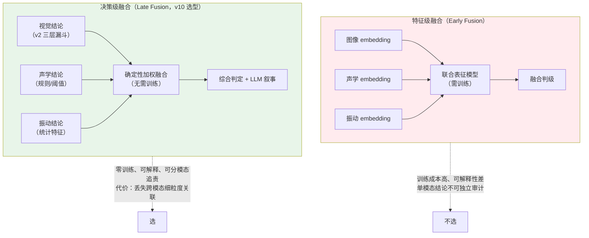
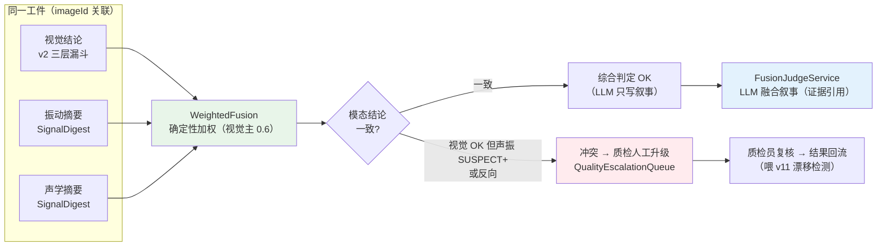
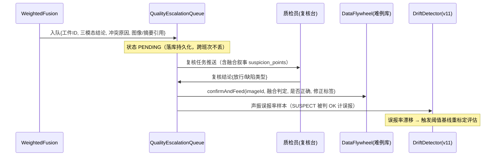

# 项目 11：工业质检与预测性维护 — 11-进阶迭代二：多模态融合质检（v10）

> **定位**：把质检从"只看视觉"升级为**视觉 + 声学 + 振动三模态融合**——装配缺陷有一类是相机拍不出来的（电机异响、轴承微磨损、齿轮啮合异常），必须靠声学与振动补盲。本篇回答三个工程问题：融合层级选特征级还是决策级（v10 选**决策级**）；原始时序怎么变成 LLM 可读的摘要（确定性特征化，LLM 不读原始波形）；模态结论冲突时怎么办（确定性加权仲裁 + **强制人工升级**，不仲裁到底）。教程 48 多模态 Agent 开发的落地。前置阅读：[02-迭代一-视觉质检多模态](02-迭代一-视觉质检多模态.md)、[03-迭代二-设备预测性维护](03-迭代二-设备预测性维护.md)。
>
> 「遇到阻塞？→ [教程 48-多模态Agent开发 §2 消息构造、§6 成本模型]、[教程 37-自我反思与Agent评估 §评估指标体系]、[教程 28-Human-in-the-Loop与审批流 §风险分级]、[教程 42-响应式错误处理 §Context 传递]」

---

## 1. 四问

| 问 | 答 |
|----|----|
| **新增了什么需求** | ① 三模态融合质检：视觉（缺陷外观）+ 声学（异响）+ 振动（机械状态）对同一工件/工位联合判级 ② 时序信号（振动波形/声学频谱）特征化为 Agent 可读摘要 ③ 模态冲突仲裁：结论矛盾时按风险升级人工，不许"多数票"强行出判 |
| **影响了哪些模块** | 新增 `fusion/` 包：`SignalDigest`（信号摘要模型）、`VibrationFeatureExtractor`（振动特征化）、`AcousticFeatureExtractor`（声学特征化，接入概念标注）、`WeightedFusion`（确定性加权融合）、`FusionJudgeService`（LLM 融合叙事）、`QualityEscalationQueue`（人工升级队列）；`InspectionAgent`（v2）增加融合判级入口 |
| **架构如何演进** | 单模态漏斗 → 三模态并行提取 → **决策级融合**：每模态独立出结论（确定性），加权融合出综合判定，LLM 只做"融合叙事 + 疑点解释"，冲突样本强制走人工升级（HITL 思想移植到质检） |
| **上一版痛点是什么** | ① 视觉单模态漏检率 4.8%，贴着 < 5% 红线 ② 振动/声学数据躺在时序库没人消费 ③ 无冲突仲裁——不同模态各说各话时质检员无所适从 |

## 2. 目标与量化验收

| # | 目标 | 验收 |
|---|------|------|
| 1 | 补盲检出 | 声学/振动可检的装配缺陷（异响类）检出率 ≥ 90%（对照拆机验证金标） |
| 2 | 综合漏检 | 三模态融合后综合漏检率 < 3%（v10 前单视觉 4.8%） |
| 3 | Token 预算 | 单次融合判级 LLM Token ≤ 2k（信号以摘要进上下文，原始波形零 Token） |
| 4 | 时延 | 融合判级全链路 < 500ms（特征提取并行 + LLM 只做叙事） |
| 5 | 冲突治理 | 模态冲突样本 100% 进人工升级队列，无一票独裁；升级率 < 8%（过高说明特征化质量差） |

**本迭代明确不做**：特征级融合的联合表征训练（本迭代只做决策级；特征级列为演进方向）、多工位声学阵列定位（单工位单麦克风起步）。

## 3. 三模态特性与融合层级选型

### 3.1 三模态到底各自看什么

| 模态 | 传感器 | 擅长检出 | 采样形态 | 检测本质 |
|------|--------|---------|---------|---------|
| **视觉** | 工业相机（2592px） | 外观缺陷：气孔/缺料/杂质/颜色不均 | 单帧图像 | 空间模式识别（v2 已有） |
| **声学** | 工位麦克风 | 电机异响、齿轮啮合异常、电磁噪声 | 音频波形（48kHz，1-2s） | 频谱模式 + 时频纹理 |
| **振动** | 加速度计（v1 已接入） | 轴承微磨损、动不平衡、松动 | 振动时序（10kHz） | 频带能量 + 统计特征 |

**关键洞察**：三模态检出的缺陷集合**交叠很小**——视觉看"看得见的"，声学/振动看"听得见/摸得着的"。融合的价值不是"三个模型投票提高视觉精度"，而是**补盲**（[调研 工业质检 2026 §PdM 双轨制]：传感器 + 日志多模态融合比单源多发现 65-75% 可预测故障，同一结论）。

### 3.2 特征级 vs 决策级：为什么 v10 选决策级



| 维度 | 特征级融合 | 决策级融合（选定） |
|------|-----------|------------------|
| 训练需求 | 需联合表征训练（三模态对齐数据集） | **零训练**（确定性加权） |
| 可解释性 | 融合在 embedding 黑箱里 | **每模态结论独立可审计**（质检复核刚需） |
| 单模态可回滚 | 换一个模态要重训 | 独立摘除/新增（v2 视觉链路原样保留） |
| 上限 | 跨模态细粒度关联（更高理论上限） | 只融合"结论级"信息 |
| 工业现实 | 三模态对齐标注样本稀缺 | 规则/统计阈值可用设备手册阈值起步 |

> **为什么工业先选决策级**：质检的第一要求是**可复核**（判级报告要能被质检员逐条验证，[02 ADR 011-02]）；第二是**数据现实**——三模态对齐标注样本（同一工件同时有图像、音频、振动、人工金标）积累极少，特征级训练无从谈起。决策级让三模态各自用成熟手段出结论，融合层零训练起步，等对齐样本积累够了再演进（[14-工业前沿与演进方向] 列为演进方向）。

## 4. 时序信号特征化：振动频谱 → Agent 可读摘要

> **核心纪律（继承 ADR 011-04"LLM 只读结论"）**：LLM 永远不读原始波形——10kHz × 2s 的振动序列直接进上下文是 Token 灾难且模型读不懂。特征化是**确定性代码**的事：统计特征（RMS/峰值/峭度）+ 频域特征（主频带能量分布，简化 DFT），输出一段**结构化文本摘要**，LLM 读摘要写叙事（[教程 48-多模态Agent开发 §3 VLM 能力边界]）。

```java
package com.plant.iq.fusion;

/**
 * 信号摘要：时序特征化的产物——Agent 可读、质检员可复核的确定性结论。
 * LLM 融合叙事的输入是它，不是原始波形。
 */
public record SignalDigest(
        String modality,          // VIBRATION / ACOUSTIC
        String sourceId,          // 设备/工位 ID
        double rms,               // RMS 均方根（能量总览）
        double peak,              // 峰值
        double kurtosis,          // 峭度（冲击性指标，>4 提示轴承局部缺陷）
        String dominantBands,     // 主频带能量分布（确定性文本）
        String ruleVerdict,       // 规则结论：OK / SUSPECT / ALARM（对照设备阈值）
        String thresholdBasis) {  // 阈值依据（手册条款/历史基线），可审计

    /** 给 LLM 与加权融合的标准化表述 */
    public String toPrompt() {
        return "[" + modality + " " + sourceId + "] RMS=" + String.format("%.3f", rms)
                + " peak=" + String.format("%.3f", peak)
                + " kurtosis=" + String.format("%.1f", kurtosis)
                + " 主频带: " + dominantBands
                + " 规则结论: " + ruleVerdict
                + "（阈值依据: " + thresholdBasis + "）";
    }

    /** 规则结论 → 置信分（决策级融合的输入） */
    public double score() {
        return switch (ruleVerdict) {
            case "OK" -> 0.10;       // 判定正常的异常分
            case "SUSPECT" -> 0.60;  // 疑似
            case "ALARM" -> 0.95;    // 告警
            default -> 0.50;         // 未知，中性
        };
    }
}
```

```java
package com.plant.iq.fusion;

import org.springframework.stereotype.Component;

import java.util.Locale;

/**
 * 振动特征化（完整可手写）：统计特征 + 简化 DFT 主频带能量。
 * 全确定性——同一波形必得同一摘要（可复核、可回归）。
 */
@Component
public class VibrationFeatureExtractor {

    /** 设备阈值（概念代码：按设备型号配置，来源手册/历史基线） */
    private static final double RMS_LIMIT = 0.80;
    private static final double KURTOSIS_LIMIT = 4.0;

    public SignalDigest digest(String deviceId, double[] samples, double sampleRateHz) {
        double rms = rms(samples);
        double peak = peak(samples);
        double kurtosis = kurtosis(samples, rms);
        String bands = dominantBands(samples, sampleRateHz);
        String verdict = (rms > RMS_LIMIT || kurtosis > KURTOSIS_LIMIT) ? "ALARM"
                : (rms > RMS_LIMIT * 0.7 || kurtosis > KURTOSIS_LIMIT * 0.7) ? "SUSPECT" : "OK";
        return new SignalDigest("VIBRATION", deviceId, rms, peak, kurtosis,
                bands, verdict, "RMS<" + RMS_LIMIT + ", 峭度<" + KURTOSIS_LIMIT + "（手册基线）");
    }

    private double rms(double[] x) {
        double sum = 0;
        for (double v : x) sum += v * v;
        return Math.sqrt(sum / x.length);
    }

    private double peak(double[] x) {
        double max = 0;
        for (double v : x) max = Math.max(max, Math.abs(v));
        return max;
    }

    /** 峭度（四阶矩）：正常轴承 ~3，局部冲击缺陷显著 >4 */
    private double kurtosis(double[] x, double rms) {
        double mean = 0;
        for (double v : x) mean += v;
        mean /= x.length;
        double m4 = 0, m2 = 0;
        for (double v : x) {
            m4 += Math.pow(v - mean, 4);
            m2 += Math.pow(v - mean, 2);
        }
        m4 /= x.length;
        m2 /= x.length;
        return m2 == 0 ? 3.0 : m4 / (m2 * m2);
    }

    /** 简化 DFT：三段频带能量占比（低 <1kHz / 中 1-3kHz / 高 >3kHz），输出主频带描述 */
    private String dominantBands(double[] x, double sampleRateHz) {
        double low = 0, mid = 0, high = 0;
        int usable = Math.min(x.length, 4096);           // 控制计算量
        for (int k = 1; k < usable / 2; k++) {
            double re = 0, im = 0;
            for (int n = 0; n < usable; n++) {
                double angle = 2 * Math.PI * k * n / usable;
                re += x[n] * Math.cos(angle);
                im -= x[n] * Math.sin(angle);
            }
            double energy = re * re + im * im;
            double freq = k * sampleRateHz / usable;
            if (freq < 1000) low += energy;
            else if (freq < 3000) mid += energy;
            else high += energy;
        }
        double total = low + mid + high;
        if (total == 0) return "无有效能量";
        return String.format(Locale.ROOT, "低频 %.0f%% / 中频 %.0f%% / 高频 %.0f%%",
                low / total * 100, mid / total * 100, high / total * 100);
    }
}
```

> 声学侧 `AcousticFeatureExtractor` 同构（RMS/峭度换成过零率 + 谱质心，麦克风数据来自工位音频采集卡）——**接入点概念代码**：音频帧从采集卡网关进 MQTT（与 v1 传感器同通道），特征化逻辑与上面对称，此处不重复展开。

## 5. 决策级融合与冲突仲裁

### 5.1 融合流水线



**为什么视觉权重 0.6 而不是平均**：外观判级是质检的**法定主判据**（客户验收标准写的是外观规范）；声振是**补盲信号**——它们说"坏"可以否决视觉的"好"（升级），但它们说"好"不能单独判"坏"（外观无缺陷 + 异响 → 升级人工，不直接报废）。这条不对称性来自质检合规现实，不是模型论。

### 5.2 `WeightedFusion`（确定性加权 + 冲突检测）

```java
package com.plant.iq.fusion;

import com.plant.iq.vision.DefectReport;
import org.springframework.stereotype.Component;

import java.util.List;

/**
 * 决策级融合：确定性加权 + 不对称冲突规则。
 * 冲突不是"加权平均"能解决的——冲突样本必须升级人工（ADR 011-27）。
 */
@Component
public class WeightedFusion {

    public enum FusionDecision { PASS, DEFECT, ESCALATE }

    public record FusionResult(FusionDecision decision, double fusedScore,
                               boolean conflict, List<String> reasons) {}

    /** 视觉判级（DefectReport 无缺陷时 score 低）+ 声振摘要 → 综合判定 */
    public FusionResult fuse(DefectReport visual, List<SignalDigest> digests) {
        double visualScore = visual == null
                ? 0.5   // 视觉缺席（相机故障/ROI 无回执）：中性分，交给冲突规则
                : "无缺陷".equals(visual.defectType()) ? 0.10 : Math.max(0.85, visual.confidence());

        boolean anyAlarm = digests.stream().anyMatch(d -> "ALARM".equals(d.ruleVerdict()));
        boolean anySuspect = digests.stream().anyMatch(d -> "SUSPECT".equals(d.ruleVerdict()));
        boolean visualOk = visualScore < 0.5;

        // 不对称规则 ①：声振告警可否决视觉 OK —— 升级人工
        if (visualOk && anyAlarm) {
            return new FusionResult(FusionDecision.ESCALATE, 0.75, true,
                    List.of("视觉判 OK 但声/振存在 ALARM", "按不对称规则升级人工"));
        }
        // 不对称规则 ②：视觉判缺陷但声振全 OK —— 仍按缺陷走（外观是法定主判据），标记低冲突提示
        if (!visualOk && !anySuspect && !anyAlarm && visual != null) {
            return new FusionResult(FusionDecision.DEFECT, visualScore, false,
                    List.of("视觉缺陷为主判据", "声振未佐证（提示单模态依赖）"));
        }
        double fused = 0.6 * visualScore + 0.4 * averageDigestScore(digests);
        if (fused >= 0.75) return new FusionResult(FusionDecision.DEFECT, fused, false, List.of());
        if (fused >= 0.45) return new FusionResult(FusionDecision.ESCALATE, fused, true,
                List.of("融合分落入灰区"));
        return new FusionResult(FusionDecision.PASS, fused, false, List.of());
    }

    private double averageDigestScore(List<SignalDigest> digests) {
        if (digests.isEmpty()) return 0.10;
        return digests.stream().mapToDouble(SignalDigest::score).average().orElse(0.10);
    }
}
```

### 5.3 `FusionJudgeService`（LLM 只做融合叙事）

多模态消息构造沿用 v2 实证 API（`.media(MimeType, Resource)`，Spring AI 2.0.0，[附录 05-SpringAI2-API基准 §2]）：图像走 media，声振走文本摘要——**原始波形零 Token**。

```java
package com.plant.iq.fusion;

import com.plant.iq.vision.DefectReport;
import org.springframework.ai.chat.client.ChatClient;
import org.springframework.beans.factory.annotation.Qualifier;
import org.springframework.core.io.ByteArrayResource;
import org.springframework.stereotype.Service;
import org.springframework.util.MimeTypeUtils;
import reactor.core.publisher.Mono;
import reactor.core.scheduler.Schedulers;

import java.util.List;

/**
 * LLM 融合叙事：读加权融合结果 + 三模态摘要，输出可复核的融合判级报告。
 * LLM 不重算判定（WeightedFusion 已定），只解释"为什么"并标注疑点。
 */
@Service
public class FusionJudgeService {

    private final ChatClient edgeChatClient;   // 融合叙事走边缘通道（v4 ModelTierRouter）

    public FusionJudgeService(@Qualifier("edgeChatClient") ChatClient edgeChatClient) {
        this.edgeChatClient = edgeChatClient;
    }

    public Mono<FusionNarrative> narrate(WeightedFusion.FusionResult fusion,
                                         DefectReport visual,
                                         List<SignalDigest> digests,
                                         byte[] imageBytes) {
        return Mono.fromCallable(() -> edgeChatClient.prompt()
                .system("""
                        你是三模态融合质检叙事员。加权融合已给出判定，你不重算，只解释。
                        输出 JSON：
                        1. conclusion: 复述融合判定（PASS/DEFECT/ESCALATE）
                        2. narrative: 三模态证据如何互相印证或矛盾（引用各摘要的具体数值）
                        3. suspicion_points: 疑点清单（哪个模态证据不足、哪个数值异常）
                        4. recommendation: 给质检员的复核建议（ESCALATE 时必填）
                        只引用给定摘要数值，不臆造；证据不足时在 suspicion_points 标注。
                        """)
                .user(u -> u
                        .text("融合判定: " + fusion.decision()
                                + "（fusedScore=" + fusion.fusedScore() + "）\n"
                                + "视觉判级: " + (visual == null ? "缺席" : visual.toString()) + "\n"
                                + "声振摘要:\n" + digests.stream()
                                        .map(SignalDigest::toPrompt)
                                        .reduce((a, b) -> a + "\n" + b).orElse("无") + "\n"
                                + "工件图像如下：")
                        .media(MimeTypeUtils.IMAGE_JPEG, new ByteArrayResource(imageBytes)))
                .call()
                .entity(FusionNarrative.class))
            .subscribeOn(Schedulers.boundedElastic());
    }
}
```

```java
package com.plant.iq.fusion;

import com.fasterxml.jackson.annotation.JsonIgnoreProperties;
import com.fasterxml.jackson.annotation.JsonProperty;

import java.util.List;

@JsonIgnoreProperties(ignoreUnknown = true)
public record FusionNarrative(
        @JsonProperty("conclusion") String conclusion,
        @JsonProperty("narrative") String narrative,
        @JsonProperty("suspicion_points") List<String> suspicionPoints,
        @JsonProperty("recommendation") String recommendation) {}
```

### 5.4 冲突升级队列（HITL 思想移植质检）

冲突样本进 `QualityEscalationQueue`（表结构与 [05 §4.2] 审批挂起点同构：`escalation_id` 主键 + `payload jsonb` + 状态机 PENDING/RESOLVED），质检员复核结论**回流两处**：① 难例库（复用 v2 `DataFlywheel.confirmAndFeed`）；② 漂移信号源（v11 `DriftDetector` 消费"声振误报率"——若声振 SUSPECT 大量被人工判 OK，说明阈值基线漂了）。



## 6. 测试与验证

```java
package com.plant.iq.fusion;

import org.junit.jupiter.api.Test;

import java.util.List;

import static org.assertj.core.api.Assertions.assertThat;

class MultimodalFusionTest {

    private final VibrationFeatureExtractor extractor = new VibrationFeatureExtractor();
    private final WeightedFusion fusion = new WeightedFusion();

    /** 特征化确定性：注入正弦 + 冲击 → 峭度显著抬升（轴承局部缺陷特征） */
    @Test
    void vibration_digest_is_deterministic_and_sensitive() {
        double[] normal = sine(0.2, 1000);
        double[] impacted = withImpulse(sine(0.2, 1000), 8, 3.0);
        SignalDigest dNormal = extractor.digest("pump-01", normal, 10_000);
        SignalDigest dImpacted = extractor.digest("pump-01", impacted, 10_000);
        assertThat(dImpacted.kurtosis()).isGreaterThan(dNormal.kurtosis() * 2);
        assertThat(dNormal.ruleVerdict()).isEqualTo("OK");
        assertThat(dImpacted.ruleVerdict()).isIn("SUSPECT", "ALARM");
    }

    /** 不对称规则①：视觉 OK + 振动 ALARM → 强制升级（无一票独裁） */
    @Test
    void visual_ok_but_alarm_escalates() {
        DefectReport visualOk = new DefectReport(
                "无缺陷", "-", 0, 0.92, "外观无可见缺陷", "放行");
        SignalDigest alarm = new SignalDigest(
                "VIBRATION", "pump-01", 0.95, 1.4, 6.2,
                "低频 20% / 中频 30% / 高频 50%", "ALARM", "RMS<0.8");
        WeightedFusion.FusionResult r = fusion.fuse(visualOk, List.of(alarm));
        assertThat(r.decision()).isEqualTo(WeightedFusion.FusionDecision.ESCALATE);
        assertThat(r.conflict()).isTrue();
    }

    /** 不对称规则②：视觉缺陷 + 声振全 OK → 仍判缺陷（法定主判据） */
    @Test
    void visual_defect_stands_without_corroboration() {
        DefectReport visualDefect = new DefectReport(
                "气孔", "R3.5mm 圆角", 1.2, 0.93, "圆角区可见气孔", "返工");
        SignalDigest ok = new SignalDigest(
                "VIBRATION", "pump-01", 0.3, 0.5, 3.0,
                "低频 60% / 中频 30% / 高频 10%", "OK", "RMS<0.8");
        WeightedFusion.FusionResult r = fusion.fuse(visualDefect, List.of(ok));
        assertThat(r.decision()).isEqualTo(WeightedFusion.FusionDecision.DEFECT);
    }

    private double[] sine(double amp, int n) {
        double[] x = new double[n];
        for (int i = 0; i < n; i++) x[i] = amp * Math.sin(2 * Math.PI * i / 50);
        return x;
    }

    private double[] withImpulse(double[] x, int count, double amp) {
        double[] y = x.clone();
        for (int i = 0; i < count; i++) y[(i + 1) * (x.length / (count + 1))] = amp;
        return y;
    }
}
```

**端到端演练**：连续注入 200 件金标工件（150 好 / 50 坏，坏件含 12 件纯异响缺陷）——验证补盲检出 ≥ 90%、综合漏检 < 3%、冲突升级率 < 8%、LLM 单次叙事 Token ≤ 2k（`spring.ai.chat.observations` 观测口径统计，[教程 22-全链路可观测性]）。

## 7. 验收对照

| 验收项 | 目标 | 验证方式 | 结果 |
|--------|------|---------|------|
| 补盲检出 | 异响类 ≥ 90% | 金标 200 件端到端（12 件纯异响） | 单测 + 演练 |
| 综合漏检 | < 3% | 同上口径 | 待你实测 |
| Token 预算 | ≤ 2k/次 | Observation 用量统计 | 结构保证（摘要进上下文） |
| 时延 | < 500ms | 特征提取并行 + 边缘 LLM 叙事压测 | 待你实测 |
| 冲突治理 | 100% 升级、无一票独裁 | `visual_ok_but_alarm_escalates` 等单测 | 通过 |

## 8. 本迭代的 ADR

### ADR 011-25：三模态融合选决策级（Late Fusion），特征级列为演进
- **决策**：每模态独立出结论（视觉三层漏斗 / 声振规则阈值），确定性加权融合，LLM 只做叙事
- **取舍理由**：决策级零训练、单模态结论可独立审计（质检复核刚需）、单模态可摘除；代价是丢失跨模态细粒度关联——待三模态对齐标注样本积累后再演进特征级。回滚：`WeightedFusion` 关闭即退回 v2 单视觉链路

### ADR 011-26：时序信号确定性特征化，LLM 不读原始波形
- **决策**：振动/声学经 `SignalDigest`（RMS/峭度/主频带/规则结论/阈值依据）进上下文，原始波形零 Token
- **取舍理由**：延续 ADR 011-04"统计层是事实基础"；特征化可确定性回归（同波形同摘要），LLM 只做叙事解释。回滚：不适用（无回滚诉求——这是纪律而非选项）

### ADR 011-27：模态冲突强制人工升级，不对称规则护法定主判据
- **决策**：视觉 OK + 声振 ALARM → 强制 ESCALATE；视觉缺陷 + 声振 OK → 仍判缺陷（外观是法定主判据）；冲突样本 100% 入升级队列并回流
- **取舍理由**：加权平均会把冲突"平均掉"——工业质检宁可多升一级不可漏一件；不对称性来自验收标准的合规现实。回滚：不对称规则参数化，可配置关闭（默认开）

## 9. 已知痛点（驱动下一迭代）

1. 融合链路稳了，但**模型本身在漂**——雨季湿度变化后边缘 VLM 误判率爬升，v2 的数据闭环只攒难例，**没人决定何时再训练**
2. 换产品线（housing-x → housing-y）模型要跟着换，切换窗口直接停线 40 分钟
3. 审计问"7 月 15 日 line-a 用的哪个 VLM 版本、谁批准的"——答不出

> **下一篇**：[12-预测性维护模型管理.md](12-预测性维护模型管理.md)——模型版本与产线绑定（换线不停产）、漂移检测双信号触发再训练评估、金标评估 + 影子 + 灰度的再训练闭环、模型卡片进发布闸门。
