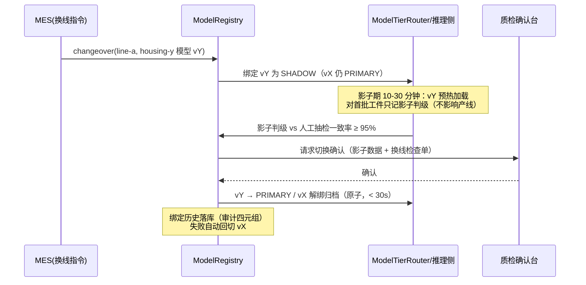
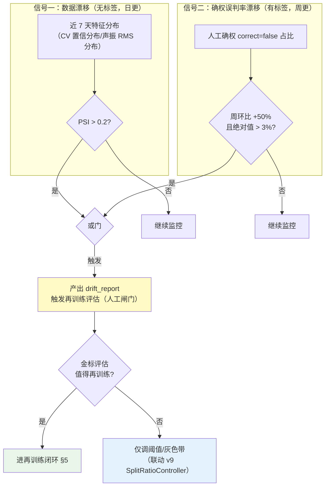
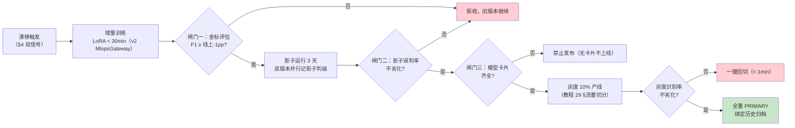
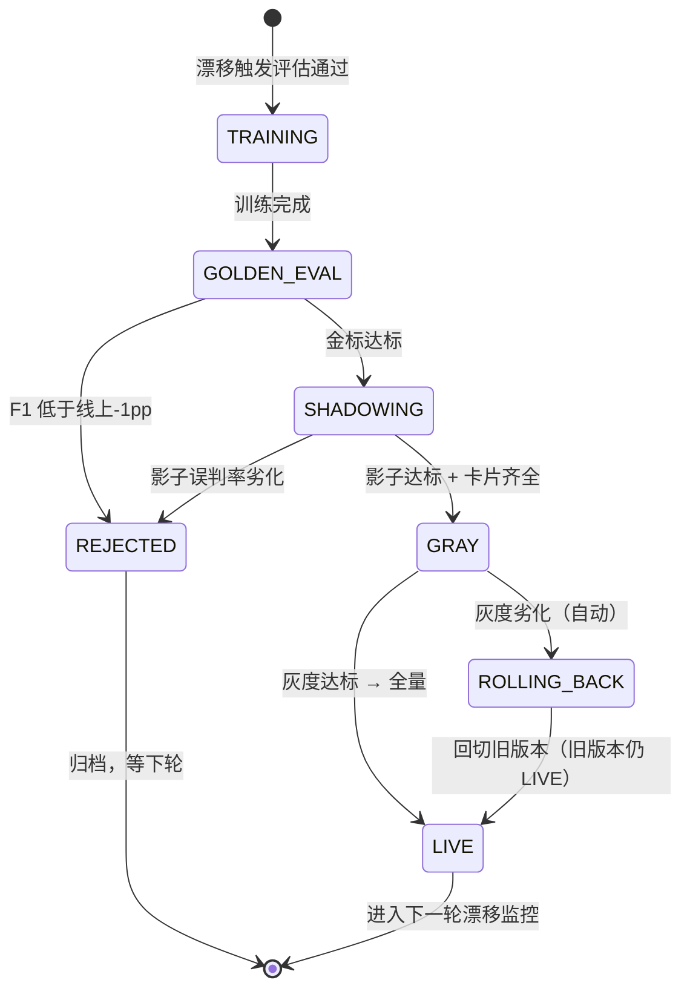

# 项目 11：工业质检与预测性维护 — 12-进阶迭代三：预测性维护模型管理（v11）

> **定位**：把 v2 埋下的数据闭环（难例回流）升级为**全生命周期模型管理**——模型版本与产线绑定（换线不停产）、漂移检测（数据漂移 + 误判率漂移双信号自动触发再训练**评估**）、再训练闭环（新样本 → 金标评估 → 影子运行 → 灰度上线）、模型卡片进发布闸门（工艺合规审计）。这是教程 41 数据飞轮在"质检/PdM 模型资产"上的落地，也是 [附录 13-AI治理与合规/01-模型卡片与数据卡片] 的工程化。前置阅读：[02-视觉质检多模态](02-视觉质检多模态.md)、[10-边缘AI推理优化](10-边缘AI推理优化.md)、[11-多模态融合质检](11-多模态融合质检.md)。
>
> 「遇到阻塞？→ [教程 41-数据飞轮与持续改进 §5 离线评估、§6 优化决策、§7 灰度发布]、[教程 29-灰度发布与版本管理 §流量切分]、[附录 13-AI治理与合规/01-模型卡片与数据卡片]、[教程 25-历史记录持久化与合规 §审计]」

---

## 1. 四问

| 问 | 答 |
|----|----|
| **新增了什么需求** | ① 模型版本注册与产线绑定：每次换产品线（housing-x → housing-y）模型跟着切，切换窗口不停线 ② 漂移检测：特征分布漂移（PSI）+ 人工确权误判率漂移双信号，自动触发**再训练评估**（不是自动再训练）③ 再训练闭环：金标集评估 → 影子并行 → 灰度切流，全量上线必须过闸门 ④ 模型卡片：每个上线版本带标准卡片，审计可查"产线 × 时间 → 模型版本 → 批准人" |
| **影响了哪些模块** | 新增 `modelmgmt/` 包：`ModelRegistry`（版本台账 + 产线绑定 + 换线影子期）、`DriftDetector`（PSI + 误判率双信号）、`RetrainPipelineService`（金标评估/影子/灰度编排）、`ModelCardService`（卡片生成与发布闸门）；`DataFlywheel`（v2）确权数据接入漂移检测；`MlopsGateway`（v2 概念接口）在此迭代有了真实消费方 |
| **架构如何演进** | 数据闭环（攒难例）→ 模型资产治理（版本可注册、绑定可切换、漂移可度量、再训练有闸门、发布有卡片）——质检/PdM 模型从"部署后黑箱"变成"可治理的版本化资产" |
| **上一版痛点是什么** | ① 难例攒了 500 条没人拍板再训练，雨季湿度漂移后误判率从 2.1% 爬到 4.7% ② 换线切模型 = 停线 40 分钟 ③ 漂移无量化感知，靠质检员抱怨才发现 ④ 审计问"当时用的哪个版本"答不出 |

## 2. 目标与量化验收

| # | 目标 | 验收 |
|---|------|------|
| 1 | 换线不停产 | 换产品线模型切换 **0 停线**（影子期预热 + 双版本在线，切换 < 30s） |
| 2 | 漂移感知 | PSI > 0.2 或确权误判率周环比 +50% 时，**24h 内**产出漂移报告并触发再训练评估 |
| 3 | 再训练闸门 | 新版本金标集 F1 不低于线上版本 - 1pp 才准影子；影子 3 天误判率不劣化才准灰度；**无卡片不发布** |
| 4 | 灰度安全 | 灰度期间可一键回切旧版本（< 1 分钟）；灰度产线识别率劣化即自动回切 |
| 5 | 审计可查 | "产线 × 时间 → 模型版本 → 训练数据范围 → 批准人"四元组 100% 可查（模型卡片 + 绑定历史） |

**本迭代明确不做**：自动再训练（漂移只触发**评估**，训练与上线永远有人工闸门）、跨工厂联邦学习（演进方向）。

## 3. 模型资产台账与产线绑定（换线不停产）

### 3.1 表结构 `db/schema-v11.sql`

```sql
-- PostgreSQL（db: iq_plant）——模型资产台账与产线绑定
CREATE TABLE IF NOT EXISTS model_version (
    model_id      VARCHAR(64) PRIMARY KEY,      -- 如 vision-vlm@2026-08-r3（语义化：模型@迭代）
    kind          VARCHAR(16)  NOT NULL,        -- VISION / VIBRATION / RUL
    artifact_ref  VARCHAR(256) NOT NULL,        -- 制品引用（GGUF/ONNX 的 registry 地址）
    train_data    VARCHAR(256) NOT NULL,        -- 训练数据范围（难例库快照 ID）
    f1_on_golden  DOUBLE PRECISION NOT NULL,    -- 金标集 F1（发布闸门依据）
    card_yaml     TEXT,                         -- 模型卡片（YAML，发布时必填）
    created_at    TIMESTAMPTZ  NOT NULL DEFAULT now()
);

CREATE TABLE IF NOT EXISTS model_line_binding (
    line_id       VARCHAR(32) NOT NULL,
    model_id      VARCHAR(64) NOT NULL,
    mode          VARCHAR(16) NOT NULL DEFAULT 'PRIMARY',  -- PRIMARY / SHADOW
    bound_at      TIMESTAMPTZ NOT NULL DEFAULT now(),
    bound_by      VARCHAR(32),                              -- 批准人（审计）
    PRIMARY KEY (line_id, model_id)
);

CREATE TABLE IF NOT EXISTS drift_report (
    id            BIGSERIAL PRIMARY KEY,
    line_id       VARCHAR(32)  NOT NULL,
    signal_type   VARCHAR(16)  NOT NULL,        -- PSI_FEATURE / CONFIRM_ERROR_RATE
    psi_value     DOUBLE PRECISION,
    detail        JSONB,
    created_at    TIMESTAMPTZ  NOT NULL DEFAULT now()
);
```

### 3.2 换线：影子预热 → 原子切换



```java
package com.plant.iq.modelmgmt;

import org.springframework.beans.factory.annotation.Qualifier;
import org.springframework.jdbc.core.JdbcTemplate;
import org.springframework.stereotype.Service;
import reactor.core.publisher.Mono;
import reactor.core.scheduler.Schedulers;

import java.sql.Timestamp;
import java.time.Instant;

/**
 * 模型注册与产线绑定：换线走 SHADOW 预热 → 人工确认 → 原子切换，0 停线。
 * JDBC 阻塞操作全部移到 boundedElastic（WebFlux 铁律）。
 */
@Service
public class ModelRegistry {

    private final JdbcTemplate appJdbc;

    public ModelRegistry(@Qualifier("appJdbcTemplate") JdbcTemplate appJdbc) {
        this.appJdbc = appJdbc;
    }

    /** 影子预热：新模型先 SHADOW 上线（不影响产线判级） */
    public Mono<Void> bindShadow(String lineId, String modelId, String boundBy) {
        return Mono.fromRunnable(() -> appJdbc.update(
                        "INSERT INTO model_line_binding(line_id, model_id, mode, bound_at, bound_by) "
                                + "VALUES (?, ?, 'SHADOW', ?, ?) "
                                + "ON CONFLICT (line_id, model_id) DO UPDATE SET "
                                + "mode = 'SHADOW', bound_at = EXCLUDED.bound_at, bound_by = EXCLUDED.bound_by",
                        lineId, modelId, Timestamp.from(Instant.now()), boundBy))
                .subscribeOn(Schedulers.boundedElastic())
                .then();
    }

    /** 原子切换：SHADOW → PRIMARY，旧 PRIMARY 解绑归档（事务内两步，失败抛异常自动保持原绑定） */
    public Mono<Void> promoteToPrimary(String lineId, String modelId, String boundBy) {
        return Mono.fromRunnable(() -> {
                    // 第一步：新版本升 PRIMARY（未命中 SHADOW 行即抛异常，防误切换）
                    int promoted = appJdbc.update(
                            "UPDATE model_line_binding SET mode = 'PRIMARY', bound_at = ?, bound_by = ? "
                                    + "WHERE line_id = ? AND model_id = ? AND mode = 'SHADOW'",
                            Timestamp.from(Instant.now()), boundBy, lineId, modelId);
                    if (promoted != 1) {
                        throw new IllegalStateException("影子绑定不存在: " + lineId + "/" + modelId);
                    }
                    // 第二步：旧 PRIMARY 归档（同事务；生产包 @Transactional，见下方说明）
                    appJdbc.update(
                            "UPDATE model_line_binding SET mode = 'ARCHIVED' "
                                    + "WHERE line_id = ? AND mode = 'PRIMARY' AND model_id <> ?",
                            lineId, modelId);
                })
                .subscribeOn(Schedulers.boundedElastic())
                .then();
    }

    /** 审计查询：产线 × 时间 → 当前 PRIMARY 模型 */
    public Mono<String> currentPrimary(String lineId) {
        return Mono.fromCallable(() -> appJdbc.queryForObject(
                        "SELECT model_id FROM model_line_binding "
                                + "WHERE line_id = ? AND mode = 'PRIMARY' ORDER BY bound_at DESC LIMIT 1",
                        String.class, lineId))
                .subscribeOn(Schedulers.boundedElastic());
    }
}
```

> 说明：`promoteToPrimary` 的两步 UPDATE 必须在同一事务边界（生产包 `@Transactional`，[05 §4.5] 同型用法）——PG JDBC 的 PreparedStatement 不支持单语句多 DML 带参执行，故拆两步而非拼一条 SQL。推理侧配合：`ModelTierRouter`（v4）读绑定表路由到对应模型制品；影子判级结果只落 `inspection_hard_example`，不进产线判级流。

## 4. 漂移检测：双信号触发再训练评估

> **单信号都不够**：只看特征分布（PSI）会误报（工况正常波动）；只看误判率会滞后（等质检员确权攒够样本，漂移已发生数周）。v11 用**双信号**：① **数据漂移**（PSI，Population Stability Index，量化特征分布偏移，无需标签、可日更）② **确权误判率漂移**（v2 `inspection_hard_example` 的 `correct=false` 占比周环比，有标签、更权威）。任一超阈值 → 产出漂移报告 → 触发**再训练评估**（评估是否值得再训练，不是直接训练）。



```java
package com.plant.iq.modelmgmt;

import org.springframework.beans.factory.annotation.Qualifier;
import org.springframework.jdbc.core.JdbcTemplate;
import org.springframework.stereotype.Component;

import java.util.List;

/**
 * 漂移检测：PSI（数据漂移）+ 确权误判率（标签漂移）双信号。
 * PSI 公式：Σ (实际占比 - 基线占比) × ln(实际占比 / 基线占比)——工业风控通用标准：
 * PSI < 0.1 稳定；0.1-0.2 关注；> 0.2 显著漂移。
 */
@Component
public class DriftDetector {

    private final JdbcTemplate appJdbc;

    public DriftDetector(@Qualifier("appJdbcTemplate") JdbcTemplate appJdbc) {
        this.appJdbc = appJdbc;
    }

    /** 特征分布 PSI：基线（训练时快照）vs 近 7 天分箱占比 */
    public double psi(double[] baseline, double[] recent, int bins) {
        double min = Double.min(minOf(baseline), minOf(recent));
        double max = Double.max(maxOf(baseline), maxOf(recent));
        double width = (max - min) / bins;
        double psiSum = 0;
        for (int b = 0; b < bins; b++) {
            double lo = min + b * width;
            double hi = lo + width;
            double baseRatio = ratioIn(baseline, lo, hi);
            double recentRatio = ratioIn(recent, lo, hi);
            if (baseRatio <= 0) baseRatio = 1e-4;        // 防零：分箱平滑
            if (recentRatio <= 0) recentRatio = 1e-4;
            psiSum += (recentRatio - baseRatio) * Math.log(recentRatio / baseRatio);
        }
        return psiSum;
    }

    public boolean isDrifted(double psiValue) {
        return psiValue > 0.2;
    }

    /** 确权误判率（v2 难例表）：近 7 天 correct=false 占比 */
    public double confirmedErrorRate(String lineId) {
        Double rate = appJdbc.queryForObject(
                "SELECT COALESCE(AVG(CASE WHEN correct THEN 0 ELSE 1 END), 0) "
                        + "FROM inspection_hard_example "
                        + "WHERE line_id = ? AND ts >= now() - interval '7 days'",
                Double.class, lineId);
        return rate == null ? 0 : rate;
    }

    /** 误判率漂移判定：绝对值 > 3% 且比上一周期 +50% */
    public boolean isErrorRateDrifted(double thisWeek, double lastWeek) {
        return thisWeek > 0.03 && lastWeek > 0 && thisWeek > lastWeek * 1.5;
    }

    private double ratioIn(double[] x, double lo, double hi) {
        long n = 0;
        for (double v : x) if (v >= lo && v < hi) n++;
        return (double) n / x.length;
    }

    private double minOf(double[] x) {
        return java.util.Arrays.stream(x).min().orElse(0);
    }

    private double maxOf(double[] x) {
        return java.util.Arrays.stream(x).max().orElse(1);
    }
}
```

## 5. 再训练闭环：金标评估 → 影子 → 灰度

> **闸门哲学**（[教程 41 §5、§6]）：每次模型变更必须可证明"不劣化"才能前进。三道闸门：**金标评估闸门**（离线 F1 不低于线上 - 1pp）、**影子闸门**（影子期误判率不劣化）、**灰度闸门**（灰度产线识别率不劣化 + 可一键回切）。任何一道不过 → 停在原地，旧版本继续服务。





```java
package com.plant.iq.modelmgmt;

import org.springframework.stereotype.Service;

/**
 * 再训练闭环编排：三道闸门（金标/影子/卡片），全程人工可见、可回切。
 * 训练本身走 v2 的 MlopsGateway（LoRA + shadow 是 MLOps 平台能力，此处编排与判定）。
 */
@Service
public class RetrainPipelineService {

    private final ModelRegistry registry;
    private final ModelCardService cardService;

    public RetrainPipelineService(ModelRegistry registry, ModelCardService cardService) {
        this.registry = registry;
        this.cardService = cardService;
    }

    /** 闸门一：金标集 F1 ≥ 线上版本 - 1pp 才放行影子 */
    public boolean goldenGate(double newF1, double liveF1) {
        return newF1 >= liveF1 - 0.01;
    }

    /** 闸门二：影子期误判率不劣化（允许 +0.5pp 统计噪声） */
    public boolean shadowGate(double shadowErrorRate, double liveErrorRate) {
        return shadowErrorRate <= liveErrorRate + 0.005;
    }

    /** 闸门三：无卡片不发布（ModelCardService 生成失败/缺字段 → false） */
    public boolean cardGate(String modelId) {
        return cardService.hasCompleteCard(modelId);
    }

    /** 灰度失败自动回切（灰度产线识别率劣化 > 0.5pp 触发） */
    public boolean shouldRollback(double grayRecall, double baselineRecall) {
        return grayRecall < baselineRecall - 0.005;
    }
}
```

**金标集（golden set）建设**：从 `inspection_hard_example` + 质检升级队列（v10）按缺陷类型分层抽样，每类 ≥ 50 件、总数 ≥ 500 件，人工双盲标注（两人一致才入集）；金标集**版本化**（`train_data` 快照 ID），评估可复现（[教程 37-自我反思与Agent评估 §评估指标体系]——金标集是质检平台的护城河资产，详见 [14-工业前沿与演进方向 §评估驱动]）。

## 6. 模型卡片与工艺合规

> 审计的三个问题（[附录 13-AI治理与合规/01-模型卡片与数据卡片]）：这条产线当时用的什么模型？模型拿什么数据训练的？谁批准上线的？——模型卡片（Model Card）+ 绑定历史（§3.1 表）就是答案。v11 把"卡片齐全"设为**发布闸门**：无卡片不上线。

```java
package com.plant.iq.modelmgmt;

import com.fasterxml.jackson.databind.JsonNode;
import org.springframework.beans.factory.annotation.Qualifier;
import org.springframework.jdbc.core.JdbcTemplate;
import org.springframework.stereotype.Service;

/**
 * 模型卡片：按 [附录 13/01] 模板生成 YAML，发布闸门校验必填字段。
 * YAML 手工拼装（字段固定、无需引依赖）；卡片随 model_version 落库，审计可查。
 */
@Service
public class ModelCardService {

    private final JdbcTemplate appJdbc;

    public ModelCardService(@Qualifier("appJdbcTemplate") JdbcTemplate appJdbc) {
        this.appJdbc = appJdbc;
    }

    /** 必填字段齐全才算"有卡片"（闸门三判定依据） */
    public boolean hasCompleteCard(String modelId) {
        String yaml = appJdbc.queryForObject(
                "SELECT card_yaml FROM model_version WHERE model_id = ?", String.class, modelId);
        if (yaml == null || yaml.isBlank()) return false;
        for (String field : new String[]{
                "model_id:", "kind:", "intended_use:", "training_data:", "evaluation:",
                "limitations:", "approver:"}) {
            if (!yaml.contains(field)) return false;
        }
        return true;
    }

    /** 生成标准卡片（YAML，模板对齐 附录 13/01 §2.1 核心结构） */
    public String renderCard(JsonNode meta) {
        return """
                model_id: %s
                kind: %s
                artifact_ref: %s
                intended_use: %s        # 预期用途与不适用场景（防误用）
                training_data: %s       # 训练数据范围（快照 ID + 时间窗 + 产线）
                evaluation:
                  golden_f1: %s         # 金标集 F1（闸门一依据）
                  shadow_error_rate: %s # 影子期误判率（闸门二依据）
                metrics:
                  performance: %s       # 关键指标（识别率/误判率）
                  fairness: 按产线分组的误判率差异（防某产线被系统性牺牲）
                limitations: %s         # 已知局限（如雨季湿度漂移未覆盖）
                approver: %s            # 批准人（审计四元组）
                approved_at: %s
                """.formatted(
                meta.path("model_id").asText(), meta.path("kind").asText(),
                meta.path("artifact_ref").asText(), meta.path("intended_use").asText(),
                meta.path("training_data").asText(), meta.path("golden_f1").asText(),
                meta.path("shadow_error_rate").asText(), meta.path("performance").asText(),
                meta.path("limitations").asText(), meta.path("approver").asText(),
                meta.path("approved_at").asText());
    }
}
```

**工艺合规联动**：卡片 `limitations` 字段与工艺约束（v6 `ConstraintTable`）互查——模型局限若涉及工艺参数敏感区，发布前必须工艺工程师会签；审计报表按"产线 × 时间段"查绑定历史，输出"当时用的哪个版本、卡片链接、批准人"（呼应 [教程 25-历史记录持久化与合规 §审计]）。

## 7. 测试与验证

```java
package com.plant.iq.modelmgmt;

import org.junit.jupiter.api.Test;

import java.util.Random;

import static org.assertj.core.api.Assertions.assertThat;

class ModelManagementTest {

    private final DriftDetector detector = new DriftDetector(null);   // PSI 纯函数，不触库

    /** PSI：同分布 ≈ 0，分布右移显著 > 0.2 */
    @Test
    void psi_detects_distribution_shift() {
        double[] baseline = normal(1000, 0.50, 0.05, 42L);
        double[] sameDistribution = normal(1000, 0.50, 0.05, 7L);
        double[] shifted = normal(1000, 0.62, 0.05, 7L);

        assertThat(detector.psi(baseline, sameDistribution, 10)).isLessThan(0.1);
        assertThat(detector.psi(baseline, shifted, 10)).isGreaterThan(0.2);
        assertThat(detector.isDrifted(detector.psi(baseline, shifted, 10))).isTrue();
    }

    /** 误判率漂移：绝对值 > 3% 且环比 +50% */
    @Test
    void error_rate_drift_rule() {
        assertThat(detector.isErrorRateDrifted(0.045, 0.025)).isTrue();   // 4.5% vs 2.5%
        assertThat(detector.isErrorRateDrifted(0.02, 0.015)).isFalse();   // 绝对值未过 3%
        assertThat(detector.isErrorRateDrifted(0.04, 0.039)).isFalse();   // 环比不足 +50%
    }

    /** 三道闸门：金标 -1pp / 影子 +0.5pp 容差 / 无卡片拦截 */
    @Test
    void gates_block_degradation() {
        RetrainPipelineServiceMock svc = new RetrainPipelineServiceMock();
        assertThat(svc.goldenGate(0.962, 0.970)).isTrue();    // -0.8pp 放行
        assertThat(svc.goldenGate(0.950, 0.970)).isFalse();   // -2pp 拒
        assertThat(svc.shadowGate(0.021, 0.020)).isTrue();    // +0.1pp 噪声内
        assertThat(svc.shadowGate(0.030, 0.020)).isFalse();   // +1pp 劣化拒
        assertThat(svc.cardGate("vision-vlm@r3")).isFalse();  // 无卡片拦截
        assertThat(svc.shouldRollback(0.985, 0.992)).isTrue(); // 灰度劣化自动回切
    }

    private double[] normal(int n, double mean, double sd, long seed) {
        Random r = new Random(seed);
        double[] x = new double[n];
        for (int i = 0; i < n; i++) x[i] = mean + sd * r.nextGaussian();
        return x;
    }

    /** 纯逻辑替身（绕开 DB 构造）：只验证闸门判定本身 */
    static class RetrainPipelineServiceMock extends RetrainPipelineService {
        RetrainPipelineServiceMock() { super(null, new ModelCardService(null)); }
        @Override public boolean goldenGate(double n, double l) { return n >= l - 0.01; }
        @Override public boolean shadowGate(double s, double l) { return s <= l + 0.005; }
        @Override public boolean cardGate(String id) { return false; }   // 模拟无卡片
        @Override public boolean shouldRollback(double g, double b) { return g < b - 0.005; }
    }
}
```

> 说明：`RetrainPipelineServiceMock` 覆写方法仅为绕开 DB 构造做纯逻辑断言；真实闸门走 `ModelRegistry`/`ModelCardService`（含 JDBC），集成测试用 H2/Testcontainers 注入 `appJdbcTemplate`。`DriftDetector.psi` 是纯函数，可直接测。

**端到端演练（剧本 F：模型治理）**：注入合成漂移（灰度产线置信分布整体右移）→ 24h 内 `drift_report` 产出 → 触发评估 → 走完三道闸门（故意让金标 F1 不达标一次验证拒收）→ 影子 3 天 → 灰度 → 全量；期间任意时刻"一键回切"可执行且 < 1 分钟。

## 8. 验收对照

| 验收项 | 目标 | 验证方式 | 结果 |
|--------|------|---------|------|
| 换线不停产 | 0 停线、切换 < 30s | 换线演练（影子预热 + 原子切换） | 演练归档 |
| 漂移感知 | 超阈 24h 内出报告 | `psi_detects_distribution_shift` + 剧本 F | 通过 |
| 再训练闸门 | 三道闸门全拦劣化 | `gates_block_degradation` | 通过 |
| 灰度安全 | 一键回切 < 1min | 剧本 F 回切演练 | 待你实测 |
| 审计可查 | 四元组 100% 可查 | `model_line_binding` 历史 + 卡片抽查 | 表结构保证 |

## 9. 本迭代的 ADR

### ADR 011-28：模型版本注册 + 产线绑定，换线走影子期
- **决策**：所有质检/PdM 模型进 `model_version` 台账；产线经 `model_line_binding` 绑定 PRIMARY/SHADOW；换线 = 影子预热 → 人工确认 → 原子切换
- **取舍理由**：换线停线 40 分钟的代价远大于影子期双版本显存开销；绑定历史同时是审计资产。回滚：切回旧版本即解除绑定（保留归档记录）

### ADR 011-29：漂移双信号（PSI + 确权误判率）只触发"再训练评估"
- **决策**：PSI > 0.2（无标签日更）或误判率绝对值 > 3% 且环比 +50%（有标签周更）→ 产出漂移报告 + 触发再训练**评估**；训练与上线永远有人工闸门
- **取舍理由**：单信号要么误报要么滞后；自动再训练在产线场景风险不可控（一次坏模型上线 = 全线误判）。回滚：阈值可配置；评估不通过仅调阈值/灰色带（联动 v9）

### ADR 011-30：无模型卡片不发布（发布闸门三）
- **决策**：金标达标 + 影子达标之后，还须卡片字段齐全（预期用途/训练数据/评估/局限/批准人）才准灰度；卡片随版本落库
- **取舍理由**：审计三问（用什么模型/拿什么训练/谁批准）必须版本级可答；卡片是治理成本最低的落点（[附录 13/01]）。回滚：不适用（合规义务不可回滚，字段模板可演进）

## 10. 已知痛点（进阶篇收束）

1. 模型资产治理齐了，但**决策资产**还散在 11 个迭代篇的 §5 小表里——三层漏斗为什么不能两层？HITL 为什么不能放在 Advisor？需要一份可查的 ADR 总账
2. 平台站在 2026 年往前看：边缘 Agent 状态持久化、评估驱动、Agent 治理、数字孪生、时序知识图谱——哪些是噱头哪些是必修课？

> **下一篇**：[13-ADR架构决策记录.md](13-ADR架构决策记录.md)——31 条 ADR 体系化汇编（上下文/备选/取舍/可回滚）。
