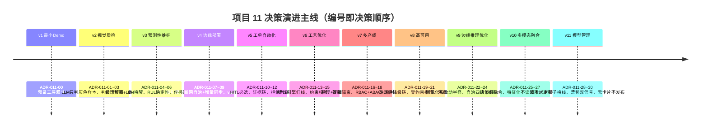
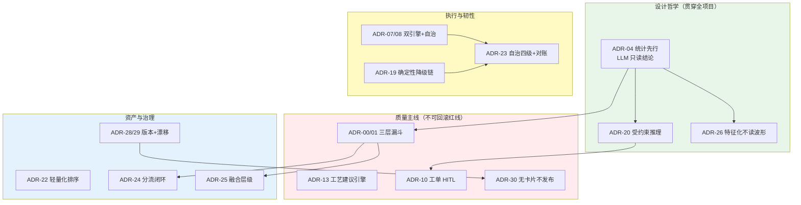
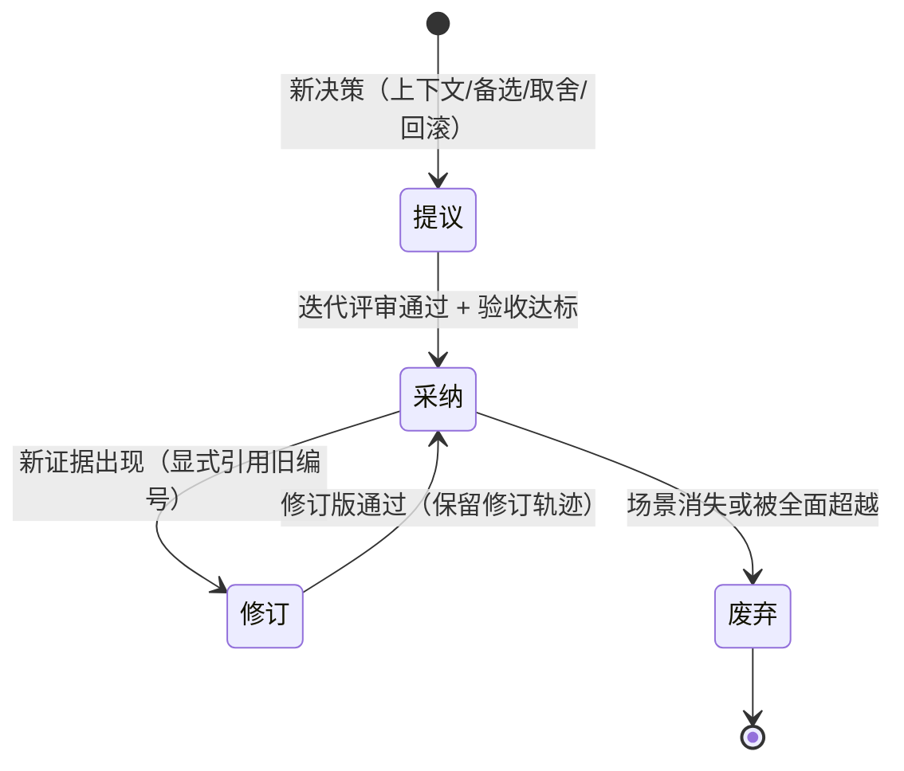

# 项目 11：工业质检与预测性维护 — 13-ADR架构决策记录

> **定位**：把项目 11 全部 11 个迭代（v1-v8 主体 + v9-v11 进阶）的 **31 条架构决策**汇成体系化 ADR（Architecture Decision Record）总账——每条关键决策补齐**决策上下文 / 备选方案 / 取舍理由 / 后果与可回滚性**四要素。这是本项目的"决策资产"：三个月后的你（或接手的新人）想改架构时，能查到"当时为什么这么定、放弃了什么、怎么回滚"。读者画像：想理解项目 11 每个"为什么"的读者，以及想把 ADR 当架构纪律范式的读者。前置阅读：[00-需求分析与架构设计](00-需求分析与架构设计.md)，方法论见 [附录 07-架构决策方法论]。
>
> **铁律 0**：涉及 Spring AI 2.0 API 的决策均经本地 jar `javap` 实证（[附录 05-SpringAI2-API基准] 为 ground truth）。

---

## 1. 本篇四问

| 问 | 答 |
|----|----|
| **新增了什么需求** | 决策可追溯：31 条决策从"散落各迭代 §5 小表"变成"有编号、有上下文、有备选、有回滚路径"的总账 |
| **影响了哪些模块** | 无代码影响（纯文档资产）；后续任何架构变更须先查本账、以新 ADR 显式修订旧 ADR |
| **架构如何演进** | 平台从"功能完整 + 韧性可验证"补上"决策可治理"——ADR 生命周期（提议/采纳/修订/废弃）成为团队的架构纪律 |
| **上一版痛点是什么** | ① 决策只有"决策 + 理由"两列，无备选无回滚 ② 新人问"为什么三层漏斗不是两层"要翻 5 篇文档 ③ 改架构时不知道哪些决策是红线（不可回滚）哪些是参数（可调） |

### 1.1 本节核对（本篇四问）

- [ ] 第 4 行三个痛点分别被后续章节解决：痛点①→§3 四要素详解、痛点②→§2 总览可查、痛点③→§5 红线显式标注 + §4 决策域分类
- [ ] 交付物边界（纯文档、无代码影响）与三篇前置阅读关系能复述

## 2. ADR 总览（v1-v11，31 条）

| 主题域 | ADR | 一句话决策 |
|--------|-----|-----------|
| 质检架构 | 00、01、02、03 | 三层漏斗：CV 快筛→VLM 精判→云端会诊；LLM 只判灰色样本；判级必须可解释；难例回流闭环 |
| 预测维护 | 04、05、06 | 统计预筛 + LLM 唤醒（Token 降 12 倍）；RUL 用确定性模型；信号 + 日志双源 |
| 部署形态 | 07、08、09 | 边缘 Ollama + 云端 vLLM 双引擎；断网自治 + 增量同步；云端量化选 AWQ |
| 人工介入 | 10、11、12 | 工单落 EAM 前 HITL 必选；建议带证据链；拒绝防绕过、超时不自动通过 |
| 工艺红线 | 13、14、15 | 建议引擎非闭环控制；建议过确定性约束校验；效果回流飞轮 |
| 隔离合规 | 16、17、18 | 物理节点 + 逻辑分区混合隔离；RBAC + ABAC 三级权限；临时授权自动回收 |
| 韧性治理 | 19、20、21 | 确定性降级链（边缘 LLM→规则→人工）；受约束推理 + 规则校验环；断网演练制度化 |
| 边缘深化 | 22、23、24 | 轻量化按改动半径排序（量化优先）；自治 L0-L3 + 恢复对账幂等；分流比例闭环（边界内） |
| 多模态 | 25、26、27 | 决策级融合（Late Fusion）；时序确定性特征化、LLM 不读原始波形；冲突强制人工升级 |
| 模型资产 | 28、29、30 | 版本注册 + 产线绑定 + 影子换线；漂移双信号只触发再训练**评估**；无模型卡片不发布 |

### 2.1 本节核对（ADR 总览）

- [ ] timeline 的十个版本段（v1-v11）与各迭代篇 §5 的 ADR 号段（00 / 01-03 / 04-06 / 07-09 / 10-12 / 13-15 / 16-18 / 19-21 / 22-24 / 25-27 / 28-30）一一闭合，无缺号
- [ ] 主题域分组的 ADR 号与"一句话决策"能被引证到对应的迭代篇

## 3. 关键 ADR 详解（10 条）

> 每条按四要素展开：上下文 → 备选 → 取舍 → 后果与回滚。未展开的 21 条见各迭代篇 §5。

### 3.1 ADR-011-00/01：质检三层漏斗，LLM 只判灰色样本

- **上下文**（v2）：质检员日检 2000 件、小缺陷漏检 14%；产线节拍要求毫秒级判级，而多模态 LLM 单次精判 80-200ms、云端会诊秒级——直接上 LLM 跟不上节拍；纯 YOLO 又判不了灰色样本（置信 0.70-0.95）且判级不可解释。
- **备选**：① 纯 CV（快但灰色样本漏检、判级不可解释）② 纯 LLM（可解释但跟不上节拍、成本失控）③ CV 快筛过滤 95%+ → VLM 只精判灰色样本 → 云端大模型疑难会诊。
- **取舍**：选③。"99% 陷阱"的解法——LLM 永远不承担毫秒级实时、也永远不做唯一判级依据（基准研究：移除物体名词后 I-AUROC 从 97.4 骤降至 82.6，VLM 有系统性短板）。代价：三层链路的运维复杂度 + 模态间数据对齐。
- **后果与回滚**：这是全项目的第一决策，v9 的分流闭环（ADR-011-24）、v10 的融合仲裁（ADR-011-25）都建立在它之上。回滚：灰色带参数化（v9 后由 `SplitRatioController` 动态调节）；极端情况下可降级两层（跳过 L2）但识别率承诺必须重签。

### 3.2 ADR-011-04：统计预筛 + LLM 唤醒（PdM 双轨制）

- **上下文**（v3）：40 台设备 × 10kHz 振动时序，全量喂 LLM 是 Token 灾难；纯深度学习时序模型精确率仅 27%。ICML 2025 LEAD 证明：轻量统计先过滤、LLM 只解释显著事件，Token 降 12 倍、精确率提升到 72%。
- **备选**：① 全量时序喂 LLM（Token 爆炸）② 纯深度学习端到端（精确率 27%、不可解释）③ EWMA/CUSUM 统计层持续跑（CPU 零 Token），统计显著才唤醒 LLM 解释。
- **取舍**：选③。**统计层是"事实基础"，LLM 只做"叙事解释"**——这条后来扩展成 ADR-011-26（时序特征化）与 ADR-011-20（受约束推理），是项目 11 的第一设计哲学：LLM 永远不读原始数据，只读确定性过滤后的结论。
- **后果与回滚**：v10 声学/振动融合、v11 漂移检测全部复用"统计先行"分层。回滚：不适用（哲学级决策，具体算法 EWMA→孤立森林可替换，分层不可拆）。

### 3.3 ADR-011-05：RUL 用确定性模型，LLM 不估寿命

- **上下文**（v3）：RUL（剩余使用寿命）是回归/外推问题——振动退化轨迹线性回归 + 阈值外推就能算；让 LLM 估 RUL 是让它做数学题，输出不可复现、无法回归测试。
- **备选**：① LLM 直接估 RUL（不可复现）② 深度学习退化模型（要训练数据、黑箱）③ 确定性线性退化 + 生存分析（`RulEstimator`），LLM 只把结果翻译成"征兆/根因/建议窗口"。
- **取舍**：选③。程序计算、AI 总结——数学的归数学，叙事的归叙事。代价：线性退化假设对突变型故障（突发断裂）不敏感，需配合 EWMA 突增检测兜底。
- **后果与回滚**：v5 工单证据链里的 RUL 数值全部可追溯到 `RulEstimator` 的输入时序。回滚：退化模型可替换（线性→指数/维纳过程），接口不变。

### 3.4 ADR-011-07/08：边缘 Ollama + 云端 vLLM 双引擎，断网自治

- **上下文**（v4）：产线断网不可停（停线损失 ≥ 5 万/2h）；云端 LLM 往返延迟高、费用高；边缘工控机 16GB 显存预算。
- **备选**：① 全云端（断网即停，否决）② 全边缘（8B 模型疑难会诊能力不足）③ 双引擎：边缘 GGUF Q4 处理 80% 常规 + 云端 AWQ 疑难会诊，统一 OpenAI 兼容接口让 `ModelTierRouter` 无感路由。
- **取舍**：选③。vLLM 不支持 GGUF、AWQ 是质量最优 INT4（ADR-011-09）；断网时 `EdgeAutonomy` 本地闭环 + `LocalBuffer` 落盘缓冲 + 恢复增量同步。代价：两套模型版本的运维与一致性（v11 模型管理收口）。
- **后果与回滚**：v8 演练验证断网 1h 不中断、v9 升级到 L0-L3 分级 + 对账。回滚：`ModelTierRouter.route()` 的任务类型映射可配置，全量回云端只需改路由。

### 3.5 ADR-011-10：工单 HITL 必选（assistive 为主）

- **上下文**（v5）：PdM 预测"泵 3 天内要修"后，全自动落 EAM 工单的风险：误报工单骚扰维护排期、错误工单触发不必要的停机维修；2026 行业现实是"assistive 为主、governed autonomy 起步"。
- **备选**：① 全自动落单（高置信自动）② 低置信 HITL、高置信自动 ③ 建议工单 100% 经人工审批，HITL 闸门落在 `ToolCallingManager` 装饰器。
- **取舍**：选③。拦截时点选**工具意图已返回、工具执行前**（`executeToolCalls` 拦截 `submitWorkOrder`）；挂起点持久化（`ApprovalCheckpointStore`）支持跨天/跨重启审批。代价：每单人工审批延迟（但对比原人肉协调 2 周，< 1 分钟的建议 + 审批已是 4 个数量级改进）。
- **后果与回滚**：`WorkOrderApprovalManager` 是 ToolCallingManager 装饰器模式范本（[附录 05-SpringAI2-API基准/02 §1.3]）。回滚：不适用（安全红线；如未来放开须以新 ADR 显式修订、限定风险等级并保留修订轨迹——见 §5 决策纪律第 2 条）。

### 3.6 ADR-011-13：工艺优化是建议引擎，不是闭环控制

- **上下文**（v6）：班次良率差异 95% vs 89%，调参靠老师傅经验；LLM + 历史工况检索明明能生成参数建议——但直接写 PLC 是工业安全红线（错误参数可致模具损坏甚至人身事故）。
- **备选**：① 闭环写 PLC（红线，否决）② 只出报告不进流程（无闭环、无人用）③ 建议引擎：检索历史最优工况 → LLM 生成建议 → 确定性约束校验（`ConstraintTable`：min/max/maxStep）→ 人工/DCS 确认 → 效果测量回流。
- **取舍**：选③。"建议 + 确认 + 反馈"而非"建议 + 执行"——工业场景的信任边界比互联网保守一个量级。代价：优化周期长（确认环节慢），换来的是可追溯（每次建议含依据 + 确认人）。
- **后果与回滚**：与 ADR-011-14（约束校验）、15（效果回流）构成铁三角。回滚：不适用（红线；LLM 建议永不下探执行层）。

### 3.7 ADR-011-19/20：确定性降级链 + 受约束推理

- **上下文**（v8）：质检误报导致异常停线（误报率 22%）；模型宕机时若无预案，降级行为是随机的（哪里失败停哪里）。
- **备选**：① 失败重试（对模型随机性无效）② 无兜底直接报错（产线不可接受）③ 降级链显式化：边缘 LLM → 规则引擎 → 人工接管（不丢数据）+ 规则校验环：无证据的 LLM 结论 100% 转人工/拒绝。
- **取舍**：选③。把"模型随机性宕机"转化为"架构确定性降级"；把"LLM 可能信口开河"转化为"结论必须被确定性证据支持"（ACL 2026 Condition Insight Agent 范式）。代价：降级期检测精度下降（规则引擎只有阈值逻辑）——所以 v9 把降级分级化（ADR-011-23），不同故障层级给不同能力。
- **后果与回滚**：误报率治理目标 22%→8%。回滚：降级链层级可配置；校验环阈值可调。

### 3.8 ADR-011-23：断网自治四级（L0-L3）+ 恢复对账幂等

- **上下文**（v9）：v8 的断网策略是"云可达与否"的布尔值——弱故障浪费边缘算力、强故障过度自信；恢复重发导致云端重复计数告警。
- **备选**：① 保持布尔式（简单但失真）② 按故障类型分四级 L0-L3：在线/边缘自治/规则判级/仅采集，自动降级 + 保守升级（回 L0 需对账 + 人工确认）③ 全自动升降级（半恢复状态误上行风险）。
- **取舍**：选②。真实故障是分层的（云断/边缘 LLM 崩/进程崩）；升回 L0 的保守性用"对账完成 + 人工确认"换取。每条上行信号带幂等键（SHA-256），恢复先发对账清单再差异回放——重复上报率 0%。
- **后果与回滚**：断网容忍从 1h（v8）提到 4h。回滚：`AutonomyPolicy` 可配置退回 v8 单层降级链。

### 3.9 ADR-011-25/26/27：多模态融合选决策级，特征化不读波形，冲突强制升级

- **上下文**（v10）：视觉单模态漏检率 4.8% 贴线；声振缺陷相机拍不出；三模态对齐标注样本稀缺；模态冲突（视觉好、振动坏）无仲裁规则。
- **备选**：① 特征级融合（需联合训练 + 对齐数据集，现实拿不到）② 决策级融合：每模态独立出结论 + 确定性加权 + LLM 只叙事 ③ 冲突时多数票裁决。
- **取舍**：选②并明确否决③——**冲突不许投票**：视觉 OK + 声振 ALARM 强制升级人工（不对称规则），加权平均会把冲突"平均掉"。时序经 `SignalDigest` 特征化（RMS/峭度/主频带）进上下文，原始波形零 Token（继承 ADR-011-04）。
- **后果与回滚**：单模态可独立摘除（视觉链路 v2 原样保留）；升级率 < 8% 是特征化质量红线。回滚：关闭 `WeightedFusion` 即退回 v2 单视觉。

### 3.10 ADR-011-29/30：漂移双信号只触发"再训练评估"；无卡片不发布

- **上下文**（v11）：雨季湿度漂移后误判率 2.1%→4.7% 没人触发再训练；换线停线 40 分钟；审计三问（用什么模型/拿什么训练/谁批准）答不出。
- **备选**：① 漂移即自动再训练上线（产线场景一次坏模型 = 全线误判，否决）② 只看误判率（滞后数周）③ 双信号（PSI 日更无标签 + 确权误判率周更有标签）触发再训练**评估**，三道闸门（金标 F1 / 影子误判率 / 卡片齐全）后才灰度，可一键回切。
- **取舍**：选③。自动化的边界画在"评估"——机器负责发现漂移，人负责决定换模型；模型卡片（[附录 12-AI治理与合规/01]）设为发布闸门，让审计三问变成一个 SQL。
- **后果与回滚**：换线 0 停线（影子预热 + 原子切换 < 30s）；灰度回切 < 1 分钟。回滚：闸门阈值可调；卡片字段模板可演进，但"无卡片不发布"本身不可回滚（合规义务）。

### 3.11 本节核对（关键 ADR 详解）

- [ ] 十条详解每条都满足四要素（上下文 / 备选 / 取舍 / 后果与回滚），无缺要素
- [ ] 能指出哪些 ADR 标了"不可回滚 / 红线"（10/13/30）及其"回滚即放弃什么"，哪些是可调参数
- [ ] 3.2/3.9 的"统计先行、LLM 只读结论"哲学在 04→20→26 之间的承继关系能复述

## 4. 决策域全景与依赖

**读图要点**：红色 CORE 域四条是红线（回滚 = 放弃安全承诺，ADR-011-13/30 不可回滚，ADR-011-10 放开须新 ADR 显式修订）；绿色 PHILO 域三条是哲学（统计先行一脉相承 04→20→26）；其余是可调参数与可演进结构。

### 4.1 本节核对（决策域全景与依赖）

- [ ] CORE 域四条红线（三层漏斗 / 工艺建议引擎 / 工单 HITL / 无卡片不发布）各自"回滚即放弃什么"能说清
- [ ] PHILO→CORE 的依赖箭头（P1→C1、P2→C3）对应的决策间逻辑（统计先行支撑三层漏斗、受约束推理支撑 HITL）能复述

## 5. ADR 使用规范（决策纪律）

1. **编号即顺序**：ADR-011-XX 顺序分配，不复用废弃编号（废弃保留在总览表，状态标 ❌）。
2. **修订不删除**：被修订的 ADR 保留原文，新 ADR 引用旧编号并说明新证据（范本见 ADR-011-23 对 19 的分级化精确）。
3. **每迭代 ≤3 条**：防决策通胀——小选择不进 ADR，进迭代篇正文即可。
4. **红线显式标注**：不可回滚的决策（10/13/30）在 ADR 内写明"回滚即放弃什么"，防止后人无意识触碰。
5. **四问绑定**：每条 ADR 必须能回溯到"当次迭代的四问"（新增需求/影响模块/演进/痛点）。

### 5.1 本节核对（ADR 使用规范）

- [ ] 五条纪律（编号即顺序 / 修订不删除 / 每迭代 ≤3 条 / 红线显式标注 / 四问绑定）能复述，且能对应到正文章节某个实例
- [ ] stateDiagram 的 ADR 生命周期（提议→采纳→修订→废弃）与纪律 2"修订不删除"一致

## 6. 总结

31 条 ADR 收敛出项目 11 的三条不变铁律：**统计先行、LLM 只读结论**（04/20/26 一脉相承，从 PdM 扩展到融合与推理约束）、**AI 锁死建议者、红线动作 HITL**（10/13/30：工单审批、工艺确认、模型发布三道人工闸门）、**确定性优先于概率性**（01 三层漏斗/05 RUL/19 降级链/23 自治分级/29 评估闸门——凡可确定性化的环节绝不用概率性组件兜底）。这套决策资产配合 [附录 07-架构决策方法论] 的四要素模板，可直接复用到任何工业 Agent 项目。

### 6.1 本节核对（总结三条铁律）

- [ ] 三条铁律（统计先行 / AI 锁死建议者+红线 HITL / 确定性优先）能各自举出至少 2 条对应 ADR 编号
- [ ] 用该铁律复盘一句：若新增"跨工厂联邦学习"类决策，会落在哪条铁律之下、是否红线——能给出判断

**下一篇**：[14-工业前沿与演进方向.md](14-工业前沿与演进方向.md)——站在 2026 年行业前沿（Google / Nebius / AWS）审视平台缺口与演进路线，项目 11 收官。
