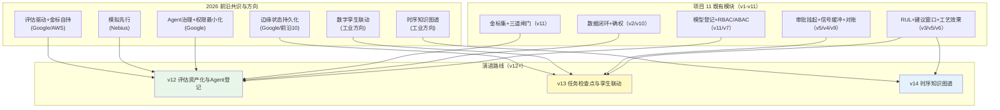
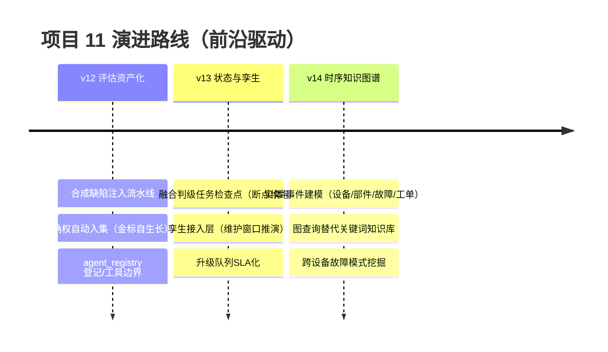
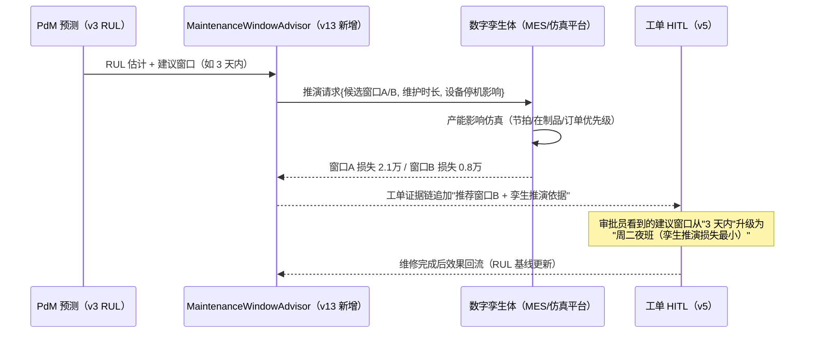

# 项目 11：工业质检与预测性维护 — 14-工业前沿与演进方向（收官）

> **定位**：对项目 11 做**工业前沿对照**——梳理 2026 年 Google（生产级 Agent 五指南）、Nebius（Agents Blueprint）、AWS 关于企业 Agent 生产落地的公开经验，叠加工业 AI 特有的五个前沿方向（边缘 Agent 状态持久化、评估驱动与金标集护城河、Agent 治理与产线权限最小化、数字孪生联动、时序知识图谱），逐条映射到本平台 11 个迭代（v1-v11）的既有能力，找出缺口并给出**演进路线（v12+）**。读者画像：读完 00-13 想站在行业前沿审视平台设计的读者。前置阅读：[13-ADR架构决策记录](13-ADR架构决策记录.md)、[教程 43-Agent治理与合规框架]、[教程 41-数据飞轮与持续改进]。
>
> **来源**：本文引用均为真实外部资料，已标注链接（CLAUDE.md 规则 14）；引用内容的表述以原文为准，推断处明确标注「平台映射（本文观点）」。

---

## 1. 本篇四问

| 问 | 答 |
|----|----|
| **新增了什么需求** | 前沿对照：把行业共识（评估驱动、Agent 治理、模拟先行）与工业特有方向（边缘状态持久化、数字孪生、时序知识图谱）映射到平台现状，识别缺口、给出 v12+ 演进路线 |
| **影响了哪些模块** | 无代码影响（收官规划篇）；v12+ 的候选项按优先级排序，作为平台下一阶段的 PLAN 输入 |
| **架构如何演进** | 平台从"单工厂闭环"（v1-v11）向"评估资产化、Agent 可治理、孪生可联动"演进——三条主线全部建立在既有模块的延伸上，不推翻任何 ADR |
| **上一版痛点是什么** | ① 31 条 ADR 收敛了"过去为什么"，但"接下来往哪走"没有优先级 ② 不确定哪些前沿是必修课（评估驱动）、哪些是选修（数字孪生）、哪些是噱头 |

## 2. 2026 前沿共识：三份来源的五个结论

### 2.1 评估驱动：金标集是护城河，不是外购品

Google 生产指南的核心论断：生产级 Agent 的分水岭不是模型选型，而是**有没有可持续运行的评估集与回归基线**——上线前跑评估、每次改动跑回归、失败案例回流评估集（[Google 五篇生产指南](https://cloud.google.com/blog/topics/developers-practitioners/five-guides-to-building-and-scaling-production-ready-ai-agents)）。AWS 企业指南补了冷数据视角：大量 Agent 项目因无法证明价值被砍，**评估标准必须企业自持**（[AWS 企业级 Agent 实践](https://cloud.it168.com/a2026/0708/6939/000006939041.shtml)）。

**平台映射（本文观点）**：这条对质检场景是"主场作战"——v11 的金标集（分层抽样 ≥ 500 件、双盲标注、版本化）+ 三道发布闸门已是该范式；工业的独特优势是**金标集天然可积累**（每件下线工件都有人工确权结果，[02 §4.10]）。缺口在"自动生长"：金标样本靠人工抽检入集，Nebius 的"simulate before you scale"提供了思路（§2.3）。

### 2.2 Agent 治理：把 Agent 当一等公民管理，权限最小化

Google 生产指南提出 Agent 治理栈：每个 Agent **集中登记**（所有者、目标数据、允许工具、行为边界），网关层管住"Agent 能做什么"，行为异常进看板——防"影子 AI"（[Google 五篇生产指南](https://cloud.google.com/blog/topics/developers-practitioners/five-guides-to-building-and-scaling-production-ready-ai-agents)）。

**平台映射**：本项目治理的是"模型资产"（v11 `model_version` + 绑定历史）与"人"（v7 RBAC + ABAC），但 **Agent 本身没有登记表**——质检 Agent、工单 Agent、工艺建议 Agent 散在代码里，无所有者、无工具边界清单。工业场景的权限最小化更硬：产线 Agent 只应看到本产线数据（v7 RLS 已做）、只应调用白名单工具（如工艺 Agent 永远没有 `writePlc` 这个工具——ADR-011-13 用"工具不存在"实现了最强权限最小化，这个模式值得显式化成登记制度）。

### 2.3 模拟先行：部署前产出回归集

Nebius Agents Blueprint 把 "simulate before you scale" 列为核心工程纪律：Agent 上线/改版前先在沙箱跑**数百个模拟任务**，把成功与失败轨迹沉淀为评估集和回归套件——用模拟换确定性，不拿生产流量试错（[Nebius Agents Blueprint](https://nebius.com/blog/posts/introducing-the-nebius-agents-blueprint)）。

**平台映射**：质检场景的"模拟"有独特原料——**合成缺陷注入**（在良品图像上程序化合成气孔/杂质，或回放历史缺陷库的困难样本）可以在不占用产线的情况下批量生成评估样本。v11 漂移触发的再训练评估目前用静态金标集，模拟注入能把金标集从"历史快照"升级为"历史 + 合成"双轨。

### 2.4 失败是系统失败：系统工程优先于模型增量

Google 与 Nebius 的共同结论：生产级 Agent 的失败大多是**系统失败**（检索、编排、评估、状态管理），不是模型能力不足——模型会换代，架构资产复利（[Nebius Agents Blueprint](https://nebius.com/blog/posts/introducing-the-nebius-agents-blueprint)）。

**平台映射**：本项目 31 条 ADR 里没有一条是"换更大的模型"，全部是系统工程（分层、闸门、降级、对账、隔离）——与该共识完全同构。误报率从 22% 治理到 8% 靠的是受约束推理（ADR-011-20），不是模型升级。

### 2.5 边缘 Agent 的状态持久化：断的不只是网，还有"记忆"

前沿讨论开始把边缘 Agent 的**状态持久化**当作一等工程问题：Agent 的任务状态（挂起的审批、未完成的判级、缓冲的信号）必须与进程解耦——进程崩了状态还在，重启后从断点续跑（[Google 五篇生产指南](https://cloud.google.com/blog/topics/developers-practitioners/five-guides-to-building-and-scaling-production-ready-ai-agents) 的 "state management" 议题；[前沿 10-边缘Agent与端云协同 §4]）。

**平台映射**：v5 的 `ApprovalCheckpointStore`（挂起点持久化）、v4 的 `LocalBuffer`（信号落盘）、v9 的对账（幂等键）已覆盖"数据状态"；缺口在**任务状态**——边缘 L3 仲裁做多模态融合判级时若进程重启，任务从哪一步续跑（图像已取、视觉已判、声振摘要未生成）没有检查点。这是 v12 的候选项。

## 3. 工业 AI 特有前沿：两个"选修但方向明确"的方向

### 3.1 数字孪生联动

工业数字孪生（Digital Twin）从"三维可视化"演进为"仿真推演引擎"：把产线物理模型（节拍、热平衡、刀具磨损）与 Agent 的预测输出（RUL、良率）联动，**在孪生体里预演维护窗口的产能影响**——"泵 3 天内要修"不再只是告警，而是孪生推演"周二夜班停 2 小时 vs 周五白班停 2 小时，哪个损失小"的决策依据。

**平台映射**：本项目 PdM 输出（RUL + 建议窗口）正是孪生推演需要的输入；v6 工艺建议引擎的效果测量（良率/能耗）也依赖孪生体的反演数据。缺口：无孪生接入层（通常是 MES/仿真厂商的 OPC-UA 或 REST 接口）。定位为**选修**：依赖企业已有孪生投入，没有孪生时建议窗口仍可用排程启发式兜底。

### 3.2 时序知识图谱

时序知识图谱（Temporal Knowledge Graph）把"设备-部件-故障-工单-工艺参数"的实体关系加上时间维度：`pump-01 的轴承 6205` 在 `2026-05` 发生 `点蚀`，维修用了 `方案 A`，之后 `振动基线` 下移 `12%`——这类**跨事件因果链**是纯向量检索答不了的（"这台泵上次类似症状修了什么、效果持续多久"），也是 GraphRAG 在工业的落点（[附录 11-知识图谱工程]、[教程 35-高级RAG与AgenticRAG §GraphRAG]）。

**平台映射**：本项目已有全部原料——设备台账、故障历史（v3 知识库）、工单（v5）、维修回流（v5 `onRepairComplete`）、工艺效果（v6 `process_outcome`）——只是它们躺在关系表里没有被组织成图。缺口：实体-事件建模 + 图查询层。定位为**中期方向**：当"跨设备故障模式挖掘"（同型号多台设备的共性问题）成为真实需求时启动。

## 4. 前沿对照：平台现状 vs 缺口

| # | 前沿特性 | 来源 | 平台现状（v11） | 缺口与演进 |
|---|---------|------|----------------|-----------|
| N1 | **评估驱动 + 金标集自持** | [Google](https://cloud.google.com/blog/topics/developers-practitioners/five-guides-to-building-and-scaling-production-ready-ai-agents)、[AWS](https://cloud.it168.com/a2026/0708/6939/000006939041.shtml) | 金标集 + 三道发布闸门（v11） | v12：金标集自动生长（合成缺陷注入 + 确权自动入集） |
| N2 | **模拟先行** | [Nebius](https://nebius.com/blog/posts/introducing-the-nebius-agents-blueprint) | 漂移触发静态金标评估（v11） | v12：合成缺陷注入流水线（良品 + 程序化缺陷 = 无限评估样本） |
| N3 | **Agent 治理 + 权限最小化** | [Google](https://cloud.google.com/blog/topics/developers-practitioners/five-guides-to-building-and-scaling-production-ready-ai-agents) | 模型登记（v11）+ 人/产线权限（v7）；ADR-011-13 用"工具不存在"实现最小权限 | v12：agent_registry（所有者/工具边界/行为基线/影子清单） |
| N4 | **边缘状态持久化** | [Google](https://cloud.google.com/blog/topics/developers-practitioners/five-guides-to-building-and-scaling-production-ready-ai-agents)、[前沿 10](../../前沿/10-边缘Agent与端云协同.md) | 数据状态持久（审批挂起/信号缓冲/对账幂等） | v13：任务级检查点（融合判级多步任务断点续跑） |
| N5 | **数字孪生联动** | 工业 AI 方向（本文观点梳理） | RUL + 建议窗口已产出（v3/v5） | v13：孪生接入层（维护窗口产能影响推演） |
| N6 | **时序知识图谱** | 工业 AI 方向（本文观点梳理） | 原料齐备（台账/故障/工单/工艺效果） | v14：实体-事件建模 + 图查询（跨设备故障模式挖掘） |

**映射的关键判断**：六个前沿方向里有五个（N1-N5）的落地材料**平台已经具备**——金标集、数据闭环、登记台账、缓冲对账、RUL 输出都是现成积木，缺的只是组装。唯一需要"新地基"的是 N6 时序知识图谱（实体-事件建模），所以排在 v14。

## 5. 演进路线 v12+

### 5.1 v12：评估资产化与 Agent 登记（最高优先级——直接强化发布闸门）

合成缺陷注入流水线：良品图像 + 程序化缺陷模板（气孔/杂质/缺料，参数化位置与尺寸）→ 自动生成评估样本；质检员确权结果（`correct=false` 的难例）自动入金标候选池，人工只做双盲终审。金标集从"每周人工抽检 2 小时"变为"每周终审 30 分钟"。**验收**：金标样本周增速 ≥ 10 倍，历史失败模式覆盖 ≥ 80%。同步建 `agent_registry`（所有者/目标数据/允许工具/行为基线），未登记的 Agent 不允许上岗（Fail Closed，继承 ADR-011-30 的闸门纪律）。

### 5.2 v13：任务级检查点与孪生联动

融合判级（v10）拆成显式步骤（取图 → 视觉判 → 声振摘要 → 加权融合 → 叙事），每步落检查点（复用 v5 `ApprovalCheckpointStore` 模式），边缘进程重启后从最后检查点续跑。孪生接入层：`MaintenanceWindowAdvisor` 消费 RUL + 孪生体产能推演 API，建议窗口输出"停线损失最小"的窗口（无孪生时退化为排程启发式）。

### 5.3 v14：时序知识图谱

实体（设备/部件/产品/工艺参数）+ 时序事件（故障/维修/换线/效果测量）建模为 PG 边表（参照"双库模型"：结构走图、语义走向量），v3 `MaintenanceKnowledgeBase` 的关键词检索升级为图查询（"同型号设备 + 相似症状 → 历史维修方案 + 效果持续时间"），GraphRAG 问答图先行、向量补充（[附录 11-知识图谱工程]）。

## 6. 架构师视角：三条不变的铁律

前沿会变（明年可能有新协议、新引擎），但项目 11 的三条铁律在上述全部外部资料中被独立印证，**演进中不破**：

1. **统计先行、LLM 只读结论**（ADR-011-04/20/26）：Google/Nebius 的"系统工程优先于模型增量"是同一结论的通用表述；本项目的版本更工业——确定性组件（EWMA/RUL/约束表/加权融合）承担事实，LLM 承担叙事。
2. **AI 锁死建议者，红线动作 HITL**（ADR-011-10/13/30）：工单审批、工艺确认、模型发布三道人工闸门对应 Google 治理栈的"网关层安全策略"、AWS 的"人在环上"——工业的红线比互联网多一条：**执行层（PLC）永远没有 LLM 的写权限**。
3. **评估是闸门不是报表**（ADR-011-29/30）：评估驱动成为 2026 行业共识，只会让这条更硬——v12 的模拟注入本质上就是给闸门"自动补弹药"，而金标集（工业确权数据天然可积累）是质检 Agent 平台最深的护城河。

## 7. 总结（项目 11 收官）

项目 11 至此完整收官：**11 个迭代（v1-v8 主体 + v9-v11 进阶）+ 31 条 ADR + 5 篇进阶深化（边缘推理优化/多模态融合/模型管理/ADR 汇编/前沿对照）**，从"传感器时序跑通"一路演进到"三模态融合质检、断网四级自治、全生命周期模型治理"。前沿对照的结论令人踏实：2026 年行业共识（评估驱动、Agent 治理、模拟先行、状态持久化）没有一条推翻本项目设计，反而全部落在既有模块的延伸方向上——v12-v14 的演进材料（金标集、确权闭环、登记台账、RUL 输出）都已在手。**这正是"系统工程优先"路线的回报：模型会换代，架构资产复利。**

检验标准：能独立讲清"为什么 LLM 永远不承担毫秒级实时与唯一判级"、"为什么 RUL 是数学问题而解释是叙事问题"、"为什么断网自治要分级且升回在线必须对账确认"、"为什么漂移只触发再训练评估而不自动再训练"——能回答这四问，你就从"会调多模态 API"跨入了"能设计工业 Agent 平台"。

---

**项目 11 全部完成。** 下一步建议：回到 [docs/README.md](../../README.md) 的推荐学习路线，按序进入下一个项目（项目之间互相独立，无需任何衔接）。
