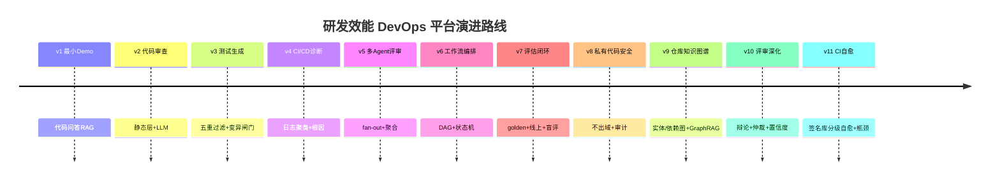
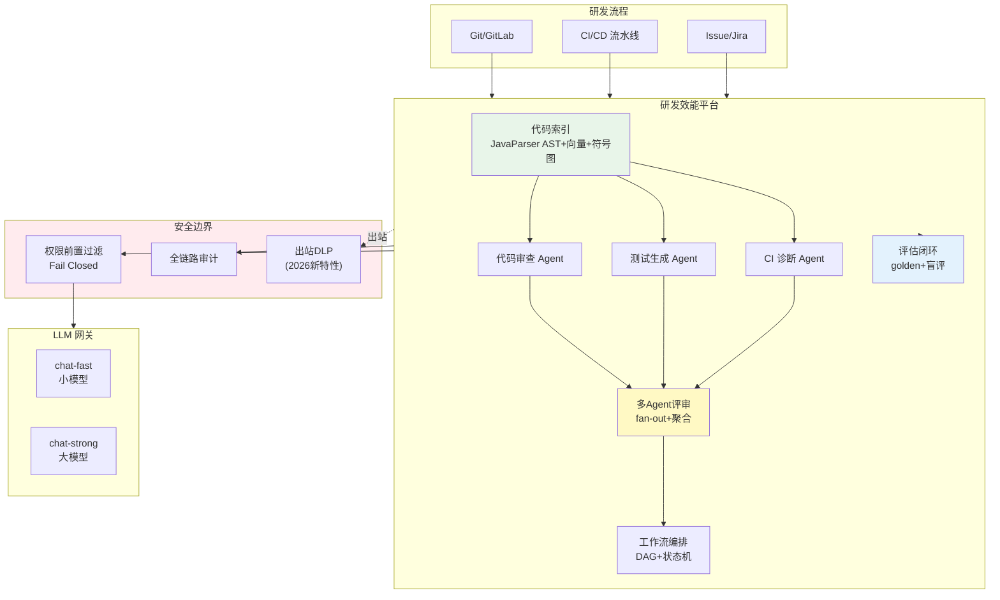

# 项目 12：研发效能 DevOps 平台 — 00-需求分析与架构设计

> **定位**：某中大型软件企业的研发效能 Agent 平台——代码库问答、代码审查、测试生成、CI/CD 诊断、多 Agent 评审流水线、评估闭环与私有代码安全。项目 12 是**完整独立**的项目，不依赖也不引用其他项目。**本项目的核心使命：把教程 03（工具）、09（多Agent）、36（工作流）、37（评估）、38（性能）、31（私有代码安全）在"研发流程智能化"场景落地。**
>
> 「遇到阻塞？→ [教程 03-工具调用]、[教程 09-多Agent协作]、[教程 36-Agent工作流编排]、[教程 37-自我反思与Agent评估]、[教程 31-安全与权限控制 §私有代码]」

---

## ★ 阅读顺序总览（序号 = 你的实际阅读顺序）

> 本子文件夹 15 个文件，**文件名编号 00-14 即阅读顺序**。按"全貌 → 起步 → 主体迭代 → 复盘 → 进阶迭代 → 决策资产 → 前沿"组织，每文件标注读者应在什么阶段读：

| 阶段 | 文件 | 读者定位 |
|------|------|---------|
| ① 全貌 | 00-需求分析与架构设计 | **先读**：业务痛点、目标架构、演进路线、ADR 预录、量化验收 |
| ② 起步 | 01-最小Demo搭建 | **动手**：跑通代码库 RAG 最小内核（AST 分块 + 混合检索） |
| ③ 主体迭代 | 02~08（迭代一~七，v2-v8） | **严格顺序**：代码审查 → 测试生成 → CI 诊断 → 多Agent评审 → 工作流 → 评估闭环 → 私有代码安全——每迭代先跑验收再进下一步 |
| ④ 复盘 | 09-核心代码讲解 | **回顾**：v1-v8 六个关键设计 + 完整代码清单 + 最易写错的五处 |
| ⑤ 进阶迭代 | 10~12（进阶一~三，v9-v11） | **继续演进**：仓库知识图谱（图+GraphRAG）→ 多Agent辩论共识（仲裁+置信度）→ CI 分级自愈（签名库+瓶颈分析） |
| ⑥ 决策资产 | 13-ADR架构决策记录 | **按需查阅**：35 条 ADR 汇编（上下文/备选/取舍/可回滚），读到相关迭代时回头翻 |
| ⑦ 前沿 | 14-工业前沿与演进方向 | **扩展**：2026 行业前沿（Google Bake-Off/AWS/Nebius）对照与 v12+ 演进路线，随时可看 |

> 按此顺序，读者从"知道平台长什么样"一路演进到"能对照行业前沿继续设计下一代"。项目独立：本子文件夹与项目 09/10/11 等互不依赖、互不引用。

---

## 1. 业务场景

### 1.1 背景

某企业研发团队 300 人、代码库 500+ 仓库（含 200 万行 Java 核心仓）、CI 每天跑 2000 次构建。现状：

| 痛点 | 数据 |
|------|------|
| **代码问答靠人肉** | 新人入职前 3 个月在问"这段逻辑在哪"，资深工程师被反复打扰 |
| **代码审查靠经验** | PR 审查靠人肉，漏掉架构/安全/性能问题，误报也常被忽略 |
| **测试覆盖不足** | 核心模块行覆盖率 < 40%，关键路径无回归保护 |
| **CI 失败诊断慢** | 构建/测试失败靠人翻日志，平均 20 分钟定位 |
| **私有代码安全** | 代码不能出域，但不知哪些涉密、谁在访问 |

### 1.2 项目目标

1. **代码库 RAG**：代码问答（"XX 服务怎么鉴权"），JavaParser AST 分块 + 混合检索
2. **代码审查 Agent**：PR 审查（架构/安全/性能/合规），hunk 级评论，误报率 < 5%
3. **测试生成 Agent**：单元测试生成 + 变异测试闸门 + draft PR 人工批准
4. **CI/CD 诊断**：构建/测试失败定位（日志聚类 + LLM 根因）
5. **多 Agent 评审流水线**：并行专业 Sub-Agent + 强聚合层（DAG 编排）
6. **评估闭环**：离线 golden 集 + 线上采纳/误报率 + LLM-judge 盲评 + 灰度对照
7. **私有代码安全**：代码不出域 + 权限前置过滤 + 全链路审计

### 1.3 非目标

- 不做 IDE 插件（消费 Git/CI 事件，Web 端呈现）
- 不做 AI 全自动合并（AI 钉死在"建议者"，不 auto-merge）
- 不做代码生成写生产代码（只做审查/测试/诊断，不直接改生产）

### 1.4 本节核对（业务痛点与目标）

| # | 核对项 | 判据 |
|---|--------|------|
| 1 | 痛点描述有量化指标 | 300 人 / 500+ 仓库 / 200 万行 Java / CI 2000 次·天，非空泛表述 |
| 2 | 七大目标与后续文件一一对应 | 代码RAG→[01]、审查→[02]、测试→[03]、CI诊断→[04]、多Agent→[05]、评估→[07]、私有安全→[08] |
| 3 | 非目标与"AI 建议者"边界一致 | 不 auto-merge / 不改生产 / 不做 IDE 插件，与 §3 架构的审计闸门吻合 |

## 2. 演进路线

> 核心纪律：**禁止一上来给最终版架构。** 每个迭代由真实痛点驱动，回答四问。



**顺序理由**：

| 顺序 | 决策理由 | 反面 |
|------|---------|------|
| 代码问答在审查前 | 代码索引是审查/测试/诊断的公共基础（AST 分块复用） | 先审查——没有代码索引，审查上下文拼不齐 |
| 静态层在 LLM 前 | "确定性优先、LLM 收尾"铁律：静态层先行过滤，LLM 语义收尾 | 先 LLM——纯 LLM 误报率超标（Copilot ~33%） |
| 测试生成在 CI 诊断前 | 测试生成的产物是 CI 诊断的输入（失败日志模式） | 先诊断——没有测试，诊断对象单一 |
| 多 Agent 在评估前 | 多 Agent 流水线需要评估闭环才能验证质量 | 先评估——单 Agent 评估够用，多 Agent 才需要复杂评估 |
| 私有代码安全最后 | 数据不出域是产品特性，前期用 dev 环境验证 | 先安全——功能未验证就上严格隔离，迭代慢 |

### 2.1 本节核对（演进路线 v1-v11）

| # | 核对项 | 判据 |
|---|--------|------|
| 1 | 演进由痛点驱动且落地迭代文件 | v2审查/静态层→[02]、v4诊断/日志聚类→[04]、v9图谱/GraphRAG→[10]，非空谈口号 |
| 2 | 顺序理由与后续文件实现顺序一致 | 代码索引（v1）在审查（v2）前、静态层在 LLM 前，符合 02 的二级流水线 |
| 3 | v1-v11 与 timeline 图一一对应 | 各里程碑文件名（00-14）映射无跳跃、无遗漏 |

## 3. 目标架构（主体迭代 v8 终态预览）



> 上图是 v1-v8 主体迭代的终态。进阶迭代在其上扩展三层：v9 在 IDX 旁加**仓库知识图谱**（`code_entity`/`code_edge` 实体/依赖图，[10](10-代码理解与仓库知识图谱.md)）、v10 把 MULTI 升级为**辩论 + 仲裁 + 置信度分级**（[11](11-多Agent评审深化.md)）、v11 给 CIX 加**签名库分级自愈与瓶颈分析**（[12](12-CICD自愈与瓶颈优化.md)）。

**AI 钉死在"建议者"**：所有自动化动作（重试/修复/开 PR/approve）必须人工审批闸门——这是全行业底线（MSR 2026：AI 审查 PR 合并率 45.2% vs 人工 68.4%）。

### 3.1 本节核对（目标架构与安全边界）

| # | 核对项 | 判据 |
|---|--------|------|
| 1 | 管控分离与安全边界表述一致 | 平台（执行）经 ACL 到 LLM、出站经 DLP，DLP 标"2026 新特性"，未脱离 v8 主体范围 |
| 2 | LLM 网关区分强弱模型 | chat-fast（小）/chat-strong（大）两路，与后续 [07 评估]的成本与路由设计呼应 |
| 3 | "AI 建议者"红线可读 | auto-merge / 改生产被 ACL+审计闸门约束，与 §1.3 非目标一致 |

## 4. 关键 ADR（预录）

| # | 决策 | 理由 |
|---|------|------|
| ADR-701 | 代码库 RAG 用 JavaParser AST 分块 + 三路混合检索（向量+符号+FTS） | 代码 RAG 是"解析问题非检索问题"；AST 分块 Recall@5 +4.3（cAST 论文） |
| ADR-702 | 审查两级流水线：静态层硬门禁 + LLM 语义层 | SAST+LLM 混合 F1 0.91-0.95 vs 纯 LLM 0.61-0.68；LLM 输出锁"建议"态 |
| ADR-703 | 测试用变异测试闸门（非行覆盖率） | 行覆盖率可被 AI 刷分（92% 编译但只杀 58-62% 变异 vs 人类 78%） |
| ADR-704 | 多 Agent 评审 = fan-out + 强聚合（聚合 Agent 禁止重审） | 对撕式重审实证性降低 precision |
| ADR-705 | AI 永不 auto-merge，全部人工审批 | AI 审查合并率低 23pp；建议者定位是底线 |

### 4.1 本节核对（预录 ADR 701-705）

| # | 核对项 | 判据 |
|---|--------|------|
| 1 | ADR 编号段与 13-ADR 总账衔接 | 701-705 与 [13-ADR架构决策记录] 的 700+ 号段首尾一致、不冲突 |
| 2 | 每条 ADR 有理由（管线 vs 数据） | 管线型（分级/流水线/评审模式）给出数据依据（Recall+4.3、F1 0.91-0.95） |
| 3 | ADR-705 与非目标红线一致 | 永不 auto-merge 与 §1.3/§3 的"建议者"定位自洽 |

## 5. 技术栈与依赖

基线：Spring Boot 4.1 + Spring AI 2.0 + WebFlux + Java 21。代码索引 pgvector + HNSW + FTS；GitLab/GitHub webhook 集成；CI 消费 Jenkins/GitLab CI API。各迭代新依赖按规范标注。

### 5.1 工程基线 `pom.xml`（完整可手写，一行不省略）

```xml
<?xml version="1.0" encoding="UTF-8"?>
<project xmlns="http://maven.apache.org/POM/4.0.0"
         xmlns:xsi="http://www.w3.org/2001/XMLSchema-instance"
         xsi:schemaLocation="http://maven.apache.org/POM/4.0.0 https://maven.apache.org/xsd/maven-4.0.0.xsd">
    <modelVersion>4.0.0</modelVersion>
    <parent>
        <groupId>org.springframework.boot</groupId>
        <artifactId>spring-boot-starter-parent</artifactId>
        <version>4.1.0</version>
        <relativePath/>
    </parent>
    <groupId>com.rd</groupId>
    <artifactId>devops-platform</artifactId>
    <version>0.1.0</version>
    <name>devops-platform</name>

    <properties>
        <java.version>21</java.version>
    </properties>

    <dependencyManagement>
        <dependencies>
            <dependency>
                <groupId>org.springframework.ai</groupId>
                <artifactId>spring-ai-bom</artifactId>
                <version>2.0.0</version>
                <type>pom</type>
                <scope>import</scope>
            </dependency>
        </dependencies>
    </dependencyManagement>

    <dependencies>
        <dependency>
            <groupId>org.springframework.boot</groupId>
            <artifactId>spring-boot-starter-webflux</artifactId>
        </dependency>
        <dependency>
            <groupId>org.springframework.ai</groupId>
            <artifactId>spring-ai-starter-model-openai</artifactId>
        </dependency>
        <dependency>
            <groupId>org.projectlombok</groupId>
            <artifactId>lombok</artifactId>
            <optional>true</optional>
        </dependency>
        <dependency>
            <groupId>org.springframework.boot</groupId>
            <artifactId>spring-boot-starter-test</artifactId>
            <scope>test</scope>
        </dependency>
    </dependencies>
</project>
```

> 后续迭代追加依赖见各篇：v1 加 pgvector + JDBC + JavaParser（[01 §3.1]）；v7 加 actuator（[07 §3.1]）；v8 加 reactive Redis（可选，[08 §3.1]）。

### 5.2 本节测试与验证（工程基线可编译）

**前置条件**：JDK 21、Maven 已装；`DEEPSEEK_API_KEY` 环境变量可后续运行用（编译不需要）。

**材料——核对命令**：

```bash
mvn clean compile
```

**步骤与断言**：

| # | 操作 | 预期（PASS 判据） |
|---|------|------------------|
| 1 | 按 §5.1 手写 pom.xml 后执行材料命令 | `BUILD SUCCESS`，无编译错误 |
| 2 | 核对 pom | parent 为 spring-boot-starter-parent 4.1.0；spring-ai-bom 2.0.0 以 `import` 进 dependencyManagement；含 webflux（非 MVC）与 spring-ai-starter-model-openai |
| 3 | 核对 java.version | `<java.version>21</java.version>` 与 JDK 21 一致 |

**失败排查**：①依赖解析失败→BOM 版本或仓库镜像配置问题，核对 `<spring-ai.version>2.0.0</spring-ai.version>`（本基线以 dependencyManagement 方式声明）；②`invalid target release: 21`→本机 JDK 低于 21；③编译过但后续启动报 WebFlux 类缺失→误引了 starter-web（应引 webflux）。

## 6. 迭代与教程知识点对照

| 迭代 | 落地的教程知识 |
|------|---------------|
| 01 代码问答 | [教程 05-RAG检索增强生成]、[附录 01-LLM基础理论/01-Embedding原理] |
| 02 代码审查 | [教程 31-安全与权限控制 §SAST]、[教程 37-自我反思与Agent评估 §误报] |
| 03 测试生成 | [教程 04-记忆与会话管理]、[教程 37-自我反思与Agent评估 §质量闸门] |
| 04 CI 诊断 | [教程 22-全链路可观测性 §日志]、[教程 30-容错与弹性设计 §重试] |
| 05 多 Agent 评审 | [教程 09-多Agent协作]、[教程 36-Agent工作流编排] |
| 06 工作流编排 | [教程 36-Agent工作流编排 全篇]、[教程 12-Agent状态管理] |
| 07 评估闭环 | [教程 37-自我反思与Agent评估 全篇]、[附录 04-测试策略/02-Eval评估] |
| 08 私有代码安全 | [教程 31-安全与权限控制 §数据不出域]、[附录 09-Agent安全深度] |
| 09 仓库知识图谱（v9，[10](10-代码理解与仓库知识图谱.md)） | [教程 35-高级RAG与AgenticRAG §GraphRAG]、[附录 11-知识图谱工程] |
| 10 评审深化（v10，[11](11-多Agent评审深化.md)） | [教程 09-多Agent协作 §协作模式]、[教程 37-自我反思与Agent评估 §评估指标体系] |
| 11 CI 自愈（v11，[12](12-CICD自愈与瓶颈优化.md)） | [教程 28-Human-in-the-Loop与审批流 §风险分级]、[教程 30-容错与弹性设计 §熔断] |

### 6.1 本节核对（迭代与教程映射）

| # | 核对项 | 判据 |
|---|--------|------|
| 1 | 每个迭代锚定 ≥1 个教程知识点 | 01-11 每行均有 [教程 XX-XXX] 引用，无空映射 |
| 2 | 知识领域与迭代主题匹配 | 09图谱↔[教程35 GraphRAG]、10评审↔多Agent、11自愈↔熔断/审批，非错配 |

## 7. 下一步

→ [01-最小Demo搭建.md](01-最小Demo搭建.md) — 不是 Git 的复刻，而是把代码库索引 + 问答跑通的最小内核。

---

## 8. 代码使用说明（照抄前必读）

> 本节核对（一句话）：六条代码规范（框架 API 真实 / 完整可手写 / 虚构 API 已修复 / 依赖标注 / WebFlux 铁律 / 演进阅读）在 01-08、10-12 每篇迭代文档中均被遵守，抽查任一篇发现违反即 FAIL。

本项目的代码遵循「项目文档不生成 .java 文件、代码由用户手写」的规范，因此：

1. **框架 API 全部真实**：Spring AI 2.0.0 的 `ChatClient`/`@Tool`/`CallAdvisor`/`ChatMemory` 等均按 [附录 05-SpringAI2-API基准] 的真实签名书写，可照抄编译。
2. **完整可手写代码**：自本版起，代码承载篇（01-08、10-12）给出的 Java 类**含全部 import、无 `...` 省略**，可整段照抄编译；自定义业务类（`JavaChunkIndexer`、`ReviewAggregator`、`WorkflowEngine`、`MutationGate`、`RepoGraphIndexer`、`DebateOrchestrator`、`SelfHealingService` 等）为项目专属，文档给出完整类与设计意图，业务细节按注释思路微调即可。
3. **虚构 API 已修复**：`entity(TypeReference)` → 真实 `ParameterizedTypeReference`（[附录 05-02 §2]）；无 `@ToolMethod`，全部 `@Tool` + `@ToolParam`；Advisor 只用 `CallAdvisor/StreamAdvisor`；HITL 落点在 `ToolCallingManager` 装饰器（非 Advisor）。
4. **依赖标注**：凡引入 pom.xml 未声明的新依赖，均标注「需在 pom.xml 中添加依赖」并给出完整 `<dependency>` 片段；基线 pom 见 §5.1。
5. **WebFlux 一致性**：所有代码遵循响应式铁律（Reactor Context 传请求上下文、禁 ThreadLocal、EventLoop 上禁 block、Redis 用 ReactiveRedisTemplate）。
6. **演进式阅读**：每个迭代篇都从"上一版痛点"出发，回答"新增需求→影响模块→架构演进"四问，请按 `00 → 01 → 02 → ...` 顺序阅读，不要跳读最终版。
