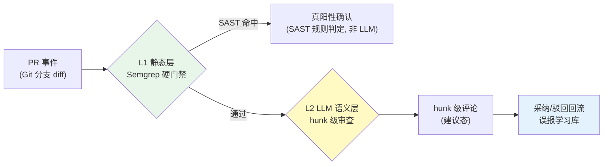

# 项目 12：研发效能 DevOps 平台 — 02-代码审查 Agent

> **定位**：把 PR 审查从"人肉 + 漏检"升级为"静态层硬门禁 + LLM 语义层"的两级流水线——确定性检查先行，LLM 只做语义审查并输出 hunk 级"建议"（误报率 < 5%）。教程 04-企业级架构主干/02-全链路可观测性 §SAST + 教程 05-Observation可观测/04-自定义Convention与Filter：工业标签与脱敏 §误报的落地。本文给出**完整可手写代码**（一行不省略，含全部 import）。
>
> **读者画像**：已完成 [01-最小Demo搭建](01-最小Demo搭建.md) 的代码索引。
>
> 「遇到阻塞？→ [教程 04-企业级架构主干/11-安全与权限控制 §SAST 与 LLM 结合]、[教程 08-架构师进阶/03-自我反思与Agent评估 §误报率]；API 真实性以 [附录 05-SpringAI2-API基准] 为准」

---

## 1. 四问

| 问 | 答 |
|----|----|
| **新增了什么需求** | PR 事件接入（Git 本地分支 diff）；L1 静态层硬门禁（Semgrep）；L2 LLM 语义审查（hunk 级建议）；误报学习库（人工驳回回流） |
| **影响了哪些模块** | 新增 review 包（PrContext/GitApi/SemgrepRunner/ReviewAgent/FalsePositiveLibrary）；复用 v1 代码索引（SymbolGraph 提取改动方法） |
| **架构如何演进** | 单 Agent 审查：Controller → L1 静态层 → L2 LLM 语义层 → 误报学习库 |
| **上一版痛点是什么** | 人肉审查漏检；纯 LLM 误报率高（~33%）；评论不可采纳（file 级泛泛） |

### 1.1 本节核对（四问口径）

| # | 核对项 | 判据 |
|---|--------|------|
| 1 | 四问齐全且痛点承接 | 新增需求/影响模块/架构演进/上一版痛点四行均有；痛点（人肉漏检、LLM 误报33%）与 v1 末尾痛点一致 |
| 2 | 架构链可落地 | `Controller → L1 静态Agent → L2 LLM 语义Agent → 误报学习库` 五个环节在 §3 均有完整类 |
| 3 | 复用关系明确 | SymbolGraph 复用 v1 代码索引，与 [01 §前言] "代码索引是公共基础"一致 |

## 2. 两级审查流水线



**SAST + LLM 结合**（[调研 研发效能 2026 §代码审查]）：混合框架 F1 0.91-0.95 vs 纯 SAST 0.10-0.55 vs 纯 LLM 0.61-0.68。**关键红线：禁止 LLM 自动 suppression 真阳性**——LLM 过滤 SAST 误报时会系统性误杀真漏洞（CWE-327 弱密码学漏判率 77%）。L1 命中的处置由 SAST 规则判定，不交给 LLM。

### 2.1 本节核对（流水线分工与红线）

| # | 核对项 | 判据 |
|---|--------|------|
| 1 | L1/L2 分工清晰 | L1 确定性 Semgrep 硬门禁（零 LLM）→ L2 LLM 语义（hunk 级建议态），图中分支与 §3.6/§3.8 类对应 |
| 2 | 红线可读 | "禁止 LLM suppression 真阳性"在 §3.6 StaticFinding、§3.7 编排均有体现（L1 命中由 SAST 判定，不喂 LLM） |

## 3. 完整代码（照抄即可）

### 3.1 `pom.xml` 追加依赖（Semgrep 为外部 CLI，无 Java 依赖；如需 JSON 解析确认 jackson）

```xml
        <!-- 追加（v2）：无新 Maven 依赖。Semgrep 作为本地 CLI 由 ProcessBuilder 调用。
             解析其 --json 输出依赖 jackson（spring-boot-starter-webflux 已传递引入）。 -->
```

> Semgrep 安装：`pip install semgrep` 或 `brew install semgrep`。L1 静态层是**确定性检查**，零 LLM。

### 3.2 `application.yml` 追加

```yaml
gitlab:
  base-url: ${GITLAB_BASE_URL:https://gitlab.example.com}
  token: ${GITLAB_TOKEN:}
repo:
  local-root: ${REPO_ROOT:/work/core-repo}    # 本地 Git 工作副本根
```

### 3.3 `Diff.java` + `PrContext.java`（差异分析与上下文）

```java
package com.rd.devops.review;

import java.util.List;

/** PR 差异：按文件拆分的 hunk。 */
public record Diff(List<ChangedFile> changedFiles) {

    /** 单个变更文件：path + unified diff hunk 文本。 */
    public record ChangedFile(String path, String diffHunk) {}
}
```

```java
package com.rd.devops.review;

/** 审查上下文：增量 diff + 定向拉取改动方法（勿整仓喂 LLM，[调研 §上下文策略]）。 */
public record PrContext(
        String repo,
        int prNumber,
        Diff diff,
        List<String> changedMethods) {

    /** 转成 LLM 提示：只含改动 hunk + 改动方法符号。 */
    public String toPrompt() {
        StringBuilder sb = new StringBuilder();
        sb.append("仓库: ").append(repo).append("  PR #").append(prNumber).append("\n\n");
        for (Diff.ChangedFile f : diff.changedFiles()) {
            sb.append("### ").append(f.path()).append("\n```diff\n")
              .append(f.diffHunk()).append("\n```\n\n");
        }
        sb.append("改动方法: ").append(changedMethods).append("\n");
        return sb.toString();
    }
}
```

### 3.4 `GitApi.java` + `LocalGitApi.java`（PR 接入）

```java
package com.rd.devops.review;

/** 抽象 Git 访问——提供者可替换（本地 Git / GitLab API），消费者只依赖本端口。 */
public interface GitApi {
    Diff getDiff(String repo, int prNumber);
}
```

```java
package com.rd.devops.review;

import org.springframework.beans.factory.annotation.Value;
import org.springframework.stereotype.Component;

import java.io.IOException;
import java.nio.charset.StandardCharsets;
import java.util.ArrayList;
import java.util.List;

/** 本地 Git 实现：假设每个仓库是本地工作副本，pr-N 为评审分支（demo 简化；生产接 GitLab/GitHub API）。 */
@Component
public class LocalGitApi implements GitApi {

    @Value("${repo.local-root:/work/core-repo}")
    private String localRoot;

    @Override
    public Diff getDiff(String repo, int prNumber) {
        String base = git(repo, "merge-base", "main", "refs/heads/pr-" + prNumber);
        List<String> names = splitLines(git(repo, "diff", "--name-only", base, "refs/heads/pr-" + prNumber));
        List<Diff.ChangedFile> files = new ArrayList<>();
        for (String name : names) {
            if (!name.endsWith(".java")) {
                continue;
            }
            String hunk = git(repo, "diff", "--unified=5", base, "refs/heads/pr-" + prNumber, "--", name);
            files.add(new Diff.ChangedFile(name, hunk));
        }
        return new Diff(files);
    }

    private String git(String repo, String... args) {
        List<String> cmd = new ArrayList<>(List.of("git", "-C", localRoot + "/" + repo));
        cmd.addAll(List.of(args));
        try {
            Process p = new ProcessBuilder(cmd).start();
            String out = new String(p.getInputStream().readAllBytes(), StandardCharsets.UTF_8);
            int exit = p.waitFor();
            if (exit != 0) {
                throw new IllegalStateException("git 失败: " + String.join(" ", cmd));
            }
            return out;
        } catch (IOException | InterruptedException e) {
            throw new IllegalStateException("git 执行失败", e);
        }
    }

    private List<String> splitLines(String s) {
        return s.isBlank() ? List.of() : List.of(s.split("\n"));
    }
}
```

### 3.5 `SymbolGraph.java`（复用 v1 索引：提取改动方法）

```java
package com.rd.devops.index;

import com.github.javaparser.JavaParser;
import com.github.javaparser.ast.CompilationUnit;
import com.github.javaparser.ast.body.MethodDeclaration;
import com.rd.devops.review.Diff;
import org.springframework.beans.factory.annotation.Value;
import org.springframework.stereotype.Component;

import java.io.IOException;
import java.nio.file.Path;
import java.util.List;

/** v1 索引的符号图：从改动文件里提取方法签名，供 L2 定向审查（数据流切片，不把整个文件喂 LLM）。 */
@Component
public class SymbolGraph {

    @Value("${repo.local-root:/work/core-repo}")
    private String localRoot;

    public List<String> extractChangedMethods(Diff diff) {
        return diff.changedFiles().stream()
                .flatMap(f -> methodsOf(f.path()).stream())
                .distinct()
                .toList();
    }

    private List<String> methodsOf(String javaFilePath) {
        try {
            CompilationUnit cu = new JavaParser().parse(Path.of(localRoot, javaFilePath)).getResult()
                    .orElseThrow(() -> new IllegalArgumentException("解析失败: " + javaFilePath));
            return cu.findAll(MethodDeclaration.class).stream()
                    .map(m -> m.getNameAsString() + "(" + m.getParameters().size() + ")")
                    .toList();
        } catch (IOException e) {
            return List.of();   // 改动文件可能不在本地（如重命名/删除），跳过
        }
    }
}
```

### 3.6 `StaticFinding.java` + `SemgrepRunner.java`（L1 静态层硬门禁）

```java
package com.rd.devops.review;

/** 静态层确定性发现——由 SAST 规则判定，非 LLM 判定（红线：禁止 LLM suppression 真阳性）。 */
public record StaticFinding(
        String ruleId,
        String severity,    // ERROR / WARNING / INFO
        String file,
        int line,
        String message) {}
```

```java
package com.rd.devops.review;

import com.fasterxml.jackson.databind.JsonNode;
import com.fasterxml.jackson.databind.ObjectMapper;
import org.springframework.stereotype.Component;

import java.io.IOException;
import java.nio.charset.StandardCharsets;
import java.util.ArrayList;
import java.util.List;

/** Semgrep 静态扫描：解析真实 --json 输出（results[].check_id/path/start.line/extra.message）。 */
@Component
public class SemgrepRunner {

    private final ObjectMapper objectMapper = new ObjectMapper();

    public List<StaticFinding> run(PrContext ctx) {
        List<String> cmd = new ArrayList<>(List.of("semgrep", "--config=auto", "--json"));
        ctx.diff().changedFiles().forEach(f -> cmd.add(f.path()));
        try {
            Process p = new ProcessBuilder(cmd).start();
            String json = new String(p.getInputStream().readAllBytes(), StandardCharsets.UTF_8);
            return parse(json);
        } catch (IOException e) {
            throw new IllegalStateException("Semgrep 执行失败", e);
        }
    }

    private List<StaticFinding> parse(String json) throws IOException {
        List<StaticFinding> findings = new ArrayList<>();
        JsonNode results = objectMapper.readTree(json).path("results");
        for (JsonNode r : results) {
            findings.add(new StaticFinding(
                    r.path("check_id").asText(),
                    r.path("extra").path("severity").asText("WARNING"),
                    r.path("path").asText(),
                    r.path("start").path("line").asInt(0),
                    r.path("extra").path("message").asText()));
        }
        return findings;
    }
}
```

### 3.7 `StaticAnalysisService.java`（L1 编排）

```java
package com.rd.devops.review;

import org.springframework.stereotype.Service;

import java.util.List;

@Service
public class StaticAnalysisService {

    private final SemgrepRunner semgrep;

    public StaticAnalysisService(SemgrepRunner semgrep) {
        this.semgrep = semgrep;
    }

    /** L1 硬门禁：确定性扫描，零 LLM。命中进入"真阳性确认"队列（由 SAST 规则判定）。 */
    public List<StaticFinding> runL1(PrContext ctx) {
        return semgrep.run(ctx);
    }
}
```

### 3.8 `ReviewComment.java` + `ReviewAgent.java`（L2 LLM 语义审查）

```java
package com.rd.devops.review;

/** hunk 级审查评论（建议态，不 auto-merge）。comment_id 由 ReviewAgent 生成，用于采纳/驳回回流。 */
public record ReviewComment(
        String id,
        String file,
        int line,
        String severity,     // critical / major / minor
        String category,     // 架构 / 安全 / 性能 / 可维护性 / 正确性
        String message,
        double confidence) {}
```

```java
package com.rd.devops.review;

import org.springframework.ai.chat.client.ChatClient;
import org.springframework.core.ParameterizedTypeReference;
import org.springframework.stereotype.Service;
import reactor.core.publisher.Mono;
import reactor.core.scheduler.Schedulers;

import java.util.List;
import java.util.UUID;

@Service
public class ReviewAgent {

    private final ChatClient chatClient;
    private final FalsePositiveLibrary fpLibrary;

    public ReviewAgent(ChatClient chatClient, FalsePositiveLibrary fpLibrary) {
        this.chatClient = chatClient;
        this.fpLibrary = fpLibrary;
    }

    /** L2 语义审查：输出 hunk 级评论 JSON 数组（泛型容器用 ParameterizedTypeReference，[附录 05-02 §2]）。 */
    public Mono<List<ReviewComment>> semanticReview(PrContext ctx) {
        return Mono.fromCallable(() -> chatClient.prompt()
                .system(systemPrompt())
                .user(ctx.toPrompt() + "\n\n负面样例（避免重蹈覆辙）：\n" + fpLibrary.negativeExamples())
                .call()
                .entity(new ParameterizedTypeReference<List<ReviewComment>>() {}))
            .subscribeOn(Schedulers.boundedElastic())
            .map(this::attachIds);
    }

    private List<ReviewComment> attachIds(List<ReviewComment> comments) {
        return comments.stream()
                .map(c -> new ReviewComment(UUID.randomUUID().toString(),
                        c.file(), c.line(), c.severity(), c.category(), c.message(), c.confidence()))
                .toList();
    }

    private String systemPrompt() {
        return """
                你是资深代码审查工程师。审查给定 PR 的改动，输出 hunk 级评论 JSON 数组。
                字段: file, line, severity(critical/major/minor), category(架构/安全/性能/可维护性/正确性), message, confidence(0-1)。
                规则：
                - 只评论有依据的问题，宁可少报不误报（误报率是生死线）
                - 输出"建议"态，不擅自修改代码
                - 安全类问题必须基于 SAST 结果交叉确认
                """;
    }
}
```

### 3.9 `FalsePositiveLibrary.java` + `ReviewFeedbackService.java`（误报学习库）

```java
package com.rd.devops.review;

import org.springframework.stereotype.Component;

import java.util.List;
import java.util.concurrent.CopyOnWriteArrayList;

/** 误报学习库：人工驳回的评论回流为 few-shot 负面样例，后续 Prompt 抑制同类误报。 */
@Component
public class FalsePositiveLibrary {

    private final List<NegativeExample> negatives = new CopyOnWriteArrayList<>();

    public void record(String commentId, String reason) {
        negatives.add(new NegativeExample(commentId, reason));
    }

    /** 最近至多 5 条负样例，作为 few-shot 注入。 */
    public String negativeExamples() {
        if (negatives.isEmpty()) {
            return "（暂无）";
        }
        StringBuilder sb = new StringBuilder();
        int shown = 0;
        for (int i = negatives.size() - 1; i >= 0 && shown < 5; i--, shown++) {
            sb.append("- 被驳回: ").append(negatives.get(i).reason()).append("\n");
        }
        return sb.toString();
    }

    public record NegativeExample(String commentId, String reason) {}
}
```

```java
package com.rd.devops.review;

import org.springframework.stereotype.Service;

@Service
public class ReviewFeedbackService {

    private final FalsePositiveLibrary fpLibrary;

    public ReviewFeedbackService(FalsePositiveLibrary fpLibrary) {
        this.fpLibrary = fpLibrary;
    }

    /** 每条评论带 comment_id 持久化采纳/驳回；驳回回流负样例（dismissed 必填原因）。 */
    public void recordFeedback(String commentId, boolean accepted, String reason) {
        if (commentId == null || commentId.isBlank()) {
            throw new IllegalArgumentException("comment_id 必填");
        }
        if (!accepted) {
            fpLibrary.record(commentId, reason == null || reason.isBlank() ? "未提供原因" : reason);
        }
    }
}
```

### 3.10 `ReviewController.java`（编排入口）

```java
package com.rd.devops.web;

import com.rd.devops.review.Diff;
import com.rd.devops.review.GitApi;
import com.rd.devops.review.PrContext;
import com.rd.devops.review.ReviewAgent;
import com.rd.devops.review.ReviewComment;
import com.rd.devops.review.ReviewFeedbackService;
import com.rd.devops.review.StaticAnalysisService;
import com.rd.devops.review.StaticFinding;
import com.rd.devops.index.SymbolGraph;
import org.springframework.web.bind.annotation.PathVariable;
import org.springframework.web.bind.annotation.PostMapping;
import org.springframework.web.bind.annotation.RequestBody;
import org.springframework.web.bind.annotation.RequestMapping;
import org.springframework.web.bind.annotation.RestController;
import reactor.core.publisher.Mono;
import reactor.core.scheduler.Schedulers;

import java.util.List;

@RestController
@RequestMapping("/api/v1/review")
public class ReviewController {

    private final GitApi gitApi;
    private final SymbolGraph symbolGraph;
    private final StaticAnalysisService staticService;
    private final ReviewAgent reviewAgent;
    private final ReviewFeedbackService feedbackService;

    public ReviewController(GitApi gitApi,
                            SymbolGraph symbolGraph,
                            StaticAnalysisService staticService,
                            ReviewAgent reviewAgent,
                            ReviewFeedbackService feedbackService) {
        this.gitApi = gitApi;
        this.symbolGraph = symbolGraph;
        this.staticService = staticService;
        this.reviewAgent = reviewAgent;
        this.feedbackService = feedbackService;
    }

    @PostMapping("/{repo}/{pr}")
    public Mono<ReviewResult> review(@PathVariable String repo, @PathVariable int pr) {
        // diff/符号提取/静态扫描均为阻塞（git/文件），整体放 boundedElastic，EventLoop 不 block
        Mono<PrContext> ctxMono = Mono.fromCallable(() -> {
            Diff diff = gitApi.getDiff(repo, pr);
            return new PrContext(repo, pr, diff, symbolGraph.extractChangedMethods(diff));
        }).subscribeOn(Schedulers.boundedElastic());
        return ctxMono.flatMap(ctx -> {
            Mono<List<StaticFinding>> l1 = Mono.fromCallable(() -> staticService.runL1(ctx))
                    .subscribeOn(Schedulers.boundedElastic());
            Mono<List<ReviewComment>> l2 = reviewAgent.semanticReview(ctx);
            return l1.zipWith(l2, ReviewResult::new);
        });
    }

    @PostMapping("/feedback")
    public void feedback(@RequestBody ReviewFeedbackRequest req) {
        feedbackService.recordFeedback(req.commentId(), req.accepted(), req.reason());
    }

    public record ReviewResult(List<StaticFinding> staticFindings, List<ReviewComment> comments) {}

    public record ReviewFeedbackRequest(String commentId, boolean accepted, String reason) {}
}
```

### 3.11 审查过程可见（改了哪些文件、判了什么）

> 过程可见性是工业级标配。代码审查 Agent 的信任来自"每次审查看得见"——审了哪些文件、命中什么规则、误报剔除过程。审查 emit 审查事件：`{reviewId, file, 问题[规则,严重度,行号], 判真/剔除}`。开发者看到"XX.java 命中 2 条高危规则→自动修复→复评通过"的完整轨迹，而非只给一个"有问题"。

### 3.12 本节测试与验证（L1 静态门禁 + L2 语义审查 + 误报回流）

**前置条件**：Semgrep 已装（`semgrep --version` 可执行）；Git 本地工作副本在 `REPO_ROOT` 下且有 `pr-N` 分支相对 `main` 有 Java 改动；`DEEPSEEK_API_KEY`、`GITLAB_TOKEN` 已设置；服务按 §3.1-§3.10 照抄并启动。

**材料 A——网关外核对命令（正文 §3.4/§3.6 同款）**：

```sh
# 在 REPO_ROOT/core-repo 下验证 LocalGitApi 期望的分支差异可被 git 取出
git -C $REPO_ROOT/core-repo merge-base main refs/heads/pr-101
git -C $REPO_ROOT/core-repo diff --name-only origin/main refs/heads/pr-101
# L1 静态层等价命令（SemgrepRunner 内部即该 CLI）
semgrep --config=auto --json src/ChangeMe.java
```

**材料 B——HTTP 审查与反馈**：

```sh
curl -s -X POST http://localhost:8081/api/v1/review/core/101
curl -s -X POST http://localhost:8081/api/v1/review/feedback \
  -H "Content-Type: application/json" \
  -d '{"commentId":"<L2返回的comment_id>","accepted":false,"reason":"该模式是既有约定回调，非误用"}'
```

**步骤与断言**：

| # | 操作 | 预期（PASS 判据） |
|---|------|------------------|
| 1 | 材料 A 三行 | merge-base/diff 均正常返回，能取出 pr-101 相对 main 的 Java diff；semgrep 输出合法 JSON（`results` 数组） |
| 2 | 材料 B 审查 POST | 返回 `ReviewResult` JSON：含 `staticFindings`（L1 命中规则/severity/行号）与 `comments`（hunk 级，含 file/line/severity/category/confidence） |
| 3 | L1 零 LLM | staticFindings 来自 Semgrep CLI 解析，无 LLM 调用日志（L1 确定性硬门禁） |
| 4 | hunk 级定位 | comments 每条均有 file + line（非 file 级泛泛），满足验收 3 |
| 5 | 建议态 | 无任何 auto-merge 动作，评论为纯建议 |
| 6 | 误报回流 | 材料 B feedback（accepted=false + reason）→ FalsePositiveLibrary 记录；下次同场景审查 Prompt 注入负样例 |
| 7 | 拉取隔离 | 改动方法抽取只取 hunk+符号（`changedMethods`），未整仓喂 LLM |

**失败排查**：①`CommandNotFoundException: semgrep`→未安装或不在 PATH；②审查返回 5xx→`LocalGitApi` merge-base 失败（分支不存在或 `repo.local-root` 配错）；③`staticFindings` 空但 semgrep 命令行有输出→`--config=auto` 网络拉取规则失败，改本地规则文件；④comments 数组反序列化失败→`ParameterizedTypeReference<List<ReviewComment>>` 字段名与 LLM 输出 JSON 不一致，核对 `toPrompt` 内 schema 字段名；⑤feedback 400→comment_id 为空，先取 L2 返回的 id。

## 4. 验收标准（量化）

| # | 验收项 | 标准 |
|---|--------|------|
| 1 | 误报率 | LLM 审查误报率 < 5%（人工回标统计，阿里上线门槛） |
| 2 | 真阳性不丢 | SAST 真阳性 100% 保留（LLM 不 suppression） |
| 3 | hunk 级 | 评论 100% 定位到 hunk（非 file 级泛泛） |
| 4 | 建议态 | 无 auto-merge；评论是建议非决策 |
| 5 | 学习闭环 | 驳回评论 100% 回流负样例 |

### 4.1 本节核对（验收口径）

| # | 核对项 | 判据 |
|---|--------|------|
| 1 | 验收项可度量 | 五项均含数值或可判定标准（误报率<5%、真阳性100%、hunk 100%、无 auto-merge、100% 回流），非空话 |
| 2 | 每项有代码落点 | 误报率→§3.8 ReviewAgent systemPrompt；真阳性保留→§3.6/§3.7 静态层；hunk→ReviewComment(file/line)；建议态→Controller 无 auto-merge；学习闭环→§3.9 误报学习库 |

## 5. 本迭代的 ADR

| # | 决策 | 理由 |
|---|------|------|
| ADR-706 | 静态层先行 + LLM 语义收尾 | SAST+LLM 混合 F1 0.91-0.95；纯 LLM 误报超标 |
| ADR-707 | 禁止 LLM 自动 suppression 真阳性 | LLM 过滤 SAST 误报会误杀真漏洞（CWE-327 漏 77%） |
| ADR-708 | hunk 级评论 + 误报学习库 | hunk 级采纳率高 5 倍；驳回回流压误报 |

### 5.1 本节核对（ADR 706-708 一致性）

| # | 核对项 | 判据 |
|---|--------|------|
| 1 | 每条 ADR 有代码落点 | 706→§3.7/§3.8 两段流水线；707→§3.6"由 SAST 规则判定"；708→§3.8 hunk 级 + §3.9 误报库 |
| 2 | 与 13-ADR 总账衔接 | ADR-706/707/708 在 [13-ADR架构决策记录] 存在，编号与 00 预录 705 衔接 |

## 6. v2 的痛点（驱动下一迭代）

审查能定位问题，但**测试覆盖不足暴露**：核心模块行覆盖率 < 40%，审查指出的问题没有回归测试保护。**需要测试生成 Agent**——自动生成单测 + 变异测试闸门。→ [03-测试生成Agent.md](03-测试生成Agent.md)

> 本节核对（一句话）：V2 痛点（行覆盖率<40%、无回归保护）与下一迭代 [03]"测试生成 + 变异闸门"方案一一对应，痛点不被搁置即 PASS。

---

## 7. 全篇回归验证

**回归断言**（§3.12 本节验证通过后，按 §4 验收表整体验收）：

| # | 操作 | 预期（PASS 判据） |
|---|------|------------------|
| 1 | 复跑 §3.12 材料（L1 静态门禁 + L2 语义审查） | SAST 真阳性 100% 保留（验收 2）；评论 100% 定位 hunk（验收 3） |
| 2 | 人工回标 100 条 LLM 审查评论 | 误报率 < 5%（验收 1）；无 auto-merge（验收 4） |
| 3 | 驳回评论回流负样例后重跑 | 学习闭环 100% 回流（验收 5），且下一轮误报率下降 |

**失败排查**：误报率不达标→`ReviewAgent` systemPrompt 的"宁缺勿错"指令或阈值未生效；hunk 级丢失→`ReviewComment(file,line)` 的 file/line 来自 diff hunk 而非整文件；真阳性被 suppression→`SemgrepRunner` 的 L1 结果被 LLM 层改写。

## 8. 验收对照

| 验收项 | 标准 | 状态 |
|--------|------|------|
| 误报率 | LLM 审查误报率 < 5%（§7 回归 2，人工回标） | ☐ |
| 真阳性不丢 | SAST 真阳性 100% 保留（§7 回归 1） | ☐ |
| hunk 级 | 评论 100% 定位到 hunk（§7 回归 1） | ☐ |
| 建议态 | 无 auto-merge，评论是建议非决策（§7 回归 2） | ☐ |
| 学习闭环 | 驳回评论 100% 回流负样例（§7 回归 3） | ☐ |

## 9. 总结

v2 把 PR 审查升级为两级流水线：`LocalGitApi` 定向拉取增量 diff + `SymbolGraph` 提取改动方法（上下文策略），`SemgrepRunner` 做 L1 确定性硬门禁（零 LLM、禁止 suppression 真阳性），`ReviewAgent` 用 `entity(ParameterizedTypeReference)` 输出 hunk 级建议评论，`FalsePositiveLibrary` 把人工驳回回流为负样例压误报。**修正了 v1 体系中"概念骨架"与虚构形态**：`entity(TypeReference)` → 真实 `ParameterizedTypeReference`；`recordFeedback` 落为完整类。

> 本节核对（一句话）：总结中六个组件（LocalGitApi、SymbolGraph、SemgrepRunner、ReviewAgent、FalsePositiveLibrary、entity 修正）分别对应正文 §3.4、§3.5、§3.6、§3.8、§3.9 与 API 校正，与正文一致即 PASS。
