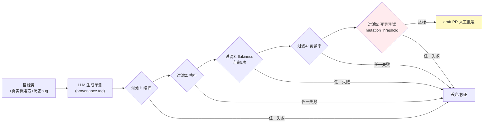

# 项目 12：研发效能 DevOps 平台 — 03-测试生成 Agent

> **定位**：把"核心模块行覆盖率 < 40%"变成"LLM 生成单测 + 五重过滤管线 + 变异测试闸门 + draft PR 人工批准"。Meta TestGen 范式的 Java 落地。本文给出**完整可手写代码**（一行不省略，含全部 import）。
>
> **读者画像**：已完成 [02-代码审查Agent](02-代码审查Agent.md)。
>
> 「遇到阻塞？→ [教程 08-架构师进阶/03-自我反思与Agent评估 §质量闸门]、[教程 00-基础与核心/04-记忆与会话管理]、[附录 04-测试策略/00-单元测试]；API 真实性以 [附录 05-SpringAI2-API基准] 为准」

---

## 1. 四问

| 问 | 答 |
|----|----|
| **新增了什么需求** | 单测生成 Agent；五重过滤（编译→执行→flakiness→覆盖率→变异）；变异测试闸门；draft PR 人工批准 |
| **影响了哪些模块** | 新增 testgen 包（TestGenAgent/CompilerService/TestRunnerService/FlakinessChecker/CoverageService/MutationGate/FilterPipeline/DraftPrService）；复用 v1 代码索引（拿"类的真实调用方 + 历史 bug"增强生成信号） |
| **架构如何演进** | 生成管线：Controller → TestGenAgent(LLM) → FilterPipeline(五重确定性过滤) → MutationGate → DraftPrService |
| **上一版痛点是什么** | 行覆盖率 < 40%，无回归保护；行覆盖率可被刷分；生成测试不可信 |

### 1.1 本节核对（四问口径）

| # | 核对项 | 判据 |
|---|--------|------|
| 1 | 四问齐全且痛点承接 | 新增需求/影响模块/架构演进/上一版痛点四行均有；痛点（行覆盖率<40%）与 [02] 末尾痛点一致 |
| 2 | 架构链可落地 | `Controller → TestGenAgent → FilterPipeline(五重) → MutationGate → DraftPrService` 各环节在 §3 均有完整类 |
| 3 | 复用关系明确 | codeIndex 复用 v1 索引增强生成信号，与 [01 §前言] 公共基础一致 |

## 2. 测试生成管线

> **为什么变异测试**（[调研 研发效能 2026 §测试生成]）：LLM 生成测试 92% 可编译但只杀死 58-62% 注入变异（人类 78%）——**行覆盖率是"可被 AI 刷分"的指标**，变异测试（PIT/Stryker）升格为质量闸门。



### 2.1 本节核对（五重过滤与变异升格）

| # | 核对项 | 判据 |
|---|--------|------|
| 1 | 五重过滤顺序正确 | 编译→执行→flakiness→覆盖率→变异，与 §3.8 FilterPipeline 依次调用顺序一致 |
| 2 | 变异测试立意可复述 | 行覆盖率可被 AI 刷分（92% 编译只杀 58-62% 变异 vs 人类 78%），故变异升格为闸门 |
| 3 | 任一失败即丢弃 | 图中 F1-F5 任一失败汇入 DROP，与 FilterPipeline 短路返回 TestVerdict.rejected 对应 |

## 3. 完整代码（照抄即可）

### 3.1 `pom.xml` 追加（JaCoCo 覆盖率 + PIT 变异测试插件）

```xml
    <!-- 追加（v3）：测试质量插件（不新增 Maven 依赖，JUnit 5 已随 spring-boot-starter-test） -->
    <build>
        <plugins>
            <plugin>
                <groupId>org.jacoco</groupId>
                <artifactId>jacoco-maven-plugin</artifactId>
                <version>0.8.12</version>
                <executions>
                    <execution>
                        <goals>
                            <goal>prepare-agent</goal>
                        </goals>
                    </execution>
                </executions>
            </plugin>
            <plugin>
                <groupId>org.pitest</groupId>
                <artifactId>pitest-maven</artifactId>
                <version>1.17.1</version>
                <configuration>
                    <outputFormats>
                        <outputFormat>XML</outputFormat>
                    </outputFormats>
                </configuration>
            </plugin>
        </plugins>
    </build>
```

### 3.2 `GeneratedTest.java` + `TestVerdict.java`

```java
package com.rd.devops.testgen;

import java.util.List;

/** 生成的单测：完整 JUnit 5 源码 + provenance tag（防 contract drift，可审计）。 */
public record GeneratedTest(
        String targetClass,       // 被测类
        String testClassName,     // 测试类全名（如 com.acme.OrderServiceTest）
        String sourceCode,        // 完整 JUnit 5 测试源码
        String provenance,        // 模型 + 时间戳 + prompt 指纹
        List<String> coveredMethods) {}
```

```java
package com.rd.devops.testgen;

/** 五重过滤裁决。 */
public record TestVerdict(boolean accepted, String reason) {

    public static TestVerdict accepted() {
        return new TestVerdict(true, "通过全部五重过滤");
    }

    public static TestVerdict rejected(String reason) {
        return new TestVerdict(false, reason);
    }
}
```

### 3.3 `TestGenAgent.java`（LLM 生成 + 上下文增强）

```java
package com.rd.devops.testgen;

import com.rd.devops.index.CodeIndexService;
import org.springframework.ai.chat.client.ChatClient;
import org.springframework.core.ParameterizedTypeReference;
import org.springframework.stereotype.Service;
import reactor.core.publisher.Mono;
import reactor.core.scheduler.Schedulers;

import java.util.List;

@Service
public class TestGenAgent {

    private final ChatClient chatClient;
    private final CodeIndexService codeIndex;

    public TestGenAgent(ChatClient chatClient, CodeIndexService codeIndex) {
        this.chatClient = chatClient;
        this.codeIndex = codeIndex;
    }

    /** 生成单测（带 provenance tag，防 contract drift）。 */
    public Mono<List<GeneratedTest>> generateTests(String qualifiedName) {
        return Mono.fromCallable(() -> chatClient.prompt()
                .system("""
                        你是资深 Java 测试工程师。为给定类生成 JUnit 5 单元测试。
                        规则：
                        1. 只生成测试，不修改被测类
                        2. 覆盖正常/边界/异常路径
                        3. 断言必须基于真实行为（禁止 tautology/假绿断言）
                        4. 不得改变被测类的行为契约（防 contract drift）
                        输出 JSON 数组，字段: targetClass, testClassName, sourceCode, provenance, coveredMethods。
                        """)
                .user("目标类: " + qualifiedName
                        + "\n源码: " + codeIndex.getSource(qualifiedName)
                        + "\n真实调用方: " + codeIndex.getCallers(qualifiedName)
                        + "\n历史 bug: " + codeIndex.getHistoricalBugs(qualifiedName))
                .call()
                .entity(new ParameterizedTypeReference<List<GeneratedTest>>() {}))   // 真实泛型容器（[附录 05-02 §2]）
            .subscribeOn(Schedulers.boundedElastic());
    }
}
```

### 3.4 `CodeIndexService.java`（v1 索引的查询服务：源码/调用方/历史 bug）

```java
package com.rd.devops.index;

import org.springframework.jdbc.core.simple.JdbcClient;
import org.springframework.stereotype.Service;

import java.util.List;

@Service
public class CodeIndexService {

    private final JdbcClient jdbcClient;

    public CodeIndexService(JdbcClient jdbcClient) {
        this.jdbcClient = jdbcClient;
    }

    /** 取类源码（body 拼接，供 LLM 生成上下文）。 */
    public String getSource(String qualifiedName) {
        return jdbcClient.sql("""
                SELECT string_agg(body, E'\n') AS source
                FROM code_chunk
                WHERE qualified_name LIKE :qn
                """)
                .param("qn", qualifiedName + "#%")
                .query(String.class)
                .optional()
                .orElse("（未索引到源码）");
    }

    /** 真实调用方（v1 无精确符号图，此处占位；v6 工作流篇换精确符号图）。 */
    public List<String> getCallers(String qualifiedName) {
        return List.of("（调用方依赖精确符号图，v6 补齐）");
    }

    /** 历史 bug（缺陷库接入为占位；生产接 Jira/Bugzilla）。 */
    public List<String> getHistoricalBugs(String qualifiedName) {
        return List.of("（历史 bug 依赖缺陷库接入，暂为空）");
    }
}
```

### 3.5 `CompilerService.java`（过滤 1：编译，完整类）

```java
package com.rd.devops.testgen;

import org.springframework.stereotype.Component;

import javax.tools.DiagnosticCollector;
import javax.tools.JavaCompiler;
import javax.tools.JavaFileObject;
import javax.tools.StandardJavaFileManager;
import javax.tools.ToolProvider;
import java.io.IOException;
import java.nio.charset.StandardCharsets;
import java.nio.file.Files;
import java.nio.file.Path;
import java.util.List;

@Component
public class CompilerService {

    private final JavaCompiler compiler = ToolProvider.getSystemJavaCompiler();

    /** 把生成的测试源码写到 sourceRoot 并编译，编译失败即拒绝。 */
    public boolean compiles(GeneratedTest test, Path sourceRoot, Path outputDir) {
        Path testFile = sourceRoot.resolve(test.testClassName().replace('.', '/') + ".java");
        try {
            Files.createDirectories(testFile.getParent());
            Files.writeString(testFile, test.sourceCode(), StandardCharsets.UTF_8);
        } catch (IOException e) {
            throw new IllegalStateException("写测试源失败", e);
        }
        DiagnosticCollector<JavaFileObject> diagnostics = new DiagnosticCollector<>();
        try (StandardJavaFileManager fm = compiler.getStandardFileManager(diagnostics, null, StandardCharsets.UTF_8)) {
            Iterable<? extends JavaFileObject> units = fm.getJavaFileObjects(testFile);
            List<String> options = List.of("-classpath", System.getProperty("java.class.path"),
                    "-d", outputDir.toString());
            return compiler.getTask(null, fm, diagnostics, options, null, units).call();
        } catch (IOException e) {
            throw new IllegalStateException("编译失败", e);
        }
    }
}
```

### 3.6 `TestRunnerService.java` + `FlakinessChecker.java`（过滤 2/3）

```java
package com.rd.devops.testgen;

import org.springframework.stereotype.Component;

import java.io.IOException;

@Component
public class TestRunnerService {

    /** 运行单个测试类（Surefire），通过返回 true。生产按需传仓库根。 */
    public boolean passes(String testClassName) {
        ProcessBuilder pb = new ProcessBuilder("mvn", "-q", "test",
                "-Dtest=" + testClassName, "-DfailIfNoTests=false");
        try {
            Process p = pb.start();
            return p.waitFor() == 0;
        } catch (IOException | InterruptedException e) {
            throw new IllegalStateException("测试执行失败", e);
        }
    }
}
```

```java
package com.rd.devops.testgen;

import org.springframework.stereotype.Component;

@Component
public class FlakinessChecker {

    private final TestRunnerService runner;

    public FlakinessChecker(TestRunnerService runner) {
        this.runner = runner;
    }

    /** 连跑 n 次，任一次失败即判定 flaky。 */
    public boolean isFlaky(String testClassName, int runs) {
        for (int i = 0; i < runs; i++) {
            if (!runner.passes(testClassName)) {
                return true;
            }
        }
        return false;
    }
}
```

### 3.7 `CoverageService.java` + `MutationGate.java`（过滤 4/5，完整类）

```java
package com.rd.devops.testgen;

import org.springframework.stereotype.Component;

import java.io.IOException;
import java.nio.file.Files;
import java.nio.file.Path;

@Component
public class CoverageService {

    /** 读 JaCoCo jacoco.csv（列: INSTRUCTION_MISSED, INSTRUCTION_COVERED）求行覆盖率。 */
    public double lineCoverage(Path jacocoCsv) {
        try {
            long[] sum = Files.lines(jacocoCsv)
                    .skip(1)
                    .map(line -> line.split(","))
                    .map(cols -> new long[]{Long.parseLong(cols[3]), Long.parseLong(cols[4])})
                    .reduce(new long[]{0, 0}, (a, b) -> new long[]{a[0] + b[0], a[1] + b[1]});
            return sum[0] + sum[1] == 0 ? 0.0 : sum[1] * 100.0 / (sum[0] + sum[1]);
        } catch (IOException e) {
            throw new IllegalStateException("读取 JaCoCo 报告失败", e);
        }
    }
}
```

```java
package com.rd.devops.testgen;

import org.springframework.stereotype.Component;

import java.io.IOException;
import java.nio.charset.StandardCharsets;
import java.nio.file.Files;
import java.nio.file.Path;
import java.util.List;
import java.util.Map;

/**
 * PIT 变异测试闸门：注入变异体，测试必须杀死 ≥ 阈值才通过。
 * 行覆盖率可刷分，变异测试不可刷（[调研 §变异升格]）。
 */
@Component
public class MutationGate {

    private final Map<String, Double> thresholds = Map.of(
            "payment", 0.85, "security", 0.85, "default", 0.65);

    public boolean passes(String className) {
        return mutationScore(className) >= thresholdFor(className);
    }

    public double mutationScore(String className) {
        List<String> cmd = List.of("mvn", "-q", "org.pitest:pitest-maven:mutationCoverage",
                "-DtargetClasses=" + className, "-DoutputFormats=XML");
        try {
            Process p = new ProcessBuilder(cmd).start();
            int exit = p.waitFor();
            if (exit != 0) {
                return 0.0;   // 无测试可杀变异 → 0
            }
            String xml = Files.readString(
                    Path.of("target/pit-reports/" + className.replace('.', '/') + "/mutations.xml"),
                    StandardCharsets.UTF_8);
            return killRate(xml);
        } catch (IOException | InterruptedException e) {
            throw new IllegalStateException("PIT 变异测试失败", e);
        }
    }

    private double killRate(String mutationsXml) {
        long killed = countOccurrences(mutationsXml, "status=\"KILLED\"");
        long total = countOccurrences(mutationsXml, "<mutation");
        return total == 0 ? 0.0 : killed * 1.0 / total;
    }

    private long countOccurrences(String text, String token) {
        int idx = 0, count = 0;
        while ((idx = text.indexOf(token, idx)) != -1) {
            count++;
            idx += token.length();
        }
        return count;
    }

    private double thresholdFor(String className) {
        return thresholds.entrySet().stream()
                .filter(e -> className.startsWith("com.rd." + e.getKey()))
                .map(Map.Entry::getValue)
                .findFirst()
                .orElseGet(() -> thresholds.get("default"));
    }
}
```

### 3.8 `FilterPipeline.java`（Meta 五重过滤，完整类）

```java
package com.rd.devops.testgen;

import org.springframework.stereotype.Component;

import java.nio.file.Path;

@Component
public class FilterPipeline {

    private static final double MIN_COVERAGE = 50.0;      // 行覆盖率 ≥ 50%

    private final CompilerService compiler;
    private final TestRunnerService runner;
    private final FlakinessChecker flakiness;
    private final CoverageService coverage;
    private final MutationGate mutationGate;

    public FilterPipeline(CompilerService compiler, TestRunnerService runner,
                          FlakinessChecker flakiness, CoverageService coverage,
                          MutationGate mutationGate) {
        this.compiler = compiler;
        this.runner = runner;
        this.flakiness = flakiness;
        this.coverage = coverage;
        this.mutationGate = mutationGate;
    }

    /** Meta 五重过滤（编译→执行→flakiness→覆盖率→变异），产物打 provenance tag。任一失败即拒。 */
    public TestVerdict filterPipeline(GeneratedTest test, Path sourceRoot, Path outputDir) {
        if (!compiler.compiles(test, sourceRoot, outputDir)) {
            return TestVerdict.rejected("编译失败");
        }
        if (!runner.passes(test.testClassName())) {
            return TestVerdict.rejected("执行失败");
        }
        if (flakiness.isFlaky(test.testClassName(), 5)) {
            return TestVerdict.rejected("flaky（连跑 5 次未全过）");
        }
        double cov = coverage.lineCoverage(outputDir.resolve("jacoco.csv"));
        if (cov < MIN_COVERAGE) {
            return TestVerdict.rejected("覆盖率不足: " + cov + "%");
        }
        if (!mutationGate.passes(test.targetClass())) {
            return TestVerdict.rejected("变异未达阈值（支付/安全 85%+，一般 60-70%）");
        }
        return TestVerdict.accepted();
    }
}
```

### 3.9 `DraftPrService.java`（draft PR 人工批准，完整类）

```java
package com.rd.devops.testgen;

import com.fasterxml.jackson.annotation.JsonProperty;
import org.springframework.beans.factory.annotation.Value;
import org.springframework.stereotype.Component;
import org.springframework.web.reactive.function.client.WebClient;
import reactor.core.publisher.Mono;

/** 把通过的测试开成 draft PR——AI 不直接进 CI，全部"机器生成 + 人工批准"。 */
@Component
public class DraftPrService {

    private final WebClient webClient;

    public DraftPrService(WebClient.Builder webClientBuilder,
                          @Value("${gitlab.base-url:https://gitlab.example.com}") String baseUrl) {
        this.webClient = webClientBuilder.baseUrl(baseUrl).build();
    }

    /** 开 draft PR 返回 Mono<Void>，随响应式链传播，EventLoop 不 block（WebFlux 铁律）。 */
    public Mono<Void> openDraftPr(String targetRepo, String branch, String title, String description) {
        String token = System.getenv("GITLAB_TOKEN");
        return webClient.post()
                .uri("/api/v4/projects/{repo}/merge_requests", targetRepo)
                .headers(h -> {
                    if (token != null) {
                        h.set("PRIVATE-TOKEN", token);
                    }
                })
                .bodyValue(new CreateMrRequest(branch, "main", title, description, true))
                .retrieve()
                .toBodilessEntity()
                .then();
    }

    public record CreateMrRequest(
            @JsonProperty("source_branch") String sourceBranch,
            @JsonProperty("target_branch") String targetBranch,
            String title,
            String description,
            boolean draft) {}
}
```

### 3.10 `TestGenController.java`

```java
package com.rd.devops.web;

import com.rd.devops.testgen.DraftPrService;
import com.rd.devops.testgen.FilterPipeline;
import com.rd.devops.testgen.GeneratedTest;
import com.rd.devops.testgen.TestGenAgent;
import com.rd.devops.testgen.TestVerdict;
import org.springframework.web.bind.annotation.PostMapping;
import org.springframework.web.bind.annotation.RequestBody;
import org.springframework.web.bind.annotation.RequestMapping;
import org.springframework.web.bind.annotation.RequestParam;
import org.springframework.web.bind.annotation.RestController;
import reactor.core.publisher.Mono;

import java.nio.file.Path;
import java.util.List;

@RestController
@RequestMapping("/api/v1/testgen")
public class TestGenController {

    private final TestGenAgent testGenAgent;
    private final FilterPipeline filterPipeline;
    private final DraftPrService draftPrService;

    public TestGenController(TestGenAgent testGenAgent,
                             FilterPipeline filterPipeline,
                             DraftPrService draftPrService) {
        this.testGenAgent = testGenAgent;
        this.filterPipeline = filterPipeline;
        this.draftPrService = draftPrService;
    }

    /** 生成 + 五重过滤（阻塞过滤在 boundedElastic 上执行，EventLoop 不 block）。 */
    @PostMapping
    public Mono<List<VerdictOutcome>> generateAndFilter(@RequestParam String qualifiedName) {
        return testGenAgent.generateTests(qualifiedName)
                .map(tests -> tests.stream()
                        .map(t -> new VerdictOutcome(t.testClassName(),
                                filterPipeline.filterPipeline(t, Path.of("src/test/java"), Path.of("target"))))
                        .toList());
    }

    @PostMapping("/draft")
    public Mono<Void> openDraft(@RequestBody DraftPrRequest req) {
        return draftPrService.openDraftPr(req.targetRepo(), "pr-testgen-" + req.feature(),
                "tests: " + req.feature(), req.description());
    }

    public record VerdictOutcome(String testClassName, TestVerdict verdict) {}

    public record DraftPrRequest(String targetRepo, String feature, String description) {}
}
```

### 3.11 本节测试与验证（生成、五重过滤与 draft PR 人工批准）

**前置条件**：可在工程根运行 `mvn test` 与 PIT 插件（§3.1 已配 jacoco 0.8.12 / pitest 1.17.1）；`DEEPSEEK_API_KEY`、`GITLAB_TOKEN` 已设置，GitLab 可达；被测类（如 `com.rd.payment.PaymentService`）已由 v1 索引进 `code_chunk`。

**材料 A——网关外核对命令（正文 §3.5-§3.7 同款）**：

```sh
mvn jacoco:report -q                       # 产出 target/jacoco.csv（CoverageService 读取）
mvn org.pitest:pitest-maven:mutationCoverage \
    -DtargetClasses=com.rd.payment.PaymentService -DoutputFormats=XML
```

**材料 B——生成与批准 HTTP**：

```sh
curl -s -X POST "http://localhost:8081/api/v1/testgen?qualifiedName=com.rd.payment.PaymentService"
curl -s -X POST http://localhost:8081/api/v1/testgen/draft \
  -H "Content-Type: application/json" \
  -d '{"targetRepo":"core","feature":"payment-tests","description":"LLM 生成单测，需人工批准"}'
```

**步骤与断言**：

| # | 操作 | 预期（PASS 判据） |
|---|------|------------------|
| 1 | 材料 B 生成 | 返回 `VerdictOutcome[]` JSON：每条含 testClassName 与 verdict（五重过滤裁决） |
| 2 | 过滤 1 编译 | `compiles` 编译成功（CompilerService），过滤失败则 verdict != accepted("编译失败") |
| 3 | 过滤 2/3 执行+flakiness | 测试连跑 5 次全过，无 flaky 判定；`isFlaky(...,5)` 返回 false |
| 4 | 过滤 4 覆盖率 | 材料 A 的 jacoco.csv 行覆盖率 ≥ 50%（MIN_COVERAGE），否则 rejected("覆盖率不足") |
| 5 | 过滤 5 变异 | PIT mutations.xml killRate ≥ 阈值（payment/security 85%、default 65%），MutationGate.passes 返回 true |
| 6 | provenance | 通过的 GeneratedTest 带 provenance（模型+时间戳+prompt 指纹），随类持久可审计 |
| 7 | 材料 B draft | 调用 GitLab API 开 draft PR（draft=true），无 auto-merge 动作 |
| 8 | WebFlux 一致 | DraftPrService 返回 Mono<Void> 走响应式链；过滤在 boundedElastic 上执行，EventLoop 无 block 警告 |

**失败排查**：①`javac: invalid target release`→`java.class.path` 不含正确 JDK，CompilerService 需 `-source/-target 21`；②jacoco.csv 读取失败（数组越界）→列错位，核对 CSV 第 3/4 列为 INSTRUCTION_MISSED/COVERED；③PIT 返回 0 分→target 类无测试可杀变异或未生成 mutations.xml，先确认有通过的测试；④draft POST 5xx→`gitlab.base-url` 或 `GITLAB_TOKEN` 配错，核对 branch 前缀 `pr-testgen-`；⑤五重全过但 draft 未开→DraftPrService `draft=true` 布尔字段未传，核对 CreateMrRequest JSON 属性。

## 4. 验收标准（量化）

| # | 验收项 | 标准 |
|---|--------|------|
| 1 | 变异覆盖率 | 核心模块变异覆盖率 ≥ 65%（支付/安全 ≥ 85%） |
| 2 | 可编译率 | 生成测试编译通过率 ≥ 90%（五重过滤后） |
| 3 | 无假绿 | 变异测试确保测试真能抓 bug（非 tautology） |
| 4 | 无 contract drift | 生成测试不改变被测类行为契约（差异检测） |
| 5 | 人工批准 | 生成的测试 100% 走 draft PR 人工批准 |

### 4.1 本节核对（验收口径）

| # | 核对项 | 判据 |
|---|--------|------|
| 1 | 验收项可度量 | 五项均含数值或可判定标准（变异≥65%/85%、编译≥90%、无假绿、无 drift、100% 人工批准），非空话 |
| 2 | 每项有代码落点 | 变异→§3.7 MutationGate；可编译→§3.5 CompilerService；无假绿→变异闸门验证真抓bug；无 drift→§3.3 provenance；人工批准→§3.9 DraftPrService |

## 5. 本迭代的 ADR

| # | 决策 | 理由 |
|---|------|------|
| ADR-709 | 变异测试闸门（非行覆盖率） | 行覆盖率可被 AI 刷分；变异测试不可刷 |
| ADR-710 | 五重过滤管线 + provenance tag | Meta TestGen 范式；三态（自动通过/隔离/阻断） |
| ADR-711 | draft PR 人工批准 | 无 AI 测试无门槛进 CI 的行业共识 |

### 5.1 本节核对（ADR 709-711 一致性）

| # | 核对项 | 判据 |
|---|--------|------|
| 1 | 每条 ADR 有代码落点 | 709→§3.7 MutationGate 变异闸门；710→§3.8 FilterPipeline 五重+provenance；711→§3.9 DraftPrService |
| 2 | 与 13-ADR 总账衔接 | ADR-709/710/711 在 [13-ADR架构决策记录] 存在，编号与 02 预录 708 衔接 |

## 6. v3 的痛点（驱动下一迭代）

测试多了，但**CI 失败诊断慢暴露**：构建/测试失败靠人翻日志，平均 20 分钟定位。**需要 CI/CD 诊断 Agent**——日志聚类 + LLM 根因。→ [04-CICD诊断Agent.md](04-CICD诊断Agent.md)

> 本节核对（一句话）：V3 痛点（诊断慢、翻日志 20 分钟）与下一迭代 [04]"日志聚类 + LLM 根因"方案一一对应，痛点不被搁置即 PASS。

---

## 7. 全篇回归验证

**回归断言**（§3.11 本节验证通过后，按 §4 验收表整体验收）：

| # | 操作 | 预期（PASS 判据） |
|---|------|------------------|
| 1 | 复跑 §3.11 材料（生成 + 五重过滤 + draft PR） | 编译通过率 ≥ 90%（验收 2）；变异覆盖率核心模块 ≥ 65%、支付/安全 ≥ 85%（验收 1） |
| 2 | 变异闸门抽检：注入一个"假绿"测试 | 变异测试能抓出真 bug（验收 3 无假绿）；provenance 校验无 contract drift（验收 4） |
| 3 | draft PR 流程走一遍 | 生成测试 100% 走人工批准（验收 5） |

**失败排查**：编译率不达标→`FilterPipeline` 五道闸门顺序或 `JavaCompiler` 类路径；变异覆盖率低→变异算子或被测模块选择；假绿漏过→`MutationGate` 的 kill 判定过宽。

## 8. 验收对照

| 验收项 | 标准 | 状态 |
|--------|------|------|
| 变异覆盖率 | 核心模块 ≥ 65%、支付/安全 ≥ 85%（§7 回归 1） | ☐ |
| 可编译率 | 生成测试编译通过率 ≥ 90%（§7 回归 1） | ☐ |
| 无假绿 | 变异测试确保测试真能抓 bug（§7 回归 2） | ☐ |
| 无 contract drift | 生成测试不改变被测类行为契约（§7 回归 2） | ☐ |
| 人工批准 | 生成的测试 100% 走 draft PR 人工批准（§7 回归 3） | ☐ |

## 9. 总结

v3 把测试覆盖不足变成"生成 + 五重确定性过滤 + 变异闸门 + 人工批准"：`TestGenAgent` 用真实 `entity(ParameterizedTypeReference)` 生成带 provenance 的测试，`FilterPipeline` 依次跑编译（`JavaCompiler`）/执行（Surefire）/flakiness（连跑 5 次）/覆盖率（JaCoCo）/变异（PIT）五道闸门，`DraftPrService` 开 draft PR 交人工批准。**核心洞察落地：行覆盖率可刷分，变异测试不可刷**。

> 本节核对（一句话）：总结中五道闸门（编译/执行/flakiness/覆盖率/变异）与 §3.8 FilterPipeline 顺序一致，DraftPrService 与 §3.9 对应，口径一致即 PASS。
