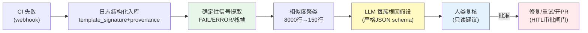

# 项目 12：研发效能 DevOps 平台 — 04-迭代三：CI/CD 诊断 Agent

> **定位**：把"构建/测试失败靠人翻日志"变成"CI 失败诊断 Agent"——日志结构化入库、确定性信号提取、相似度聚类、LLM 每簇根因假设。**关键：诊断只读，重试/修复/开 PR 必须人工审批**。教程 16 §日志 + 教程 24 §重试的落地。本文给出**完整可手写代码**（一行不省略，含全部 import）。
>
> **读者画像**：已完成 [03-迭代二-测试生成Agent](03-迭代二-测试生成Agent.md)。
>
> 「遇到阻塞？→ [教程 22-全链路可观测性 §日志]、[教程 30-容错与弹性设计 §重试]、[教程 42-响应式错误处理]；API 真实性以 [附录 05-SpringAI2-API基准] 为准」

---

## 1. 四问

| 问 | 答 |
|----|----|
| **新增了什么需求** | CI webhook 接入；日志结构化入库；确定性信号提取 + 聚类；LLM 根因假设；修复动作 HITL 审批 |
| **影响了哪些模块** | 新增 ci 包（LogIndexer/DrainTemplateMiner/ClusterService/CiDiagnosisService/CiFixApprovalManager）；复用 v1 代码索引（根因定位到代码） |
| **架构如何演进** | 诊断管线：Controller → LogIndexer(入库) → ClusterService(聚类) → CiDiagnosisService(LLM 根因) → CiFixApprovalManager(HITL 动作闸门) |
| **上一版痛点是什么** | CI 失败靠人翻日志（20 分钟）；40MB 日志 LLM 无法硬灌；修复自动执行风险 |

## 2. 诊断管线



**无结构化索引 LLM 硬灌必败**（[调研 研发效能 2026 §CI 诊断]）：失败日志入库即解析为 `template_signature + parameters[]` + provenance（commit sha / OTel trace_id）。

## 3. 完整代码（照抄即可）

### 3.1 `pom.xml` / `application.yml`

> v4 无新 Maven 依赖（JdbcClient/WebClient/Jackson 已具备）。CI webhook 为 POST 端点，复用 webflux。

### 3.2 SQL DDL（ci_log 结构化日志表）

```sql
CREATE TABLE IF NOT EXISTS ci_log (
    id                  BIGSERIAL PRIMARY KEY,
    build_id            BIGINT      NOT NULL,
    template_signature  TEXT        NOT NULL,
    parameters          TEXT,
    step_type           TEXT        NOT NULL,      -- COMPILE / TEST / DEPLOY
    commit_sha          TEXT,
    trace_id            TEXT,                      -- OTel trace 关联
    created_at          TIMESTAMPTZ NOT NULL DEFAULT now()
);

CREATE INDEX IF NOT EXISTS idx_ci_log_build ON ci_log (build_id);
CREATE INDEX IF NOT EXISTS idx_ci_log_tpl   ON ci_log (template_signature);
```

### 3.3 `LogTemplate.java` + `DrainTemplateMiner.java`（日志解析）

```java
package com.rd.devops.ci;

import java.util.List;

/** Drain 模板挖掘产物：模板签名 + 捕获的参数。 */
public record LogTemplate(String signature, List<String> parameters) {}
```

```java
package com.rd.devops.ci;

import org.springframework.stereotype.Component;

import java.util.ArrayList;
import java.util.List;
import java.util.regex.Matcher;
import java.util.regex.Pattern;

/** Drain 模板挖掘（简化版）：把可变 token（数字/十六进制/全限定类名）替换为占位符，捕获其值。 */
@Component
public class DrainTemplateMiner {

    private static final Pattern DIGITS = Pattern.compile("\\d+");
    private static final Pattern HEX = Pattern.compile("0x[0-9a-fA-F]+");
    private static final Pattern FQCN = Pattern.compile("\\b[a-z][a-zA-Z0-9]*(\\.[a-zA-Z0-9_$]+){2,}\\b");

    public LogTemplate extractTemplate(String rawLog) {
        List<String> params = new ArrayList<>();
        String signature = rawLog;
        signature = mask(signature, DIGITS, "{digits}", params);
        signature = mask(signature, HEX, "{hex}", params);
        signature = mask(signature, FQCN, "{fqcn}", params);
        return new LogTemplate(signature, params);
    }

    private String mask(String line, Pattern pattern, String placeholder, List<String> params) {
        Matcher m = pattern.matcher(line);
        StringBuffer sb = new StringBuffer();
        while (m.find()) {
            params.add(m.group());
            m.appendReplacement(sb, Matcher.quoteReplacement(placeholder));
        }
        m.appendTail(sb);
        return sb.toString();
    }
}
```

### 3.4 `LogEntry.java` + `LogIndexer.java`（日志结构化入库）

```java
package com.rd.devops.ci;

import java.util.List;

/** 结构化日志条目：template_signature + parameters + provenance。 */
public record LogEntry(
        long buildId,
        String templateSignature,
        List<String> parameters,
        String stepType,      // COMPILE / TEST / DEPLOY（勿混 Java 编译错与部署超时）
        String commitSha,
        String traceId) {}
```

```java
package com.rd.devops.ci;

import org.springframework.jdbc.core.simple.JdbcClient;
import org.springframework.stereotype.Component;

/** 失败日志 → 结构化入库（入库即解析，无结构化索引 LLM 硬灌必败）。 */
@Component
public class LogIndexer {

    private final DrainTemplateMiner miner;
    private final JdbcClient jdbcClient;

    public LogIndexer(DrainTemplateMiner miner, JdbcClient jdbcClient) {
        this.miner = miner;
        this.jdbcClient = jdbcClient;
    }

    public LogEntry ingest(String rawLog, String stepType, String commitSha, long buildId, String traceId) {
        LogTemplate tpl = miner.extractTemplate(rawLog);
        LogEntry entry = new LogEntry(buildId, tpl.signature(), tpl.parameters(), stepType, commitSha, traceId);
        jdbcClient.sql("""
                INSERT INTO ci_log(build_id, template_signature, parameters, step_type, commit_sha, trace_id)
                VALUES (:buildId, :sig, :params, :step, :sha, :trace)
                """)
                .param("buildId", entry.buildId())
                .param("sig", entry.templateSignature())
                .param("params", entry.parameters().toString())
                .param("step", entry.stepType())
                .param("sha", entry.commitSha())
                .param("trace", entry.traceId())
                .update();
        return entry;
    }
}
```

### 3.5 `LogCluster.java` + `ClusterService.java`（相似度聚类）

```java
package com.rd.devops.ci;

import java.util.List;

/** 日志簇：按 template_signature + stepType 聚合，保留代表性片段。 */
public record LogCluster(
        String stepType,
        String templateSignature,
        int size,
        List<String> representativeLines) {}
```

```java
package com.rd.devops.ci;

import org.springframework.stereotype.Service;

import java.util.List;
import java.util.Map;
import java.util.stream.Collectors;

@Service
public class ClusterService {

    /** 按 template_signature + stepType 聚类，每簇保留 ≤ maxLinesPerCluster 行代表性片段。 */
    public List<LogCluster> cluster(List<LogEntry> entries, int maxLinesPerCluster) {
        Map<String, List<LogEntry>> groups = entries.stream()
                .collect(Collectors.groupingBy(e -> e.stepType() + "|" + e.templateSignature()));
        return groups.entrySet().stream()
                .map(e -> {
                    String[] parts = e.getKey().split("\\|", 2);
                    return new LogCluster(
                            parts[0],
                            parts[1],
                            e.getValue().size(),
                            e.getValue().stream()
                                    .limit(maxLinesPerCluster)
                                    .map(en -> String.join(" ", en.parameters()))
                                    .toList());
                })
                .toList();
    }
}
```

### 3.6 `RootCauseHypothesis.java` + `CiDiagnosisService.java`（LLM 每簇根因）

```java
package com.rd.devops.ci;

/** LLM 根因假设：诊断只读，附日志证据与置信度。 */
public record RootCauseHypothesis(
        String step,
        String hypothesis,
        String evidence,
        double confidence) {}
```

```java
package com.rd.devops.ci;

import org.springframework.ai.chat.client.ChatClient;
import org.springframework.core.ParameterizedTypeReference;
import org.springframework.stereotype.Service;
import reactor.core.publisher.Mono;
import reactor.core.scheduler.Schedulers;

import java.util.List;

@Service
public class CiDiagnosisService {

    private final ChatClient chatClient;

    public CiDiagnosisService(ChatClient chatClient) {
        this.chatClient = chatClient;
    }

    /** 读聚类后的片段（不读 40MB 原始日志），LLM 每簇根因假设（严格 JSON schema）。 */
    public Mono<List<RootCauseHypothesis>> hypothesize(List<LogCluster> clusters) {
        return Mono.fromCallable(() -> chatClient.prompt()
                .system("""
                        你是 CI 诊断工程师。根据日志簇生成根因假设 JSON 数组。
                        字段: step, hypothesis, evidence, confidence(0-1)。
                        规则：诊断只读；假设需能被日志证据支持。
                        """)
                .user(clustersToPrompt(clusters))
                .call()
                .entity(new ParameterizedTypeReference<List<RootCauseHypothesis>>() {}))
            .subscribeOn(Schedulers.boundedElastic());
    }

    private String clustersToPrompt(List<LogCluster> clusters) {
        StringBuilder sb = new StringBuilder();
        for (LogCluster c : clusters) {
            sb.append("### step=").append(c.stepType())
              .append(" 出现次数=").append(c.size()).append("\n");
            for (String line : c.representativeLines()) {
                sb.append("- ").append(line).append("\n");
            }
            sb.append("\n");
        }
        return sb.toString();
    }
}
```

### 3.7 `ApprovalRequiredException.java` + `FixApprovalStore.java` + `CiFixApprovalManager.java`（修复 HITL 审批闸门）

```java
package com.rd.devops.ci;

/** 动作工具未获人工审批时抛出——意图已定、执行未发生。 */
public class ApprovalRequiredException extends RuntimeException {

    private final String toolName;
    private final String arguments;

    public ApprovalRequiredException(String toolName, String arguments) {
        super("工具需要人工审批: " + toolName);
        this.toolName = toolName;
        this.arguments = arguments;
    }

    public String toolName() { return toolName; }
    public String arguments() { return arguments; }
}
```

```java
package com.rd.devops.ci;

import org.springframework.ai.model.tool.ToolCall;
import org.springframework.stereotype.Component;

import java.util.Map;
import java.util.concurrent.ConcurrentHashMap;

/** 审批暂存：工具调用 id → 是否已获人工批准。 */
@Component
public class FixApprovalStore {

    private final Map<String, Boolean> approvals = new ConcurrentHashMap<>();

    public boolean isApproved(ToolCall call) {
        return Boolean.TRUE.equals(approvals.get(call.id()));
    }

    public void approve(String toolCallId) {
        approvals.put(toolCallId, true);
    }

    public void reject(String toolCallId) {
        approvals.put(toolCallId, false);
    }
}
```

```java
package com.rd.devops.ci;

import org.springframework.ai.chat.model.ChatResponse;
import org.springframework.ai.chat.model.Generation;
import org.springframework.ai.chat.prompt.Prompt;
import org.springframework.ai.model.tool.ToolCall;
import org.springframework.ai.model.tool.ToolCallingChatOptions;
import org.springframework.ai.model.tool.ToolExecutionResult;
import org.springframework.ai.tool.ToolCallingManager;
import org.springframework.stereotype.Component;

import java.util.List;

/**
 * CI 修复动作 HITL 审批闸门（ToolCallingManager 装饰器——工具执行层的唯一稳定拦截点）。
 * 拦截 applyFix/retryBuild/openPr 等"动作"工具：人工未批准即抛异常（AI 不做生产部署）。
 */
@Component
public class CiFixApprovalManager implements ToolCallingManager {

    private static final List<String> ACTION_TOOLS = List.of("applyFix", "retryBuild", "openPr");

    private final ToolCallingManager delegate;
    private final FixApprovalStore approvalStore;

    public CiFixApprovalManager(ToolCallingManager delegate, FixApprovalStore approvalStore) {
        this.delegate = delegate;
        this.approvalStore = approvalStore;
    }

    @Override
    public ToolExecutionResult executeToolCalls(Prompt prompt, ChatResponse chatResponse) {
        List<ToolCall> actions = extractToolCalls(chatResponse).stream()
                .filter(c -> ACTION_TOOLS.contains(c.name()))
                .toList();
        for (ToolCall call : actions) {
            if (!approvalStore.isApproved(call)) {
                throw new ApprovalRequiredException(call.name(), call.arguments());
            }
        }
        return delegate.executeToolCalls(prompt, chatResponse);
    }

    private List<ToolCall> extractToolCalls(ChatResponse chatResponse) {
        return chatResponse.getResults().stream()
                .map(g -> g.getOutput().getToolCalls())
                .flatMap(List::stream)
                .toList();
    }
}
```

### 3.8 `CiDiagnosisController.java`

```java
package com.rd.devops.web;

import com.rd.devops.ci.CiDiagnosisService;
import com.rd.devops.ci.ClusterService;
import com.rd.devops.ci.LogCluster;
import com.rd.devops.ci.LogEntry;
import com.rd.devops.ci.LogIndexer;
import com.rd.devops.ci.RootCauseHypothesis;
import org.springframework.web.bind.annotation.PostMapping;
import org.springframework.web.bind.annotation.RequestBody;
import org.springframework.web.bind.annotation.RequestMapping;
import org.springframework.web.bind.annotation.RestController;
import reactor.core.publisher.Mono;
import reactor.core.scheduler.Schedulers;

import java.util.List;

@RestController
@RequestMapping("/api/v1/ci")
public class CiDiagnosisController {

    private final LogIndexer logIndexer;
    private final ClusterService clusterService;
    private final CiDiagnosisService diagnosisService;

    public CiDiagnosisController(LogIndexer logIndexer, ClusterService clusterService,
                                 CiDiagnosisService diagnosisService) {
        this.logIndexer = logIndexer;
        this.clusterService = clusterService;
        this.diagnosisService = diagnosisService;
    }

    /** CI 失败 webhook → 入库 → 聚类 → LLM 根因（只读，无副作用）。 */
    @PostMapping("/diagnose")
    public Mono<DiagnosisResult> diagnose(@RequestBody CiFailureRequest req) {
        // 入库（JDBC 阻塞）+ 聚类，整体放 boundedElastic，EventLoop 不 block
        Mono<List<LogCluster>> clustersMono = Mono.fromCallable(() -> {
            List<LogEntry> entries = req.rawLogs().stream()
                    .map(line -> logIndexer.ingest(line, req.stepType(), req.commitSha(),
                            req.buildId(), req.traceId()))
                    .toList();
            return clusterService.cluster(entries, 150);
        }).subscribeOn(Schedulers.boundedElastic());
        return clustersMono.flatMap(clusters ->
                diagnosisService.hypothesize(clusters)
                        .map(hypotheses -> new DiagnosisResult(clusters.size(), hypotheses)));
    }

    public record CiFailureRequest(long buildId, String stepType, String commitSha,
                                   String traceId, List<String> rawLogs) {}

    public record DiagnosisResult(int clusterCount, List<RootCauseHypothesis> hypotheses) {}
}
```

## 4. 验收标准（量化）

| # | 验收项 | 标准 |
|---|--------|------|
| 1 | 定位时效 | 失败定位从 20 分钟 → ≤ 2 分钟（聚类 + LLM 根因） |
| 2 | 根因准确 | 常见失败（编译错/测试失败/部署超时）根因一致率 ≥ 80% |
| 3 | 日志结构化 | 失败日志 100% 解析为 template_signature + provenance |
| 4 | 诊断只读 | 诊断不触发任何执行动作（无副作用） |
| 5 | 修复审批 | 修复/重试/开 PR 100% 走人工审批闸门 |

## 5. 本迭代的 ADR

| # | 决策 | 理由 |
|---|------|------|
| ADR-712 | 日志结构化入库 + 聚类先行 | 无结构化索引 LLM 硬灌必败（[调研]） |
| ADR-713 | 诊断只读，修复 HITL 审批 | AI 不做生产部署是行业底线 |
| ADR-714 | 聚类键含 stepType | 勿混 Java 编译错与部署超时 |

## 6. v4 的痛点（驱动下一迭代）

CI 诊断能定位单类失败，但**评审还是单 Agent 视角**：一个 PR 既涉及安全（越权）、又涉及性能（N+1 查询）、又涉及架构——单 Agent 审查顾此失彼。**需要多 Agent 评审流水线**。→ [05-迭代四-多Agent评审流水线.md](05-迭代四-多Agent评审流水线.md)

---

## 7. 总结

v4 把 CI 失败诊断从人翻日志变成"结构化 + 聚类 + LLM 根因"：`DrainTemplateMiner` 把日志抽成 template_signature + 参数（无结构化索引 LLM 硬灌必败）、`ClusterService` 把 8000 行聚成 ≤150 行/簇、`CiDiagnosisService` 用真实 `entity(ParameterizedTypeReference)` 每簇产出根因假设。**关键落点**：诊断只读，`CiFixApprovalManager` 作为 `ToolCallingManager` 装饰器拦截 applyFix/retryBuild/openPr 动作——这正是 [教程 22 §正确落点] 的 HITL 实现。
