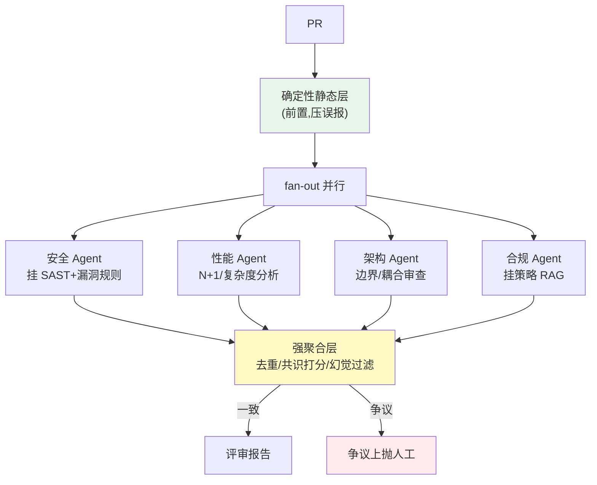

# 项目 12：研发效能 DevOps 平台 — 05-多 Agent 评审流水线

> **定位**：把"单 Agent 审查"升级为"并行专业 Sub-Agent（架构/安全/性能/合规）fan-out + 强聚合层"——确定性静态层前置把误报压到 < 5%，聚合层做去重/共识/幻觉过滤/争议上抛。教程 09 多 Agent + 教程 36 工作流的落地。本文给出**完整可手写代码**（一行不省略，含全部 import）。
>
> **读者画像**：已完成 [04-CICD诊断Agent](04-CICD诊断Agent.md)。
>
> 「遇到阻塞？→ [教程 09-多Agent协作]、[教程 36-Agent工作流编排]、[教程 14-Advisor链与拦截器 §顺序]；API 真实性以 [附录 05-SpringAI2-API基准] 为准」

---

## 1. 四问

| 问 | 答 |
|----|----|
| **新增了什么需求** | 多 Agent 并行评审（各自独立 System Prompt + 工具集）；聚合裁决；争议上抛 HITL |
| **影响了哪些模块** | 新增 multi-review 编排（ReviewAgentConfig/ReviewOrchestrator/ReviewAggregator）；复用 v2 静态层 + 误报学习库；DAG 表达流程（v6 完善） |
| **架构如何演进** | 单 Agent → 并行专家 Sub-Agent（fan-out）+ 强聚合层；专家 = 独立 ChatClient Bean + 专属工具 |
| **上一版痛点是什么** | 单 Agent 审查顾此失彼；评论重复/矛盾；聚合 Agent 重新审查降低 precision |

### 1.1 本节核对（四问口径）

| # | 核对项 | 判据 |
|---|--------|------|
| 1 | 四问齐全且痛点承接 | 四行均有；痛点（单Agent顾此失彼、评论重复矛盾）对应对 [04 痛点 §6] |
| 2 | 架构链可落地 | `静态层→fan-out 四专家→强聚合层→报告/争议上抛` 各环节在 §3 均有完整类 |
| 3 | 复用关系明确 | 复用 v2 静态层+误报库、v3 CodeIndexService，与 [02]/[03] 公共组件一致 |

## 2. 多 Agent 评审架构



**专家角色 = 可配置 Sub-Agent 模板**（[调研 研发效能 2026 §多 Agent]）：独立 ChatClient Bean + 专属 System Prompt + 专属工具集（安全 Agent 挂 SAST、合规 Agent 挂策略 RAG）。

### 2.1 本节核对（fan-out 架构与聚合红线）

| # | 核对项 | 判据 |
|---|--------|------|
| 1 | 四专家与工具集对应 | 安全↔SastTools、性能↔CodeIndexTools、合规↔CompliancePolicyRetriever、架构无工具，与 §3.2 Bean 一致 |
| 2 | 聚合红线可读 | 一致→报告、争议→人工；聚合层禁止重审，与 §3.6"只融合"一致 |

## 3. 完整代码（照抄即可）

> v5 无新 Maven 依赖。复用 v2 的 `GitApi/LocalGitApi/SemgrepRunner/StaticFinding/ReviewComment/PrContext/Diff` 与 v3 的 `CodeIndexService`（本节补充其 `validLocation` 幻觉过滤方法）。

### 3.1 专家 Sub-Agent 工具集

**`SastTools.java`（安全 Agent 专属：挂 SAST）**：

```java
package com.rd.devops.review;

import org.springframework.ai.tool.annotation.Tool;
import org.springframework.ai.tool.annotation.ToolParam;
import org.springframework.stereotype.Component;

import java.util.List;

/** 安全 Agent 专属工具：挂 SAST 结果交叉确认（工具层，不是 Advisor——HITL 落点见 [教程 28-Human-in-the-Loop与审批流]）。 */
@Component
public class SastTools {

    private final SemgrepRunner semgrep;

    public SastTools(SemgrepRunner semgrep) {
        this.semgrep = semgrep;
    }

    @Tool(description = "对指定文件跑 Semgrep 静态扫描，返回确定性发现（安全评论必须交叉确认）")
    public List<StaticFinding> sastScan(@ToolParam(description = "文件路径") String filePath) {
        PrContext singleFile = new PrContext("core", 0,
                new Diff(List.of(new Diff.ChangedFile(filePath, ""))), List.of());
        return semgrep.run(singleFile);
    }
}
```

**`CodeIndexTools.java`（性能 Agent 专属：引用调用方数据）**：

```java
package com.rd.devops.review;

import org.springframework.ai.tool.annotation.Tool;
import org.springframework.ai.tool.annotation.ToolParam;
import org.springframework.stereotype.Component;

import java.util.List;

/** 性能 Agent 专属工具：查询源码/真实调用方（N+1 与资源泄漏分析）。 */
@Component
public class CodeIndexTools {

    private final CodeIndexService codeIndexService;

    public CodeIndexTools(CodeIndexService codeIndexService) {
        this.codeIndexService = codeIndexService;
    }

    @Tool(description = "查询指定类的源码")
    public String source(@ToolParam(description = "类全限定名") String qualifiedName) {
        return codeIndexService.getSource(qualifiedName);
    }

    @Tool(description = "查询指定类的真实调用方（N+1/资源泄漏分析）")
    public List<String> callers(@ToolParam(description = "类全限定名") String qualifiedName) {
        return codeIndexService.getCallers(qualifiedName);
    }
}
```

**`CompliancePolicyRetriever.java`（合规 Agent 专属：策略 RAG）**：

```java
package com.rd.devops.review;

import org.springframework.ai.document.Document;
import org.springframework.ai.tool.annotation.Tool;
import org.springframework.ai.tool.annotation.ToolParam;
import org.springframework.ai.vectorstore.SearchRequest;
import org.springframework.ai.vectorstore.VectorStore;
import org.springframework.stereotype.Component;

import java.util.List;

/** 合规 Agent 的策略 RAG 工具：检索合规策略库（License/数据合规/出口管制）。 */
@Component
public class CompliancePolicyRetriever {

    private final VectorStore vectorStore;

    public CompliancePolicyRetriever(VectorStore vectorStore) {
        this.vectorStore = vectorStore;
    }

    @Tool(description = "按主题检索企业合规策略（license、数据出境、出口管制等）")
    public String retrievePolicy(@ToolParam(description = "策略主题关键词") String topic) {
        List<Document> docs = vectorStore.similaritySearch(
                SearchRequest.builder().query(topic).topK(3).build());
        StringBuilder sb = new StringBuilder();
        for (Document d : docs) {
            sb.append(d.getText()).append("\n");
        }
        return sb.toString();
    }
}
```

### 3.2 `ReviewAgentConfig.java`（专家 Sub-Agent 模板）

```java
package com.rd.devops.review;

import org.springframework.ai.chat.client.ChatClient;
import org.springframework.context.annotation.Bean;
import org.springframework.context.annotation.Configuration;

/** 专家 Sub-Agent 模板：独立 ChatClient Bean + 专属 System Prompt + 专属工具集。 */
@Configuration
public class ReviewAgentConfig {

    @Bean
    public ChatClient securityReviewer(ChatClient.Builder builder, SastTools sastTools) {
        return builder
                .defaultSystem("你是安全评审工程师。审查越权/注入/弱加密/密钥硬编码，挂 SAST 结果交叉确认。")
                .defaultTools(sastTools)
                .build();
    }

    @Bean
    public ChatClient performanceReviewer(ChatClient.Builder builder, CodeIndexTools codeIndexTools) {
        return builder
                .defaultSystem("你是性能评审工程师。审查 N+1 查询/复杂度/资源泄漏，引用调用方数据。")
                .defaultTools(codeIndexTools)
                .build();
    }

    @Bean
    public ChatClient architectureReviewer(ChatClient.Builder builder) {
        return builder
                .defaultSystem("你是架构评审工程师。审查模块边界/依赖方向/耦合。")
                .build();
    }

    @Bean
    public ChatClient complianceReviewer(ChatClient.Builder builder, CompliancePolicyRetriever policyRetriever) {
        return builder
                .defaultSystem("你是合规评审工程师。依据策略库审查许可证/数据合规/出口管制。")
                .defaultTools(policyRetriever)
                .build();
    }
}
```

### 3.3 `CodeIndexService.java`（v3 类补充 `validLocation` 幻觉过滤）

```java
package com.rd.devops.index;

import org.springframework.beans.factory.annotation.Value;
import org.springframework.jdbc.core.simple.JdbcClient;
import org.springframework.stereotype.Service;

import java.io.IOException;
import java.nio.file.Files;
import java.nio.file.Path;
import java.util.List;

@Service
public class CodeIndexService {

    private final JdbcClient jdbcClient;

    @Value("${repo.local-root:/work/core-repo}")
    private String repoRoot;

    public CodeIndexService(JdbcClient jdbcClient) {
        this.jdbcClient = jdbcClient;
    }

    public String getSource(String qualifiedName) {
        return jdbcClient.sql("""
                SELECT string_agg(body, E'\n') AS source
                FROM code_chunk
                WHERE qualified_name LIKE :qn
                """)
                .param("qn", qualifiedName + "#%")
                .query(String.class)
                .optional()
                .orElse("（未索引到源码）");
    }

    public List<String> getCallers(String qualifiedName) {
        return List.of("（调用方依赖精确符号图，v6 补齐）");
    }

    public List<String> getHistoricalBugs(String qualifiedName) {
        return List.of("（历史 bug 依赖缺陷库接入，暂为空）");
    }

    /** 幻觉过滤：file:line 必须落在索引仓库真实文件的有效行区间。 */
    public boolean validLocation(String filePath, int line) {
        Path p = Path.of(repoRoot, filePath);
        if (!Files.isRegularFile(p)) {
            return false;
        }
        try {
            return line >= 1 && line <= Files.readAllLines(p).size();
        } catch (IOException e) {
            return false;
        }
    }
}
```

### 3.4 `ReviewReport.java` + `Disputed.java`（聚合产物）

```java
package com.rd.devops.review;

import java.util.List;
import java.util.Map;

/** 聚合评审报告：评论 + 共识命中数 + 争议列表。 */
public record ReviewReport(
        List<ReviewComment> comments,
        Map<String, Integer> consensus,
        List<Disputed> disputes) {

    public boolean hasDisputes() {
        return !disputes.isEmpty();
    }
}
```

```java
package com.rd.devops.review;

/** 争议项：不同 Agent 对同一 hunk 结论冲突，需上抛人工。 */
public record Disputed(String file, int line, String message) {}
```

### 3.5 `ReviewOrchestrator.java`（并行 fan-out + 聚合）

```java
package com.rd.devops.review;

import org.springframework.ai.chat.client.ChatClient;
import org.springframework.core.ParameterizedTypeReference;
import org.springframework.stereotype.Component;
import reactor.core.publisher.Mono;
import reactor.core.scheduler.Schedulers;

import java.util.List;

/** fan-out：四个专家并行评审同一 PR，Mono.zip 汇聚（WebFlux 正确姿势，EventLoop 不 block）。 */
@Component
public class ReviewOrchestrator {

    private final ChatClient securityReviewer;
    private final ChatClient performanceReviewer;
    private final ChatClient architectureReviewer;
    private final ChatClient complianceReviewer;
    private final ReviewAggregator aggregator;

    public ReviewOrchestrator(ChatClient securityReviewer,
                              ChatClient performanceReviewer,
                              ChatClient architectureReviewer,
                              ChatClient complianceReviewer,
                              ReviewAggregator aggregator) {
        this.securityReviewer = securityReviewer;
        this.performanceReviewer = performanceReviewer;
        this.architectureReviewer = architectureReviewer;
        this.complianceReviewer = complianceReviewer;
        this.aggregator = aggregator;
    }

    public Mono<ReviewReport> reviewInParallel(PrContext ctx) {
        Mono<List<ReviewComment>> security = review(securityReviewer, ctx);
        Mono<List<ReviewComment>> performance = review(performanceReviewer, ctx);
        Mono<List<ReviewComment>> architecture = review(architectureReviewer, ctx);
        Mono<List<ReviewComment>> compliance = review(complianceReviewer, ctx);

        return Mono.zip(security, performance, architecture, compliance)
                .map(t -> aggregator.aggregate(List.of(t.getT1(), t.getT2(), t.getT3(), t.getT4())));
    }

    private Mono<List<ReviewComment>> review(ChatClient reviewer, PrContext ctx) {
        return Mono.fromCallable(() -> reviewer.prompt()
                .user(ctx.toPrompt())
                .call()
                .entity(new ParameterizedTypeReference<List<ReviewComment>>() {}))
            .subscribeOn(Schedulers.boundedElastic());
    }
}
```

### 3.6 `ReviewAggregator.java`（强聚合层：去重/共识/幻觉过滤/争议上抛）

```java
package com.rd.devops.review;

import com.rd.devops.index.CodeIndexService;
import org.springframework.stereotype.Component;

import java.util.ArrayList;
import java.util.HashSet;
import java.util.List;
import java.util.Map;
import java.util.Set;
import java.util.stream.Collectors;

/** 强聚合层：只做融合，禁止重新评审（对撕式重审实证性降低 precision，[调研 §聚合裁决]）。 */
@Component
public class ReviewAggregator {

    private final CodeIndexService codeIndex;

    public ReviewAggregator(CodeIndexService codeIndex) {
        this.codeIndex = codeIndex;
    }

    public ReviewReport aggregate(List<List<ReviewComment>> perAgentComments) {
        // ① 语义去重（同一 file:line + 同类别的评论合并）
        List<ReviewComment> deduped = semanticDedup(flatten(perAgentComments));
        // ② 共识打分：每条评论命中几个 Agent（[3/4 agents] 高置信）
        Map<String, Integer> consensus = countAgents(deduped, perAgentComments);
        // ③ 幻觉过滤：无代码依据（file:line 不可用）的评论丢弃
        List<ReviewComment> grounded = deduped.stream()
                .filter(c -> codeIndex.validLocation(c.file(), c.line()))
                .toList();
        // ④ 争议上抛：critical 评论被其他 Agent 矛盾 → HITL（不静默采纳任一方）
        List<Disputed> disputes = findDisputes(grounded, perAgentComments);
        return new ReviewReport(grounded, consensus, disputes);
    }

    private List<ReviewComment> flatten(List<List<ReviewComment>> perAgent) {
        return perAgent.stream().flatMap(List::stream).toList();
    }

    private List<ReviewComment> semanticDedup(List<ReviewComment> all) {
        Set<String> seen = new HashSet<>();
        List<ReviewComment> out = new ArrayList<>();
        for (ReviewComment c : all) {
            String key = c.file() + "#" + c.line() + "#" + c.category();
            if (seen.add(key)) {
                out.add(c);
            }
        }
        return out;
    }

    private Map<String, Integer> countAgents(List<ReviewComment> deduped,
                                             List<List<ReviewComment>> perAgent) {
        return deduped.stream().collect(Collectors.toMap(
                c -> c.file() + "#" + c.line(),
                c -> (int) perAgent.stream()
                        .filter(agentList -> agentList.stream()
                                .anyMatch(a -> a.file().equals(c.file()) && a.line() == c.line()))
                        .count(),
                Integer::sum));
    }

    private List<Disputed> findDisputes(List<ReviewComment> grounded,
                                        List<List<ReviewComment>> perAgent) {
        List<Disputed> disputes = new ArrayList<>();
        for (ReviewComment c : grounded) {
            boolean contradicted = perAgent.stream().flatMap(List::stream)
                    .anyMatch(a -> a.file().equals(c.file()) && a.line() == c.line()
                            && c.severity().equals("critical")
                            && !a.severity().equals("critical"));
            if (contradicted) {
                disputes.add(new Disputed(c.file(), c.line(), c.message()));
            }
        }
        return disputes;
    }
}
```

### 3.7 `MultiReviewController.java`

```java
package com.rd.devops.web;

import com.rd.devops.review.Diff;
import com.rd.devops.review.GitApi;
import com.rd.devops.review.PrContext;
import com.rd.devops.review.ReviewOrchestrator;
import com.rd.devops.review.ReviewReport;
import com.rd.devops.index.SymbolGraph;
import org.springframework.web.bind.annotation.PathVariable;
import org.springframework.web.bind.annotation.PostMapping;
import org.springframework.web.bind.annotation.RequestMapping;
import org.springframework.web.bind.annotation.RestController;
import reactor.core.publisher.Mono;
import reactor.core.scheduler.Schedulers;

@RestController
@RequestMapping("/api/v1/multi-review")
public class MultiReviewController {

    private final GitApi gitApi;
    private final SymbolGraph symbolGraph;
    private final ReviewOrchestrator orchestrator;

    public MultiReviewController(GitApi gitApi, SymbolGraph symbolGraph, ReviewOrchestrator orchestrator) {
        this.gitApi = gitApi;
        this.symbolGraph = symbolGraph;
        this.orchestrator = orchestrator;
    }

    @PostMapping("/{repo}/{pr}")
    public Mono<ReviewReport> review(@PathVariable String repo, @PathVariable int pr) {
        // diff/符号提取为阻塞（git/文件），放 boundedElastic，EventLoop 不 block
        return Mono.fromCallable(() -> {
                    Diff diff = gitApi.getDiff(repo, pr);
                    return new PrContext(repo, pr, diff, symbolGraph.extractChangedMethods(diff));
                })
                .subscribeOn(Schedulers.boundedElastic())
                .flatMap(orchestrator::reviewInParallel);
    }
}
```

### 3.8 本节测试与验证（四专家并行 fan-out + 强聚合）

**前置条件**：复用 v2（静态层/误报库）与 v3（CodeIndexService）代码存在；`DEEPSEEK_API_KEY` 已设置；Git 本地工作副本 `REPO_ROOT/core-repo` 有 `pr-N` 分支相对 main 有 Java 改动；合规策略已向量化入库（`retrievePolicy` 依赖 pgvector）；服务按 §3.1-§3.7 照抄并启动。

**材料 A——并行评审请求**：

```sh
curl -s -X POST http://localhost:8080/api/v1/multi-review/core/101
```

**材料 B——幻觉过滤核对（正文 §3.3 validLocation 同款判据）**：

```sh
# 取改动文件真实行数，判断评论 file:line 是否落在有效区间
wc -l $REPO_ROOT/core-repo/src/main/java/.../SignInService.java
```

**步骤与断言**：

| # | 操作 | 预期（PASS 判据） |
|---|------|------------------|
| 1 | 材料 A POST | 返回 `ReviewReport` JSON：含 comments（合并后）、consensus（file#line→命中 Agent 数）、disputes |
| 2 | fan-out 并行 | 四个专家由 `Mono.zip` 并行，总耗时接近单 Agent（不线性累加）；日志无 `block()` 报警 |
| 3 | 工具集隔离 | 安全 Agent 可调 `sastScan`、性能 Agent 可调 `callers`/`source`、合规 Agent 可调 `retrievePolicy`；架构 Agent 无工具也不报错 |
| 4 | 语义去重 | 同一 file:line+category 评论被合并（`semanticDedup`）→ 重复评论合并率符合验收 3 |
| 5 | 幻觉过滤 | 评论 file:line 超出文件实际行数（材料 B 比对）被 `validLocation` 丢弃，不出现无代码依据评论 |
| 6 | 争议上抛 | 若某 hunk 的 critical 评论被其他 Agent 非 critical 矛盾 → 进入 disputes，报告 hasDisputes()=true（不静默采纳） |
| 7 | 聚合不重审 | 聚合层零 LLM 调用（只做去重/打分/过滤/争议判定），无再次 review 的日志 |

**失败排查**：①评审 5xx→`pr-N` 分支不存在或 `repo.local-root` 配错；②四路结果缺失→四个 `ChatClient` Bean（security/performance/architecture/compliance）未全装配，核对 §3.2；③`retrievePolicy` 返回空→合规策略未入库或 pgvector 未装；④`validLocation` 全 false 导致评论被剔光→`repo.local-root` 与实际工作副本 root 不一致，或改动文件是新增（物理文件尚不存在）；⑤dedup 过度合并→key（file#line#category）过粗，多 Agent 意图不同的评论被合并。

## 4. 验收标准（量化）

| # | 验收项 | 标准 |
|---|--------|------|
| 1 | 覆盖提升 | 多 Agent 发现的问题数 ≥ 单 Agent 2 倍（安全/性能/架构分域） |
| 2 | 误报率 | 聚合后误报率 < 5%（静态层前置 + 幻觉过滤） |
| 3 | 去重有效 | 多 Agent 重复评论合并率 ≥ 90% |
| 4 | 争议上抛 | 冲突评论 100% 上抛人工（不静默采纳任一方） |
| 5 | 聚合不重审 | 聚合层零重新审查（只融合） |

### 4.1 本节核对（验收口径）

| # | 核对项 | 判据 |
|---|--------|------|
| 1 | 验收项可度量 | 五项均含数值/可判定标准（≥2倍、<5%、≥90%、100% 上抛、零重审），非空话 |
| 2 | 每项有代码落点 | 覆盖→§3.5 四专家 fan-out；误报→静态层+§3.6 validLocation；去重→semanticDedup；争议→findDisputes；不重审→aggregate 零 LLM |

## 5. 本迭代的 ADR

| # | 决策 | 理由 |
|---|------|------|
| ADR-715 | 并行专业 Sub-Agent + 强聚合 | 分域深度 + 融合共识；对撕式重审降低 precision |
| ADR-716 | 聚合层去重/共识/幻觉过滤/争议上抛 | 聚合是成败核心（CodeRabbit/阿里 OCR 模式） |
| ADR-717 | 静态层前置压误报 | 专家 Agent 专注语义，确定性检查先行 |

### 5.1 本节核对（ADR 715-717 一致性）

| # | 核对项 | 判据 |
|---|--------|------|
| 1 | 每条 ADR 有代码落点 | 715→§3.5 fan-out+§3.6 强聚合；716→§3.6 四职能；717→§3.0 静态层前置 |
| 2 | 与 13-ADR 总账衔接 | ADR-715/716/717 在 [13-ADR架构决策记录] 存在，编号与 04 预录 714 衔接 |

## 6. v5 的痛点（驱动下一迭代）

多 Agent 评审跑通了，但**流程是硬编码**：安全评审先于合规、性能评审可并行——当前的 Java 代码里流程写死，改顺序要改代码。**需要工作流编排**（DAG + 状态机）。→ [06-工作流编排.md](06-工作流编排.md)

> 本节核对（一句话）：V5 痛点（流程硬编码、改顺序要改代码）与下一迭代 [06]"DAG + 状态机"方案一一对应，痛点不被搁置即 PASS。

---

## 7. 总结

v5 把单 Agent 审查升级为"并行专家 + 强聚合"：`ReviewAgentConfig` 用独立 ChatClient Bean 表达四个专家（安全挂 `SastTools`、性能挂 `CodeIndexTools`、合规挂 `CompliancePolicyRetriever` 策略 RAG），`ReviewOrchestrator` 用 `Mono.zip` 并行 fan-out（真实 `ParameterizedTypeReference` 泛型容器），`ReviewAggregator` 只做去重/共识/幻觉过滤/争议上抛、**禁止重新评审**。工具集用真实 `@Tool` + `@ToolParam` 注解（无 `@ToolMethod`）。

> 本节核对（一句话）：总结中六个组件（ReviewAgentConfig、SastTools、CodeIndexTools、CompliancePolicyRetriever、ReviewOrchestrator、ReviewAggregator）与正文 §3.2/§3.1/§3.5/§3.6 对应，口径一致即 PASS。
